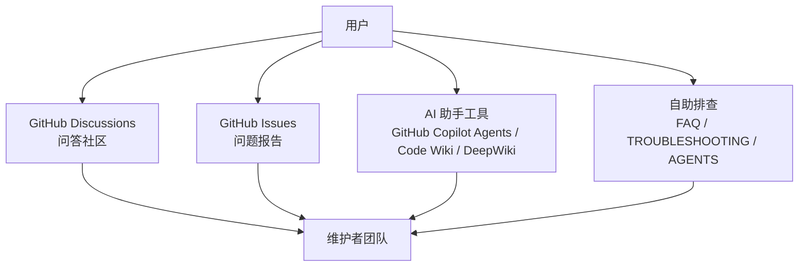
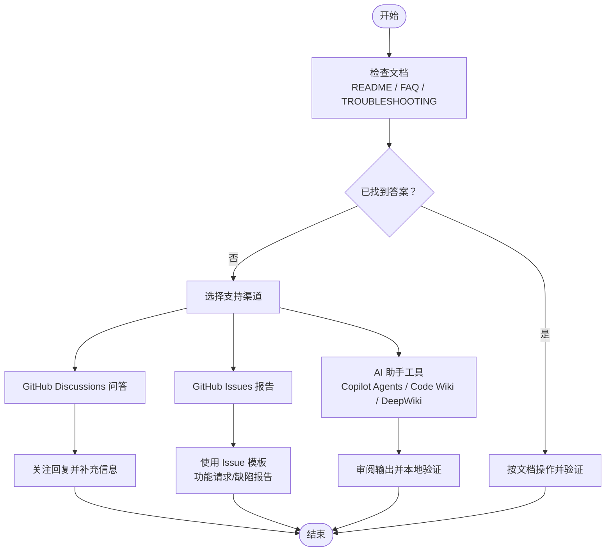
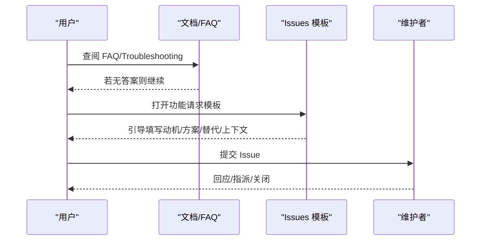
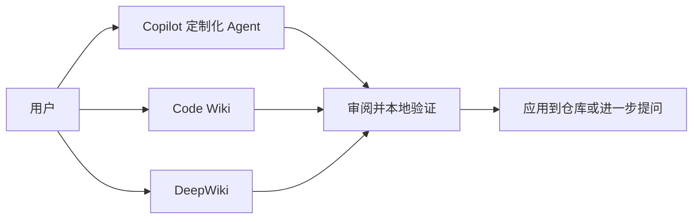
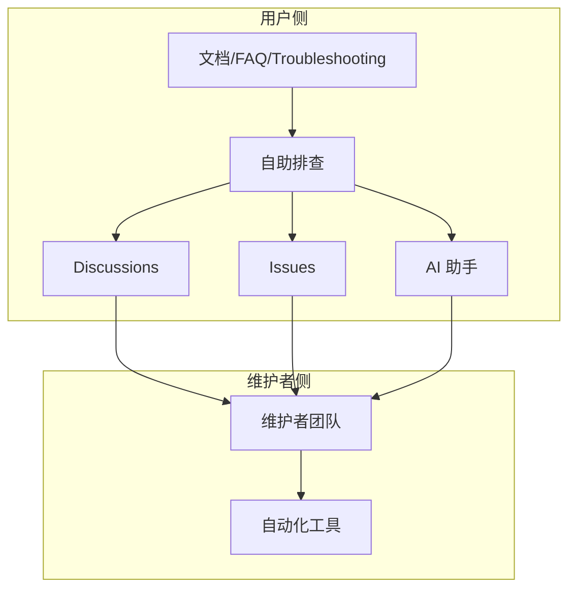

# 社区支持和帮助

<cite>
**本文引用的文件**
- [README.md](file://README.md)
- [CONTRIBUTING.md](file://CONTRIBUTING.md)
- [FAQ.md](file://FAQ.md)
- [TROUBLESHOOTING.md](file://TROUBLESHOOTING.md)
- [AGENTS.md](file://AGENTS.md)
- [.github/ISSUE_TEMPLATE/2_feature_request.yml](file://.github/ISSUE_TEMPLATE/2_feature_request.yml)
- [.github/GIT_WORKFLOW.md](file://.github/GIT_WORKFLOW.md)
- [_config.yml](file://_config.yml)
</cite>

## 目录
1. [简介](#简介)
2. [项目结构](#项目结构)
3. [核心组件](#核心组件)
4. [架构总览](#架构总览)
5. [详细组件分析](#详细组件分析)
6. [依赖关系分析](#依赖关系分析)
7. [性能考量](#性能考量)
8. [故障排查指南](#故障排查指南)
9. [结论](#结论)
10. [附录](#附录)

## 简介
本文件面向使用 al-folio 主题的用户与贡献者，系统化地介绍社区支持与帮助体系，包括：
- 获取技术支持的渠道：GitHub Discussions 问答社区、GitHub Issues 问题报告、AI 助手工具（GitHub Copilot Agents、Code Wiki、DeepWiki）
- 有效提问与问题报告的技巧与模板
- 常见问题的自助解决方案与资源链接
- 社区贡献方式：问题反馈、功能建议、代码贡献、文档改进

## 项目结构
围绕“社区支持与帮助”的关键文档与机制分布如下：
- 顶层文档：README.md、CONTRIBUTING.md、FAQ.md、TROUBLESHOOTING.md、AGENTS.md
- 问题模板：.github/ISSUE_TEMPLATE/2_feature_request.yml
- 提交规范：.github/GIT_WORKFLOW.md
- 配置参考：_config.yml（站点基础配置、评论系统、搜索等）

**图表来源**
- [README.md:1-561](file://README.md#L1-L561)
- [CONTRIBUTING.md:1-103](file://CONTRIBUTING.md#L1-L103)
- [FAQ.md:1-176](file://FAQ.md#L1-L176)
- [TROUBLESHOOTING.md:1-455](file://TROUBLESHOOTING.md#L1-L455)
- [AGENTS.md:1-82](file://AGENTS.md#L1-L82)

**章节来源**
- [README.md:29-289](file://README.md#L29-L289)
- [CONTRIBUTING.md:87-96](file://CONTRIBUTING.md#L87-L96)
- [FAQ.md:3-28](file://FAQ.md#L3-L28)
- [TROUBLESHOOTING.md:426-448](file://TROUBLESHOOTING.md#L426-L448)

## 核心组件
- 技术支持渠道
  - GitHub Discussions：用于问答与经验分享
  - GitHub Issues：用于缺陷报告与功能请求
  - AI 助手工具：GitHub Copilot Agents、Code Wiki、DeepWiki
- 问题报告与提问规范
  - 使用 Issue 模板（功能请求）
  - 提供标准格式的问题描述（重现步骤、预期/实际结果、环境信息）
  - 有效提问技巧（先查文档/讨论/已知问题）
- 自助排查与资源
  - FAQ 与 Troubleshooting Guide
  - AGENTS.md 的本地开发与预检清单
- 社区贡献
  - 贡献指南与提交规范
  - 小修小补可直接 PR；复杂问题先开 Issue

**章节来源**
- [CONTRIBUTING.md:87-96](file://CONTRIBUTING.md#L87-L96)
- [FAQ.md:141-176](file://FAQ.md#L141-L176)
- [.github/ISSUE_TEMPLATE/2_feature_request.yml:1-57](file://.github/ISSUE_TEMPLATE/2_feature_request.yml#L1-L57)
- [AGENTS.md:33-53](file://AGENTS.md#L33-L53)

## 架构总览
下图展示用户在不同阶段选择支持路径的决策流程。

**图表来源**
- [README.md:29-289](file://README.md#L29-L289)
- [CONTRIBUTING.md:87-96](file://CONTRIBUTING.md#L87-L96)
- [FAQ.md:3-28](file://FAQ.md#L3-L28)
- [TROUBLESHOOTING.md:426-448](file://TROUBLESHOOTING.md#L426-L448)
- [.github/ISSUE_TEMPLATE/2_feature_request.yml:1-57](file://.github/ISSUE_TEMPLATE/2_feature_request.yml#L1-L57)

## 详细组件分析

### GitHub Discussions 问答社区
- 用途：交流使用经验、寻求帮助、分享最佳实践
- 入口：README 中提供 Discussions 链接
- 建议：提问前先搜索已有话题，避免重复；回答问题时提供可复现信息与环境细节

**章节来源**
- [README.md:29-289](file://README.md#L29-L289)
- [FAQ.md:3-28](file://FAQ.md#L3-L28)

### GitHub Issues 问题报告
- 适用场景：缺陷报告、功能请求
- 提交前要求：
  - 已阅读 FAQ 并确认非已知问题
  - 搜索历史 Issue，避免重复
  - 仅提出 bug 或功能请求；疑问请去 Discussions
- 使用模板：功能请求模板包含动机、方案、替代方案、上下文等字段

**图表来源**
- [CONTRIBUTING.md:87-96](file://CONTRIBUTING.md#L87-L96)
- [.github/ISSUE_TEMPLATE/2_feature_request.yml:1-57](file://.github/ISSUE_TEMPLATE/2_feature_request.yml#L1-L57)

**章节来源**
- [CONTRIBUTING.md:87-96](file://CONTRIBUTING.md#L87-L96)
- [.github/ISSUE_TEMPLATE/2_feature_request.yml:1-57](file://.github/ISSUE_TEMPLATE/2_feature_request.yml#L1-L57)

### AI 助手工具使用
- GitHub Copilot Agents
  - 定制化 Agent：协助配置、添加内容、自定义主题等
  - 文档 Agent：维护文档一致性与可读性
  - 使用前提：需要 GitHub Copilot 订阅
- Code Wiki 与 DeepWiki
  - Code Wiki：基于仓库代码生成交互式文档
  - DeepWiki：以自然语言提问仓库相关问题
  - 适用条件：在官方文档、Discussion、Issues 未找到答案后使用

**图表来源**
- [README.md:24-26](file://README.md#L24-L26)
- [CONTRIBUTING.md:13-85](file://CONTRIBUTING.md#L13-L85)
- [FAQ.md:141-176](file://FAQ.md#L141-L176)

**章节来源**
- [README.md:24-26](file://README.md#L24-L26)
- [CONTRIBUTING.md:13-85](file://CONTRIBUTING.md#L13-L85)
- [FAQ.md:141-176](file://FAQ.md#L141-L176)

### 有效提问与问题报告模板
- 问题描述规范
  - 明确背景与目标
  - 提供最小可复现步骤
  - 描述预期结果与实际结果
  - 附带环境信息（浏览器、操作系统、Jekyll 版本、插件版本等）
- 错误信息收集
  - 截图或粘贴完整错误日志
  - 包含 GitHub Actions 日志（如适用）
- 环境信息提供
  - 站点类型（个人/组织/项目页）
  - 配置文件关键项（如 url/baseurl）
  - 已尝试的修复步骤与结果

**章节来源**
- [TROUBLESHOOTING.md:426-448](file://TROUBLESHOOTING.md#L426-L448)
- [_config.yml:20-21](file://_config.yml#L20-L21)

### 社区贡献方式
- 问题反馈与功能建议：优先使用 Issues 模板
- 代码贡献：遵循提交规范与预检清单
  - 提交前格式化（Prettier）
  - 本地构建与验证
  - 明确改动范围与动机
- 文档改进：保持与代码同步，使用清晰易懂的语言

**章节来源**
- [CONTRIBUTING.md:5-11](file://CONTRIBUTING.md#L5-L11)
- [AGENTS.md:33-53](file://AGENTS.md#L33-L53)
- [.github/GIT_WORKFLOW.md:5-33](file://.github/GIT_WORKFLOW.md#L5-L33)

## 依赖关系分析
- 用户与支持渠道的依赖
  - 用户首先依赖文档与自助排查
  - 当无法解决时，依赖 Discussions、Issues、AI 助手
- 维护者与工具链的依赖
  - Issues 模板与提交规范确保信息质量
  - Copilot Agents 与 AI 工具提升响应效率

**图表来源**
- [README.md:29-289](file://README.md#L29-L289)
- [CONTRIBUTING.md:87-96](file://CONTRIBUTING.md#L87-L96)
- [FAQ.md:3-28](file://FAQ.md#L3-L28)
- [TROUBLESHOOTING.md:426-448](file://TROUBLESHOOTING.md#L426-L448)

**章节来源**
- [README.md:29-289](file://README.md#L29-L289)
- [CONTRIBUTING.md:87-96](file://CONTRIBUTING.md#L87-L96)
- [FAQ.md:3-28](file://FAQ.md#L3-L28)
- [TROUBLESHOOTING.md:426-448](file://TROUBLESHOOTING.md#L426-L448)

## 性能考量
- 通过 AI 助手与模板减少无效沟通，提高问题解决效率
- 在 Issues 中提供充分信息可降低维护者复现成本
- 使用标准化的提交与格式化流程，减少 CI 失败与反复修改

## 故障排查指南
- 快速定位
  - 先查阅 FAQ 与 Troubleshooting Guide
  - 检查配置（url/baseurl）、自定义域名设置、评论系统（Giscus）等
- 常见问题
  - 部署失败：核对 Actions 日志、分支与设置
  - 样式异常：检查 url/baseurl、清理缓存、等待 GitHub Pages 生效
  - 相关文章/搜索失效：检查启用开关与必要字段
- 进一步求助
  - 在 Discussions 提问并附上错误信息
  - 在 Issues 中使用模板并提供完整环境信息

**章节来源**
- [FAQ.md:31-100](file://FAQ.md#L31-L100)
- [TROUBLESHOOTING.md:36-84](file://TROUBLESHOOTING.md#L36-L84)
- [TROUBLESHOOTING.md:144-174](file://TROUBLESHOOTING.md#L144-L174)
- [TROUBLESHOOTING.md:202-283](file://TROUBLESHOOTING.md#L202-L283)
- [TROUBLESHOOTING.md:286-357](file://TROUBLESHOOTING.md#L286-L357)

## 结论
通过“文档先行、自助优先、渠道分流、模板标准化”的策略，用户可以高效获得支持，同时降低维护成本。建议：
- 提问前先查文档与 FAQ
- 使用 Issues 模板与标准格式
- 利用 AI 助手与 Discussions 进行快速探索
- 对于复杂问题，配合 Troubleshooting Guide 逐步定位

## 附录

### 问题报告标准格式示例（文本描述）
- 背景与目标：简述要实现的功能或遇到的问题
- 复现步骤：最小化的操作序列
- 预期结果：期望的行为
- 实际结果：当前出现的错误或异常
- 环境信息：浏览器、操作系统、Jekyll 版本、插件版本、站点类型（个人/组织/项目页）、url/baseurl 设置等
- 已尝试的修复：列出已尝试的步骤与结果

### 提交规范摘要
- 提交信息格式：type: subject（包含 feat/fix/docs/style/config/chore 等类型）
- 本地预检：Prettier 格式化、本地构建验证
- 不提交敏感信息与临时文件

**章节来源**
- [.github/GIT_WORKFLOW.md:5-33](file://.github/GIT_WORKFLOW.md#L5-L33)
- [AGENTS.md:33-53](file://AGENTS.md#L33-L53)