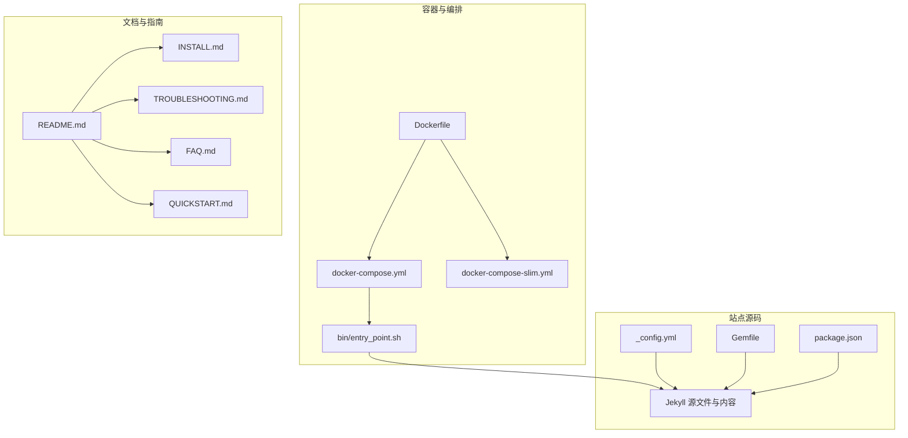
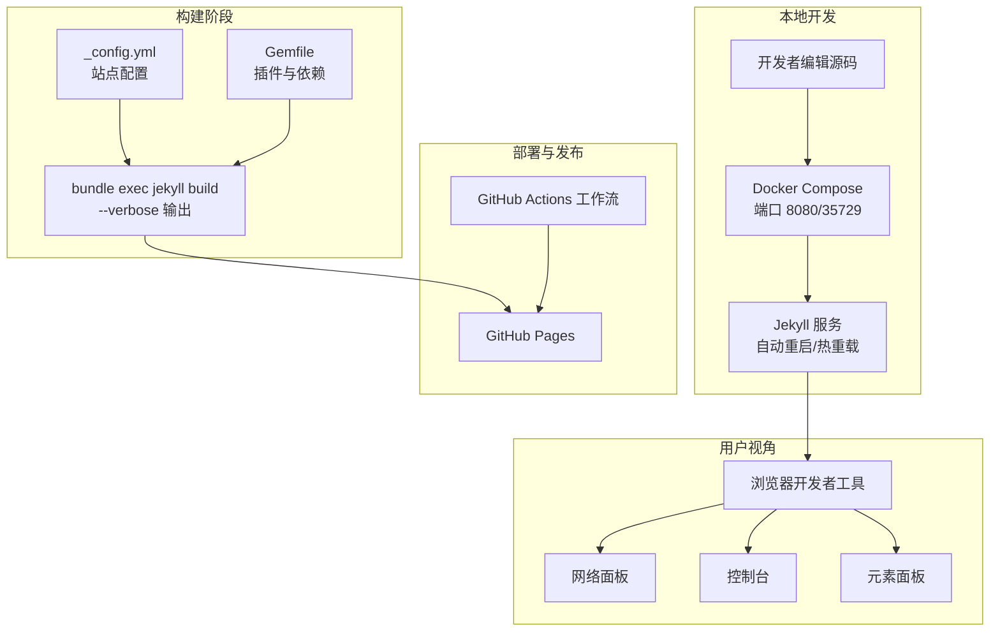
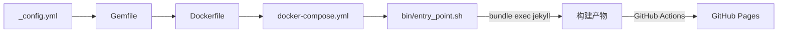

# 调试工具和技巧

<cite>
**本文引用的文件**
- [README.md](file://README.md)
- [_config.yml](file://_config.yml)
- [Gemfile](file://Gemfile)
- [package.json](file://package.json)
- [docker-compose.yml](file://docker-compose.yml)
- [docker-compose-slim.yml](file://docker-compose-slim.yml)
- [Dockerfile](file://Dockerfile)
- [bin/entry_point.sh](file://bin/entry_point.sh)
- [INSTALL.md](file://INSTALL.md)
- [TROUBLESHOOTING.md](file://TROUBLESHOOTING.md)
- [FAQ.md](file://FAQ.md)
- [QUICKSTART.md](file://QUICKSTART.md)
</cite>

## 目录
1. [简介](#简介)
2. [项目结构](#项目结构)
3. [核心组件](#核心组件)
4. [架构总览](#架构总览)
5. [详细组件分析](#详细组件分析)
6. [依赖关系分析](#依赖关系分析)
7. [性能考虑](#性能考虑)
8. [故障排查指南](#故障排查指南)
9. [结论](#结论)
10. [附录](#附录)

## 简介
本文件面向使用 al-folio 主题的 Jekyll 博客与静态站点开发者，提供系统化的调试工具与技巧，涵盖：
- 浏览器开发者工具：网络面板检查资源加载、控制台查看 JavaScript 错误、元素面板调试样式问题
- Jekyll 调试模式：启用详细输出、构建过程跟踪
- 日志分析：解读 GitHub Actions 工作流日志、分析本地构建日志
- 常用调试命令与工具：bundle exec jekyll build --verbose、docker compose logs 等
- 性能分析与内存泄漏检测方法

## 项目结构
该仓库采用 Jekyll + GitHub Actions 的典型静态站点结构，配合 Docker 开发容器实现跨平台一致的本地开发体验。关键目录与文件如下：
- 配置层：_config.yml（站点配置）、Gemfile（Ruby 依赖）、package.json（前端格式化依赖）
- 容器与编排：Dockerfile、docker-compose.yml、docker-compose-slim.yml、bin/entry_point.sh
- 文档与指南：README.md、INSTALL.md、TROUBLESHOOTING.md、FAQ.md、QUICKSTART.md

图表来源
- [Dockerfile:1-77](file://Dockerfile#L1-L77)
- [docker-compose.yml:1-22](file://docker-compose.yml#L1-L22)
- [docker-compose-slim.yml:1-13](file://docker-compose-slim.yml#L1-L13)
- [bin/entry_point.sh:1-38](file://bin/entry_point.sh#L1-L38)
- [_config.yml:1-656](file://_config.yml#L1-L656)
- [Gemfile:1-42](file://Gemfile#L1-L42)
- [package.json:1-7](file://package.json#L1-L7)
- [README.md:1-561](file://README.md#L1-L561)
- [INSTALL.md:1-297](file://INSTALL.md#L1-L297)
- [TROUBLESHOOTING.md:1-455](file://TROUBLESHOOTING.md#L1-L455)
- [FAQ.md:1-176](file://FAQ.md#L1-L176)
- [QUICKSTART.md:1-112](file://QUICKSTART.md#L1-L112)

章节来源
- [README.md:1-561](file://README.md#L1-L561)
- [_config.yml:1-656](file://_config.yml#L1-L656)
- [Gemfile:1-42](file://Gemfile#L1-L42)
- [package.json:1-7](file://package.json#L1-L7)
- [docker-compose.yml:1-22](file://docker-compose.yml#L1-L22)
- [docker-compose-slim.yml:1-13](file://docker-compose-slim.yml#L1-L13)
- [Dockerfile:1-77](file://Dockerfile#L1-L77)
- [bin/entry_point.sh:1-38](file://bin/entry_point.sh#L1-L38)
- [INSTALL.md:1-297](file://INSTALL.md#L1-L297)
- [TROUBLESHOOTING.md:1-455](file://TROUBLESHOOTING.md#L1-L455)
- [FAQ.md:1-176](file://FAQ.md#L1-L176)
- [QUICKSTART.md:1-112](file://QUICKSTART.md#L1-L112)

## 核心组件
- Jekyll 构建与插件生态：通过 Gemfile 声明核心插件与第三方库，_config.yml 控制站点行为与特性开关
- Docker 开发环境：Dockerfile 提供 Ruby/Node/Python 等运行时与工具链；docker-compose.yml 统一端口映射与卷挂载；entry_point.sh 启动 Jekyll 并开启自动重启与实时刷新
- GitHub Actions 自动化：工作流负责部署到 GitHub Pages、链接检查、可访问性测试、代码格式化等
- 前端格式化：package.json 引入 Prettier 与 Liquid 插件，确保代码风格一致性

章节来源
- [Gemfile:1-42](file://Gemfile#L1-L42)
- [_config.yml:1-656](file://_config.yml#L1-L656)
- [docker-compose.yml:1-22](file://docker-compose.yml#L1-L22)
- [Dockerfile:1-77](file://Dockerfile#L1-L77)
- [bin/entry_point.sh:1-38](file://bin/entry_point.sh#L1-L38)
- [package.json:1-7](file://package.json#L1-L7)

## 架构总览
下图展示从源码到浏览器渲染的关键路径，以及调试入口点。

图表来源
- [bin/entry_point.sh:22-25](file://bin/entry_point.sh#L22-L25)
- [docker-compose.yml:15-17](file://docker-compose.yml#L15-L17)
- [INSTALL.md:79-82](file://INSTALL.md#L79-L82)
- [_config.yml:156-218](file://_config.yml#L156-L218)
- [Gemfile:6-29](file://Gemfile#L6-L29)
- [INSTALL.md:174-182](file://INSTALL.md#L174-L182)

## 详细组件分析

### 浏览器开发者工具调试
- 网络面板检查资源加载
  - 打开“网络”标签，观察静态资源（CSS/JS/图片）请求状态码、耗时与缓存策略
  - 关注 baseurl/url 配置是否导致资源路径错误
- 控制台查看 JavaScript 错误
  - 查看语法错误、模块加载失败、异步请求异常
  - 结合 _config.yml 中启用的功能（如数学公式、图表库、搜索）定位脚本冲突
- 元素面板调试样式问题
  - 使用选择器检查样式覆盖、媒体查询生效情况
  - 对比深色/浅色主题下的样式差异

章节来源
- [TROUBLESHOOTING.md:144-175](file://TROUBLESHOOTING.md#L144-L175)
- [_config.yml:381-396](file://_config.yml#L381-L396)

### Jekyll 调试模式与构建跟踪
- 启用详细输出
  - 使用 bundle exec jekyll build --verbose 获取完整构建日志，便于定位插件或数据处理问题
- 构建过程跟踪
  - 通过 _config.yml 的插件列表与 sass 压缩设置，确认构建产物生成路径与压缩策略
- 常见问题定位
  - YAML 语法错误：本地先执行构建以获得精确报错行号
  - 插件缺失：核对 Gemfile 与 bundle install 结果

章节来源
- [INSTALL.md:208-214](file://INSTALL.md#L208-L214)
- [TROUBLESHOOTING.md:286-323](file://TROUBLESHOOTING.md#L286-L323)
- [_config.yml:196-218](file://_config.yml#L196-L218)
- [Gemfile:6-29](file://Gemfile#L6-L29)

### 日志分析技巧

#### GitHub Actions 日志解读
- 部署失败：检查 Actions 标签页中的错误信息，确认工作流权限、分支设置与 Pages 源分支
- “未知标签 toc”：确认 Pages 设置中源分支为 gh-pages
- 依赖过期警告：关注 Node.js 版本弃用提示，升级模板版本以适配新环境

章节来源
- [INSTALL.md:174-182](file://INSTALL.md#L174-L182)
- [FAQ.md:39-41](file://FAQ.md#L39-L41)
- [FAQ.md:81-99](file://FAQ.md#L81-L99)

#### 本地构建日志分析
- Docker 构建失败：先执行 docker compose pull 再 docker compose up --build；必要时清理 Gemfile.lock 并重新 bundle install
- 权限问题：根据 Dockerfile 注释调整非 root 用户与组 ID，避免缓存文件权限错误
- 实时日志：docker compose logs 可用于快速定位启动异常

章节来源
- [INSTALL.md:104-133](file://INSTALL.md#L104-L133)
- [Dockerfile:3-20](file://Dockerfile#L3-L20)
- [bin/entry_point.sh:8-20](file://bin/entry_point.sh#L8-L20)

### 常用调试命令与工具
- 本地开发
  - docker compose pull && docker compose up：拉取镜像并启动服务
  - docker compose logs：查看容器启动与运行日志
  - docker compose exec -it jekyll /bin/bash：进入容器交互式调试
- 构建与验证
  - bundle exec jekyll build --verbose：启用详细输出，便于定位问题
  - bundle exec jekyll serve：本地预览（非推荐，优先使用 Docker）
- 前端格式化
  - npx prettier . --write：统一代码风格（与 package.json 中的 Prettier 配置配合）

章节来源
- [INSTALL.md:79-82](file://INSTALL.md#L79-L82)
- [INSTALL.md:108-117](file://INSTALL.md#L108-L117)
- [INSTALL.md:208-214](file://INSTALL.md#L208-L214)
- [package.json:1-7](file://package.json#L1-L7)

### 性能分析与内存泄漏检测
- 页面性能
  - 使用 Lighthouse（仓库内已提供结果示例）评估页面速度与可访问性
  - 结合网络面板观察关键资源加载顺序与缓存命中率
- JavaScript 内存
  - 在浏览器“性能”面板中录制交互，观察堆快照变化
  - 关注长时间运行任务与未释放的事件监听器
- Jekyll 构建性能
  - 启用 --verbose 输出，识别耗时较长的插件或数据处理步骤
  - 调整压缩与懒加载策略（如 _config.yml 中的懒加载与压缩选项）

章节来源
- [README.md:236-248](file://README.md#L236-L248)
- [_config.yml:226-227](file://_config.yml#L226-L227)
- [_config.yml:375-375](file://_config.yml#L375-L375)

## 依赖关系分析
Jekyll 构建链路由配置驱动，容器提供一致的运行环境，GitHub Actions 实现自动化部署。

图表来源
- [_config.yml:156-218](file://_config.yml#L156-L218)
- [Gemfile:6-29](file://Gemfile#L6-L29)
- [Dockerfile:56-65](file://Dockerfile#L56-L65)
- [docker-compose.yml:1-22](file://docker-compose.yml#L1-L22)
- [bin/entry_point.sh:22-25](file://bin/entry_point.sh#L22-L25)

章节来源
- [_config.yml:156-218](file://_config.yml#L156-L218)
- [Gemfile:6-29](file://Gemfile#L6-L29)
- [Dockerfile:56-65](file://Dockerfile#L56-L65)
- [docker-compose.yml:1-22](file://docker-compose.yml#L1-L22)
- [bin/entry_point.sh:22-25](file://bin/entry_point.sh#L22-L25)

## 性能考虑
- 资源优化
  - 启用懒加载与响应式图片（参考 _config.yml 中相关选项）
  - 使用压缩与最小化（sass 压缩、terser 压缩）
- 构建时间
  - 减少不必要的插件与数据抓取
  - 使用 Docker 缓存与增量构建
- 运行时体验
  - 控制台与网络面板监控关键路径，避免阻塞渲染的脚本

章节来源
- [_config.yml:226-227](file://_config.yml#L226-L227)
- [_config.yml:241-244](file://_config.yml#L241-L244)
- [_config.yml:370-375](file://_config.yml#L370-L375)

## 故障排查指南
- 部署问题
  - 确认 Actions 权限、Pages 源分支设置与 url/baseurl 配置
- 本地构建问题
  - Docker 失败：更新镜像、重建、检查系统资源与权限
  - Ruby 依赖：删除 Gemfile.lock、bundle update、bundle install
  - 端口占用：停止容器或更换端口
- 样式与布局
  - 检查 url/baseurl 是否正确，清除浏览器缓存
- 内容显示
  - 检查文章命名格式、日期与 frontmatter，确认启用相关功能
- 配置问题
  - 使用 YAML 校验器与本地构建命令定位语法错误

章节来源
- [INSTALL.md:174-182](file://INSTALL.md#L174-L182)
- [INSTALL.md:108-133](file://INSTALL.md#L108-L133)
- [TROUBLESHOOTING.md:36-56](file://TROUBLESHOOTING.md#L36-L56)
- [TROUBLESHOOTING.md:87-141](file://TROUBLESHOOTING.md#L87-L141)
- [TROUBLESHOOTING.md:144-175](file://TROUBLESHOOTING.md#L144-L175)
- [TROUBLESHOOTING.md:202-228](file://TROUBLESHOOTING.md#L202-L228)
- [TROUBLESHOOTING.md:286-323](file://TROUBLESHOOTING.md#L286-L323)

## 结论
通过结合浏览器开发者工具、Jekyll 详细输出、Docker 日志与 GitHub Actions 工作流日志，可以高效定位与解决静态站点的构建、部署与运行时问题。建议在日常开发中养成以下习惯：
- 使用 Docker 保持环境一致性
- 以 bundle exec jekyll build --verbose 作为默认调试手段
- 利用浏览器网络与控制台面板进行前端问题诊断
- 定期检查并升级模板版本，避免依赖弃用带来的风险

## 附录
- 快速开始：参考 QUICKSTART.md 完成首次部署
- 本地开发：参考 INSTALL.md 的 Docker 方案
- 常见问题：参考 FAQ.md 与 TROUBLESHOOTING.md

章节来源
- [QUICKSTART.md:1-112](file://QUICKSTART.md#L1-L112)
- [INSTALL.md:70-88](file://INSTALL.md#L70-L88)
- [FAQ.md:1-176](file://FAQ.md#L1-L176)
- [TROUBLESHOOTING.md:1-455](file://TROUBLESHOOTING.md#L1-L455)