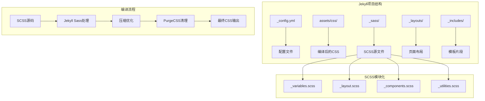
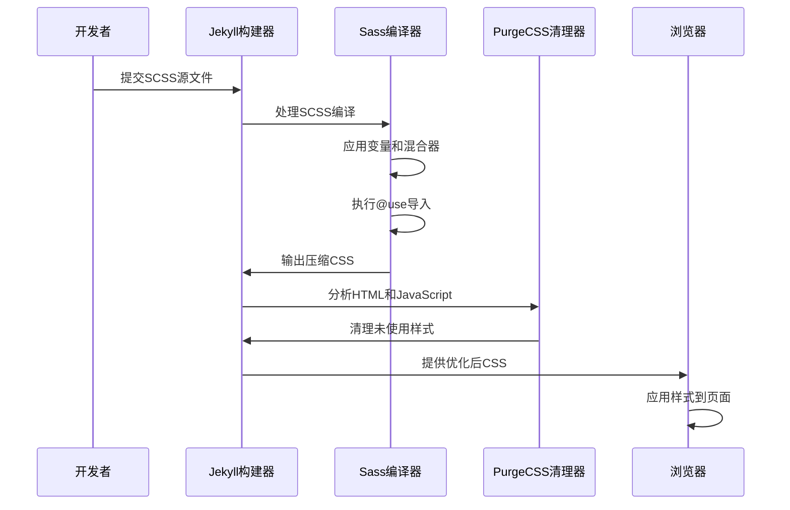
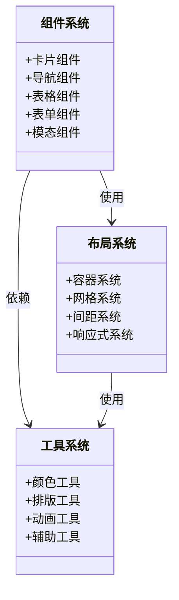
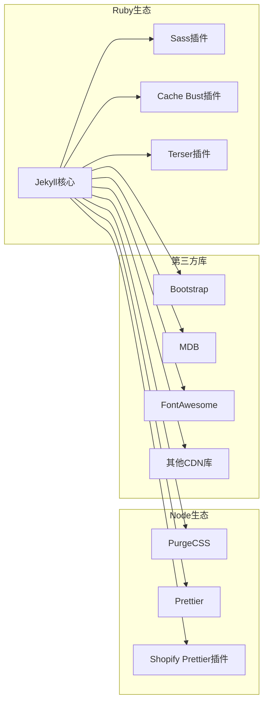
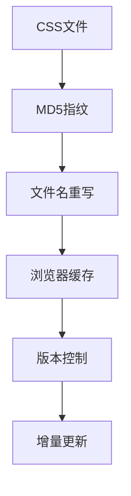

# CSS编译和优化

<cite>
**本文档引用的文件**
- [_config.yml](file://_config.yml)
- [main.scss](file://assets/css/main.scss)
- [_sass/_variables.scss](file://_sass/_variables.scss)
- [_sass/_layout.scss](file://_sass/_layout.scss)
- [_sass/_components.scss](file://_sass/_components.scss)
- [_sass/_utilities.scss](file://_sass/_utilities.scss)
- [Gemfile](file://Gemfile)
- [purgecss.config.js](file://purgecss.config.js)
- [package.json](file://package.json)
- [_layouts/default.liquid](file://_layouts/default.liquid)
- [_includes/head.liquid](file://_includes/head.liquid)
- [bootstrap.min.css](file://assets/css/bootstrap.min.css)
- [CUSTOMIZE.md](file://CUSTOMIZE.md)
</cite>

## 目录
1. [简介](#简介)
2. [项目结构](#项目结构)
3. [核心组件](#核心组件)
4. [架构概览](#架构概览)
5. [详细组件分析](#详细组件分析)
6. [依赖关系分析](#依赖关系分析)
7. [性能考虑](#性能考虑)
8. [故障排除指南](#故障排除指南)
9. [结论](#结论)

## 简介

本项目采用Jekyll静态站点生成器，结合SCSS预处理器实现CSS编译和优化。系统通过Jekyll的Sass处理功能将SCSS文件编译为CSS，配合多种优化策略确保最终输出的CSS文件具有良好的性能表现。

该CSS编译系统的核心特点包括：
- 模块化的SCSS架构设计
- 自动压缩和优化策略
- 清理未使用样式的PurgeCSS集成
- 响应式设计支持
- 主题化样式管理

## 项目结构

项目采用标准的Jekyll目录结构，CSS相关文件主要分布在以下位置：



**图表来源**
- [_config.yml:226-227](file://_config.yml#L226-L227)
- [main.scss:1-40](file://assets/css/main.scss#L1-L40)
- [_sass/_variables.scss:1-53](file://_sass/_variables.scss#L1-L53)

**章节来源**
- [CUSTOMIZE.md:99-140](file://CUSTOMIZE.md#L99-L140)

## 核心组件

### SCSS编译配置

系统通过Jekyll的Sass配置实现CSS编译，主要配置项包括：

- **编译风格**: 使用压缩模式 (`style: compressed`)
- **自动缓存清除**: 通过Jekyll Cache Bust插件实现
- **第三方库集成**: 支持CDN资源的直接引用

### CSS文件组织结构

项目采用模块化的SCSS文件组织方式，每个功能模块对应独立的SCSS文件：

- `_variables.scss`: 全局变量定义
- `_layout.scss`: 页面布局样式
- `_components.scss`: 可复用组件样式
- `_utilities.scss`: 工具类和辅助样式

**章节来源**
- [_config.yml:226-227](file://_config.yml#L226-L227)
- [_sass/_variables.scss:1-53](file://_sass/_variables.scss#L1-L53)
- [_sass/_layout.scss:1-59](file://_sass/_layout.scss#L1-L59)

## 架构概览

CSS编译和优化系统的工作流程如下：



**图表来源**
- [_config.yml:226-227](file://_config.yml#L226-L227)
- [purgecss.config.js:1-7](file://purgecss.config.js#L1-L7)
- [Gemfile:6-29](file://Gemfile#L6-L29)

## 详细组件分析

### SCSS编译流程

#### 编译顺序和导入规则

主SCSS文件按照特定顺序导入各个模块：

```mermaid
flowchart TD
A[main.scss开始] --> B[@use "variables"]
B --> C[@use "themes"]
C --> D[@use "layout"]
D --> E[@use "typography"]
E --> F[@use "navbar"]
F --> G[@use "footer"]
G --> H[@use "blog"]
H --> I[@use "publications"]
I --> J[@use "components"]
J --> K[@use "utilities"]
K --> L[@use "distill"]
L --> M[@use "cv"]
M --> N[@use "tabs"]
N --> O[@use "teachings"]
O --> P[@use "typograms"]
P --> Q[@use "font-awesome/*"]
Q --> R[编译完成]
```

**图表来源**
- [main.scss:10-40](file://assets/css/main.scss#L10-L40)

#### 变量系统设计

全局变量系统采用分层设计：

- **颜色系统**: 定义主题色彩和语义化颜色
- **间距系统**: 基于网格系统的间距规范
- **字体系统**: 字体族和字号层级
- **断点系统**: 响应式设计断点

**章节来源**
- [_sass/_variables.scss:8-53](file://_sass/_variables.scss#L8-L53)

### CSS优化策略

#### 压缩和清理

系统采用多层优化策略：

1. **Sass压缩**: 在编译时启用压缩模式
2. **PurgeCSS清理**: 移除未使用的CSS规则
3. **缓存控制**: 自动文件指纹识别

#### 重复规则消除

通过以下机制避免CSS重复：

- **模块化导入**: 避免重复@import
- **变量统一管理**: 减少重复的颜色和尺寸定义
- **组件化设计**: 避免样式冲突

**章节来源**
- [_config.yml:226-227](file://_config.yml#L226-L227)
- [purgecss.config.js:1-7](file://purgecss.config.js#L1-L7)

### 模块化样式管理

#### 组件系统架构



**图表来源**
- [_sass/_components.scss:1-262](file://_sass/_components.scss#L1-L262)
- [_sass/_utilities.scss:1-606](file://_sass/_utilities.scss#L1-L606)

#### 响应式设计实现

系统支持多设备适配：

- **移动优先**: 默认样式针对移动设备优化
- **断点系统**: 基于Bootstrap的断点定义
- **弹性布局**: 使用CSS Grid和Flexbox
- **媒体查询**: 针对不同屏幕尺寸的样式调整

**章节来源**
- [_sass/_layout.scss:1-59](file://_sass/_layout.scss#L1-L59)
- [_sass/_utilities.scss:209-277](file://_sass/_utilities.scss#L209-L277)

## 依赖关系分析

### 构建工具链



**图表来源**
- [Gemfile:1-42](file://Gemfile#L1-L42)
- [package.json:1-7](file://package.json#L1-L7)

### 插件配置分析

系统使用多个Jekyll插件协同工作：

- **jekyll-minifier**: HTML和CSS压缩
- **jekyll-terser**: JavaScript压缩（配置中禁用CSS压缩）
- **jekyll-cache-bust**: 文件缓存清理
- **jekyll-3rd-party-libraries**: 第三方库管理

**章节来源**
- [_config.yml:196-217](file://_config.yml#L196-L217)
- [_config.yml:233-244](file://_config.yml#L233-L244)

## 性能考虑

### CSS分割策略

系统采用按需加载的策略：

- **基础样式**: 必要的基础CSS内联
- **功能样式**: 按页面需求动态加载
- **第三方库**: 通过CDN加速加载

### 缓存优化



**图表来源**
- [_includes/head.liquid:13-78](file://_includes/head.liquid#L13-L78)

### 加载性能优化

- **defer属性**: 对非关键CSS使用延迟加载
- **CDN加速**: 第三方库通过CDN提供
- **内联关键CSS**: 重要样式内联减少FOUC
- **懒加载策略**: 图片和组件的延迟加载

## 故障排除指南

### 常见问题诊断

#### 编译错误排查

1. **语法错误检查**
   - 检查SCSS文件语法
   - 验证变量定义正确性
   - 确认导入路径正确

2. **依赖冲突解决**
   - 检查Gem版本兼容性
   - 验证插件配置正确性
   - 确认Node依赖完整性

#### 性能问题诊断

1. **CSS大小分析**
   - 使用浏览器开发者工具分析CSS大小
   - 检查PurgeCSS清理效果
   - 评估缓存命中率

2. **加载性能监控**
   - 监控关键渲染路径
   - 分析首屏加载时间
   - 检查阻塞资源

**章节来源**
- [_includes/head.liquid:1-209](file://_includes/head.liquid#L1-L209)

### 调试技巧

#### 开发环境调试

- **实时预览**: 使用Jekyll Live Reload
- **样式检查**: 利用浏览器开发者工具
- **变量调试**: 通过SCSS变量快速测试
- **响应式测试**: 多设备模拟测试

#### 生产环境优化

- **性能监控**: 集成Web Vitals监控
- **缓存验证**: 确认缓存策略生效
- **CDN状态**: 监控CDN性能指标
- **错误追踪**: 设置CSS错误监控

## 结论

本CSS编译和优化系统通过模块化的设计理念和多层优化策略，实现了高质量的样式管理。系统的主要优势包括：

1. **模块化架构**: 清晰的文件组织便于维护和扩展
2. **自动化优化**: 从编译到清理的完整优化流程
3. **性能导向**: 多维度的性能优化策略
4. **开发友好**: 完善的调试和故障排除机制

建议在实际使用中重点关注：
- 保持SCSS文件的模块化组织
- 合理使用PurgeCSS进行样式清理
- 监控关键性能指标
- 定期审查和优化样式代码