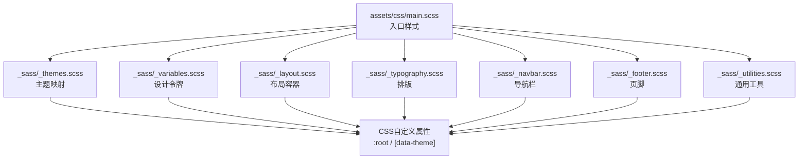
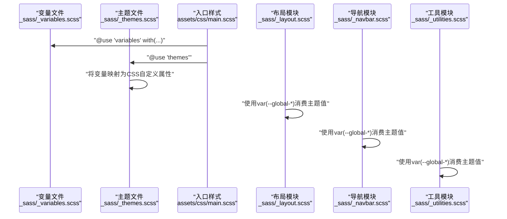
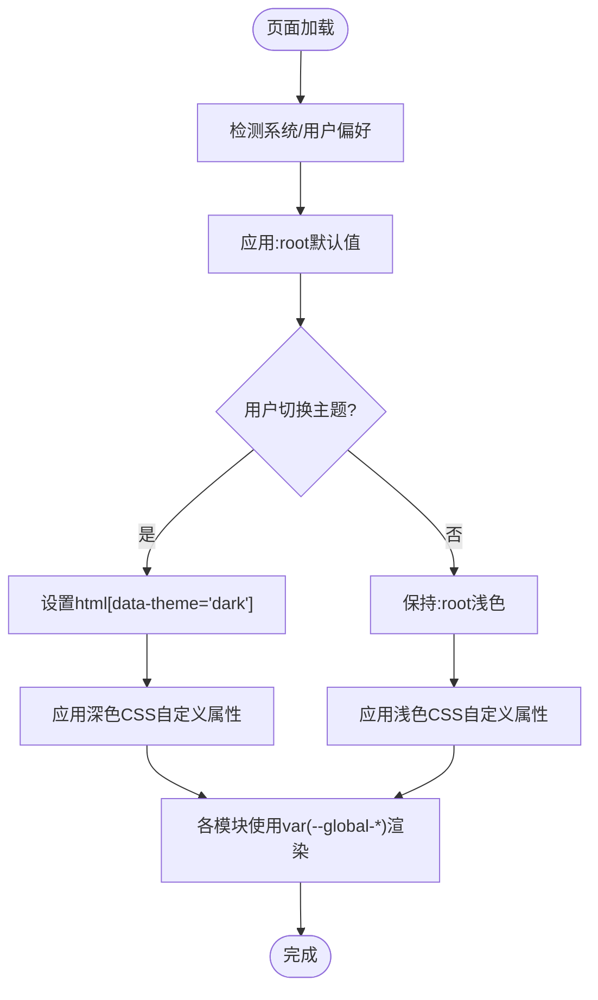
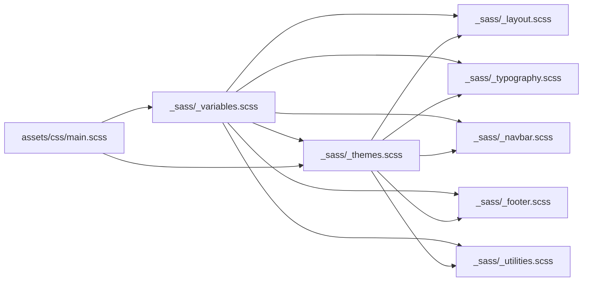

# SCSS变量系统

<cite>
**本文引用的文件**
- [_sass/_variables.scss](file://_sass/_variables.scss)
- [_sass/_themes.scss](file://_sass/_themes.scss)
- [_sass/_typography.scss](file://_sass/_typography.scss)
- [_sass/_layout.scss](file://_sass/_layout.scss)
- [_sass/_utilities.scss](file://_sass/_utilities.scss)
- [_sass/_navbar.scss](file://_sass/_navbar.scss)
- [_sass/_footer.scss](file://_sass/_footer.scss)
- [assets/css/main.scss](file://assets/css/main.scss)
- [_config.yml](file://_config.yml)
</cite>

## 目录
1. [简介](#简介)
2. [项目结构](#项目结构)
3. [核心组件](#核心组件)
4. [架构总览](#架构总览)
5. [详细组件分析](#详细组件分析)
6. [依赖关系分析](#依赖关系分析)
7. [性能考量](#性能考量)
8. [故障排查指南](#故障排查指南)
9. [结论](#结论)
10. [附录](#附录)

## 简介
本文件系统性梳理该Jekyll主题的SCSS变量体系，重点覆盖：
- 变量文件组织与命名规范
- 颜色变量、字体变量、间距变量、断点变量的定义与使用
- 主题系统（明/暗）与CSS自定义属性映射
- 字体家族与字号体系设计原则
- 变量覆盖与自定义（不修改核心文件）
- 变量作用域与继承关系
- 最佳实践与常见错误规避

## 项目结构
该主题采用“模块化SCSS”组织方式：通过一个集中变量文件统一管理设计令牌，再由主题文件将变量映射为CSS自定义属性，最终由各功能模块（排版、布局、导航、工具类等）消费这些变量与自定义属性。

图表来源
- [assets/css/main.scss:10-40](file://assets/css/main.scss#L10-L40)
- [_sass/_variables.scss:1-53](file://_sass/_variables.scss#L1-L53)
- [_sass/_themes.scss:1-209](file://_sass/_themes.scss#L1-L209)
- [_sass/_layout.scss:1-59](file://_sass/_layout.scss#L1-L59)
- [_sass/_typography.scss:1-137](file://_sass/_typography.scss#L1-L137)
- [_sass/_navbar.scss:1-209](file://_sass/_navbar.scss#L1-L209)
- [_sass/_footer.scss:1-36](file://_sass/_footer.scss#L1-L36)
- [_sass/_utilities.scss:1-606](file://_sass/_utilities.scss#L1-L606)

章节来源
- [assets/css/main.scss:10-40](file://assets/css/main.scss#L10-L40)
- [_sass/_variables.scss:1-53](file://_sass/_variables.scss#L1-L53)
- [_sass/_themes.scss:1-209](file://_sass/_themes.scss#L1-L209)

## 核心组件
- 设计令牌层（_variables.scss）：集中定义颜色、尺寸、路径等基础变量，提供!default默认值以便外部覆盖。
- 主题映射层（_themes.scss）：将变量映射为CSS自定义属性，并定义明/暗两套主题切换规则。
- 功能样式层（_layout.scss、_typography.scss、_navbar.scss、_footer.scss、_utilities.scss）：消费CSS自定义属性与变量，实现主题化UI。

章节来源
- [_sass/_variables.scss:1-53](file://_sass/_variables.scss#L1-L53)
- [_sass/_themes.scss:1-209](file://_sass/_themes.scss#L1-L209)
- [_sass/_layout.scss:1-59](file://_sass/_layout.scss#L1-L59)
- [_sass/_typography.scss:1-137](file://_sass/_typography.scss#L1-L137)
- [_sass/_navbar.scss:1-209](file://_sass/_navbar.scss#L1-L209)
- [_sass/_footer.scss:1-36](file://_sass/_footer.scss#L1-L36)
- [_sass/_utilities.scss:1-606](file://_sass/_utilities.scss#L1-L606)

## 架构总览
变量系统以“变量→CSS自定义属性→样式模块”的链路工作。变量文件提供默认值；主题文件将变量转为CSS自定义属性，并根据data-theme状态切换；各样式模块通过var()读取当前主题值，从而实现主题切换。

图表来源
- [assets/css/main.scss:10-40](file://assets/css/main.scss#L10-L40)
- [_sass/_variables.scss:1-53](file://_sass/_variables.scss#L1-L53)
- [_sass/_themes.scss:1-209](file://_sass/_themes.scss#L1-L209)
- [_sass/_layout.scss:1-59](file://_sass/_layout.scss#L1-L59)
- [_sass/_navbar.scss:1-209](file://_sass/_navbar.scss#L1-L209)
- [_sass/_utilities.scss:1-606](file://_sass/_utilities.scss#L1-L606)

## 详细组件分析

### 变量文件组织与命名规范
- 命名规范
  - 颜色变量：使用语义化前缀如$red-color、$blue-color、$green-color等，或$grey-color系列；支持明/暗变体如$xxx-color-dark/light。
  - 主题相关变量：以$code-bg-color、$white-color、$black-color等命名，便于主题映射。
  - UI控件变量：如$back-to-top-*、$max-content-width等，用于具体组件配置。
- 默认值策略
  - 所有变量均使用!default，允许通过入口样式@use with(...)覆盖，避免直接修改核心变量文件。
- 文件职责
  - 集中存放所有设计令牌，作为全局唯一真相源。

章节来源
- [_sass/_variables.scss:1-53](file://_sass/_variables.scss#L1-L53)

### 主题系统与CSS自定义属性映射
- 映射机制
  - 主题文件将变量映射到:root与[data-theme]选择器下的CSS自定义属性，如--global-bg-color、--global-text-color、--global-theme-color等。
  - 通过data-theme="dark"/"light"与color-scheme控制主题切换与系统偏好联动。
- 主题切换逻辑
  - :root设置默认浅色主题；html[data-theme="dark"]覆盖深色主题。
  - 支持固定主题设置（html[data-theme-setting="dark"/"light"]），隐藏/显示对应切换图标。
- 组件消费
  - 导航、页脚、布局、工具类等模块通过var(--global-*)读取当前主题值，实现自动适配。

图表来源
- [_sass/_themes.scss:7-122](file://_sass/_themes.scss#L7-L122)

章节来源
- [_sass/_themes.scss:1-209](file://_sass/_themes.scss#L1-L209)

### 颜色变量与主题系统
- 颜色分类
  - 主色调：$purple-color、$cyan-color等作为主题色基色。
  - 辅助色：$red-color、$green-color、$blue-color等用于强调与状态。
  - 中性色：$white-color、$black-color、$grey-color、$grey-color-light/dark等用于背景与文本。
  - 代码背景：$code-bg-color-light（浅色）、$code-bg-color-dark（深色）。
- 主题映射
  - 浅色：背景、文本、卡片、分隔线、高亮、回到顶部等使用浅色系。
  - 深色：背景、文本、卡片、分隔线、高亮、回到顶部等使用深色系。
- 使用示例
  - 排版模块使用var(--global-text-color)、var(--global-theme-color)、var(--global-divider-color)。
  - 导航模块使用var(--global-bg-color)、var(--global-text-color)、var(--global-hover-color)。
  - 工具模块使用var(--global-code-bg-color)、var(--global-card-bg-color)等。

章节来源
- [_sass/_variables.scss:8-38](file://_sass/_variables.scss#L8-L38)
- [_sass/_themes.scss:7-122](file://_sass/_themes.scss#L7-L122)
- [_sass/_typography.scss:1-137](file://_sass/_typography.scss#L1-L137)
- [_sass/_navbar.scss:1-209](file://_sass/_navbar.scss#L1-L209)
- [_sass/_utilities.scss:1-606](file://_sass/_utilities.scss#L1-L606)

### 字体变量与字号体系
- 字体变量
  - 字体路径变量：$fa-font-path用于Font Awesome字体资源定位。
- 字号与排版
  - 全局文本颜色通过var(--global-text-color)统一。
  - 表格单元格字号固定为1rem，标题与链接颜色使用var(--global-theme-color)。
  - 引用块（blockquote）默认字号1.2rem，支持Tip/Warning/Danger三类主题色块。
- 响应式排版
  - 工具模块对不同屏幕尺寸提供预设字号与内边距，确保代码块与表格在移动端可读。

章节来源
- [_sass/_variables.scss:40-41](file://_sass/_variables.scss#L40-L41)
- [_sass/_typography.scss:1-137](file://_sass/_typography.scss#L1-L137)
- [_sass/_utilities.scss:209-273](file://_sass/_utilities.scss#L209-L273)

### 间距变量与断点变量
- 容器宽度
  - $max-content-width用于限制内容最大宽度，默认930px，可通过入口样式覆盖。
- 回到顶部按钮
  - $back-to-top-*系列变量控制z-index、位置、尺寸等，最终在主题文件中映射为CSS自定义属性并应用到#back-to-top元素。
- 断点与响应式
  - 工具模块在多个@media断点下调整代码块、表格、输入框等的字号与内边距，保证在小屏设备上的可用性。

章节来源
- [_sass/_variables.scss:43-52](file://_sass/_variables.scss#L43-L52)
- [_sass/_themes.scss:66-74](file://_sass/_themes.scss#L66-L74)
- [_sass/_layout.scss:32-34](file://_sass/_layout.scss#L32-L34)
- [_sass/_utilities.scss:209-273](file://_sass/_utilities.scss#L209-L273)

### 变量覆盖与自定义方法
- 入口样式覆盖
  - 在入口样式中使用@use "variables" with (...)覆盖$max-content-width等变量，无需修改核心变量文件。
- 主题设置覆盖
  - 通过html[data-theme-setting="dark"/"light"]固定主题，隐藏动态切换图标。
- 自定义属性优先级
  - 若需进一步微调，可在站点范围内新增CSS自定义属性，其优先级高于主题文件默认值。

章节来源
- [assets/css/main.scss:10-14](file://assets/css/main.scss#L10-L14)
- [_sass/_themes.scss:124-155](file://_sass/_themes.scss#L124-L155)

### 变量作用域与继承关系
- 作用域
  - 变量文件内部作用域仅限于该文件；通过@use引入后，其他模块需显式使用别名（如as v）访问变量。
- 继承关系
  - 主题文件将变量转换为CSS自定义属性，供所有样式模块继承使用。
  - 布局、导航、页脚、工具类等模块通过var(--global-*)间接继承主题值，形成统一的主题一致性。

章节来源
- [_sass/_variables.scss:6](file://_sass/_variables.scss#L6)
- [_sass/_themes.scss:4-5](file://_sass/_themes.scss#L4-L5)
- [_sass/_layout.scss:5](file://_sass/_layout.scss#L5)
- [_sass/_navbar.scss:5](file://_sass/_navbar.scss#L5)
- [_sass/_footer.scss:1-36](file://_sass/_footer.scss#L1-L36)
- [_sass/_utilities.scss:5](file://_sass/_utilities.scss#L5)

## 依赖关系分析
- 入口样式依赖变量与主题文件，主题文件依赖变量文件，各功能模块依赖主题文件提供的CSS自定义属性。
- 变量文件被主题文件与各模块共同依赖，形成“单向数据流”。

图表来源
- [assets/css/main.scss:10-40](file://assets/css/main.scss#L10-L40)
- [_sass/_variables.scss:1-53](file://_sass/_variables.scss#L1-L53)
- [_sass/_themes.scss:1-209](file://_sass/_themes.scss#L1-L209)
- [_sass/_layout.scss:1-59](file://_sass/_layout.scss#L1-L59)
- [_sass/_typography.scss:1-137](file://_sass/_typography.scss#L1-L137)
- [_sass/_navbar.scss:1-209](file://_sass/_navbar.scss#L1-L209)
- [_sass/_footer.scss:1-36](file://_sass/_footer.scss#L1-L36)
- [_sass/_utilities.scss:1-606](file://_sass/_utilities.scss#L1-L606)

章节来源
- [assets/css/main.scss:10-40](file://assets/css/main.scss#L10-L40)
- [_sass/_variables.scss:1-53](file://_sass/_variables.scss#L1-L53)
- [_sass/_themes.scss:1-209](file://_sass/_themes.scss#L1-L209)

## 性能考量
- 变量复用：通过CSS自定义属性减少重复计算与多处硬编码，提升维护效率。
- 主题切换：基于data-theme的切换仅影响CSS自定义属性，避免重绘大范围DOM。
- 响应式优化：工具模块针对多断点提供预设样式，减少复杂媒体查询带来的解析开销。

## 故障排查指南
- 主题未生效
  - 检查html是否正确设置data-theme或data-theme-setting。
  - 确认入口样式已@use "themes"。
- 字体图标不显示
  - 检查$fa-font-path是否指向正确的webfonts目录。
- 容器宽度异常
  - 确认入口样式中是否正确覆盖$max-content-width。
- 文本颜色不随主题变化
  - 确保模块使用var(--global-text-color)而非硬编码颜色值。

章节来源
- [_sass/_themes.scss:7-122](file://_sass/_themes.scss#L7-L122)
- [_sass/_variables.scss:40-41](file://_sass/_variables.scss#L40-L41)
- [assets/css/main.scss:10-14](file://assets/css/main.scss#L10-L14)
- [_sass/_typography.scss:1-137](file://_sass/_typography.scss#L1-L137)

## 结论
该SCSS变量系统通过“变量→CSS自定义属性→模块消费”的清晰分层，实现了主题化与可扩展性。遵循!default默认值与@use with(...)覆盖机制，可在不修改核心文件的前提下完成主题定制；通过CSS自定义属性与data-theme切换，实现明/暗主题无缝切换。建议在扩展时严格遵守变量命名规范与模块化依赖关系，确保主题一致性与可维护性。

## 附录
- 变量覆盖示例（入口样式）
  - 在入口样式中使用@use "variables" with (...)覆盖$max-content-width等变量。
- 主题设置示例
  - 通过html[data-theme-setting="dark"/"light"]固定主题，隐藏动态切换图标。
- 配置项参考
  - 站点配置中max_width用于控制容器宽度，可与变量覆盖配合使用。

章节来源
- [assets/css/main.scss:10-14](file://assets/css/main.scss#L10-L14)
- [_sass/_themes.scss:124-155](file://_sass/_themes.scss#L124-L155)
- [_config.yml:62-63](file://_config.yml#L62-L63)