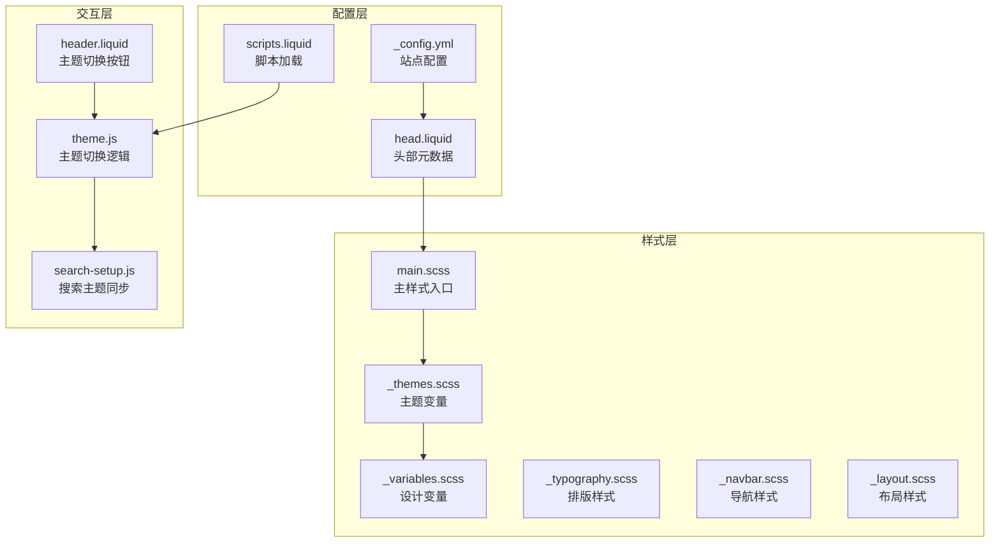
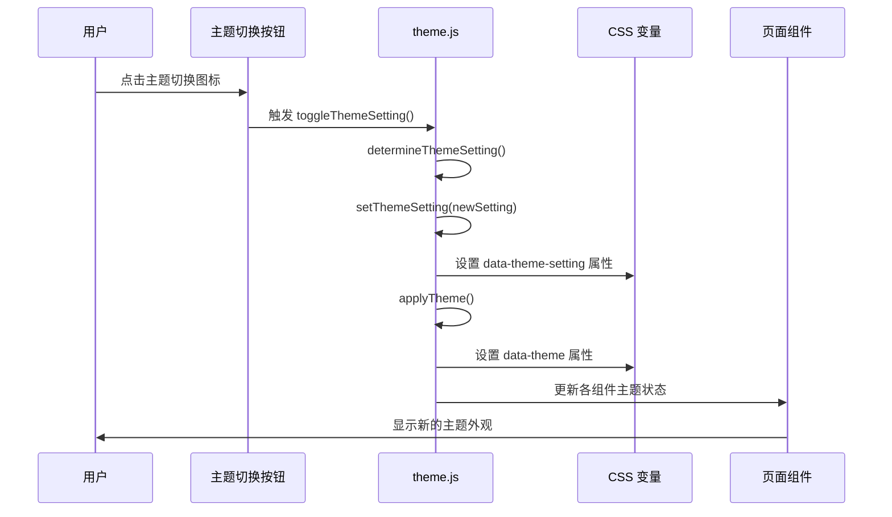
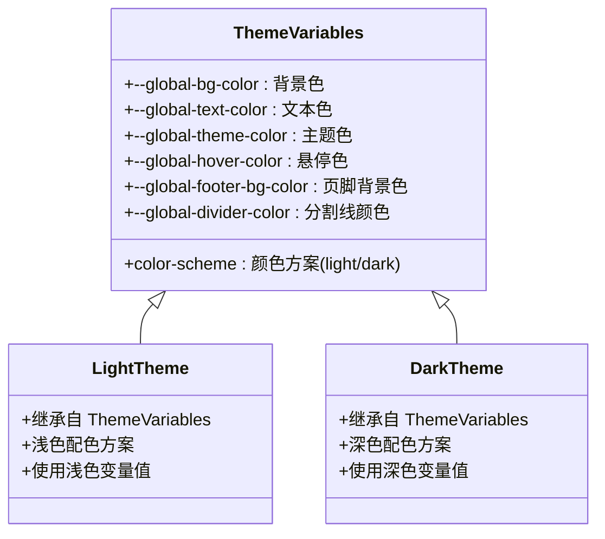
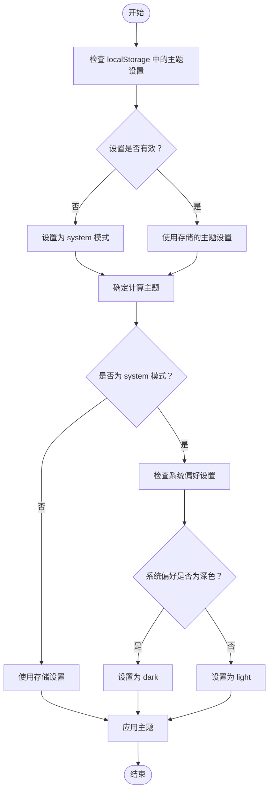
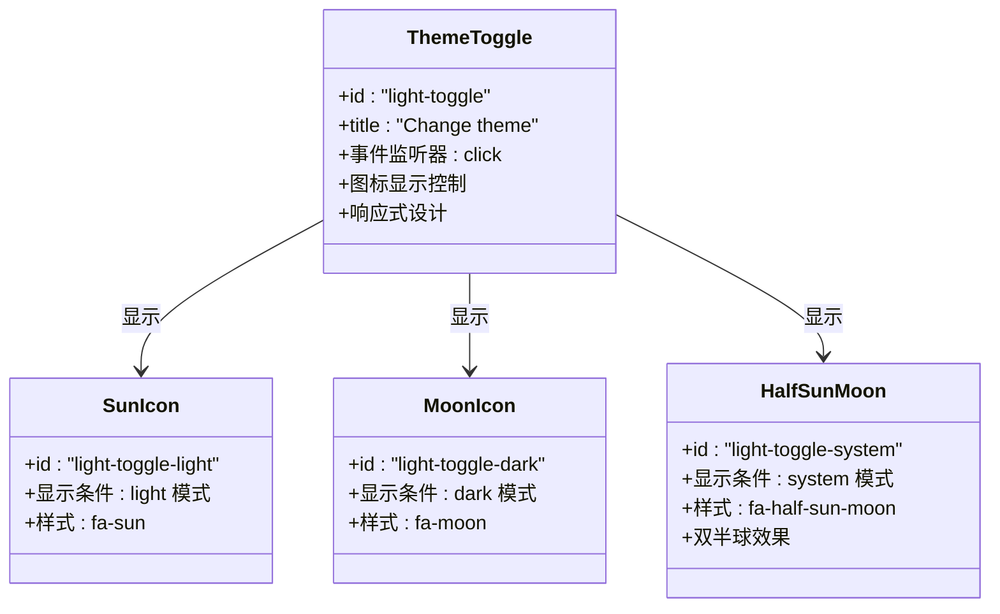
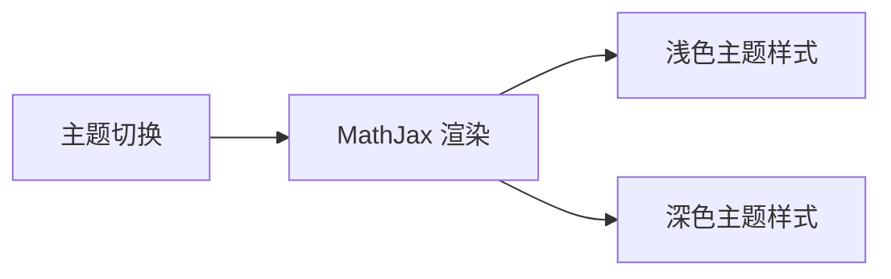
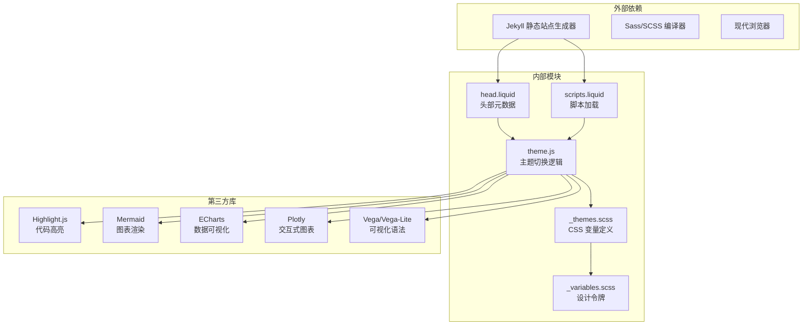

# 主题定制指南

<cite>
**本文档引用的文件**
- [_config.yml](file://_config.yml)
- [theme.js](file://assets/js/theme.js)
- [_themes.scss](file://_sass/_themes.scss)
- [_variables.scss](file://_sass/_variables.scss)
- [head.liquid](file://_includes/head.liquid)
- [scripts.liquid](file://_includes/scripts.liquid)
- [main.scss](file://assets/css/main.scss)
- [CUSTOMIZE.md](file://CUSTOMIZE.md)
- [header.liquid](file://_includes/header.liquid)
- [search-setup.js](file://assets/js/search-setup.js)
- [search.liquid.js](file://_scripts/search.liquid.js)
</cite>

## 目录
1. [简介](#简介)
2. [项目结构](#项目结构)
3. [核心组件](#核心组件)
4. [架构概览](#架构概览)
5. [详细组件分析](#详细组件分析)
6. [依赖关系分析](#依赖关系分析)
7. [性能考虑](#性能考虑)
8. [故障排除指南](#故障排除指南)
9. [结论](#结论)
10. [附录](#附录)

## 简介

本指南详细说明了如何在基于 Jekyll 的 al-folio 主题中创建和切换不同的主题。该主题系统支持浅色、深色和系统默认三种模式，具备完整的颜色方案、字体风格、布局变体等定制选项。文档涵盖了主题切换的实现原理、JavaScript 集成方法、完整的主题配置步骤，以及如何创建自定义主题和进行主题测试。

## 项目结构

al-folio 主题采用模块化的 SCSS 架构，主要文件组织如下：

**图表来源**
- [_config.yml:26-40](file://_config.yml#L26-L40)
- [head.liquid:80-93](file://_includes/head.liquid#L80-L93)
- [main.scss:12-18](file://assets/css/main.scss#L12-L18)

**章节来源**
- [_config.yml:26-40](file://_config.yml#L26-L40)
- [head.liquid:80-93](file://_includes/head.liquid#L80-L93)
- [main.scss:12-18](file://assets/css/main.scss#L12-L18)

## 核心组件

### 主题系统架构

al-folio 的主题系统由三个核心层次组成：

1. **CSS 变量层**：使用 CSS 自定义属性定义全局设计令牌
2. **JavaScript 控制层**：处理用户交互和动态主题切换
3. **编译构建层**：通过 SCSS 编译生成最终样式

### 主要配置选项

主题系统的关键配置位于 `_config.yml` 中：

- `enable_darkmode: true` - 启用暗色模式功能
- `third_party_libraries` - 第三方库配置，包括主题相关的样式
- `max_width` - 内容最大宽度设置

**章节来源**
- [_config.yml](file://_config.yml#L391)
- [_config.yml:405-634](file://_config.yml#L405-L634)

## 架构概览

主题系统的核心工作流程如下：

**图表来源**
- [theme.js:4-22](file://assets/js/theme.js#L4-L22)
- [theme.js:25-61](file://assets/js/theme.js#L25-L61)

## 详细组件分析

### CSS 变量系统

主题的颜色系统基于 CSS 自定义属性，定义在 `_themes.scss` 文件中：

**图表来源**
- [_themes.scss:7-75](file://_sass/_themes.scss#L7-L75)
- [_themes.scss:77-122](file://_sass/_themes.scss#L77-L122)

### JavaScript 主题切换引擎

主题切换的核心逻辑由 `theme.js` 实现：

#### 主题状态管理

**图表来源**
- [theme.js:268-292](file://assets/js/theme.js#L268-L292)

#### 组件主题同步机制

主题切换时需要同步更新多个组件的状态：

| 组件类型 | 同步函数 | 更新内容 |
|---------|---------|----------|
| 代码高亮 | `setHighlight(theme)` | 切换高亮样式表 |
| Giscus 评论 | `setGiscusTheme(theme)` | 更新评论主题 |
| 搜索组件 | `setSearchTheme(theme)` | 同步搜索框主题 |
| Cookie 同意 | `setCookieConsentTheme(theme)` | 更新同意对话框主题 |
| Mermaid 图表 | `setMermaidTheme(theme)` | 重新渲染图表主题 |
| ECharts 图表 | `setEchartsTheme(theme)` | 更新图表主题 |
| Plotly 图表 | `setPlotlyTheme(theme)` | 应用图表主题模板 |

**章节来源**
- [theme.js:93-101](file://assets/js/theme.js#L93-L101)
- [theme.js:103-115](file://assets/js/theme.js#L103-L115)
- [theme.js:238-247](file://assets/js/theme.js#L238-L247)

### 主题切换按钮实现

主题切换按钮位于页面右上角，通过 Font Awesome 图标实现：

**图表来源**
- [header.liquid:70-73](file://_includes/header.liquid#L70-L73)
- [_themes.scss:157-209](file://_sass/_themes.scss#L157-L209)

**章节来源**
- [header.liquid:70-73](file://_includes/header.liquid#L70-L73)
- [_themes.scss:157-209](file://_sass/_themes.scss#L157-L209)

### 第三方组件主题适配

主题系统为多种第三方组件提供了专门的主题适配：

#### 数学公式渲染

#### 数据可视化组件

| 组件 | 主题适配方式 | 特殊处理 |
|------|-------------|----------|
| Mermaid | 重新初始化图表 | 支持缩放功能 |
| ECharts | 使用内置深色主题 | 动态重绘图表 |
| Plotly | 应用主题模板 | 更新布局样式 |
| Vega-Lite | 设置主题参数 | 重新渲染视图 |

**章节来源**
- [theme.js:131-155](file://assets/js/theme.js#L131-L155)
- [theme.js:168-182](file://assets/js/theme.js#L168-L182)
- [theme.js:184-223](file://assets/js/theme.js#L184-L223)
- [theme.js:225-236](file://assets/js/theme.js#L225-L236)

## 依赖关系分析

主题系统的依赖关系如下：

**图表来源**
- [head.liquid:42-89](file://_includes/head.liquid#L42-L89)
- [scripts.liquid:33-138](file://_includes/scripts.liquid#L33-L138)

**章节来源**
- [head.liquid:42-89](file://_includes/head.liquid#L42-L89)
- [scripts.liquid:33-138](file://_includes/scripts.liquid#L33-L138)

## 性能考虑

### 加载优化策略

1. **延迟加载**：非关键资源使用 `defer` 属性延迟加载
2. **条件加载**：根据页面需求动态加载特定组件
3. **缓存策略**：使用文件哈希进行缓存失效控制

### 运行时性能

1. **最小化 DOM 操作**：批量更新组件状态
2. **事件节流**：避免频繁的主题切换触发
3. **内存管理**：及时清理图表实例和事件监听器

## 故障排除指南

### 常见问题及解决方案

#### 主题切换不生效

**症状**：点击主题按钮后页面无变化

**排查步骤**：
1. 检查浏览器控制台是否有 JavaScript 错误
2. 验证 `localStorage` 中的主题设置
3. 确认 CSS 变量是否正确应用

**解决方案**：
- 清除浏览器缓存后重试
- 检查 `_config.yml` 中的 `enable_darkmode` 设置
- 验证 `theme.js` 文件是否正确加载

#### 第三方组件主题异常

**症状**：某些组件未按预期切换主题

**排查步骤**：
1. 检查对应组件的 JavaScript 是否正确加载
2. 验证组件的 `data-theme` 属性是否更新
3. 确认组件的 CSS 类是否正确添加/移除

**解决方案**：
- 为组件添加适当的错误处理
- 实现组件主题状态的回退机制
- 确保组件在主题切换后重新初始化

#### 颜色对比度问题

**症状**：深色模式下文本难以阅读

**解决方案**：
1. 调整 CSS 变量中的颜色值
2. 使用颜色对比度检查工具验证可访问性
3. 为关键组件提供额外的对比度保障

**章节来源**
- [theme.js:261-266](file://assets/js/theme.js#L261-L266)
- [theme.js:314-342](file://assets/js/theme.js#L314-L342)

## 结论

al-folio 的主题系统提供了一个完整、灵活且高性能的主题定制解决方案。通过 CSS 自定义属性、JavaScript 动态控制和 SCSS 编译的协同工作，实现了流畅的主题切换体验。系统支持多种第三方组件的深度集成，确保整体视觉一致性。

对于开发者而言，理解主题系统的架构有助于更好地扩展和定制功能。对于内容创作者而言，通过简单的配置即可实现个性化的视觉体验。

## 附录

### 主题配置完整步骤

#### 步骤 1：基础主题设置
1. 在 `_config.yml` 中启用暗色模式
2. 配置 `max_width` 和其他布局参数
3. 设置第三方库版本和完整性校验

#### 步骤 2：颜色方案定制
1. 修改 `_sass/_variables.scss` 中的基础颜色变量
2. 在 `_sass/_themes.scss` 中调整主题颜色映射
3. 测试颜色对比度和可访问性

#### 步骤 3：组件主题适配
1. 检查现有组件的主题支持
2. 为新组件添加主题适配逻辑
3. 测试组件在不同主题下的表现

#### 步骤 4：验证和测试
1. 在本地环境中测试所有主题模式
2. 验证第三方组件的兼容性
3. 进行可访问性测试

### 自定义主题开发最佳实践

#### 颜色搭配原则
- 保持足够的颜色对比度（建议 AA 级别）
- 考虑色盲用户的可识别性
- 确保在不同设备上的显示效果一致

#### 可访问性考虑
- 提供键盘导航支持
- 确保屏幕阅读器友好
- 考虑运动敏感用户的体验

#### 兼容性保证
- 测试主流浏览器的兼容性
- 验证移动端设备的显示效果
- 确保渐进增强的实现方式