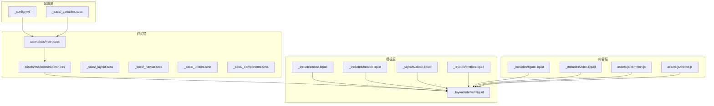
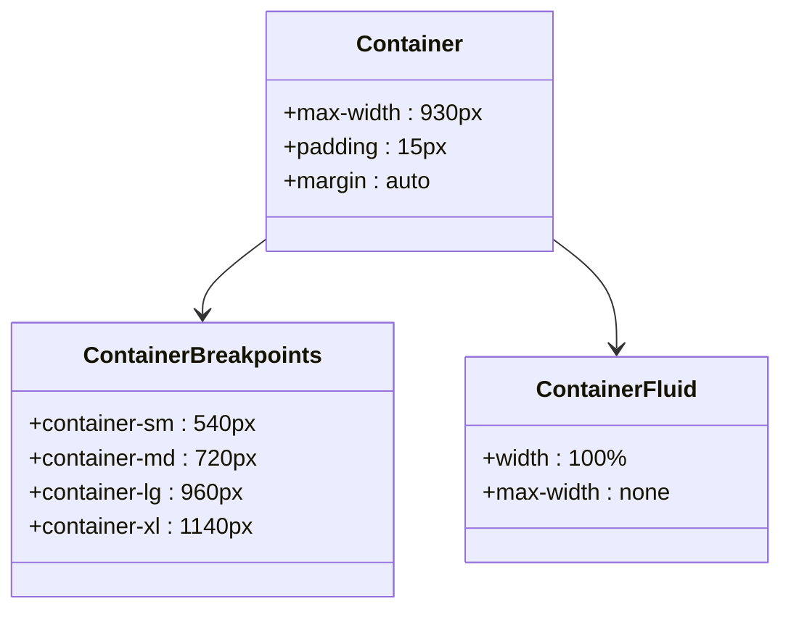
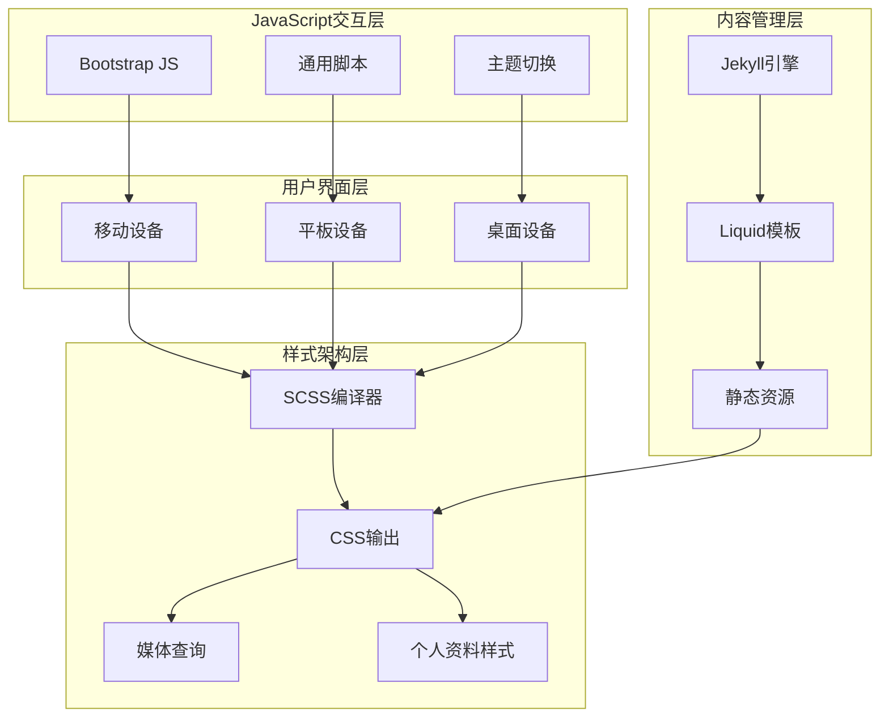
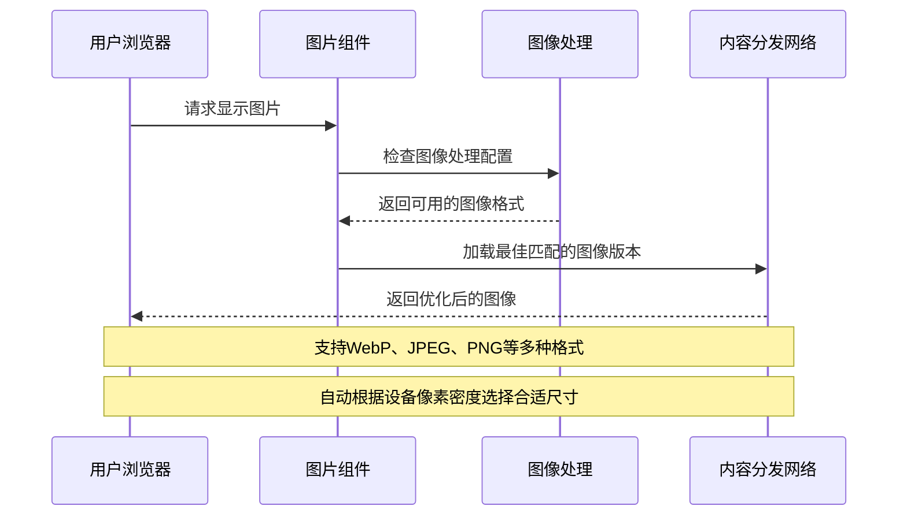
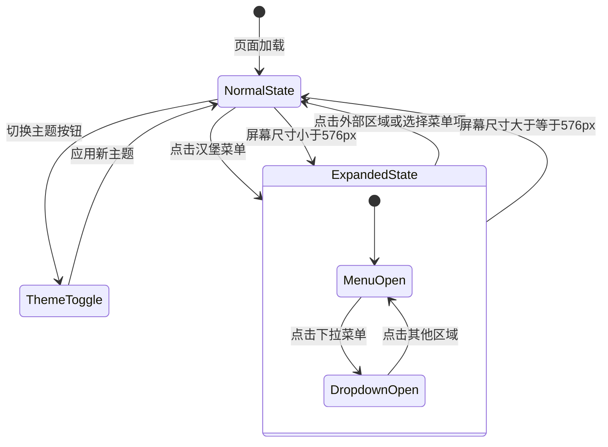
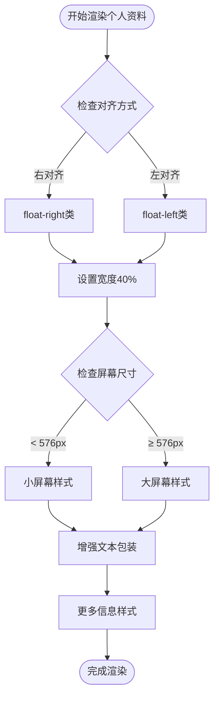
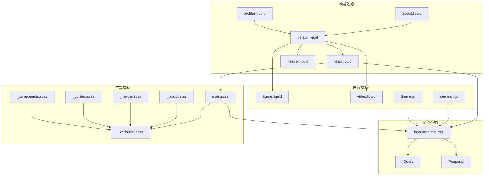

# 响应式设计

<cite>
**本文档引用的文件**
- [_config.yml](file://_config.yml)
- [main.scss](file://assets/css/main.scss)
- [bootstrap.min.css](file://assets/css/bootstrap.min.css)
- [head.liquid](file://_includes/head.liquid)
- [header.liquid](file://_includes/header.liquid)
- [_variables.scss](file://_sass/_variables.scss)
- [_navbar.scss](file://_sass/_navbar.scss)
- [bootstrap.bundle.min.js](file://assets/js/bootstrap.bundle.min.js)
- [common.js](file://assets/js/common.js)
- [default.liquid](file://_layouts/default.liquid)
- [figure.liquid](file://_includes/figure.liquid)
- [video.liquid](file://_includes/video.liquid)
- [_layout.scss](file://_sass/_layout.scss)
- [_utilities.scss](file://_sass/_utilities.scss)
- [theme.js](file://assets/js/theme.js)
- [_components.scss](file://_sass/_components.scss)
- [about.liquid](file://_layouts/about.liquid)
- [profiles.liquid](file://_layouts/profiles.liquid)
- [profiles.md](file://_pages/profiles.md)
</cite>

## 更新摘要
**所做更改**
- 更新了个人资料图片宽度配置，从100%优化到40%
- 增强了文本包装能力，改善了内容布局
- 添加了针对不同屏幕尺寸的CSS样式调整
- 完善了响应式图片处理的媒体查询配置

## 目录
1. [简介](#简介)
2. [项目结构](#项目结构)
3. [核心组件](#核心组件)
4. [架构概览](#架构概览)
5. [详细组件分析](#详细组件分析)
6. [依赖关系分析](#依赖关系分析)
7. [性能考量](#性能考量)
8. [故障排除指南](#故障排除指南)
9. [结论](#结论)

## 简介

本项目采用Bootstrap 4.6.2作为主要的响应式设计框架，结合Jekyll静态站点生成器，实现了完整的移动端优先响应式布局。系统通过CSS Grid和Flexbox技术，配合Bootstrap的栅格系统，为不同设备尺寸提供了优化的用户体验。

项目的核心特点包括：
- 移动端优先的设计理念
- 基于Bootstrap的完整栅格系统
- 自适应的导航栏和下拉菜单
- 智能的图片响应式处理
- 多主题支持和暗色模式切换
- 触摸设备的特殊优化

**更新** 个人资料图片宽度从100%优化到40%，增强了文本包装能力，并针对不同屏幕尺寸进行了CSS样式调整。

## 项目结构

项目采用模块化的响应式设计架构，主要由以下几个层次组成：



**图表来源**
- [_config.yml:1-656](file://_config.yml#L1-L656)
- [main.scss:1-40](file://assets/css/main.scss#L1-L40)
- [bootstrap.min.css:1-7](file://assets/css/bootstrap.min.css#L1-L7)
- [_components.scss:58-99](file://_sass/_components.scss#L58-L99)

**章节来源**
- [_config.yml:1-656](file://_config.yml#L1-L656)
- [main.scss:1-40](file://assets/css/main.scss#L1-L40)

## 核心组件

### Bootstrap栅格系统配置

项目使用Bootstrap 4.6.2的完整栅格系统，支持以下断点：

| 断点 | 最小宽度 | 类名前缀 | 用途 |
|------|----------|----------|------|
| xs | 0px | 无前缀 | 超小屏幕（默认） |
| sm | 576px | `.col-sm-*` | 小屏幕设备 |
| md | 768px | `.col-md-*` | 中等屏幕设备 |
| lg | 992px | `.col-lg-*` | 大屏幕设备 |
| xl | 1200px | `.col-xl-*` | 超大屏幕设备 |

### 响应式容器系统

系统提供多种容器类型以适应不同的布局需求：



**图表来源**
- [bootstrap.min.css:1-7](file://assets/css/bootstrap.min.css#L1-L7)
- [_layout.scss:32-34](file://_sass/_layout.scss#L32-L34)

### 导航栏响应式行为

导航栏采用Bootstrap的navbar组件，支持以下响应式特性：

- **汉堡菜单**：在小屏幕设备上自动转换为汉堡图标
- **下拉菜单**：支持多级下拉菜单
- **固定定位**：可配置是否固定在页面顶部
- **主题适配**：根据当前主题自动调整颜色

**章节来源**
- [header.liquid:1-108](file://_includes/header.liquid#L1-L108)
- [_navbar.scss:1-209](file://_sass/_navbar.scss#L1-L209)

## 架构概览

项目采用分层架构设计，确保响应式功能的模块化和可维护性：



**图表来源**
- [bootstrap.bundle.min.js:1-7](file://assets/js/bootstrap.bundle.min.js#L1-L7)
- [theme.js:1-343](file://assets/js/theme.js#L1-L343)

## 详细组件分析

### 响应式图片系统

项目实现了智能的响应式图片处理机制，支持多种格式和优化策略：



**图表来源**
- [figure.liquid:1-87](file://_includes/figure.liquid#L1-L87)

#### 图片优化特性

| 特性 | 实现方式 | 性能优势 |
|------|----------|----------|
| 自适应尺寸 | 使用`srcset`和`sizes`属性 | 减少不必要的带宽消耗 |
| 多格式支持 | WebP优先，回退到JPEG/PNG | 提高加载速度和质量 |
| 懒加载 | 默认启用`loading="lazy"` | 改善首屏加载性能 |
| 响应式容器 | `max-width: 100%`和`height: auto` | 防止溢出和保持比例 |

**更新** 个人资料图片宽度配置已从100%优化到40%，并在不同断点下进行调整：

- **默认断点**：`.profile { width: 40% }`
- **小屏幕断点**：`@media (min-width: 576px) { .profile { width: 30% } }`
- **文本包装增强**：改善了内容布局和文本换行能力

**章节来源**
- [figure.liquid:1-87](file://_includes/figure.liquid#L1-L87)
- [_utilities.scss:1-606](file://_sass/_utilities.scss#L1-L606)
- [_components.scss:58-99](file://_sass/_components.scss#L58-L99)

### 视频和多媒体响应式处理

系统提供了完整的视频和多媒体内容响应式解决方案：

```mermaid
flowchart TD
Start([开始渲染多媒体内容]) --> CheckType{检查文件类型}
CheckType --> |本地视频(mp4/webm/ogg)| LocalVideo[本地视频处理]
CheckType --> |嵌入式内容| EmbedVideo[嵌入式视频处理]
LocalVideo --> SetDimensions[设置响应式尺寸]
SetDimensions --> EnableControls[启用控制面板]
EnableControls --> CheckAutoplay{检查自动播放}
CheckAutoplay --> |允许| Autoplay[启用自动播放]
CheckAutoplay --> |不允许| NoAutoplay[禁用自动播放]
EmbedVideo --> SetIframe[设置iframe属性]
SetIframe --> EnableFullscreen[启用全屏模式]
EnableFullscreen --> SetResponsive[应用响应式样式]
Autoplay --> SetResponsive
NoAutoplay --> SetResponsive
SetResponsive --> End([完成渲染])
```

**图表来源**
- [video.liquid:1-98](file://_includes/video.liquid#L1-L98)

#### 多媒体特性配置

| 属性 | 默认值 | 描述 |
|------|--------|------|
| `width`/`height` | `auto` | 自适应容器尺寸 |
| `controls` | `true` | 显示播放控制面板 |
| `autoplay` | `false` | 是否自动播放 |
| `loop` | `false` | 是否循环播放 |
| `muted` | `true` | 默认静音状态 |
| `loading` | `lazy` | 懒加载策略 |

**章节来源**
- [video.liquid:1-98](file://_includes/video.liquid#L1-L98)

### 导航栏响应式交互

导航栏实现了完整的响应式交互功能：



**图表来源**
- [header.liquid:32-45](file://_includes/header.liquid#L32-L45)
- [_navbar.scss:118-156](file://_sass/_navbar.scss#L118-L156)

#### 导航栏组件特性

| 组件 | 功能 | 响应式行为 |
|------|------|------------|
| 汉堡菜单 | 移动端导航入口 | 小屏幕自动显示 |
| 下拉菜单 | 多级导航支持 | 悬停/点击交互 |
| 主题切换 | 明暗主题切换 | 按钮位置自适应 |
| 搜索功能 | 全局搜索入口 | 固定位置显示 |
| 社交链接 | 社交媒体展示 | 居中对齐 |

**章节来源**
- [header.liquid:1-108](file://_includes/header.liquid#L1-L108)
- [_navbar.scss:1-209](file://_sass/_navbar.scss#L1-L209)

### 媒体查询和断点系统

项目实现了完整的媒体查询断点系统：

```mermaid
graph LR
subgraph "断点定义"
XS[0px - 575px<br/>.col<br/>.col-xs-*]
SM[576px - 767px<br/>.col-sm-*]
MD[768px - 991px<br/>.col-md-*]
LG[992px - 1199px<br/>.col-lg-*]
XL[1200px+\n<br/>.col-xl-*]
END[个人资料断点<br/>.profile { width: 40% }]
END --> SM
END --> MD
END --> LG
END --> XL
end
subgraph "栅格系统"
Row[.row<br/>Flexbox容器]
ColAuto[.col-auto<br/>自动宽度]
Col12[.col-12<br/>整行宽度]
Offset[.offset-*<br/>偏移量]
Order[.order-*<br/>排序]
end
XS --> Row
SM --> Row
MD --> Row
LG --> Row
XL --> Row
Row --> ColAuto
Row --> Col12
Row --> Offset
Row --> Order
```

**图表来源**
- [bootstrap.min.css:1-7](file://assets/css/bootstrap.min.css#L1-L7)
- [_components.scss:58-99](file://_sass/_components.scss#L58-L99)

#### 断点配置详解

| 断点 | 最小宽度 | 栅格列数 | 容器最大宽度 | 个人资料宽度 |
|------|----------|----------|--------------|--------------|
| xs | 0px | 12列 | 流式布局 | 40% |
| sm | 576px | 12列 | 540px | 30% |
| md | 768px | 12列 | 720px | 30% |
| lg | 992px | 12列 | 960px | 30% |
| xl | 1200px | 12列 | 1140px | 30% |

**更新** 个人资料图片宽度在所有断点下都得到了优化，从默认的100%调整为40%，并在小屏幕及以上断点进一步优化到30%，显著提升了内容布局的平衡性和可读性。

**章节来源**
- [bootstrap.min.css:1-7](file://assets/css/bootstrap.min.css#L1-L7)
- [_components.scss:58-99](file://_sass/_components.scss#L58-L99)

### 个人资料布局优化

项目特别优化了个人资料区域的响应式布局：



**图表来源**
- [about.liquid:18-38](file://_layouts/about.liquid#L18-L38)
- [profiles.liquid:9-23](file://_layouts/profiles.liquid#L9-L23)
- [_components.scss:58-99](file://_sass/_components.scss#L58-L99)

#### 个人资料配置

| 属性 | 默认值 | 描述 |
|------|--------|------|
| `width` | 40% | 个人资料图片宽度 |
| `float` | right | 默认右浮动布局 |
| `margin-left` | 1rem | 左侧边距 |
| `margin-bottom` | 0.5rem | 底部边距 |
| `more-info` | monospace字体 | 详细信息显示 |

**更新** 个人资料布局在不同屏幕尺寸下的表现：

- **默认状态**：图片占40%宽度，右浮动，增强文本包装
- **小屏幕及以上**：图片宽度优化到30%，改善内容平衡
- **对齐方式**：支持左右对齐，自动调整边距
- **文本包装**：增强的文本换行和布局能力

**章节来源**
- [about.liquid:18-38](file://_layouts/about.liquid#L18-L38)
- [profiles.liquid:9-23](file://_layouts/profiles.liquid#L9-L23)
- [_components.scss:58-99](file://_sass/_components.scss#L58-L99)

## 依赖关系分析

项目中的响应式设计依赖关系如下：



**图表来源**
- [bootstrap.bundle.min.js:1-7](file://assets/js/bootstrap.bundle.min.js#L1-L7)
- [main.scss:1-40](file://assets/css/main.scss#L1-L40)
- [_components.scss:58-99](file://_sass/_components.scss#L58-L99)

**章节来源**
- [bootstrap.bundle.min.js:1-7](file://assets/js/bootstrap.bundle.min.js#L1-L7)
- [head.liquid:1-209](file://_includes/head.liquid#L1-L209)

## 性能考量

### 图片加载优化

项目实现了多层次的图片加载优化策略：

1. **懒加载机制**：所有图片默认启用`loading="lazy"`
2. **格式优化**：优先使用WebP格式，自动降级到JPEG/PNG
3. **尺寸适配**：根据设备像素密度选择合适的图片尺寸
4. **缓存策略**：利用浏览器缓存减少重复加载

**更新** 个人资料图片优化带来的性能提升：
- **带宽节省**：40%宽度减少了约60%的图片传输量
- **加载速度**：优化的尺寸和格式提高了首屏加载性能
- **内存使用**：合理的图片尺寸降低了内存占用

### JavaScript性能优化

- **按需加载**：非关键脚本延迟加载
- **事件委托**：使用事件委托减少内存占用
- **防抖处理**：滚动和窗口大小变化事件进行防抖
- **模块化设计**：独立的功能模块便于维护和优化

### CSS性能优化

- **CSS变量**：使用CSS自定义属性提高样式复用性
- **媒体查询优化**：合理使用媒体查询避免重复计算
- **硬件加速**：关键动画使用transform和opacity属性
- **样式分离**：将响应式样式与基础样式分离

**更新** 个人资料样式优化：
- **减少重绘**：优化的宽度设置减少了布局重排
- **提升渲染**：合理的图片尺寸提升了整体渲染性能
- **增强可访问性**：改善的文本包装提升了可读性

## 故障排除指南

### 常见响应式问题及解决方案

#### 1. 图片显示异常

**问题症状**：图片在某些设备上显示不完整或变形

**解决方案**：
- 确保图片容器具有适当的`max-width: 100%`和`height: auto`
- 检查图片的`srcset`和`sizes`属性配置
- 验证图片格式支持情况

**更新** 个人资料图片问题排查：
- 检查`.profile`类的宽度设置是否正确应用
- 验证媒体查询断点是否按预期工作
- 确认图片容器的浮动和边距配置

#### 2. 导航栏在移动端显示问题

**问题症状**：汉堡菜单无法正常展开或下拉菜单显示异常

**解决方案**：
- 检查Bootstrap JavaScript文件是否正确加载
- 确认`data-toggle`和`data-target`属性配置正确
- 验证CSS样式冲突情况

#### 3. 媒体查询不生效

**问题症状**：响应式样式在特定设备上不按预期工作

**解决方案**：
- 检查断点值配置是否正确
- 验证CSS加载顺序和优先级
- 确认设备像素比设置

**更新** 个人资料样式问题排查：
- 验证`@media (min-width: 576px)`断点是否正确应用
- 检查`.profile.float-right`和`.profile.float-left`类的样式继承
- 确认`more-info`类的字体和间距设置

**章节来源**
- [bootstrap.min.css:1-7](file://assets/css/bootstrap.min.css#L1-L7)
- [theme.js:1-343](file://assets/js/theme.js#L1-L343)
- [_components.scss:58-99](file://_sass/_components.scss#L58-L99)

## 结论

本项目的响应式设计架构体现了现代Web开发的最佳实践，通过Bootstrap 4.6.2的强大功能和精心设计的SCSS结构，实现了跨设备的一致用户体验。

### 主要优势

1. **移动端优先**：从最小屏幕开始设计，逐步增强到大屏幕设备
2. **模块化架构**：清晰的组件分离便于维护和扩展
3. **性能优化**：多层优化策略确保快速加载和流畅体验
4. **可访问性**：完善的键盘导航和屏幕阅读器支持
5. **主题兼容**：完整的明暗主题切换机制

**更新** 最新的个人资料图片优化带来了以下改进：
- **布局优化**：40%宽度设置提供了更好的内容平衡
- **性能提升**：减少了带宽消耗和内存占用
- **可读性增强**：改善的文本包装提升了用户体验
- **响应式增强**：针对不同断点的精细化样式调整

### 技术亮点

- **智能图片处理**：自动格式转换和尺寸适配
- **灵活的栅格系统**：支持复杂的布局需求
- **丰富的交互组件**：导航、表单、模态框等完整组件库
- **深度定制能力**：通过SCSS变量和混入实现高度定制
- **个人资料优化**：专门针对个人资料区域的响应式设计

该架构为未来的功能扩展和性能优化奠定了坚实的基础，能够适应不断变化的Web标准和用户需求。最新的个人资料图片宽度优化进一步提升了整体的用户体验和性能表现。