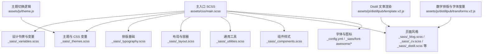
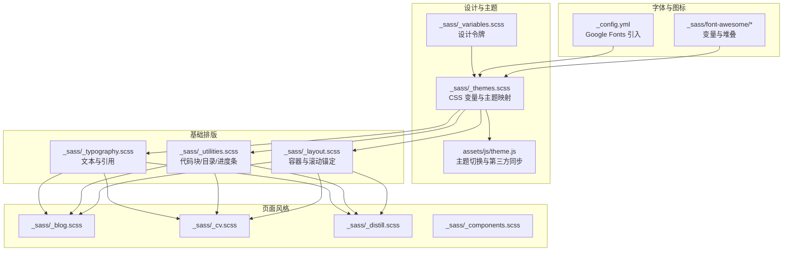
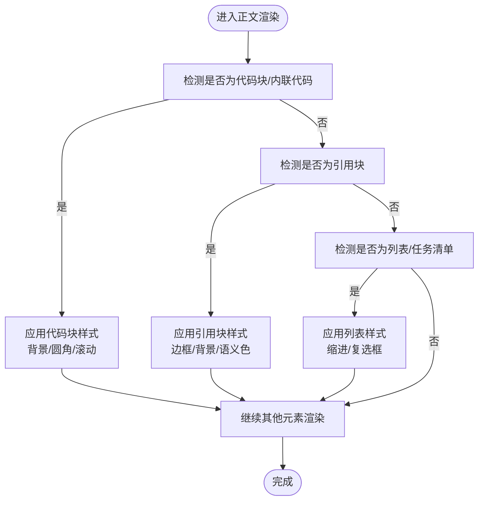
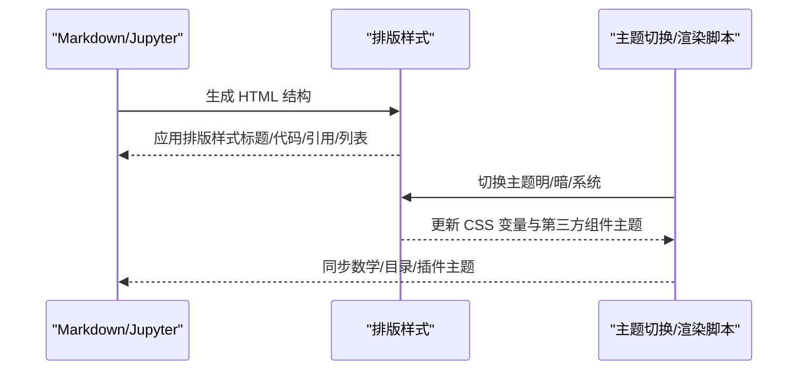
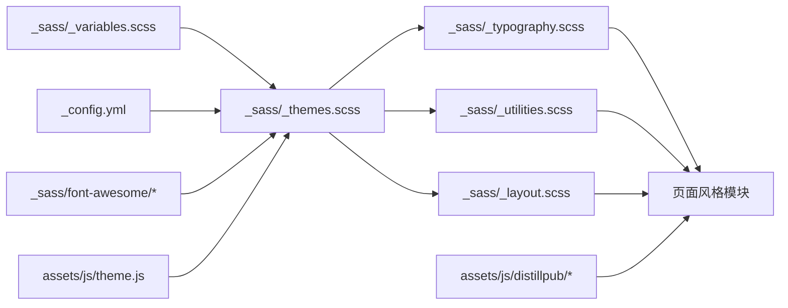

# 排版系统

<cite>
**本文档引用的文件**
- [_sass/_typography.scss](file://_sass/_typography.scss)
- [_sass/_themes.scss](file://_sass/_themes.scss)
- [_sass/_variables.scss](file://_sass/_variables.scss)
- [_sass/_layout.scss](file://_sass/_layout.scss)
- [_sass/_utilities.scss](file://_sass/_utilities.scss)
- [_sass/_components.scss](file://_sass/_components.scss)
- [_sass/_distill.scss](file://_sass/_distill.scss)
- [_sass/_blog.scss](file://_sass/_blog.scss)
- [_sass/_cv.scss](file://_sass/_cv.scss)
- [_sass/_teachings.scss](file://_sass/_teachings.scss)
- [_sass/_tabs.scss](file://_sass/_tabs.scss)
- [_sass/_publications.scss](file://_sass/_publications.scss)
- [_sass/_navbar.scss](file://_sass/_navbar.scss)
- [_sass/_footer.scss](file://_sass/_footer.scss)
- [_sass/_tabs.scss](file://_sass/_tabs.scss)
- [_sass/_themes.scss](file://_sass/_themes.scss)
- [_sass/_typograms.scss](file://_sass/_typograms.scss)
- [_sass/font-awesome/_variables.scss](file://_sass/font-awesome/_variables.scss)
- [_sass/font-awesome/_stacked.scss](file://_sass/font-awesome/_stacked.scss)
- [assets/css/main.scss](file://assets/css/main.scss)
- [_config.yml](file://_config.yml)
- [assets/js/theme.js](file://assets/js/theme.js)
- [assets/js/distillpub/template.v2.js](file://assets/js/distillpub/template.v2.js)
- [assets/js/distillpub/transforms.v2.js](file://assets/js/distillpub/transforms.v2.js)
- [assets/css/jupyter-monokai.css](file://assets/css/jupyter-monokai.css)
- [assets/css/jupyter-grade3.css](file://assets/css/jupyter-grade3.css)
</cite>

## 目录
1. [简介](#简介)
2. [项目结构](#项目结构)
3. [核心组件](#核心组件)
4. [架构总览](#架构总览)
5. [详细组件分析](#详细组件分析)
6. [依赖关系分析](#依赖关系分析)
7. [性能考量](#性能考量)
8. [故障排查指南](#故障排查指南)
9. [结论](#结论)
10. [附录](#附录)

## 简介
本文件为该 Jekyll 主题的排版系统技术文档，聚焦于字体选择与配置、标题层级样式、正文可读性优化、代码块与特殊文本元素样式、跨设备适配策略、可访问性考虑以及与内容管理（Markdown/Jupyter）的集成方式。文档基于仓库中的 SCSS 模块、配置文件与前端脚本进行系统化梳理，帮助读者快速理解并扩展排版体系。

## 项目结构
排版系统主要由以下部分构成：
- 设计令牌与主题变量：集中于变量与主题模块，定义颜色、尺寸、布局约束等基础设计要素。
- 核心排版样式：Typography、Layout、Utilities 等模块分别负责文本、布局与通用工具类。
- 组件与页面风格：Components、Blog、CV、Distill 等模块覆盖不同页面类型的排版细节。
- 字体与图标：通过配置文件引入 Google Fonts，图标库采用 Font Awesome 的 SCSS 变量与堆叠能力。
- 前端主题切换：JavaScript 控制主题状态与过渡，影响 CSS 变量与第三方组件的主题一致性。

图表来源
- [assets/css/main.scss:1-40](file://assets/css/main.scss#L1-L40)
- [_sass/_variables.scss:1-53](file://_sass/_variables.scss#L1-L53)
- [_sass/_themes.scss:1-209](file://_sass/_themes.scss#L1-L209)
- [_sass/_typography.scss:1-137](file://_sass/_typography.scss#L1-L137)
- [_sass/_layout.scss:1-59](file://_sass/_layout.scss#L1-L59)
- [_sass/_utilities.scss:1-606](file://_sass/_utilities.scss#L1-L606)
- [_sass/_components.scss:1-262](file://_sass/_components.scss#L1-L262)
- [_sass/_blog.scss](file://_sass/_blog.scss)
- [_sass/_cv.scss](file://_sass/_cv.scss)
- [_sass/_distill.scss:1-186](file://_sass/_distill.scss#L1-L186)
- [_config.yml:444-448](file://_config.yml#L444-L448)
- [_sass/font-awesome/_variables.scss:51-54](file://_sass/font-awesome/_variables.scss#L51-L54)
- [_sass/font-awesome/_stacked.scss:1-33](file://_sass/font-awesome/_stacked.scss#L1-L33)
- [assets/js/theme.js:1-293](file://assets/js/theme.js#L1-L293)
- [assets/js/distillpub/template.v2.js:4628-4683](file://assets/js/distillpub/template.v2.js#L4628-L4683)
- [assets/js/distillpub/transforms.v2.js:7624-8583](file://assets/js/distillpub/transforms.v2.js#L7624-L8583)

章节来源
- [assets/css/main.scss:1-40](file://assets/css/main.scss#L1-L40)

## 核心组件
- 设计令牌与变量：集中定义颜色、字号、间距、最大宽度等基础设计值，供全局使用。
- 主题系统：通过 CSS 自定义属性与数据属性控制明暗主题，实现统一的颜色与对比度。
- 排版基础：统一文本颜色、链接、表格、引用块等基础样式，确保一致的阅读体验。
- 布局与容器：限制内容最大宽度、滚动锚定、导航栏与页脚的布局行为。
- 通用工具：代码块、进度条、复制按钮、目录等通用 UI 的排版与交互样式。
- 页面风格：博客、CV、Distill 等页面的差异化排版细节与响应式处理。
- 字体与图标：通过配置引入 Google Fonts，图标库使用 SCSS 变量与堆叠能力。

章节来源
- [_sass/_variables.scss:1-53](file://_sass/_variables.scss#L1-L53)
- [_sass/_themes.scss:1-209](file://_sass/_themes.scss#L1-L209)
- [_sass/_typography.scss:1-137](file://_sass/_typography.scss#L1-L137)
- [_sass/_layout.scss:1-59](file://_sass/_layout.scss#L1-L59)
- [_sass/_utilities.scss:1-606](file://_sass/_utilities.scss#L1-L606)
- [_sass/_components.scss:1-262](file://_sass/_components.scss#L1-L262)
- [_sass/_blog.scss](file://_sass/_blog.scss)
- [_sass/_cv.scss](file://_sass/_cv.scss)
- [_sass/_distill.scss:1-186](file://_sass/_distill.scss#L1-L186)
- [_config.yml:444-448](file://_config.yml#L444-L448)
- [_sass/font-awesome/_variables.scss:51-54](file://_sass/font-awesome/_variables.scss#L51-L54)
- [_sass/font-awesome/_stacked.scss:1-33](file://_sass/font-awesome/_stacked.scss#L1-L33)

## 架构总览
排版系统以“设计令牌—主题—基础排版—页面风格”的分层组织，配合 JavaScript 主题切换与第三方渲染脚本，形成完整的跨设备、跨主题的排版体验。

图表来源
- [_sass/_variables.scss:1-53](file://_sass/_variables.scss#L1-L53)
- [_sass/_themes.scss:1-209](file://_sass/_themes.scss#L1-L209)
- [assets/js/theme.js:1-293](file://assets/js/theme.js#L1-L293)
- [_sass/_typography.scss:1-137](file://_sass/_typography.scss#L1-L137)
- [_sass/_utilities.scss:1-606](file://_sass/_utilities.scss#L1-L606)
- [_sass/_layout.scss:1-59](file://_sass/_layout.scss#L1-L59)
- [_sass/_blog.scss](file://_sass/_blog.scss)
- [_sass/_cv.scss](file://_sass/_cv.scss)
- [_sass/_distill.scss:1-186](file://_sass/_distill.scss#L1-L186)
- [_sass/_components.scss:1-262](file://_sass/_components.scss#L1-L262)
- [_config.yml:444-448](file://_config.yml#L444-L448)
- [_sass/font-awesome/_variables.scss:51-54](file://_sass/font-awesome/_variables.scss#L51-L54)
- [_sass/font-awesome/_stacked.scss:1-33](file://_sass/font-awesome/_stacked.scss#L1-L33)

## 详细组件分析

### 字体选择与配置原则
- 字体加载策略
  - 通过配置文件引入 Google Fonts，指定 Roboto 与 Roboto Slab 等字体族，满足中英文混排需求。
  - 字体显示策略由配置项控制，避免阻塞渲染。
- 字体回退机制
  - SCSS 变量中定义了字体路径与显示策略，确保在字体加载失败时有合理的回退。
- 中英文字体搭配
  - 配置中包含 Roboto 与 Roboto Slab，适合正文与标题的搭配；具体标题层级的字号与权重在各页面风格中进一步细化。

章节来源
- [_config.yml:444-448](file://_config.yml#L444-L448)
- [_sass/font-awesome/_variables.scss:51-54](file://_sass/font-awesome/_variables.scss#L51-L54)

### 标题层级样式设计（h1–h6）
- 视觉层次
  - 标题颜色、粗细、行高与边距在各页面风格中按重要性递减，确保清晰的层级关系。
  - Distill 文章对标题的边框、分隔线与强调色进行了增强，突出层次。
- 滚动锚定
  - 全局为所有标题设置了滚动偏移，避免被固定导航遮挡。
- 行高与间距
  - 不同页面风格对标题的上下间距与行高做了差异化处理，提升可读性。

章节来源
- [_sass/_layout.scss:12-19](file://_sass/_layout.scss#L12-L19)
- [_sass/_distill.scss:21-50](file://_sass/_distill.scss#L21-L50)
- [_sass/_blog.scss](file://_sass/_blog.scss)
- [_sass/_cv.scss](file://_sass/_cv.scss)
- [_sass/_teachings.scss](file://_sass/_teachings.scss)
- [_sass/_tabs.scss](file://_sass/_tabs.scss)

### 正文文本可读性优化
- 颜色与对比度
  - 使用主题变量统一文本颜色，保证明暗主题下的对比度与可读性。
- 行高与字间距
  - 在 Distill 等页面风格中对段落行高与标题行高做了专门设置，提升长文本可读性。
- 段落间距
  - 通过统一的段前段后间距与列表缩进，保持段落边界清晰。

章节来源
- [_sass/_themes.scss:7-83](file://_sass/_themes.scss#L7-L83)
- [_sass/_distill.scss:124](file://_sass/_distill.scss#L124)
- [_sass/_typography.scss:1-137](file://_sass/_typography.scss#L1-L137)

### 特殊文本元素样式
- 代码块与内联代码
  - 代码块具备背景色、圆角、滚动与复制按钮；内联代码具备背景与圆角。
  - 移动端对代码块与内联代码的字号与内边距做了响应式调整。
- 引用块
  - 支持普通引用与提示/警告/危险三类语义化引用块，分别使用主题色与背景色区分。
- 列表与任务清单
  - 任务清单的复选框与嵌套列表缩进得到统一处理。
- 数学公式与公式渲染
  - Distill 渲染模板与字体变换脚本共同保障数学公式的正确显示与度量。

图表来源
- [_sass/_utilities.scss:9-56](file://_sass/_utilities.scss#L9-L56)
- [_sass/_typography.scss:59-136](file://_sass/_typography.scss#L59-L136)
- [_sass/_components.scss:7-20](file://_sass/_components.scss#L7-L20)

章节来源
- [_sass/_utilities.scss:1-606](file://_sass/_utilities.scss#L1-L606)
- [_sass/_typography.scss:1-137](file://_sass/_typography.scss#L1-L137)
- [_sass/_components.scss:1-262](file://_sass/_components.scss#L1-L262)
- [assets/js/distillpub/template.v2.js:4628-4683](file://assets/js/distillpub/template.v2.js#L4628-L4683)
- [assets/js/distillpub/transforms.v2.js:7624-8583](file://assets/js/distillpub/transforms.v2.js#L7624-L8583)

### 跨设备适配策略
- 容器宽度与滚动锚定
  - 内容最大宽度由变量控制，标题滚动偏移统一设置。
- 响应式代码块与内联代码
  - 在小屏与超小屏下调整字号与内边距，保证可读性与可点触。
- 目录与 TOC
  - 在窄屏下隐藏或折叠目录，避免遮挡正文。
- 图片与媒体
  - 通过组件样式与响应式图片策略，确保媒体在不同设备上合理展示。

章节来源
- [_sass/_layout.scss:32-34](file://_sass/_layout.scss#L32-L34)
- [_sass/_utilities.scss:209-273](file://_sass/_utilities.scss#L209-L273)
- [_sass/_utilities.scss:28-207](file://_sass/_utilities.scss#L28-L207)

### 可访问性考虑
- 对比度与颜色
  - 明暗主题通过 CSS 变量统一管理，确保文本与背景的对比度符合可读性要求。
- 缩放支持
  - 使用相对单位与 rem/em，配合浏览器默认缩放，保证用户缩放时的可读性。
- 键盘与焦点
  - 代码块复制按钮与目录导航具备可见焦点状态，便于键盘操作。
- 数学公式
  - 数学渲染脚本与字体度量计算确保公式在不同主题下的清晰度。

章节来源
- [_sass/_themes.scss:1-209](file://_sass/_themes.scss#L1-L209)
- [_sass/_utilities.scss:125-149](file://_sass/_utilities.scss#L125-L149)
- [assets/js/distillpub/transforms.v2.js:7624-8583](file://assets/js/distillpub/transforms.v2.js#L7624-L8583)

### 与内容管理系统的集成
- Jekyll Markdown
  - 默认 Markdown 渲染器与语法高亮器配置，生成的 HTML 结构与排版样式相匹配。
- Jupyter Notebook
  - 提供两套主题化的 CSS（Monokai 与 Grade3），用于 Notebook 输出的标题层级与行高优化。
- Distill 文章
  - 通过模板与变换脚本，将文章结构转换为带网格与目录的排版，同时处理数学公式与 TOC。

图表来源
- [_config.yml:158-169](file://_config.yml#L158-L169)
- [assets/css/jupyter-monokai.css:2268-2877](file://assets/css/jupyter-monokai.css#L2268-L2877)
- [assets/css/jupyter-grade3.css:2834-2874](file://assets/css/jupyter-grade3.css#L2834-L2874)
- [assets/js/theme.js:1-293](file://assets/js/theme.js#L1-L293)
- [assets/js/distillpub/template.v2.js:4628-4683](file://assets/js/distillpub/template.v2.js#L4628-L4683)
- [assets/js/distillpub/transforms.v2.js:7624-8583](file://assets/js/distillpub/transforms.v2.js#L7624-L8583)

章节来源
- [_config.yml:158-169](file://_config.yml#L158-L169)
- [assets/css/jupyter-monokai.css:2268-2877](file://assets/css/jupyter-monokai.css#L2268-L2877)
- [assets/css/jupyter-grade3.css:2834-2874](file://assets/css/jupyter-grade3.css#L2834-L2874)
- [assets/js/theme.js:1-293](file://assets/js/theme.js#L1-L293)
- [assets/js/distillpub/template.v2.js:4628-4683](file://assets/js/distillpub/template.v2.js#L4628-L4683)
- [assets/js/distillpub/transforms.v2.js:7624-8583](file://assets/js/distillpub/transforms.v2.js#L7624-L8583)

## 依赖关系分析
- 变量与主题
  - 所有排版样式依赖主题变量提供的颜色与尺寸，确保一致性。
- 字体与图标
  - 字体通过配置文件引入，图标库通过 SCSS 变量与堆叠能力实现。
- 页面风格
  - 各页面风格模块在基础排版之上进行差异化增强，避免重复与冲突。
- 前端脚本
  - 主题切换脚本与 Distill 渲染脚本协同工作，保证第三方组件与主题一致。

图表来源
- [_sass/_variables.scss:1-53](file://_sass/_variables.scss#L1-L53)
- [_sass/_themes.scss:1-209](file://_sass/_themes.scss#L1-L209)
- [_sass/_typography.scss:1-137](file://_sass/_typography.scss#L1-L137)
- [_sass/_utilities.scss:1-606](file://_sass/_utilities.scss#L1-L606)
- [_sass/_layout.scss:1-59](file://_sass/_layout.scss#L1-L59)
- [_sass/_blog.scss](file://_sass/_blog.scss)
- [_sass/_cv.scss](file://_sass/_cv.scss)
- [_sass/_distill.scss:1-186](file://_sass/_distill.scss#L1-L186)
- [_config.yml:444-448](file://_config.yml#L444-L448)
- [_sass/font-awesome/_variables.scss:51-54](file://_sass/font-awesome/_variables.scss#L51-L54)
- [_sass/font-awesome/_stacked.scss:1-33](file://_sass/font-awesome/_stacked.scss#L1-L33)
- [assets/js/theme.js:1-293](file://assets/js/theme.js#L1-L293)
- [assets/js/distillpub/template.v2.js:4628-4683](file://assets/js/distillpub/template.v2.js#L4628-L4683)
- [assets/js/distillpub/transforms.v2.js:7624-8583](file://assets/js/distillpub/transforms.v2.js#L7624-L8583)

章节来源
- [assets/css/main.scss:10-40](file://assets/css/main.scss#L10-L40)
- [_sass/_themes.scss:1-209](file://_sass/_themes.scss#L1-L209)
- [_sass/_typography.scss:1-137](file://_sass/_typography.scss#L1-L137)
- [_sass/_utilities.scss:1-606](file://_sass/_utilities.scss#L1-L606)
- [_sass/_layout.scss:1-59](file://_sass/_layout.scss#L1-L59)
- [_sass/_blog.scss](file://_sass/_blog.scss)
- [_sass/_cv.scss](file://_sass/_cv.scss)
- [_sass/_distill.scss:1-186](file://_sass/_distill.scss#L1-L186)
- [_config.yml:444-448](file://_config.yml#L444-L448)
- [_sass/font-awesome/_variables.scss:51-54](file://_sass/font-awesome/_variables.scss#L51-L54)
- [_sass/font-awesome/_stacked.scss:1-33](file://_sass/font-awesome/_stacked.scss#L1-L33)
- [assets/js/theme.js:1-293](file://assets/js/theme.js#L1-L293)
- [assets/js/distillpub/template.v2.js:4628-4683](file://assets/js/distillpub/template.v2.js#L4628-L4683)
- [assets/js/distillpub/transforms.v2.js:7624-8583](file://assets/js/distillpub/transforms.v2.js#L7624-L8583)

## 性能考量
- 字体加载
  - 使用 Google Fonts 并设置合适的显示策略，减少阻塞。
- 代码块滚动
  - 仅在需要时启用横向滚动，避免不必要的重排。
- 主题切换过渡
  - 通过 CSS 过渡与 JavaScript 控制，降低主题切换的视觉突兀感。
- 第三方组件
  - 主题切换脚本同步第三方组件主题，避免重复渲染与闪烁。

## 故障排查指南
- 标题被导航遮挡
  - 检查标题滚动偏移设置是否生效。
- 代码块不可见或溢出
  - 确认代码块容器的滚动与背景色设置，检查移动端字号与内边距。
- 引用块颜色异常
  - 检查主题变量与语义化引用块的 CSS 类是否正确应用。
- 数学公式显示异常
  - 确认 Distill 渲染脚本与字体度量配置是否正确加载。
- 主题切换不一致
  - 检查主题切换脚本是否正确更新数据属性与第三方组件主题。

章节来源
- [_sass/_layout.scss:12-19](file://_sass/_layout.scss#L12-L19)
- [_sass/_utilities.scss:9-56](file://_sass/_utilities.scss#L9-L56)
- [_sass/_typography.scss:59-136](file://_sass/_typography.scss#L59-L136)
- [assets/js/distillpub/template.v2.js:4628-4683](file://assets/js/distillpub/template.v2.js#L4628-L4683)
- [assets/js/distillpub/transforms.v2.js:7624-8583](file://assets/js/distillpub/transforms.v2.js#L7624-L8583)
- [assets/js/theme.js:1-293](file://assets/js/theme.js#L1-L293)

## 结论
该排版系统以变量与主题为核心，结合基础排版与页面风格模块，实现了跨设备、跨主题的一致体验。通过字体加载策略、标题层级规范、正文可读性优化与特殊元素样式，满足学术与技术内容的阅读需求。同时，与 Jekyll 与 Distill 的集成使得内容作者可以专注于写作，而无需过度关注样式细节。

## 附录
- 关键变量与主题
  - 最大内容宽度、主题色、文本色、分割线色等均通过变量与 CSS 变量集中管理。
- 字体与图标
  - Google Fonts 与 Font Awesome 的变量与堆叠能力为排版提供了灵活的扩展点。
- 页面风格
  - 博客、CV、Distill 等模块在基础之上提供差异化排版，便于按场景定制。

章节来源
- [_sass/_variables.scss:1-53](file://_sass/_variables.scss#L1-L53)
- [_sass/_themes.scss:1-209](file://_sass/_themes.scss#L1-L209)
- [_config.yml:444-448](file://_config.yml#L444-L448)
- [_sass/font-awesome/_variables.scss:51-54](file://_sass/font-awesome/_variables.scss#L51-L54)
- [_sass/font-awesome/_stacked.scss:1-33](file://_sass/font-awesome/_stacked.scss#L1-L33)
- [_sass/_blog.scss](file://_sass/_blog.scss)
- [_sass/_cv.scss](file://_sass/_cv.scss)
- [_sass/_distill.scss:1-186](file://_sass/_distill.scss#L1-L186)