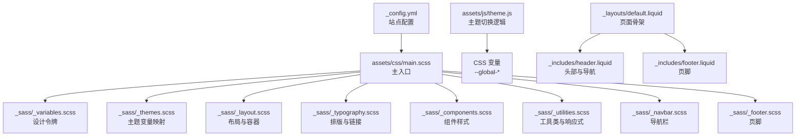
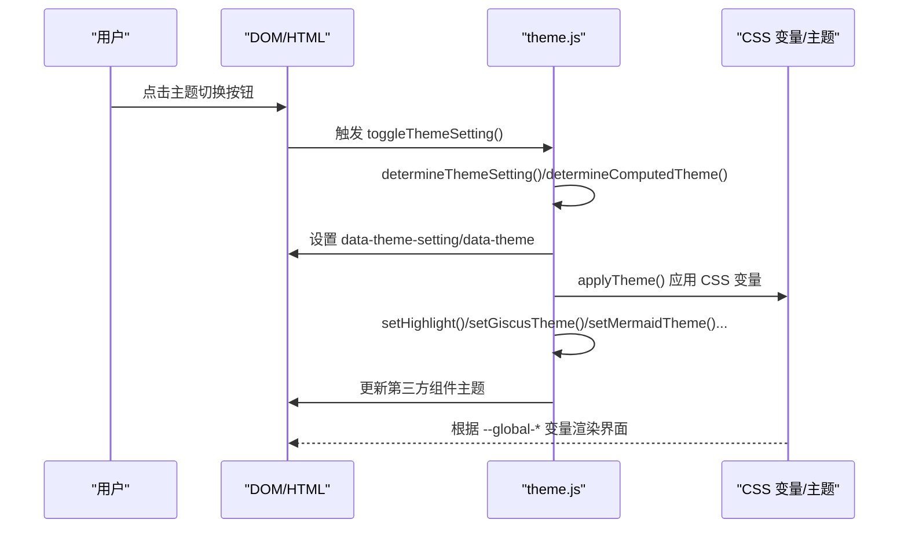
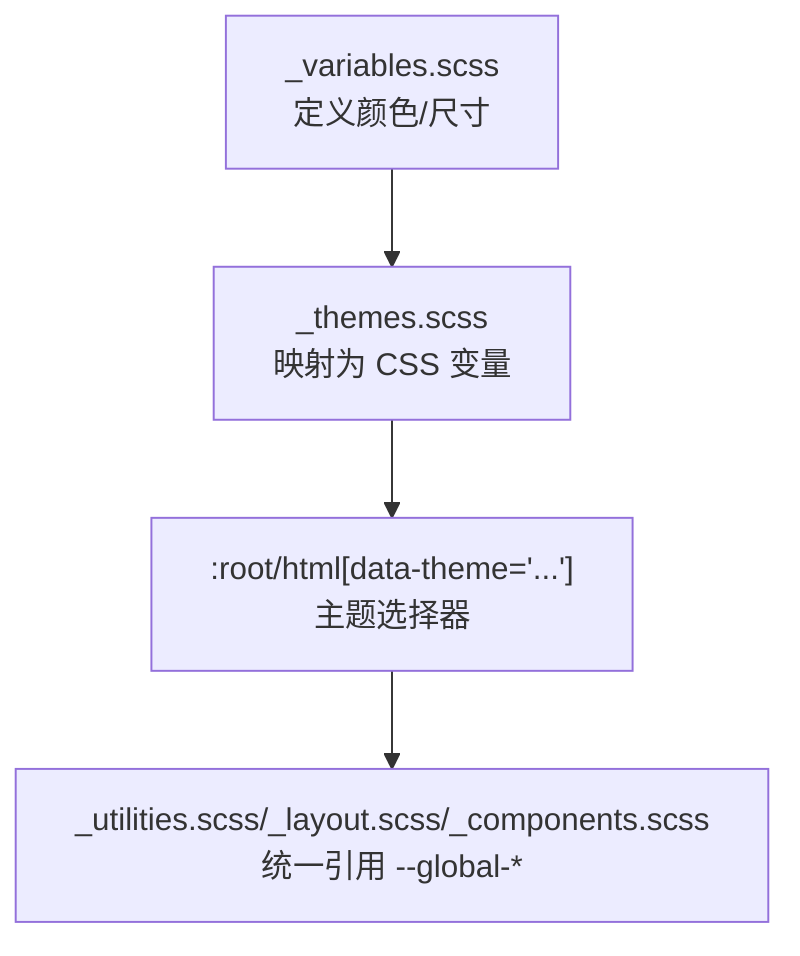
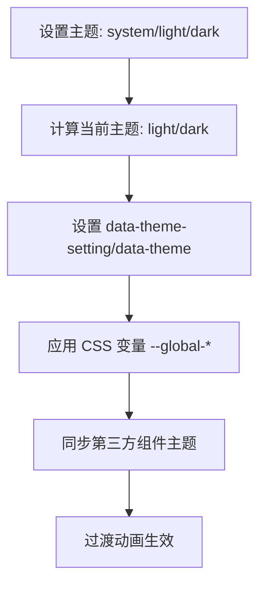
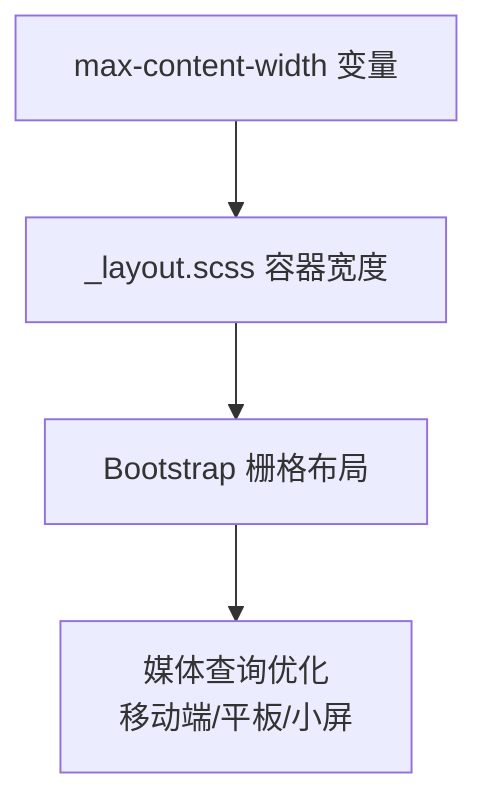
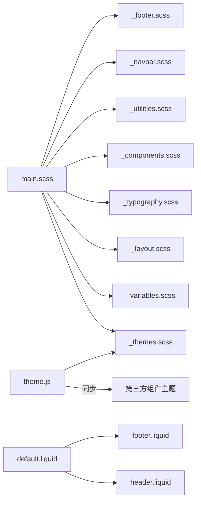

# 样式和主题系统

<cite>
**本文档引用的文件**
- [main.scss](file://assets/css/main.scss)
- [_variables.scss](file://_sass/_variables.scss)
- [_themes.scss](file://_sass/_themes.scss)
- [theme.js](file://assets/js/theme.js)
- [_layout.scss](file://_sass/_layout.scss)
- [_typography.scss](file://_sass/_typography.scss)
- [_utilities.scss](file://_sass/_utilities.scss)
- [_components.scss](file://_sass/_components.scss)
- [_navbar.scss](file://_sass/_navbar.scss)
- [_footer.scss](file://_sass/_footer.scss)
- [_config.yml](file://_config.yml)
- [default.liquid](file://_layouts/default.liquid)
- [header.liquid](file://_includes/header.liquid)
- [footer.liquid](file://_includes/footer.liquid)
- [package.json](file://package.json)
</cite>

## 目录
1. [简介](#简介)
2. [项目结构](#项目结构)
3. [核心组件](#核心组件)
4. [架构总览](#架构总览)
5. [详细组件分析](#详细组件分析)
6. [依赖关系分析](#依赖关系分析)
7. [性能考虑](#性能考虑)
8. [故障排除指南](#故障排除指南)
9. [结论](#结论)
10. [附录](#附录)

## 简介
本文件系统性阐述该 Jekyll 站点的样式与主题系统，涵盖 SCSS 变量体系、颜色与字体方案、响应式设计与网格系统、主题定制与切换机制、CSS 编译与优化策略、自定义样式添加与命名规范、浏览器兼容性与性能优化建议，以及与 Bootstrap 框架的集成与扩展方式。

## 项目结构
样式系统由三部分组成：
- SCSS 主入口：负责模块化导入与设计令牌配置
- SCSS 分区样式：按布局、组件、工具类等分层组织
- 主题切换脚本：基于 CSS 变量与数据属性驱动的主题渲染与第三方组件主题同步

**图表来源**
- [main.scss:1-40](file://assets/css/main.scss#L1-L40)
- [_variables.scss:1-53](file://_sass/_variables.scss#L1-L53)
- [_themes.scss:1-209](file://_sass/_themes.scss#L1-L209)
- [_layout.scss:1-59](file://_sass/_layout.scss#L1-L59)
- [_typography.scss:1-137](file://_sass/_typography.scss#L1-L137)
- [_components.scss:1-262](file://_sass/_components.scss#L1-L262)
- [_utilities.scss:1-606](file://_sass/_utilities.scss#L1-L606)
- [_navbar.scss:1-209](file://_sass/_navbar.scss#L1-L209)
- [_footer.scss:1-36](file://_sass/_footer.scss#L1-L36)
- [theme.js:1-343](file://assets/js/theme.js#L1-L343)
- [_config.yml:1-656](file://_config.yml#L1-L656)
- [default.liquid:1-57](file://_layouts/default.liquid#L1-L57)
- [header.liquid:1-108](file://_includes/header.liquid#L1-L108)
- [footer.liquid:1-31](file://_includes/footer.liquid#L1-L31)

**章节来源**
- [main.scss:1-40](file://assets/css/main.scss#L1-L40)
- [_config.yml:62-65](file://_config.yml#L62-L65)

## 核心组件
- 设计令牌与变量系统：集中于 SCSS 变量与 CSS 自定义属性映射，确保颜色、间距、字号等可全局覆盖与主题化
- 主题系统：通过 CSS 变量与数据属性在根元素上切换明暗主题，配合 JS 同步第三方组件主题
- 响应式与网格：结合 Bootstrap 的栅格系统与媒体查询，实现移动端优先的自适应布局
- 组件与工具类：卡片、导航、页脚、代码高亮、进度条、搜索框等复用样式
- 编译与优化：Jekyll 配置启用压缩输出，结合外部库版本管理与完整性校验

**章节来源**
- [_variables.scss:1-53](file://_sass/_variables.scss#L1-L53)
- [_themes.scss:1-209](file://_sass/_themes.scss#L1-L209)
- [_utilities.scss:1-606](file://_sass/_utilities.scss#L1-L606)
- [_config.yml:226-244](file://_config.yml#L226-L244)

## 架构总览
主题切换从用户交互开始，JS 决定主题设置与计算主题，随后为根元素设置数据属性并应用 CSS 变量；同时同步第三方组件（如 mermaid、echarts、plotly、vega 等）的主题，最后通过过渡类实现平滑切换。

**图表来源**
- [theme.js:4-312](file://assets/js/theme.js#L4-L312)
- [_themes.scss:7-155](file://_sass/_themes.scss#L7-L155)

**章节来源**
- [theme.js:1-343](file://assets/js/theme.js#L1-L343)
- [_themes.scss:1-209](file://_sass/_themes.scss#L1-L209)

## 详细组件分析

### SCSS 变量系统与设计令牌
- 颜色体系：定义品牌色、语义色、灰阶与代码背景色，支持通过 SCSS 颜色函数进行亮度调整
- 全局尺寸：最大内容宽度、回到顶部按钮尺寸与定位等
- 字体图标路径：FontAwesome 字体资源路径配置
- 使用方式：在各分区样式中以变量或 CSS 变量形式统一引用，避免硬编码

**图表来源**
- [_variables.scss:1-53](file://_sass/_variables.scss#L1-L53)
- [_themes.scss:7-122](file://_sass/_themes.scss#L7-L122)
- [_utilities.scss:1-606](file://_sass/_utilities.scss#L1-L606)
- [_layout.scss:1-59](file://_sass/_layout.scss#L1-L59)
- [_components.scss:1-262](file://_sass/_components.scss#L1-L262)

**章节来源**
- [_variables.scss:1-53](file://_sass/_variables.scss#L1-L53)
- [_themes.scss:1-209](file://_sass/_themes.scss#L1-L209)

### 主题系统与切换机制
- CSS 变量映射：将 SCSS 变量映射为 :root 与 html[data-theme] 下的 CSS 变量，实现明/暗两套主题
- 主题设置与计算：支持“系统/浅色/深色”三种设置，系统模式根据 prefers-color-scheme 判断
- 过渡动画：通过过渡类在主题切换时实现平滑过渡
- 第三方组件同步：针对 mermaid、echarts、plotly、vega、diff2html、giscus、ninja-keys、cookie consent 等组件分别设置对应主题

**图表来源**
- [theme.js:25-312](file://assets/js/theme.js#L25-L312)
- [_themes.scss:7-155](file://_sass/_themes.scss#L7-L155)

**章节来源**
- [theme.js:1-343](file://assets/js/theme.js#L1-L343)
- [_themes.scss:1-209](file://_sass/_themes.scss#L1-L209)

### 响应式设计与网格系统
- 容器与内容宽度：通过变量控制最大内容宽度，保证在大屏下的阅读舒适度
- 移动端优先：在工具类与组件中广泛使用媒体查询，针对小屏、超小屏、平板进行优化
- Bootstrap 集成：页面骨架采用 Bootstrap 栅格，配合 Liquid 模板实现内容与侧边栏布局

**图表来源**
- [_layout.scss:32-34](file://_sass/_layout.scss#L32-L34)
- [_utilities.scss:210-273](file://_sass/_utilities.scss#L210-L273)
- [default.liquid:24-47](file://_layouts/default.liquid#L24-L47)

**章节来源**
- [_layout.scss:1-59](file://_sass/_layout.scss#L1-L59)
- [_utilities.scss:209-273](file://_sass/_utilities.scss#L209-L273)
- [default.liquid:1-57](file://_layouts/default.liquid#L1-L57)

### 排版与链接样式
- 文本与标题：统一继承 CSS 变量，标题滚动锚点偏移保证导航不遮挡
- 链接与表格：链接悬停下划线、表格暗色主题适配
- 引用块：提示/警告/危险区块的色彩与文本色统一

**章节来源**
- [_typography.scss:1-137](file://_sass/_typography.scss#L1-L137)

### 导航栏与页脚
- 导航栏：背景、分割线、下拉菜单、品牌链接与社交图标在不同主题下保持一致的对比度
- 页脚：固定底部与粘性底部两种模式，链接在主题间保持可读性

**章节来源**
- [_navbar.scss:1-209](file://_sass/_navbar.scss#L1-L209)
- [_footer.scss:1-36](file://_sass/_footer.scss#L1-L36)

### 组件与工具类
- 卡片与项目：卡片背景、标题、正文、项目网格与分类标题
- 代码高亮：容器溢出滚动、行内代码换行、预格式化文本
- 进度条：固定位置与主题色，支持滚动进度指示
- 表单与搜索：输入框焦点状态、按钮主题色、搜索快捷键样式
- 动画与过渡：统一的过渡类，减少闪烁与突变

**章节来源**
- [_components.scss:1-262](file://_sass/_components.scss#L1-L262)
- [_utilities.scss:1-606](file://_sass/_utilities.scss#L1-L606)

### 页面骨架与头部/页脚集成
- 默认布局：容器、侧边栏、主要内容区域、页脚集成
- 头部：导航栏、搜索按钮、主题切换按钮、语言切换
- 页脚：版权信息、可选订阅表单、固定/粘性模式

**章节来源**
- [default.liquid:1-57](file://_layouts/default.liquid#L1-L57)
- [header.liquid:1-108](file://_includes/header.liquid#L1-L108)
- [footer.liquid:1-31](file://_includes/footer.liquid#L1-L31)

## 依赖关系分析
- SCSS 主入口依赖变量与主题映射，再按功能分区导入
- 主题切换脚本依赖 CSS 变量与第三方组件接口
- 页面骨架依赖 Liquid 模板与 Bootstrap 类名

**图表来源**
- [main.scss:1-40](file://assets/css/main.scss#L1-L40)
- [_themes.scss:1-209](file://_sass/_themes.scss#L1-L209)
- [theme.js:1-343](file://assets/js/theme.js#L1-L343)
- [default.liquid:1-57](file://_layouts/default.liquid#L1-L57)
- [header.liquid:1-108](file://_includes/header.liquid#L1-L108)
- [footer.liquid:1-31](file://_includes/footer.liquid#L1-L31)

**章节来源**
- [main.scss:1-40](file://assets/css/main.scss#L1-L40)
- [theme.js:1-343](file://assets/js/theme.js#L1-L343)

## 性能考虑
- CSS 压缩：Jekyll 配置启用压缩输出，减小传输体积
- 资源完整性：第三方库通过完整性哈希校验，提升安全性
- 图像优化：开启响应式 WebP 与懒加载，降低首屏压力
- JavaScript 压缩：使用 Terser 去除日志，减少体积
- 渐进增强：主题切换过渡时间可控，避免过度动画影响性能

**章节来源**
- [_config.yml:226-244](file://_config.yml#L226-L244)
- [_config.yml:350-375](file://_config.yml#L350-L375)
- [_config.yml:405-634](file://_config.yml#L405-L634)

## 故障排除指南
- 主题切换无效
  - 检查根元素是否正确设置 data-theme 与 data-theme-setting
  - 确认 CSS 变量已映射至 :root 与 html[data-theme]
  - 查看第三方组件是否支持对应主题（如 mermaid、echarts）
- 代码高亮异常
  - 确认高亮主题样式文件在主题设置下正确切换
  - 检查容器溢出滚动与预格式化文本的样式冲突
- 响应式显示问题
  - 检查媒体查询范围与设备断点是否符合预期
  - 确保容器最大宽度变量与布局一致
- 第三方组件主题不同步
  - 检查 theme.js 中对应组件的 setXxxTheme 函数调用
  - 确认组件初始化顺序与重新渲染逻辑

**章节来源**
- [theme.js:93-312](file://assets/js/theme.js#L93-L312)
- [_utilities.scss:210-273](file://_sass/_utilities.scss#L210-L273)

## 结论
该样式与主题系统通过 SCSS 变量与 CSS 变量的双层映射，实现了清晰的设计令牌与强大的主题可定制性；结合 JS 主题切换与第三方组件同步，提供了良好的用户体验。响应式设计遵循移动优先原则，并与 Bootstrap 栅格系统无缝协作。通过 Jekyll 配置与外部库管理，兼顾了安全性与性能。

## 附录

### 主题定制指南
- 颜色主题
  - 在变量文件中调整品牌色、语义色与灰阶
  - 通过主题映射文件确认 CSS 变量覆盖范围
- 字体与字号
  - 在排版样式中统一调整字号、行高与字重
  - 确保代码块与表格在不同主题下可读性
- 布局与间距
  - 修改最大内容宽度与容器内边距
  - 调整卡片、导航与页脚的间距与分隔线
- 主题切换行为
  - 在配置中启用/禁用暗色模式
  - 控制系统偏好监听与默认主题设置

**章节来源**
- [_variables.scss:1-53](file://_sass/_variables.scss#L1-L53)
- [_themes.scss:1-209](file://_sass/_themes.scss#L1-L209)
- [_config.yml:391-391](file://_config.yml#L391-L391)

### 自定义样式添加与命名规范
- 新增样式文件：在 SCSS 分区中新增文件，并在主入口导入
- 命名规范：采用 BEM 或语义化命名，避免与现有类冲突
- 变量优先：尽量通过变量与 CSS 变量控制颜色与尺寸
- 响应式：在工具类中补充媒体查询，确保多端一致性

**章节来源**
- [main.scss:18-39](file://assets/css/main.scss#L18-L39)
- [_utilities.scss:1-606](file://_sass/_utilities.scss#L1-L606)

### 浏览器兼容性与性能优化建议
- 兼容性：使用 CSS 变量与现代选择器，必要时提供降级方案
- 性能：启用压缩与完整性校验，合理拆分与缓存第三方库
- 体验：控制过渡时长，避免复杂动画阻塞主线程

**章节来源**
- [_config.yml:226-244](file://_config.yml#L226-L244)
- [_config.yml:405-634](file://_config.yml#L405-L634)

### 与 Bootstrap 的集成与扩展
- 栅格系统：在布局与组件中使用 Bootstrap 栅格类
- 组件类名：遵循 Bootstrap 类名约定，避免冲突
- 扩展样式：在组件与工具类中补充主题化样式，确保与框架一致

**章节来源**
- [default.liquid:24-47](file://_layouts/default.liquid#L24-L47)
- [_components.scss:1-262](file://_sass/_components.scss#L1-L262)
- [_utilities.scss:1-606](file://_sass/_utilities.scss#L1-L606)