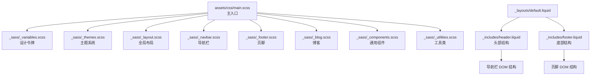
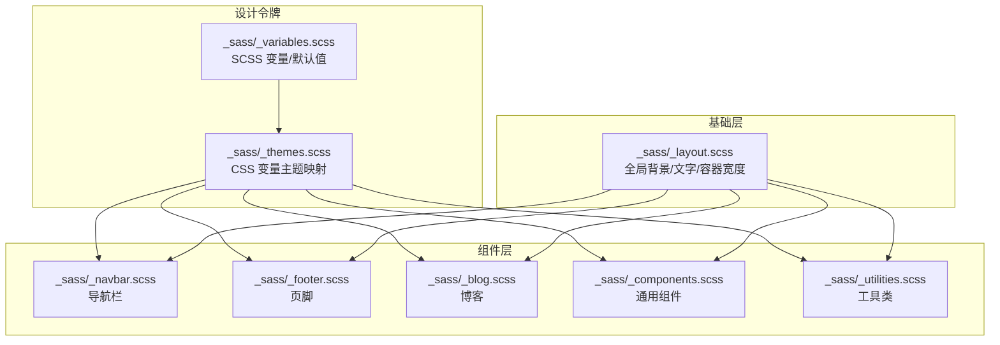
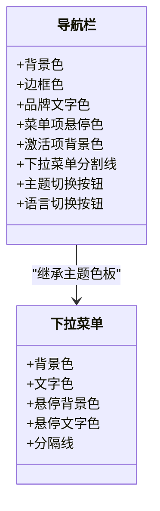
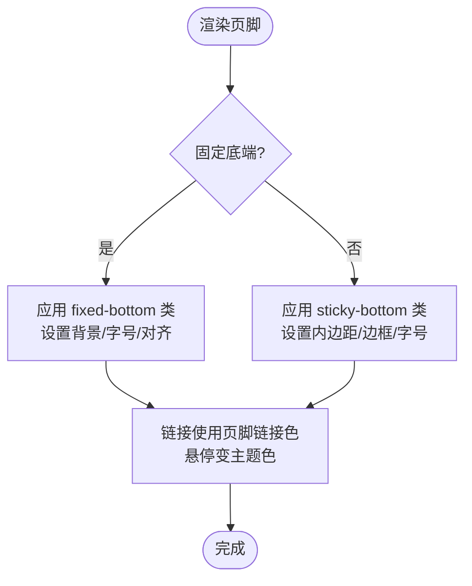
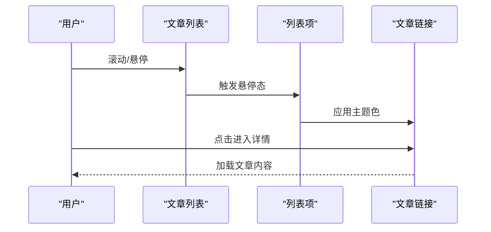
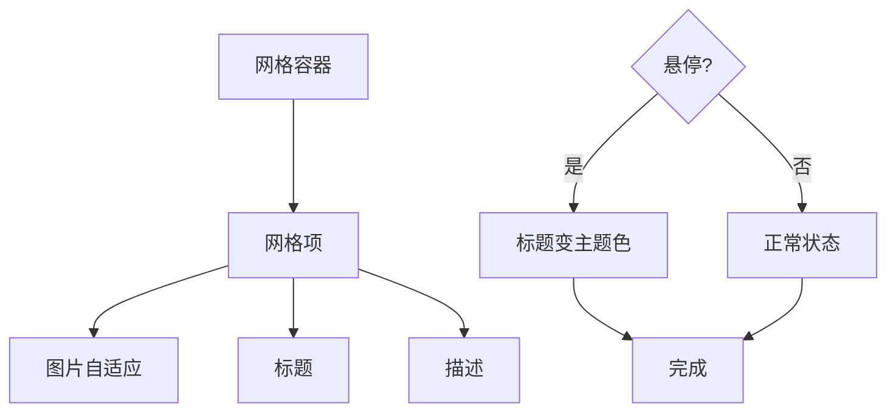
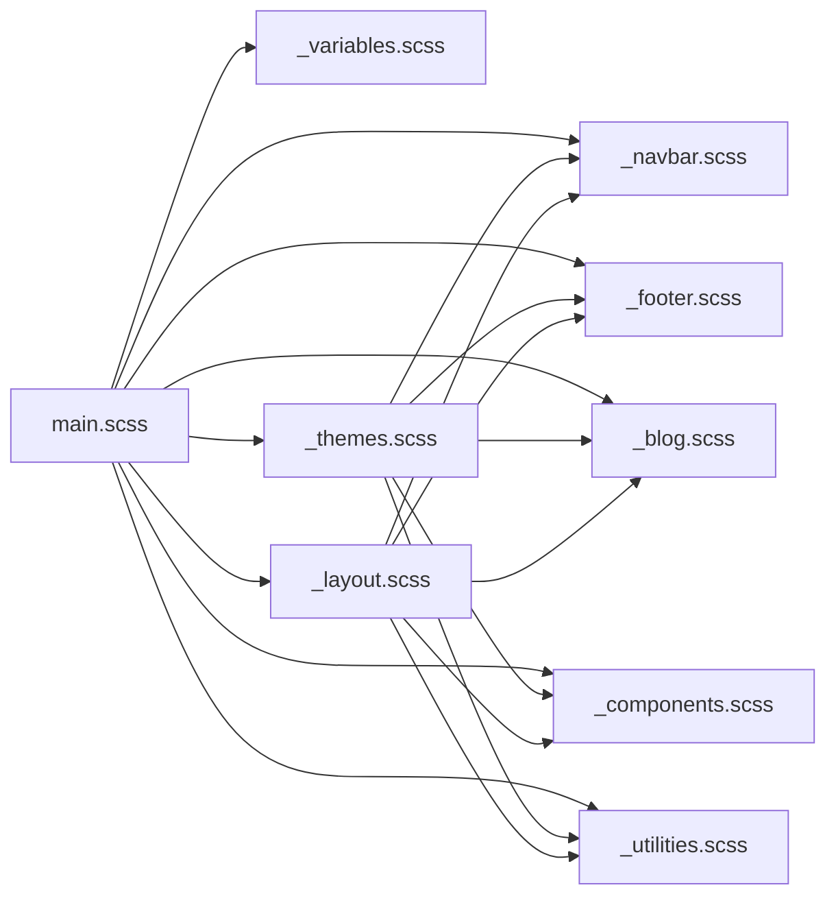

# 组件样式系统

<cite>
**本文引用的文件**
- [assets/css/main.scss](file://assets/css/main.scss)
- [_sass/_themes.scss](file://_sass/_themes.scss)
- [_sass/_variables.scss](file://_sass/_variables.scss)
- [_sass/_layout.scss](file://_sass/_layout.scss)
- [_sass/_navbar.scss](file://_sass/_navbar.scss)
- [_sass/_footer.scss](file://_sass/_footer.scss)
- [_sass/_blog.scss](file://_sass/_blog.scss)
- [_sass/_components.scss](file://_sass/_components.scss)
- [_sass/_utilities.scss](file://_sass/_utilities.scss)
- [_layouts/default.liquid](file://_layouts/default.liquid)
- [_includes/header.liquid](file://_includes/header.liquid)
- [_includes/footer.liquid](file://_includes/footer.liquid)
- [_config.yml](file://_config.yml)
</cite>

## 目录
1. [简介](#简介)
2. [项目结构](#项目结构)
3. [核心组件](#核心组件)
4. [架构总览](#架构总览)
5. [详细组件分析](#详细组件分析)
6. [依赖分析](#依赖分析)
7. [性能考虑](#性能考虑)
8. [故障排查指南](#故障排查指南)
9. [结论](#结论)
10. [附录](#附录)

## 简介
本文件系统化梳理该 Jekyll 主题的组件样式体系，聚焦导航栏、页脚、博客文章与项目卡片等核心组件的样式结构、设计原则与可定制性。文档从变量与主题系统出发，解释颜色、尺寸、间距等设计令牌如何通过 CSS 变量与 SCSS 变量协同工作；随后阐述组件间样式关系与继承规则，给出覆盖与扩展策略（含 CSS 优先级与选择器优化），并总结可访问性样式实现要点与性能优化建议。

## 项目结构
样式系统采用“主入口编排 + 分模块组织”的结构：主入口负责加载变量、主题与各功能模块；各模块按职责拆分（导航、页脚、博客、组件、工具类等），并在布局层通过 Liquid 模板注入 DOM 结构，最终由 SCSS 编译为 CSS。

图示来源
- [assets/css/main.scss:1-40](file://assets/css/main.scss#L1-L40)
- [_sass/_themes.scss:1-209](file://_sass/_themes.scss#L1-L209)
- [_sass/_layout.scss:1-59](file://_sass/_layout.scss#L1-L59)
- [_sass/_navbar.scss:1-209](file://_sass/_navbar.scss#L1-L209)
- [_sass/_footer.scss:1-36](file://_sass/_footer.scss#L1-L36)
- [_sass/_blog.scss:1-168](file://_sass/_blog.scss#L1-L168)
- [_sass/_components.scss:1-262](file://_sass/_components.scss#L1-L262)
- [_sass/_utilities.scss:1-606](file://_sass/_utilities.scss#L1-L606)
- [_layouts/default.liquid:1-57](file://_layouts/default.liquid#L1-L57)
- [_includes/header.liquid:1-108](file://_includes/header.liquid#L1-L108)
- [_includes/footer.liquid:1-31](file://_includes/footer.liquid#L1-L31)

章节来源
- [assets/css/main.scss:1-40](file://assets/css/main.scss#L1-L40)
- [_sass/_themes.scss:1-209](file://_sass/_themes.scss#L1-L209)
- [_sass/_layout.scss:1-59](file://_sass/_layout.scss#L1-L59)
- [_layouts/default.liquid:1-57](file://_layouts/default.liquid#L1-L57)
- [_includes/header.liquid:1-108](file://_includes/header.liquid#L1-L108)
- [_includes/footer.liquid:1-31](file://_includes/footer.liquid#L1-L31)

## 核心组件
- 导航栏：主导航、下拉菜单、品牌区、语言切换、主题切换、搜索入口等。
- 页脚：固定底端与粘性底端两种模式，包含版权、链接与可选订阅表单。
- 博客：标题栏、标签分类列表、文章列表、分页、特色文章卡片等。
- 项目卡片：网格布局、悬停态、标题与描述、图片适配等。
- 通用组件：卡片、头像、社交图标、仓库卡片、任务清单等。
- 工具类：代码高亮、进度条、ToC、弹出层、复制按钮、Swiper、日历等。

章节来源
- [_sass/_navbar.scss:1-209](file://_sass/_navbar.scss#L1-L209)
- [_sass/_footer.scss:1-36](file://_sass/_footer.scss#L1-L36)
- [_sass/_blog.scss:1-168](file://_sass/_blog.scss#L1-L168)
- [_sass/_components.scss:1-262](file://_sass/_components.scss#L1-L262)
- [_sass/_utilities.scss:1-606](file://_sass/_utilities.scss#L1-L606)

## 架构总览
样式系统以“变量 → 主题 → 布局 → 组件 → 工具类”的层次化方式组织，主入口统一引入，主题系统通过 CSS 自定义属性在根元素上切换明暗色板，组件样式通过语义化类名与层级选择器实现组合与复用。

图示来源
- [_sass/_variables.scss:1-53](file://_sass/_variables.scss#L1-L53)
- [_sass/_themes.scss:1-209](file://_sass/_themes.scss#L1-L209)
- [_sass/_layout.scss:1-59](file://_sass/_layout.scss#L1-L59)
- [_sass/_navbar.scss:1-209](file://_sass/_navbar.scss#L1-L209)
- [_sass/_footer.scss:1-36](file://_sass/_footer.scss#L1-L36)
- [_sass/_blog.scss:1-168](file://_sass/_blog.scss#L1-L168)
- [_sass/_components.scss:1-262](file://_sass/_components.scss#L1-L262)
- [_sass/_utilities.scss:1-606](file://_sass/_utilities.scss#L1-L606)

## 详细组件分析

### 导航栏样式系统
- 设计原则
  - 使用主题色作为强调色，悬停态与激活态保持一致的视觉反馈。
  - 下拉菜单与按钮组遵循统一边框与分割线风格。
  - 品牌区与社交图标在不同断点下自适应尺寸与间距。
- 关键特性
  - 菜单项悬停时改变文本色，激活项使用主题色背景与反色文字。
  - 下拉菜单支持分隔线与 hover 背景色，确保对比度。
  - 主题切换按钮与语言切换按钮采用统一尺寸与对齐方式。
- 可定制性
  - 通过主题变量调整品牌色、悬停色、分割线色等。
  - 通过 SCSS 变量控制图标尺寸、圆角、阴影等。
- 可访问性
  - 使用语义化 nav 与按钮，提供 sr-only 提示当前页面。
  - 悬停与焦点状态清晰可见，避免仅依赖颜色区分。

图示来源
- [_sass/_navbar.scss:1-209](file://_sass/_navbar.scss#L1-L209)
- [_sass/_themes.scss:1-209](file://_sass/_themes.scss#L1-L209)

章节来源
- [_sass/_navbar.scss:1-209](file://_sass/_navbar.scss#L1-L209)
- [_sass/_themes.scss:1-209](file://_sass/_themes.scss#L1-L209)
- [_includes/header.liquid:1-108](file://_includes/header.liquid#L1-L108)

### 页脚样式系统
- 设计原则
  - 固定底端与粘性底端两种模式，分别用于不同布局需求。
  - 文字、链接与背景色遵循主题色板，保证一致性。
- 关键特性
  - 固定底端模式下容器内联居中，链接悬停变主题色。
  - 粘性底端模式提供上下内边距与统一字号。
- 可定制性
  - 通过主题变量调整背景、文字、链接色。
  - 通过配置开关控制是否启用固定底端。
- 可访问性
  - 使用 role="contentinfo" 标识内容区。
  - 链接具备明确的悬停与焦点状态。

图示来源
- [_sass/_footer.scss:1-36](file://_sass/_footer.scss#L1-L36)
- [_includes/footer.liquid:1-31](file://_includes/footer.liquid#L1-L31)
- [_config.yml:55-56](file://_config.yml#L55-L56)

章节来源
- [_sass/_footer.scss:1-36](file://_sass/_footer.scss#L1-L36)
- [_includes/footer.liquid:1-31](file://_includes/footer.liquid#L1-L31)
- [_config.yml:55-56](file://_config.yml#L55-L56)

### 博客样式系统
- 设计原则
  - 标题栏强调主题色，列表项以分割线分隔，提升可读性。
  - 分页与标签分类列表居中对齐，突出分类入口。
- 关键特性
  - 文章列表项包含元数据与标签，悬停改变主题色。
  - 分页项激活态使用主题色背景与反色文字。
  - 特色文章卡片使用省略号处理长文本。
- 可定制性
  - 通过主题变量调整标题色、分割线色、标签色等。
  - 通过 SCSS 控制字号、内边距、行高。
- 可访问性
  - 列表项与链接具备清晰的焦点轮廓。
  - 标签与分类列表使用语义化结构。

图示来源
- [_sass/_blog.scss:1-168](file://_sass/_blog.scss#L1-L168)

章节来源
- [_sass/_blog.scss:1-168](file://_sass/_blog.scss#L1-L168)

### 项目卡片样式系统
- 设计原则
  - 卡片背景与分割线遵循主题色板，确保在明/暗主题下均清晰。
  - 图片自适应容器宽度，标题与描述使用统一字号与间距。
- 关键特性
  - 悬停时标题变主题色，增强交互反馈。
  - 网格布局通过列与间隔控制响应式排列。
  - 分类标题使用主题色与分割线，突出分组。
- 可定制性
  - 通过主题变量控制卡片背景、分割线色、标题色。
  - 通过 SCSS 调整网格项尺寸、间距、悬停动画。
- 可访问性
  - 链接具备明确的悬停与焦点状态。
  - 图片具备替代文本（在模板中提供）。

图示来源
- [_sass/_components.scss:125-162](file://_sass/_components.scss#L125-L162)

章节来源
- [_sass/_components.scss:125-162](file://_sass/_components.scss#L125-L162)

### 通用组件与工具类
- 通用组件
  - 卡片：背景、内边距、标题与正文颜色遵循主题变量。
  - 头像与资料：浮动方向控制左右外边距，响应式地址块。
  - 社交图标：多尺寸 SVG 与图片图标，悬停变主题色。
- 工具类
  - 代码高亮：预格式化块与行内代码统一背景与圆角。
  - 进度条：滚动进度指示器，跨浏览器兼容。
  - ToC：侧边导航，激活态与悬停态颜色一致。
  - 弹出层：Popover 背景与边框色遵循主题变量。
  - 复制按钮：悬停显示，透明度过渡。
  - Swiper：导航与分页颜色绑定主题变量。
  - 日历：响应式高度，移动端适配。

章节来源
- [_sass/_components.scss:1-262](file://_sass/_components.scss#L1-L262)
- [_sass/_utilities.scss:1-606](file://_sass/_utilities.scss#L1-L606)

## 依赖分析
- 主入口依赖
  - 主入口按顺序引入变量、主题、布局与各功能模块，确保变量与主题先于组件生效。
- 主题依赖
  - 主题系统通过 CSS 变量在根元素上切换明/暗色板，组件样式直接消费这些变量。
- 布局依赖
  - 全局布局定义容器最大宽度与滚动锚点偏移，影响导航与页脚定位。
- 组件依赖
  - 导航栏与页脚依赖主题变量；博客与项目卡片依赖通用组件与工具类；工具类独立性强，可按需引入。

图示来源
- [assets/css/main.scss:1-40](file://assets/css/main.scss#L1-L40)
- [_sass/_themes.scss:1-209](file://_sass/_themes.scss#L1-L209)
- [_sass/_layout.scss:1-59](file://_sass/_layout.scss#L1-L59)
- [_sass/_navbar.scss:1-209](file://_sass/_navbar.scss#L1-L209)
- [_sass/_footer.scss:1-36](file://_sass/_footer.scss#L1-L36)
- [_sass/_blog.scss:1-168](file://_sass/_blog.scss#L1-L168)
- [_sass/_components.scss:1-262](file://_sass/_components.scss#L1-L262)
- [_sass/_utilities.scss:1-606](file://_sass/_utilities.scss#L1-L606)

章节来源
- [assets/css/main.scss:1-40](file://assets/css/main.scss#L1-L40)
- [_sass/_themes.scss:1-209](file://_sass/_themes.scss#L1-L209)
- [_sass/_layout.scss:1-59](file://_sass/_layout.scss#L1-L59)

## 性能考虑
- 变量与主题
  - 使用 CSS 变量集中管理颜色与尺寸，减少重复定义与重绘开销。
  - 在根元素上切换 data-theme 属性，避免全站重绘。
- 响应式与媒体查询
  - 合理使用断点，避免过多嵌套与深层选择器导致的匹配成本上升。
- 选择器优化
  - 优先使用类选择器，避免过度使用后代选择器与通配符。
  - 将高频交互元素（如导航、按钮）置于浅层结构，降低选择器层级。
- 资源体积
  - 压缩样式输出，按需引入字体与图标库，减少首屏阻塞。
- 动画与过渡
  - 对频繁触发的过渡（如滚动进度条）使用 transform 与 opacity，避免触发布局与重绘。

## 故障排查指南
- 主题切换无效
  - 检查根元素是否存在 data-theme 属性，确认主题变量已正确映射。
  - 章节来源
    - [_sass/_themes.scss:77-122](file://_sass/_themes.scss#L77-L122)
- 导航栏样式异常
  - 确认下拉菜单与按钮组的背景/边框/分割线变量是否被覆盖。
  - 章节来源
    - [_sass/_navbar.scss:14-49](file://_sass/_navbar.scss#L14-L49)
- 页脚位置错位
  - 检查布局类名（fixed-top-nav / sticky-bottom-footer）是否正确注入。
  - 章节来源
    - [_layouts/default.liquid:19-30](file://_layouts/default.liquid#L19-L30)
- 博客列表交互无响应
  - 确认列表项与链接的悬停选择器未被更具体的选择器覆盖。
  - 章节来源
    - [_sass/_blog.scss:42-79](file://_sass/_blog.scss#L42-L79)
- 项目卡片布局错乱
  - 检查网格项尺寸与间距变量，确认容器宽度与断点设置合理。
  - 章节来源
    - [_sass/_components.scss:144-162](file://_sass/_components.scss#L144-L162)

## 结论
该样式系统通过“变量 → 主题 → 布局 → 组件 → 工具类”的分层设计，实现了高内聚、低耦合的组件样式体系。主题系统以 CSS 变量为核心，使明/暗主题切换与颜色定制变得简单可控；组件样式以语义化类名与层级选择器组合，既保证了可维护性，也便于覆盖与扩展。结合可访问性与性能优化建议，可在不牺牲体验的前提下持续演进。

## 附录

### 可定制性速查
- 颜色
  - 主题色、悬停色、分割线色、卡片背景、页脚背景/文字/链接色等均由主题变量统一管理。
  - 章节来源
    - [_sass/_themes.scss:7-75](file://_sass/_themes.scss#L7-L75)
    - [_sass/_variables.scss:8-34](file://_sass/_variables.scss#L8-L34)
- 尺寸
  - 容器最大宽度、返回顶部按钮尺寸、代码块圆角、内边距等通过 SCSS 变量配置。
  - 章节来源
    - [_sass/_variables.scss:43-52](file://_sass/_variables.scss#L43-L52)
    - [assets/css/main.scss:12-14](file://assets/css/main.scss#L12-L14)
- 间距
  - 卡片内边距、列表项分割线、网格项间距、页脚内边距等在对应模块中定义。
  - 章节来源
    - [_sass/_components.scss:51-54](file://_sass/_components.scss#L51-L54)
    - [_sass/_blog.scss:43-79](file://_sass/_blog.scss#L43-L79)
    - [_sass/_footer.scss:26-35](file://_sass/_footer.scss#L26-L35)

### 覆盖与扩展方法
- 优先级策略
  - 通过增加选择器特异性或使用 !important（谨慎使用）覆盖默认样式。
  - 在主入口后追加自定义样式文件，确保其在编译后位于末尾。
- 选择器优化
  - 避免使用内联样式与通配符；优先使用类选择器与语义化结构。
  - 对高频交互元素使用浅层选择器，减少匹配层级。
- 主题扩展
  - 新增 CSS 变量并在主题映射中添加对应分支，确保明/暗主题均生效。
  - 章节来源
    - [_sass/_themes.scss:77-155](file://_sass/_themes.scss#L77-L155)

### 可访问性样式实现
- 键盘导航
  - 确保所有可交互元素（按钮、链接、菜单项）具备可见焦点轮廓。
  - 导航栏使用 role="navigation"，页脚使用 role="contentinfo"。
- 屏幕阅读器支持
  - 使用 sr-only 标注当前页面状态，避免纯图标无文本。
  - 列表与表格使用语义化结构，确保读屏器可正确解析。
- 对比度与可读性
  - 通过主题变量统一文字与背景对比度，满足 WCAG 基本要求。
  - 章节来源
    - [_includes/header.liquid:40-56](file://_includes/header.liquid#L40-L56)
    - [_sass/_navbar.scss:51-116](file://_sass/_navbar.scss#L51-L116)