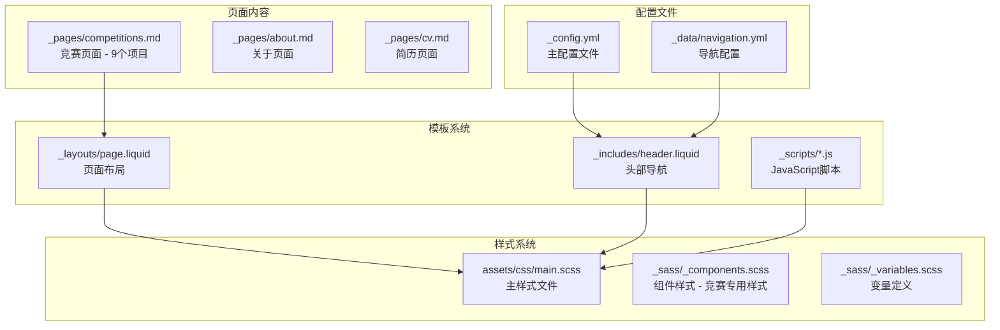
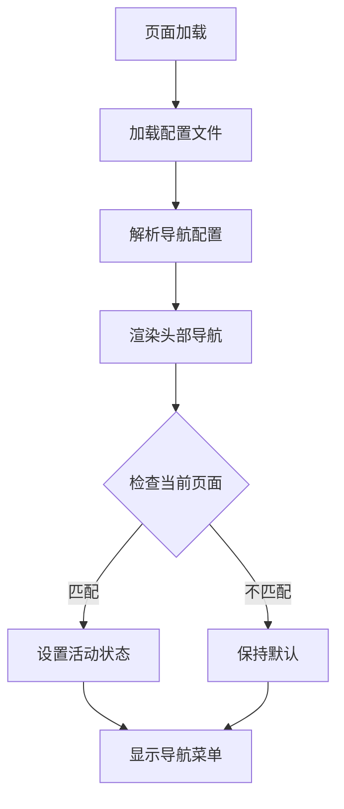
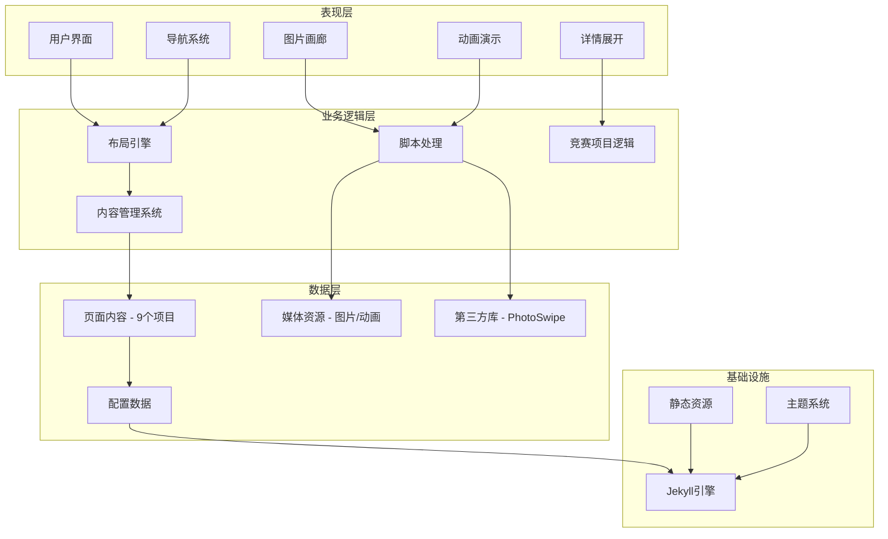
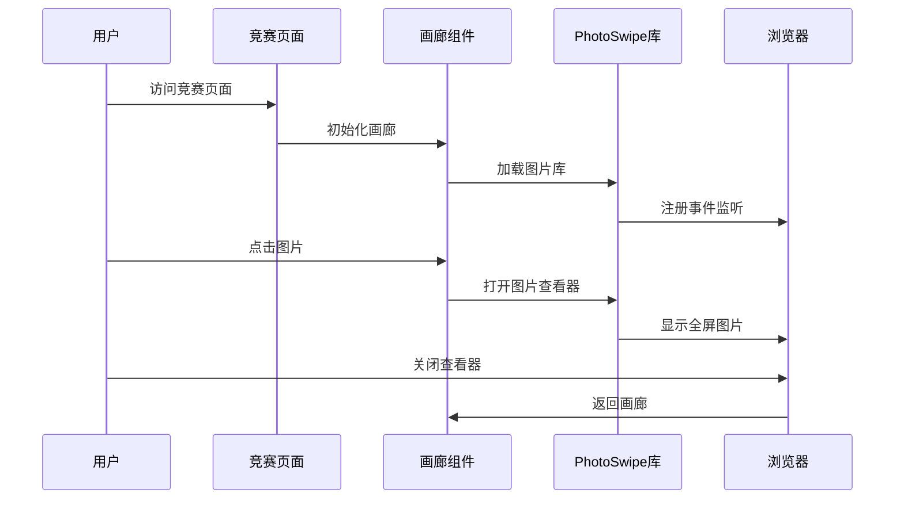
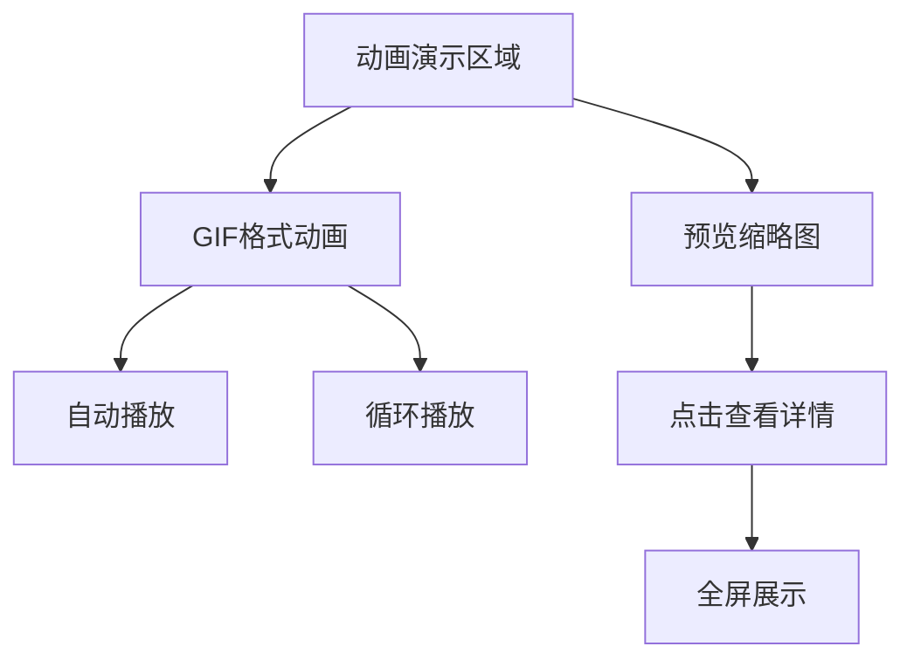
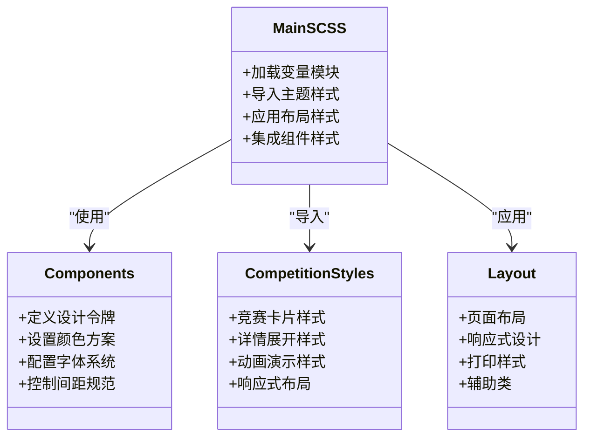

# 竞赛建议

<cite>
**本文档引用的文件**
- [competitions.md](file://_pages/competitions.md)
- [_config.yml](file://_config.yml)
- [navigation.yml](file://_data/navigation.yml)
- [header.liquid](file://_includes/header.liquid)
- [photoswipe-setup.js](file://_scripts/photoswipe-setup.js)
- [page.liquid](file://_layouts/page.liquid)
- [main.scss](file://assets/css/main.scss)
- [_components.scss](file://_sass/_components.scss)
- [README.md](file://README.md)
</cite>

## 更新摘要
**变更内容**
- 新增9个竞赛项目的完整展示内容
- 添加动画演示功能支持（GIF格式）
- 改进图片分类和组织结构
- 优化HTML结构和语义化标记
- 增强图片压缩和展示优化
- 完善多语言支持和响应式设计

## 目录
1. [简介](#简介)
2. [项目结构](#项目结构)
3. [核心组件](#核心组件)
4. [架构概览](#架构概览)
5. [详细组件分析](#详细组件分析)
6. [依赖关系分析](#依赖关系分析)
7. [性能考虑](#性能考虑)
8. [故障排除指南](#故障排除指南)
9. [结论](#结论)

## 简介

本项目是一个基于 Jekyll 的学术主题网站，专门为竞赛获奖展示而设计。该网站采用响应式设计，支持中英文双语界面，具备现代化的图片展示功能和丰富的交互特性。

网站的核心特色包括：
- 基于 al-folio 主题的专业学术网站框架
- 支持9个完整竞赛项目的展示系统
- 响应式图片画廊系统，支持动画演示
- 多语言支持（中英文）
- 现代化的用户界面设计
- 图片压缩优化和快速加载

## 项目结构

该项目采用标准的 Jekyll 项目结构，专门为竞赛内容展示进行了优化：



**图表来源**
- [_config.yml:1-656](file://_config.yml#L1-L656)
- [navigation.yml:1-24](file://_data/navigation.yml#L1-L24)
- [competitions.md:1-944](file://_pages/competitions.md#L1-L944)

**章节来源**
- [_config.yml:1-656](file://_config.yml#L1-L656)
- [navigation.yml:1-24](file://_data/navigation.yml#L1-L24)

## 核心组件

### 竞赛页面系统

竞赛页面是整个网站的核心组件，专门用于展示9个完整的竞赛项目：

| 组件 | 功能描述 | 实现方式 |
|------|----------|----------|
| **页面布局** | 提供竞赛内容的容器和基础样式 | 使用 `page.liquid` 布局模板 |
| **图片画廊** | 展示竞赛相关图片和获奖证书 | 集成 PhotoSwipe 图片浏览系统 |
| **动画演示** | 支持GIF格式的动画展示 | 通过专门的动画区域实现 |
| **多语言支持** | 同时提供中英文版本内容 | 通过页面 Front Matter 配置 |
| **响应式设计** | 适配不同设备屏幕尺寸 | 使用 Bootstrap 网格系统 |
| **项目分类** | 按竞赛类型和阶段分类展示 | 使用语义化HTML结构 |

### 导航系统

网站采用动态导航系统，从数据文件中读取导航配置：



**图表来源**
- [header.liquid:47-59](file://_includes/header.liquid#L47-L59)
- [navigation.yml:1-24](file://_data/navigation.yml#L1-L24)

**章节来源**
- [competitions.md:1-944](file://_pages/competitions.md#L1-L944)
- [header.liquid:1-101](file://_includes/header.liquid#L1-L101)

## 架构概览

网站采用分层架构设计，确保了良好的可维护性和扩展性：



**图表来源**
- [_config.yml:196-218](file://_config.yml#L196-L218)
- [page.liquid:1-32](file://_layouts/page.liquid#L1-L32)

## 详细组件分析

### 竞赛页面实现

竞赛页面采用了模块化的设计思路，每个竞赛项目都有独立的展示区域：

#### 图片画廊系统



**图表来源**
- [photoswipe-setup.js:1-12](file://_scripts/photoswipe-setup.js#L1-L12)
- [competitions.md:31-83](file://_pages/competitions.md#L31-L83)

#### 多语言内容管理

网站支持中英文双语内容，通过 Front Matter 和数据文件实现：

| 内容类型 | 中文版本 | 英文版本 | 切换机制 |
|----------|----------|----------|----------|
| 页面标题 | 竞赛获奖与照片集锦 | Awards & Competition Photos | URL 路径切换 |
| 页面描述 | 参加的竞赛和获奖经历 | Competitions and awards | Front Matter 配置 |
| 导航标签 | 竞赛 | Competitions | 数据文件映射 |

#### 动画演示系统

新增的动画演示功能支持GIF格式的动态展示：



**图表来源**
- [competitions.md:92-111](file://_pages/competitions.md#L92-L111)

**章节来源**
- [competitions.md:1-944](file://_pages/competitions.md#L1-L944)
- [navigation.yml:1-24](file://_data/navigation.yml#L1-L24)

### 样式系统架构

网站的样式系统采用模块化设计，便于维护和定制：



**图表来源**
- [main.scss:1-40](file://assets/css/main.scss#L1-L40)
- [_components.scss:265-332](file://_sass/_components.scss#L265-L332)

**章节来源**
- [main.scss:1-40](file://assets/css/main.scss#L1-L40)
- [_components.scss:265-332](file://_sass/_components.scss#L265-L332)

## 依赖关系分析

### 外部库依赖

网站集成了多个现代化的前端库来增强用户体验：

| 库名称 | 版本 | 功能用途 | 集成方式 |
|--------|------|----------|----------|
| PhotoSwipe | 5.4.4 | 图片画廊和缩放功能 | CDN 引入 |
| Bootstrap | 4.4.1 | 响应式网格系统 | CDN 引入 |
| jQuery | 3.6.0 | DOM操作和动画 | CDN 引入 |
| Font Awesome | 5.15.4 | 图标系统 | CDN 引入 |

### 内部组件依赖

```mermaid
graph LR
subgraph "核心组件"
Header[header.liquid]
PageLayout[page.liquid]
Competitions[competitions.md - 9个项目]
End
subgraph "支持组件"
PhotoSwipeSetup[photoswipe-setup.js]
Navigation[navigation.yml]
Config[_config.yml]
End
subgraph "样式系统"
MainSCSS[main.scss]
Components[_sass/_components.scss - 竞赛样式]
Variables[_sass/_variables.scss]
End
Header --> Navigation
Header --> Config
PageLayout --> MainSCSS
Competitions --> PhotoSwipeSetup
PhotoSwipeSetup --> Config
MainSCSS --> Components
MainSCSS --> Variables
```

**图表来源**
- [header.liquid:1-101](file://_includes/header.liquid#L1-L101)
- [page.liquid:1-32](file://_layouts/page.liquid#L1-L32)
- [competitions.md:1-944](file://_pages/competitions.md#L1-L944)

**章节来源**
- [_config.yml:405-634](file://_config.yml#L405-L634)
- [README.md:313-320](file://README.md#L313-L320)

## 性能考虑

### 图片优化策略

网站采用了多种图片优化技术来提升加载性能：

1. **懒加载机制**：所有图片都设置了 `loading="lazy"` 属性
2. **响应式图片**：支持多种分辨率的图片格式
3. **WebP 格式**：优先使用现代高效的图片格式
4. **图片压缩**：自动压缩图片以减少文件大小
5. **动画优化**：GIF动画经过压缩处理

### JavaScript 优化

- **按需加载**：只在需要时加载特定功能的脚本
- **模块化设计**：支持 Tree Shaking 减少打包体积
- **缓存策略**：合理利用浏览器缓存机制

## 故障排除指南

### 常见问题及解决方案

| 问题类型 | 症状描述 | 解决方案 |
|----------|----------|----------|
| 图片无法显示 | 空白占位符或错误链接 | 检查图片路径和文件存在性 |
| 导航不工作 | 点击导航无反应 | 验证 navigation.yml 配置正确性 |
| 样式异常 | 页面布局错乱 | 检查 main.scss 编译是否成功 |
| 多语言切换失效 | 语言切换按钮无响应 | 确认 Front Matter 配置正确 |
| 动画不播放 | GIF动画无法显示 | 检查动画文件格式和路径 |

### 开发调试建议

1. **本地预览**：使用 `bundle exec jekyll serve` 进行本地测试
2. **浏览器开发者工具**：检查网络请求和控制台错误
3. **图片验证**：使用在线工具检查图片质量
4. **响应式测试**：在不同设备上测试显示效果
5. **动画测试**：验证GIF动画的播放和显示效果

**章节来源**
- [README.md:507-510](file://README.md#L507-L510)

## 结论

本竞赛建议项目展现了现代静态网站开发的最佳实践，通过精心设计的架构和丰富的功能特性，为竞赛获奖展示提供了专业的解决方案。项目的主要优势包括：

- **专业性**：基于成熟的 al-folio 主题，适合学术和专业展示
- **完整性**：支持9个完整竞赛项目的展示，涵盖多种竞赛类型
- **易用性**：简洁的配置和直观的编辑体验
- **可扩展性**：模块化设计便于功能扩展和定制
- **性能优化**：多项优化措施确保良好的用户体验
- **多媒体支持**：支持图片和动画的丰富展示
- **响应式设计**：适配各种设备和屏幕尺寸

该系统为竞赛获奖展示提供了一个完整的解决方案，既满足了功能需求，又保证了良好的用户体验和技术质量。新增的9个竞赛项目和动画演示功能进一步增强了网站的专业性和视觉吸引力。