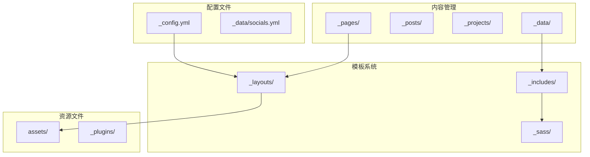
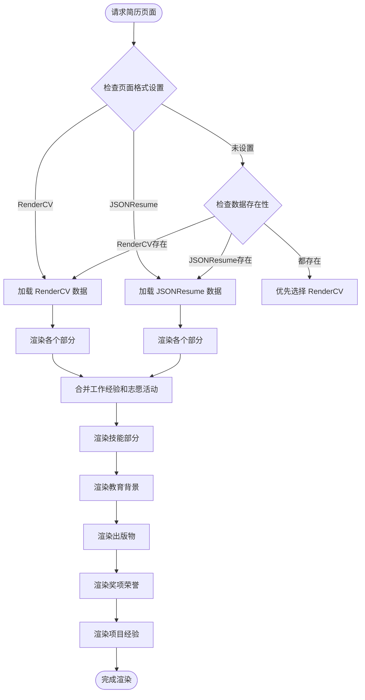
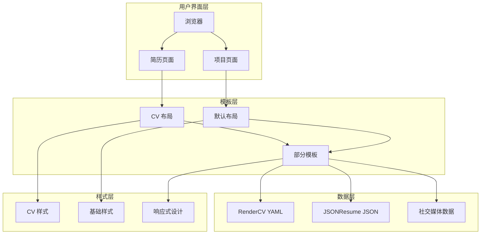
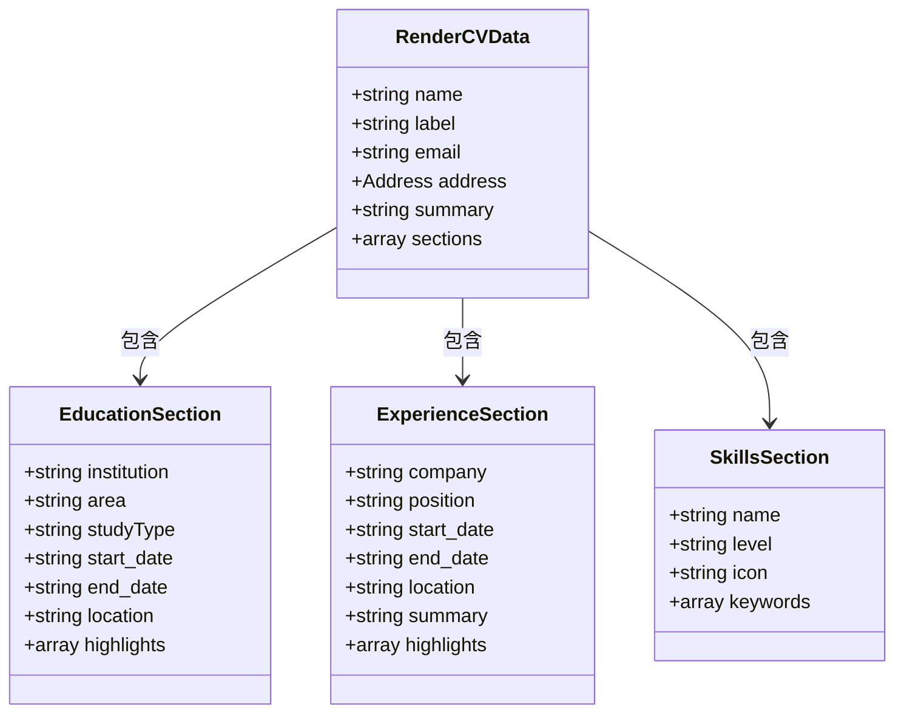
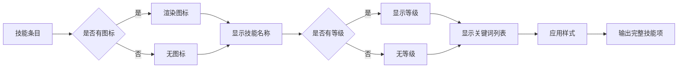
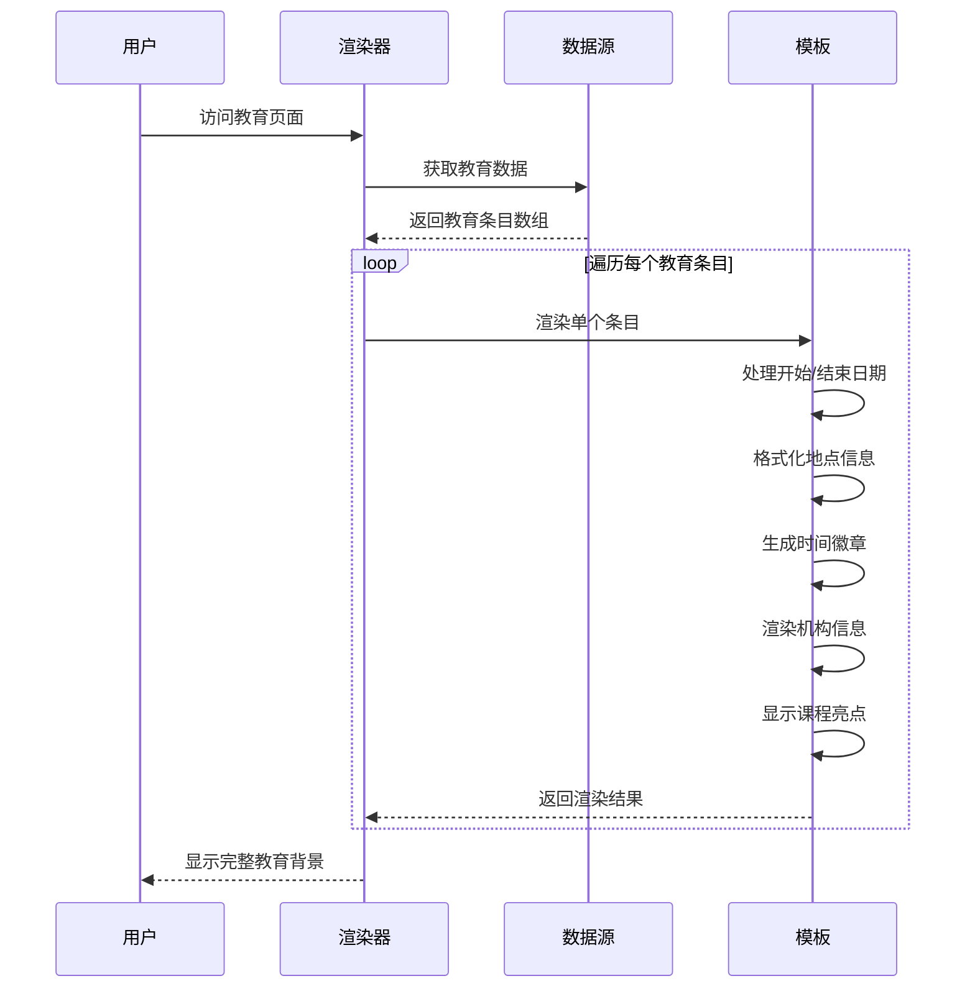
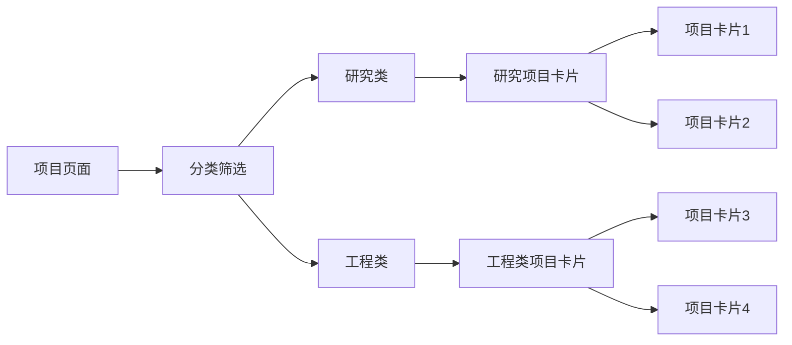
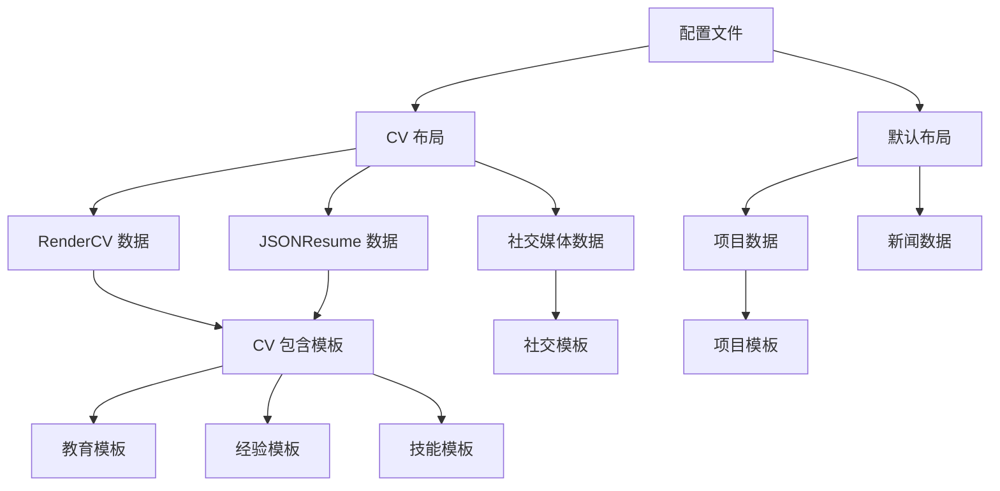

# 简历和技能展示

<cite>
**本文档引用的文件**
- [_config.yml](_config.yml)
- [README.md](README.md)
- [_pages/cv.md](_pages/cv.md)
- [_layouts/cv.liquid](_layouts/cv.liquid)
- [_data/cv.yml](_data/cv.yml)
- [_data/socials.yml](_data/socials.yml)
- [_includes/cv/skills.liquid](_includes/cv/skills.liquid)
- [_includes/cv/education.liquid](_includes/cv/education.liquid)
- [_includes/cv/experience.liquid](_includes/cv/experience.liquid)
- [assets/json/resume.json](_data/resume.json)
- [_sass/_cv.scss](_sass/_cv.scss)
- [_layouts/default.liquid](_layouts/default.liquid)
- [_pages/projects.md](_pages/projects.md)
- [_projects/1_project.md](_projects/1_project.md)
- [_plugins/google-scholar-citations.rb](_plugins/google-scholar-citations.rb)
</cite>

## 目录
1. [简介](#简介)
2. [项目结构](#项目结构)
3. [核心组件](#核心组件)
4. [架构概览](#架构概览)
5. [详细组件分析](#详细组件分析)
6. [依赖关系分析](#依赖关系分析)
7. [性能考虑](#性能考虑)
8. [故障排除指南](#故障排除指南)
9. [结论](#结论)

## 简介

这是一个基于 Jekyll 的学术简历和技能展示网站，采用 al-folio 主题构建。该项目提供了现代化的简历展示、技能可视化、项目集合展示等功能，支持多种数据格式（RenderCV 和 JSONResume），并具备响应式设计和深色模式切换能力。

该网站主要面向机械工程和机器人学领域的本科生，展示其在机器人抓取、嵌入式视觉等领域的研究成果和技能专长。

## 项目结构

项目采用标准的 Jekyll 结构，包含以下关键目录：



**图表来源**
- [_config.yml](_config.yml)
- [_layouts/default.liquid](_layouts/default.liquid)

**章节来源**
- [_config.yml](_config.yml)
- [README.md](README.md)

## 核心组件

### 数据驱动的简历系统

简历系统采用双格式支持机制，同时兼容 RenderCV YAML 格式和 JSONResume 标准格式：



**图表来源**
- [_layouts/cv.liquid](_layouts/cv.liquid)
- [_data/cv.yml](_data/cv.yml)
- [assets/json/resume.json](assets/json/resume.json)

### 统一的数据格式处理

系统通过统一的 Liquid 模板处理不同的数据格式，确保一致的显示效果：

| 数据格式 | 文件位置 | 关键字段 | 处理方式 |
|---------|----------|----------|----------|
| RenderCV | `_data/cv.yml` | `cv.name`, `cv.sections` | 直接访问嵌套属性 |
| JSONResume | `assets/json/resume.json` | `basics`, `work`, `education` | 标准化字段映射 |
| 社交媒体 | `_data/socials.yml` | `email`, `github_username` | 统一链接生成 |

**章节来源**
- [_layouts/cv.liquid](_layouts/cv.liquid)
- [_data/cv.yml](_data/cv.yml)
- [assets/json/resume.json](assets/json/resume.json)

## 架构概览

整个简历展示系统采用分层架构设计：



**图表来源**
- [_layouts/cv.liquid](_layouts/cv.liquid)
- [_layouts/default.liquid](_layouts/default.liquid)
- [_sass/_cv.scss](_sass/_cv.scss)

## 详细组件分析

### 简历渲染引擎

简历渲染引擎是整个系统的核心组件，负责将结构化数据转换为美观的简历页面：

#### RenderCV 格式处理

RenderCV 格式使用 YAML 结构，系统通过 `cv.sections` 访问各个部分：



**图表来源**
- [_data/cv.yml](_data/cv.yml)
- [_includes/cv/education.liquid](_includes/cv/education.liquid)
- [_includes/cv/experience.liquid](_includes/cv/experience.liquid)
- [_includes/cv/skills.liquid](_includes/cv/skills.liquid)

#### JSONResume 格式处理

JSONResume 格式遵循标准化的 JSON 结构，系统提供字段映射以适配不同格式：

| RenderCV 字段 | JSONResume 对应字段 | 处理逻辑 |
|---------------|-------------------|----------|
| `cv.name` | `basics.name` | 直接映射 |
| `cv.sections.Experience` | `work` | 合并到 Experience |
| `cv.sections.Education` | `education` | 直接映射 |
| `cv.sections.Skills` | `skills` | 直接映射 |
| `entry.start_date` | `entry.startDate` | 兼容处理 |
| `entry.end_date` | `entry.endDate` | 兼容处理 |

**章节来源**
- [_layouts/cv.liquid](_layouts/cv.liquid)
- [assets/json/resume.json](assets/json/resume.json)

### 技能展示组件

技能展示组件提供了灵活的技能可视化功能：

#### 技能条目渲染



**图表来源**
- [_includes/cv/skills.liquid](_includes/cv/skills.liquid)
- [_sass/_cv.scss](_sass/_cv.scss)

#### 技能分类体系

系统支持多种技能分类，每种技能都有对应的图标和关键词：

| 技能类别 | 图标 | 关键词示例 | 等级要求 |
|----------|------|------------|----------|
| 机械工程 | `fa-gear` | 机械设计, CAD/CAM, 制造 | 高级 |
| 编程算法 | `fa-code` | Python, C/C++, 计算机视觉 | 高级 |
| 机器人学 | `fa-robot` | 机器人抓取, 嵌入式控制 | 高级 |

**章节来源**
- [_includes/cv/skills.liquid](_includes/cv/skills.liquid)
- [_data/cv.yml](_data/cv.yml)

### 教育背景展示

教育背景模块采用时间轴样式展示学习经历：

#### 时间轴渲染逻辑



**图表来源**
- [_includes/cv/education.liquid](_includes/cv/education.liquid)
- [_data/cv.yml](_data/cv.yml)

### 工作经验展示

工作经验模块提供详细的工作经历描述：

#### 经验条目处理

系统支持多种工作条目的字段映射，包括公司、职位、时间范围等信息：

| 字段类型 | RenderCV 字段 | JSONResume 字段 | 显示内容 |
|----------|---------------|-----------------|----------|
| 公司名称 | `company` | `name` | 机构名称 |
| 职位标题 | `position` | `position` | 职务头衔 |
| 工作时间 | `start_date/end_date` | `startDate/endDate` | 日期范围 |
| 工作地点 | `location` | `location` | 地点信息 |
| 工作描述 | `summary` | `summary` | 职责说明 |
| 工作成就 | `highlights` | `highlights` | 主要成果 |

**章节来源**
- [_includes/cv/experience.liquid](_includes/cv/experience.liquid)
- [_data/cv.yml](_data/cv.yml)
- [assets/json/resume.json](assets/json/resume.json)

### 项目展示系统

项目展示系统提供了分类化的项目集合展示：

#### 项目分类展示



**图表来源**
- [_pages/projects.md](_pages/projects.md)
- [_projects/1_project.md](_projects/1_project.md)

**章节来源**
- [_pages/projects.md](_pages/projects.md)
- [_projects/1_project.md](_projects/1_project.md)

## 依赖关系分析

### 外部依赖管理

项目使用第三方库管理系统，通过 CDN 提供各种功能库：

```mermaid
graph TB
subgraph "核心库"
jQuery[jQuery 3.6.0]
Bootstrap[Bootstrap 5.x]
Font Awesome[Font Awesome 6.x]
end
subgraph "专业库"
ChartJS[Chart.js 4.4.1]
Mermaid[Mermaid 10.7.0]
MathJax[MathJax 3.2.2]
HighlightJS[Highlight.js 11.9.0]
end
subgraph "交互库"
MediumZoom[Medium Zoom 1.1.0]
Masonry[Masonry 4.2.2]
PhotoSwipe[PhotoSwipe 5.4.4]
end
subgraph "数据分析"
D3[D3.js 7.8.5]
Plotly[Plotly.js 3.0.1]
Vega[Vega 5.27.0]
end
subgraph "工具库"
Moment[Moment.js]
Lodash[Lodash]
Axios[Axios]
end
```

**图表来源**
- [_config.yml](_config.yml)

### 数据依赖关系



**图表来源**
- [_config.yml](_config.yml)
- [_layouts/cv.liquid](_layouts/cv.liquid)
- [_layouts/default.liquid](_layouts/default.liquid)

**章节来源**
- [_config.yml](_config.yml)

## 性能考虑

### 加载优化策略

系统采用了多种性能优化措施：

1. **懒加载图片**: 支持图片懒加载，提升页面加载速度
2. **CSS 压缩**: 使用压缩模式减少文件大小
3. **CDN 优化**: 第三方库通过 CDN 提供，利用浏览器缓存
4. **响应式图片**: 自动生成多种尺寸的 WebP 格式图片

### 缓存策略

- **浏览器缓存**: 静态资源设置长期缓存
- **CDN 缓存**: 第三方库通过 CDN 缓存
- **Jekyll 缓存**: 使用 jekyll-cache-bust 插件管理缓存

## 故障排除指南

### 常见问题解决

#### 简历数据不显示

**症状**: 简历页面空白或只显示标题

**可能原因**:
1. 数据文件路径错误
2. YAML/JSON 格式不正确
3. Liquid 模板语法错误

**解决方案**:
1. 检查数据文件是否存在且路径正确
2. 验证 YAML/JSON 格式的语法
3. 确认 Liquid 模板中的变量引用正确

#### 样式显示异常

**症状**: 页面样式错乱或显示不正确

**可能原因**:
1. CSS 文件加载失败
2. 样式冲突
3. 响应式断点问题

**解决方案**:
1. 检查 CSS 文件路径和完整性
2. 查看浏览器开发者工具中的样式冲突
3. 验证响应式断点设置

#### 项目展示问题

**症状**: 项目页面无法正常显示项目卡片

**可能原因**:
1. 项目数据格式不正确
2. 分类标签缺失
3. 重要性排序问题

**解决方案**:
1. 检查项目 YAML 头信息格式
2. 确认分类标签与页面设置匹配
3. 验证 importance 数值设置

**章节来源**
- [_layouts/cv.liquid](_layouts/cv.liquid)
- [_sass/_cv.scss](_sass/_cv.scss)

## 结论

这个简历和技能展示系统展现了现代静态网站开发的最佳实践。通过采用 Jekyll + Liquid 模板引擎，系统实现了数据与表现的分离，提供了高度可定制的简历展示功能。

### 主要优势

1. **多格式支持**: 同时支持 RenderCV 和 JSONResume 两种标准格式
2. **响应式设计**: 完全适配移动设备和桌面设备
3. **性能优化**: 通过多种技术手段优化加载速度
4. **易于维护**: 结构清晰，便于更新和扩展
5. **主题化**: 基于 al-folio 主题，具有专业的外观

### 技术特色

- **数据驱动**: 所有内容都来自结构化数据文件
- **模板化**: 使用 Liquid 模板实现内容复用
- **样式模块化**: 通过 SCSS 实现样式的模块化管理
- **插件生态**: 支持丰富的 Jekyll 插件扩展功能

该系统为学术和个人技能展示提供了一个强大而灵活的解决方案，既满足了专业展示的需求，又保持了良好的用户体验和技术可维护性。