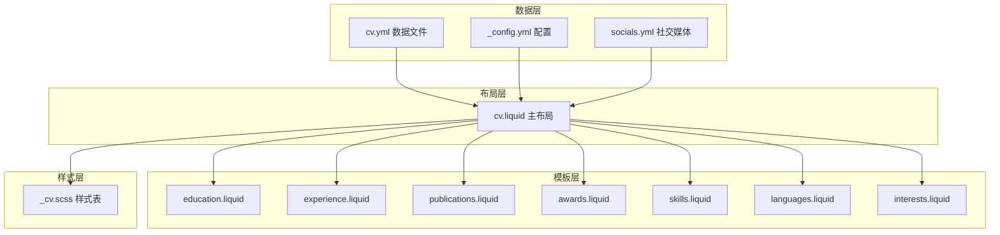
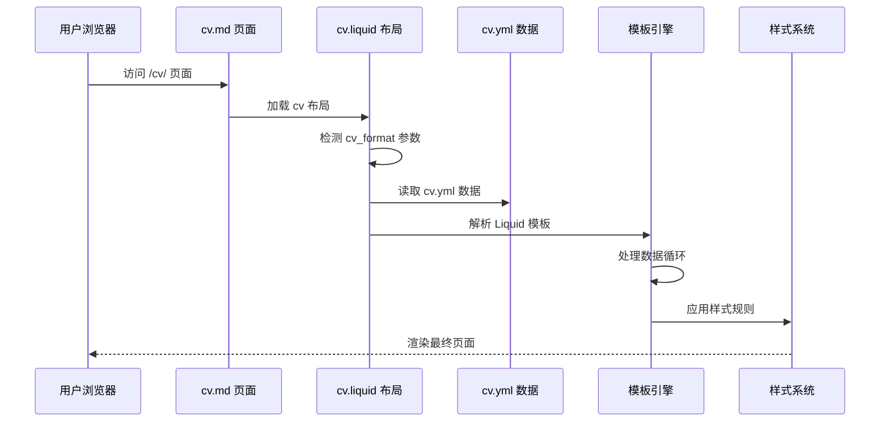
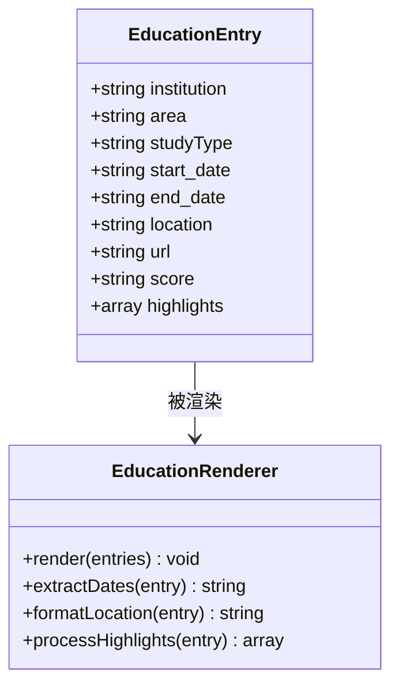
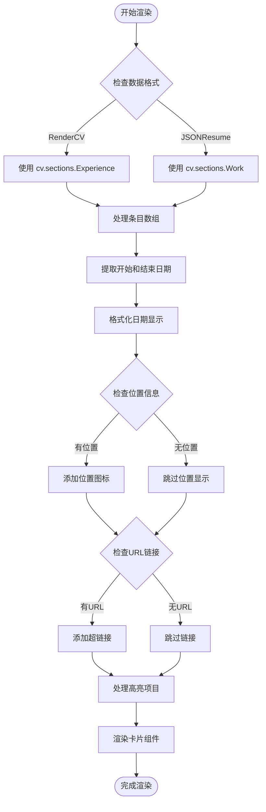
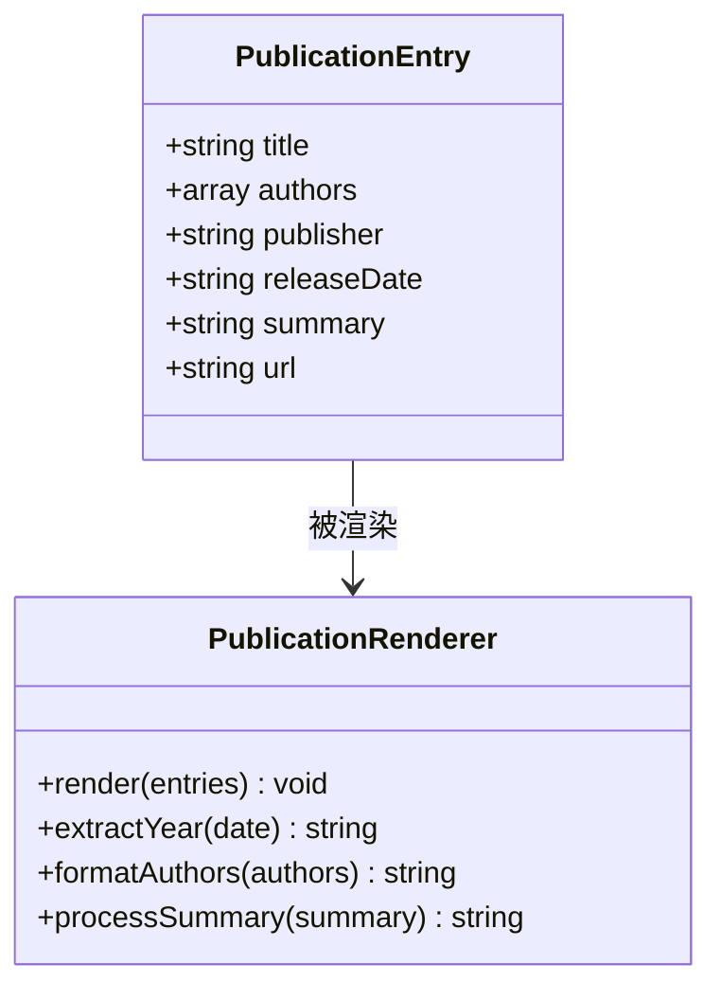
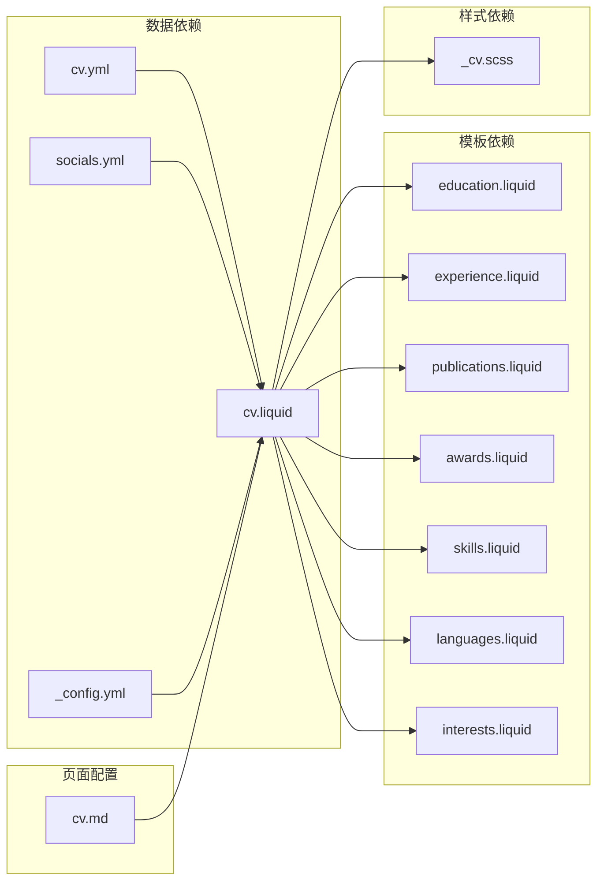

# CV数据结构设计

<cite>
**本文档引用的文件**
- [cv.yml](file://_data/cv.yml)
- [cv.liquid](file://_layouts/cv.liquid)
- [education.liquid](file://_includes/cv/education.liquid)
- [experience.liquid](file://_includes/cv/experience.liquid)
- [publications.liquid](file://_includes/cv/publications.liquid)
- [awards.liquid](file://_includes/cv/awards.liquid)
- [skills.liquid](file://_includes/cv/skills.liquid)
- [languages.liquid](file://_includes/cv/languages.liquid)
- [interests.liquid](file://_includes/cv/interests.liquid)
- [_cv.scss](file://_sass/_cv.scss)
- [cv.md](file://_pages/cv.md)
- [socials.yml](file://_data/socials.yml)
- [_config.yml](file://_config.yml)
</cite>

## 更新摘要
**所做更改**
- 更新了获奖情况模块的详细分析，反映从单一通用奖项条目到九个具体竞赛成就和两个学术荣誉条目的重大变更
- 新增了竞赛成就和学术荣誉的分类说明
- 更新了奖项条目的数据验证规则和字段约束
- 增强了专业可信度和学术区分度的说明

## 目录
1. [简介](#简介)
2. [项目结构](#项目结构)
3. [核心组件](#核心组件)
4. [架构概览](#架构概览)
5. [详细组件分析](#详细组件分析)
6. [依赖关系分析](#依赖关系分析)
7. [性能考虑](#性能考虑)
8. [故障排除指南](#故障排除指南)
9. [结论](#结论)
10. [附录](#附录)

## 简介

本文件为该Jekyll网站的CV数据结构设计技术文档，专注于cv.yml文件的完整数据模型设计与实现。该系统支持两种CV数据格式：RenderCV YAML格式和JSONResume格式，通过统一的Liquid模板渲染引擎实现一致的页面输出。

系统采用模块化设计，将CV内容分为个人信息、联系方式、地址信息和社会网络链接等基础字段，以及教育背景、工作经验、学术论文、获奖情况、技能专长、语言能力和兴趣爱好等专业模块。每个模块都经过精心设计，确保数据的可读性、可维护性和跨平台兼容性。

**更新** 本次更新重点关注获奖情况模块的重大变更，从单一通用奖项条目转变为详细的九个具体竞赛成就和两个学术荣誉条目，提供更清晰的学术区分和专业可信度。

## 项目结构

该项目采用Jekyll静态站点生成器架构，CV数据结构位于_data目录下的cv.yml文件中，通过_layouts/cv.liquid主布局文件进行统一渲染。各专业模块通过_includes/cv/目录下的独立Liquid模板实现模块化渲染。

**图表来源**
- [cv.yml:1-141](file://_data/cv.yml#L1-L141)
- [cv.liquid:1-393](file://_layouts/cv.liquid#L1-L393)
- [_cv.scss:1-221](file://_sass/_cv.scss#L1-L221)

**章节来源**
- [cv.yml:1-141](file://_data/cv.yml#L1-L141)
- [cv.liquid:1-393](file://_layouts/cv.liquid#L1-L393)
- [_pages/cv.md:1-15](file://_pages/cv.md#L1-L15)

## 核心组件

### 基础信息模块

CV数据的核心是基础信息模块，包含个人标识、联系方式和位置信息：

- **个人信息字段**：name（姓名）、label（职业头衔）、email（电子邮箱）
- **位置信息**：location（城市和国家）
- **图像字段**：image（个人照片路径）
- **摘要字段**：summary（专业概述）

这些字段在cv.liquid布局中被统一渲染为联系信息卡片，支持Markdown格式的内容处理。

**章节来源**
- [cv.yml:2-7](file://_data/cv.yml#L2-L7)
- [cv.liquid:63-121](file://_layouts/cv.liquid#L63-L121)

### 地址信息模块

地址信息采用嵌套结构设计，支持多层级地址描述：

- **城市**：city（城市名称）
- **地区**：region（省份或州）
- **国家代码**：countryCode（ISO国家代码）
- **邮政编码**：postalCode（可选）

这种设计既支持简单的城市描述，也支持完整的国际地址格式。

**章节来源**
- [cv.yml:13-16](file://_data/cv.yml#L13-L16)
- [cv.liquid:92-101](file://_layouts/cv.liquid#L92-L101)

### 社会网络链接模块

社会网络链接采用数组结构，支持多种平台的用户配置：

- **网络平台**：network（平台名称，如GitHub、LinkedIn）
- **用户名**：username（用户账户名）

系统通过socials.yml文件管理默认的社交媒体配置，支持自动填充常见平台的链接。

**章节来源**
- [cv.yml:9-12](file://_data/cv.yml#L9-L12)
- [socials.yml:1-6](file://_data/socials.yml#L1-L6)

## 架构概览

系统采用双格式支持架构，同时兼容RenderCV和JSONResume两种标准格式。通过智能检测机制选择合适的数据源，并使用统一的模板系统进行渲染。

**图表来源**
- [cv.md:1-15](file://_pages/cv.md#L1-L15)
- [cv.liquid:42-57](file://_layouts/cv.liquid#L42-L57)
- [cv.yml:1-141](file://_data/cv.yml#L1-L141)

## 详细组件分析

### 教育背景模块（Education）

教育背景模块设计用于展示学术经历，支持多种教育层次和类型：

**图表来源**
- [cv.yml:18-31](file://_data/cv.yml#L18-L31)
- [education.liquid:1-94](file://_includes/cv/education.liquid#L1-L94)

**字段定义与用途**：

- **institution**：教育机构名称（必填）
- **area**：专业领域或学科方向
- **studyType**：学习类型（如学士、硕士、博士）
- **start_date/end_date**：学习起止时间，支持年份和完整日期
- **location**：教育地点
- **url**：机构官方网站链接
- **score**：成绩或评分信息
- **highlights**：学习亮点和成就列表

**数据验证规则**：
- institution字段必须存在且非空
- 日期字段应遵循YYYY或YYYY-MM-DD格式
- start_date不应晚于end_date
- highlights应为字符串数组

**章节来源**
- [cv.yml:19-31](file://_data/cv.yml#L19-L31)
- [education.liquid:8-94](file://_includes/cv/education.liquid#L8-L94)

### 工作经验模块（Experience）

工作经验模块用于展示职业经历，支持全职、兼职和实习等多种工作类型：

**图表来源**
- [cv.liquid:123-138](file://_layouts/cv.liquid#L123-L138)
- [experience.liquid:1-92](file://_includes/cv/experience.liquid#L1-L92)

**字段定义与用途**：

- **company**：公司或组织名称
- **position**：职位头衔
- **location**：工作地点
- **start_date/end_date**：工作起止时间
- **summary**：职位概述和职责描述
- **highlights**：主要工作成就和贡献

**数据验证规则**：
- position字段为必需字段
- 日期字段应遵循标准日期格式
- summary应使用简洁明了的语言描述职责

**章节来源**
- [cv.yml:33-44](file://_data/cv.yml#L33-L44)
- [experience.liquid:8-92](file://_includes/cv/experience.liquid#L8-L92)

### 学术论文模块（Publications）

学术论文模块专门用于展示研究成果和发表记录：

**图表来源**
- [cv.yml:45-52](file://_data/cv.yml#L45-L52)
- [publications.liquid:1-71](file://_includes/cv/publications.liquid#L1-L71)

**字段定义与用途**：

- **title**：论文标题（必填）
- **authors**：作者列表（支持多作者）
- **publisher**：出版商或会议名称
- **releaseDate**：发布日期
- **summary**：论文摘要或简要描述
- **url**：论文链接或DOI

**数据验证规则**：
- title字段必须存在
- authors应为字符串数组格式
- releaseDate应遵循有效日期格式

**章节来源**
- [cv.yml:45-52](file://_data/cv.yml#L45-L52)
- [publications.liquid:5-71](file://_includes/cv/publications.liquid#L5-L71)

### 获奖情况模块（Awards）

**更新** 获奖情况模块已从单一通用奖项条目转变为详细的九个具体竞赛成就和两个学术荣誉条目，提供更清晰的学术区分和专业可信度。

#### 竞赛成就分类

竞赛成就涵盖多个专业领域的竞赛和比赛，体现申请者的实践能力和创新精神：

- **国家级竞赛**：Higher Education Cup Additive Manufacturing Track（全国一等奖）、Higher Education Cup Team（全国二等奖）、National Intelligent Car Race（区域二等奖）、China International College Students' Innovation Competition（大学银奖）
- **省市级竞赛**：Shanghai Mechanical Engineering Innovation Competition（上海市一等奖）、Shanghai Graphics Cup 3D Individual（上海市二等奖）、Shanghai Graphics Cup 3D Team（上海市二等奖）
- **校级竞赛**：AI Startup Experience Competition（校级二等奖）

#### 学术荣誉分类

学术荣誉条目突出申请者的学术表现和研究能力：

- **奖学金荣誉**：Tongji University First-Class Scholarship（一等奖学金）
- **综合荣誉**：Tongji University Outstanding Student Award（三好学生）
- **专利荣誉**：Utility Model Patent（实用新型专利）

**字段定义与用途**：

- **title**：奖项名称（必填，包含竞赛级别、项目名称、获奖等级）
- **date**：获奖日期（YYYY格式）
- **awarder**：颁奖机构或组织（教育部、中国机械工程学会、上海教委等权威机构）
- **summary**：奖项详情和意义（包含竞赛全称、参赛项目、获奖等级等详细信息）

**数据验证规则**：
- title字段为必需，必须包含完整的竞赛信息
- date字段应为有效的四位数年份
- awarder字段提供权威的颁奖方信息
- summary字段提供详细的竞赛背景和获奖说明

**章节来源**
- [cv.yml:53-113](file://_data/cv.yml#L53-L113)
- [awards.liquid:5-67](file://_includes/cv/awards.liquid#L5-L67)

### 技能专长模块（Skills）

技能模块采用图标化设计，支持多种编程语言和技术栈：

**字段定义与用途**：

- **name**：技能类别名称（必填）
- **level**：熟练程度（如高级、中级、初级）
- **icon**：Font Awesome图标类名
- **keywords**：具体技能关键词列表

**数据验证规则**：
- name字段必须存在
- icon应为有效的Font Awesome类名
- keywords应为逗号分隔的技能列表

**章节来源**
- [cv.yml:114-129](file://_data/cv.yml#L114-L129)
- [skills.liquid:5-33](file://_includes/cv/skills.liquid#L5-L33)

### 语言能力模块（Languages）

语言能力模块支持多语言配置，采用简洁的键值对格式：

**字段定义与用途**：

- **name**：语言名称（必填）
- **summary**：语言水平描述（如母语、流利、基础）

**数据验证规则**：
- name字段为必需
- summary提供清晰的语言水平说明

**章节来源**
- [cv.yml:130-135](file://_data/cv.yml#L130-L135)
- [languages.liquid:7-29](file://_includes/cv/languages.liquid#L7-L29)

### 兴趣爱好模块（Interests）

兴趣爱好模块与技能模块类似，但更注重个人兴趣和业余活动：

**字段定义与用途**：

- **name**：兴趣主题名称
- **icon**：相关图标
- **keywords**：具体兴趣点列表

**数据验证规则**：
- 支持图标和关键词的可选配置
- keywords提供具体的兴趣描述

**章节来源**
- [cv.yml:137-141](file://_data/cv.yml#L137-L141)
- [interests.liquid:5-30](file://_includes/cv/interests.liquid#L5-L30)

## 依赖关系分析

系统采用松耦合的设计模式，各组件之间通过明确的接口进行交互：

**图表来源**
- [cv.liquid:1-393](file://_layouts/cv.liquid#L1-L393)
- [cv.yml:1-141](file://_data/cv.yml#L1-L141)
- [socials.yml:1-6](file://_data/socials.yml#L1-L6)

**章节来源**
- [cv.liquid:1-393](file://_layouts/cv.liquid#L1-L393)
- [_config.yml:639-656](file://_config.yml#L639-L656)

## 性能考虑

系统在设计时充分考虑了性能优化：

### 渲染性能
- 使用Jekyll静态生成，在构建时预渲染所有页面
- Liquid模板引擎优化，减少运行时计算开销
- CSS样式集中管理，避免重复样式定义

### 数据处理效率
- 采用数组结构存储多个条目，便于批量处理
- 统一的数据格式支持高效的循环渲染
- 可选字段设计减少不必要的数据传输

### 缓存策略
- 浏览器端缓存静态资源
- CDN加速外部库加载
- 图片响应式优化

## 故障排除指南

### 常见问题及解决方案

**问题1：CV数据不显示**
- 检查cv.yml文件语法是否正确
- 确认cv.md页面的cv_format配置
- 验证数据文件路径是否正确

**问题2：日期格式错误**
- 确保日期字段使用YYYY或YYYY-MM-DD格式
- 检查start_date不超过end_date
- 验证月份和日期的有效性

**问题3：图标不显示**
- 确认Font Awesome图标类名正确
- 检查网络连接是否正常
- 验证图标名称拼写

**问题4：样式显示异常**
- 检查CSS文件是否正确加载
- 验证浏览器兼容性
- 确认响应式设计适配

**章节来源**
- [cv.liquid:387-393](file://_layouts/cv.liquid#L387-L393)
- [_cv.scss:1-221](file://_sass/_cv.scss#L1-L221)

## 结论

该CV数据结构设计展现了现代静态站点生成的最佳实践。通过标准化的数据模型、模块化的组件设计和统一的渲染架构，实现了高度的可维护性和扩展性。

系统的主要优势包括：
- **双格式兼容**：同时支持RenderCV和JSONResume标准
- **模块化设计**：各功能模块独立开发，便于维护
- **数据驱动**：纯数据配置，易于更新和扩展
- **样式统一**：一致的视觉设计和用户体验

**更新** 本次重大变更显著提升了CV的专业性和可信度，通过详细的竞赛成就和学术荣誉分类，为申请者提供了更全面的能力展示。九个具体竞赛成就涵盖了国家级、省市级和校级不同层次的竞赛，两个学术荣誉条目突出了申请者的学术表现，整体结构更加清晰和专业。

建议在实际使用中：
- 定期备份cv.yml数据文件
- 使用版本控制系统管理数据变更
- 根据需要扩展新的模块类型
- 保持数据格式的一致性
- 注重奖项的真实性和权威性

## 附录

### 数据模型完整性检查清单

- [ ] 所有必需字段均已填写
- [ ] 日期格式符合要求
- [ ] 图标类名正确无误
- [ ] 数据类型与预期一致
- [ ] 样式文件正常加载
- [ ] 竞赛成就和学术荣誉分类清晰

### 最佳实践建议

1. **数据组织**：按时间倒序排列条目
2. **内容质量**：使用简洁有力的描述语言
3. **格式一致性**：保持字段命名和格式统一
4. **可访问性**：确保足够的对比度和可读性
5. **国际化**：考虑多语言支持需求
6. **专业性**：优先选择权威机构颁发的奖项
7. **真实性**：确保所有奖项信息真实可靠
8. **完整性**：提供完整的竞赛背景和获奖说明