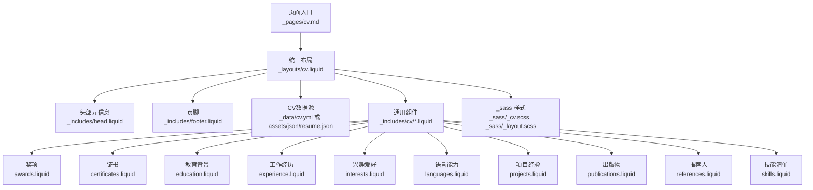
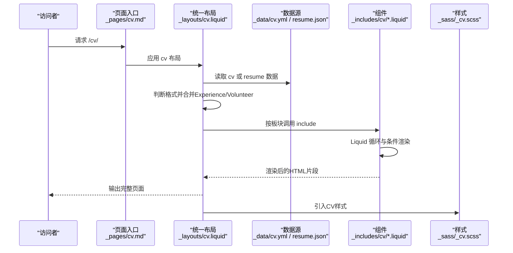
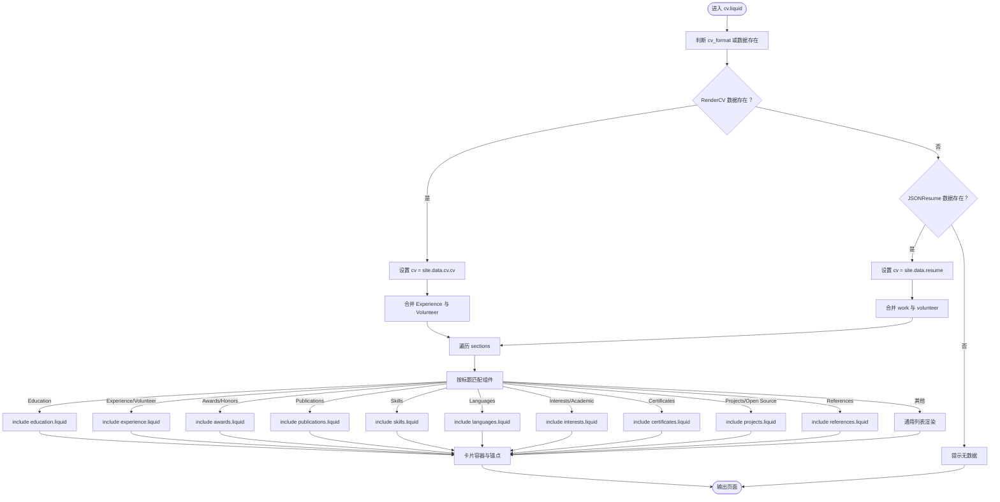
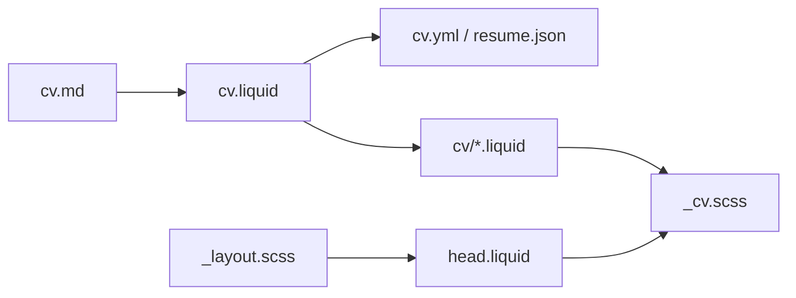

# CV页面布局设计

<cite>
**本文档引用的文件**
- [_layouts/cv.liquid](file://_layouts/cv.liquid)
- [_includes/cv/awards.liquid](file://_includes/cv/awards.liquid)
- [_includes/cv/certificates.liquid](file://_includes/cv/certificates.liquid)
- [_includes/cv/education.liquid](file://_includes/cv/education.liquid)
- [_includes/cv/experience.liquid](file://_includes/cv/experience.liquid)
- [_includes/cv/interests.liquid](file://_includes/cv/interests.liquid)
- [_includes/cv/languages.liquid](file://_includes/cv/languages.liquid)
- [_includes/cv/projects.liquid](file://_includes/cv/projects.liquid)
- [_includes/cv/publications.liquid](file://_includes/cv/publications.liquid)
- [_includes/cv/references.liquid](file://_includes/cv/references.liquid)
- [_includes/cv/skills.liquid](file://_includes/cv/skills.liquid)
- [_sass/_cv.scss](file://_sass/_cv.scss)
- [_sass/_layout.scss](file://_sass/_layout.scss)
- [_includes/head.liquid](file://_includes/head.liquid)
- [_includes/footer.liquid](file://_includes/footer.liquid)
- [_pages/cv.md](file://_pages/cv.md)
- [_data/cv.yml](file://_data/cv.yml)
- [_config.yml](file://_config.yml)
</cite>

## 目录
1. [简介](#简介)
2. [项目结构](#项目结构)
3. [核心组件](#核心组件)
4. [架构总览](#架构总览)
5. [详细组件分析](#详细组件分析)
6. [依赖关系分析](#依赖关系分析)
7. [性能考虑](#性能考虑)
8. [故障排除指南](#故障排除指南)
9. [结论](#结论)
10. [附录](#附录)

## 简介
本技术文档围绕CV页面布局设计展开，系统性解析cv.liquid布局模板与_cv/includes/cv/目录下的各组件实现，涵盖页面整体布局、响应式设计、CSS样式集成、Liquid模板语法应用（数据绑定、条件判断、循环遍历）、自定义样式覆盖方法，以及页面性能优化与SEO友好策略。目标是帮助开发者与内容维护者高效理解并扩展该简历页面的结构与表现。

## 项目结构
CV页面由页面入口、统一布局、可复用组件、样式表与数据源构成。页面入口通过_frontmatter_指定布局与元信息；cv.liquid作为统一布局，负责根据配置选择RenderCV或JSONResume格式，并调用对应组件渲染各板块；_includes/cv/目录提供通用组件以适配两种数据格式；_sass目录提供CV专用样式；_data/cv.yml提供RenderCV数据示例；_config.yml控制站点行为与第三方库加载。

**图表来源**
- [_pages/cv.md:1-13](file://_pages/cv.md#L1-L13)
- [_layouts/cv.liquid:1-393](file://_layouts/cv.liquid#L1-L393)
- [_includes/cv/awards.liquid:1-67](file://_includes/cv/awards.liquid#L1-L67)
- [_includes/cv/certificates.liquid:1-29](file://_includes/cv/certificates.liquid#L1-L29)
- [_includes/cv/education.liquid:1-94](file://_includes/cv/education.liquid#L1-L94)
- [_includes/cv/experience.liquid:1-92](file://_includes/cv/experience.liquid#L1-L92)
- [_includes/cv/interests.liquid:1-30](file://_includes/cv/interests.liquid#L1-L30)
- [_includes/cv/languages.liquid:1-29](file://_includes/cv/languages.liquid#L1-L29)
- [_includes/cv/projects.liquid:1-32](file://_includes/cv/projects.liquid#L1-L32)
- [_includes/cv/publications.liquid:1-71](file://_includes/cv/publications.liquid#L1-L71)
- [_includes/cv/references.liquid:1-16](file://_includes/cv/references.liquid#L1-L16)
- [_includes/cv/skills.liquid:1-33](file://_includes/cv/skills.liquid#L1-L33)
- [_sass/_cv.scss:1-221](file://_sass/_cv.scss#L1-L221)
- [_sass/_layout.scss:1-59](file://_sass/_layout.scss#L1-L59)

**章节来源**
- [_pages/cv.md:1-13](file://_pages/cv.md#L1-L13)
- [_layouts/cv.liquid:1-393](file://_layouts/cv.liquid#L1-L393)
- [_sass/_cv.scss:1-221](file://_sass/_cv.scss#L1-L221)
- [_sass/_layout.scss:1-59](file://_sass/_layout.scss#L1-L59)

## 核心组件
- 统一布局cv.liquid：支持RenderCV与JSONResume双格式，自动选择数据源，合并Experience与Volunteer，按标题映射到对应组件，提供锚点导航与卡片容器。
- 通用组件：awards、certificates、education、experience、interests、languages、projects、publications、references、skills，均接收entries数组，内部处理日期、链接、摘要与关键词展示。
- 样式系统：_sass/_cv.scss提供时间轴、列表组、锚点定位等CV专用样式；_sass/_layout.scss提供全局布局与滚动体验。
- 数据源：_data/cv.yml提供RenderCV示例数据；_config.yml中jekyll_get_json与jsonresume配置用于加载JSONResume数据。

**章节来源**
- [_layouts/cv.liquid:40-197](file://_layouts/cv.liquid#L40-L197)
- [_includes/cv/awards.liquid:1-67](file://_includes/cv/awards.liquid#L1-L67)
- [_includes/cv/education.liquid:1-94](file://_includes/cv/education.liquid#L1-L94)
- [_includes/cv/experience.liquid:1-92](file://_includes/cv/experience.liquid#L1-L92)
- [_includes/cv/projects.liquid:1-32](file://_includes/cv/projects.liquid#L1-L32)
- [_includes/cv/publications.liquid:1-71](file://_includes/cv/publications.liquid#L1-L71)
- [_includes/cv/skills.liquid:1-33](file://_includes/cv/skills.liquid#L1-L33)
- [_sass/_cv.scss:1-221](file://_sass/_cv.scss#L1-L221)
- [_sass/_layout.scss:1-59](file://_sass/_layout.scss#L1-L59)
- [_data/cv.yml:1-95](file://_data/cv.yml#L1-L95)
- [_config.yml:639-656](file://_config.yml#L639-L656)

## 架构总览
CV页面采用“页面入口 → 统一布局 → 组件渲染 → 样式输出”的分层架构。cv.liquid根据page.cv_format或数据存在情况决定渲染路径，随后通过include机制将entries传递给各组件，组件内部完成Liquid语法的数据绑定与展示逻辑。

**图表来源**
- [_pages/cv.md:1-13](file://_pages/cv.md#L1-L13)
- [_layouts/cv.liquid:40-393](file://_layouts/cv.liquid#L40-L393)
- [_includes/cv/experience.liquid:1-92](file://_includes/cv/experience.liquid#L1-L92)
- [_sass/_cv.scss:1-221](file://_sass/_cv.scss#L1-L221)

## 详细组件分析

### 统一布局cv.liquid
- 功能要点
  - 支持page.cv_format显式指定格式（rendercv或jsonresume），否则回退到“存在即优先”的兼容逻辑。
  - 合并Experience与Volunteer为统一“经验”板块，避免重复渲染。
  - 遍历cv.sections或JSONResume顶层字段，按标题映射到对应组件，未匹配时走通用渲染分支。
  - 为每个板块添加锚点，便于侧边栏目录跳转。
  - 对summary进行markdownify并去除外层段落标签，确保卡片内文本一致性。
- 关键Liquid语法
  - 条件判断：assign变量、if/elsif/else、for循环。
  - 数据绑定：从site.data.cv.cv或site.data.resume读取，使用default与concat合并数组。
  - include机制：将entries传入各组件，实现组件化渲染。
- 响应式与布局
  - 使用Bootstrap表格类与卡片容器，配合列网格实现左右分栏与日期列对齐。
  - 锚点样式通过CSS定位，顶部留出滚动偏移量以避开固定导航栏遮挡。

**图表来源**
- [_layouts/cv.liquid:40-197](file://_layouts/cv.liquid#L40-L197)
- [_layouts/cv.liquid:199-389](file://_layouts/cv.liquid#L199-L389)

**章节来源**
- [_layouts/cv.liquid:1-393](file://_layouts/cv.liquid#L1-L393)

### 组件：awards.liquid
- 设计原则
  - 左右分栏：日期列（badge）+ 内容区（标题、颁发机构、摘要）。
  - 日期提取：支持“YYYY-MM-DD”或纯年份，仅显示年份。
  - 可选链接：标题支持外链跳转。
  - 摘要渲染：使用markdownify并去除段落标签，保持卡片内一致排版。
- 响应式
  - 使用Bootstrap列类在xs/sm/md上自适应宽度，移动端紧凑排列。

**章节来源**
- [_includes/cv/awards.liquid:1-67](file://_includes/cv/awards.liquid#L1-L67)

### 组件：certificates.liquid
- 设计原则
  - 展示证书名称、颁发机构与获得年份。
  - 支持图标与外链，增强可读性与交互性。
- 响应式
  - 列宽自适应，适合在卡片列表中密集展示。

**章节来源**
- [_includes/cv/certificates.liquid:1-29](file://_includes/cv/certificates.liquid#L1-L29)

### 组件：education.liquid
- 设计原则
  - 兼容RenderCV与JSONResume字段：start_date/end_date、startDate/endDate、studyType/degree、area、institution、location、courses、highlights。
  - 日期处理：提取年份，缺失结束日期显示“至今/当前”。
  - 位置与图标：地点信息以小图标展示，提升信息密度。
  - 课程与亮点：分别遍历courses与highlights，统一使用markdownify处理。
- 响应式
  - 左侧日期列固定宽度，右侧内容自适应换行。

**章节来源**
- [_includes/cv/education.liquid:1-94](file://_includes/cv/education.liquid#L1-L94)

### 组件：experience.liquid
- 设计原则
  - 兼容字段：company/name/organization、position、start_date/endDate、location、url、summary、highlights。
  - 日期处理：同教育组件，仅显示年份并处理“至今”。
  - 位置与图标：地点信息以小图标展示。
  - 高亮项：逐条渲染，支持Markdown摘要。
- 响应式
  - 左右分栏，移动端紧凑布局。

**章节来源**
- [_includes/cv/experience.liquid:1-92](file://_includes/cv/experience.liquid#L1-L92)

### 组件：interests.liquid
- 设计原则
  - 展示兴趣名称与关键词列表，支持图标。
  - 使用内联style为每个兴趣项提供垂直间距，保证卡片内可读性。
- 响应式
  - 单列展示，适合短列表场景。

**章节来源**
- [_includes/cv/interests.liquid:1-30](file://_includes/cv/interests.liquid#L1-L30)

### 组件：languages.liquid
- 设计原则
  - 兼容RenderCV（name/summary）与JSONResume（language/fluency）。
  - 名称与熟练度并列展示，支持图标。
- 响应式
  - 单列展示，简洁清晰。

**章节来源**
- [_includes/cv/languages.liquid:1-29](file://_includes/cv/languages.liquid#L1-L29)

### 组件：projects.liquid
- 设计原则
  - 项目名称支持外链；摘要与高亮项使用Markdown渲染。
  - 适合展示开源项目、课程项目或竞赛作品。
- 响应式
  - 列表项紧凑排列，适合多项目场景。

**章节来源**
- [_includes/cv/projects.liquid:1-32](file://_includes/cv/projects.liquid#L1-L32)

### 组件：publications.liquid
- 设计原则
  - 兼容releaseDate/date字段；日期仅显示年份。
  - 标题支持外链；作者、期刊/出版社、摘要分行展示。
- 响应式
  - 左日期右内容，移动端紧凑。

**章节来源**
- [_includes/cv/publications.liquid:1-71](file://_includes/cv/publications.liquid#L1-L71)

### 组件：references.liquid
- 设计原则
  - 展示推荐人姓名与推荐语，支持Markdown摘要。
- 响应式
  - 列表项紧凑，适合简短推荐语。

**章节来源**
- [_includes/cv/references.liquid:1-16](file://_includes/cv/references.liquid#L1-L16)

### 组件：skills.liquid
- 设计原则
  - 展示技能名称、等级与关键词；支持图标。
  - 使用内联style为每个技能项提供垂直间距。
- 响应式
  - 单列展示，适合技能清单。

**章节来源**
- [_includes/cv/skills.liquid:1-33](file://_includes/cv/skills.liquid#L1-L33)

## 依赖关系分析
- 页面入口依赖布局：_pages/cv.md通过_layouts/cv.liquid渲染。
- 布局依赖数据源：cv.liquid从_renderCV数据或_JSONResume数据读取；_config.yml中jekyll_get_json与jsonresume配置用于加载外部JSON数据。
- 布局依赖组件：cv.liquid通过include调用各组件，组件内部再进行Liquid渲染。
- 样式依赖：_sass/_cv.scss提供CV专用样式，_sass/_layout.scss提供全局布局与滚动体验；_includes/head.liquid引入第三方库与主题样式。

**图表来源**
- [_pages/cv.md:1-13](file://_pages/cv.md#L1-L13)
- [_layouts/cv.liquid:1-393](file://_layouts/cv.liquid#L1-L393)
- [_includes/cv/awards.liquid:1-67](file://_includes/cv/awards.liquid#L1-L67)
- [_sass/_cv.scss:1-221](file://_sass/_cv.scss#L1-L221)
- [_sass/_layout.scss:1-59](file://_sass/_layout.scss#L1-L59)
- [_includes/head.liquid:1-209](file://_includes/head.liquid#L1-L209)
- [_config.yml:639-656](file://_config.yml#L639-L656)

**章节来源**
- [_pages/cv.md:1-13](file://_pages/cv.md#L1-L13)
- [_layouts/cv.liquid:1-393](file://_layouts/cv.liquid#L1-L393)
- [_config.yml:639-656](file://_config.yml#L639-L656)
- [_includes/head.liquid:1-209](file://_includes/head.liquid#L1-L209)

## 性能考虑
- 资源加载
  - 头部样式与脚本采用defer与相对路径，结合缓存破坏参数，减少首屏阻塞与缓存命中问题。
  - 第三方库通过CDN引入并附带integrity校验，提升安全性与稳定性。
- 渲染优化
  - Liquid模板在构建期静态生成，避免运行时JavaScript开销。
  - 组件化渲染降低重复逻辑，提高可维护性。
- 图像与媒体
  - _config.yml启用imagemagick生成WebP响应式图像，结合懒加载提升加载性能。
- 压缩与剔除
  - sass压缩输出；terser压缩JS；jekyll-minifier配置排除特定文件，平衡体积与功能。
- SEO友好
  - _includes/head.liquid输出canonical链接与基础元信息，有助于搜索引擎识别唯一URL与内容属性。
  - 页面标题、描述与目录配置（如toc）提升可发现性与可读性。

**章节来源**
- [_includes/head.liquid:1-209](file://_includes/head.liquid#L1-L209)
- [_config.yml:226-244](file://_config.yml#L226-L244)
- [_config.yml:350-376](file://_config.yml#L350-L376)
- [_sass/_layout.scss:1-59](file://_sass/_layout.scss#L1-L59)

## 故障排除指南
- 无CV数据
  - 现象：页面显示“未找到CV数据，请配置RenderCV或JSONResume数据”。
  - 排查：确认_page是否设置cv_format，或检查_data/cv.yml与assets/json/resume.json是否存在且格式正确。
- 字段不匹配
  - 现象：日期、标题、链接等字段未显示。
  - 排查：核对cv.yml中sections字段或resume.json顶层字段命名，确保与组件期望一致（如start_date/startDate、end_date/endDate、studyType/degree等）。
- 样式异常
  - 现象：日期列错位、卡片间距异常。
  - 排查：检查是否覆盖了_cv.scss中的表格、卡片与列类；确认Bootstrap版本与MDB样式未被意外覆盖。
- PDF按钮不可用
  - 现象：PDF下载按钮不显示或无法点击。
  - 排查：检查_page中cv_pdf路径是否正确，相对路径需使用relative_url过滤器处理。

**章节来源**
- [_layouts/cv.liquid:387-389](file://_layouts/cv.liquid#L387-L389)
- [_data/cv.yml:1-95](file://_data/cv.yml#L1-L95)
- [_pages/cv.md:1-13](file://_pages/cv.md#L1-L13)
- [_sass/_cv.scss:1-221](file://_sass/_cv.scss#L1-L221)

## 结论
该CV页面通过统一布局与组件化渲染，实现了对RenderCV与JSONResume两种数据格式的无缝支持。Liquid模板语法在数据绑定、条件判断与循环渲染方面发挥关键作用，配合Bootstrap网格与主题样式，既保证了视觉一致性，又兼顾了响应式与可维护性。通过合理的资源加载策略与构建配置，页面具备良好的性能与SEO表现。建议在扩展新板块时遵循现有组件模式，确保字段命名与渲染逻辑的一致性。

## 附录

### 自定义布局样式指导
- 覆盖方式
  - 在主题样式中新增或调整_cv.scss中的规则，如日期badge、列表项间距、卡片阴影等。
  - 若需修改全局布局，可在_layout.scss中调整容器宽度、滚动偏移与断点。
- 最佳实践
  - 使用语义化类名，避免硬编码颜色与尺寸。
  - 通过变量与混入统一风格，减少重复规则。
  - 为移动端提供最小可用体验，逐步增强。

**章节来源**
- [_sass/_cv.scss:1-221](file://_sass/_cv.scss#L1-L221)
- [_sass/_layout.scss:1-59](file://_sass/_layout.scss#L1-L59)