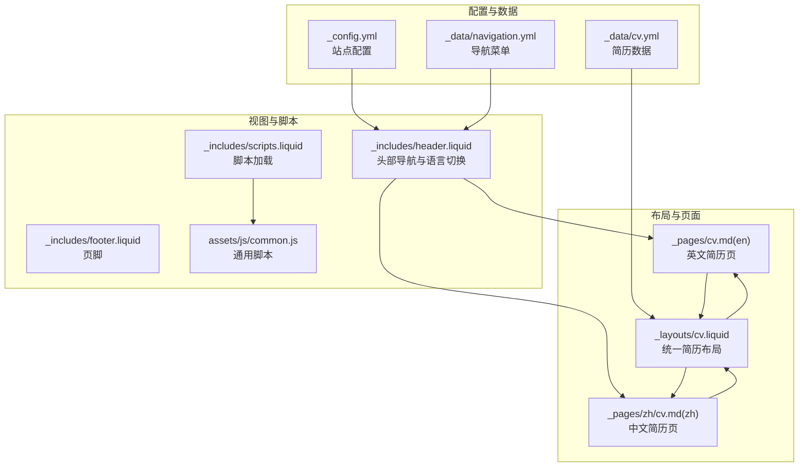
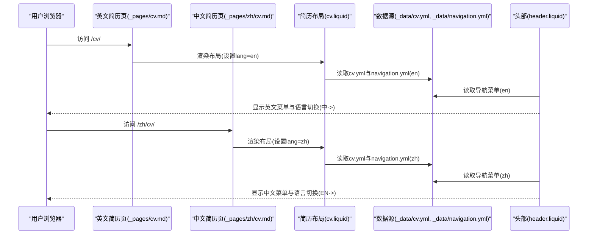
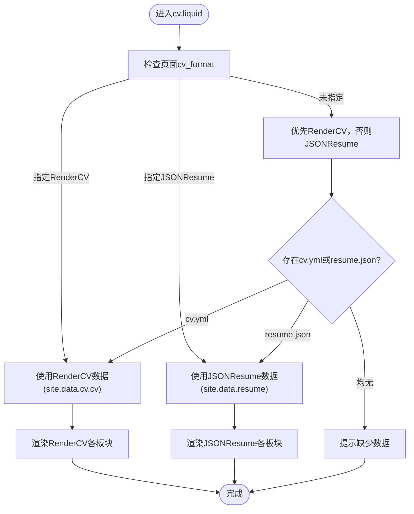
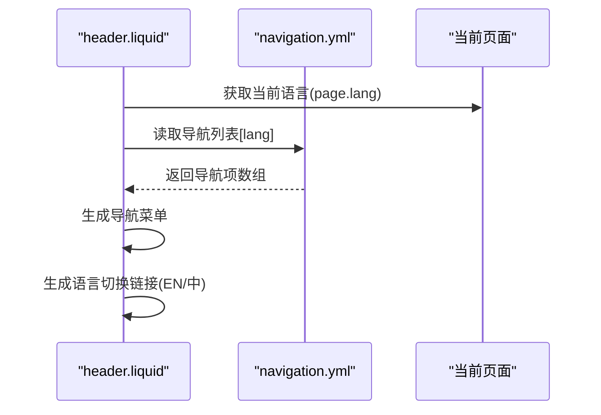
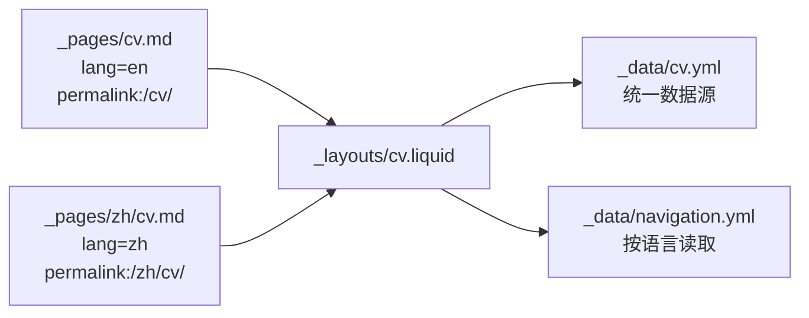
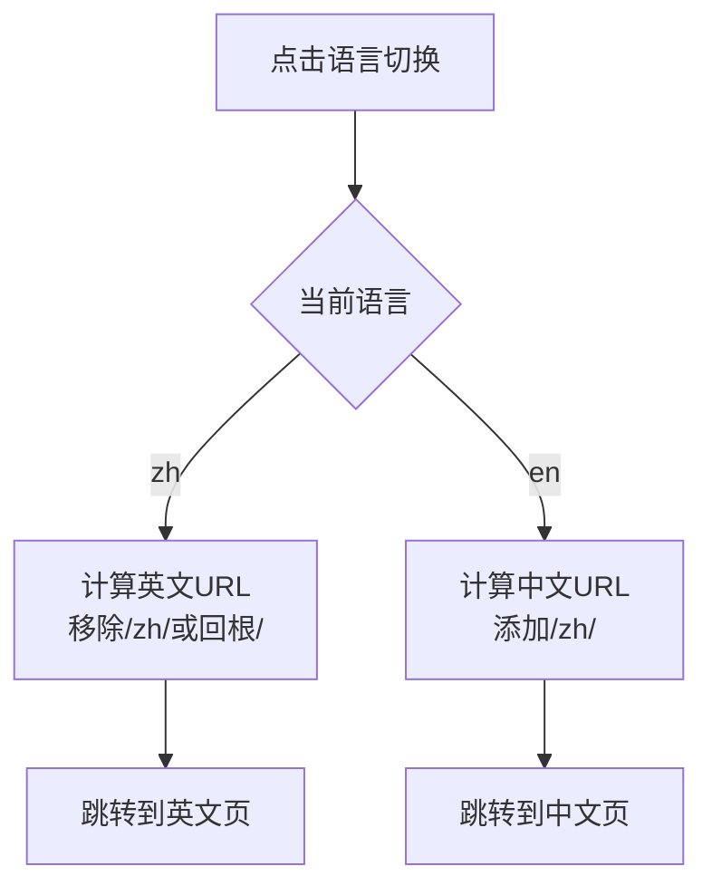
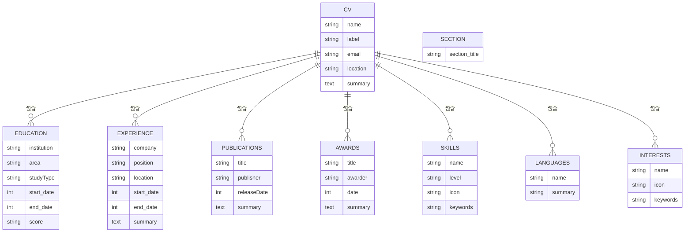
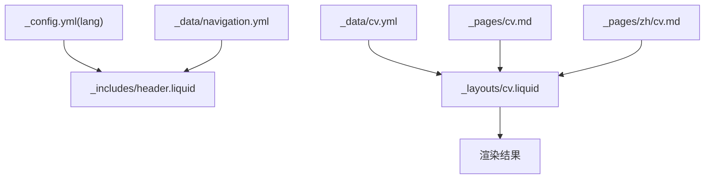

# 多语言支持系统

<cite>
**本文档引用的文件**
- [_config.yml](file://_config.yml)
- [cv.yml](file://_data/cv.yml)
- [navigation.yml](file://_data/navigation.yml)
- [cv.liquid](file://_layouts/cv.liquid)
- [cv.md（英文）](file://_pages/cv.md)
- [cv.md（中文）](file://_pages/zh/cv.md)
- [header.liquid](file://_includes/header.liquid)
- [footer.liquid](file://_includes/footer.liquid)
- [common.js](file://assets/js/common.js)
- [scripts.liquid](file://_includes/scripts.liquid)
- [SEO.md](file://SEO.md)
</cite>

## 目录
1. [简介](#简介)
2. [项目结构](#项目结构)
3. [核心组件](#核心组件)
4. [架构总览](#架构总览)
5. [详细组件分析](#详细组件分析)
6. [依赖关系分析](#依赖关系分析)
7. [性能考量](#性能考量)
8. [故障排查指南](#故障排查指南)
9. [结论](#结论)
10. [附录](#附录)

## 简介
本项目基于 Jekyll 模板 al-folio，实现了中英文双语简历与页面的多语言支持。系统通过数据驱动的方式，结合 Liquid 模板引擎与前端脚本，完成内容同步、语言切换、导航菜单多语言配置以及页面级路由与 SEO 优化。本文档将深入解析以下方面：
- 中英文双语简历的实现机制：内容同步策略、语言切换逻辑、导航菜单的多语言配置
- cv.yml 的国际化字段设计与翻译映射规则
- 页面级多语言支持：独立的中文与英文简历页面、URL 路由配置、搜索引擎优化
- 语言检测与自动切换的 JavaScript 实现方案
- 翻译质量保证与一致性检查方法
- 多语言简历的维护策略与更新同步机制
- 本地化测试与验证的最佳实践

## 项目结构
该多语言支持系统的关键文件分布如下：
- 配置与数据层：站点配置、导航与简历数据
- 布局与页面：统一简历布局与中英双语页面
- 视图与脚本：导航栏语言切换、通用脚本与 SEO 支持

**图表来源**
- [_config.yml:17-17](file://_config.yml#L17-L17)
- [navigation.yml:1-24](file://_data/navigation.yml#L1-L24)
- [cv.yml:1-95](file://_data/cv.yml#L1-L95)
- [cv.liquid:1-393](file://_layouts/cv.liquid#L1-L393)
- [cv.md（英文）:1-13](file://_pages/cv.md#L1-L13)
- [cv.md（中文）:1-12](file://_pages/zh/cv.md#L1-L12)
- [header.liquid:1-108](file://_includes/header.liquid#L1-L108)
- [footer.liquid:1-31](file://_includes/footer.liquid#L1-L31)
- [scripts.liquid:1-379](file://_includes/scripts.liquid#L1-L379)
- [common.js:1-61](file://assets/js/common.js#L1-L61)

**章节来源**
- [_config.yml:17-17](file://_config.yml#L17-L17)
- [navigation.yml:1-24](file://_data/navigation.yml#L1-L24)
- [cv.yml:1-95](file://_data/cv.yml#L1-L95)
- [cv.liquid:1-393](file://_layouts/cv.liquid#L1-L393)
- [cv.md（英文）:1-13](file://_pages/cv.md#L1-L13)
- [cv.md（中文）:1-12](file://_pages/zh/cv.md#L1-L12)
- [header.liquid:1-108](file://_includes/header.liquid#L1-L108)
- [footer.liquid:1-31](file://_includes/footer.liquid#L1-L31)
- [scripts.liquid:1-379](file://_includes/scripts.liquid#L1-L379)
- [common.js:1-61](file://assets/js/common.js#L1-L61)

## 核心组件
- 统一简历布局：支持 RenderCV 与 JSONResume 两种格式的数据源，优先 RenderCV，兼容两种格式的渲染与输出一致
- 导航菜单多语言：根据当前语言从数据源读取对应导航项，动态生成菜单
- 语言切换：在导航栏提供中英文切换按钮，自动计算目标路径并跳转
- 页面级路由：英文简历页位于根路径，中文简历页位于 /zh/ 子路径，保持独立可访问性
- SEO 与元信息：站点语言、描述、标题等基础 SEO 元信息配置

**章节来源**
- [cv.liquid:1-393](file://_layouts/cv.liquid#L1-L393)
- [header.liquid:78-94](file://_includes/header.liquid#L78-L94)
- [cv.md（英文）:3-8](file://_pages/cv.md#L3-L8)
- [cv.md（中文）:3-6](file://_pages/zh/cv.md#L3-L6)
- [_config.yml:17-17](file://_config.yml#L17-L17)

## 架构总览
下图展示了多语言简历系统的核心交互流程：页面请求触发布局渲染，布局根据页面语言选择数据源，导航栏根据当前语言动态加载菜单项并提供语言切换。

**图表来源**
- [cv.md（英文）:1-13](file://_pages/cv.md#L1-L13)
- [cv.md（中文）:1-12](file://_pages/zh/cv.md#L1-L12)
- [cv.liquid:1-393](file://_layouts/cv.liquid#L1-L393)
- [navigation.yml:1-24](file://_data/navigation.yml#L1-L24)
- [cv.yml:1-95](file://_data/cv.yml#L1-L95)
- [header.liquid:1-108](file://_includes/header.liquid#L1-L108)

## 详细组件分析

### 统一简历布局（cv.liquid）
- 数据源选择优先级：若页面指定 cv_format 则按指定格式渲染；否则优先 RenderCV（site.data.cv.cv），其次 JSONResume（site.data.resume）
- 内容渲染：统一处理联系信息、摘要、教育、经验、奖项、出版物、技能、语言、兴趣、证书、项目、参考等板块
- 经验合并：将“经验”和“志愿”合并为“经验”板块进行渲染，确保输出一致性
- 输出一致性：无论使用哪种数据格式，最终渲染结构与样式保持一致

**图表来源**
- [cv.liquid:46-57](file://_layouts/cv.liquid#L46-L57)
- [cv.liquid:59-197](file://_layouts/cv.liquid#L59-L197)
- [cv.liquid:199-389](file://_layouts/cv.liquid#L199-L389)

**章节来源**
- [cv.liquid:1-393](file://_layouts/cv.liquid#L1-L393)

### 导航菜单多语言（navigation.yml 与 header.liquid）
- 导航数据结构：以语言为键（en、zh），每个键下包含若干菜单项（title、url）
- 动态加载：头部模板根据当前页面语言读取对应导航项
- 语言切换：根据当前语言生成目标路径（如从 /zh/ 切换到 / 或从 / 切换到 /zh）

**图表来源**
- [header.liquid:5-6](file://_includes/header.liquid#L5-L6)
- [header.liquid:49-59](file://_includes/header.liquid#L49-L59)
- [header.liquid:78-94](file://_includes/header.liquid#L78-L94)
- [navigation.yml:1-24](file://_data/navigation.yml#L1-L24)

**章节来源**
- [navigation.yml:1-24](file://_data/navigation.yml#L1-L24)
- [header.liquid:1-108](file://_includes/header.liquid#L1-L108)

### 页面级多语言支持（cv.md 英文/中文）
- 英文简历页：根路径 /cv/，lang=en，cv_format=rendercv
- 中文简历页：子路径 /zh/cv/，lang=zh，cv_format=rendercv
- 导航行为：英文页显示中文导航项，中文页显示英文导航项，便于跨语言访问

**图表来源**
- [cv.md（英文）:1-13](file://_pages/cv.md#L1-L13)
- [cv.md（中文）:1-12](file://_pages/zh/cv.md#L1-L12)
- [cv.liquid:1-393](file://_layouts/cv.liquid#L1-L393)
- [navigation.yml:1-24](file://_data/navigation.yml#L1-L24)
- [cv.yml:1-95](file://_data/cv.yml#L1-L95)

**章节来源**
- [cv.md（英文）:1-13](file://_pages/cv.md#L1-L13)
- [cv.md（中文）:1-12](file://_pages/zh/cv.md#L1-L12)

### 语言切换逻辑（header.liquid）
- 当前语言判断：若页面未设置语言则默认 en
- 切换规则：
  - 当前为 zh：切换到英文时移除 /zh/ 前缀（若为 /zh/ 则回到根 /）
  - 当前为 en：切换到中文时在路径前添加 /zh/（若为 / 则直接跳转到 /zh/）
- 切换按钮：显示 EN/中 并提供 title 提示

**图表来源**
- [header.liquid:78-94](file://_includes/header.liquid#L78-L94)

**章节来源**
- [header.liquid:78-94](file://_includes/header.liquid#L78-L94)

### cv.yml 国际化字段设计与翻译映射
- 字段设计：简历采用统一字段名（如 name、label、email、location、summary、sections 下各板块条目），便于在不同语言间复用
- 板块组织：sections 下的键（Education、Experience、Publications、Awards、Skills、Languages、Interests 等）作为渲染入口
- 翻译映射规则：
  - RenderCV 使用 name/summary 等字段，JSONResume 使用 language/fluency 等字段
  - 布局通过条件判断兼容两种格式，确保输出一致
- 语言条目：Languages 板块同时支持 RenderCV 的 name/summary 与 JSONResume 的 language/fluency

**图表来源**
- [cv.yml:1-95](file://_data/cv.yml#L1-L95)
- [cv.liquid:140-197](file://_layouts/cv.liquid#L140-L197)
- [_includes/cv/languages.liquid:1-28](file://_includes/cv/languages.liquid#L1-L28)

**章节来源**
- [cv.yml:1-95](file://_data/cv.yml#L1-L95)
- [cv.liquid:140-197](file://_layouts/cv.liquid#L140-L197)
- [_includes/cv/languages.liquid:1-28](file://_includes/cv/languages.liquid#L1-L28)

### 语言检测与自动切换（JavaScript 方案）
- 现状：当前语言切换通过服务端 Liquid 模板生成的链接实现，无需客户端 JavaScript
- 可选增强：可在客户端增加语言检测与自动切换逻辑（例如根据浏览器语言偏好自动跳转至对应语言页面），但需注意与现有路由策略的兼容性

**章节来源**
- [header.liquid:78-94](file://_includes/header.liquid#L78-L94)

### 翻译质量保证与一致性检查
- 数据一致性：统一使用 cv.yml 作为主要数据源，避免同一内容在多处重复定义
- 字段对齐：确保 sections 下各板块字段名称与布局渲染逻辑一致
- 输出一致性：通过统一布局渲染，确保不同语言版本的结构与样式一致
- 自动化校验建议：在 CI 中增加 YAML 语法检查与字段完整性检查任务

**章节来源**
- [cv.liquid:1-393](file://_layouts/cv.liquid#L1-L393)
- [cv.yml:1-95](file://_data/cv.yml#L1-L95)

### 维护策略与更新同步机制
- 单点维护：所有简历内容集中在 cv.yml，导航与页面仅负责路由与展示
- 更新流程：修改 cv.yml 后重建站点，即可同步更新中英文简历页面
- 版本控制：建议在版本控制系统中记录 cv.yml 的变更历史，便于回溯与审计

**章节来源**
- [cv.yml:1-95](file://_data/cv.yml#L1-L95)
- [cv.liquid:1-393](file://_layouts/cv.liquid#L1-L393)

### 本地化测试与验证最佳实践
- 手动验证：分别访问 /cv/ 与 /zh/cv/，确认导航、标题、描述、内容与语言切换按钮正常
- 结构验证：检查各板块是否完整渲染，特别是 Languages 板块在两种格式下的显示
- SEO 验证：依据 SEO 文档配置站点语言、描述与标题，提交 sitemap 至搜索引擎控制台

**章节来源**
- [SEO.md:72-87](file://SEO.md#L72-L87)
- [SEO.md:51-68](file://SEO.md#L51-L68)

## 依赖关系分析
- 配置依赖：站点语言 lang 影响导航与部分元信息
- 数据依赖：cv.liquid 依赖 cv.yml 与 navigation.yml
- 页面依赖：英文与中文简历页共享同一布局，但指向不同数据与路径
- 脚本依赖：通用脚本 common.js 与页面渲染无直接耦合，不影响多语言功能

**图表来源**
- [_config.yml:17-17](file://_config.yml#L17-L17)
- [navigation.yml:1-24](file://_data/navigation.yml#L1-L24)
- [cv.yml:1-95](file://_data/cv.yml#L1-L95)
- [cv.liquid:1-393](file://_layouts/cv.liquid#L1-L393)
- [cv.md（英文）:1-13](file://_pages/cv.md#L1-L13)
- [cv.md（中文）:1-12](file://_pages/zh/cv.md#L1-L12)

**章节来源**
- [_config.yml:17-17](file://_config.yml#L17-L17)
- [navigation.yml:1-24](file://_data/navigation.yml#L1-L24)
- [cv.yml:1-95](file://_data/cv.yml#L1-L95)
- [cv.liquid:1-393](file://_layouts/cv.liquid#L1-L393)
- [cv.md（英文）:1-13](file://_pages/cv.md#L1-L13)
- [cv.md（中文）:1-12](file://_pages/zh/cv.md#L1-L12)

## 性能考量
- 构建期优化：Jekyll 在构建时完成数据渲染，无需运行时计算
- 资源加载：脚本按需加载，通用脚本与页面渲染解耦
- SEO 优化：遵循 SEO 文档配置站点语言、描述与标题，提升搜索可见性

**章节来源**
- [scripts.liquid:1-379](file://_includes/scripts.liquid#L1-L379)
- [common.js:1-61](file://assets/js/common.js#L1-L61)
- [SEO.md:72-87](file://SEO.md#L72-L87)

## 故障排查指南
- 语言切换无效：检查页面是否正确设置 lang，确认 header.liquid 的语言判断逻辑
- 导航不显示：确认 navigation.yml 的语言键与页面语言一致
- 简历内容缺失：确认 cv.yml 字段完整，且 cv.liquid 的 sections 渲染逻辑覆盖相应板块
- SEO 异常：检查 _config.yml 的语言与描述配置，确保 sitemap 与 robots 文件可访问

**章节来源**
- [header.liquid:5-6](file://_includes/header.liquid#L5-L6)
- [navigation.yml:1-24](file://_data/navigation.yml#L1-L24)
- [cv.yml:1-95](file://_data/cv.yml#L1-L95)
- [cv.liquid:1-393](file://_layouts/cv.liquid#L1-L393)
- [SEO.md:51-68](file://SEO.md#L51-L68)

## 结论
本多语言支持系统通过数据驱动与统一布局，实现了中英文双语简历的一致渲染与便捷切换。其核心优势在于：
- 统一数据源与渲染逻辑，确保内容一致性
- 简洁的路由策略与导航配置，便于维护与扩展
- 可结合 SEO 文档进一步提升搜索可见性

建议在后续迭代中引入自动化校验与可选的客户端语言检测，以进一步提升用户体验与开发效率。

## 附录
- SEO 最佳实践要点：站点语言、描述、标题配置；sitemap 与 robots；Open Graph 与 Schema.org 标记；搜索控制台验证
- 本地化测试清单：页面访问、导航显示、内容渲染、语言切换、SEO 元信息

**章节来源**
- [SEO.md:72-87](file://SEO.md#L72-L87)
- [SEO.md:51-68](file://SEO.md#L51-L68)
- [SEO.md:110-133](file://SEO.md#L110-L133)
- [SEO.md:164-177](file://SEO.md#L164-L177)
- [SEO.md:200-246](file://SEO.md#L200-L246)