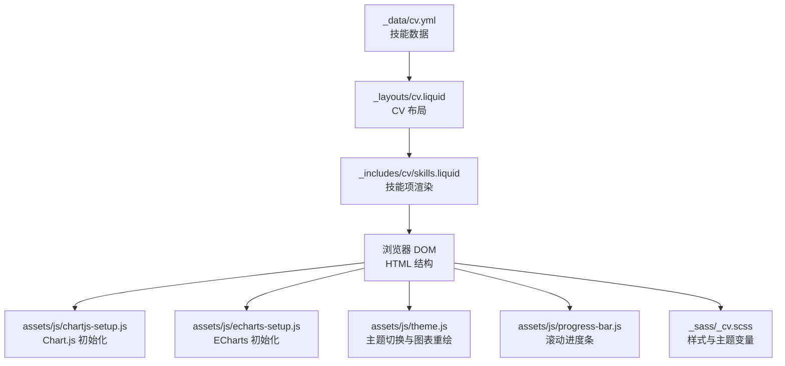
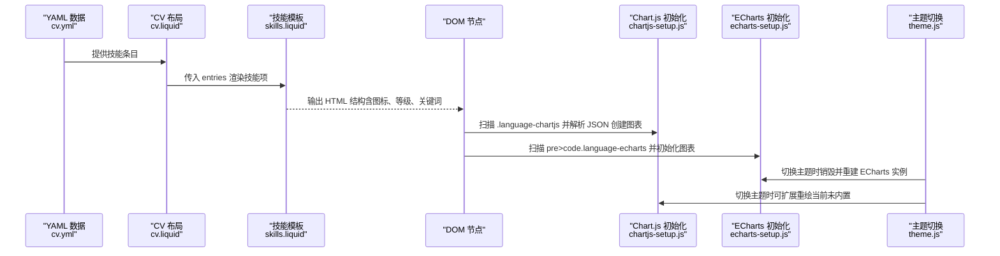
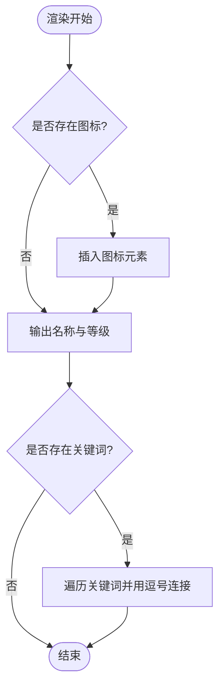
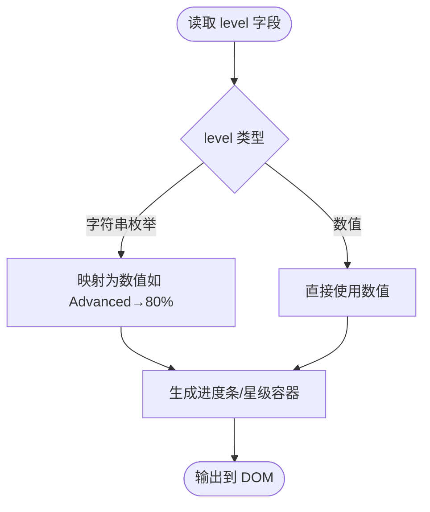
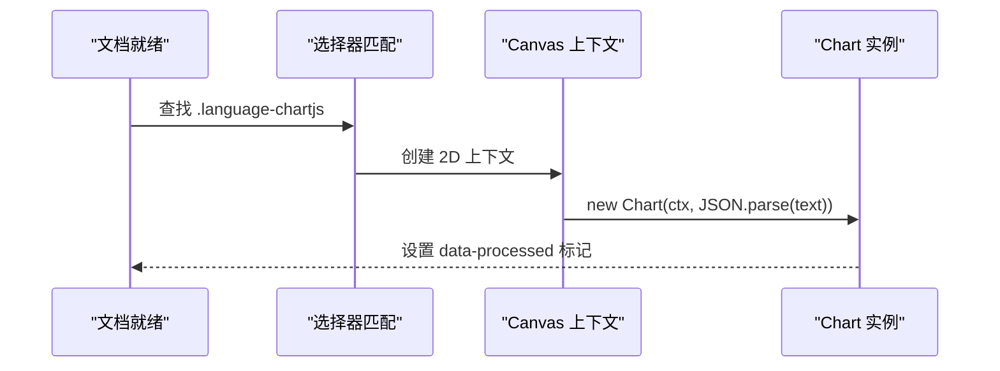
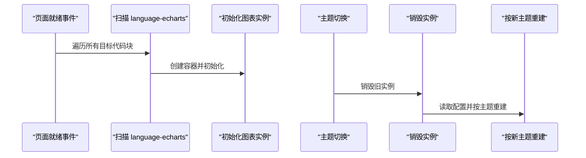
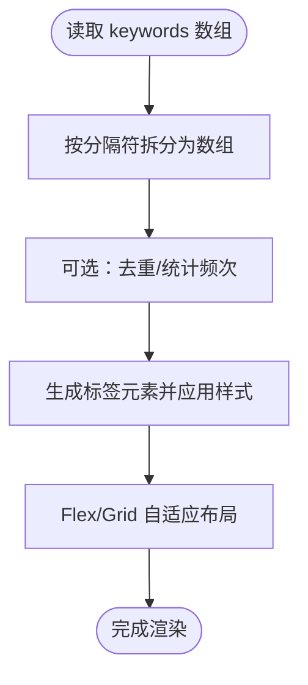
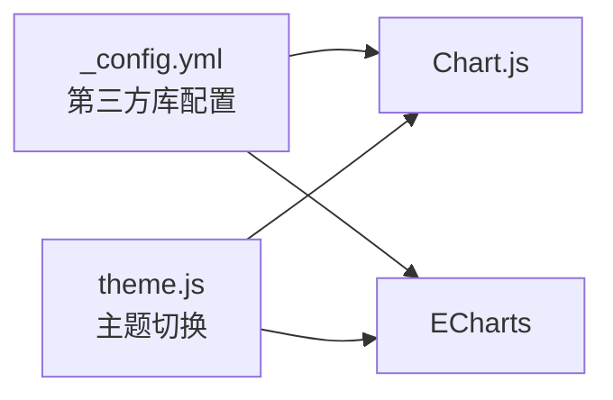

# 技能可视化展示

<cite>
**本文引用的文件**
- [_includes/cv/skills.liquid](file://_includes/cv/skills.liquid)
- [_layouts/cv.liquid](file://_layouts/cv.liquid)
- [_data/cv.yml](file://_data/cv.yml)
- [assets/js/chartjs-setup.js](file://assets/js/chartjs-setup.js)
- [assets/js/echarts-setup.js](file://assets/js/echarts-setup.js)
- [assets/js/theme.js](file://assets/js/theme.js)
- [assets/js/progress-bar.js](file://assets/js/progress-bar.js)
- [_sass/_cv.scss](file://_sass/_cv.scss)
- [_config.yml](file://_config.yml)
</cite>

## 目录
1. [简介](#简介)
2. [项目结构](#项目结构)
3. [核心组件](#核心组件)
4. [架构总览](#架构总览)
5. [详细组件分析](#详细组件分析)
6. [依赖分析](#依赖分析)
7. [性能考虑](#性能考虑)
8. [故障排查指南](#故障排查指南)
9. [结论](#结论)
10. [附录](#附录)

## 简介
本文件面向“技能可视化展示”的技术文档需求，系统梳理了技能数据在页面中的呈现方式、HTML 结构设计、CSS 样式定制、JavaScript 交互与图表集成、关键词展示策略、动态更新与实时渲染机制、以及无障碍访问（a11y）支持。当前仓库中技能数据通过统一的 CV 布局与包含模板进行渲染；图表方面，项目集成了 Chart.js 与 ECharts 的初始化与主题切换能力；同时提供了进度条滚动指示器与基础的标签云展示思路。

## 项目结构
围绕技能可视化的关键文件组织如下：
- 数据层：使用 YAML 数据源提供技能条目（名称、等级、图标、关键词）
- 视图层：Liquid 模板负责将数据渲染为 HTML 结构
- 样式层：SCSS 提供卡片、列表、字体与主题色等样式
- 交互层：jQuery 初始化图表、主题切换时重绘图表、滚动进度条等

**图表来源**
- [_data/cv.yml:68-95](file://_data/cv.yml#L68-L95)
- [_layouts/cv.liquid:163-165](file://_layouts/cv.liquid#L163-L165)
- [_includes/cv/skills.liquid:5-26](file://_includes/cv/skills.liquid#L5-L26)
- [assets/js/chartjs-setup.js:1-15](file://assets/js/chartjs-setup.js#L1-L15)
- [assets/js/echarts-setup.js:1-30](file://assets/js/echarts-setup.js#L1-L30)
- [assets/js/theme.js:168-182](file://assets/js/theme.js#L168-L182)
- [assets/js/progress-bar.js:1-74](file://assets/js/progress-bar.js#L1-L74)
- [_sass/_cv.scss:1-221](file://_sass/_cv.scss#L1-L221)

**章节来源**
- [_data/cv.yml:68-95](file://_data/cv.yml#L68-L95)
- [_layouts/cv.liquid:163-165](file://_layouts/cv.liquid#L163-L165)
- [_includes/cv/skills.liquid:5-26](file://_includes/cv/skills.liquid#L5-L26)
- [_sass/_cv.scss:1-221](file://_sass/_cv.scss#L1-L221)

## 核心组件
- 技能数据模型：由 YAML 提供，包含名称、等级、图标、关键词等字段
- 技能渲染模板：统一输出为卡片文本结构，支持图标与关键词逗号分隔展示
- 图表集成：Chart.js 与 ECharts 的初始化脚本，按选择器自动扫描并渲染
- 主题切换：在主题变化时重绘图表，保证深浅色一致性
- 进度条：基于原生 progress 元素或 CSS 宽度模拟滚动进度
- 样式体系：基于 SCSS 变量与类名控制主题色、字体与间距

**章节来源**
- [_data/cv.yml:68-95](file://_data/cv.yml#L68-L95)
- [_includes/cv/skills.liquid:5-26](file://_includes/cv/skills.liquid#L5-L26)
- [assets/js/chartjs-setup.js:1-15](file://assets/js/chartjs-setup.js#L1-L15)
- [assets/js/echarts-setup.js:1-30](file://assets/js/echarts-setup.js#L1-L30)
- [assets/js/theme.js:168-182](file://assets/js/theme.js#L168-L182)
- [assets/js/progress-bar.js:18-74](file://assets/js/progress-bar.js#L18-L74)
- [_sass/_cv.scss:1-221](file://_sass/_cv.scss#L1-L221)

## 架构总览
技能可视化从数据到渲染的端到端流程如下：

**图表来源**
- [_data/cv.yml:68-95](file://_data/cv.yml#L68-L95)
- [_layouts/cv.liquid:163-165](file://_layouts/cv.liquid#L163-L165)
- [_includes/cv/skills.liquid:5-26](file://_includes/cv/skills.liquid#L5-L26)
- [assets/js/chartjs-setup.js:1-15](file://assets/js/chartjs-setup.js#L1-L15)
- [assets/js/echarts-setup.js:1-30](file://assets/js/echarts-setup.js#L1-L30)
- [assets/js/theme.js:168-182](file://assets/js/theme.js#L168-L182)

## 详细组件分析

### 技能 HTML 结构与 CSS 样式
- HTML 结构：每个技能项以卡片文本形式输出，包含可选图标、名称与等级、以及逗号分隔的关键词
- CSS 样式：通过 SCSS 控制卡片、列表组、字体大小与主题色；技能项具有内边距以提升可读性

**图表来源**
- [_includes/cv/skills.liquid:5-26](file://_includes/cv/skills.liquid#L5-L26)

**章节来源**
- [_includes/cv/skills.liquid:5-26](file://_includes/cv/skills.liquid#L5-L26)
- [_sass/_cv.scss:101-152](file://_sass/_cv.scss#L101-L152)

### 技能等级（level）与可视化映射
- 当前模板直接将 level 作为文本后缀显示，未进行数值化映射（例如百分比、星级、图标数量等）
- 若需实现百分比进度条或星级评分，可在模板中根据 level 值映射为数值，再通过额外的 HTML 结构与样式进行渲染

[此图为概念示意，不直接对应具体源码文件]

### Chart.js 集成与配置
- 初始化逻辑：在文档就绪后，查找带有特定类名的选择器，读取内部文本作为配置 JSON，创建 Canvas 上下文并实例化图表
- 使用建议：在 Markdown 或 Liquid 中以指定语言块包裹配置 JSON，确保被正确识别与渲染

**图表来源**
- [assets/js/chartjs-setup.js:1-15](file://assets/js/chartjs-setup.js#L1-L15)

**章节来源**
- [assets/js/chartjs-setup.js:1-15](file://assets/js/chartjs-setup.js#L1-L15)
- [_config.yml:415-421](file://_config.yml#L415-L421)

### ECharts 集成与主题切换
- 初始化逻辑：在页面加载完成后，扫描带特定语言标识的代码块，隐藏原始代码块并创建新的图表节点，按深浅主题初始化实例，设置配置并监听窗口尺寸变化
- 主题切换：主题变更时销毁旧实例，重新读取隐藏代码块中的配置并按新主题初始化

**图表来源**
- [assets/js/echarts-setup.js:1-30](file://assets/js/echarts-setup.js#L1-L30)
- [assets/js/theme.js:168-182](file://assets/js/theme.js#L168-L182)

**章节来源**
- [assets/js/echarts-setup.js:1-30](file://assets/js/echarts-setup.js#L1-L30)
- [assets/js/theme.js:168-182](file://assets/js/theme.js#L168-L182)
- [_config.yml:435-444](file://_config.yml#L435-L444)

### 关键词（keywords）展示策略与标签云
- 当前实现：关键词以逗号分隔直接输出，适合简单列表展示
- 标签云建议：可引入外部库或自定义 JS 将关键词转为标签元素，按出现频次或权重设置字号与颜色，结合 CSS Grid/Flex 布局实现响应式排列

[此图为概念示意，不直接对应具体源码文件]

### 动态更新与实时渲染机制
- 技能数据：来自 YAML/JSON 数据源，构建时静态渲染
- 图表更新：Chart.js 与 ECharts 初始化脚本仅在页面加载阶段执行；若需动态更新，可在运行时调用相应 API 更新数据并重新渲染
- 主题切换：通过主题脚本在切换时重绘图表，保证视觉一致性

**章节来源**
- [assets/js/chartjs-setup.js:1-15](file://assets/js/chartjs-setup.js#L1-L15)
- [assets/js/echarts-setup.js:1-30](file://assets/js/echarts-setup.js#L1-L30)
- [assets/js/theme.js:168-182](file://assets/js/theme.js#L168-L182)

### 无障碍访问（a11y）与屏幕阅读器支持
- 当前实现：技能项采用语义化标题与列表结构，但未包含针对屏幕阅读器的额外属性（如 aria-label、role 等）
- 建议增强：为进度条、图表容器添加适当的 ARIA 属性与描述文本，确保键盘可达性与读屏友好

[本节为通用建议，不直接分析具体文件]

## 依赖分析
- 第三方库版本与完整性校验：通过配置文件集中管理，确保 CDN 引入的 Chart.js、ECharts 等库的版本与完整性哈希一致
- 主题联动：主题切换脚本对多种可视化库进行主题适配，形成统一的深浅色体验

**图表来源**
- [_config.yml:405-444](file://_config.yml#L405-L444)
- [assets/js/theme.js:168-182](file://assets/js/theme.js#L168-L182)

**章节来源**
- [_config.yml:405-444](file://_config.yml#L405-L444)
- [assets/js/theme.js:168-182](file://assets/js/theme.js#L168-L182)

## 性能考虑
- 图表初始化时机：在页面加载完成后进行，避免阻塞首屏渲染
- 主题切换成本：销毁与重建图表实例会带来一定开销，建议在频繁切换场景下优化重绘策略
- 样式与脚本压缩：项目启用了压缩与最小化工具链，有助于减少传输体积

[本节提供通用建议，不直接分析具体文件]

## 故障排查指南
- Chart.js 未渲染
  - 检查是否正确使用了指定语言块与选择器
  - 确认 JSON 配置格式有效且上下文可用
- ECharts 未渲染或主题异常
  - 确认代码块被正确隐藏与新节点创建
  - 在主题切换后检查是否重新初始化
- 进度条不显示或计算错误
  - 确认浏览器支持原生 progress 元素或已启用 CSS 宽度模拟
  - 检查滚动高度与视口高度计算逻辑

**章节来源**
- [assets/js/chartjs-setup.js:1-15](file://assets/js/chartjs-setup.js#L1-L15)
- [assets/js/echarts-setup.js:1-30](file://assets/js/echarts-setup.js#L1-L30)
- [assets/js/progress-bar.js:18-74](file://assets/js/progress-bar.js#L18-L74)

## 结论
本项目通过统一的数据模型与模板渲染实现了技能信息的清晰展示；借助 Chart.js 与 ECharts 的集成，为技能可视化提供了灵活的图表能力；主题切换脚本保障了跨库的一致性。为进一步提升用户体验，建议在模板层增加对等级字段的数值映射、引入标签云组件，并完善无障碍访问属性与动态更新机制。

## 附录
- 技能数据示例路径：[_data/cv.yml:68-95](file://_data/cv.yml#L68-L95)
- 技能渲染模板路径：[_includes/cv/skills.liquid:5-26](file://_includes/cv/skills.liquid#L5-L26)
- CV 布局中技能区块渲染路径：[_layouts/cv.liquid:163-165](file://_layouts/cv.liquid#L163-L165)
- Chart.js 初始化路径：[assets/js/chartjs-setup.js:1-15](file://assets/js/chartjs-setup.js#L1-L15)
- ECharts 初始化与主题切换路径：[assets/js/echarts-setup.js:1-30](file://assets/js/echarts-setup.js#L1-L30)、[assets/js/theme.js:168-182](file://assets/js/theme.js#L168-L182)
- 进度条实现路径：[assets/js/progress-bar.js:18-74](file://assets/js/progress-bar.js#L18-L74)
- 样式与主题变量路径：[_sass/_cv.scss:1-221](file://_sass/_cv.scss#L1-L221)
- 第三方库配置路径：[_config.yml:405-444](file://_config.yml#L405-L444)