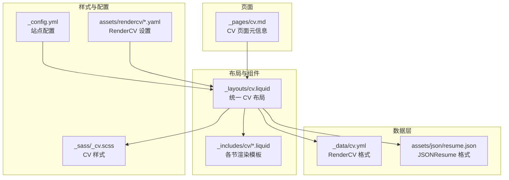
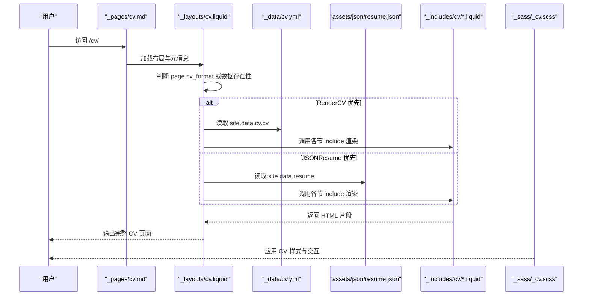
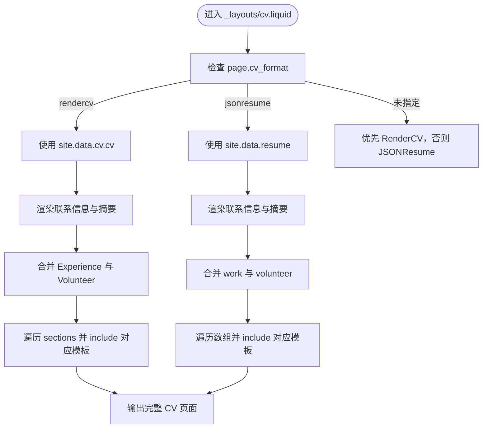
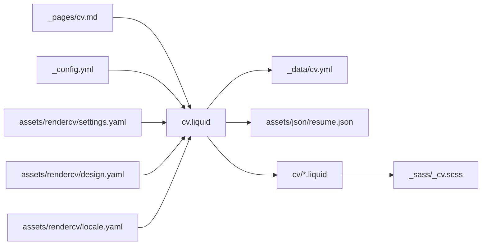

# 简历和技能展示

<cite>
**本文引用的文件**
- [cv.yml](file://_data/cv.yml)
- [resume.json](file://assets/json/resume.json)
- [cv.liquid](file://_layouts/cv.liquid)
- [cv.md](file://_pages/cv.md)
- [_config.yml](file://_config.yml)
- [skills.liquid](file://_includes/cv/skills.liquid)
- [experience.liquid](file://_includes/cv/experience.liquid)
- [education.liquid](file://_includes/cv/education.liquid)
- [awards.liquid](file://_includes/cv/awards.liquid)
- [publications.liquid](file://_includes/cv/publications.liquid)
- [languages.liquid](file://_includes/cv/languages.liquid)
- [_cv.scss](file://_sass/_cv.scss)
- [design.yaml](file://assets/rendercv/design.yaml)
- [settings.yaml](file://assets/rendercv/settings.yaml)
- [locale.yaml](file://assets/rendercv/locale.yaml)
- [README.md](file://README.md)
</cite>

## 目录
1. [简介](#简介)
2. [项目结构](#项目结构)
3. [核心组件](#核心组件)
4. [架构总览](#架构总览)
5. [详细组件分析](#详细组件分析)
6. [依赖关系分析](#依赖关系分析)
7. [性能考量](#性能考量)
8. [故障排查指南](#故障排查指南)
9. [结论](#结论)
10. [附录](#附录)

## 简介
本技术文档面向“简历和技能展示”系统，围绕以下目标展开：  
- 深入解析 cv.yml 数据结构（教育背景、工作经验、技能专长、获奖情况等）  
- 说明 RenderCV 与 JSONResume 两种格式的使用方法与转换流程  
- 提供简历页面的布局设计与样式定制选项  
- 解释多语言支持的实现机制与翻译策略  
- 说明技能图表、进度条等可视化元素的配置方法  
- 包含 PDF 导出功能的设置与优化建议  
- 提供简历内容的最佳组织方式与 SEO 优化技巧  
- 解释与招聘平台的数据对接方法  

该系统基于 Jekyll 主题 al-folio 构建，通过统一的 Liquid 布局渲染 RenderCV 与 JSONResume 两种来源的 CV 数据，同时提供可定制的样式与可选的 PDF 输出。

## 项目结构
该简历系统采用 Jekyll 的分层组织方式，关键目录与文件如下：
- 数据层：_data/cv.yml（RenderCV 格式）、assets/json/resume.json（JSONResume 格式）
- 布局层：_layouts/cv.liquid（统一 CV 渲染入口）
- 组件层：_includes/cv/*.liquid（各节渲染模板）
- 样式层：_sass/_cv.scss（CV 页面专用样式）
- 配置层：_config.yml（站点配置、第三方库、JSON 获取等）、assets/rendercv/*.yaml（RenderCV 渲染配置）
- 页面层：_pages/cv.md（CV 页面元信息与渲染格式选择）

**图示来源**
- [cv.liquid:1-393](file://_layouts/cv.liquid#L1-L393)
- [cv.yml:1-95](file://_data/cv.yml#L1-L95)
- [resume.json:1-163](file://assets/json/resume.json#L1-L163)
- [_cv.scss:1-221](file://_sass/_cv.scss#L1-L221)
- [_config.yml:639-656](file://_config.yml#L639-L656)
- [cv.md:1-13](file://_pages/cv.md#L1-L13)
- [design.yaml:1-8](file://assets/rendercv/design.yaml#L1-L8)
- [settings.yaml:1-18](file://assets/rendercv/settings.yaml#L1-L18)
- [locale.yaml:1-4](file://assets/rendercv/locale.yaml#L1-L4)

**章节来源**
- [cv.liquid:1-393](file://_layouts/cv.liquid#L1-L393)
- [cv.yml:1-95](file://_data/cv.yml#L1-L95)
- [resume.json:1-163](file://assets/json/resume.json#L1-L163)
- [_cv.scss:1-221](file://_sass/_cv.scss#L1-L221)
- [_config.yml:639-656](file://_config.yml#L639-L656)
- [cv.md:1-13](file://_pages/cv.md#L1-L13)
- [design.yaml:1-8](file://assets/rendercv/design.yaml#L1-L8)
- [settings.yaml:1-18](file://assets/rendercv/settings.yaml#L1-L18)
- [locale.yaml:1-4](file://assets/rendercv/locale.yaml#L1-L4)

## 核心组件
- 统一 CV 布局：_layouts/cv.liquid 负责根据 page.cv_format 或数据存在性决定渲染 RenderCV 或 JSONResume，并调用各节 include 进行输出。
- 各节渲染模板：_includes/cv/*.liquid 将不同格式的字段映射到一致的显示结构，如经验、教育、奖项、出版物、技能、语言、兴趣等。
- 数据源：_data/cv.yml（RenderCV）与 assets/json/resume.json（JSONResume）。
- 样式：_sass/_cv.scss 定义时间轴、列表组、导航锚点等 CV 特有样式。
- RenderCV 配置：assets/rendercv/*.yaml 控制主题、页面尺寸、生成路径与输出类型。
- 站点配置：_config.yml 控制 JSON 数据获取、第三方库、分析与 SEO 等。

**章节来源**
- [cv.liquid:1-393](file://_layouts/cv.liquid#L1-L393)
- [skills.liquid:1-33](file://_includes/cv/skills.liquid#L1-L33)
- [experience.liquid:1-92](file://_includes/cv/experience.liquid#L1-L92)
- [education.liquid:1-94](file://_includes/cv/education.liquid#L1-L94)
- [awards.liquid:1-67](file://_includes/cv/awards.liquid#L1-L67)
- [publications.liquid:1-71](file://_includes/cv/publications.liquid#L1-L71)
- [languages.liquid:1-29](file://_includes/cv/languages.liquid#L1-L29)
- [cv.yml:1-95](file://_data/cv.yml#L1-L95)
- [resume.json:1-163](file://assets/json/resume.json#L1-L163)
- [_cv.scss:1-221](file://_sass/_cv.scss#L1-L221)
- [design.yaml:1-8](file://assets/rendercv/design.yaml#L1-L8)
- [settings.yaml:1-18](file://assets/rendercv/settings.yaml#L1-L18)
- [locale.yaml:1-4](file://assets/rendercv/locale.yaml#L1-L4)
- [_config.yml:639-656](file://_config.yml#L639-L656)

## 架构总览
系统采用“数据驱动 + 统一布局”的架构：  
- 数据输入：RenderCV YAML 与 JSONResume JSON 两种来源，均可独立或并存使用。
- 渲染控制：_layouts/cv.liquid 决策逻辑优先级与兼容处理。
- 视图输出：各节 include 将数据映射为一致的卡片式布局与时间线展示。
- 样式与交互：_sass/_cv.scss 提供 CV 专用样式；进度条、图表等由站点配置启用的第三方库提供。

**图示来源**
- [cv.md:1-13](file://_pages/cv.md#L1-L13)
- [cv.liquid:1-393](file://_layouts/cv.liquid#L1-L393)
- [cv.yml:1-95](file://_data/cv.yml#L1-L95)
- [resume.json:1-163](file://assets/json/resume.json#L1-L163)
- [skills.liquid:1-33](file://_includes/cv/skills.liquid#L1-L33)
- [experience.liquid:1-92](file://_includes/cv/experience.liquid#L1-L92)
- [education.liquid:1-94](file://_includes/cv/education.liquid#L1-L94)
- [awards.liquid:1-67](file://_includes/cv/awards.liquid#L1-L67)
- [publications.liquid:1-71](file://_includes/cv/publications.liquid#L1-L71)
- [languages.liquid:1-29](file://_includes/cv/languages.liquid#L1-L29)
- [_cv.scss:1-221](file://_sass/_cv.scss#L1-L221)

## 详细组件分析

### 数据结构与字段定义（cv.yml）
cv.yml 采用 RenderCV 格式，顶层包含个人信息与 sections。sections 下的关键部分与字段如下：
- 个人信息：name、label、email、location、address、summary、social_networks（network、username）
- sections.Education：institution、location、url、area、studyType、start_date、end_date、score、highlights
- sections.Experience：company、position、location、start_date、end_date、summary、highlights
- sections.Publications：title、authors、publisher、releaseDate、summary
- sections.Awards：title、authors/date、awarder、summary
- sections.Skills：name、level、icon、keywords
- sections.Languages：name、summary
- sections.Interests：name、icon、keywords

字段映射与兼容性要点：
- RenderCV 使用 start_date/end_date，JSONResume 使用 startDate/endDate；模板中均做了兼容处理。
- RenderCV 的 studyType 对应 JSONResume 的 studyType/degree；模板中统一映射为 studyType。
- RenderCV 的 keywords 在 JSONResume 中对应 keywords；模板中统一渲染为关键词列表。

**章节来源**
- [cv.yml:1-95](file://_data/cv.yml#L1-L95)
- [experience.liquid:13-18](file://_includes/cv/experience.liquid#L13-L18)
- [education.liquid:13-18](file://_includes/cv/education.liquid#L13-L18)
- [skills.liquid:15-23](file://_includes/cv/skills.liquid#L15-L23)
- [languages.liquid:13-18](file://_includes/cv/languages.liquid#L13-L18)

### 数据结构与字段定义（JSONResume）
JSONResume 采用标准化结构，顶层包含 basics、work、education、publications、awards、skills、languages、interests、references、projects 等数组或对象。关键字段与 RenderCV 的映射关系：
- basics.name → name；basics.label → label；basics.email → email；basics.location → address；basics.summary → summary；basics.profiles → social_networks
- work → Experience（合并 Volunteer）
- education → Education
- awards → Awards
- publications → Publications
- skills → Skills
- languages → Languages
- interests → Interests
- projects → Projects
- references → References

**章节来源**
- [resume.json:1-163](file://assets/json/resume.json#L1-L163)
- [cv.liquid:199-386](file://_layouts/cv.liquid#L199-L386)

### 统一布局与渲染流程（_layouts/cv.liquid）
- 格式选择：page.cv_format 显式指定 rendercv 或 jsonresume；若未指定，则优先 RenderCV（若存在），否则 JSONResume。
- 接触信息与摘要：分别从 RenderCV 或 JSONResume 的根节点提取并渲染。
- 经验与志愿：RenderCV 合并 Experience 与 Volunteer；JSONResume 合并 work 与 volunteer。
- 其他节：按标题匹配 include，未匹配时以通用方式渲染 bullet 或 label/details。
- PDF 链接：若 page.cv_pdf 存在，会在标题右侧显示 PDF 图标链接。

**图示来源**
- [cv.liquid:42-197](file://_layouts/cv.liquid#L42-L197)
- [cv.liquid:199-386](file://_layouts/cv.liquid#L199-L386)

**章节来源**
- [cv.liquid:1-393](file://_layouts/cv.liquid#L1-L393)

### 各节渲染模板

#### 技能（_includes/cv/skills.liquid）
- 支持 RenderCV 的 name、level、icon、keywords 与 JSONResume 的 name、level、keywords
- 渲染为带图标与关键词列表的条目

**章节来源**
- [skills.liquid:1-33](file://_includes/cv/skills.liquid#L1-L33)

#### 经验（_includes/cv/experience.liquid）
- 兼容 RenderCV 的 start_date/end_date 与 JSONResume 的 startDate/endDate
- 渲染日期徽章、地点、职位、公司、摘要与高亮项列表

**章节来源**
- [experience.liquid:1-92](file://_includes/cv/experience.liquid#L1-L92)

#### 教育（_includes/cv/education.liquid）
- 兼容 RenderCV 的 studyType 与 JSONResume 的 studyType/degree
- 渲染日期徽章、地点、学位、学校、专业、课程与高亮项

**章节来源**
- [education.liquid:1-94](file://_includes/cv/education.liquid#L1-L94)

#### 奖项（_includes/cv/awards.liquid）
- 兼容 RenderCV 的 date 与 JSONResume 的 date
- 渲染年份徽章、奖项名称、授予机构与摘要

**章节来源**
- [awards.liquid:1-67](file://_includes/cv/awards.liquid#L1-L67)

#### 出版物（_includes/cv/publications.liquid）
- 兼容 RenderCV 的 releaseDate 与 JSONResume 的 releaseDate/date
- 渲染年份徽章、标题、出版社与摘要

**章节来源**
- [publications.liquid:1-71](file://_includes/cv/publications.liquid#L1-L71)

#### 语言（_includes/cv/languages.liquid）
- RenderCV 使用 name/summary；JSONResume 使用 language/fluency
- 渲染语言名称与熟练度

**章节来源**
- [languages.liquid:1-29](file://_includes/cv/languages.liquid#L1-L29)

### 布局设计与样式定制
- 时间轴与卡片：通过 table-cv、list-group、badge 等类名实现时间徽章与条目列表
- 锚点导航：每个节块前插入 anchor，配合侧边目录实现跳转
- 可访问性：使用语义化标签与合适的字体大小、行高
- 自定义样式：可在 _sass/_cv.scss 中调整颜色、间距、字体与响应式行为

**章节来源**
- [_cv.scss:1-221](file://_sass/_cv.scss#L1-L221)
- [cv.liquid:150-196](file://_layouts/cv.liquid#L150-L196)

### 多语言支持与翻译策略
- 站点语言：_config.yml 中 lang 控制默认语言
- 页面语言：_pages/cv.md 中 lang: en 指定当前页面语言
- 字段本地化：RenderCV 的 locale.yaml 指定语言（english）
- 实践建议：为不同语言版本创建独立页面（如 /cv/zh/），并在页面元信息中切换 lang；必要时在 Liquid 中按语言分支渲染

**章节来源**
- [_config.yml:17-17](file://_config.yml#L17-L17)
- [cv.md:8-8](file://_pages/cv.md#L8-L8)
- [locale.yaml:1-4](file://assets/rendercv/locale.yaml#L1-L4)

### 技能图表与进度条配置
- 进度条：_config.yml 中 enable_progressbar: true 启用滚动进度条
- 图表库：_config.yml 引入 chartjs、echarts 等第三方库，可在页面中按需使用
- 配置建议：在需要的页面引入相应 JS 并编写初始化脚本；注意与主题样式协调

**章节来源**
- [_config.yml:395-395](file://_config.yml#L395-L395)
- [_config.yml:415-420](file://_config.yml#L415-L420)
- [_config.yml:435-444](file://_config.yml#L435-L444)

### PDF 导出设置与优化
- RenderCV 输出：settings.yaml 指定生成路径与开关（pdf_path、dont_generate_pdf 等）
- 设计与语言：design.yaml 控制主题、页面尺寸与页脚显示；locale.yaml 指定语言
- 优化建议：关闭不必要的输出（如 markdown、html、png）以减少构建时间；确保 Typst 生成开启以获得 PDF

**章节来源**
- [settings.yaml:1-18](file://assets/rendercv/settings.yaml#L1-L18)
- [design.yaml:1-8](file://assets/rendercv/design.yaml#L1-L8)
- [locale.yaml:1-4](file://assets/rendercv/locale.yaml#L1-L4)

### 与招聘平台的数据对接
- JSONResume 标准化：resume.json 符合 JSONResume 规范，便于导入常见招聘平台
- 自动化获取：_config.yml 中 jekyll_get_json 将远程 JSON 注入到 site.data.resume
- 建议：保持 resume.json 字段完整且与实际经历一致；定期同步更新

**章节来源**
- [_config.yml:639-656](file://_config.yml#L639-L656)
- [resume.json:1-163](file://assets/json/resume.json#L1-L163)

## 依赖关系分析
- 数据依赖：cv.liquid 依赖 _data/cv.yml 或 assets/json/resume.json
- 模板依赖：cv.liquid 依赖各节 include 模板
- 样式依赖：_cv.scss 为 CV 页面提供样式
- 配置依赖：_config.yml 控制第三方库与 JSON 获取；RenderCV 配置影响 PDF 输出

**图示来源**
- [cv.md:1-13](file://_pages/cv.md#L1-L13)
- [cv.liquid:1-393](file://_layouts/cv.liquid#L1-L393)
- [cv.yml:1-95](file://_data/cv.yml#L1-L95)
- [resume.json:1-163](file://assets/json/resume.json#L1-L163)
- [skills.liquid:1-33](file://_includes/cv/skills.liquid#L1-L33)
- [_cv.scss:1-221](file://_sass/_cv.scss#L1-L221)
- [_config.yml:639-656](file://_config.yml#L639-L656)
- [settings.yaml:1-18](file://assets/rendercv/settings.yaml#L1-L18)
- [design.yaml:1-8](file://assets/rendercv/design.yaml#L1-L8)
- [locale.yaml:1-4](file://assets/rendercv/locale.yaml#L1-L4)

**章节来源**
- [cv.liquid:1-393](file://_layouts/cv.liquid#L1-L393)
- [cv.yml:1-95](file://_data/cv.yml#L1-L95)
- [resume.json:1-163](file://assets/json/resume.json#L1-L163)
- [_cv.scss:1-221](file://_sass/_cv.scss#L1-L221)
- [_config.yml:639-656](file://_config.yml#L639-L656)
- [settings.yaml:1-18](file://assets/rendercv/settings.yaml#L1-L18)
- [design.yaml:1-8](file://assets/rendercv/design.yaml#L1-L8)
- [locale.yaml:1-4](file://assets/rendercv/locale.yaml#L1-L4)

## 性能考量
- 构建优化：在 RenderCV settings.yaml 中关闭不需要的输出（如 markdown、html、png），仅保留 pdf 以缩短构建时间
- 资源加载：合理使用第三方库，避免重复引入；利用站点配置中的 integrity 校验保证安全
- 样式压缩：启用 sass 压缩与静态资源缓存策略
- 图片与媒体：使用懒加载与响应式图片，减少首屏体积

## 故障排查指南
- 数据未显示：确认 _pages/cv.md 中 cv_format 是否正确；检查 _data/cv.yml 或 assets/json/resume.json 是否存在且格式正确
- 字段不兼容：经验与教育日期字段请统一使用 start_date/end_date 或 startDate/endDate；技能与语言的字段请遵循对应模板的字段约定
- PDF 未生成：检查 RenderCV settings.yaml 的 pdf_path 与 dont_generate_pdf；确保 Typst 生成开启
- 样式异常：检查 _sass/_cv.scss 是否被正确编译；确认第三方库版本与 integrity 哈希

**章节来源**
- [cv.liquid:387-389](file://_layouts/cv.liquid#L387-L389)
- [settings.yaml:14-15](file://assets/rendercv/settings.yaml#L14-L15)
- [_cv.scss:1-221](file://_sass/_cv.scss#L1-L221)

## 结论
本系统通过统一布局与模板，实现了 RenderCV 与 JSONResume 的无缝兼容渲染，并提供了丰富的样式与可选的 PDF 输出能力。结合合理的数据组织、样式定制与 SEO 优化，能够高效地构建专业、美观且易于对接招聘平台的简历页面。

## 附录

### 最佳实践与 SEO 优化
- 内容组织：按时间倒序排列经验与教育；突出成果与关键词；保持简洁与可读性
- SEO 建议：在页面元信息中设置 description；使用语义化标题层级；为 PDF 提供可访问的下载链接
- 参考资料：README.md 中的 SEO 指南与部署说明

**章节来源**
- [README.md:359-359](file://README.md#L359-L359)