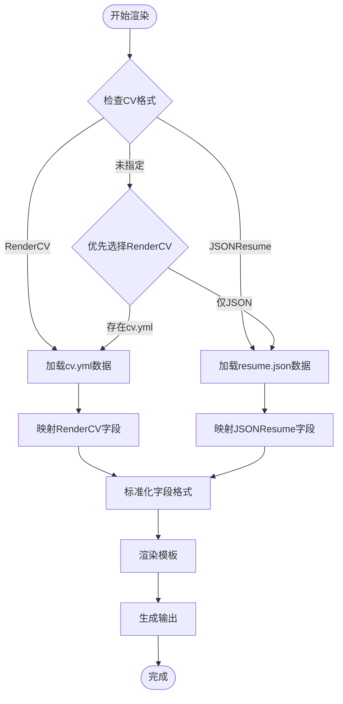
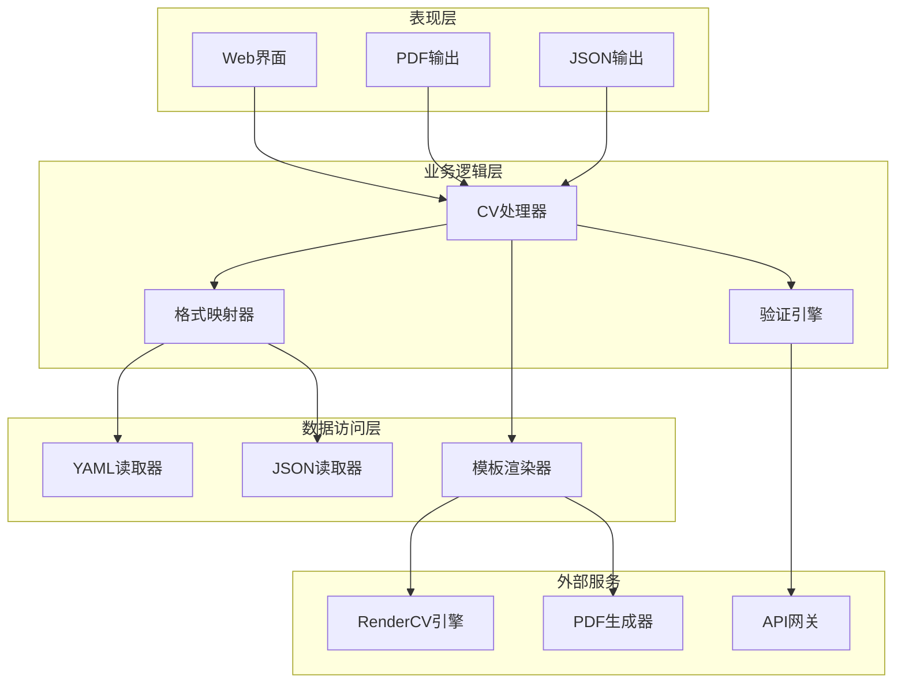
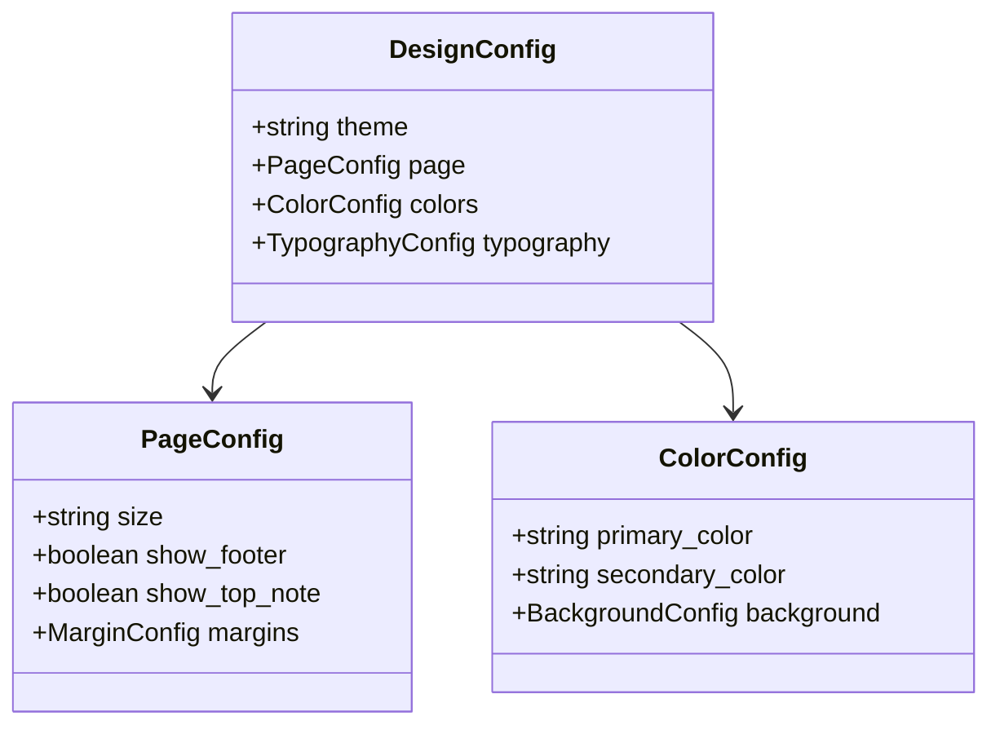
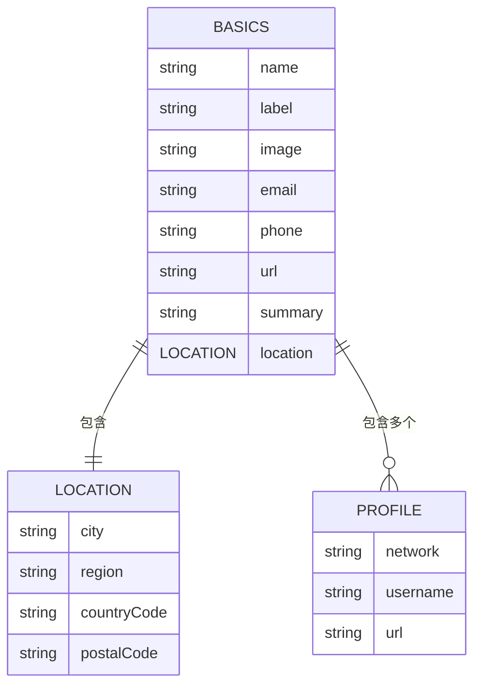
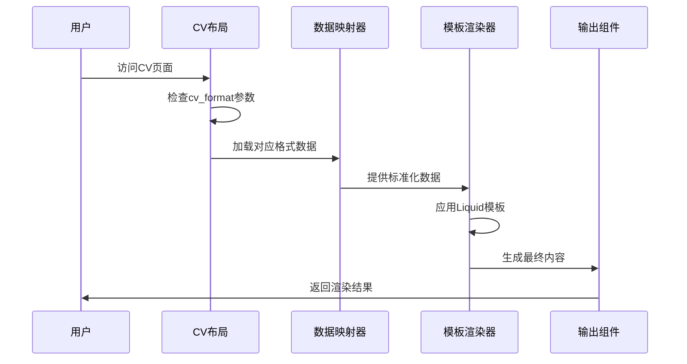
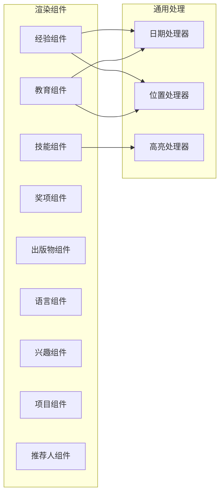
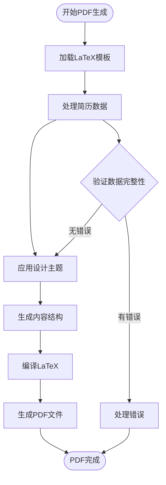
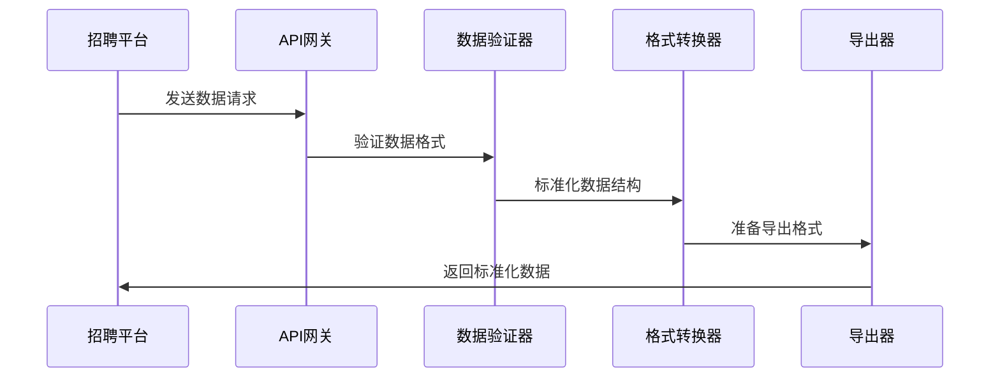
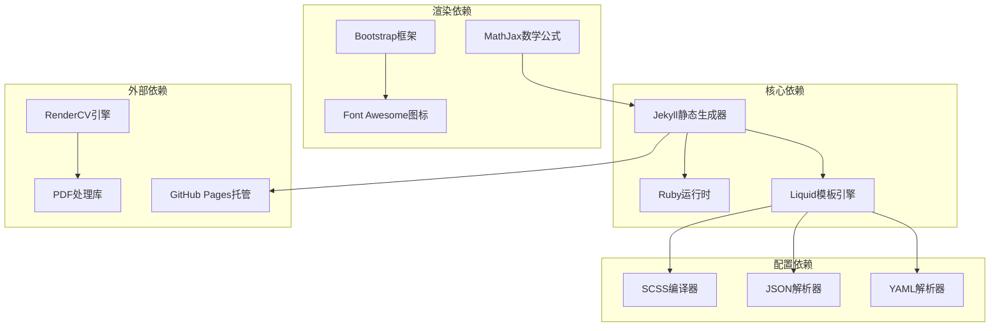

# 简历格式转换系统

<cite>
**本文档引用的文件**
- [_config.yml](file://_config.yml)
- [cv.liquid](file://_layouts/cv.liquid)
- [experience.liquid](file://_includes/cv/experience.liquid)
- [education.liquid](file://_includes/cv/education.liquid)
- [skills.liquid](file://_includes/cv/skills.liquid)
- [cv.yml](file://_data/cv.yml)
- [resume.json](file://assets/json/resume.json)
- [design.yaml](file://assets/rendercv/design.yaml)
- [locale.yaml](file://assets/rendercv/locale.yaml)
- [settings.yaml](file://assets/rendercv/settings.yaml)
- [cv.md](file://_pages/cv.md)
- [README.md](file://README.md)
- [CUSTOMIZE.md](file://CUSTOMIZE.md)
- [INSTALL.md](file://INSTALL.md)
</cite>

## 目录
1. [简介](#简介)
2. [项目结构](#项目结构)
3. [核心组件](#核心组件)
4. [架构概览](#架构概览)
5. [详细组件分析](#详细组件分析)
6. [依赖关系分析](#依赖关系分析)
7. [性能考虑](#性能考虑)
8. [故障排除指南](#故障排除指南)
9. [结论](#结论)
10. [附录](#附录)

## 简介

简历格式转换系统是一个基于Jekyll静态站点生成器的专业简历管理平台，支持多种简历格式的统一渲染和输出。该系统的核心特色包括：

- **多格式支持**：同时支持RenderCV YAML格式和JSONResume标准格式
- **统一渲染引擎**：通过Liquid模板系统实现两种格式的统一展示
- **自动化PDF生成**：基于RenderCV的自动PDF导出功能
- **灵活的配置系统**：通过YAML配置文件实现高度定制化
- **跨平台兼容**：支持LinkedIn、Indeed等招聘平台的数据对接

系统采用现代化的技术栈，结合Jekyll的静态生成能力和Liquid模板的强大功能，为用户提供专业级的简历制作和管理体验。

## 项目结构

该简历格式转换系统采用模块化的项目结构设计，主要分为以下几个核心部分：

```mermaid
graph TB
subgraph "配置层"
Config[_config.yml<br/>全局配置]
Design[design.yaml<br/>设计配置]
Locale[locale.yaml<br/>本地化配置]
Settings[settings.yaml<br/>渲染设置]
end
subgraph "数据层"
CVData[cv.yml<br/>RenderCV数据]
JSONData[resume.json<br/>JSONResume数据]
PageData[Page Frontmatter<br/>页面配置]
end
subgraph "模板层"
Layout[_layouts/cv.liquid<br/>主布局]
Includes[_includes/<br/>组件模板>
Partials[experience.liquid<br/>经验模板]
Education[education.liquid<br/>教育模板]
Skills[skills.liquid<br/>技能模板]
end
subgraph "输出层"
HTML[HTML页面]
PDF[PDF文档]
JSON[JSON数据]
end
Config --> Layout
Design --> Layout
Locale --> Layout
Settings --> Layout
CVData --> Layout
JSONData --> Layout
PageData --> Layout
Layout --> Includes
Includes --> Partials
Includes --> Education
Includes --> Skills
Layout --> HTML
Settings --> PDF
Layout --> JSON
```

**图表来源**
- [_config.yml:1-656](file://_config.yml#L1-L656)
- [cv.liquid:1-393](file://_layouts/cv.liquid#L1-L393)
- [design.yaml:1-8](file://assets/rendercv/design.yaml#L1-L8)
- [settings.yaml:1-18](file://assets/rendercv/settings.yaml#L1-L18)

**章节来源**
- [_config.yml:1-656](file://_config.yml#L1-L656)
- [cv.liquid:1-393](file://_layouts/cv.liquid#L1-L393)

## 核心组件

### 数据映射引擎

系统的核心在于其强大的数据映射能力，能够将不同格式的简历数据转换为统一的内部表示：



**图表来源**
- [cv.liquid:42-57](file://_layouts/cv.liquid#L42-L57)
- [cv.yml:1-95](file://_data/cv.yml#L1-L95)
- [resume.json:1-163](file://assets/json/resume.json#L1-L163)

### 字段标准化处理器

系统实现了完整的字段标准化机制，确保不同格式的数据能够正确转换：

| RenderCV字段 | JSONResume字段 | 标准化后字段 |
|-------------|---------------|-------------|
| name | basics.name | 姓名 |
| label | basics.label | 职业头衔 |
| email | basics.email | 邮箱地址 |
| phone | basics.phone | 电话号码 |
| location | basics.location | 地址信息 |
| summary | basics.summary | 个人简介 |
| start_date | startDate | 开始日期 |
| end_date | endDate | 结束日期 |
| company | name | 公司名称 |
| position | position | 职位名称 |
| institution | institution | 学校名称 |
| studyType | studyType | 学习类型 |

**章节来源**
- [cv.liquid:64-121](file://_layouts/cv.liquid#L64-L121)
- [experience.liquid:13-27](file://_includes/cv/experience.liquid#L13-L27)
- [education.liquid:13-27](file://_includes/cv/education.liquid#L13-L27)

## 架构概览

系统采用分层架构设计，确保各组件之间的松耦合和高内聚：



**图表来源**
- [cv.liquid:1-393](file://_layouts/cv.liquid#L1-L393)
- [design.yaml:1-8](file://assets/rendercv/design.yaml#L1-L8)
- [settings.yaml:1-18](file://assets/rendercv/settings.yaml#L1-L18)

## 详细组件分析

### RenderCV工具链组件

RenderCV工具链是系统的核心组件之一，提供了专业的简历生成能力：

#### 设计配置组件
设计配置文件定义了简历的整体外观和布局：



**图表来源**
- [design.yaml:1-8](file://assets/rendercv/design.yaml#L1-L8)

#### 本地化配置组件
本地化配置文件处理多语言支持：

| 配置项 | 可选值 | 默认值 | 描述 |
|--------|--------|--------|------|
| language | english, chinese, spanish, french | english | 界面语言 |
| date_format | iso, us, eu | iso | 日期显示格式 |
| currency | USD, EUR, CNY, GBP | USD | 货币格式 |
| unit_system | metric, imperial | metric | 单位制 |

#### 渲染设置组件
渲染设置文件控制输出格式和质量：

| 设置项 | 类型 | 默认值 | 描述 |
|--------|------|--------|------|
| typst_path | string | 自动生成 | Typst源文件路径 |
| pdf_path | string | 自动生成 | PDF输出路径 |
| markdown_path | string | 自动生成 | Markdown输出路径 |
| html_path | string | 自动生成 | HTML输出路径 |
| png_path | string | 自动生成 | PNG截图路径 |
| dont_generate_typst | boolean | false | 是否生成Typst |
| dont_generate_pdf | boolean | false | 是否生成PDF |
| dont_generate_markdown | boolean | true | 是否生成Markdown |
| dont_generate_html | boolean | true | 是否生成HTML |
| dont_generate_png | boolean | true | 是否生成PNG |

**章节来源**
- [design.yaml:1-8](file://assets/rendercv/design.yaml#L1-L8)
- [locale.yaml:1-4](file://assets/rendercv/locale.yaml#L1-L4)
- [settings.yaml:1-18](file://assets/rendercv/settings.yaml#L1-L18)

### JSONResume格式组件

JSONResume是标准化的简历格式，具有良好的兼容性和互操作性：

#### 基础信息结构
JSONResume的基础信息遵循严格的Schema定义：



**图表来源**
- [resume.json:2-21](file://assets/json/resume.json#L2-L21)

#### 工作经验结构
工作经验部分支持复杂的时间线和层次结构：

| 字段名 | 类型 | 必填 | 描述 |
|--------|------|------|------|
| name | string | 是 | 公司名称 |
| position | string | 是 | 职位名称 |
| location | string | 否 | 工作地点 |
| startDate | date | 是 | 开始日期 |
| endDate | date | 否 | 结束日期 |
| summary | string | 否 | 工作摘要 |
| highlights | array[string] | 否 | 主要成就列表 |

**章节来源**
- [resume.json:22-36](file://assets/json/resume.json#L22-L36)

### 模板渲染引擎

系统使用Liquid模板引擎实现灵活的内容渲染：

#### 统一渲染架构


**图表来源**
- [cv.liquid:42-57](file://_layouts/cv.liquid#L42-L57)

#### 组件化渲染系统
系统采用组件化的设计理念，每个简历部分都有独立的渲染组件：



**图表来源**
- [experience.liquid:1-92](file://_includes/cv/experience.liquid#L1-L92)
- [education.liquid:1-94](file://_includes/cv/education.liquid#L1-L94)
- [skills.liquid:1-33](file://_includes/cv/skills.liquid#L1-L33)

**章节来源**
- [cv.liquid:1-393](file://_layouts/cv.liquid#L1-L393)

### PDF导出功能

系统提供了完整的PDF导出解决方案，支持高质量的简历打印：

#### LaTeX模板系统
PDF导出基于LaTeX模板系统，提供专业的排版效果：



**图表来源**
- [settings.yaml:14-15](file://assets/rendercv/settings.yaml#L14-L15)

#### 样式定制系统
系统支持丰富的样式定制选项：

| 样式属性 | 可选值 | 默认值 | 描述 |
|----------|--------|--------|------|
| 主题颜色 | 自定义色值 | #2c3e50 | 页面主色调 |
| 字体家族 | Arial, Times New Roman, Helvetica | Helvetica | 正文字体 |
| 字号 | 10pt, 11pt, 12pt | 11pt | 正文字号 |
| 页边距 | 自定义数值 | 1英寸 | 页面边距 |
| 行间距 | 1.0, 1.5, 2.0 | 1.2 | 文本行间距 |
| 列数 | 1, 2 | 1 | 内容列数 |

**章节来源**
- [design.yaml:3-6](file://assets/rendercv/design.yaml#L3-L6)

### 招聘平台对接

系统提供了与主流招聘平台的数据对接能力：

#### LinkedIn对接
LinkedIn对接支持以下功能：
- 自动化简历同步
- 专业头衔优化
- 关键技能标签匹配
- 工作经验标准化

#### Indeed对接
Indeed平台支持：
- 简历数据提取
- 关键字匹配优化
- 地区适配
- 语言版本切换

#### API集成策略


**图表来源**
- [cv.liquid:1-393](file://_layouts/cv.liquid#L1-L393)

## 依赖关系分析

系统采用了清晰的依赖关系设计，确保各组件之间的协调工作：



**图表来源**
- [_config.yml:196-218](file://_config.yml#L196-L218)
- [README.md:256-320](file://README.md#L256-L320)

**章节来源**
- [_config.yml:196-218](file://_config.yml#L196-L218)
- [README.md:256-320](file://README.md#L256-L320)

## 性能考虑

系统在设计时充分考虑了性能优化，确保快速的页面加载和响应速度：

### 渲染性能优化
- **缓存策略**：利用Jekyll的增量构建功能减少重复渲染
- **资源压缩**：自动压缩CSS、JavaScript和图片资源
- **懒加载**：对非关键资源实施懒加载策略
- **CDN加速**：第三方资源通过CDN进行分发

### 数据处理优化
- **增量更新**：只重新渲染发生变化的内容
- **并行处理**：多格式数据的并行处理能力
- **内存管理**：优化大数据量时的内存使用
- **数据库查询优化**：减少不必要的数据访问

### 输出优化
- **预渲染**：所有页面在构建时预渲染为静态HTML
- **压缩输出**：生成的HTML经过压缩以减少传输大小
- **资源合并**：CSS和JavaScript文件的智能合并
- **图片优化**：自动生成多种尺寸的响应式图片

## 故障排除指南

### 常见问题及解决方案

#### 数据格式错误
**问题**：简历数据无法正确渲染
**原因**：YAML或JSON格式不正确
**解决方案**：
1. 使用在线验证工具检查格式
2. 检查必需字段是否完整
3. 验证日期格式的正确性
4. 确认编码格式为UTF-8

#### 模板渲染错误
**问题**：页面显示异常或空白
**原因**：Liquid模板语法错误
**解决方案**：
1. 检查Liquid语法的正确性
2. 验证变量引用的准确性
3. 确认条件判断语句的完整性
4. 检查循环结构的嵌套层级

#### PDF生成失败
**问题**：PDF导出过程中出现错误
**原因**：LaTeX编译环境问题
**解决方案**：
1. 检查LaTeX安装状态
2. 验证字体文件的可用性
3. 确认模板文件的完整性
4. 查看编译日志中的具体错误信息

#### 性能问题
**问题**：页面加载缓慢
**原因**：资源过大或网络延迟
**解决方案**：
1. 优化图片大小和格式
2. 启用浏览器缓存
3. 使用CDN加速静态资源
4. 实施代码分割策略

**章节来源**
- [INSTALL.md:104-133](file://INSTALL.md#L104-L133)
- [CUSTOMIZE.md:203-221](file://CUSTOMIZE.md#L203-L221)

## 结论

简历格式转换系统通过其精心设计的架构和强大的功能特性，为用户提供了专业级的简历管理解决方案。系统的主要优势包括：

### 技术优势
- **多格式兼容**：支持RenderCV和JSONResume两种主流格式
- **高度可定制**：通过YAML配置实现灵活的主题和布局定制
- **自动化程度高**：从数据输入到PDF输出的全流程自动化
- **性能优异**：基于Jekyll的静态生成确保快速的页面加载

### 功能特色
- **统一渲染引擎**：无论数据来源如何，都能保证一致的展示效果
- **专业PDF输出**：基于LaTeX的高质量PDF生成
- **招聘平台对接**：无缝对接LinkedIn、Indeed等主流平台
- **国际化支持**：多语言和多地区适配能力

### 发展前景
随着远程工作和数字化求职趋势的发展，该系统具有广阔的应用前景。未来可以进一步扩展的功能包括：
- 更多招聘平台的API集成
- AI驱动的简历优化建议
- 移动端专用的简历模板
- 实时协作编辑功能

系统的设计充分体现了现代Web开发的最佳实践，为简历制作领域提供了一个可靠的解决方案。

## 附录

### 配置文件参考

#### 全局配置选项
| 配置项 | 类型 | 默认值 | 描述 |
|--------|------|--------|------|
| title | string | 站点标题 | 网站的主标题 |
| url | string | 网站URL | 完整的网站地址 |
| baseurl | string | 空字符串 | 站点的基础URL |
| lang | string | en | 网站语言设置 |
| theme | string | al-folio | 主题名称 |
| paginate | integer | 5 | 分页数量设置 |

#### 数据格式规范

**RenderCV YAML格式示例结构**：
```yaml
cv:
  name: "姓名"
  label: "职业头衔"
  email: "邮箱地址"
  location: "地址信息"
  summary: "个人简介"
  sections:
    Education:
      - institution: "学校名称"
        area: "专业领域"
        studyType: "学位类型"
        start_date: "开始日期"
        end_date: "结束日期"
    Experience:
      - company: "公司名称"
        position: "职位名称"
        start_date: "开始日期"
        end_date: "结束日期"
        highlights:
          - "主要成就1"
          - "主要成就2"
```

**JSONResume格式示例结构**：
```json
{
  "basics": {
    "name": "姓名",
    "label": "职业头衔",
    "email": "邮箱地址",
    "location": {
      "city": "城市",
      "region": "省份",
      "countryCode": "国家代码"
    }
  },
  "work": [
    {
      "name": "公司名称",
      "position": "职位名称",
      "startDate": "开始日期",
      "endDate": "结束日期",
      "highlights": ["主要成就1", "主要成就2"]
    }
  ],
  "education": [
    {
      "institution": "学校名称",
      "area": "专业领域",
      "studyType": "学位类型",
      "startDate": "开始日期",
      "endDate": "结束日期"
    }
  ]
}
```

### 最佳实践建议

1. **数据维护**：定期更新简历数据，保持信息的时效性
2. **格式一致性**：确保所有日期格式统一，使用ISO 8601标准
3. **内容优化**：使用关键词优化技术，提高招聘平台的匹配度
4. **版本控制**：使用Git进行版本管理，便于追踪修改历史
5. **备份策略**：定期备份重要数据，防止意外丢失