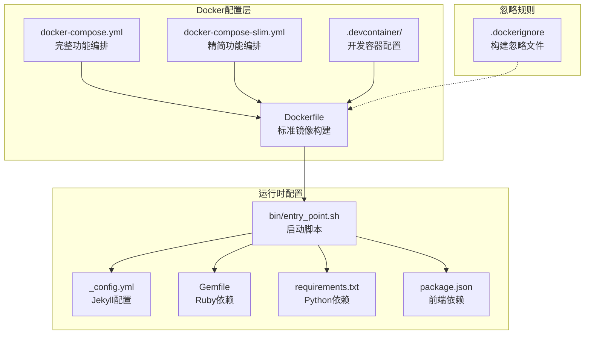
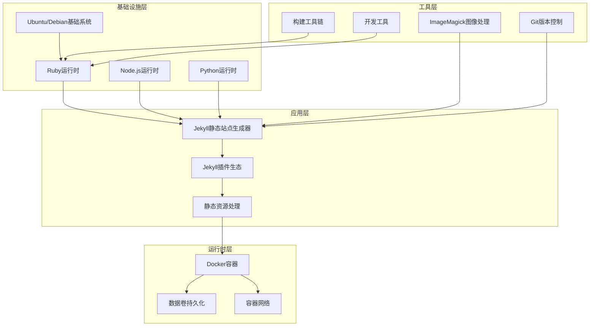
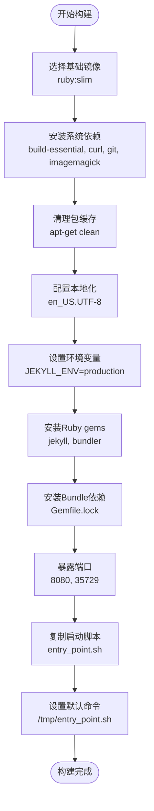
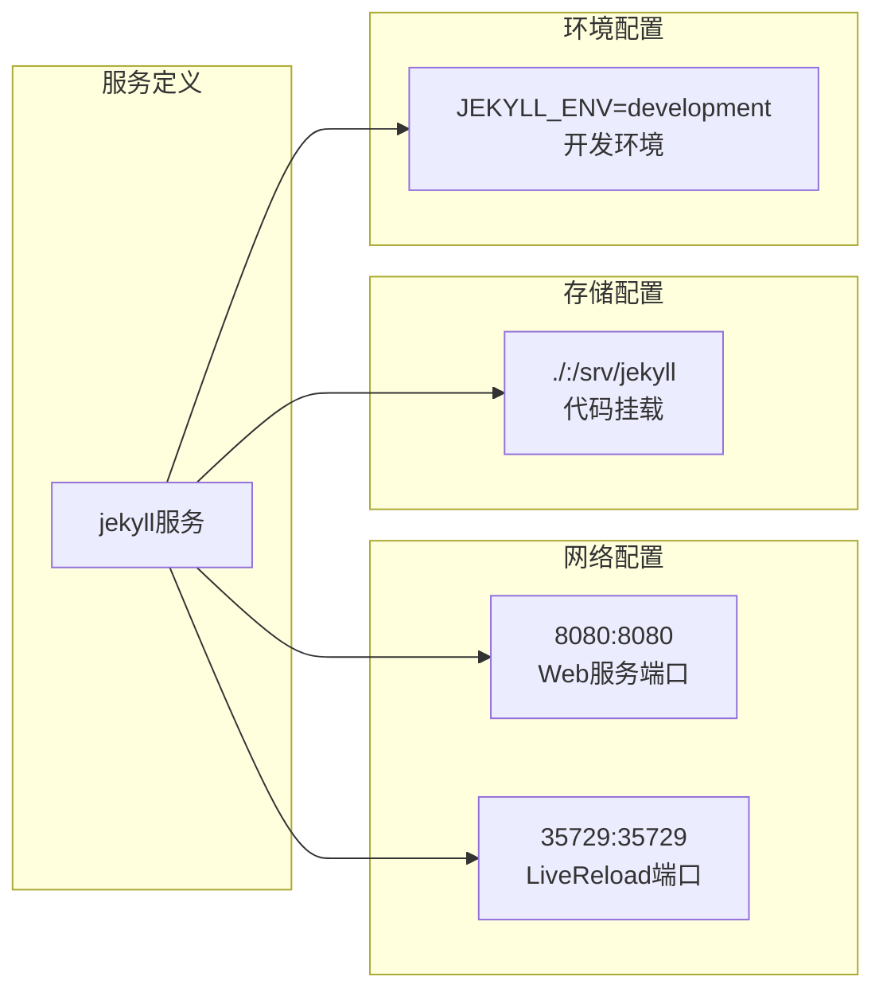
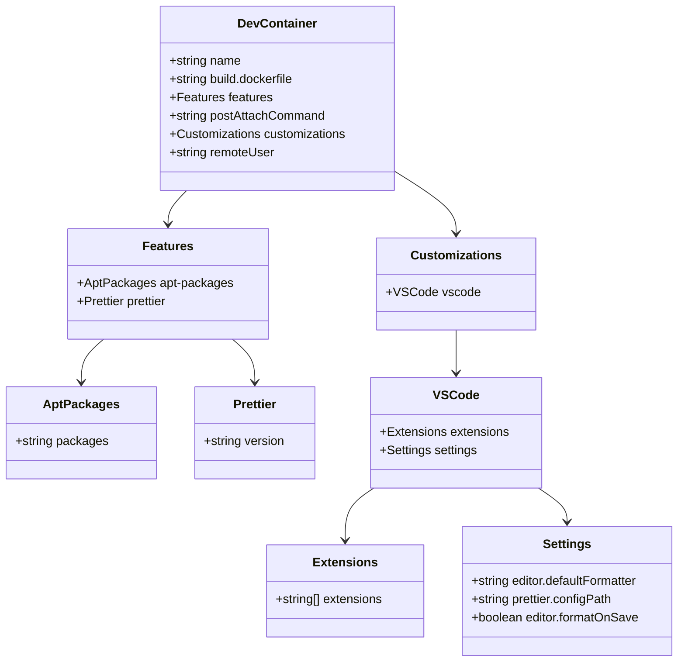
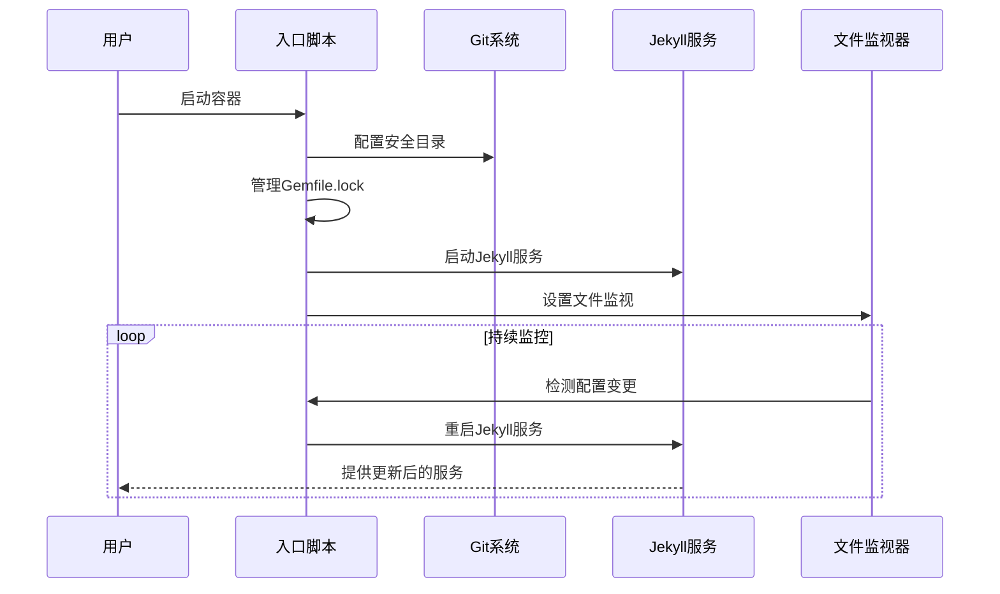
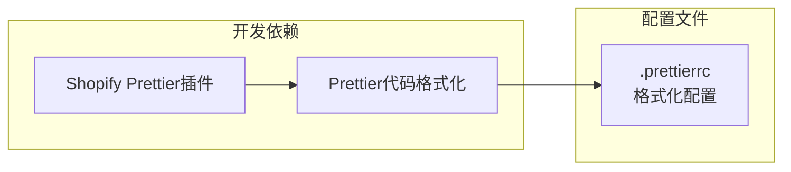
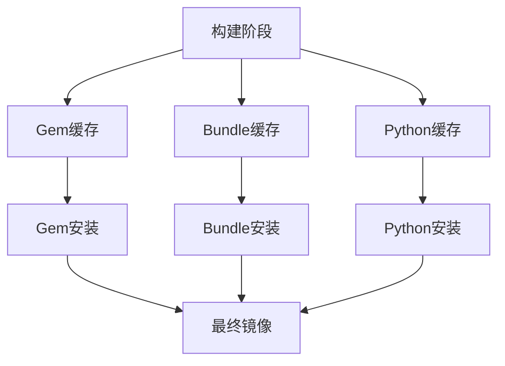

# Docker容器化部署

<cite>
**本文档中引用的文件**
- [Dockerfile](file://Dockerfile)
- [.dockerignore](file://.dockerignore)
- [docker-compose.yml](file://docker-compose.yml)
- [docker-compose-slim.yml](file://docker-compose-slim.yml)
- [.devcontainer/Dockerfile](file://.devcontainer/Dockerfile)
- [.devcontainer/devcontainer.json](file://.devcontainer/devcontainer.json)
- [bin/entry_point.sh](file://bin/entry_point.sh)
- [_config.yml](file://_config.yml)
- [Gemfile](file://Gemfile)
- [requirements.txt](file://requirements.txt)
- [package.json](file://package.json)
- [README.md](file://README.md)
</cite>

## 目录
1. [简介](#简介)
2. [项目结构](#项目结构)
3. [核心组件](#核心组件)
4. [架构概览](#架构概览)
5. [详细组件分析](#详细组件分析)
6. [依赖关系分析](#依赖关系分析)
7. [性能考虑](#性能考虑)
8. [故障排除指南](#故障排除指南)
9. [结论](#结论)

## 简介

本项目是一个基于Jekyll的学术个人网站模板（al-folio），提供了完整的Docker容器化部署解决方案。该系统支持多种部署模式，包括标准Docker镜像构建、精简版镜像构建、开发容器（devcontainer）集成以及多环境配置管理。

该容器化方案特别针对Jekyll静态站点生成器进行了优化，集成了Ruby生态系统、Node.js运行时、Python依赖以及图像处理工具，确保在容器环境中能够完整地构建和运行学术网站。

## 项目结构

该项目的Docker相关配置分布在多个关键文件中，形成了一个完整的容器化部署体系：

**图表来源**
- [Dockerfile:1-77](file://Dockerfile#L1-L77)
- [docker-compose.yml:1-22](file://docker-compose.yml#L1-L22)
- [docker-compose-slim.yml:1-13](file://docker-compose-slim.yml#L1-L13)
- [.devcontainer/Dockerfile:1-8](file://.devcontainer/Dockerfile#L1-L8)

**章节来源**
- [Dockerfile:1-77](file://Dockerfile#L1-L77)
- [docker-compose.yml:1-22](file://docker-compose.yml#L1-L22)
- [docker-compose-slim.yml:1-13](file://docker-compose-slim.yml#L1-L13)
- [.devcontainer/Dockerfile:1-8](file://.devcontainer/Dockerfile#L1-L8)

## 核心组件

### Docker镜像构建系统

项目提供了两种主要的镜像构建策略：

1. **标准镜像构建**：使用完整的Ruby生态系统，包含所有开发工具
2. **精简镜像构建**：使用预构建的基础镜像，减少构建时间

### 开发容器集成

通过devcontainer配置，实现了VS Code的无缝集成，提供了统一的开发环境体验。

### 多环境配置管理

支持开发、测试、生产的差异化配置，通过环境变量和配置文件实现灵活的环境切换。

**章节来源**
- [Dockerfile:1-77](file://Dockerfile#L1-L77)
- [.devcontainer/devcontainer.json:1-35](file://.devcontainer/devcontainer.json#L1-L35)

## 架构概览

整个容器化部署架构采用分层设计，从底层的基础镜像到顶层的应用服务：

**图表来源**
- [Dockerfile:22-40](file://Dockerfile#L22-L40)
- [Gemfile:1-42](file://Gemfile#L1-L42)
- [requirements.txt:1-5](file://requirements.txt#L1-L5)

## 详细组件分析

### Dockerfile构建流程

标准Dockerfile采用了多阶段构建的最佳实践：

**图表来源**
- [Dockerfile:10-76](file://Dockerfile#L10-L76)

#### 关键构建步骤分析

1. **基础镜像选择**：使用ruby:slim作为基础，平衡了功能完整性与镜像大小
2. **系统依赖管理**：精确安装Jekyll运行所需的系统级工具
3. **环境配置**：设置UTF-8本地化和Node.js运行时
4. **依赖安装**：分离Ruby gems和Python依赖的安装流程

**章节来源**
- [Dockerfile:1-77](file://Dockerfile#L1-L77)

### docker-compose编排配置

项目提供了两种编排配置文件，满足不同的使用场景：

#### 完整功能编排（docker-compose.yml）

**图表来源**
- [docker-compose.yml:15-22](file://docker-compose.yml#L15-L22)

#### 精简功能编排（docker-compose-slim.yml）

精简版本直接使用预构建的镜像，减少了本地构建需求：

| 配置项 | 标准版本 | 精简版本 |
|--------|----------|----------|
| 基础镜像 | 使用本地构建 | 使用预构建镜像 |
| 构建时间 | 较长 | 极短 |
| 依赖管理 | 本地安装 | 预装依赖 |
| 网络端口 | 8080, 35729 | 8080, 35729 |
| 存储挂载 | 挂载整个项目 | 挂载项目目录 |

**章节来源**
- [docker-compose.yml:1-22](file://docker-compose.yml#L1-L22)
- [docker-compose-slim.yml:1-13](file://docker-compose-slim.yml#L1-L13)

### 开发容器（DevContainer）配置

开发容器提供了VS Code的原生容器开发体验：

**图表来源**
- [.devcontainer/devcontainer.json:4-34](file://.devcontainer/devcontainer.json#L4-L34)

#### 开发容器特性

1. **系统包管理**：通过devcontainer features安装必要的开发工具
2. **IDE集成**：VS Code扩展自动配置
3. **格式化支持**：Prettier代码格式化集成
4. **自动启动**：容器启动后自动执行Jekyll服务

**章节来源**
- [.devcontainer/devcontainer.json:1-35](file://.devcontainer/devcontainer.json#L1-L35)
- [.devcontainer/Dockerfile:1-8](file://.devcontainer/Dockerfile#L1-L8)

### 启动脚本机制

入口脚本实现了智能的Jekyll服务管理和热重载功能：

**图表来源**
- [bin/entry_point.sh:22-37](file://bin/entry_point.sh#L22-L37)

#### 脚本核心功能

1. **Gemfile.lock管理**：根据Git跟踪状态智能处理锁定文件
2. **Jekyll服务启动**：配置详细的Jekyll参数进行开发模式运行
3. **热重载机制**：使用inotifywait实时监控配置文件变更
4. **进程管理**：优雅地重启Jekyll服务以应用配置更新

**章节来源**
- [bin/entry_point.sh:1-38](file://bin/entry_point.sh#L1-L38)

## 依赖关系分析

### Ruby生态系统依赖

项目使用Gemfile管理Jekyll插件生态：

```mermaid
graph TB
subgraph "核心插件"
Jekyll[Jekyll核心]
Feed[jekyll-feed]
Scholar[jekyll-scholar]
Minifier[jekyll-minifier]
end
subgraph "媒体处理"
Imagemagick[jekyll-imagemagick]
Twitter[jekyll-twitter-plugin]
Tabs[jekyll-tabs]
end
subgraph "增强功能"
Archives[jekyll-archives-v2]
Socials[jekyll-socials]
Cache[jekyll-cache-bust]
Email[jekyll-email-protect]
end
subgraph "第三方集成"
GetJson[jekyll-get-json]
RegexReplace[jekyll-regex-replace]
LinkAttributes[jekyll-link-attributes]
Toc[jekyll-toc]
end
Jekyll --> Feed
Jekyll --> Scholar
Jekyll --> Minifier
Jekyll --> Imagemagick
Jekyll --> Twitter
Jekyll --> Tabs
Jekyll --> Archives
Jekyll --> Socials
Jekyll --> Cache
Jekyll --> Email
Jekyll --> GetJson
Jekyll --> RegexReplace
Jekyll --> LinkAttributes
Jekyll --> Toc
```

**图表来源**
- [Gemfile:6-29](file://Gemfile#L6-L29)

### Python依赖管理

通过requirements.txt管理Python相关工具：

| 依赖包 | 版本要求 | 功能用途 |
|--------|----------|----------|
| nbconvert | 最新版本 | Jupyter Notebook转换 |
| pyyaml | 最新版本 | YAML文件处理 |
| rendercv[full] | 最新版本 | CV渲染工具 |
| scholarly | 最新版本 | 学术文献查询 |

**章节来源**
- [requirements.txt:1-5](file://requirements.txt#L1-L5)

### 前端依赖配置

package.json定义了开发时的前端工具链：

**图表来源**
- [package.json:2-5](file://package.json#L2-L5)

**章节来源**
- [package.json:1-7](file://package.json#L1-L7)

## 性能考虑

### 镜像优化策略

1. **多阶段构建**：利用apt-get清理减少镜像大小
2. **缓存优化**：合理安排依赖安装顺序以最大化Docker缓存效果
3. **精简基础**：使用ruby:slim基础镜像平衡功能与体积

### 运行时性能优化

1. **文件系统监控**：使用inotifywait实现高效的文件变更检测
2. **内存管理**：Jekyll生产环境配置优化
3. **并发处理**：支持多线程的Jekyll构建过程

### 缓存策略

## 故障排除指南

### 常见构建问题

1. **权限问题**：Dockerfile中包含了针对权限问题的注释和解决方案
2. **网络连接**：确保容器能够访问外部包源
3. **磁盘空间**：定期清理构建缓存和未使用的镜像

### 开发环境问题

1. **热重载失效**：检查inotifywait是否正确安装
2. **端口冲突**：确认8080和35729端口可用
3. **文件同步**：验证卷挂载路径正确性

### 生产环境考虑

1. **安全配置**：使用非root用户运行容器
2. **资源限制**：为容器设置CPU和内存限制
3. **健康检查**：添加容器健康检查机制

**章节来源**
- [Dockerfile:3-20](file://Dockerfile#L3-L20)
- [bin/entry_point.sh:8-20](file://bin/entry_point.sh#L8-L20)

## 结论

该Docker容器化部署方案为Jekyll学术网站提供了一个完整、可维护且高性能的解决方案。通过标准化的构建流程、灵活的编排配置和完善的开发工具集成，实现了从开发到生产的无缝衔接。

关键优势包括：
- **一致性**：确保开发、测试、生产环境的一致性
- **可移植性**：简化部署流程，降低环境配置复杂度
- **可扩展性**：支持自定义插件和主题的集成
- **可观测性**：内置热重载和文件监控机制

建议在实际部署中结合具体的业务需求，选择合适的镜像构建策略和编排配置，以获得最佳的性能和用户体验。