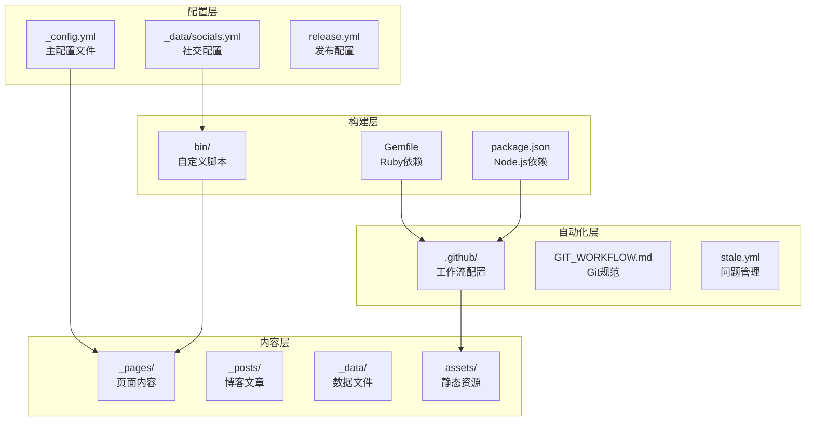
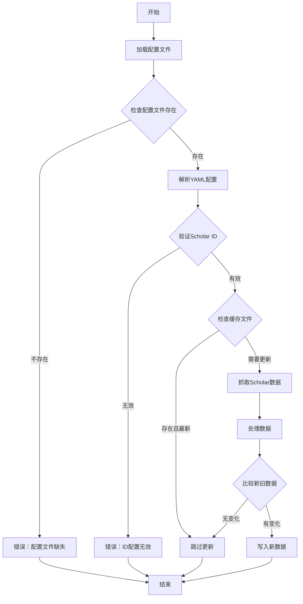
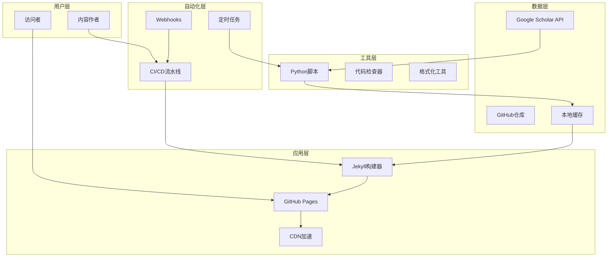
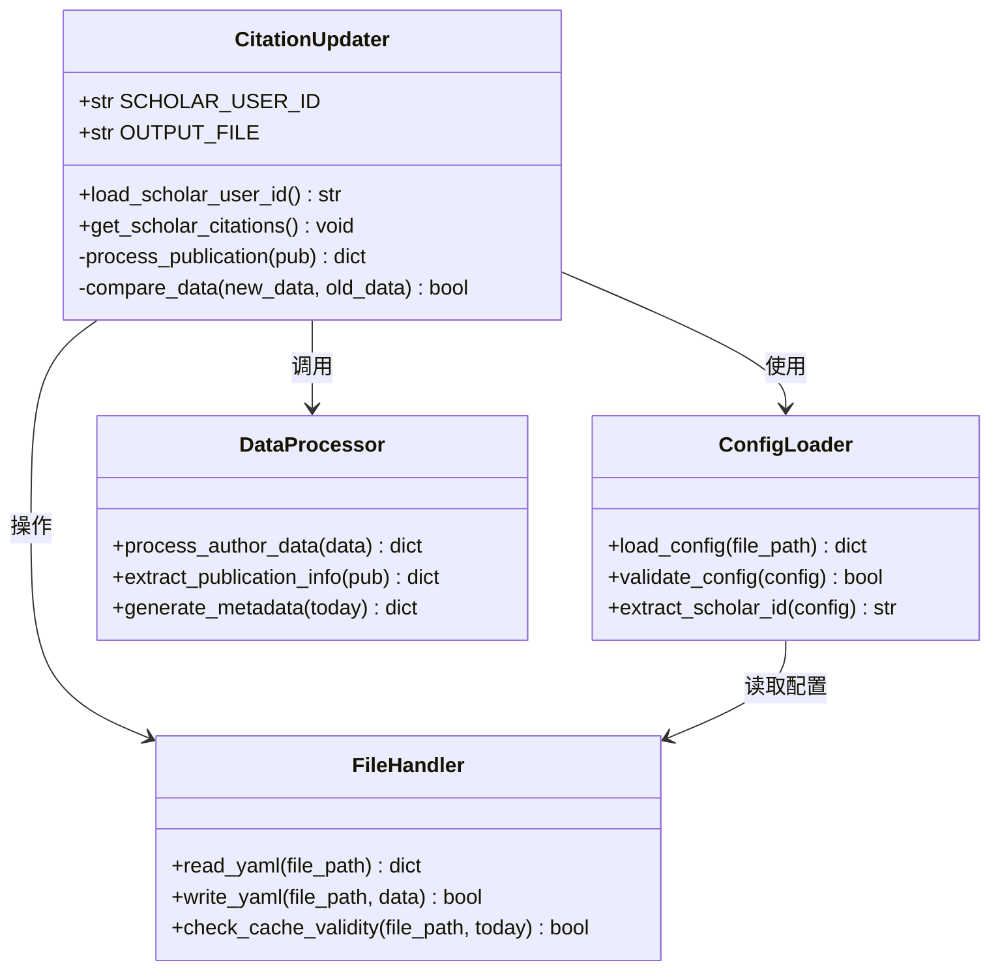
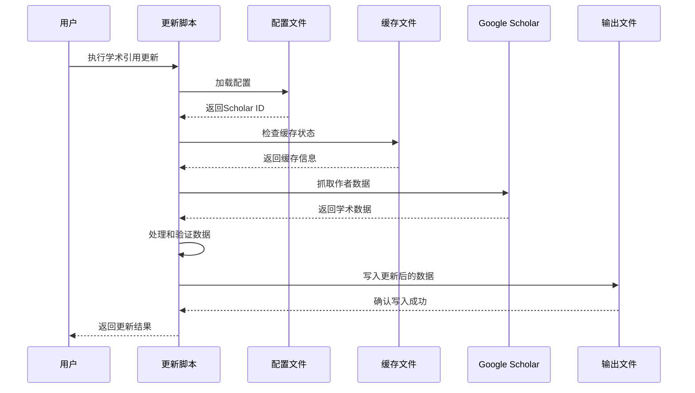
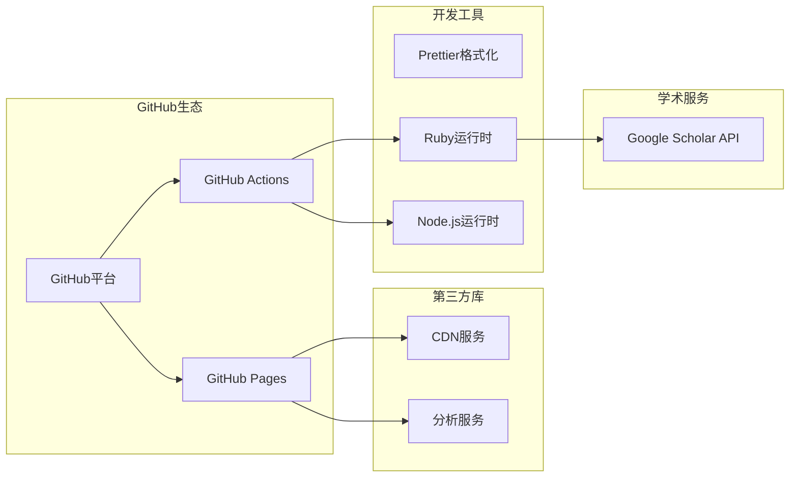
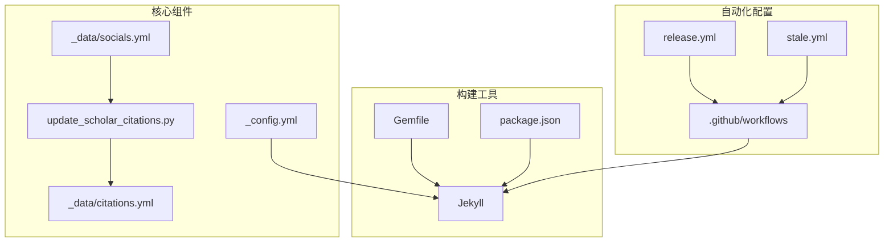

# GitHub Actions工作流

<cite>
**本文档中引用的文件**
- [.github/GIT_WORKFLOW.md](file://.github/GIT_WORKFLOW.md)
- [.github/release.yml](file://.github/release.yml)
- [.github/stale.yml](file://.github/stale.yml)
- [_config.yml](file://_config.yml)
- [Gemfile](file://Gemfile)
- [package.json](file://package.json)
- [bin/update_scholar_citations.py](file://bin/update_scholar_citations.py)
- [_data/socials.yml](file://_data/socials.yml)
- [_data/citations.yml](file://_data/citations.yml)
</cite>

## 目录
1. [简介](#简介)
2. [项目结构](#项目结构)
3. [核心组件](#核心组件)
4. [架构概览](#架构概览)
5. [详细组件分析](#详细组件分析)
6. [依赖分析](#依赖分析)
7. [性能考虑](#性能考虑)
8. [故障排除指南](#故障排除指南)
9. [结论](#结论)
10. [附录](#附录)

## 简介

本项目是一个基于Jekyll的个人学术主页，采用GitHub Pages进行静态网站托管。项目集成了多种自动化工具和服务，包括学术引用数据更新、代码格式化、以及CI/CD流水线管理。

该系统的核心目标是通过自动化流程实现：
- 自动化的学术引用数据更新和维护
- 代码质量和格式的自动化检查
- 静态网站的自动化构建和部署
- 版本管理和发布流程的标准化

## 项目结构

项目采用模块化组织方式，主要分为以下几个核心部分：

**图表来源**
- [_config.yml:1-656](file://_config.yml#L1-L656)
- [Gemfile:1-42](file://Gemfile#L1-L42)
- [package.json:1-7](file://package.json#L1-L7)

**章节来源**
- [_config.yml:1-656](file://_config.yml#L1-L656)
- [Gemfile:1-42](file://Gemfile#L1-L42)
- [package.json:1-7](file://package.json#L1-L7)

## 核心组件

### 学术引用管理系统

系统集成了Google Scholar数据抓取功能，通过Python脚本自动更新学术引用信息：

**图表来源**
- [bin/update_scholar_citations.py:1-133](file://bin/update_scholar_citations.py#L1-L133)

### 构建系统配置

项目使用Jekyll作为静态站点生成器，通过Gemfile管理Ruby插件依赖：

**章节来源**
- [Gemfile:1-42](file://Gemfile#L1-L42)
- [_config.yml:196-218](file://_config.yml#L196-L218)

### 代码质量保证

通过package.json集成Prettier和Liquid格式化工具，确保代码风格一致性：

**章节来源**
- [package.json:1-7](file://package.json#L1-L7)
- [.github/GIT_WORKFLOW.md:1-48](file://.github/GIT_WORKFLOW.md#L1-L48)

## 架构概览

系统采用分层架构设计，各层职责明确，便于维护和扩展：

**图表来源**
- [bin/update_scholar_citations.py:1-133](file://bin/update_scholar_citations.py#L1-L133)
- [_config.yml:1-656](file://_config.yml#L1-L656)

## 详细组件分析

### 学术引用更新脚本

#### 组件架构

**图表来源**
- [bin/update_scholar_citations.py:1-133](file://bin/update_scholar_citations.py#L1-L133)

#### 数据处理流程

**图表来源**
- [bin/update_scholar_citations.py:39-125](file://bin/update_scholar_citations.py#L39-L125)

#### 错误处理机制

脚本实现了多层次的错误处理策略：

1. **配置验证阶段**：检查配置文件存在性和完整性
2. **网络请求阶段**：设置超时和重试机制
3. **数据处理阶段**：逐条处理出版物，跳过有问题的条目
4. **文件操作阶段**：检查权限和磁盘空间

**章节来源**
- [bin/update_scholar_citations.py:1-133](file://bin/update_scholar_citations.py#L1-L133)

### 构建配置管理

#### Jekyll插件生态系统

项目使用了丰富的Jekyll插件来增强功能：

| 插件类别 | 插件名称 | 功能描述 |
|---------|---------|----------|
| 核心插件 | jekyll-scholar | 学术文献管理和引用处理 |
| 媒体处理 | jekyll-imagemagick | 图像响应式处理 |
| 性能优化 | jekyll-minifier | HTML/CSS/JavaScript压缩 |
| 社交功能 | jekyll-socials | 社交媒体集成 |
| 文档生成 | jekyll-sitemap | 站点地图生成 |

**章节来源**
- [Gemfile:6-29](file://Gemfile#L6-L29)
- [_config.yml:196-218](file://_config.yml#L196-L218)

#### 依赖管理策略

项目采用分组依赖管理：
- **jekyll_plugins组**：直接影响站点构建的核心插件
- **other_plugins组**：开发工具和外部数据获取插件

**章节来源**
- [Gemfile:31-41](file://Gemfile#L31-L41)

### 代码质量保证系统

#### Git工作流程规范

项目制定了严格的Git提交规范：

**提交类型定义**：
- `feat`: 新功能开发
- `fix`: Bug修复
- `docs`: 文档更新
- `style`: 代码格式调整
- `config`: 配置文件修改
- `chore`: 构建过程调整

**最佳实践**：
- 明确的提交消息格式
- 精确的文件添加策略
- 严格的内容排除规则

**章节来源**
- [.github/GIT_WORKFLOW.md:1-48](file://.github/GIT_WORKFLOW.md#L1-L48)

#### 自动化代码检查

通过Prettier集成Liquid模板格式化：

**功能特性**：
- 支持Liquid模板语法
- 自动代码格式化
- 提交前质量检查

**章节来源**
- [package.json:1-7](file://package.json#L1-L7)

## 依赖分析

### 外部服务依赖

**图表来源**
- [Gemfile:1-42](file://Gemfile#L1-L42)
- [package.json:1-7](file://package.json#L1-L7)

### 内部组件依赖

**图表来源**
- [_config.yml:1-656](file://_config.yml#L1-L656)
- [bin/update_scholar_citations.py:1-133](file://bin/update_scholar_citations.py#L1-L133)

**章节来源**
- [Gemfile:1-42](file://Gemfile#L1-L42)
- [package.json:1-7](file://package.json#L1-L7)

## 性能考虑

### 缓存策略

系统实现了多层缓存机制以提升性能：

1. **Scholar API缓存**：避免重复请求相同数据
2. **构建缓存**：利用GitHub Actions缓存机制
3. **浏览器缓存**：通过CDN和HTTP头优化

### 优化建议

- 实施增量构建策略
- 优化图像资源大小
- 启用Gzip压缩
- 使用CDN加速静态资源

## 故障排除指南

### 常见问题及解决方案

#### 学术引用更新失败

**问题症状**：
- 更新脚本退出码非零
- 学术数据未更新

**可能原因**：
- Google Scholar ID配置错误
- 网络连接不稳定
- API限制或临时故障

**解决步骤**：
1. 验证 `_data/socials.yml` 中的 `scholar_userid` 配置
2. 检查网络连接和防火墙设置
3. 查看脚本输出的详细错误信息
4. 等待一段时间后重试

#### 构建失败

**问题症状**：
- Jekyll构建过程中出现错误
- 页面显示异常

**可能原因**：
- Ruby版本不兼容
- 插件依赖冲突
- 配置文件语法错误

**解决步骤**：
1. 检查Ruby版本要求
2. 运行 `bundle install` 安装依赖
3. 验证 `_config.yml` 语法正确性
4. 清理缓存后重新构建

#### GitHub Pages部署问题

**问题症状**：
- 页面无法访问
- 部署状态显示失败

**可能原因**：
- 构建配置错误
- 权限设置问题
- 资源文件损坏

**解决步骤**：
1. 检查GitHub Actions日志
2. 验证域名和CNAME配置
3. 确认仓库权限设置
4. 重新触发部署流程

**章节来源**
- [bin/update_scholar_citations.py:10-33](file://bin/update_scholar_citations.py#L10-L33)
- [bin/update_scholar_citations.py:65-84](file://bin/update_scholar_citations.py#L65-L84)

### 调试技巧

#### 日志分析

1. **启用详细日志**：在构建脚本中增加调试输出
2. **分步执行**：将复杂流程分解为独立步骤
3. **环境隔离**：在独立环境中复现问题

#### 性能监控

1. **构建时间跟踪**：监控各阶段耗时
2. **资源使用分析**：检查内存和CPU使用情况
3. **缓存命中率**：评估缓存效果

## 结论

本项目展示了一个完整的学术主页自动化解决方案，通过精心设计的工作流和工具链实现了：

- **高度自动化的学术数据管理**
- **可靠的静态网站构建和部署**
- **严格的代码质量和版本控制流程**
- **可扩展的架构设计和维护策略**

系统的成功实施得益于清晰的组件分离、完善的错误处理机制，以及对开发者体验的重视。通过持续改进和优化，该系统能够满足学术主页的各种需求，并为其他类似项目提供有价值的参考。

## 附录

### 安全配置最佳实践

#### 密钥管理

- 使用GitHub Secrets存储敏感信息
- 实施最小权限原则
- 定期轮换密钥和凭据
- 避免在代码中硬编码敏感信息

#### 访问控制

- 限制仓库访问权限
- 实施分支保护规则
- 启用双重身份验证
- 定期审查权限设置

### 维护和升级

#### 依赖更新策略

- 定期检查和更新Ruby gems
- 监控Node.js包的安全更新
- 测试新版本的兼容性
- 制定回滚计划

#### 监控和告警

- 设置构建状态监控
- 实施错误日志聚合
- 配置性能指标监控
- 建立通知机制