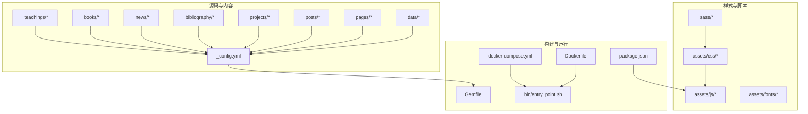
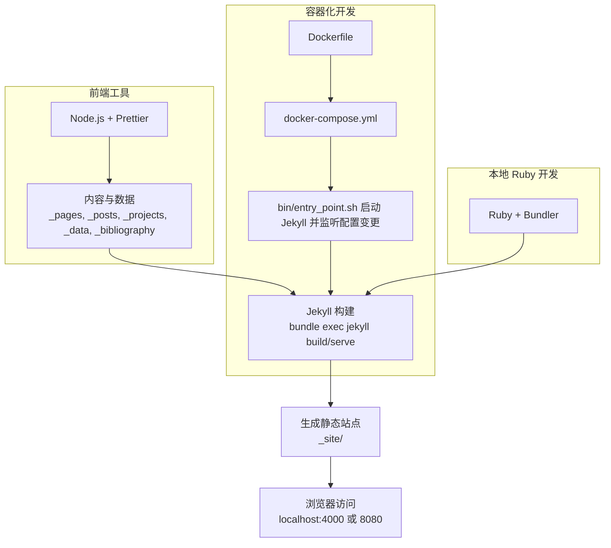
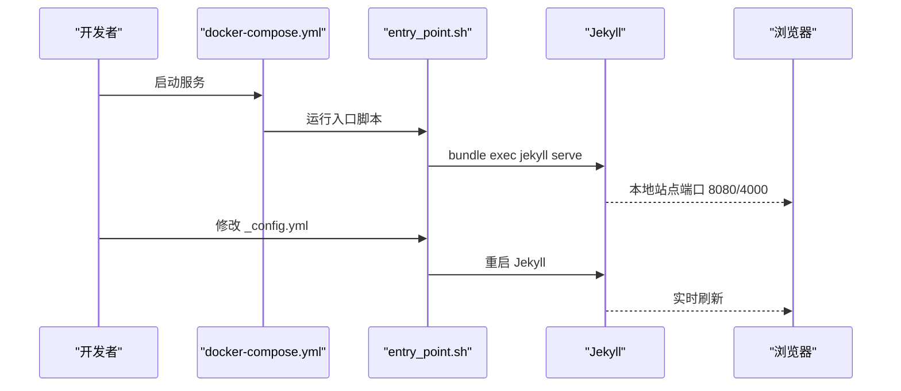
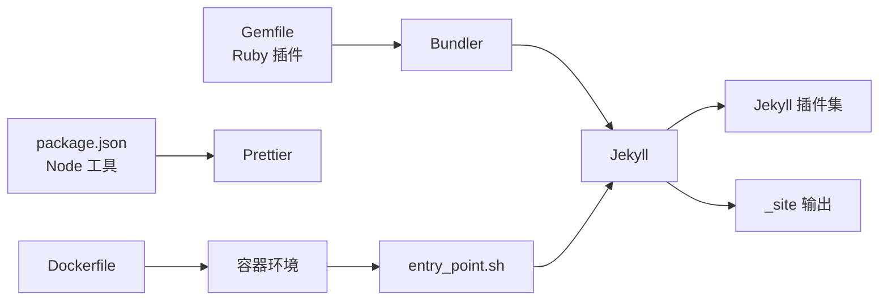

# 手动部署流程

<cite>
**本文引用的文件**
- [README.md](file://README.md)
- [INSTALL.md](file://INSTALL.md)
- [QUICKSTART.md](file://QUICKSTART.md)
- [_config.yml](file://_config.yml)
- [Gemfile](file://Gemfile)
- [package.json](file://package.json)
- [Dockerfile](file://Dockerfile)
- [docker-compose.yml](file://docker-compose.yml)
- [bin/entry_point.sh](file://bin/entry_point.sh)
- [FAQ.md](file://FAQ.md)
- [TROUBLESHOOTING.md](file://TROUBLESHOOTING.md)
- [CUSTOMIZE.md](file://CUSTOMIZE.md)
- [_data/navigation.yml](file://_data/navigation.yml)
- [_pages/about.md](file://_pages/about.md)
- [_projects/1_project.md](file://_projects/1_project.md)
- [_data/socials.yml](file://_data/socials.yml)
- [requirements.txt](file://requirements.txt)
</cite>

## 目录
1. [简介](#简介)
2. [项目结构](#项目结构)
3. [核心组件](#核心组件)
4. [架构总览](#架构总览)
5. [详细组件分析](#详细组件分析)
6. [依赖关系分析](#依赖关系分析)
7. [性能考虑](#性能考虑)
8. [故障排查指南](#故障排查指南)
9. [结论](#结论)
10. [附录](#附录)

## 简介
本指南面向需要在本地手动搭建与部署 al-folio 主题网站的用户，覆盖 Ruby、Node.js、Jekyll 等依赖的安装与配置；内容管理（页面编辑、数据文件更新、样式定制）；构建与预览（本地服务器启动、内容验证、性能检查）；不同操作系统的部署注意事项与兼容性；备份与恢复策略、版本升级操作；以及生产环境域名、SSL、CDN 等部署要点。

## 项目结构
该仓库采用 Jekyll 静态站点生成器，主题为 al-folio，使用 Ruby 生态（Jekyll 及插件）与 Node.js 工具链（Prettier、Jupyter Notebook 支持）。核心目录与文件包括：
- 配置：_config.yml、Gemfile、package.json、docker-compose.yml、Dockerfile
- 内容：_pages、_posts、_projects、_news、_books、_teachings、_bibliography、_data
- 样式：_sass、assets/css、assets/js、assets/fonts
- 构建与运行：bin/entry_point.sh、.github/workflows（CI/CD）
- 文档：README.md、INSTALL.md、QUICKSTART.md、CUSTOMIZE.md、FAQ.md、TROUBLESHOOTING.md

**图表来源**
- [Dockerfile:1-77](file://Dockerfile#L1-L77)
- [docker-compose.yml:1-22](file://docker-compose.yml#L1-L22)
- [Gemfile:1-42](file://Gemfile#L1-L42)
- [package.json:1-7](file://package.json#L1-L7)
- [_config.yml:1-656](file://_config.yml#L1-L656)

**章节来源**
- [README.md:294-320](file://README.md#L294-L320)
- [INSTALL.md:1-297](file://INSTALL.md#L1-L297)
- [CUSTOMIZE.md:99-141](file://CUSTOMIZE.md#L99-L141)

## 核心组件
- 配置系统：通过 _config.yml 控制站点标题、作者信息、URL、baseurl、功能开关、第三方集成（Analytics、评论、搜索）、集合与归档、插件列表等。
- Ruby 与 Jekyll：Gemfile 声明 Jekyll 核心插件与第三方工具；bundle 安装依赖后，使用 jekyll serve 或 jekyll build 进行本地预览或静态构建。
- Node.js 与前端工具：package.json 提供 Prettier 与 Liquid 格式化工具；用于代码风格与自动化。
- 容器化：Dockerfile 与 docker-compose.yml 提供一致的开发环境，支持热重载与端口映射。
- 数据与内容：_data 存放导航、社交、CV 等数据；_pages、_posts、_projects 等目录存放页面与集合内容。
- 样式与主题：_sass 与 assets/css 编译生成 CSS；字体与图标资源位于 assets/fonts 与 assets/css。

**章节来源**
- [_config.yml:1-656](file://_config.yml#L1-L656)
- [Gemfile:1-42](file://Gemfile#L1-L42)
- [package.json:1-7](file://package.json#L1-L7)
- [Dockerfile:1-77](file://Dockerfile#L1-L77)
- [docker-compose.yml:1-22](file://docker-compose.yml#L1-L22)

## 架构总览
下图展示从内容到静态产物的生成路径，以及容器化与本地开发两种运行方式：

**图表来源**
- [bin/entry_point.sh:1-38](file://bin/entry_point.sh#L1-L38)
- [docker-compose.yml:1-22](file://docker-compose.yml#L1-L22)
- [Dockerfile:1-77](file://Dockerfile#L1-L77)
- [Gemfile:1-42](file://Gemfile#L1-L42)
- [package.json:1-7](file://package.json#L1-L7)

## 详细组件分析

### 本地开发环境搭建（Ruby、Node.js、Jekyll）
- 使用 Docker（推荐）
  - 安装 Docker 与 docker-compose
  - 拉取镜像并启动服务：docker compose pull && docker compose up
  - 访问 http://localhost:8080 查看站点；修改内容实时刷新
  - 如需调试，进入容器执行脚本 ./bin/entry_point.sh 或 bundle install
- 使用本地 Ruby（不推荐，易出现依赖差异）
  - 安装 Ruby、Bundler、Python 与 pip
  - 安装 Jupyter（pip install jupyter）
  - bundle install 安装 Ruby 插件
  - bundle exec jekyll serve 启动本地服务器（默认端口 4000）

**章节来源**
- [INSTALL.md:70-152](file://INSTALL.md#L70-L152)
- [Dockerfile:22-66](file://Dockerfile#L22-L66)
- [docker-compose.yml:15-22](file://docker-compose.yml#L15-L22)
- [bin/entry_point.sh:22-37](file://bin/entry_point.sh#L22-L37)
- [Gemfile:1-42](file://Gemfile#L1-L42)
- [requirements.txt:1-5](file://requirements.txt#L1-L5)

### 内容管理与配置修改
- 基础配置
  - 在 _config.yml 中设置 title、first_name、last_name、url、baseurl 等
  - 个人站点 baseurl 留空；项目站点 baseurl 设置为仓库名
- 页面与集合
  - 新增页面：在 _pages 下创建 Markdown 文件，设置 layout、permalink 等 front matter
  - 新增博客文章：在 _posts 下按 YYYY-MM-DD-title.md 命名
  - 新增项目：在 _projects 下创建 Markdown 文件
  - 新增新闻：在 _news 下创建 Markdown 文件
  - 新增书籍/教学等集合：参考 CUSTOMIZE.md 的集合章节
- 数据文件
  - 导航菜单：_data/navigation.yml
  - 社交链接：_data/socials.yml
  - CV 数据：_data/cv.yml 或 assets/json/resume.json
  - 仓库信息：_data/repositories.yml
- 样式定制
  - 修改主题颜色与变量：_sass/_variables.scss
  - 自定义布局与组件：_sass 下对应文件（如 _blog.scss、_components.scss）
  - 全局样式入口：assets/css/main.scss

**章节来源**
- [_config.yml:5-25](file://_config.yml#L5-L25)
- [CUSTOMIZE.md:410-430](file://CUSTOMIZE.md#L410-L430)
- [_pages/about.md:1-39](file://_pages/about.md#L1-L39)
- [_projects/1_project.md:1-21](file://_projects/1_project.md#L1-L21)
- [_data/navigation.yml:1-24](file://_data/navigation.yml#L1-L24)
- [_data/socials.yml:1-6](file://_data/socials.yml#L1-L6)

### 构建与预览流程
- 本地预览（Docker）
  - docker compose up 启动后访问 http://localhost:8080
  - 修改 _config.yml 时，entry_point.sh 监听并自动重启 Jekyll
- 本地预览（Ruby）
  - bundle exec jekyll serve（默认端口 4000），修改内容即时刷新
- 静态构建
  - bundle exec jekyll build 生成 _site/ 目录
  - 可选：purgecss -c purgecss.config.js 清理未使用的 CSS

**图表来源**
- [docker-compose.yml:15-22](file://docker-compose.yml#L15-L22)
- [bin/entry_point.sh:22-37](file://bin/entry_point.sh#L22-L37)

**章节来源**
- [INSTALL.md:70-152](file://INSTALL.md#L70-L152)
- [bin/entry_point.sh:22-37](file://bin/entry_point.sh#L22-L37)

### 不同操作系统部署注意事项
- Windows
  - 强烈建议使用 WSL2 安装 Docker，避免原生 Docker 的兼容问题
- macOS
  - M1/M2 芯片需确保 Docker 版本兼容
- Linux
  - 若遇到权限问题，将当前用户加入 docker 组并重新登录

**章节来源**
- [INSTALL.md:66-69](file://INSTALL.md#L66-L69)
- [TROUBLESHOOTING.md:101-105](file://TROUBLESHOOTING.md#L101-L105)

### 备份与恢复策略
- 备份范围
  - 源码与内容：_pages、_posts、_projects、_data、_bibliography、_config.yml、Gemfile、package.json
  - 样式与资源：_sass、assets/css、assets/js、assets/fonts
- 恢复步骤
  - 恢复上述文件至新工作区
  - Docker 环境：docker compose up
  - 本地 Ruby 环境：bundle install && bundle exec jekyll serve
- 版本升级
  - 通过 git remote add upstream && git fetch upstream && git rebase 升级
  - 若冲突较多，可重新克隆模板并手工迁移内容

**章节来源**
- [INSTALL.md:281-296](file://INSTALL.md#L281-L296)
- [FAQ.md:81-101](file://FAQ.md#L81-L101)

### 生产环境部署要点
- GitHub Pages（推荐）
  - 设置 Settings -> Pages 源为 gh-pages 分支
  - Actions 工作流自动部署，首次提交后约 4 分钟完成
  - 自定义域名：在仓库根添加 CNAME 文件，写入域名
- 手动部署
  - 本地构建后将 _site/ 内容复制到托管服务器
  - 可选：运行 purgecss 清理未使用 CSS
- SSL 与 CDN
  - GitHub Pages 默认启用 HTTPS；自定义域名需在 DNS 添加 CNAME
  - CDN 可在自有服务器或云服务商上配置，注意缓存与静态资源路径

**章节来源**
- [INSTALL.md:154-226](file://INSTALL.md#L154-L226)
- [QUICKSTART.md:35-64](file://QUICKSTART.md#L35-L64)
- [FAQ.md:35-38](file://FAQ.md#L35-L38)

## 依赖关系分析
Jekyll 构建链路中各组件的耦合与依赖如下：

**图表来源**
- [Gemfile:1-42](file://Gemfile#L1-L42)
- [package.json:1-7](file://package.json#L1-L7)
- [Dockerfile:1-77](file://Dockerfile#L1-L77)
- [bin/entry_point.sh:1-38](file://bin/entry_point.sh#L1-L38)

**章节来源**
- [Gemfile:1-42](file://Gemfile#L1-L42)
- [package.json:1-7](file://package.json#L1-L7)
- [Dockerfile:1-77](file://Dockerfile#L1-L77)

## 性能考虑
- 图片优化：启用响应式 WebP 图像（imagemagick），减少带宽占用
- 代码压缩：启用 jekyll-minifier 与 terser 压缩 HTML/CSS/JS
- 清理未用 CSS：构建后运行 purgecss
- 搜索与懒加载：合理开启搜索与图片懒加载，平衡体验与性能
- 构建缓存：Docker 环境下持久化依赖以减少重复安装时间

**章节来源**
- [_config.yml:350-396](file://_config.yml#L350-L396)
- [_config.yml:233-244](file://_config.yml#L233-L244)

## 故障排查指南
- 部署失败
  - 检查 Actions 日志；确认 Settings -> Pages 源为 gh-pages
  - 确认 _config.yml 的 url/baseurl 正确
- 自定义域名无效
  - 在仓库根添加 CNAME 文件，写入域名
- 本地构建报错
  - Docker：docker compose pull && docker compose up --build
  - Ruby：删除 Gemfile.lock，bundle update，bundle install
- CSS/JS 加载异常
  - 清除浏览器缓存或使用隐私窗口访问
  - 检查 baseurl 是否为空（个人站点）或与仓库名一致（项目站点）
- 相关文章功能异常
  - 检查 classifier-reborn 插件依赖是否齐全；必要时禁用相关功能

**章节来源**
- [TROUBLESHOOTING.md:36-84](file://TROUBLESHOOTING.md#L36-L84)
- [FAQ.md:31-61](file://FAQ.md#L31-L61)

## 结论
通过 Docker 容器化或本地 Ruby 环境，结合 Jekyll 与 Node 工具链，可快速搭建与部署 al-folio 站点。遵循 _config.yml 的配置规范、合理组织 _pages/_posts/_projects 等内容与 _data 数据文件，并利用样式与脚本定制主题外观，即可实现个性化学术主页。生产环境优先选择 GitHub Pages，配合自定义域名与 HTTPS，确保稳定与安全。

## 附录

### 快速开始清单
- 创建仓库（使用模板而非 Fork）
- 配置 Actions 权限
- 更新 _config.yml（title、name、url、baseurl）
- 预览站点（Docker 或 Ruby）
- 推送触发自动部署

**章节来源**
- [QUICKSTART.md:22-64](file://QUICKSTART.md#L22-L64)