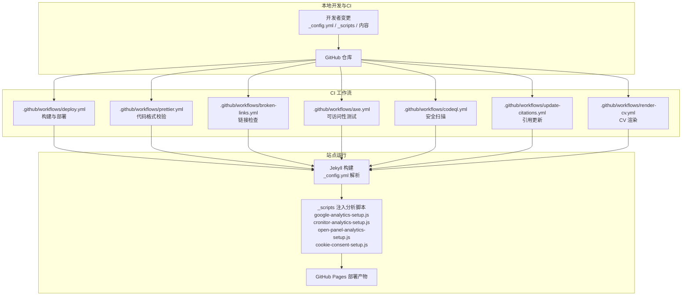
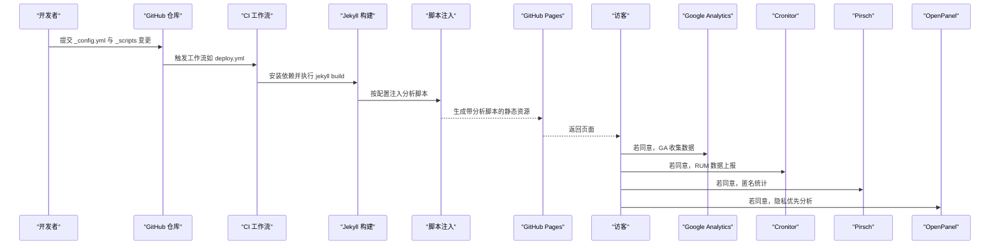
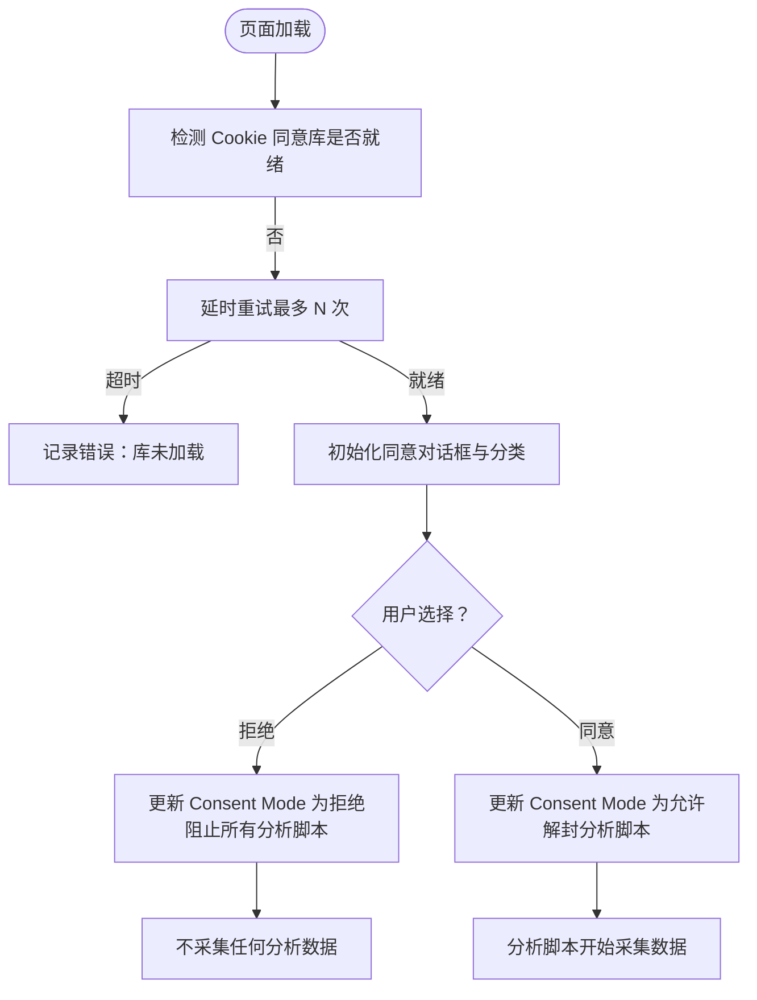
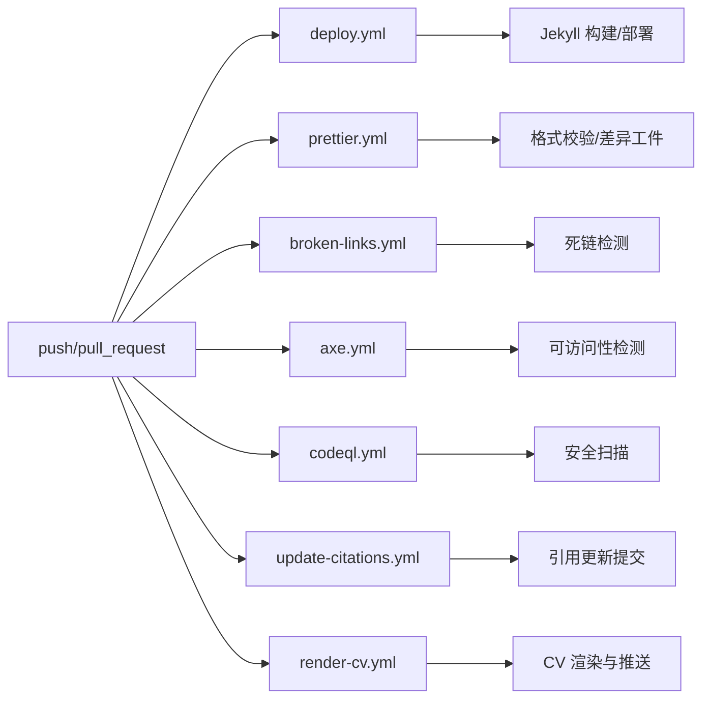
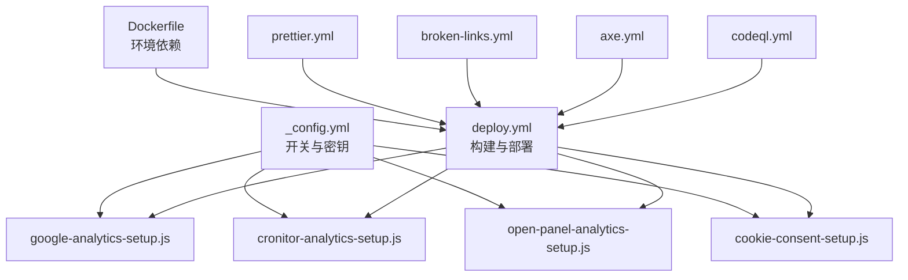

# 监控和维护

<cite>
**本文引用的文件**
- [ANALYTICS.md](file://ANALYTICS.md)
- [_config.yml](file://_config.yml)
- [google-analytics-setup.js](file://_scripts/google-analytics-setup.js)
- [cronitor-analytics-setup.js](file://_scripts/cronitor-analytics-setup.js)
- [open-panel-analytics-setup.js](file://_scripts/open-panel-analytics-setup.js)
- [cookie-consent-setup.js](file://_scripts/cookie-consent-setup.js)
- [deploy.yml](file://.github/workflows/deploy.yml)
- [prettier.yml](file://.github/workflows/prettier.yml)
- [broken-links.yml](file://.github/workflows/broken-links.yml)
- [axe.yml](file://.github/workflows/axe.yml)
- [codeql.yml](file://.github/workflows/codeql.yml)
- [update-citations.yml](file://.github/workflows/update-citations.yml)
- [render-cv.yml](file://.github/workflows/render-cv.yml)
- [Dockerfile](file://Dockerfile)
- [README.md](file://README.md)
- [TROUBLESHOOTING.md](file://TROUBLESHOOTING.md)
</cite>

## 目录
1. [简介](#简介)
2. [项目结构](#项目结构)
3. [核心组件](#核心组件)
4. [架构总览](#架构总览)
5. [详细组件分析](#详细组件分析)
6. [依赖关系分析](#依赖关系分析)
7. [性能考量](#性能考量)
8. [故障排查指南](#故障排查指南)
9. [结论](#结论)
10. [附录](#附录)

## 简介
本文件面向网站监控与维护系统，围绕 al-folio 主题在 GitHub Pages 上的部署与运维，系统化梳理以下方面：
- 分析脚本的集成与配置：Google Analytics、Cronitor、Pirsch、OpenPanel
- 网站性能监控、访问统计、用户行为分析
- 日志与错误追踪：前端 JavaScript 错误监控、服务端日志管理
- 健康检查、可用性监控、性能指标跟踪
- 备份策略、数据恢复、安全监控
- 自动化告警与故障响应机制
- 维护窗口规划与变更管理最佳实践

## 项目结构
该站点基于 Jekyll 静态生成，通过 GitHub Actions 实现自动化构建与部署；分析与监控能力通过配置项与脚本注入实现，同时辅以多类工作流保障质量与安全。

图表来源
- [deploy.yml:1-106](file://.github/workflows/deploy.yml#L1-L106)
- [_config.yml:70-88](file://_config.yml#L70-L88)
- [google-analytics-setup.js:1-10](file://_scripts/google-analytics-setup.js#L1-L10)
- [cronitor-analytics-setup.js:1-10](file://_scripts/cronitor-analytics-setup.js#L1-L10)
- [open-panel-analytics-setup.js:1-15](file://_scripts/open-panel-analytics-setup.js#L1-L15)
- [cookie-consent-setup.js:1-161](file://_scripts/cookie-consent-setup.js#L1-L161)

章节来源
- [README.md:313-320](file://README.md#L313-L320)
- [_config.yml:70-88](file://_config.yml#L70-L88)

## 核心组件
- 配置中心：通过 _config.yml 开启/关闭分析与验证功能，并注入第三方服务密钥或站点标识。
- 分析脚本注入：在 _scripts 中提供各分析平台初始化脚本，Jekyll 构建时按配置注入到页面。
- Cookie 同意与隐私模式：统一的 Cookie 同意对话框与 Google Consent Mode，确保合规与最小化数据收集。
- CI 工作流：自动化构建、格式校验、链接检查、可访问性测试、安全扫描、引用与 CV 自动化。

章节来源
- [_config.yml:70-88](file://_config.yml#L70-L88)
- [ANALYTICS.md:1-187](file://ANALYTICS.md#L1-L187)
- [cookie-consent-setup.js:1-161](file://_scripts/cookie-consent-setup.js#L1-L161)

## 架构总览
下图展示从配置到页面渲染、再到分析与监控的整体链路。

图表来源
- [deploy.yml:70-106](file://.github/workflows/deploy.yml#L70-L106)
- [_config.yml:70-88](file://_config.yml#L70-L88)
- [google-analytics-setup.js:1-10](file://_scripts/google-analytics-setup.js#L1-L10)
- [cronitor-analytics-setup.js:1-10](file://_scripts/cronitor-analytics-setup.js#L1-L10)
- [open-panel-analytics-setup.js:1-15](file://_scripts/open-panel-analytics-setup.js#L1-L15)
- [cookie-consent-setup.js:1-161](file://_scripts/cookie-consent-setup.js#L1-L161)

## 详细组件分析

### 分析平台集成与配置
- Google Analytics
  - 在 _config.yml 中启用开关与配置 Measurement ID；构建时注入初始化脚本。
  - 建议配合 Cookie 同意与隐私模式，确保合规。
- Cronitor
  - 用于站点可用性监控与 RUM（真实用户监控）；需在 _config.yml 中配置 Site ID。
- Pirsch
  - GDPR 合规、欧洲服务器、免 Cookie 横幅；配置 Site ID 即可启用。
- OpenPanel
  - 开源、可自托管、隐私优先；配置 Client ID 启用。

章节来源
- [ANALYTICS.md:41-177](file://ANALYTICS.md#L41-L177)
- [_config.yml:70-88](file://_config.yml#L70-L88)
- [google-analytics-setup.js:1-10](file://_scripts/google-analytics-setup.js#L1-L10)
- [cronitor-analytics-setup.js:1-10](file://_scripts/cronitor-analytics-setup.js#L1-L10)
- [open-panel-analytics-setup.js:1-15](file://_scripts/open-panel-analytics-setup.js#L1-L15)

### Cookie 同意与隐私模式
- 采用 Vanilla Cookie Consent 对 Analytics 类脚本进行延迟加载与分类控制。
- 使用 Google Consent Mode 在未获得同意前，以隐私模式处理 GA 请求。
- 用户可在同意后，自动解封支持的数据类别，避免重复定义全局函数。

图表来源
- [cookie-consent-setup.js:1-161](file://_scripts/cookie-consent-setup.js#L1-L161)

章节来源
- [cookie-consent-setup.js:1-161](file://_scripts/cookie-consent-setup.js#L1-L161)
- [ANALYTICS.md:146-166](file://ANALYTICS.md#L146-L166)

### CI/CD 与质量保障
- 部署工作流：安装 Ruby/Python/Imagemagick，构建生产环境站点，清理未使用 CSS，部署到 gh-pages。
- 代码格式：Prettier 强制格式检查，失败时生成差异文件并上传工件。
- 链接检查：使用 lychee 检测死链，排除特定路径。
- 可访问性：axe CLI 在本地 HTTP 服务上运行，检测无障碍问题。
- 安全扫描：CodeQL 扫描 JavaScript 与 Ruby 源码。
- 引用更新：定时抓取 Google Scholar 引用，必要时提交更新。
- CV 渲染：根据 RenderCV 配置与数据文件渲染输出并推送。

图表来源
- [deploy.yml:1-106](file://.github/workflows/deploy.yml#L1-L106)
- [prettier.yml:1-49](file://.github/workflows/prettier.yml#L1-L49)
- [broken-links.yml:1-55](file://.github/workflows/broken-links.yml#L1-L55)
- [axe.yml:1-75](file://.github/workflows/axe.yml#L1-L75)
- [codeql.yml:1-95](file://.github/workflows/codeql.yml#L1-L95)
- [update-citations.yml:1-102](file://.github/workflows/update-citations.yml#L1-L102)
- [render-cv.yml:1-59](file://.github/workflows/render-cv.yml#L1-L59)

章节来源
- [deploy.yml:70-106](file://.github/workflows/deploy.yml#L70-L106)
- [prettier.yml:14-49](file://.github/workflows/prettier.yml#L14-L49)
- [broken-links.yml:42-55](file://.github/workflows/broken-links.yml#L42-L55)
- [axe.yml:22-75](file://.github/workflows/axe.yml#L22-L75)
- [codeql.yml:22-95](file://.github/workflows/codeql.yml#L22-L95)
- [update-citations.yml:10-102](file://.github/workflows/update-citations.yml#L10-L102)
- [render-cv.yml:10-59](file://.github/workflows/render-cv.yml#L10-L59)

### 性能监控与指标跟踪
- 页面性能：建议结合 Lighthouse 结果与浏览器性能面板进行分析。
- 分析平台指标：
  - Google Analytics：访问量、用户画像、转化路径。
  - Cronitor：站点可用性、RUM 指标（加载时间、交互延迟）。
  - Pirsch/OpenPanel：匿名统计与隐私合规。

章节来源
- [ANALYTICS.md:128-177](file://ANALYTICS.md#L128-L177)
- [README.md:236-248](file://README.md#L236-L248)

### 日志记录与错误追踪
- 前端 JavaScript 错误监控
  - 建议在 Cookie 同意后启用分析脚本，结合浏览器控制台与网络面板定位问题。
  - 对于第三方脚本错误，可通过工作流中的可访问性与链接检查辅助定位。
- 服务端日志管理
  - Jekyll 构建日志由 CI 输出；可关注构建步骤的错误信息与依赖安装状态。
  - Dockerfile 中的系统依赖安装与环境变量配置影响构建稳定性。

章节来源
- [cookie-consent-setup.js:1-161](file://_scripts/cookie-consent-setup.js#L1-L161)
- [deploy.yml:70-106](file://.github/workflows/deploy.yml#L70-L106)
- [Dockerfile:1-77](file://Dockerfile#L1-L77)

### 健康检查与可用性监控
- Cronitor：站点可用性与 RUM 指标，适合快速发现线上异常。
- GitHub Pages：通过工作流部署产物与状态反馈进行健康检查。
- 死链检测：定期运行 broken-links.yml，降低外部失效风险。

章节来源
- [ANALYTICS.md:128-144](file://ANALYTICS.md#L128-L144)
- [broken-links.yml:42-55](file://.github/workflows/broken-links.yml#L42-L55)

### 备份策略、数据恢复与安全监控
- 备份策略
  - 关键数据集中在 _config.yml、_scripts、_data、_bibliography 等；通过版本控制实现备份。
  - RenderCV 输出作为 CV 的二次备份，可通过工件下载与重新渲染恢复。
- 数据恢复
  - 引用更新与 CV 渲染工作流会自动提交更新；若需回滚，可基于提交历史进行恢复。
- 安全监控
  - CodeQL 定期扫描安全漏洞；建议保持依赖更新与最小权限原则。

章节来源
- [update-citations.yml:77-102](file://.github/workflows/update-citations.yml#L77-L102)
- [render-cv.yml:47-59](file://.github/workflows/render-cv.yml#L47-L59)
- [codeql.yml:12-95](file://.github/workflows/codeql.yml#L12-L95)

### 自动化告警与故障响应
- 告警触发点
  - Prettier 格式失败：生成差异工件并通知 PR。
  - 死链检测失败：在 CI 中直接失败，提示修复。
  - 可访问性测试失败：本地运行并输出报告，便于修复。
  - 安全扫描发现问题：在 CodeQL 报告中定位并修复。
- 故障响应流程
  - 快速定位：查看对应工作流日志与产物。
  - 修复验证：本地 Docker 或 Ruby 环境复现，确认修复后再提交。
  - 回归测试：再次触发相关工作流，确保问题不再出现。

章节来源
- [prettier.yml:24-49](file://.github/workflows/prettier.yml#L24-L49)
- [broken-links.yml:50-55](file://.github/workflows/broken-links.yml#L50-L55)
- [axe.yml:68-75](file://.github/workflows/axe.yml#L68-L75)
- [codeql.yml:91-95](file://.github/workflows/codeql.yml#L91-L95)

### 维护窗口规划与变更管理
- 维护窗口
  - 将高风险变更安排在低峰时段，预留足够时间进行回归测试与监控观察。
- 变更管理
  - 通过分支保护与 PR 流程，确保至少一次 CI 成功后再合并。
  - 对分析平台配置变更，先在测试分支验证，再在主分支上线。
- 最佳实践
  - 逐步变更：小步快跑，减少单次变更范围。
  - 文档同步：变更后及时更新相关文档与工作流说明。

## 依赖关系分析
- 配置与脚本耦合：_config.yml 中的开关与密钥决定 _scripts 中脚本是否注入与如何初始化。
- CI 与构建耦合：部署工作流依赖 Ruby/Python/Imagemagick 环境，Dockerfile 提供一致镜像。
- 质量保障链路：prettier、broken-links、axe、codeql 形成多层质量防线。

图表来源
- [_config.yml:70-88](file://_config.yml#L70-L88)
- [google-analytics-setup.js:1-10](file://_scripts/google-analytics-setup.js#L1-L10)
- [cronitor-analytics-setup.js:1-10](file://_scripts/cronitor-analytics-setup.js#L1-L10)
- [open-panel-analytics-setup.js:1-15](file://_scripts/open-panel-analytics-setup.js#L1-L15)
- [cookie-consent-setup.js:1-161](file://_scripts/cookie-consent-setup.js#L1-L161)
- [Dockerfile:22-66](file://Dockerfile#L22-L66)
- [deploy.yml:70-106](file://.github/workflows/deploy.yml#L70-L106)
- [prettier.yml:14-26](file://.github/workflows/prettier.yml#L14-L26)
- [broken-links.yml:42-54](file://.github/workflows/broken-links.yml#L42-L54)
- [axe.yml:42-74](file://.github/workflows/axe.yml#L42-L74)
- [codeql.yml:58-95](file://.github/workflows/codeql.yml#L58-L95)

章节来源
- [_config.yml:70-88](file://_config.yml#L70-L88)
- [Dockerfile:22-66](file://Dockerfile#L22-L66)
- [deploy.yml:70-106](file://.github/workflows/deploy.yml#L70-L106)

## 性能考量
- 构建性能：使用生产环境变量与 CSS 清理工具，减少体积与加载时间。
- 分析脚本：仅在同意后加载，避免阻塞首屏；选择轻量级替代（如 Pirsch/OpenPanel）以降低性能开销。
- 缓存与镜像：Dockerfile 中的依赖缓存与精简安装有助于缩短构建时间。

章节来源
- [deploy.yml:92-100](file://.github/workflows/deploy.yml#L92-L100)
- [Dockerfile:22-40](file://Dockerfile#L22-L40)

## 故障排查指南
- 部署失败
  - 检查 Actions 日志与 _config.yml 的 url/baseurl 设置；确认分支与部署源设置正确。
- 样式与脚本加载异常
  - 清除浏览器缓存或使用无痕模式；确认 baseurl 不被意外删除。
- 代码格式与链接问题
  - 运行 Prettier 本地校验；使用 broken-links.yml 排查死链。
- 可访问性与安全
  - 使用 axe.yml 本地运行；关注 CodeQL 报告并修复高危问题。
- 引用与 CV 更新
  - 查看 update-citations.yml 与 render-cv.yml 的执行摘要与工件，确认是否成功。

章节来源
- [TROUBLESHOOTING.md:36-84](file://TROUBLESHOOTING.md#L36-L84)
- [TROUBLESHOOTING.md:144-174](file://TROUBLESHOOTING.md#L144-L174)
- [prettier.yml:24-49](file://.github/workflows/prettier.yml#L24-L49)
- [broken-links.yml:50-55](file://.github/workflows/broken-links.yml#L50-L55)
- [axe.yml:68-75](file://.github/workflows/axe.yml#L68-L75)
- [codeql.yml:91-95](file://.github/workflows/codeql.yml#L91-L95)
- [update-citations.yml:77-102](file://.github/workflows/update-citations.yml#L77-L102)
- [render-cv.yml:47-59](file://.github/workflows/render-cv.yml#L47-L59)

## 结论
本项目通过清晰的配置中心、可插拔的分析脚本与完善的 CI 工作流，实现了从“配置—构建—注入—部署—监控”的闭环。结合 Cookie 同意与隐私模式，既满足合规要求，又兼顾性能与用户体验。建议持续利用各类工作流进行质量把关，并在维护窗口内有序推进变更，确保站点稳定、安全、可追踪。

## 附录
- 快速参考
  - 启用分析平台：在 _config.yml 中开启相应开关并填入密钥/站点 ID。
  - 验证部署：查看 Actions 状态与站点首页是否包含分析脚本。
  - 质量门禁：确保 Prettier 通过、链接有效、可访问性达标、安全扫描无高危问题。
  - 自动化任务：定期检查引用更新与 CV 渲染结果，必要时手动触发。