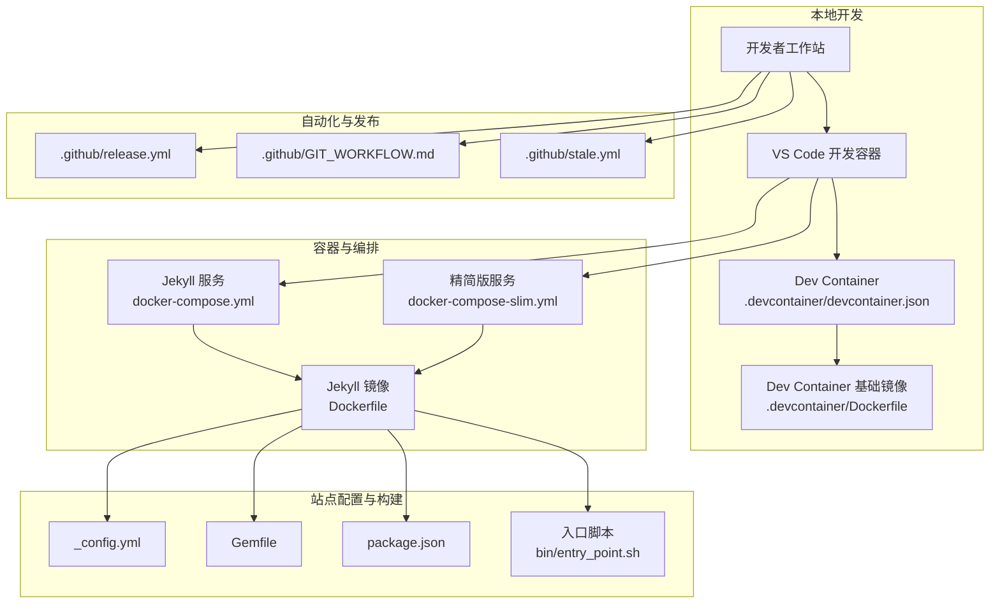
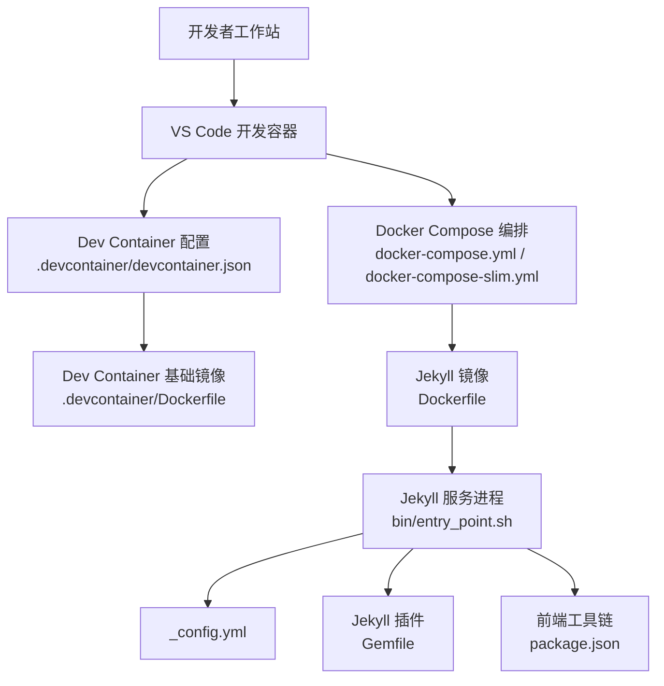
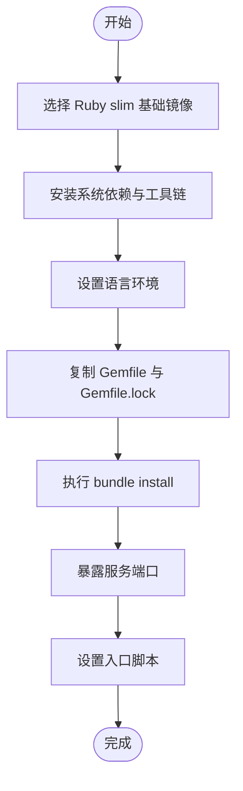
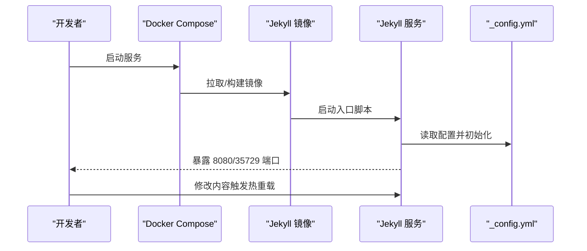
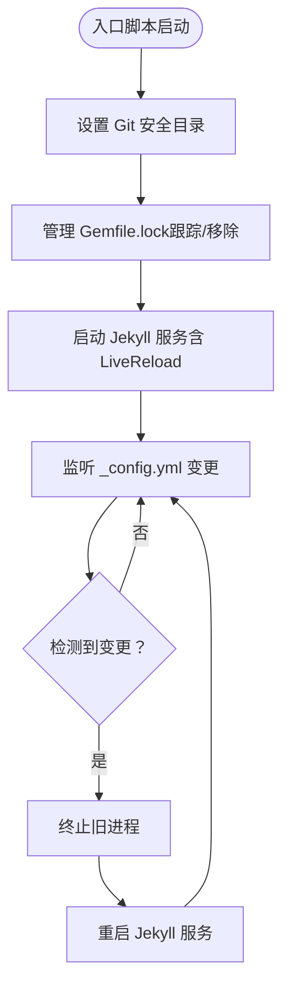
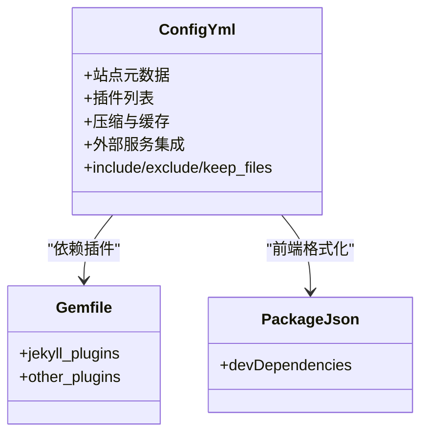
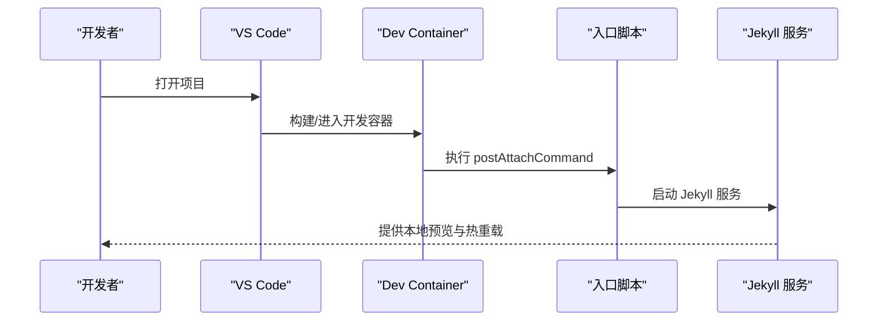
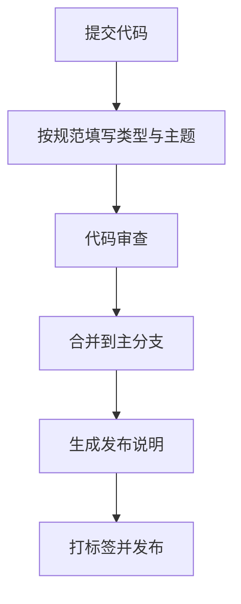
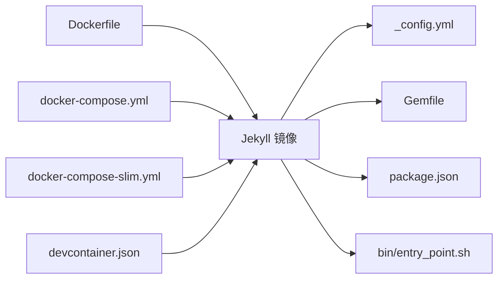

# 部署和自动化

<cite>
**本文引用的文件**
- [Dockerfile](file://Dockerfile)
- [docker-compose.yml](file://docker-compose.yml)
- [docker-compose-slim.yml](file://docker-compose-slim.yml)
- [bin/entry_point.sh](file://bin/entry_point.sh)
- [_config.yml](file://_config.yml)
- [Gemfile](file://Gemfile)
- [package.json](file://package.json)
- [.github/release.yml](file://.github/release.yml)
- [.github/GIT_WORKFLOW.md](file://.github/GIT_WORKFLOW.md)
- [.github/stale.yml](file://.github/stale.yml)
- [.devcontainer/Dockerfile](file://.devcontainer/Dockerfile)
- [.devcontainer/devcontainer.json](file://.devcontainer/devcontainer.json)
</cite>

## 目录
1. [简介](#简介)
2. [项目结构](#项目结构)
3. [核心组件](#核心组件)
4. [架构总览](#架构总览)
5. [详细组件分析](#详细组件分析)
6. [依赖关系分析](#依赖关系分析)
7. [性能考虑](#性能考虑)
8. [故障排查指南](#故障排查指南)
9. [结论](#结论)
10. [附录](#附录)

## 简介
本技术文档面向部署与自动化，围绕该 Jekyll 站点的容器化与本地开发体验展开，重点覆盖以下方面：
- 容器化方案：镜像构建、服务编排、开发容器与本地热重载
- 自动化与版本发布：基于 GitHub 的发布变更集生成与仓库维护策略
- 手动部署流程与注意事项：在本地或服务器上构建与运行站点
- 生产环境优化：域名与 HTTPS、CDN 加速、缓存与压缩策略
- 版本控制与发布管理：提交规范、标签与发布流程
- 运维可观测性：日志、错误告警与健康检查建议
- 回滚与灾难恢复：基于版本标签与静态产物的快速回退策略
- 第三方服务集成：统计、评论、外部数据源等

## 项目结构
该项目采用 Jekyll 主题（al-folio）作为内容框架，结合 Ruby 生态与 Bundler 管理插件，通过 Docker 与 Compose 提供一致的构建与开发环境；同时提供 VS Code Dev Container 支持，便于团队协作与本地热重载。

图表来源
- [docker-compose.yml:1-22](file://docker-compose.yml#L1-L22)
- [docker-compose-slim.yml:1-13](file://docker-compose-slim.yml#L1-L13)
- [Dockerfile:1-77](file://Dockerfile#L1-L77)
- [_config.yml:1-656](file://_config.yml#L1-L656)
- [Gemfile:1-42](file://Gemfile#L1-L42)
- [package.json:1-7](file://package.json#L1-L7)
- [bin/entry_point.sh:1-38](file://bin/entry_point.sh#L1-L38)
- [.github/release.yml:1-15](file://.github/release.yml#L1-L15)
- [.github/GIT_WORKFLOW.md:1-48](file://.github/GIT_WORKFLOW.md#L1-L48)
- [.github/stale.yml:1-19](file://.github/stale.yml#L1-L19)

章节来源
- [docker-compose.yml:1-22](file://docker-compose.yml#L1-L22)
- [docker-compose-slim.yml:1-13](file://docker-compose-slim.yml#L1-L13)
- [Dockerfile:1-77](file://Dockerfile#L1-L77)
- [_config.yml:1-656](file://_config.yml#L1-L656)
- [Gemfile:1-42](file://Gemfile#L1-L42)
- [package.json:1-7](file://package.json#L1-L7)
- [bin/entry_point.sh:1-38](file://bin/entry_point.sh#L1-L38)
- [.github/release.yml:1-15](file://.github/release.yml#L1-L15)
- [.github/GIT_WORKFLOW.md:1-48](file://.github/GIT_WORKFLOW.md#L1-L48)
- [.github/stale.yml:1-19](file://.github/stale.yml#L1-L19)

## 核心组件
- 容器镜像与构建
  - 使用 Ruby slim 基础镜像，安装构建工具、Node.js、Python pip、ImageMagick 等依赖，设置语言环境，预装 Jekyll 与 Bundler，并暴露服务端口。
  - 参考路径：[Dockerfile:1-77](file://Dockerfile#L1-L77)
- 服务编排
  - docker-compose.yml 指定使用预构建镜像或本地构建，映射站点目录、端口，设置开发环境变量，支持热重载与实时刷新。
  - 参考路径：[docker-compose.yml:1-22](file://docker-compose.yml#L1-L22)
  - 精简版编排 docker-compose-slim.yml 使用更小的基础镜像，适合轻量场景。
  - 参考路径：[docker-compose-slim.yml:1-13](file://docker-compose-slim.yml#L1-L13)
- 入口脚本与热重载
  - entry_point.sh 负责处理 Gemfile.lock 的 Git 状态、启动 Jekyll 服务并监听配置文件变更以触发重启。
  - 参考路径：[bin/entry_point.sh:1-38](file://bin/entry_point.sh#L1-L38)
- 站点配置与插件
  - _config.yml 定义站点元数据、主题与布局、插件列表、压缩与缓存策略、外部服务集成等。
  - Gemfile 声明 Jekyll 插件组与开发辅助依赖。
  - package.json 提供前端格式化工具与 Prettier 配置。
  - 参考路径：
    - [_config.yml:1-656](file://_config.yml#L1-L656)
    - [Gemfile:1-42](file://Gemfile#L1-L42)
    - [package.json:1-7](file://package.json#L1-L7)

章节来源
- [Dockerfile:1-77](file://Dockerfile#L1-L77)
- [docker-compose.yml:1-22](file://docker-compose.yml#L1-L22)
- [docker-compose-slim.yml:1-13](file://docker-compose-slim.yml#L1-L13)
- [bin/entry_point.sh:1-38](file://bin/entry_point.sh#L1-L38)
- [_config.yml:1-656](file://_config.yml#L1-L656)
- [Gemfile:1-42](file://Gemfile#L1-L42)
- [package.json:1-7](file://package.json#L1-L7)

## 架构总览
下图展示从本地开发到容器化运行的整体架构，以及关键组件之间的交互关系。

图表来源
- [.devcontainer/devcontainer.json:1-35](file://.devcontainer/devcontainer.json#L1-L35)
- [.devcontainer/Dockerfile:1-8](file://.devcontainer/Dockerfile#L1-L8)
- [docker-compose.yml:1-22](file://docker-compose.yml#L1-L22)
- [docker-compose-slim.yml:1-13](file://docker-compose-slim.yml#L1-L13)
- [Dockerfile:1-77](file://Dockerfile#L1-L77)
- [bin/entry_point.sh:1-38](file://bin/entry_point.sh#L1-L38)
- [_config.yml:1-656](file://_config.yml#L1-L656)
- [Gemfile:1-42](file://Gemfile#L1-L42)
- [package.json:1-7](file://package.json#L1-L7)

## 详细组件分析

### 组件一：容器镜像与构建（Dockerfile）
- 设计要点
  - 基于 Ruby slim，安装系统级依赖与 Ruby/Node/Python 工具链，设置语言环境，预装 Jekyll 与 Bundler。
  - 将 Gemfile 与 Gemfile.lock 复制至镜像，执行 bundle install，确保依赖一致性。
  - 暴露 8080 端口用于本地服务，入口命令指向自定义脚本。
- 性能与安全
  - 清理包缓存减少镜像体积。
  - 可选非 root 用户与权限修复参数，避免缓存目录权限问题。
- 优化建议
  - 使用多阶段构建分离构建与运行时层。
  - 在 CI 中缓存 bundle 与 npm 依赖以提升构建速度。

图表来源
- [Dockerfile:1-77](file://Dockerfile#L1-L77)

章节来源
- [Dockerfile:1-77](file://Dockerfile#L1-L77)

### 组件二：服务编排（docker-compose.yml 与 docker-compose-slim.yml）
- 设计要点
  - 映射站点根目录到容器内 /srv/jekyll，实现代码热更新。
  - 暴露 8080（Jekyll 服务）与 35729（LiveReload）端口。
  - 设置 JEKYLL_ENV=development，启用本地开发特性。
  - slim 版本使用更小的基础镜像，适合资源受限环境。
- 使用建议
  - 本地开发优先使用 docker-compose.yml；需要最小化依赖时可切换至 slim 版本。

图表来源
- [docker-compose.yml:1-22](file://docker-compose.yml#L1-L22)
- [docker-compose-slim.yml:1-13](file://docker-compose-slim.yml#L1-L13)
- [bin/entry_point.sh:1-38](file://bin/entry_point.sh#L1-L38)
- [_config.yml:1-656](file://_config.yml#L1-L656)

章节来源
- [docker-compose.yml:1-22](file://docker-compose.yml#L1-L22)
- [docker-compose-slim.yml:1-13](file://docker-compose-slim.yml#L1-L13)

### 组件三：入口脚本与热重载（bin/entry_point.sh）
- 功能概述
  - 管理 Gemfile.lock 的 Git 状态，避免缓存权限问题。
  - 启动 Jekyll 服务并开启 LiveReload。
  - 监听 _config.yml 变化，自动重启服务以应用新配置。
- 错误处理
  - 使用 inotifywait 监控文件事件，异常时输出提示并继续循环等待。
- 优化建议
  - 在 CI 环境中禁用 LiveReload，仅启用静态构建。
  - 对大体量站点可增加健壮性检查与超时保护。

图表来源
- [bin/entry_point.sh:1-38](file://bin/entry_point.sh#L1-L38)
- [_config.yml:1-656](file://_config.yml#L1-L656)

章节来源
- [bin/entry_point.sh:1-38](file://bin/entry_point.sh#L1-L38)

### 组件四：站点配置与插件（_config.yml、Gemfile、package.json）
- 配置要点
  - 站点元数据、URL、语言、主题与布局、插件列表、压缩与缓存策略、外部服务集成（统计、评论、外部数据）。
  - include/exclude/keep_files 控制构建产物范围，确保 CNAME 与 .nojekyll 等保留文件生效。
- 插件生态
  - 通过 Gemfile 声明核心插件组，涵盖归档、社交、RSS、压缩、搜索、学术文献等。
- 前端工具
  - package.json 引入 Prettier 与 Liquid 格式化插件，统一模板风格。

图表来源
- [_config.yml:1-656](file://_config.yml#L1-L656)
- [Gemfile:1-42](file://Gemfile#L1-L42)
- [package.json:1-7](file://package.json#L1-L7)

章节来源
- [_config.yml:1-656](file://_config.yml#L1-L656)
- [Gemfile:1-42](file://Gemfile#L1-L42)
- [package.json:1-7](file://package.json#L1-L7)

### 组件五：开发容器与本地热重载（.devcontainer）
- 设计要点
  - 自定义 Dev Container 基础镜像，修复 Yarn 仓库导致的 apt 更新失败问题。
  - 通过 features 安装构建工具、ImageMagick、Jupyter nbconvert、Ruby 等。
  - postAttachCommand 自动运行入口脚本，实现进入容器即启动服务。
  - VS Code 扩展与 Prettier 默认格式化设置，提升协作效率。
- 使用建议
  - 在团队中统一 devcontainer.json，确保本地与 CI 环境一致。

图表来源
- [.devcontainer/devcontainer.json:1-35](file://.devcontainer/devcontainer.json#L1-L35)
- [.devcontainer/Dockerfile:1-8](file://.devcontainer/Dockerfile#L1-L8)
- [bin/entry_point.sh:1-38](file://bin/entry_point.sh#L1-L38)

章节来源
- [.devcontainer/devcontainer.json:1-35](file://.devcontainer/devcontainer.json#L1-L35)
- [.devcontainer/Dockerfile:1-8](file://.devcontainer/Dockerfile#L1-L8)

### 组件六：自动化与发布（.github/release.yml、.github/GIT_WORKFLOW.md、.github/stale.yml）
- 发布变更集
  - release.yml 定义变更集分类与排除标签，便于生成结构化发布说明。
- 提交规范
  - GIT_WORKFLOW.md 规范提交类型与消息格式，强调明确性与可追溯性。
- 仓库维护
  - stale.yml 自动标记与关闭长期不活跃 Issue，降低维护成本。

图表来源
- [.github/GIT_WORKFLOW.md:1-48](file://.github/GIT_WORKFLOW.md#L1-L48)
- [.github/release.yml:1-15](file://.github/release.yml#L1-L15)
- [.github/stale.yml:1-19](file://.github/stale.yml#L1-L19)

章节来源
- [.github/GIT_WORKFLOW.md:1-48](file://.github/GIT_WORKFLOW.md#L1-L48)
- [.github/release.yml:1-15](file://.github/release.yml#L1-L15)
- [.github/stale.yml:1-19](file://.github/stale.yml#L1-L19)

## 依赖关系分析
- 组件耦合
  - Dockerfile 与 Gemfile、_config.yml 存在直接依赖关系：镜像构建需遵循 Gemfile 插件清单，运行时需加载 _config.yml。
  - docker-compose.yml 与入口脚本共同决定本地开发体验：端口映射、卷挂载与热重载行为由两者协同实现。
- 外部依赖
  - Ruby 生态（Jekyll、插件）、Node.js 生态（前端工具）、ImageMagick（图片处理）、Git（Gemfile.lock 管理）。
- 潜在风险
  - 插件版本升级可能影响构建稳定性，建议在 CI 中进行兼容性测试。
  - LiveReload 在 CI 环境应禁用，避免无头构建阻塞。

图表来源
- [Dockerfile:1-77](file://Dockerfile#L1-L77)
- [_config.yml:1-656](file://_config.yml#L1-L656)
- [Gemfile:1-42](file://Gemfile#L1-L42)
- [package.json:1-7](file://package.json#L1-L7)
- [bin/entry_point.sh:1-38](file://bin/entry_point.sh#L1-L38)
- [docker-compose.yml:1-22](file://docker-compose.yml#L1-L22)
- [docker-compose-slim.yml:1-13](file://docker-compose-slim.yml#L1-L13)
- [.devcontainer/devcontainer.json:1-35](file://.devcontainer/devcontainer.json#L1-L35)

章节来源
- [Dockerfile:1-77](file://Dockerfile#L1-L77)
- [_config.yml:1-656](file://_config.yml#L1-L656)
- [Gemfile:1-42](file://Gemfile#L1-L42)
- [package.json:1-7](file://package.json#L1-L7)
- [bin/entry_point.sh:1-38](file://bin/entry_point.sh#L1-L38)
- [docker-compose.yml:1-22](file://docker-compose.yml#L1-L22)
- [docker-compose-slim.yml:1-13](file://docker-compose-slim.yml#L1-L13)
- [.devcontainer/devcontainer.json:1-35](file://.devcontainer/devcontainer.json#L1-L35)

## 性能考虑
- 构建性能
  - 在 CI 中缓存 bundle 与 npm 依赖，减少重复安装时间。
  - 使用多阶段构建分离构建与运行时层，缩小最终镜像体积。
- 运行性能
  - 启用压缩与缓存策略（参考 _config.yml 中相关配置），合理设置第三方库的本地/CDN 引用。
  - 图片处理使用 ImageMagick，注意批量转换对 CPU 的占用，可在 CI 中异步处理。
- 端到端优化
  - 生产环境建议启用 CDN 与 HTTPS，结合浏览器缓存与 ETag/Last-Modified 实现高效缓存命中。

## 故障排查指南
- 权限问题
  - 症状：构建过程中出现缓存目录权限错误。
  - 处理：在 Dockerfile 或入口脚本中添加用户与组映射，或清理缓存目录后重试。
  - 参考路径：[Dockerfile:1-77](file://Dockerfile#L1-L77)、[bin/entry_point.sh:1-38](file://bin/entry_point.sh#L1-L38)
- 插件冲突
  - 症状：构建失败或页面渲染异常。
  - 处理：锁定插件版本，逐步禁用可疑插件定位问题；在 CI 中验证不同 Ruby 版本兼容性。
  - 参考路径：[Gemfile:1-42](file://Gemfile#L1-L42)
- LiveReload 不生效
  - 症状：修改内容后页面未自动刷新。
  - 处理：确认端口映射与卷挂载正确；在 CI 中禁用 LiveReload。
  - 参考路径：[docker-compose.yml:1-22](file://docker-compose.yml#L1-L22)、[bin/entry_point.sh:1-38](file://bin/entry_point.sh#L1-L38)
- 配置未生效
  - 症状：更改 _config.yml 后未触发重建。
  - 处理：确认入口脚本监听逻辑正常；在开发容器中检查 inotifywait 是否可用。
  - 参考路径：[_config.yml:1-656](file://_config.yml#L1-L656)、[bin/entry_point.sh:1-38](file://bin/entry_point.sh#L1-L38)

章节来源
- [Dockerfile:1-77](file://Dockerfile#L1-L77)
- [bin/entry_point.sh:1-38](file://bin/entry_point.sh#L1-L38)
- [Gemfile:1-42](file://Gemfile#L1-L42)
- [docker-compose.yml:1-22](file://docker-compose.yml#L1-L22)
- [_config.yml:1-656](file://_config.yml#L1-L656)

## 结论
本项目通过容器化与开发容器实现了高度一致的本地与 CI 环境，配合完善的插件体系与配置管理，能够稳定地支撑个人/学术型 Jekyll 站点的持续交付。建议在现有基础上进一步完善 CI 缓存策略、引入自动化测试与安全扫描，并结合生产环境的 HTTPS、CDN 与缓存策略，实现更高效的发布与运维。

## 附录

### 手动部署流程（本地/服务器）
- 准备环境
  - 安装 Docker 与 Docker Compose。
  - 确保宿主机开放 8080/35729 端口（如需外网访问，需配置反向代理与防火墙规则）。
- 启动服务
  - 使用 docker-compose.yml 启动服务，或在资源受限环境使用 docker-compose-slim.yml。
  - 如需开发模式，设置环境变量 JEKYLL_ENV=development 并启用 LiveReload。
- 构建静态站点
  - 在 CI 或本地执行一次生产构建（禁用 LiveReload），产物位于默认输出目录。
- 部署到托管平台
  - 若使用 GitHub Pages，将静态产物推送到指定分支或启用 Pages 功能。
  - 若使用自建服务器，将静态产物上传至 Web 根目录并配置 Nginx/Apache。

章节来源
- [docker-compose.yml:1-22](file://docker-compose.yml#L1-L22)
- [docker-compose-slim.yml:1-13](file://docker-compose-slim.yml#L1-L13)
- [bin/entry_point.sh:1-38](file://bin/entry_point.sh#L1-L38)

### 生产环境优化（域名、HTTPS、CDN）
- 域名与 HTTPS
  - 通过 CNAME 文件绑定自定义域名；在托管平台启用 HTTPS（如 GitHub Pages 提供免费证书）。
  - 参考路径：[_config.yml:1-656](file://_config.yml#L1-L656)
- CDN 加速
  - 将静态资源（CSS/JS/图片）托管至 CDN，结合缓存策略与压缩提升首屏性能。
- 缓存与压缩
  - 利用 _config.yml 中的压缩与缓存配置，结合浏览器缓存头与 ETag/Last-Modified 实现高效缓存。

章节来源
- [_config.yml:1-656](file://_config.yml#L1-L656)

### 版本控制与发布管理最佳实践
- 提交规范
  - 遵循 GIT_WORKFLOW.md 的类型与消息格式，确保变更可追踪。
- 发布说明
  - 使用 release.yml 自动生成变更集，按功能、修复、其他分类整理。
- 仓库维护
  - 使用 stale.yml 自动标记与关闭长期不活跃 Issue，保持仓库整洁。

章节来源
- [.github/GIT_WORKFLOW.md:1-48](file://.github/GIT_WORKFLOW.md#L1-L48)
- [.github/release.yml:1-15](file://.github/release.yml#L1-L15)
- [.github/stale.yml:1-19](file://.github/stale.yml#L1-L19)

### 运维功能配置（监控、日志、告警）
- 日志与可观测性
  - 在容器日志中收集 Jekyll 构建与运行日志；在生产环境结合 Nginx/Apache 访问日志与错误日志。
- 健康检查
  - 在 Compose 中添加健康检查，定期探测 8080 端口连通性。
- 告警
  - 结合平台提供的监控与告警能力，对 5xx 错误率、响应时间与可用性进行告警。

### 回滚策略与灾难恢复
- 回滚策略
  - 基于 Git 标签与发布版本进行快速回滚；保留最近几个版本的静态产物以便回退。
- 灾难恢复
  - 定期备份站点源码、第三方数据与配置；在镜像层使用多阶段构建与缓存层分离，缩短恢复时间。

### 第三方服务集成
- 统计与验证
  - 在 _config.yml 中配置 Google Analytics、Search Console 等，启用站点验证与统计。
- 评论系统
  - 支持 Giscus 等现代评论系统，替代传统 Disqus。
- 外部数据
  - 通过 jekyll-get-json 等插件拉取外部 JSON 数据，丰富内容呈现。

章节来源
- [_config.yml:1-656](file://_config.yml#L1-L656)