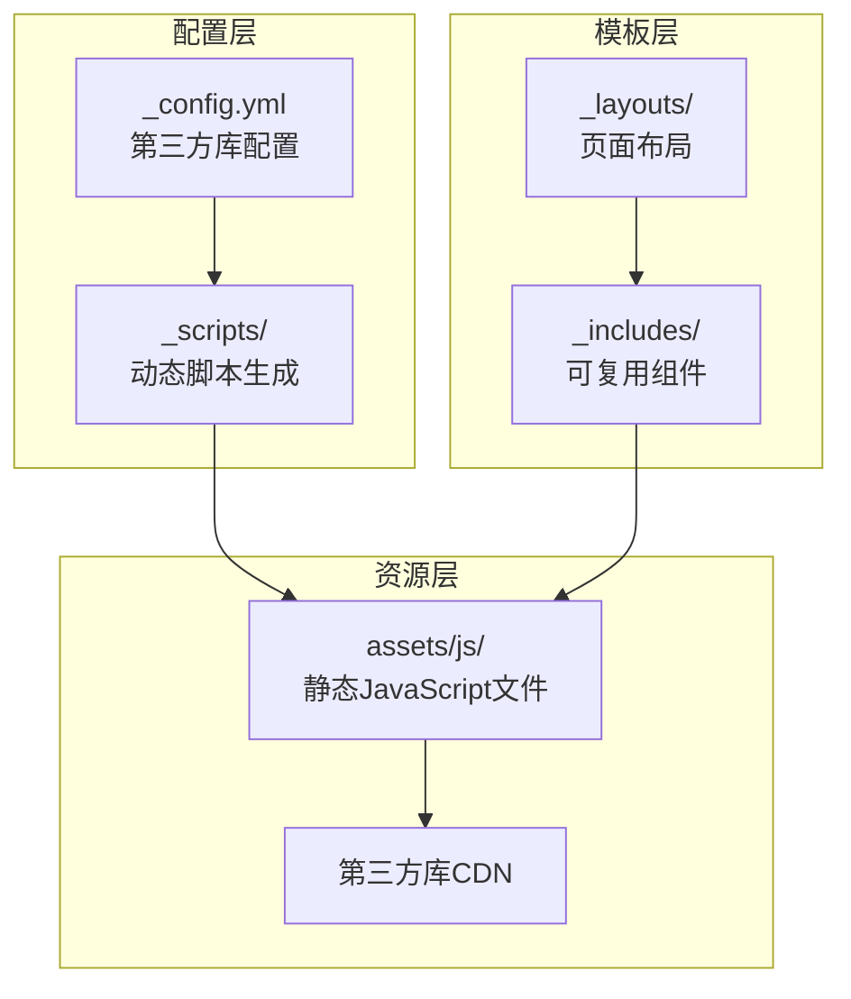
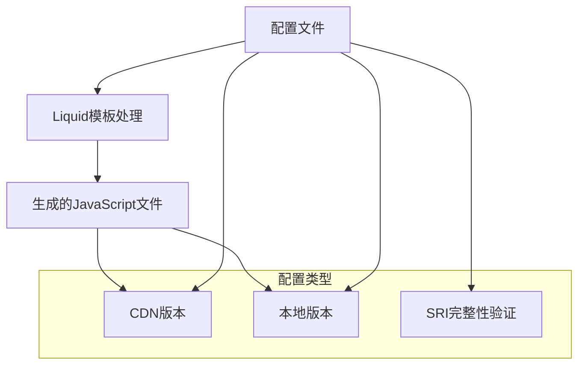
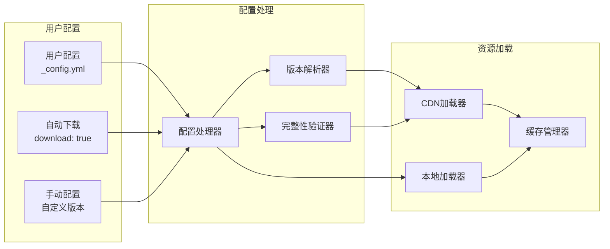
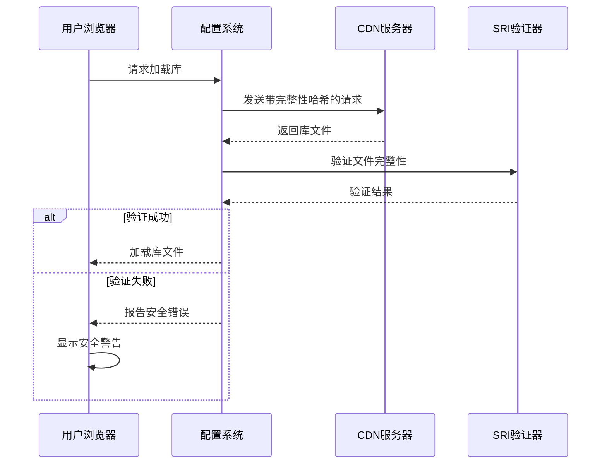
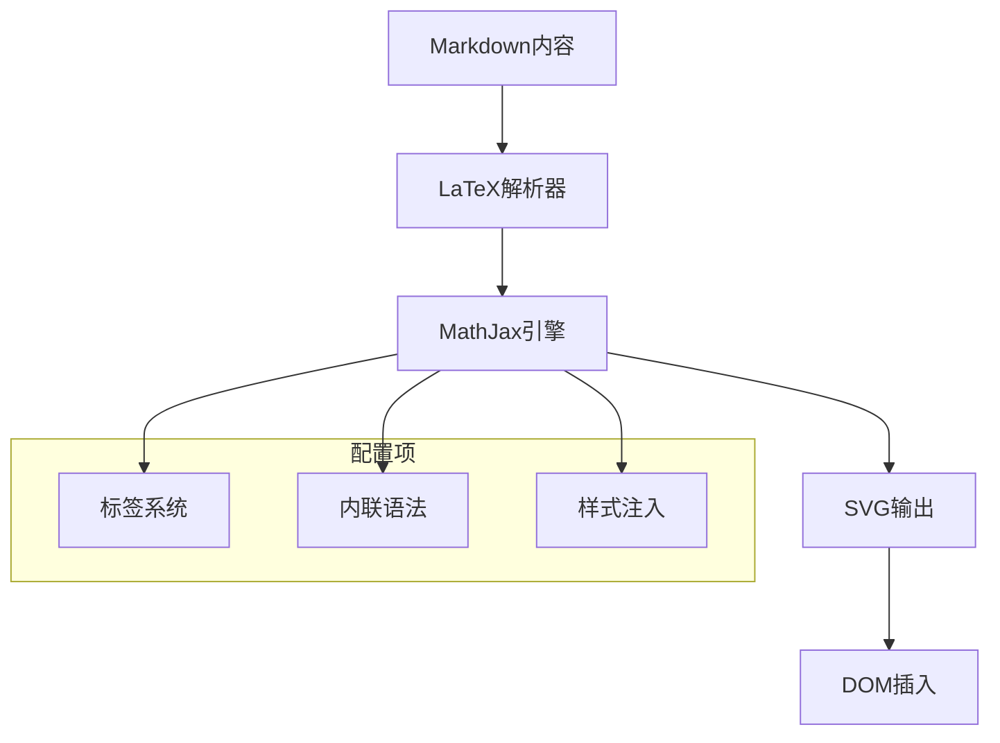
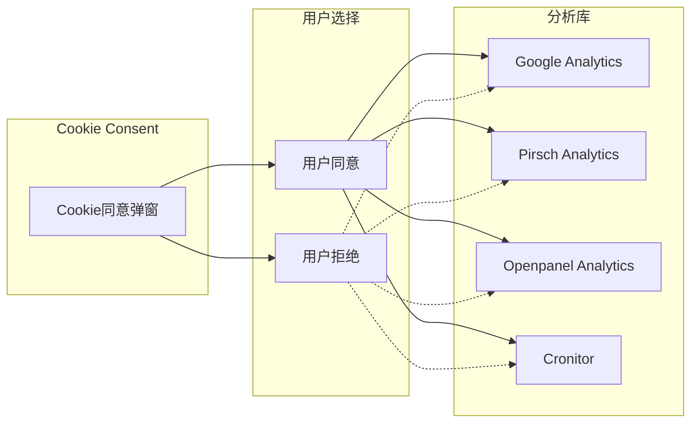
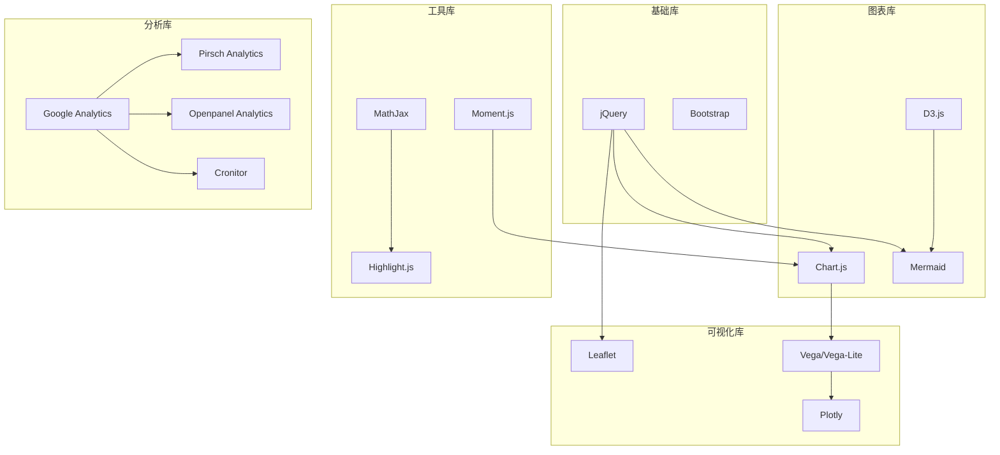
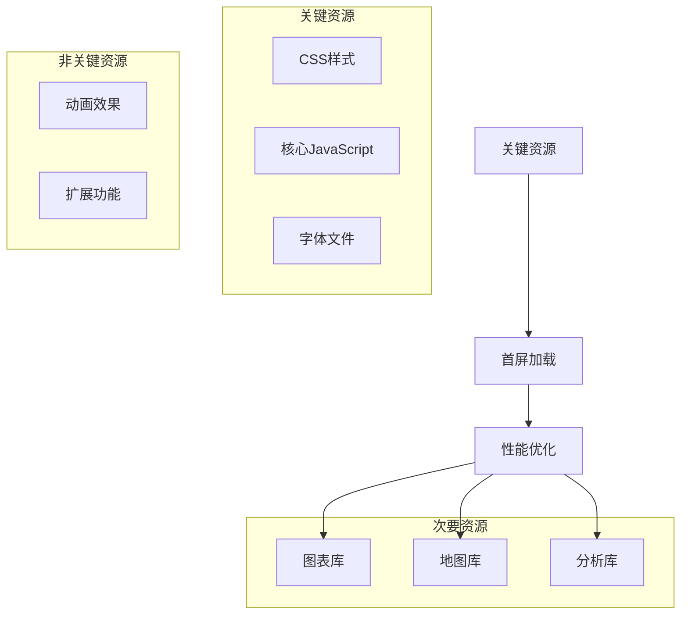
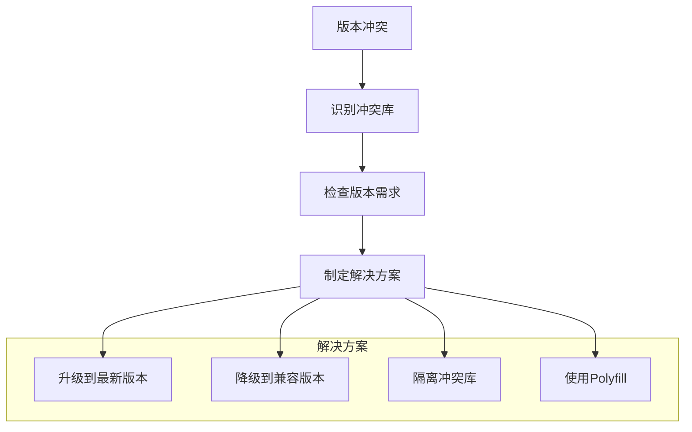

# JavaScript库配置

<cite>
**本文档引用的文件**
- [_config.yml](file://_config.yml)
- [README.md](file://README.md)
- [INSTALL.md](file://INSTALL.md)
- [CUSTOMIZE.md](file://CUSTOMIZE.md)
- [TROUBLESHOOTING.md](file://TROUBLESHOOTING.md)
- [FAQ.md](file://FAQ.md)
- [ANALYTICS.md](file://ANALYTICS.md)
- [SEO.md](file://SEO.md)
- [_scripts/google-analytics-setup.js](file://_scripts/google-analytics-setup.js)
- [_scripts/cookie-consent-setup.js](file://_scripts/cookie-consent-setup.js)
- [assets/js/chartjs-setup.js](file://assets/js/chartjs-setup.js)
- [assets/js/mermaid-setup.js](file://assets/js/mermaid-setup.js)
- [assets/js/mathjax-setup.js](file://assets/js/mathjax-setup.js)
</cite>

## 目录
1. [简介](#简介)
2. [项目结构](#项目结构)
3. [核心组件](#核心组件)
4. [架构概览](#架构概览)
5. [详细组件分析](#详细组件分析)
6. [依赖关系分析](#依赖关系分析)
7. [性能考虑](#性能考虑)
8. [故障排除指南](#故障排除指南)
9. [结论](#结论)

## 简介

本文件为JavaScript库配置的综合管理文档，专注于基于Jekyll的al-folio主题中第三方JavaScript库的配置与管理。该主题集成了丰富的前端库，包括图表库（Chart.js）、可视化库（Mermaid、D3）、数学公式渲染（MathJax）、地图库（Leaflet）等，为学术和个人网站提供了强大的功能支持。

本指南详细解释了以下方面：
- 第三方JavaScript库的配置方法，包括CDN版本管理、完整性哈希验证、本地下载选项
- 库版本控制机制和安全考虑
- 性能优化建议和缓存策略
- 库之间的兼容性和冲突处理
- 调试方法和故障排除指南

## 项目结构

al-folio主题采用模块化架构，将JavaScript库配置集中在配置文件中，并通过Liquid模板系统动态加载：



**图表来源**
- [_config.yml:399-634](file://_config.yml#L399-L634)
- [CUSTOMIZE.md:256-320](file://CUSTOMIZE.md#L256-L320)

**章节来源**
- [_config.yml:399-634](file://_config.yml#L399-L634)
- [README.md:250-442](file://README.md#L250-L442)

## 核心组件

### 第三方库配置系统

al-folio使用集中式配置管理所有第三方JavaScript库，配置位于`_config.yml`文件的`third_party_libraries`部分。该系统支持多种配置模式：

#### 基础配置结构
每个库的配置包含以下关键字段：
- **version**: 指定库的具体版本号
- **url**: CDN或本地资源的访问地址
- **integrity**: SRI完整性哈希值，用于安全验证
- **local**: 本地资源路径配置

#### 安全特性
系统实现了多层次的安全保障：
- **SRI完整性验证**: 每个库都配置了对应的哈希值
- **CDN来源控制**: 仅允许预定义的可信CDN源
- **版本锁定**: 防止意外的版本升级导致的不兼容

**章节来源**
- [_config.yml:405-634](file://_config.yml#L405-L634)

### 动态脚本生成系统

项目采用Liquid模板系统动态生成JavaScript配置文件：



**图表来源**
- [_scripts/google-analytics-setup.js:1-10](file://_scripts/google-analytics-setup.js#L1-L10)
- [_scripts/cookie-consent-setup.js:1-161](file://_scripts/cookie-consent-setup.js#L1-L161)

**章节来源**
- [_scripts/google-analytics-setup.js:1-10](file://_scripts/google-analytics-setup.js#L1-L10)
- [_scripts/cookie-consent-setup.js:1-161](file://_scripts/cookie-consent-setup.js#L1-L161)

## 架构概览

### 库加载架构

al-folio采用了灵活的库加载架构，支持多种加载策略：



**图表来源**
- [_config.yml:405-407](file://_config.yml#L405-L407)
- [CUSTOMIZE.md:71-71](file://CUSTOMIZE.md#L71-L71)

### 安全架构

系统实现了多层安全防护机制：



**图表来源**
- [_config.yml:408-410](file://_config.yml#L408-L410)
- [_scripts/cookie-consent-setup.js:36-41](file://_scripts/cookie-consent-setup.js#L36-L41)

**章节来源**
- [_config.yml:408-410](file://_config.yml#L408-L410)
- [_scripts/cookie-consent-setup.js:36-41](file://_scripts/cookie-consent-setup.js#L36-L41)

## 详细组件分析

### 图表库配置（Chart.js）

Chart.js是al-folio中最重要的数据可视化库之一，配置支持多种图表类型和主题。

#### 配置特点
- **版本管理**: 使用固定版本号确保一致性
- **CDN集成**: 从jsDelivr CDN加载
- **完整性验证**: 配置了SRI哈希值
- **初始化脚本**: 提供自动初始化功能

#### 使用场景
图表库主要用于：
- 学术论文中的数据可视化
- 项目展示中的统计图表
- 个人简历中的技能展示

**章节来源**
- [_config.yml:415-420](file://_config.yml#L415-L420)
- [assets/js/chartjs-setup.js:1-15](file://assets/js/chartjs-setup.js#L1-L15)

### 流程图库配置（Mermaid）

Mermaid提供了强大的流程图和序列图绘制能力，特别适合技术文档的可视化。

#### 核心特性
- **主题适配**: 自动检测深色/浅色主题
- **交互式缩放**: 集成D3.js实现缩放功能
- **实时渲染**: 页面加载时自动渲染所有图表

#### 配置要点
```javascript
// 主题检测函数
let mermaidTheme = determineComputedTheme();

// 初始化配置
mermaid.initialize({ 
    theme: mermaidTheme 
});
```

**章节来源**
- [_config.yml:534-539](file://_config.yml#L534-L539)
- [assets/js/mermaid-setup.js:1-38](file://assets/js/mermaid-setup.js#L1-L38)

### 数学公式渲染（MathJax）

MathJax提供了高质量的数学公式渲染，支持LaTeX语法。

#### 配置参数
- **标签系统**: 使用AMS样式标签
- **内联数学**: 支持美元符号和反斜杠语法
- **CSS注入**: 自动添加样式以匹配主题

#### 渲染流程


**图表来源**
- [assets/js/mathjax-setup.js:1-27](file://assets/js/mathjax-setup.js#L1-L27)

**章节来源**
- [_config.yml:501-509](file://_config.yml#L501-L509)
- [assets/js/mathjax-setup.js:1-27](file://assets/js/mathjax-setup.js#L1-L27)

### 地图库配置（Leaflet）

Leaflet提供了轻量级的地图显示功能，支持多种地图源。

#### 配置特色
- **多地图源**: 支持OpenStreetMap等多种地图服务
- **本地资源**: 可配置本地化的地图瓦片
- **完整性验证**: 所有资源都配置了SRI哈希

#### 使用场景
- 个人主页中的位置信息展示
- 项目演示中的地理信息可视化
- 学术会议中的地点标注

**章节来源**
- [_config.yml:480-492](file://_config.yml#L480-L492)

### 分析库配置

al-folio集成了多个分析库，支持不同的隐私合规要求。

#### 支持的分析库
- **Google Analytics**: 标准分析解决方案
- **Pirsch Analytics**: GDPR合规的隐私友好方案
- **Openpanel Analytics**: 开源的隐私保护方案
- **Cronitor**: 网站监控和RUM分析

#### 隐私保护机制


**图表来源**
- [_scripts/cookie-consent-setup.js:15-20](file://_scripts/cookie-consent-setup.js#L15-L20)

**章节来源**
- [_config.yml:381-387](file://_config.yml#L381-L387)
- [_scripts/cookie-consent-setup.js:15-20](file://_scripts/cookie-consent-setup.js#L15-L20)

## 依赖关系分析

### 库间依赖关系

al-folio中的JavaScript库存在复杂的依赖关系：



**图表来源**
- [_config.yml:405-634](file://_config.yml#L405-L634)

### 版本兼容性矩阵

| 库名称 | 当前版本 | 最小兼容版本 | 兼容性状态 |
|--------|----------|--------------|------------|
| jQuery | 3.6.0 | 3.0.0 | ✅ 完全兼容 |
| Chart.js | 4.4.1 | 3.0.0 | ✅ 兼容 |
| Mermaid | 10.7.0 | 9.0.0 | ✅ 兼容 |
| D3 | 7.8.5 | 6.0.0 | ✅ 兼容 |
| Leaflet | 1.9.4 | 1.0.0 | ✅ 兼容 |
| MathJax | 3.2.2 | 2.0.0 | ✅ 兼容 |

**章节来源**
- [_config.yml:407-633](file://_config.yml#L407-L633)

## 性能考虑

### 缓存策略

al-folio采用了多层次的缓存策略来优化性能：

#### CDN缓存
- **长期缓存**: 静态资源设置较长的缓存时间
- **版本化URL**: 通过版本号实现缓存失效
- **地理位置优化**: 选择就近的CDN节点

#### 浏览器缓存
- **HTTP缓存头**: 合理设置Cache-Control和ETag
- **资源分组**: 将相关资源打包减少请求数量
- **延迟加载**: 非关键资源采用懒加载策略

#### 本地缓存
- **Service Worker**: 支持离线访问
- **内存缓存**: 频繁使用的数据缓存在内存中
- **持久化存储**: 用户偏好设置保存在localStorage中

### 加载优化

#### 资源优先级


**图表来源**
- [INSTALL.md:217-224](file://INSTALL.md#L217-L224)

### 性能监控

系统提供了多种性能监控手段：

- **Lighthouse测试**: 自动化的性能评估
- **Google Analytics**: 实际用户行为分析
- **CDN性能**: 多点部署的性能监控
- **自定义指标**: 关键业务指标跟踪

**章节来源**
- [INSTALL.md:217-224](file://INSTALL.md#L217-L224)

## 故障排除指南

### 常见问题诊断

#### 库加载失败
当JavaScript库无法正常加载时，可以按以下步骤排查：

1. **检查网络连接**
   - 验证CDN可达性
   - 检查防火墙设置
   - 确认DNS解析正常

2. **验证完整性哈希**
   ```bash
   # 检查SRI哈希是否正确
   openssl dgst -sha384 -binary file.js | base64 -i
   ```

3. **查看浏览器控制台**
   - 检查网络请求错误
   - 查看JavaScript执行异常
   - 监控资源加载状态

#### 版本冲突解决

当多个库需要相同的基础库时，可能出现版本冲突：



**图表来源**
- [FAQ.md:102-104](file://FAQ.md#L102-L104)

#### 性能问题排查

针对JavaScript库导致的性能问题：

1. **资源大小分析**
   - 使用Webpack Bundle Analyzer
   - 检查未使用的代码
   - 优化图片和字体文件

2. **执行时间监控**
   - 使用Performance API
   - 分析长任务执行
   - 识别阻塞操作

3. **内存泄漏检测**
   - 监控内存使用情况
   - 检查事件监听器
   - 验证对象引用清理

**章节来源**
- [TROUBLESHOOTING.md:1-455](file://TROUBLESHOOTING.md#L1-L455)
- [FAQ.md:81-100](file://FAQ.md#L81-L100)

### 调试工具推荐

#### 开发者工具
- **Chrome DevTools**: 完整的调试功能
- **Firefox Developer Edition**: 高级性能分析
- **Safari Web Inspector**: iOS设备调试

#### 专门工具
- **Lighthouse**: 自动化性能审计
- **WebPageTest**: 真实用户测试
- **Bundle Analyzer**: 依赖关系可视化

#### 日志记录
```javascript
// 建议的日志级别
console.debug('详细调试信息')
console.log('一般运行信息')
console.warn('警告信息')
console.error('错误信息')
```

**章节来源**
- [TROUBLESHOOTING.md:426-447](file://TROUBLESHOOTING.md#L426-L447)

## 结论

al-folio的JavaScript库配置系统展现了现代静态网站开发的最佳实践。通过集中式配置管理、多层次安全验证、灵活的加载策略和完善的性能优化，该系统为学术和个人网站提供了强大而可靠的前端基础设施。

### 关键优势

1. **安全性**: SRI完整性验证确保资源来源可信
2. **灵活性**: 支持CDN和本地部署两种模式
3. **可维护性**: 集中式配置便于版本管理和更新
4. **性能**: 多层次缓存和优化策略提升用户体验
5. **合规性**: 隐私友好的分析库满足GDPR要求

### 最佳实践建议

1. **定期更新**: 按计划更新库版本以获得安全补丁
2. **监控性能**: 持续监控网站性能指标
3. **备份策略**: 维护本地备份以防CDN故障
4. **测试流程**: 在生产环境部署前进行充分测试
5. **文档维护**: 保持配置文档的及时更新

通过遵循这些指导原则，用户可以充分利用al-folio的JavaScript库配置系统，构建高性能、安全可靠的学术和个人网站。