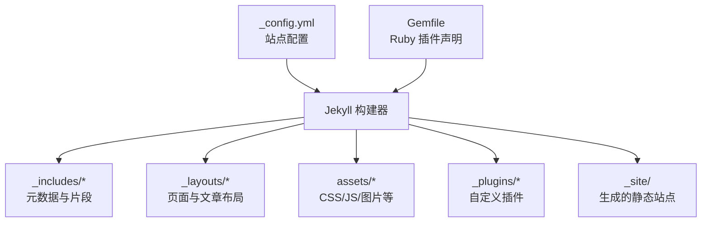
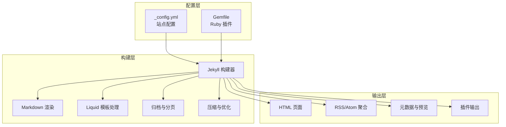
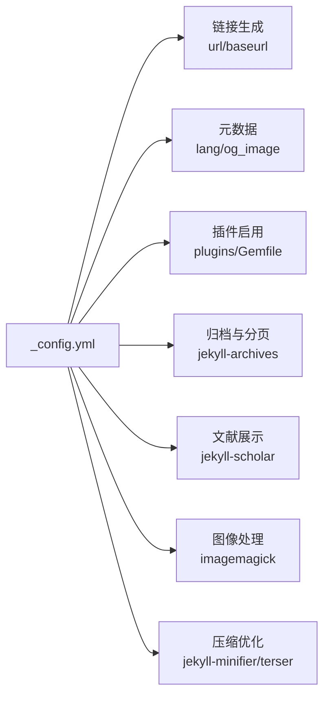

# Jekyll核心配置

<cite>
**本文档引用的文件**
- [_config.yml](file://_config.yml)
- [README.md](file://README.md)
- [INSTALL.md](file://INSTALL.md)
- [CUSTOMIZE.md](file://CUSTOMIZE.md)
- [TROUBLESHOOTING.md](file://TROUBLESHOOTING.md)
- [.github/instructions/yaml-configuration.instructions.md](file://.github/instructions/yaml-configuration.instructions.md)
- [_includes/metadata.liquid](file://_includes/metadata.liquid)
- [Gemfile](file://Gemfile)
</cite>

## 目录
1. [简介](#简介)
2. [项目结构](#项目结构)
3. [核心组件](#核心组件)
4. [架构总览](#架构总览)
5. [详细组件分析](#详细组件分析)
6. [依赖关系分析](#依赖关系分析)
7. [性能考虑](#性能考虑)
8. [故障排除指南](#故障排除指南)
9. [结论](#结论)
10. [附录](#附录)

## 简介
本文件系统性梳理 Jekyll 核心配置，聚焦于 _config.yml 中的基础配置项与高级配置项，覆盖站点基本信息、语言设置、favicon 配置、时间戳设置、链接生成规则、元数据与社交预览、分析与验证、插件与构建流程、以及性能优化与最佳实践。文档同时提供配置验证方法、常见错误排查指南，并针对不同技术背景的用户提供分层指导。

## 项目结构
该仓库采用 Jekyll 主题 al-folio 的典型目录组织：内容通过 Markdown 编写，布局与模板由 Liquid 提供，样式由 SCSS 管理，静态资源位于 assets 目录；配置集中在根目录的 _config.yml，主题与功能通过 Gemfile 声明的 Ruby 插件扩展。

图表来源
- [_config.yml](file://_config.yml)
- [Gemfile](file://Gemfile)

章节来源
- [_config.yml](file://_config.yml)
- [README.md](file://README.md)

## 核心组件
本节聚焦 _config.yml 中与“基础配置”直接相关的关键字段及其作用、默认值、可选值范围与使用示例路径。

- 站点基本信息
  - title：网站标题（若留空则使用全名）
  - first_name / middle_name / last_name：姓名分段
  - contact_note：联系说明文本
  - description：站点描述，用于 RSS 与元数据
  - footer_text：页脚版权与技术支持信息
  - keywords：站点关键词，提升可发现性
  - lang：站点语言代码（如 en、zh 等）
  - icon：站点图标（支持 emoji 或 /assets/img/ 下的图片名）

- 链接与基础地址
  - url：站点主域名与协议（如 https://example.com）
  - baseurl：项目站点的子路径（如 /project），个人站点通常为空
  - last_updated：是否在页脚显示“最后更新”提示

- 布局与导航
  - navbar_fixed：导航栏是否固定
  - footer_fixed：页脚是否固定
  - search_enabled：是否启用站内搜索
  - socials_in_search / posts_in_search / bib_search：分别控制社交、文章、文献搜索是否纳入索引
  - max_width：内容最大宽度（像素值）

- 社交媒体预览与元数据
  - serve_og_meta：是否注入 Open Graph 元标签
  - serve_schema_org：是否注入 Schema.org 结构化数据
  - og_image：全局默认预览图路径

- 分析与验证
  - google_analytics / cronitor_analytics / pirsch_analytics / openpanel_analytics：各分析平台的站点 ID
  - google_site_verification / bing_site_verification：搜索引擎验证标识

- 博客与归档
  - blog_name / blog_description：博客页标题与描述
  - permalink：博客永久链接格式
  - lsi：是否生成相关文章索引
  - pagination.enabled：是否启用分页
  - related_blog_posts：相关文章配置（enabled、max_related）

- 评论与外部源
  - giscus：Giscus 评论系统配置（repo、repo_id、category、category_id、mapping、strict、reactions_enabled、input_position、dark_theme、light_theme、emit_metadata、lang）
  - disqus_shortname：已弃用的 Disqus 短名称
  - external_sources：外部 RSS 源或文章列表配置

- 订阅与集合
  - newsletter：订阅表单开关与端点
  - collections：自定义集合（如 news、projects）输出与默认布局

- Jekyll 设置与插件
  - markdown / highlighter：Markdown 渲染与语法高亮
  - kramdown.input / syntax_highlighter_opts：Kramdown 输入与高亮选项
  - include / exclude / keep_files：构建时包含/排除/保留文件
  - plugins：启用的 Ruby 插件列表
  - sass.style：Sass 输出风格（压缩）
  - jekyll-minifier / terser：压缩配置
  - jekyll-archives：按年/标签/分类生成归档页
  - scholar：Jekyll Scholar 配置（作者名、样式、本地化、源、模板、过滤器、详情页等）
  - enable_publication_badges / filtered_bibtex_keywords / max_author_limit / more_authors_animation_delay / enable_publication_thumbnails：文献展示增强

- 外部服务与第三方库
  - external_services：GitHub 统计与奖杯服务的外部实例 URL
  - third_party_libraries：CDN 版本、完整性校验与下载策略

- 图像与懒加载
  - imagemagick：响应式 WebP 图片处理（宽列表、输入/输出格式、质量参数）
  - lazy_loading_images：是否为所有图片添加 loading="lazy"

- 可选特性
  - enable_*：开关类配置（如 Google Analytics、Cookie 同意、数学公式、暗色模式、进度条、视频嵌入等）

章节来源
- [_config.yml](file://_config.yml)
- [CUSTOMIZE.md](file://CUSTOMIZE.md)

## 架构总览
下图展示 _config.yml 在 Jekyll 构建过程中的关键作用：作为单一事实来源，驱动链接生成、元数据注入、插件行为、搜索索引与第三方集成。

图表来源
- [_config.yml](file://_config.yml)
- [Gemfile](file://Gemfile)

## 详细组件分析

### 站点基本信息与语言设置
- 字段：title、first_name、middle_name、last_name、contact_note、description、footer_text、keywords、lang、icon
- 作用：决定页面标题、描述、页脚文案、关键词、语言与图标；影响 RSS、元数据与社交预览
- 默认值：未显式设置时遵循主题默认；icon 支持 emoji 或图片名
- 使用示例路径：
  - [站点标题与描述](file://_config.yml)
  - [页脚与关键词](file://_config.yml)
  - [语言设置](file://_config.yml)
  - [图标配置](file://_config.yml)

依赖关系与相互影响：
- lang 与 og_image 在元数据模板中共同决定社交预览的语言与图像
- description 既用于 RSS，也用于页面元描述

章节来源
- [_config.yml](file://_config.yml)
- [_includes/metadata.liquid](file://_includes/metadata.liquid)

### 链接生成与基础地址（url/baseurl）
- 字段：url、baseurl、last_updated
- 作用：生成绝对链接、子路径部署、页脚“最后更新”提示
- 关键规则：
  - 个人站点：url: https://username.github.io，baseurl: 空
  - 项目站点：url: https://username.github.io，baseurl: /repo-name/
- 使用示例路径：
  - [个人站点配置示例](file://INSTALL.md)
  - [项目站点配置示例](file://INSTALL.md)

常见错误与排查：
- url 与 baseurl 不一致导致链接错位
- 未正确设置 baseurl 导致静态资源路径异常

章节来源
- [INSTALL.md](file://INSTALL.md)
- [_config.yml](file://_config.yml)

### favicon 配置
- 字段：icon
- 作用：设置站点图标（favicon）
- 配置方式：
  - emoji：直接设置 emoji 字符
  - 图片：设置 /assets/img/ 下的图片文件名
- 使用示例路径：
  - [icon 配置位置](file://_config.yml)

注意：仓库中存在基于数据的 favicon 注入示例（见 lighthouse_results 中的 data:image/png;base64），但实际推荐通过 icon 字段或标准 favicon 文件实现。

章节来源
- [_config.yml](file://_config.yml)
- [lighthouse_results/desktop/alshedivat_github_io_al_folio_.html](file://lighthouse_results/desktop/alshedivat_github_io_al_folio_.html)

### 时间戳与“最后更新”
- 字段：last_updated
- 作用：控制是否在页脚显示“最后更新”提示
- 使用示例路径：
  - [last_updated 开关](file://_config.yml)

注意：Jekyll 本身不自动记录每页的最后修改时间，需结合 Git 提交历史或插件实现。此处仅控制 UI 展示。

章节来源
- [_config.yml](file://_config.yml)

### 社交媒体预览与元数据（Open Graph / Schema.org）
- 字段：serve_og_meta、serve_schema_org、og_image
- 作用：注入 Open Graph 与 Schema.org 元标签，提升分享体验
- 使用示例路径：
  - [开启社交预览](file://CUSTOMIZE.md)
  - [全局默认预览图](file://_config.yml)
  - [页面级预览图覆盖](file://_includes/metadata.liquid)

依赖关系：
- lang 与 og_image 共同影响社交预览
- serve_schema_org 与 socials 数据联动生成 sameAs 链接

章节来源
- [_config.yml](file://_config.yml)
- [_includes/metadata.liquid](file://_includes/metadata.liquid)
- [CUSTOMIZE.md](file://CUSTOMIZE.md)

### 分析与搜索引擎验证
- 字段：google_analytics、cronitor_analytics、pirsch_analytics、openpanel_analytics、google_site_verification、bing_site_verification
- 作用：接入分析平台与搜索引擎验证
- 使用示例路径：
  - [分析配置](file://_config.yml)
  - [搜索引擎验证](file://_config.yml)

注意事项：
- 各平台 ID 必须与对应服务的配置一致
- 开启分析前需确保隐私合规（如启用 Cookie 同意）

章节来源
- [_config.yml](file://_config.yml)

### 博客与相关文章
- 字段：blog_name、blog_description、permalink、lsi、pagination.enabled、related_blog_posts.enabled、related_blog_posts.max_related
- 作用：控制博客页标题/描述、永久链接格式、相关文章算法与数量
- 使用示例路径：
  - [博客配置](file://_config.yml)
  - [相关文章配置](file://CUSTOMIZE.md)

依赖关系：
- related_blog_posts 依赖分类/标签系统与 classifier-reborn 插件
- lsi 与 jekyll-archives 共同影响归档页生成

章节来源
- [_config.yml](file://_config.yml)
- [CUSTOMIZE.md](file://CUSTOMIZE.md)

### 评论系统（Giscus 与 Disqus）
- 字段：giscus（repo、repo_id、category、category_id、mapping、strict、reactions_enabled、input_position、dark_theme、light_theme、emit_metadata、lang）
- 字段：disqus_shortname（已弃用）
- 作用：启用 Giscus 评论，替代 Disqus
- 使用示例路径：
  - [Giscus 配置](file://_config.yml)
  - [Disqus 已弃用说明](file://_config.yml)

章节来源
- [_config.yml](file://_config.yml)

### 订阅与集合
- 字段：newsletter.enabled、newsletter.endpoint、collections.news.output、collections.projects.output
- 作用：控制订阅表单显示与外部源文章抓取；定义自定义集合输出
- 使用示例路径：
  - [订阅配置](file://_config.yml)
  - [集合配置](file://_config.yml)

章节来源
- [_config.yml](file://_config.yml)

### Jekyll 设置与插件生态
- 字段：markdown、highlighter、kramdown.input、kramdown.syntax_highlighter_opts、include、exclude、keep_files、plugins、sass.style
- 作用：控制 Markdown 渲染、语法高亮、构建包含/排除、Sass 输出风格与插件启用
- 使用示例路径：
  - [Jekyll 设置](file://_config.yml)
  - [插件清单](file://Gemfile)

依赖关系：
- plugins 与 Gemfile 必须保持一致，否则构建失败
- include/exclude 影响构建速度与产物大小

章节来源
- [_config.yml](file://_config.yml)
- [Gemfile](file://Gemfile)

### 压缩与前端优化
- 字段：jekyll-minifier.compress_javascript、jekyll-minifier.exclude、terser.compress.drop_console
- 作用：压缩 JS/CSS/HTML，移除 console
- 使用示例路径：
  - [压缩配置](file://_config.yml)

章节来源
- [_config.yml](file://_config.yml)

### 文献展示增强（Jekyll Scholar）
- 字段：scholar.*、enable_publication_badges.*、filtered_bibtex_keywords、max_author_limit、more_authors_animation_delay、enable_publication_thumbnails
- 作用：控制文献样式、徽章、过滤关键字、作者上限与动画延迟、缩略图显示
- 使用示例路径：
  - [Scholar 配置](file://_config.yml)

章节来源
- [_config.yml](file://_config.yml)

### 外部服务与第三方库
- 字段：external_services.github_readme_stats_url、external_services.github_profile_trophy_url、third_party_libraries.*
- 作用：自定义 GitHub 统计与奖杯服务 URL；统一管理第三方库版本、CDN 与完整性校验
- 使用示例路径：
  - [外部服务配置](file://_config.yml)
  - [第三方库配置](file://_config.yml)

章节来源
- [_config.yml](file://_config.yml)

### 图像与懒加载
- 字段：imagemagick.*、lazy_loading_images
- 作用：响应式 WebP 图片生成与懒加载
- 使用示例路径：
  - [图像处理配置](file://_config.yml)

章节来源
- [_config.yml](file://_config.yml)

### 可选特性开关
- 字段：enable_*（如 enable_google_analytics、enable_cookie_consent、enable_math、enable_darkmode、enable_progressbar 等）
- 作用：按需启用分析、隐私同意、数学公式、暗色模式、进度条等功能
- 使用示例路径：
  - [可选特性开关](file://_config.yml)

章节来源
- [_config.yml](file://_config.yml)

## 依赖关系分析
- 配置耦合
  - url/baseurl 与 include/exclude/keep_files 共同决定最终链接与构建产物
  - lang 与 og_image 决定社交预览一致性
  - plugins 与 Gemfile 必须同步，否则构建失败
- 外部依赖
  - 分析平台 ID 与服务端配置必须匹配
  - 第三方库版本与完整性校验需同步更新
- 循环依赖
  - 配置文件之间无循环导入；构建时通过插件链路串联

图表来源
- [_config.yml](file://_config.yml)
- [Gemfile](file://Gemfile)

章节来源
- [_config.yml](file://_config.yml)
- [Gemfile](file://Gemfile)

## 性能考虑
- 构建优化
  - 合理设置 include/exclude，避免不必要的文件参与构建
  - 使用 keep_files 保留必要文件，减少重复传输
- 资源优化
  - 启用 jekyll-minifier 与 terser 压缩静态资源
  - 使用 lazy_loading_images 减少首屏渲染压力
  - imagemapack 生成响应式 WebP 图片，降低带宽占用
- 插件选择
  - 仅启用必要的插件，避免冗余处理
  - 对第三方库使用 CDN 并开启完整性校验，平衡性能与安全

章节来源
- [_config.yml](file://_config.yml)

## 故障排除指南
- YAML 语法错误
  - 症状：构建时报“YAML parse error”
  - 排查：检查缩进、引号、特殊字符转义
  - 参考：[YAML 语法规则与测试](file://.github/instructions/yaml-configuration.instructions.md)
- url/baseurl 不一致
  - 症状：链接错位、静态资源 404
  - 排查：确认个人/项目站点的 url/baseurl 配置
  - 参考：[部署与链接配置](file://INSTALL.md)
- 插件缺失或版本不匹配
  - 症状：构建失败或功能异常
  - 排查：核对 Gemfile 与 plugins 列表一致性
  - 参考：[插件清单](file://Gemfile)，[插件启用](file://_config.yml)
- 分析平台配置错误
  - 症状：分析数据缺失或报错
  - 排查：核对 google_analytics、google_site_verification 等 ID
  - 参考：[分析与验证配置](file://_config.yml)
- 社交预览异常
  - 症状：分享无图或标题不正确
  - 排查：确认 serve_og_meta、og_image 设置与页面 frontmatter
  - 参考：[社交预览配置](file://CUSTOMIZE.md)，[元数据模板](file://_includes/metadata.liquid)

章节来源
- [TROUBLESHOOTING.md](file://TROUBLESHOOTING.md)
- [.github/instructions/yaml-configuration.instructions.md](file://.github/instructions/yaml-configuration.instructions.md)
- [INSTALL.md](file://INSTALL.md)
- [_config.yml](file://_config.yml)
- [_includes/metadata.liquid](file://_includes/metadata.liquid)

## 结论
Jekyll 核心配置围绕 _config.yml 展开，涵盖站点基本信息、链接生成、元数据与社交预览、分析与验证、博客与归档、插件与构建、性能优化等多个维度。通过规范的配置与严格的验证流程，可以确保站点在 GitHub Pages 等平台上稳定运行，并具备良好的可维护性与可扩展性。建议在团队协作中统一配置规范，定期审查插件与第三方库版本，持续优化构建性能与用户体验。

## 附录
- 配置验证清单
  - YAML 语法：使用 Prettier 格式化并检查
  - 链接一致性：本地 Docker/本地 Jekyll 验证
  - 插件一致性：Gemfile 与 plugins 同步
  - 分析与验证：平台 ID 与服务端配置一致
- 最佳实践
  - 保持最小化配置，按需启用功能
  - 使用 include/exclude 控制构建范围
  - 定期更新第三方库版本与完整性校验
  - 为多语言站点提供 og_image 与 lang 对应