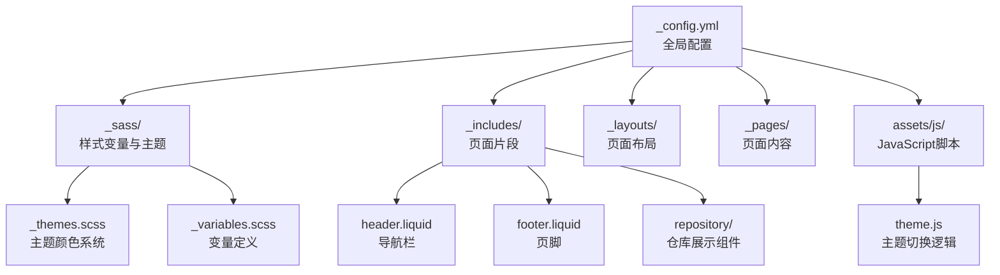
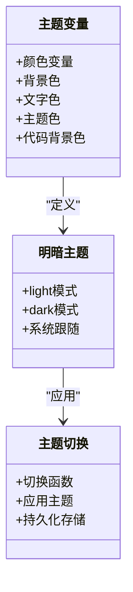
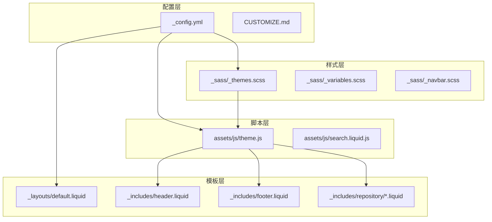
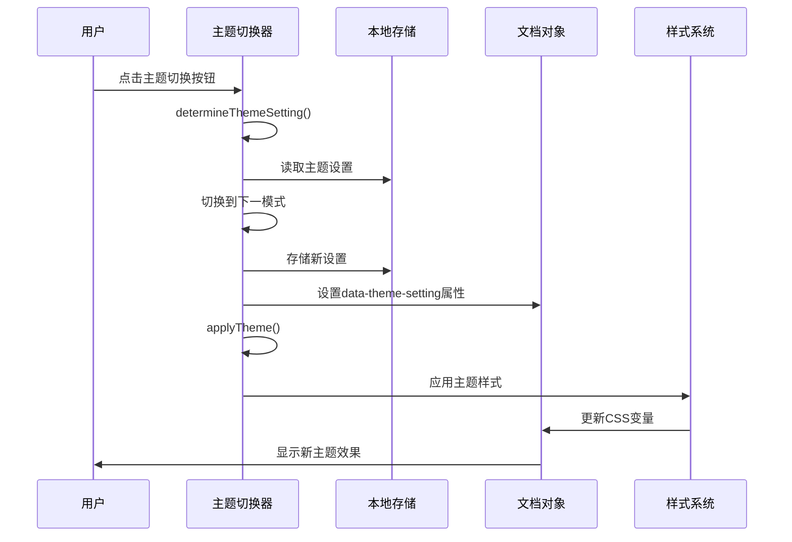
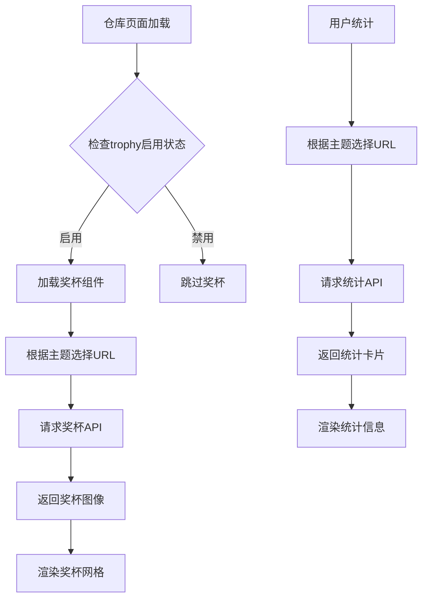
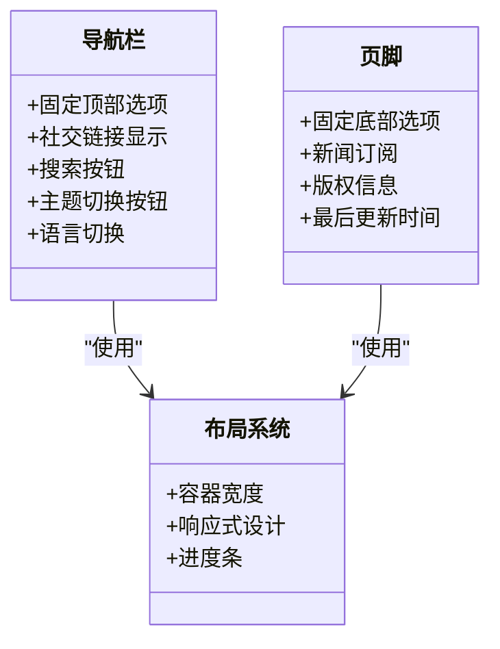
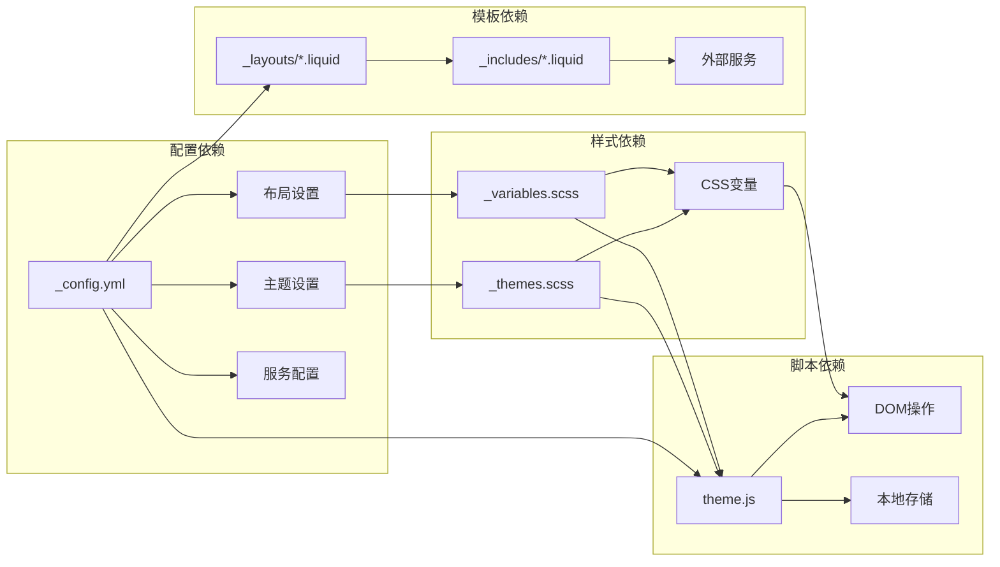

# 主题定制配置

<cite>
**本文档引用的文件**
- [_config.yml](file://_config.yml)
- [CUSTOMIZE.md](file://CUSTOMIZE.md)
- [_sass/_themes.scss](file://_sass/_themes.scss)
- [_sass/_variables.scss](file://_sass/_variables.scss)
- [assets/js/theme.js](file://assets/js/theme.js)
- [_includes/header.liquid](file://_includes/header.liquid)
- [_includes/footer.liquid](file://_includes/footer.liquid)
- [_includes/repository/repo_user.liquid](file://_includes/repository/repo_user.liquid)
- [_includes/repository/repo_trophies.liquid](file://_includes/repository/repo_trophies.liquid)
- [_includes/repository/repo.liquid](file://_includes/repository/repo.liquid)
- [_layouts/default.liquid](file://_layouts/default.liquid)
- [_layouts/page.liquid](file://_layouts/page.liquid)
- [_pages/repositories.md](file://_pages/repositories.md)
</cite>

## 目录
1. [简介](#简介)
2. [项目结构](#项目结构)
3. [核心组件](#核心组件)
4. [架构概览](#架构概览)
5. [详细组件分析](#详细组件分析)
6. [依赖关系分析](#依赖关系分析)
7. [性能考虑](#性能考虑)
8. [故障排除指南](#故障排除指南)
9. [结论](#结论)

## 简介

本文件为该Jekyll主题项目的主题定制配置完整文档。重点涵盖以下方面：
- 主题相关的配置选项：repo主题设置（repo_theme_light、repo_theme_dark）、trophy主题配置、外部服务URL设置
- 自定义主题颜色方案与布局参数（max_width、navbar_fixed等）
- 主题切换机制的配置方法与效果预览
- 第三方服务集成配置，如GitHub统计、奖杯显示等
- 主题定制的最佳实践与常见问题解决方案

## 项目结构

该项目采用标准的Jekyll项目结构，主题定制涉及的关键目录与文件如下：

**图表来源**
- [_config.yml:26-64](file://_config.yml#L26-L64)
- [_sass/_themes.scss:1-209](file://_sass/_themes.scss#L1-L209)
- [_sass/_variables.scss:1-53](file://_sass/_variables.scss#L1-L53)
- [assets/js/theme.js:1-343](file://assets/js/theme.js#L1-L343)
- [_includes/header.liquid:1-108](file://_includes/header.liquid#L1-L108)
- [_includes/footer.liquid:1-31](file://_includes/footer.liquid#L1-L31)
- [_includes/repository/repo_user.liquid:1-34](file://_includes/repository/repo_user.liquid#L1-L34)
- [_includes/repository/repo_trophies.liquid:1-42](file://_includes/repository/repo_trophies.liquid#L1-L42)
- [_includes/repository/repo.liquid:1-47](file://_includes/repository/repo.liquid#L1-L47)
- [_layouts/default.liquid:1-57](file://_layouts/default.liquid#L1-L57)
- [_layouts/page.liquid:1-32](file://_layouts/page.liquid#L1-L32)

**章节来源**
- [_config.yml:26-64](file://_config.yml#L26-L64)
- [_sass/_themes.scss:1-209](file://_sass/_themes.scss#L1-L209)
- [_sass/_variables.scss:1-53](file://_sass/_variables.scss#L1-L53)
- [assets/js/theme.js:1-343](file://assets/js/theme.js#L1-L343)
- [_includes/header.liquid:1-108](file://_includes/header.liquid#L1-L108)
- [_includes/footer.liquid:1-31](file://_includes/footer.liquid#L1-L31)
- [_includes/repository/repo_user.liquid:1-34](file://_includes/repository/repo_user.liquid#L1-L34)
- [_includes/repository/repo_trophies.liquid:1-42](file://_includes/repository/repo_trophies.liquid#L1-L42)
- [_includes/repository/repo.liquid:1-47](file://_includes/repository/repo.liquid#L1-L47)
- [_layouts/default.liquid:1-57](file://_layouts/default.liquid#L1-L57)
- [_layouts/page.liquid:1-32](file://_layouts/page.liquid#L1-L32)

## 核心组件

### 主题配置总览

主题配置主要集中在配置文件中，涵盖以下关键区域：

- **主题设置区**：定义repo主题颜色方案、trophy主题配置、外部服务URL
- **布局设置区**：控制导航栏固定、页脚固定、搜索功能、最大宽度等
- **第三方服务集成**：GitHub统计、奖杯显示、评论系统等

**章节来源**
- [_config.yml:26-64](file://_config.yml#L26-L64)
- [_config.yml:38-44](file://_config.yml#L38-L44)

### 主题颜色系统

主题颜色系统通过CSS自定义属性与SCSS变量实现，支持明暗两种模式的自动切换。

**图表来源**
- [_sass/_themes.scss:7-122](file://_sass/_themes.scss#L7-L122)
- [_sass/_variables.scss:8-52](file://_sass/_variables.scss#L8-L52)
- [assets/js/theme.js:4-22](file://assets/js/theme.js#L4-L22)

**章节来源**
- [_sass/_themes.scss:1-209](file://_sass/_themes.scss#L1-L209)
- [_sass/_variables.scss:1-53](file://_sass/_variables.scss#L1-L53)
- [assets/js/theme.js:1-343](file://assets/js/theme.js#L1-L343)

### 外部服务集成

项目集成了多个外部服务用于增强功能：

- **GitHub统计服务**：显示用户统计信息和仓库卡片
- **GitHub奖杯服务**：展示GitHub个人奖杯
- **评论系统**：支持Giscus评论

**章节来源**
- [_config.yml:38-44](file://_config.yml#L38-L44)
- [_includes/repository/repo_user.liquid:21-34](file://_includes/repository/repo_user.liquid#L21-L34)
- [_includes/repository/repo_trophies.liquid:1-42](file://_includes/repository/repo_trophies.liquid#L1-L42)
- [_pages/repositories.md:1-48](file://_pages/repositories.md#L1-L48)

## 架构概览

主题定制架构由配置层、样式层、脚本层和模板层组成，各层协同工作实现完整的主题定制功能。

**图表来源**
- [_config.yml:26-64](file://_config.yml#L26-L64)
- [_sass/_themes.scss:1-209](file://_sass/_themes.scss#L1-L209)
- [assets/js/theme.js:1-343](file://assets/js/theme.js#L1-L343)
- [_layouts/default.liquid:1-57](file://_layouts/default.liquid#L1-L57)
- [_includes/header.liquid:1-108](file://_includes/header.liquid#L1-L108)
- [_includes/footer.liquid:1-31](file://_includes/footer.liquid#L1-L31)
- [_includes/repository/repo_user.liquid:1-34](file://_includes/repository/repo_user.liquid#L1-L34)

## 详细组件分析

### 主题切换机制

主题切换机制是整个主题系统的核心，实现了三种模式的无缝切换：

**图表来源**
- [assets/js/theme.js:4-22](file://assets/js/theme.js#L4-L22)
- [assets/js/theme.js:25-91](file://assets/js/theme.js#L25-L91)
- [assets/js/theme.js:294-312](file://assets/js/theme.js#L294-L312)

**章节来源**
- [assets/js/theme.js:1-343](file://assets/js/theme.js#L1-L343)

### GitHub统计与奖杯展示

仓库统计和奖杯展示通过外部服务API实现动态内容加载：

**图表来源**
- [_pages/repositories.md:22-35](file://_pages/repositories.md#L22-L35)
- [_includes/repository/repo_user.liquid:21-34](file://_includes/repository/repo_user.liquid#L21-L34)
- [_includes/repository/repo_trophies.liquid:1-42](file://_includes/repository/repo_trophies.liquid#L1-L42)

**章节来源**
- [_pages/repositories.md:1-48](file://_pages/repositories.md#L1-L48)
- [_includes/repository/repo_user.liquid:1-34](file://_includes/repository/repo_user.liquid#L1-L34)
- [_includes/repository/repo_trophies.liquid:1-42](file://_includes/repository/repo_trophies.liquid#L1-L42)

### 导航栏与页脚定制

导航栏和页脚提供了丰富的定制选项，支持固定位置、社交链接、搜索等功能：

**图表来源**
- [_includes/header.liquid:3-98](file://_includes/header.liquid#L3-L98)
- [_includes/footer.liquid:14-30](file://_includes/footer.liquid#L14-L30)
- [_layouts/default.liquid:19-48](file://_layouts/default.liquid#L19-L48)
- [_sass/_variables.scss:51-52](file://_sass/_variables.scss#L51-L52)

**章节来源**
- [_includes/header.liquid:1-108](file://_includes/header.liquid#L1-L108)
- [_includes/footer.liquid:1-31](file://_includes/footer.liquid#L1-L31)
- [_layouts/default.liquid:1-57](file://_layouts/default.liquid#L1-L57)
- [_sass/_variables.scss:51-52](file://_sass/_variables.scss#L51-L52)

## 依赖关系分析

主题系统的依赖关系呈现层次化结构，从配置到样式的完整链路如下：

**图表来源**
- [_config.yml:26-64](file://_config.yml#L26-L64)
- [_sass/_themes.scss:1-209](file://_sass/_themes.scss#L1-L209)
- [_sass/_variables.scss:1-53](file://_sass/_variables.scss#L1-L53)
- [assets/js/theme.js:1-343](file://assets/js/theme.js#L1-L343)
- [_layouts/default.liquid:1-57](file://_layouts/default.liquid#L1-L57)
- [_includes/header.liquid:1-108](file://_includes/header.liquid#L1-L108)

**章节来源**
- [_config.yml:26-64](file://_config.yml#L26-L64)
- [_sass/_themes.scss:1-209](file://_sass/_themes.scss#L1-L209)
- [_sass/_variables.scss:1-53](file://_sass/_variables.scss#L1-L53)
- [assets/js/theme.js:1-343](file://assets/js/theme.js#L1-L343)

## 性能考虑

主题系统在性能方面采用了多项优化策略：

- **懒加载机制**：图片和外部资源按需加载
- **CSS变量缓存**：减少重复计算和重绘
- **事件委托**：优化交互事件处理
- **响应式设计**：适配不同设备尺寸

## 故障排除指南

### 常见问题与解决方案

**主题切换无效**
- 检查浏览器是否支持CSS变量
- 确认JavaScript文件正确加载
- 验证本地存储权限设置

**外部服务加载失败**
- 检查网络连接和防火墙设置
- 验证外部服务URL配置
- 考虑使用自托管服务实例

**样式显示异常**
- 清除浏览器缓存
- 检查自定义CSS覆盖
- 验证SCSS编译结果

**章节来源**
- [assets/js/theme.js:294-312](file://assets/js/theme.js#L294-L312)
- [_config.yml:38-44](file://_config.yml#L38-L44)

## 结论

该主题定制配置系统提供了完整的主题管理和个性化功能。通过合理的配置文件组织、清晰的样式架构和完善的脚本逻辑，实现了高度可定制的主题体验。建议在实际使用中：

1. 优先使用配置文件进行主题定制，避免直接修改源码
2. 充分利用CSS变量系统，确保主题一致性
3. 合理配置外部服务，平衡功能与性能
4. 定期更新主题版本，保持安全性与兼容性