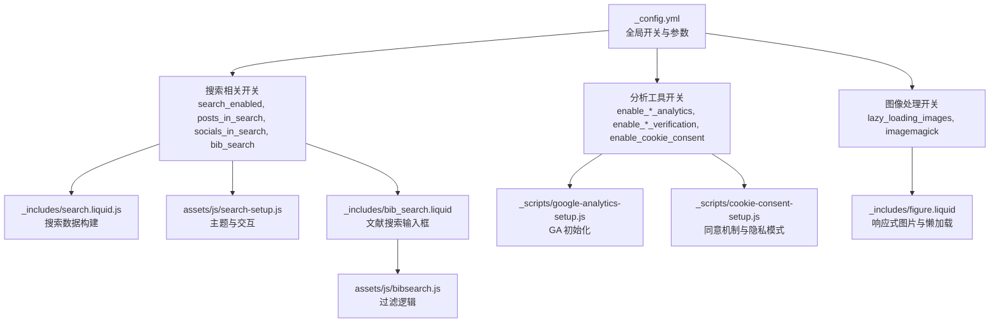
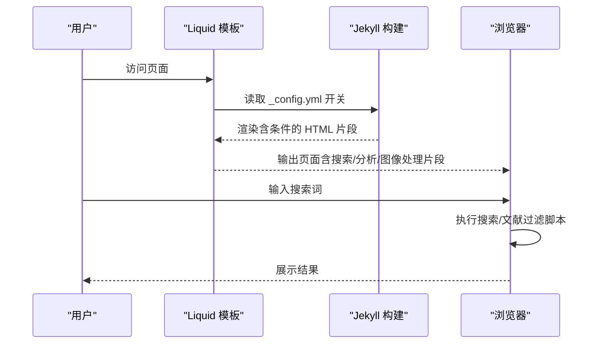
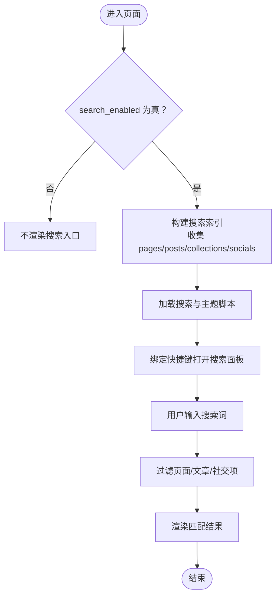
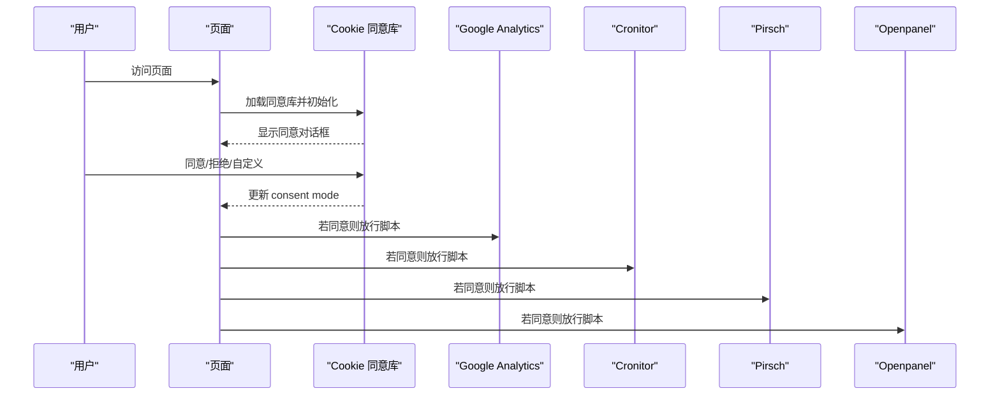
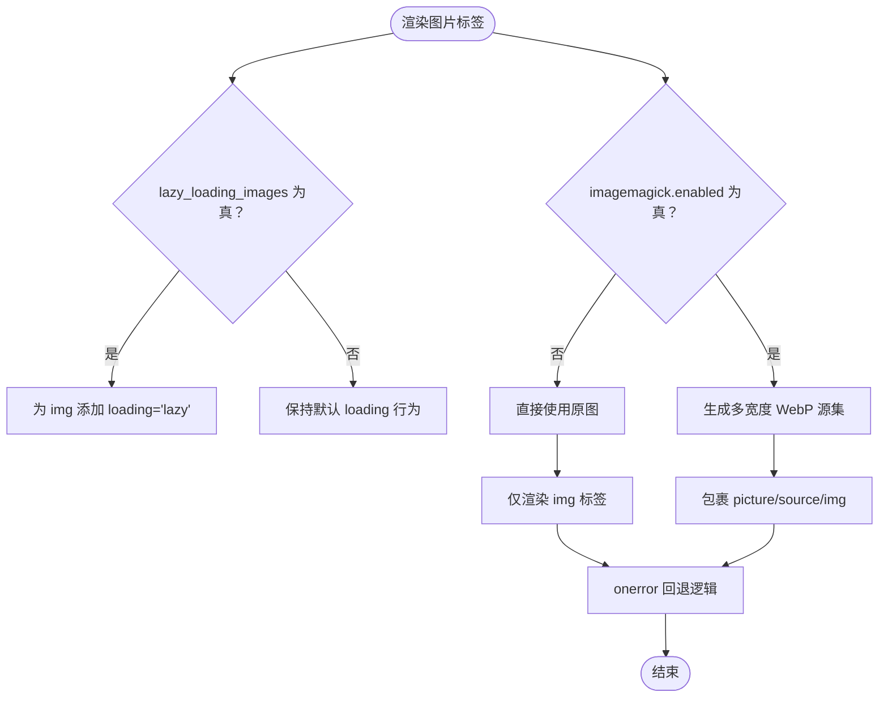
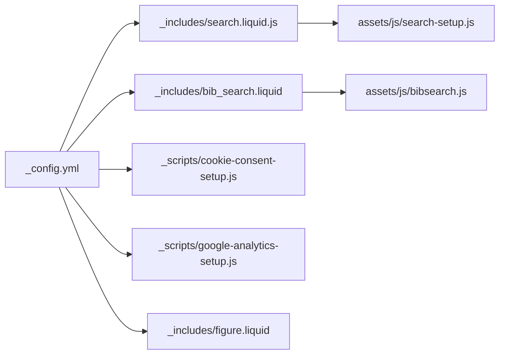

# 功能开关配置

<cite>
**本文档引用的文件**
- [_config.yml](file://_config.yml)
- [ANALYTICS.md](file://ANALYTICS.md)
- [SEO.md](file://SEO.md)
- [TROUBLESHOOTING.md](file://TROUBLESHOOTING.md)
- [_includes/bib_search.liquid](file://_includes/bib_search.liquid)
- [_includes/figure.liquid](file://_includes/figure.liquid)
- [_scripts/cookie-consent-setup.js](file://_scripts/cookie-consent-setup.js)
- [_scripts/google-analytics-setup.js](file://_scripts/google-analytics-setup.js)
- [_scripts/search.liquid.js](file://_scripts/search.liquid.js)
- [assets/js/bibsearch.js](file://assets/js/bibsearch.js)
- [assets/js/search-setup.js](file://assets/js/search-setup.js)
- [CUSTOMIZE.md](file://CUSTOMIZE.md)
</cite>

## 目录
1. [简介](#简介)
2. [项目结构](#项目结构)
3. [核心组件](#核心组件)
4. [架构总览](#架构总览)
5. [详细组件分析](#详细组件分析)
6. [依赖关系分析](#依赖关系分析)
7. [性能考量](#性能考量)
8. [故障排除指南](#故障排除指南)
9. [结论](#结论)
10. [附录](#附录)

## 简介
本文件面向功能开关配置的使用者与维护者，系统性梳理与搜索引擎、分析工具、图像处理相关的功能开关及其影响范围、启用条件、组合使用建议与性能权衡。内容基于实际配置文件与模板实现进行归纳总结，帮助读者在不深入代码的前提下正确启用与调试各项功能。

## 项目结构
围绕功能开关的关键位置如下：
- 全局配置：_config.yml 中集中定义各类开关与参数
- 搜索功能：搜索入口与索引生成由 Liquid 模板与前端脚本协同完成
- 分析工具：支持多类分析服务，结合 Cookie 同意机制实现合规追踪
- 图像处理：响应式图片与懒加载策略通过配置与模板共同生效

**图表来源**
- [_config.yml](file://_config.yml)
- [_includes/search.liquid.js](file://_scripts/search.liquid.js)
- [assets/js/search-setup.js](file://assets/js/search-setup.js)
- [_includes/bib_search.liquid](file://_includes/bib_search.liquid)
- [assets/js/bibsearch.js](file://assets/js/bibsearch.js)
- [_scripts/google-analytics-setup.js](file://_scripts/google-analytics-setup.js)
- [_scripts/cookie-consent-setup.js](file://_scripts/cookie-consent-setup.js)
- [_includes/figure.liquid](file://_includes/figure.liquid)

**章节来源**
- [_config.yml](file://_config.yml)
- [_includes/search.liquid.js](file://_scripts/search.liquid.js)
- [assets/js/search-setup.js](file://assets/js/search-setup.js)
- [_includes/bib_search.liquid](file://_includes/bib_search.liquid)
- [assets/js/bibsearch.js](file://assets/js/bibsearch.js)
- [_scripts/google-analytics-setup.js](file://_scripts/google-analytics-setup.js)
- [_scripts/cookie-consent-setup.js](file://_scripts/cookie-consent-setup.js)
- [_includes/figure.liquid](file://_includes/figure.liquid)

## 核心组件
本节聚焦三大类功能开关：搜索引擎、分析工具、图像处理。

- 搜索引擎配置
  - search_enabled：控制是否启用站点内搜索入口与快捷键
  - posts_in_search：控制博客文章是否纳入搜索索引
  - socials_in_search：控制社交链接是否纳入搜索索引
  - bib_search：控制文献搜索输入框的显示与行为

- 分析工具开关
  - enable_google_analytics：启用 Google Analytics（GA4）
  - enable_cronitor_analytics：启用 Cronitor 实时用户监控
  - enable_pirsch_analytics：启用 Pirsch 分析
  - enable_openpanel_analytics：启用 Openpanel 分析
  - enable_google_verification / enable_bing_verification：启用搜索引擎验证
  - enable_cookie_consent：启用 GDPR 合规的 Cookie 同意对话框

- 图像处理配置
  - lazy_loading_images：启用图片懒加载
  - imagemagick.enabled：启用响应式图片（WebP）与多宽度源集
  - imagemagick.widths：指定响应式图片宽度列表
  - imagemagick.input_directories / input_formats / output_formats：输入输出格式与目录

**章节来源**
- [_config.yml](file://_config.yml)
- [_includes/bib_search.liquid](file://_includes/bib_search.liquid)
- [_includes/figure.liquid](file://_includes/figure.liquid)
- [_scripts/cookie-consent-setup.js](file://_scripts/cookie-consent-setup.js)
- [_scripts/google-analytics-setup.js](file://_scripts/google-analytics-setup.js)

## 架构总览
下图展示功能开关如何影响页面渲染与运行时行为：

**图表来源**
- [_config.yml](file://_config.yml)
- [_includes/bib_search.liquid](file://_includes/bib_search.liquid)
- [_includes/figure.liquid](file://_includes/figure.liquid)
- [assets/js/bibsearch.js](file://assets/js/bibsearch.js)
- [assets/js/search-setup.js](file://assets/js/search-setup.js)

## 详细组件分析

### 搜索引擎配置
- 关键开关与默认值
  - search_enabled: true
  - posts_in_search: true
  - socials_in_search: true
  - bib_search: true
- 影响范围
  - 搜索入口与快捷键：当 search_enabled 为真时，页面加载搜索数据并绑定快捷键打开搜索面板
  - 博客文章索引：当 posts_in_search 为真时，文章标题、描述与链接被纳入搜索索引
  - 社交链接索引：当 socials_in_search 为真时，社交平台链接可被搜索到
  - 文献搜索输入框：当 bib_search 为真时，显示文献过滤输入框并加载过滤脚本
- 启用条件
  - 需要有效的站点 URL（用于生成绝对链接与索引）
  - 搜索索引在构建阶段生成，首次启用后需重新构建
- 组合使用建议
  - 若仅希望展示搜索入口但不收录文章或社交链接，可分别关闭 posts_in_search 或 socials_in_search
  - 文献搜索与全文搜索可并行使用，但需注意搜索性能与索引体积
- 调试要点
  - 检查 _config.yml 的 url 字段是否完整
  - 确认构建日志无语法错误
  - 使用浏览器开发者工具查看搜索数据是否正确注入

**图表来源**
- [_config.yml](file://_config.yml)
- [_includes/search.liquid.js](file://_scripts/search.liquid.js)
- [assets/js/search-setup.js](file://assets/js/search-setup.js)

**章节来源**
- [_config.yml](file://_config.yml)
- [_includes/search.liquid.js](file://_scripts/search.liquid.js)
- [assets/js/search-setup.js](file://assets/js/search-setup.js)
- [TROUBLESHOOTING.md](file://TROUBLESHOOTING.md)

### 分析工具开关
- 支持的服务与开关
  - Google Analytics：enable_google_analytics + google_analytics
  - Cronitor：enable_cronitor_analytics + cronitor_analytics
  - Pirsch：enable_pirsch_analytics + pirsch_analytics
  - Openpanel：enable_openpanel_analytics + openpanel_analytics
  - 搜索引擎验证：enable_google_verification + google_site_verification；enable_bing_verification + bing_site_verification
  - Cookie 同意：enable_cookie_consent
- 影响范围
  - 启用任一分析服务后，会在页面中按需加载对应脚本
  - 启用 Cookie 同意后，所有分析脚本以 type="text/plain" 并标注 data-category="analytics"，默认阻止执行，待用户同意后再放行
  - Google Consent Mode 在未获得同意前即以隐私模式运行
- 启用条件
  - 必须先在 _config.yml 中开启对应开关并填入相应 ID
  - 对于 Google Analytics，需要 Measurement ID；对于 Cronitor/Pirsch/Openpanel，需要各自的 Site ID/Client ID
  - 若服务要求 Cookie 同意（如 Google Analytics、Cronitor），必须同时启用 enable_cookie_consent
- 组合使用建议
  - 优先选择隐私友好型服务（如 Pirsch、Openpanel），减少 Cookie 同意复杂度
  - 若必须使用 Google Analytics，务必启用 Cookie 同意并提供清晰的隐私政策
- 调试要点
  - 在浏览器开发者工具 Network 面板确认脚本已加载且 ID 正确
  - 使用 Realtime/报告核验数据是否上报
  - 若启用 Cookie 同意，检查同意对话框是否正常弹出，且更新后能正确反映用户偏好

**图表来源**
- [_scripts/cookie-consent-setup.js](file://_scripts/cookie-consent-setup.js)
- [_scripts/google-analytics-setup.js](file://_scripts/google-analytics-setup.js)
- [ANALYTICS.md](file://ANALYTICS.md)

**章节来源**
- [_config.yml](file://_config.yml)
- [_scripts/cookie-consent-setup.js](file://_scripts/cookie-consent-setup.js)
- [_scripts/google-analytics-setup.js](file://_scripts/google-analytics-setup.js)
- [ANALYTICS.md](file://ANALYTICS.md)
- [CUSTOMIZE.md](file://CUSTOMIZE.md)

### 图像处理配置
- 关键开关与默认值
  - lazy_loading_images: true
  - imagemagick.enabled: true
  - imagemagick.widths: [480, 800, 1400]
  - imagemagick.input_directories: ["assets/img/"]
  - imagemagick.input_formats: [".jpg", ".jpeg", ".png", ".tiff", ".gif"]
  - imagemagick.output_formats.webp: "-auto-orient -quality 85"
- 影响范围
  - 懒加载：为所有图片添加 loading="lazy"，提升首屏性能
  - 响应式图片：根据设备像素密度与视口宽度选择合适尺寸的 WebP 图片
  - 容错回退：若转换失败，自动回退到原图
- 启用条件
  - 需要在系统安装并配置 ImageMagick，确保 convert 命令可用
  - 需要正确的输入路径与格式配置
- 组合使用建议
  - 建议配合懒加载使用，避免一次性加载过多大图
  - 合理设置 widths，兼顾加载速度与画质
- 调试要点
  - 检查 ImageMagick 是否安装成功（命令行运行 convert -version）
  - 查看浏览器 Network 面板确认 WebP 资源是否返回
  - 若出现图片不显示，检查 onerror 回退逻辑是否触发

**图表来源**
- [_config.yml](file://_config.yml)
- [_includes/figure.liquid](file://_includes/figure.liquid)

**章节来源**
- [_config.yml](file://_config.yml)
- [_includes/figure.liquid](file://_includes/figure.liquid)

## 依赖关系分析
- 配置到模板的依赖
  - _config.yml 中的开关直接影响 Liquid 模板的条件渲染
  - 搜索数据由 _scripts/search.liquid.js 在构建期注入，运行时由 assets/js/search-setup.js 控制交互
  - 文献搜索由 _includes/bib_search.liquid 条件加载 assets/js/bibsearch.js
- 运行时依赖
  - Cookie 同意库与 Google Consent Mode 需在页面早期加载并初始化
  - 分析脚本在获得同意后才放行执行
- 外部依赖
  - ImageMagick：用于生成响应式 WebP 图片
  - 第三方库版本与完整性校验在 _config.yml 的 third_party_libraries 中声明

**图表来源**
- [_config.yml](file://_config.yml)
- [_includes/search.liquid.js](file://_scripts/search.liquid.js)
- [_includes/bib_search.liquid](file://_includes/bib_search.liquid)
- [assets/js/search-setup.js](file://assets/js/search-setup.js)
- [assets/js/bibsearch.js](file://assets/js/bibsearch.js)
- [_scripts/cookie-consent-setup.js](file://_scripts/cookie-consent-setup.js)
- [_scripts/google-analytics-setup.js](file://_scripts/google-analytics-setup.js)
- [_includes/figure.liquid](file://_includes/figure.liquid)

**章节来源**
- [_config.yml](file://_config.yml)
- [_includes/search.liquid.js](file://_scripts/search.liquid.js)
- [_includes/bib_search.liquid](file://_includes/bib_search.liquid)
- [assets/js/search-setup.js](file://assets/js/search-setup.js)
- [assets/js/bibsearch.js](file://assets/js/bibsearch.js)
- [_scripts/cookie-consent-setup.js](file://_scripts/cookie-consent-setup.js)
- [_scripts/google-analytics-setup.js](file://_scripts/google-analytics-setup.js)
- [_includes/figure.liquid](file://_includes/figure.liquid)

## 性能考量
- 搜索性能
  - 搜索索引越大，构建时间越长，查询延迟可能上升
  - 可通过关闭 posts_in_search 或 socials_in_search 减少索引体量
- 分析工具
  - 启用 Cookie 同意会增加一次库加载与初始化开销，但换取更好的合规性
  - 多个分析服务同时启用会增加网络请求与潜在的资源竞争
- 图像处理
  - 响应式图片与懒加载显著改善首屏加载体验
  - ImageMagick 转换过程可能消耗较多 CPU，建议在 CI 中预处理或限制输入格式

[本节为通用指导，无需特定文件引用]

## 故障排除指南
- 搜索功能异常
  - 确认 search_enabled 已开启，且 _config.yml 的 url 字段完整
  - 检查构建日志是否存在语法错误
  - 参考故障排除文档中的“Search not working”条目
- 分析工具未生效
  - 确认对应开关已开启并填写了正确的 ID
  - 若使用 Google Analytics 或 Cronitor，需同时启用 Cookie 同意
  - 检查浏览器 Network 面板与 Realtime 报告
- Cookie 同意对话框问题
  - 确认 enable_cookie_consent 已开启
  - 检查同意库是否成功加载，以及 consent mode 是否正确更新
- 图像处理失败
  - 确认 ImageMagick 已安装且 convert 命令可用
  - 检查输入路径与格式是否在配置范围内
  - 观察 onerror 回退逻辑是否触发

**章节来源**
- [TROUBLESHOOTING.md](file://TROUBLESHOOTING.md)
- [_config.yml](file://_config.yml)
- [_scripts/cookie-consent-setup.js](file://_scripts/cookie-consent-setup.js)
- [_includes/figure.liquid](file://_includes/figure.liquid)

## 结论
通过对搜索、分析与图像处理三类功能开关的系统梳理，可以实现：
- 精准控制站点功能边界，按需启用与禁用
- 在性能与用户体验之间取得平衡
- 在合规前提下灵活集成分析工具
- 以最小成本获得响应式图片与懒加载收益

建议在生产环境优先采用隐私友好型分析方案，并结合 Cookie 同意机制满足合规要求；在启用响应式图片与懒加载的同时，关注构建与运行时的资源消耗。

[本节为总结性内容，无需特定文件引用]

## 附录
- 相关文档与参考
  - SEO 最佳实践：站点元数据、Open Graph、Schema.org、搜索引擎验证
  - 分析工具对比与启用步骤：Google Analytics、Pirsch、Openpanel、Cronitor
  - 自定义指南：Cookie 同意对话框定制、第三方库版本管理

**章节来源**
- [SEO.md](file://SEO.md)
- [ANALYTICS.md](file://ANALYTICS.md)
- [CUSTOMIZE.md](file://CUSTOMIZE.md)