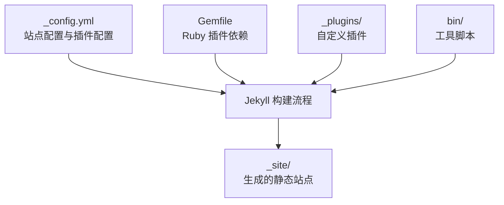
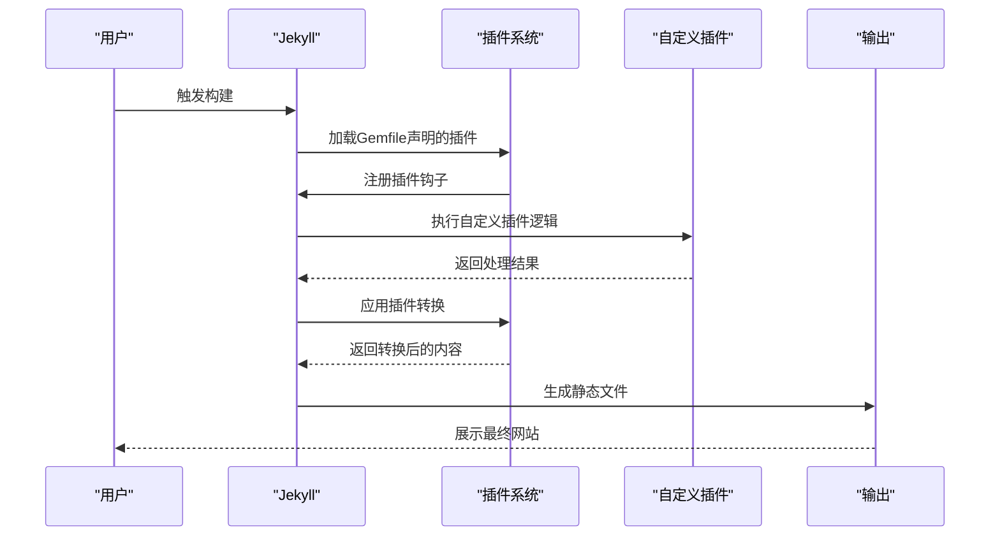
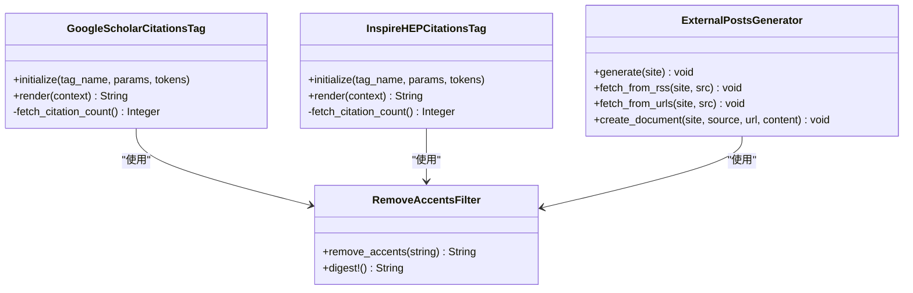
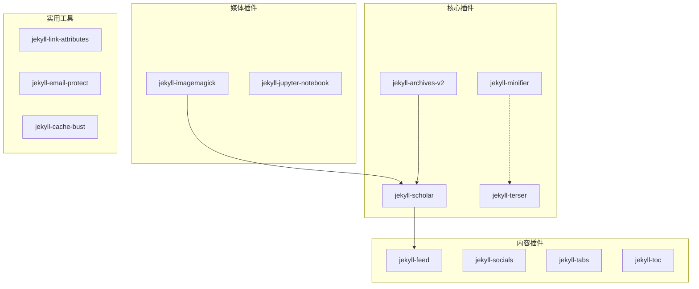

# 插件配置管理

<cite>
**本文档引用的文件**
- [_config.yml](file://_config.yml)
- [Gemfile](file://Gemfile)
- [INSTALL.md](file://INSTALL.md)
- [TROUBLESHOOTING.md](file://TROUBLESHOOTING.md)
- [README.md](file://README.md)
- [CUSTOMIZE.md](file://CUSTOMIZE.md)
- [google-scholar-citations.rb](file://_plugins/google-scholar-citations.rb)
- [inspirehep-citations.rb](file://_plugins/inspirehep-citations.rb)
- [remove-accents.rb](file://_plugins/remove-accents.rb)
- [details.rb](file://_plugins/details.rb)
- [external-posts.rb](file://_plugins/external-posts.rb)
- [file-exists.rb](file://_plugins/file-exists.rb)
- [hide-custom-bibtex.rb](file://_plugins/hide-custom-bibtex.rb)
- [update_scholar_citations.py](file://bin/update_scholar_citations.py)
</cite>

## 目录
1. [简介](#简介)
2. [项目结构](#项目结构)
3. [核心组件](#核心组件)
4. [架构概览](#架构概览)
5. [详细组件分析](#详细组件分析)
6. [依赖关系分析](#依赖关系分析)
7. [性能考虑](#性能考虑)
8. [故障排除指南](#故障排除指南)
9. [结论](#结论)

## 简介

本文件为该Jekyll博客项目的插件配置管理文档，系统性地阐述了Jekyll插件系统的配置方法与最佳实践。内容涵盖插件列表配置、插件特定配置（如jekyll-scholar、jekyll-minifier等）、插件的安装与启用、禁用方法、最佳实践与兼容性考虑、插件间依赖关系与冲突处理，以及故障排除和性能优化指南。文档面向不同技术水平的用户，提供从入门到进阶的完整指导。

## 项目结构

该项目采用标准的Jekyll项目结构，插件配置主要集中在以下位置：

- 核心配置：`_config.yml` - 定义站点设置、插件列表及各插件的特定配置
- 依赖管理：`Gemfile` - 使用Bundler声明Ruby插件依赖
- 自定义插件：`_plugins/` - 包含自定义Liquid标签、过滤器和生成器
- 工具脚本：`bin/` - 提供外部工具脚本，如Google Scholar引用更新

**图表来源**
- [_config.yml](file://_config.yml)
- [Gemfile](file://Gemfile)

**章节来源**
- [_config.yml](file://_config.yml)
- [Gemfile](file://Gemfile)

## 核心组件

### 插件列表配置

在 `_config.yml` 的 `plugins` 部分集中声明所有Jekyll插件。当前启用的插件包括：
- jekyll-3rd-party-libraries：第三方库管理
- jekyll-archives-v2：文章归档功能
- jekyll-cache-bust：缓存破坏机制
- jekyll-email-protect：邮箱保护
- jekyll-feed：RSS/Atom订阅源
- jekyll-get-json：获取外部JSON数据
- jekyll-imagemagick：响应式WebP图片
- jekyll-jupyter-notebook：Jupyter Notebook集成
- jekyll-link-attributes：链接属性控制
- jekyll-minifier：HTML/CSS/JS压缩
- jekyll-paginate-v2：分页功能
- jekyll-regex-replace：正则替换
- jekyll/scholar：学术文献管理
- jekyll-sitemap：站点地图
- jekyll-socials：社交链接
- jekyll-tabs：标签页支持
- jekyll-terser：JavaScript压缩
- jekyll-toc：目录生成
- jekyll-twitter-plugin：Twitter集成
- jemoji：表情符号支持

### 插件特定配置

#### Jekyll Minifier配置
- 关闭内置jekyll-minifier的JavaScript压缩，改用jekyll-terser作为JS压缩器
- 排除特定文件（如robots.txt、搜索相关的JS文件）不进行压缩

#### Terser配置
- 启用移除console.log的压缩选项

#### Jekyll Archives配置
- 为文章创建按年份、标签、分类的归档页面
- 自定义归档链接格式

#### Jekyll Scholar配置
- 设置作者姓名匹配规则（姓氏：Li；名字：Mingyu, M.）
- 指定BibTeX文件路径和模板
- 启用多种输出样式（APA、LaTeX、smallcaps、superscript）
- 配置出版物徽章显示（Altmetric、Dimensions、Google Scholar、INSPIRE HEP）

#### Jekyll Link Attributes配置
- 默认为外部链接添加rel、target等属性
- 可配置排除规则

#### 响应式WebP图片配置
- 启用响应式图片功能
- 配置宽度、输入输出格式、质量参数

**章节来源**
- [_config.yml](file://_config.yml)

## 架构概览

Jekyll构建过程中，插件通过以下层次协同工作：

**图表来源**
- [Gemfile](file://Gemfile)
- [_config.yml](file://_config.yml)

## 详细组件分析

### 自定义插件体系

项目实现了多个自定义插件来扩展Jekyll功能：

#### 学术引用插件
- `google-scholar-citations.rb`：从Google Scholar抓取引用次数
- `inspirehep-citations.rb`：从INSPIRE HEP API获取高能物理文献引用

#### 内容处理插件
- `remove-accents.rb`：移除字符串重音符号
- `hide-custom-bibtex.rb`：过滤BibTeX字段中的内部关键词
- `details.rb`：支持HTML details/summary标签

#### 外部内容集成
- `external-posts.rb`：从RSS或URL抓取外部博客内容
- `file-exists.rb`：检查文件是否存在

#### 文献管理辅助
- `update_scholar_citations.py`：Python脚本自动更新Google Scholar引用数据

**图表来源**
- [google-scholar-citations.rb](file://_plugins/google-scholar-citations.rb)
- [inspirehep-citations.rb](file://_plugins/inspirehep-citations.rb)
- [external-posts.rb](file://_plugins/external-posts.rb)
- [remove-accents.rb](file://_plugins/remove-accents.rb)

**章节来源**
- [google-scholar-citations.rb](file://_plugins/google-scholar-citations.rb)
- [inspirehep-citations.rb](file://_plugins/inspirehep-citations.rb)
- [remove-accents.rb](file://_plugins/remove-accents.rb)
- [details.rb](file://_plugins/details.rb)
- [external-posts.rb](file://_plugins/external-posts.rb)
- [file-exists.rb](file://_plugins/file-exists.rb)
- [hide-custom-bibtex.rb](file://_plugins/hide-custom-bibtex.rb)
- [update_scholar_citations.py](file://bin/update_scholar_citations.py)

### 插件安装与管理

#### 使用Bundler管理Ruby插件
- 在Gemfile的`:jekyll_plugins`组中声明所需插件
- 使用`bundle install`安装依赖
- 使用`bundle update`更新插件版本

#### 插件启用与禁用
- 通过修改`_config.yml`中的`plugins`数组启用或禁用插件
- 自定义插件位于`_plugins/`目录，无需额外声明即可生效

**章节来源**
- [Gemfile](file://Gemfile)
- [_config.yml](file://_config.yml)

### 配置最佳实践

#### 插件配置优先级
1. 站点级配置：在`_config.yml`中设置全局插件配置
2. 页面级配置：通过页面frontmatter覆盖特定页面的插件行为
3. 组件级配置：某些插件支持在Liquid模板中动态配置

#### 兼容性考虑
- 确保插件版本与Jekyll版本兼容
- 注意插件间的潜在冲突（如多个压缩器同时启用）
- 考虑插件对构建时间的影响

#### 性能优化
- 合理配置缓存策略
- 选择性启用耗时插件
- 使用响应式图片减少带宽消耗

## 依赖关系分析

**图表来源**
- [Gemfile](file://Gemfile)
- [_config.yml](file://_config.yml)

**章节来源**
- [Gemfile](file://Gemfile)
- [_config.yml](file://_config.yml)

## 性能考虑

### 构建性能优化

1. **插件选择性启用**
   - 仅启用必要的插件以减少构建时间
   - 对于开发环境和生产环境使用不同的插件配置

2. **缓存策略**
   - 利用jekyll-cache-bust避免浏览器缓存问题
   - 合理设置响应式图片缓存头

3. **资源优化**
   - 使用jekyll-terser替代jekyll-minifier进行JavaScript压缩
   - 配置图片质量参数平衡质量和体积

### 运行时性能

1. **异步处理**
   - 自定义插件中实现适当的延迟和错误处理
   - 避免在Liquid渲染过程中执行耗时操作

2. **内存管理**
   - 注意大型BibTeX文件的处理
   - 合理配置Python脚本的超时和重试机制

## 故障排除指南

### 常见问题与解决方案

#### 插件加载失败
- 检查Gemfile中的依赖声明是否正确
- 确认使用`bundle install`安装了所有依赖
- 验证插件版本与Jekyll版本兼容性

#### 构建错误
- 使用`bundle exec jekyll build`本地验证构建
- 检查YAML语法错误（特殊字符未转义、缩进不正确）
- 确认文件路径大小写敏感性

#### 功能异常
- 对于Google Scholar引用统计，检查网络连接和API限制
- 验证外部RSS源的可用性和格式正确性
- 检查自定义插件的权限和依赖

#### 性能问题
- 分析构建日志中的耗时插件
- 调整响应式图片配置减少带宽
- 优化BibTeX文件大小和结构

**章节来源**
- [TROUBLESHOOTING.md](file://TROUBLESHOOTING.md)
- [INSTALL.md](file://INSTALL.md)

## 结论

该Jekyll项目通过精心设计的插件配置实现了强大的功能扩展。核心特点包括：

1. **模块化插件架构**：通过Gemfile和_config.yml实现清晰的插件管理
2. **自定义插件扩展**：针对学术发布和内容管理需求开发的专用插件
3. **性能优化策略**：合理的插件选择和配置确保良好的构建和运行性能
4. **故障排除机制**：完善的错误处理和调试工具

建议在实际使用中：
- 根据项目需求选择合适的插件组合
- 定期更新插件版本以获得最新功能和安全修复
- 建立插件使用的文档和测试流程
- 监控构建性能并及时调整配置

通过遵循本文档的指导原则，用户可以有效地管理和优化Jekyll插件系统，构建高质量的学术和个人网站。