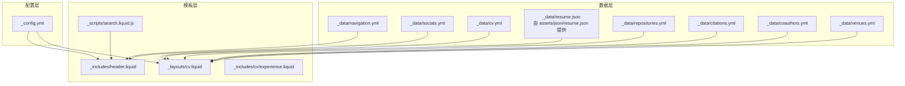
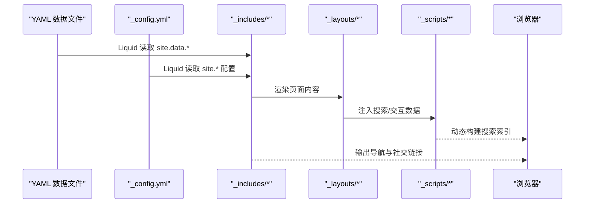
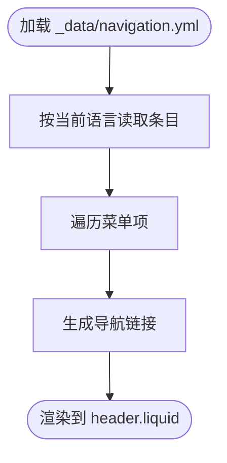
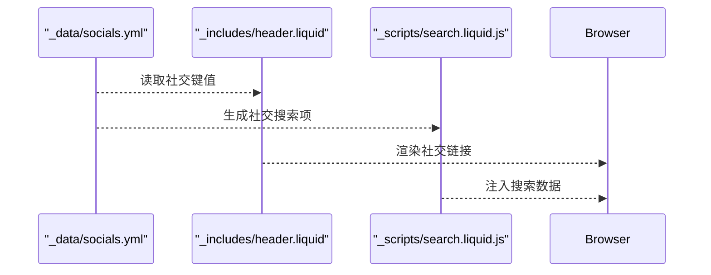
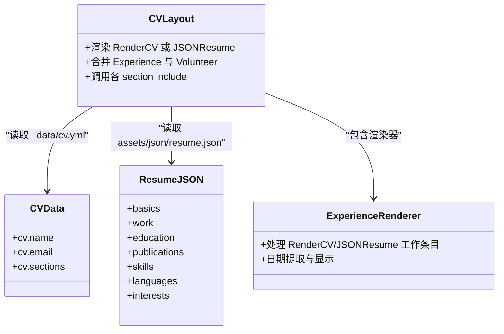
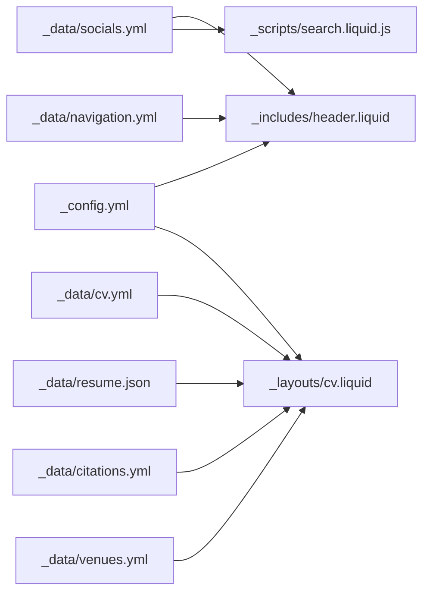

# 数据配置管理

<cite>
**本文档引用的文件**
- [_data/navigation.yml](file://_data/navigation.yml)
- [_data/socials.yml](file://_data/socials.yml)
- [_data/cv.yml](file://_data/cv.yml)
- [_data/repositories.yml](file://_data/repositories.yml)
- [_data/citations.yml](file://_data/citations.yml)
- [_data/coauthors.yml](file://_data/coauthors.yml)
- [_data/venues.yml](file://_data/venues.yml)
- [_config.yml](file://_config.yml)
- [_includes/header.liquid](file://_includes/header.liquid)
- [_layouts/cv.liquid](file://_layouts/cv.liquid)
- [_includes/cv/experience.liquid](file://_includes/cv/experience.liquid)
- [_scripts/search.liquid.js](file://_scripts/search.liquid.js)
- [CUSTOMIZE.md](file://CUSTOMIZE.md)
- [.github/instructions/yaml-configuration.instructions.md](file://.github/instructions/yaml-configuration.instructions.md)
</cite>

## 目录
1. [简介](#简介)
2. [项目结构](#项目结构)
3. [核心组件](#核心组件)
4. [架构总览](#架构总览)
5. [详细组件分析](#详细组件分析)
6. [依赖关系分析](#依赖关系分析)
7. [性能考量](#性能考量)
8. [故障排查指南](#故障排查指南)
9. [结论](#结论)
10. [附录](#附录)

## 简介
本文件系统性梳理该 Jekyll 站点的数据配置体系，聚焦于 YAML 数据文件的结构与配置方法，涵盖导航菜单、社交媒体链接、简历数据等关键模块。文档提供字段定义、数据类型、验证规则与格式要求，解释数据文件间的关联与依赖，给出更新与维护最佳实践，并提供调试方法与常见问题排查清单。

## 项目结构
数据配置主要位于仓库根目录下的 _data 与 _config.yml，模板通过 Liquid 从这些数据源渲染页面。关键路径如下：
- 导航菜单：_data/navigation.yml
- 社交媒体：_data/socials.yml
- 简历数据：_data/cv.yml（支持 RenderCV 格式）；同时可选使用 assets/json/resume.json 的 JSONResume 格式
- 仓库列表：_data/repositories.yml
- 引用与论文：_data/citations.yml
- 合作者映射：_data/coauthors.yml
- 会议/期刊信息：_data/venues.yml
- 全局站点配置：_config.yml
- 模板与渲染：_includes/header.liquid、_layouts/cv.liquid、_includes/cv/*.liquid、_scripts/search.liquid.js

图表来源
- [_data/navigation.yml:1-24](file://_data/navigation.yml#L1-L24)
- [_data/socials.yml:1-6](file://_data/socials.yml#L1-L6)
- [_data/cv.yml:1-95](file://_data/cv.yml#L1-L95)
- [_data/repositories.yml:1-7](file://_data/repositories.yml#L1-L7)
- [_data/citations.yml:1-800](file://_data/citations.yml#L1-L800)
- [_data/coauthors.yml:1-3](file://_data/coauthors.yml#L1-L3)
- [_data/venues.yml:1-10](file://_data/venues.yml#L1-L10)
- [_config.yml:1-656](file://_config.yml#L1-L656)
- [_includes/header.liquid:1-108](file://_includes/header.liquid#L1-L108)
- [_layouts/cv.liquid:1-392](file://_layouts/cv.liquid#L1-L392)
- [_includes/cv/experience.liquid:1-30](file://_includes/cv/experience.liquid#L1-L30)
- [_scripts/search.liquid.js:1-35](file://_scripts/search.liquid.js#L1-L35)

章节来源
- [_config.yml:1-656](file://_config.yml#L1-L656)
- [_includes/header.liquid:1-108](file://_includes/header.liquid#L1-L108)
- [_layouts/cv.liquid:1-392](file://_layouts/cv.liquid#L1-L392)

## 核心组件
本节对各数据文件进行字段定义、数据类型与用途说明，并指出其在模板中的使用位置。

- 导航菜单（_data/navigation.yml）
  - 结构：按语言分组（键名如 en、zh），每组为菜单项数组，项含 title 与 url 字段
  - 类型：字符串；url 建议使用绝对或相对路径
  - 使用：_includes/header.liquid 读取当前语言条目并生成导航
  - 验证：确保每个语言组至少包含首页项；url 不为空且可访问

- 社交媒体（_data/socials.yml）
  - 结构：键值对，键为标识符（如 email、github_username、orcid_id），值为对应账号或 ID
  - 类型：字符串；email 建议符合邮箱格式
  - 使用：_includes/header.liquid 与搜索脚本 _scripts/search.liquid.js 构建社交链接
  - 验证：键名需与模板/脚本映射一致；避免空值

- 简历数据（_data/cv.yml）
  - 结构：顶层 cv 节点下包含基本信息（name、label、email、location、summary 等）与 sections 子节点
  - sections 支持 Education、Experience、Publications、Awards、Skills、Languages、Interests 等
  - 类型：字符串、数值（年份）、布尔、数组（高亮/关键词）、对象（地址、社会网络）
  - 使用：_layouts/cv.liquid 统一渲染；_includes/cv/experience.liquid 处理工作经历
  - 验证：必填字段如 name、email；日期字段建议为年份或标准日期格式；sections 中条目字段保持一致性

- 仓库列表（_data/repositories.yml）
  - 结构：github_users（数组）、repo_description_lines_max（整数）、github_repos（数组）
  - 类型：数组、整数
  - 使用：用于生成仓库展示与描述行数控制
  - 验证：数组元素类型一致；数值非负

- 引用与论文（_data/citations.yml）
  - 结构：metadata.last_updated（字符串）与 papers（字典）；papers 键为 google scholar id，值含 citations、title、year
  - 类型：字符串、整数、字典
  - 使用：配合 Jekyll Scholar 插件在页面中展示引用统计
  - 验证：键名唯一；citations 为非负整数；year 可接受“Unknown Year”等文本

- 合作者映射（_data/coauthors.yml）
  - 结构：注释说明，当前为空
  - 使用：为文献作者链接提供扩展空间
  - 验证：无强制字段，扩展时遵循 YAML 语法规范

- 会议/期刊信息（_data/venues.yml）
  - 结构：键为缩写（如 AJP、PhysRev、Vision），值含 url（可选）与 color（可选）
  - 类型：字符串
  - 使用：为论文列表提供来源链接与颜色标识
  - 验证：url 有效；color 为合法颜色值

章节来源
- [_data/navigation.yml:1-24](file://_data/navigation.yml#L1-L24)
- [_data/socials.yml:1-6](file://_data/socials.yml#L1-L6)
- [_data/cv.yml:1-95](file://_data/cv.yml#L1-L95)
- [_data/repositories.yml:1-7](file://_data/repositories.yml#L1-L7)
- [_data/citations.yml:1-800](file://_data/citations.yml#L1-L800)
- [_data/coauthors.yml:1-3](file://_data/coauthors.yml#L1-L3)
- [_data/venues.yml:1-10](file://_data/venues.yml#L1-L10)
- [_includes/header.liquid:1-108](file://_includes/header.liquid#L1-L108)
- [_layouts/cv.liquid:1-392](file://_layouts/cv.liquid#L1-L392)
- [_includes/cv/experience.liquid:1-30](file://_includes/cv/experience.liquid#L1-L30)
- [_scripts/search.liquid.js:1-35](file://_scripts/search.liquid.js#L1-L35)

## 架构总览
数据流从 YAML 文件进入 Liquid 模板，再由模板渲染为 HTML。全局配置 _config.yml 控制站点行为与第三方集成，_includes 与 _layouts 负责具体页面结构，_scripts 则负责前端交互数据生成。

图表来源
- [_config.yml:1-656](file://_config.yml#L1-L656)
- [_includes/header.liquid:1-108](file://_includes/header.liquid#L1-L108)
- [_layouts/cv.liquid:1-392](file://_layouts/cv.liquid#L1-L392)
- [_scripts/search.liquid.js:1-35](file://_scripts/search.liquid.js#L1-L35)

## 详细组件分析

### 导航菜单配置
- 语言分组：en、zh 分别定义英文与中文菜单项
- 菜单项：title 为显示文本，url 为链接地址
- 模板使用：header.liquid 依据当前语言选择条目并循环输出
- 更新要点：新增语言需在 navigation.yml 中添加对应键；菜单顺序即为显示顺序

图表来源
- [_data/navigation.yml:1-24](file://_data/navigation.yml#L1-L24)
- [_includes/header.liquid:47-60](file://_includes/header.liquid#L47-L60)

章节来源
- [_data/navigation.yml:1-24](file://_data/navigation.yml#L1-L24)
- [_includes/header.liquid:1-108](file://_includes/header.liquid#L1-L108)

### 社交媒体链接配置
- 支持键：email、github_username、orcid_id 等
- 模板使用：header.liquid 展示社交图标；search.liquid.js 将社交信息注入搜索数据
- 更新要点：确保键名与模板/脚本映射一致；email 使用有效邮箱格式

图表来源
- [_data/socials.yml:1-6](file://_data/socials.yml#L1-L6)
- [_includes/header.liquid:27-30](file://_includes/header.liquid#L27-L30)
- [_scripts/search.liquid.js:133-156](file://_scripts/search.liquid.js#L133-L156)

章节来源
- [_data/socials.yml:1-6](file://_data/socials.yml#L1-L6)
- [_scripts/search.liquid.js:133-156](file://_scripts/search.liquid.js#L133-L156)

### 简历数据配置（RenderCV 与 JSONResume）
- RenderCV（_data/cv.yml）
  - 顶层 cv 包含基本信息与 sections
  - sections 下支持多类条目（教育、经验、发表、奖项、技能、语言、兴趣等）
  - 模板：_layouts/cv.liquid 统一渲染；_includes/cv/experience.liquid 处理工作经历
- JSONResume（assets/json/resume.json）
  - 通过 _config.yml 的 jekyll_get_json 插件加载
  - 模板：_layouts/cv.liquid 同样支持 JSONResume 渲染
- 更新要点：优先使用 RenderCV；若同时存在两者，cv.liquid 默认优先 RenderCV；可通过页面前言 cv_format 切换

图表来源
- [_layouts/cv.liquid:1-392](file://_layouts/cv.liquid#L1-L392)
- [_includes/cv/experience.liquid:1-30](file://_includes/cv/experience.liquid#L1-L30)
- [_config.yml:639-656](file://_config.yml#L639-L656)

章节来源
- [_data/cv.yml:1-95](file://_data/cv.yml#L1-L95)
- [_layouts/cv.liquid:1-392](file://_layouts/cv.liquid#L1-L392)
- [_includes/cv/experience.liquid:1-30](file://_includes/cv/experience.liquid#L1-L30)
- [_config.yml:639-656](file://_config.yml#L639-L656)

### 仓库列表与论文引用
- 仓库列表（_data/repositories.yml）
  - github_users：GitHub 用户名数组
  - repo_description_lines_max：描述最大行数
  - github_repos：仓库数组（当前为空）
- 论文引用（_data/citations.yml）
  - metadata.last_updated：最后更新时间
  - papers：以 google scholar id 为键的字典，值含 citations、title、year
- 使用：仓库与论文在相关页面中通过 Liquid 遍历渲染

章节来源
- [_data/repositories.yml:1-7](file://_data/repositories.yml#L1-L7)
- [_data/citations.yml:1-800](file://_data/citations.yml#L1-L800)

### 合作者与会议/期刊信息
- 合作者映射（_data/coauthors.yml）
  - 用于文献作者链接映射，当前为空
- 会议/期刊信息（_data/venues.yml）
  - 键为缩写，值含 url 与 color
  - 用于论文来源链接与样式标识

章节来源
- [_data/coauthors.yml:1-3](file://_data/coauthors.yml#L1-L3)
- [_data/venues.yml:1-10](file://_data/venues.yml#L1-L10)

## 依赖关系分析
- 模板依赖
  - header.liquid 依赖 _data/navigation.yml 与 _data/socials.yml
  - cv.liquid 依赖 _data/cv.yml 与 assets/json/resume.json（通过 _config.yml 加载）
  - search.liquid.js 依赖 _data/socials.yml 与页面集合生成搜索数据
- 配置依赖
  - _config.yml 控制站点标题、语言、功能开关、第三方库版本与 JSON 加载策略
- 数据依赖
  - cv.yml 与 resume.json 可并存，cv.liquid 决定优先级与渲染逻辑
  - citations.yml 与 venues.yml 为论文展示提供数据支撑

图表来源
- [_config.yml:1-656](file://_config.yml#L1-L656)
- [_includes/header.liquid:1-108](file://_includes/header.liquid#L1-L108)
- [_layouts/cv.liquid:1-392](file://_layouts/cv.liquid#L1-L392)
- [_scripts/search.liquid.js:1-35](file://_scripts/search.liquid.js#L1-L35)

章节来源
- [_config.yml:1-656](file://_config.yml#L1-L656)
- [_includes/header.liquid:1-108](file://_includes/header.liquid#L1-L108)
- [_layouts/cv.liquid:1-392](file://_layouts/cv.liquid#L1-L392)
- [_scripts/search.liquid.js:1-35](file://_scripts/search.liquid.js#L1-L35)

## 性能考量
- 减少不必要的数据嵌套与冗余字段，降低 Liquid 渲染开销
- 控制 citations.yml 的规模与更新频率，避免频繁大文件解析
- 合理设置 repositories.yml 的描述行数，减少长文本渲染成本
- 使用 _config.yml 中的压缩与懒加载配置提升前端性能

## 故障排查指南
- YAML 语法错误
  - 症状：启动时报“YAML parse error”
  - 排查：检查缩进（仅使用空格，2 空格一层）；为包含特殊字符的字符串加引号；核对括号与冒号闭合
- 导航不显示或链接错误
  - 症状：导航缺失或跳转异常
  - 排查：确认 navigation.yml 中当前语言组存在；url 不为空且格式正确；header.liquid 语言切换逻辑是否生效
- 社交链接不出现
  - 症状：社交图标未显示
  - 排查：socials.yml 键名与模板/脚本映射一致；url 非空；图标库可用
- 简历数据未渲染
  - 症状：cv 页面空白或提示无数据
  - 排查：cv.yml 或 resume.json 是否存在；cv.liquid 优先级设置；sections 字段命名是否与模板匹配
- 论文引用异常
  - 症状：引用计数或标题显示异常
  - 排查：citations.yml papers 键唯一；citations 为非负整数；year 文本格式统一
- 仓库列表为空
  - 症状：仓库区域无内容
  - 排查：repositories.yml 中 github_users 是否填写；github_repos 是否需要初始化

章节来源
- [.github/instructions/yaml-configuration.instructions.md:222-250](file://.github/instructions/yaml-configuration.instructions.md#L222-L250)
- [_includes/header.liquid:1-108](file://_includes/header.liquid#L1-L108)
- [_layouts/cv.liquid:1-392](file://_layouts/cv.liquid#L1-L392)
- [_data/citations.yml:1-800](file://_data/citations.yml#L1-L800)

## 结论
该站点采用清晰的数据驱动架构：_data 与 _config.yml 提供结构化数据与全局配置，Liquid 模板负责渲染与交互。通过规范字段、严格 YAML 语法与合理的数据组织，可实现稳定、可维护且易于扩展的内容管理。建议在团队协作中统一字段命名与更新流程，并定期校验数据完整性与模板兼容性。

## 附录
- 数据更新与维护最佳实践
  - 使用版本控制记录每次数据变更；在本地通过 docker compose 验证 YAML 语法
  - 对大型数据文件（如 citations.yml）进行增量更新，避免全量重载
  - 在 cv.yml 与 resume.json 并存时，明确页面前言 cv_format，确保渲染一致性
  - 定期清理无效或重复的社交账号与仓库条目
- 参考与定制
  - RenderCV 与 JSONResume 格式的使用说明见 CUSTOMIZE.md
  - YAML 配置指令与常见问题参见 .github/instructions/yaml-configuration.instructions.md

章节来源
- [CUSTOMIZE.md:325-358](file://CUSTOMIZE.md#L325-L358)
- [.github/instructions/yaml-configuration.instructions.md:1-251](file://.github/instructions/yaml-configuration.instructions.md#L1-L251)