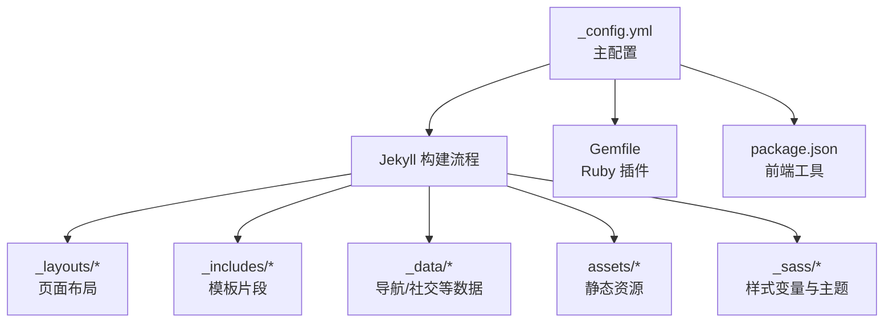
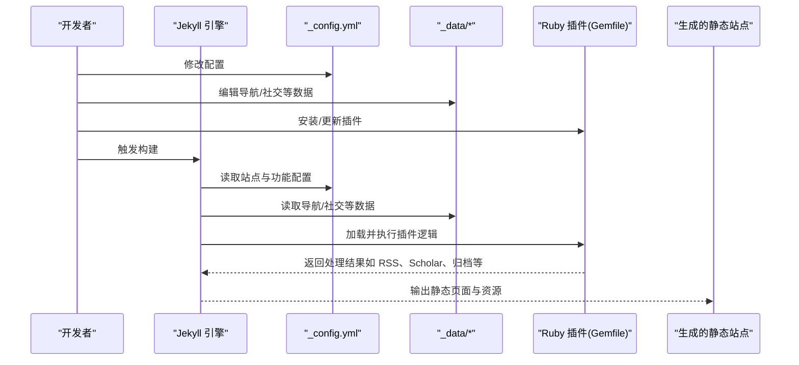
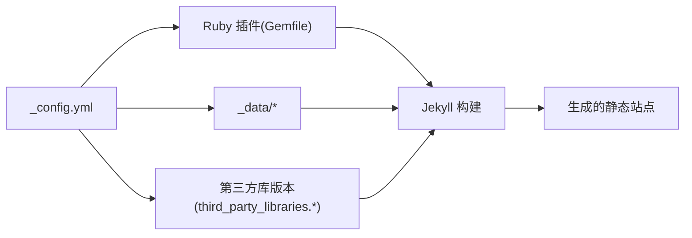

# 配置管理

<cite>
**本文引用的文件**
- [_config.yml](file://_config.yml)
- [CUSTOMIZE.md](file://CUSTOMIZE.md)
- [INSTALL.md](file://INSTALL.md)
- [TROUBLESHOOTING.md](file://TROUBLESHOOTING.md)
- [FAQ.md](file://FAQ.md)
- [SEO.md](file://SEO.md)
- [_data/navigation.yml](file://_data/navigation.yml)
- [_data/socials.yml](file://_data/socials.yml)
- [Gemfile](file://Gemfile)
- [package.json](file://package.json)
</cite>

## 目录
1. [简介](#简介)
2. [项目结构](#项目结构)
3. [核心组件](#核心组件)
4. [架构总览](#架构总览)
5. [详细组件分析](#详细组件分析)
6. [依赖关系分析](#依赖关系分析)
7. [性能考虑](#性能考虑)
8. [故障排查指南](#故障排查指南)
9. [结论](#结论)
10. [附录](#附录)

## 简介
本文件为 Jekyll 配置系统的权威指南，围绕站点配置文件 _config.yml 的各项配置进行系统化说明，覆盖站点基本信息、主题与外观、功能开关、插件与第三方集成、搜索与社交预览、RSS/Atom 订阅、性能与 SEO 最佳实践等内容。文档同时提供配置验证方法、常见错误排查步骤以及面向不同技术背景用户的分层指导。

## 项目结构
该仓库采用标准 Jekyll 结构，与配置密切相关的关键目录与文件如下：
- 根目录：_config.yml（主配置）、Gemfile（Ruby 插件声明）、package.json（开发工具）
- 数据目录：_data/（导航、社交链接等）
- 布局与包含：_layouts/、_includes/（页面布局与可复用片段）
- 资源与样式：assets/（CSS/JS/字体/图片）、_sass/（SCSS 变量与样式）

图示来源
- [_config.yml](file://_config.yml)
- [Gemfile](file://Gemfile)
- [package.json](file://package.json)

章节来源
- [_config.yml](file://_config.yml)
- [Gemfile](file://Gemfile)
- [package.json](file://package.json)

## 核心组件
本节从配置维度梳理 _config.yml 中的关键模块，并给出配置项的作用、默认值、可选值范围与使用建议。

- 站点基本信息
  - title：网站标题；未填时可回退为全名
  - first_name/middle_name/last_name：作者姓名分段
  - contact_note/description/footer_text：联系说明、站点描述、页脚文案
  - keywords/lang/icon：关键词、语言、图标（支持 Emoji 或 /assets/img/ 下图片名）
  - url/baseurl：站点根域名与子路径；个人站点 baseurl 留空，项目站点需匹配仓库名
  - last_updated/impressum_path/back_to_top：页脚“最后更新”显示、法律链接、回到顶部按钮

- 主题与外观
  - repo_theme_light/dark、repo_trophies.*：GitHub 统计与奖杯的主题配色
  - external_services.*：自定义外部服务地址（统计/奖杯）
  - navbar_fixed/footer_fixed/search_enabled 等：布局与交互开关
  - max_width：内容最大宽度
  - serve_og_meta/serve_schema_org/og_image：社交预览与结构化标记

- 分析与验证
  - google_analytics/cronitor_analytics/pirsch_analytics/openpanel_analytics：分析埋点
  - google_site_verification/bing_site_verification：搜索引擎验证

- 博客与评论
  - blog_name/blog_description/permalink：博客标题、描述与链接格式
  - lsi：是否启用相关文章索引
  - pagination.enabled：分页开关
  - related_blog_posts.*：相关文章策略
  - giscus.*：Giscus 评论系统配置（推荐）
  - disqus_shortname：已弃用的 Disqus 配置

- 订阅与集合
  - collections.*：集合输出与默认布局
  - jekyll-archives.*：按年/标签/分类归档
  - display_tags/display_categories：展示维度

- Jekyll 设置
  - markdown/highlighter/kramdown.*：Markdown 渲染与语法高亮
  - include/exclude/keep_files：构建包含/排除规则
  - plugins.*：启用的 Ruby 插件列表
  - sass.style：压缩 CSS
  - jekyll-minifier.*：HTML/CSS/JS 压缩
  - terser.*：JS 压缩参数（如移除 console）

- 学术与出版物
  - scholar.*：jekyll-scholar 配置（作者名、样式、本地化、BibTeX 源、模板等）
  - enable_publication_badges.*：Altmetric/Dimensions/Google Scholar/INSPIRE
  - filtered_bibtex_keywords.*：过滤字段
  - max_author_limit/more_authors_animation_delay：作者列表限制与动画延迟
  - enable_publication_thumbnails：缩略图开关

- 外链与图片
  - external_links.*：外链 rel/target/target 等
  - imagemagick.*：响应式 WebP 图片生成
  - lazy_loading_images：懒加载开关

- 功能开关与库版本
  - enable_*：多种功能开关（分析、Cookie 同意、数学、提示、暗色模式、导航社交、项目分类、中等缩放、进度条、视频嵌入等）
  - third_party_libraries.*：CDN 版本、完整性校验哈希、下载策略

- 外部 JSON 数据
  - jekyll_get_json.*：获取外部 JSON 并映射到页面
  - jsonresume.*：选择性字段

章节来源
- [_config.yml](file://_config.yml)

## 架构总览
下图展示了配置驱动的构建与渲染流程，以及与数据文件、插件的关系。

图示来源
- [_config.yml](file://_config.yml)
- [Gemfile](file://Gemfile)
- [_data/navigation.yml](file://_data/navigation.yml)
- [_data/socials.yml](file://_data/socials.yml)

## 详细组件分析

### 站点信息与元数据
- 作用：定义站点标题、作者、描述、关键词、语言、图标、基础 URL 与子路径等
- 关键项：title、first_name、last_name、contact_note、description、keywords、lang、icon、url、baseurl、last_updated、impressum_path、back_to_top
- 影响范围：页面标题、搜索引擎结果、社交预览、RSS/Atom 订阅
- 默认值：未显式设置时遵循 Jekyll 默认或模板默认
- 使用建议：
  - 个人站点：url 设为 https://<用户名>.github.io，baseurl 留空
  - 项目站点：url 同上，baseurl 设为 /<仓库名>/
  - SEO：确保 title、description、keywords 完整且自然

章节来源
- [_config.yml](file://_config.yml)
- [SEO.md](file://SEO.md)

### 主题与外观
- 作用：控制主题颜色方案、布局固定、搜索、尺寸、OG/Schema 元数据
- 关键项：repo_theme_light/dark、repo_trophies.*、external_services.*、navbar_fixed、footer_fixed、search_enabled、max_width、serve_og_meta、serve_schema_org、og_image
- 影响范围：导航栏/页脚固定、搜索框、社交预览、结构化数据
- 使用建议：
  - 自托管外部服务时，通过 external_services.* 指向自有实例
  - 开启 serve_og_meta/serve_schema_org 提升社交分享与 SEO

章节来源
- [_config.yml](file://_config.yml)

### 分析与验证
- 作用：接入分析埋点与搜索引擎验证
- 关键项：google_analytics、cronitor_analytics、pirsch_analytics、openpanel_analytics、google_site_verification、bing_site_verification
- 影响范围：访问统计、验证所有权
- 使用建议：
  - 在对应平台获取 ID/Token 后填入相应字段
  - 验证文件或 meta 标签部署后，确保 _config.yml 中开启对应开关

章节来源
- [_config.yml](file://_config.yml)

### 博客与评论
- 作用：博客页面、分页、相关文章、评论系统
- 关键项：blog_name、blog_description、permalink、lsi、pagination.enabled、related_blog_posts.*、giscus.*、disqus_shortname
- 影响范围：博客列表、详情页、评论区
- 使用建议：
  - 推荐使用 giscus.*，在仓库开启 Discussions 后按官方指引配置
  - disqus_shortname 已弃用，建议删除或留空

章节来源
- [_config.yml](file://_config.yml)

### 订阅与集合
- 作用：集合输出、归档、标签/分类展示
- 关键项：collections.*、jekyll-archives.*、display_tags、display_categories
- 影响范围：新闻、项目、书籍等集合页面
- 使用建议：
  - 在 collections.* 中声明集合并设置 output: true
  - 在 jekyll-archives.* 中启用 year/tags/categories 等归档类型

章节来源
- [_config.yml](file://_config.yml)

### Jekyll 设置与插件
- 作用：Markdown 渲染、语法高亮、构建包含/排除、插件启用、Sass 压缩、最小化与压缩
- 关键项：markdown、highlighter、kramdown.*、include/exclude/keep_files、plugins.*、sass.style、jekyll-minifier.*、terser.*
- 影响范围：内容渲染质量、构建体积、运行效率
- 使用建议：
  - include/exclude 精准控制构建产物，避免冗余
  - plugins.* 与 Gemfile 保持一致，避免缺失依赖导致构建失败

章节来源
- [_config.yml](file://_config.yml)
- [Gemfile](file://Gemfile)

### 学术与出版物
- 作用：学术文章展示、引用与徽章、作者列表限制与缩略图
- 关键项：scholar.*、enable_publication_badges.*、filtered_bibtex_keywords.*、max_author_limit、more_authors_animation_delay、enable_publication_thumbnails
- 影响范围：论文列表、详情页、外部引用统计
- 使用建议：
  - 在 _bibliography/papers.bib 中维护 BibTeX 条目
  - 合理设置 max_author_limit 与动画延迟，平衡可读性与性能

章节来源
- [_config.yml](file://_config.yml)

### 外链与图片
- 作用：外链属性、响应式图片与懒加载
- 关键项：external_links.*、imagemagick.*、lazy_loading_images
- 影响范围：站外链接安全与体验、图片加载性能
- 使用建议：
  - external_links.* 统一 rel/target，提升安全性
  - imagetag.* 指定输入目录与输出格式，结合懒加载优化首屏

章节来源
- [_config.yml](file://_config.yml)

### 功能开关与库版本
- 作用：统一的功能开关与第三方库版本管理
- 关键项：enable_*、third_party_libraries.*、jekyll_get_json.*、jsonresume.*
- 影响范围：功能可用性、CDN 资源一致性
- 使用建议：
  - enable_* 按需开启，减少不必要的脚本加载
  - third_party_libraries.* 建议开启 download 以保证离线可用性

章节来源
- [_config.yml](file://_config.yml)

## 依赖关系分析
Jekyll 配置与插件、数据文件之间的耦合关系如下：

图示来源
- [_config.yml](file://_config.yml)
- [Gemfile](file://Gemfile)
- [_data/navigation.yml](file://_data/navigation.yml)
- [_data/socials.yml](file://_data/socials.yml)

章节来源
- [_config.yml](file://_config.yml)
- [Gemfile](file://Gemfile)

## 性能考虑
- 构建体积与加载速度
  - 启用 jekyll-minifier.* 与 terser.*，减少 HTML/CSS/JS 体积
  - sass.style: compressed 压缩样式
  - imagetag.* 生成 WebP，结合 lazy_loading_images 提升首屏性能
- 资源加载
  - third_party_libraries.* 建议开启 download，降低 CDN 不可用风险
  - external_links.* 统一 rel/nofollow，减少跟踪开销
- 内容组织
  - include/exclude 精准控制，避免无用文件参与构建
  - keep_files 保留必要文件（如 CNAME、.nojekyll）

章节来源
- [_config.yml](file://_config.yml)

## 故障排查指南
- YAML 语法错误
  - 症状：构建失败、GitHub Actions 报错
  - 排查：使用 yamllint.com 在线校验；本地运行 bundle exec jekyll build 查看具体行号；检查缩进与引号
- URL 与 baseurl 配置错误
  - 症状：CSS/JS 404、链接失效
  - 排查：个人站点 baseurl 留空；项目站点 baseurl 与仓库名一致；清除浏览器缓存或使用隐私窗口
- 相关文章功能异常
  - 症状：Unknown tag 'toc' 或 related posts 计算报错
  - 排查：确认部署分支为 gh-pages；禁用 related_blog_posts 或安装 classifier-reborn 所需依赖
- RSS/Atom 订阅无效
  - 症状：/feed.xml 为空
  - 排查：确保 title、description、url 正确；baseurl 与站点实际一致；至少存在一篇带日期的文章
- 自定义域名问题
  - 症状：部署后域名清空
  - 排查：在仓库根添加 CNAME 文件，写入域名一行
- 代码格式化与 CI 失败
  - 症状：Prettier 格式化工作流失败
  - 排查：安装并运行 Prettier；或在仓库中删除对应工作流文件

章节来源
- [TROUBLESHOOTING.md](file://TROUBLESHOOTING.md)
- [FAQ.md](file://FAQ.md)
- [INSTALL.md](file://INSTALL.md)

## 结论
通过对 _config.yml 的系统化解读与实操建议，可以有效掌控站点的外观、功能、性能与 SEO 表现。建议在本地 Docker 环境完成大部分验证后再提交，严格遵循 YAML 语法规范，合理启用功能开关与第三方库版本管理，持续关注构建日志与 CI 状态，以获得稳定可靠的静态站点。

## 附录
- 配置验证清单
  - 必填项：title、description、url
  - URL/路径：url 与 baseurl 与部署目标一致
  - 插件：Gemfile 与 plugins.* 保持一致
  - 数据：_data/* 文件结构与字段正确
  - 功能：enable_* 与第三方配置匹配
- 推荐流程
  - 修改 _config.yml → 本地 Docker 预览 → 修复 YAML/CI 错误 → 提交并等待 CI → 验证生产环境