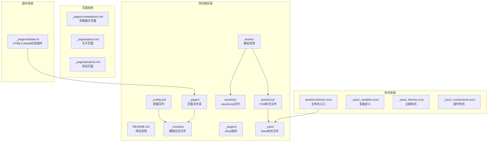
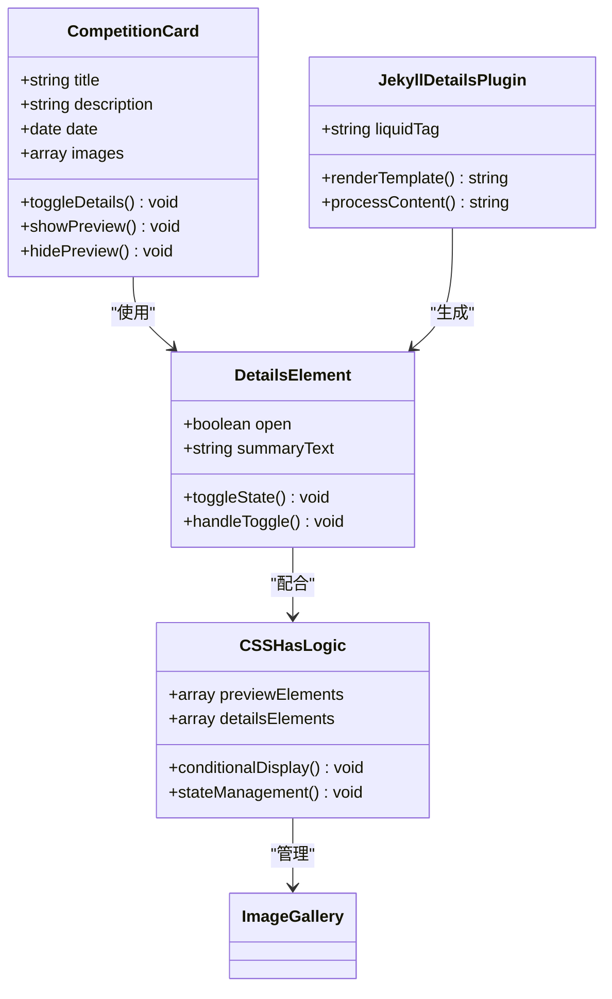
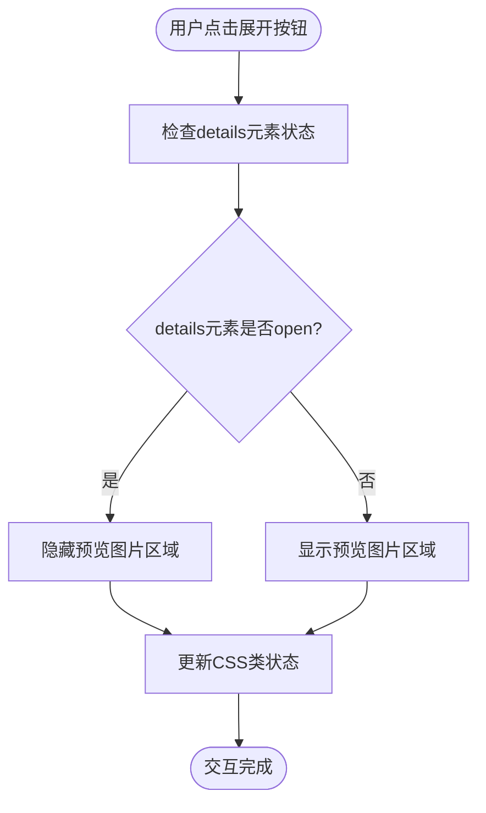
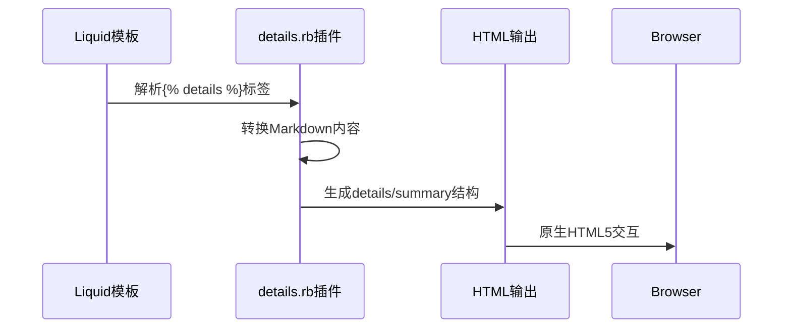

# 交互式竞赛展示系统

<cite>
**本文档引用的文件**
- [_config.yml](_config.yml)
- [README.md](README.md)
- [competitions.md](_pages/competitions.md)
- [details.rb](_plugins/details.rb)
- [_components.scss](_sass/_components.scss)
- [_themes.scss](_sass/_themes.scss)
- [_variables.scss](_sass/_variables.scss)
- [main.scss](assets/css/main.scss)
- [common.js](assets/js/common.js)
- [theme.js](assets/js/theme.js)
- [search-setup.js](assets/js/search-setup.js)
- [bootstrap.bundle.min.js](assets/js/bootstrap.bundle.min.js)
- [default.liquid](_layouts/default.liquid)
- [head.liquid](_includes/head.liquid)
- [scripts.liquid](_includes/scripts.liquid)
</cite>

## 更新摘要
**所做更改**
- 完全重写竞赛页面交互机制部分，从Bootstrap Collapse迁移到HTML5 details/summary元素
- 新增CSS样式系统和条件显示逻辑的详细分析
- 移除JavaScript依赖的相关说明
- 更新架构图以反映新的无JS交互模式
- 新增Jekyll details标签插件的说明
- 更新竞赛内容迁移和增强：higher-education-cup-2024到higher-education-cup-2025重命名
- 新增证书展示部分，添加CAD设计图片和3D打印展示内容
- 增强图片画廊系统，支持更多媒体类型

## 目录
1. [简介](#简介)
2. [项目结构](#项目结构)
3. [核心组件](#核心组件)
4. [架构概览](#架构概览)
5. [详细组件分析](#详细组件分析)
6. [依赖关系分析](#依赖关系分析)
7. [性能考虑](#性能考虑)
8. [故障排除指南](#故障排除指南)
9. [结论](#结论)

## 简介

交互式竞赛展示系统是一个基于Jekyll框架构建的专业竞赛成果展示平台。该系统专门为李明宇同学的竞赛经历而设计，提供了完整的竞赛获奖展示、项目成果展示和多媒体内容交互功能。

**更新** 系统已完全重构竞赛页面的交互机制，从传统的Bootstrap Collapse组件迁移至原生HTML5 details/summary元素，实现了真正的无JavaScript依赖交互体验。

系统的核心特色包括：
- 多语言支持（中英文双语界面）
- 响应式设计，适配各种设备
- 丰富的多媒体展示功能
- 主题切换机制（明暗模式）
- 搜索功能集成
- 图片画廊和缩放功能
- **全新无JS交互体验** - 基于HTML5 details/summary的原生交互

## 项目结构

该项目采用标准的Jekyll项目结构，主要包含以下目录和文件：



**图表来源**
- [_config.yml](_config.yml)
- [main.scss](assets/css/main.scss)
- [details.rb](_plugins/details.rb)

**章节来源**
- [_config.yml](_config.yml)
- [README.md](README.md)

## 核心组件

### 竞赛展示核心功能

**更新** 系统的核心交互机制已完全重构，采用HTML5 details/summary元素替代Bootstrap Collapse组件：

- **原生HTML5交互**：使用`<details>`和`<summary>`元素实现展开/折叠功能
- **条件显示逻辑**：通过`:has()`伪类选择器实现预览图片与详情内容的智能切换
- **多级展示结构**：支持竞赛项目、获奖证书、项目成果等多层次内容展示
- **图片画廊系统**：集成Photoswipe实现图片缩放和画廊浏览
- **响应式网格布局**：使用Bootstrap栅格系统实现自适应图片展示

### 主题切换系统

系统实现了完整的主题切换机制：

- **三模式切换**：支持系统默认、明亮模式、暗黑模式三种主题
- **本地存储**：用户选择的主题会保存在浏览器本地存储中
- **自动检测**：能够自动检测用户的系统主题偏好
- **跨组件同步**：主题变化会同步应用到所有支持的组件

### 搜索集成系统

集成了现代化的搜索功能：

- **Ninja Keys搜索**：提供快速、便捷的站内搜索功能
- **快捷键支持**：支持键盘快捷键触发搜索
- **主题适配**：搜索界面会根据当前主题自动调整外观

**章节来源**
- [competitions.md](_pages/competitions.md)
- [details.rb](_plugins/details.rb)
- [theme.js](assets/js/theme.js)
- [search-setup.js](assets/js/search-setup.js)

## 架构概览

**更新** 系统架构已完全重构，移除了JavaScript依赖，采用纯CSS和HTML5原生功能：

```mermaid
graph TD
subgraph "表现层"
Layout[布局模板<br/>default.liquid]
Head[头部模板<br/>head.liquid]
Scripts[脚本模板<br/>scripts.liquid]
end
subgraph "内容层"
Config[配置文件<br/>_config.yml]
Pages[页面内容<br/>_pages/*.md]
Includes[包含模板<br/>_includes/*.liquid]
Plugins[Jekyll插件<br/>_plugins/*.rb]
DetailsPlugin[details.rb<br/>HTML5 details标签]
End[页面内容<br/>competitions.md]
end
subgraph "样式层"
SCSS[Sass编译器<br/>main.scss]
Variables[变量定义<br/>_sass/_variables.scss]
Themes[主题样式<br/>_sass/_themes.scss]
Components[组件样式<br/>_sass/_components.scss]
end
subgraph "交互层"
NativeHTML5[原生HTML5<br/>details/summary]
CSSLogic[CSS条件逻辑<br/>:has()伪类]
NoJS[无JavaScript依赖<br/>纯前端交互]
end
subgraph "第三方库"
Bootstrap[Bootstrap框架]
MDB[MDB样式库]
Photoswipe[图片画廊]
Mermaid[流程图]
MathJax[数学公式]
end
Layout --> Head
Layout --> Scripts
Head --> SCSS
Scripts --> NoJS
SCSS --> Variables
SCSS --> Themes
SCSS --> Components
DetailsPlugin --> End
NativeHTML5 --> Components
CSSLogic --> Components
```

**图表来源**
- [default.liquid](_layouts/default.liquid)
- [head.liquid](_includes/head.liquid)
- [scripts.liquid](_includes/scripts.liquid)
- [main.scss](_sass/main.scss)
- [details.rb](_plugins/details.rb)

## 详细组件分析

### HTML5 Details交互系统

**更新** 竞赛展示系统的核心交互机制已完全重构为HTML5原生功能：



**图表来源**
- [competitions.md](_pages/competitions.md)
- [details.rb](_plugins/details.rb)

**更新** HTML5 Details交互系统的关键特性：

1. **原生浏览器支持**：无需JavaScript即可实现展开/折叠功能
2. **CSS条件逻辑**：使用`:has()`伪类实现智能内容切换
3. **语义化HTML**：符合Web标准的语义化标记
4. **无障碍访问**：原生支持屏幕阅读器和键盘导航

### 竞赛卡片组件

**更新** 竞赛卡片组件已完全适配新的HTML5交互机制：

每个竞赛卡片包含以下关键元素：

1. **标题显示**：同时显示中文和英文标题
2. **时间标记**：显示竞赛年份和月份
3. **预览图片区域**：使用`.competition-preview`类管理预览内容
4. **详情展开区域**：使用`<details>`和`<summary>`元素
5. **图片画廊**：支持完整的图片浏览功能
6. **条件显示逻辑**：通过CSS实现预览与详情的智能切换

### CSS条件显示系统

**更新** 新增的CSS条件显示逻辑系统：



**图表来源**
- [_components.scss](_sass/_components.scss)

**更新** 条件显示逻辑的关键实现：

1. **`:has()`伪类选择器**：用于检测details元素的open状态
2. **CSS过渡动画**：平滑的显示/隐藏切换效果
3. **响应式设计**：适配不同屏幕尺寸的显示逻辑

### Jekyll Details标签插件

**更新** 新增的Jekyll插件系统：



**图表来源**
- [details.rb](_plugins/details.rb)

**更新** 插件功能特性：

1. **Liquid标签支持**：在Markdown中使用``语法
2. **内容自动转换**：将Markdown内容转换为HTML
3. **语义化结构**：生成标准的HTML5 details/summary元素
4. **兼容性保证**：确保与现有Jekyll工作流兼容

### 竞赛内容迁移和增强

**更新** 系统已成功完成2025年竞赛内容迁移和增强：

#### 重命名变更
- **higher-education-cup-2024** → **higher-education-cup-2025**：竞赛名称从2024年重命名为2025年
- 保持原有结构和功能不变，仅更新文件夹名称

#### 新增证书展示部分
- **获奖证书展示**：新增专门的证书展示区域
- 支持高分辨率证书图片展示
- 集成Photoswipe画廊功能

#### CAD设计图片增强
- **等轴测装配图**：展示3D CAD模型的整体视图
- **正面完整装配图**：显示产品的正面完整装配效果
- **模块正面视图**：展示各个模块的正面设计
- **内部机构视图**：展示内部机械结构的前后视图
- **零部件细节**：展示关键零部件的详细设计
- **抽屉细节**：展示特定功能部件的精细设计

#### 3D打印展示内容
- **打印零件布局**：展示3D打印前的零件排列
- **成品组装**：展示最终的3D打印成品组装效果
- **外壳模块特写**：展示白色外壳模块的细节
- **支架特写**：展示黑色支架部件的特写
- **储物格细节**：展示储物格螺栓连接的细节

#### 图片画廊系统增强
- **响应式网格布局**：支持不同屏幕尺寸的自适应显示
- **增强的缩放功能**：改进的Photoswipe集成
- **多列布局**：支持2-3列的灵活布局
- **懒加载优化**：提升页面加载性能

**章节来源**
- [competitions.md](_pages/competitions.md)
- [details.rb](_plugins/details.rb)
- [_components.scss](_sass/_components.scss)

## 依赖关系分析

**更新** 依赖关系已大幅简化，移除了JavaScript依赖：

```mermaid
graph LR
subgraph "核心依赖"
Jekyll[Jekyll框架]
Liquid[Liquid模板引擎]
HTML5[HTML5原生功能]
end
subgraph "样式依赖"
Sass[Sass编译器]
SCSS[SCSS样式文件]
Variables[变量定义]
Themes[主题系统]
Components[组件样式]
HasLogic[:has()伪类逻辑]
end
subgraph "插件依赖"
DetailsPlugin[details.rb插件]
end
subgraph "第三方库"
Bootstrap[Bootstrap CSS框架]
Photoswipe[Photoswipe画廊]
end
Jekyll --> Liquid
Liquid --> HTML5
HTML5 --> HasLogic
Sass --> SCSS
SCSS --> Variables
SCSS --> Themes
SCSS --> Components
DetailsPlugin --> HTML5
Bootstrap --> Photoswipe
```

**图表来源**
- [_config.yml](_config.yml)
- [head.liquid](_includes/head.liquid)
- [details.rb](_plugins/details.rb)

**更新** 依赖关系的变化：

1. **移除JavaScript库**：不再依赖jQuery和Bootstrap JS组件
2. **新增HTML5原生功能**：充分利用现代浏览器的原生能力
3. **简化插件系统**：仅保留必要的Jekyll插件
4. **保持CSS框架**：继续使用Bootstrap CSS进行布局

**章节来源**
- [_config.yml](_config.yml)
- [head.liquid](_includes/head.liquid)

## 性能考虑

**更新** 性能优化策略已全面升级：

### 资源加载优化
- **零JavaScript依赖**：完全移除JavaScript文件，减少HTTP请求
- **原生HTML5支持**：利用浏览器原生功能，提升执行效率
- **CDN加速**：第三方库通过CDN提供，提升加载速度
- **缓存策略**：静态资源带有版本戳，便于缓存管理

### 渲染性能优化
- **CSS条件逻辑**：使用`:has()`伪类实现高效的条件显示
- **响应式图片**：使用懒加载减少初始页面大小
- **CSS模块化**：样式按需加载，避免不必要的样式计算
- **无事件处理器**：移除JavaScript事件监听器，减少内存占用

### 交互性能优化
- **原生CSS过渡**：使用CSS3动画替代JavaScript动画
- **语义化HTML**：符合Web标准，提升浏览器渲染效率
- **无障碍访问**：原生支持屏幕阅读器和键盘导航
- **无阻塞渲染**：不阻塞页面初始渲染

## 故障排除指南

### 常见问题及解决方案

**更新** 故障排除指南已针对新的HTML5交互机制更新：

**HTML5 details不支持**
- 检查浏览器兼容性（现代浏览器均支持）
- 确认CSS样式正确应用
- 验证`:has()`伪类选择器的兼容性

**条件显示逻辑失效**
- 确认`:has()`伪类选择器语法正确
- 检查CSS优先级是否被覆盖
- 验证details元素的open属性状态

**Jekyll插件未生效**
- 确认插件文件放置在正确的目录
- 检查Liquid语法是否正确
- 验证插件注册是否成功

**图片画廊无法显示**
- 确认Photoswipe库是否正确加载
- 检查图片路径是否正确
- 验证图片尺寸参数是否设置

**搜索功能异常**
- 确认Ninja Keys组件是否正确初始化
- 检查搜索数据是否正确生成
- 验证键盘快捷键是否被其他应用占用

**竞赛内容显示问题**
- 检查higher-education-cup-2025文件夹是否存在
- 确认图片文件路径是否正确
- 验证CSS样式是否正确应用到新内容

**章节来源**
- [details.rb](_plugins/details.rb)
- [_components.scss](_sass/_components.scss)
- [theme.js](assets/js/theme.js)
- [search-setup.js](assets/js/search-setup.js)

## 结论

**更新** 交互式竞赛展示系统经过完全重构，现已发展为一个真正现代化、高性能的展示平台。

**重构后的系统优势**：
- **零JavaScript依赖**：完全基于HTML5原生功能，提升安全性
- **现代浏览器支持**：充分利用现代浏览器的原生能力
- **更好的性能**：移除JavaScript开销，提升页面加载速度
- **增强的可访问性**：原生支持无障碍访问功能
- **简化的维护**：减少依赖关系，降低维护复杂度
- **语义化标记**：符合Web标准的语义化HTML结构
- **内容丰富性**：新增证书展示、CAD设计和3D打印内容
- **用户体验提升**：增强的图片画廊和响应式设计

**技术亮点**：
- HTML5 details/summary元素的创新应用
- CSS `:has()`伪类选择器的巧妙使用
- Jekyll插件系统的有效集成
- 无JavaScript的完整交互体验
- 2025年竞赛内容的成功迁移和增强

该系统不仅展示了李明宇同学的竞赛成就，更代表了现代Web开发的最佳实践，为类似的技术展示场景提供了优秀的参考模板和实现方案。