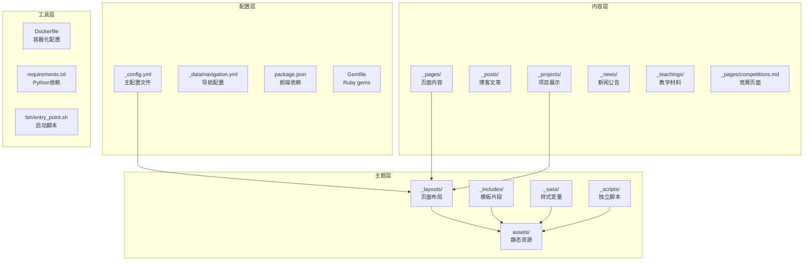
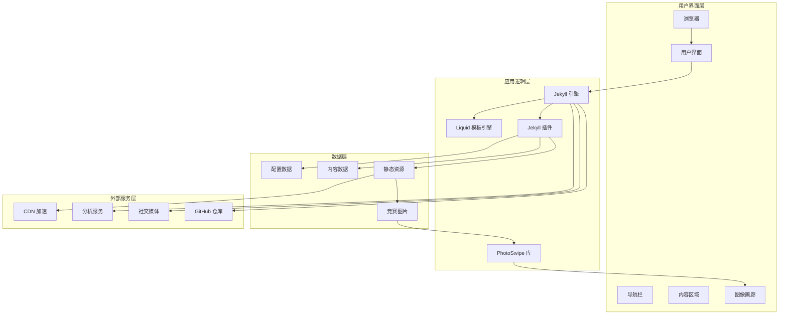
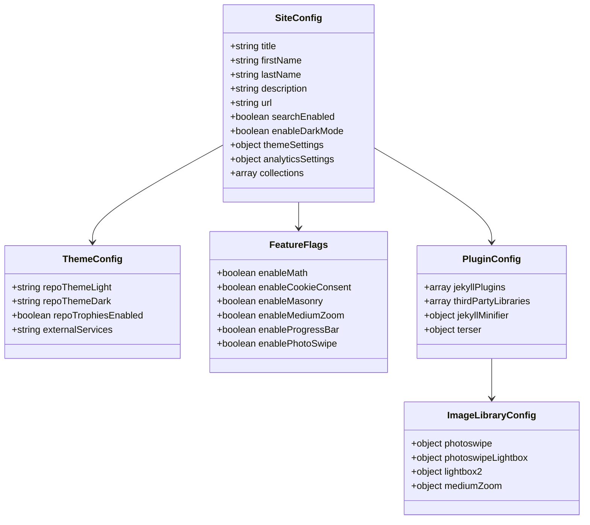
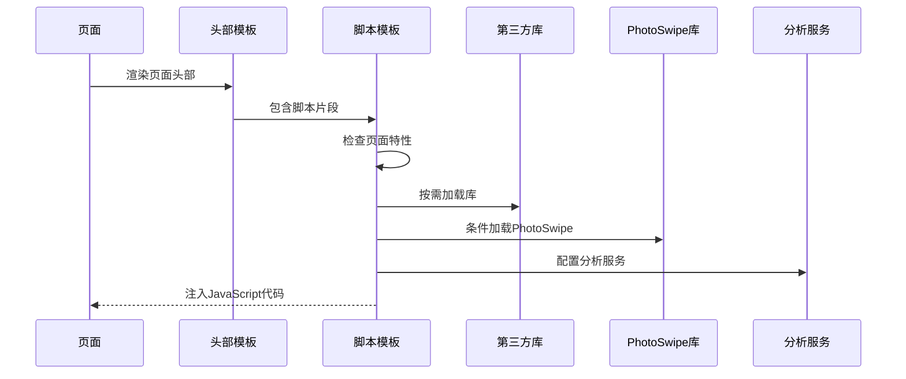
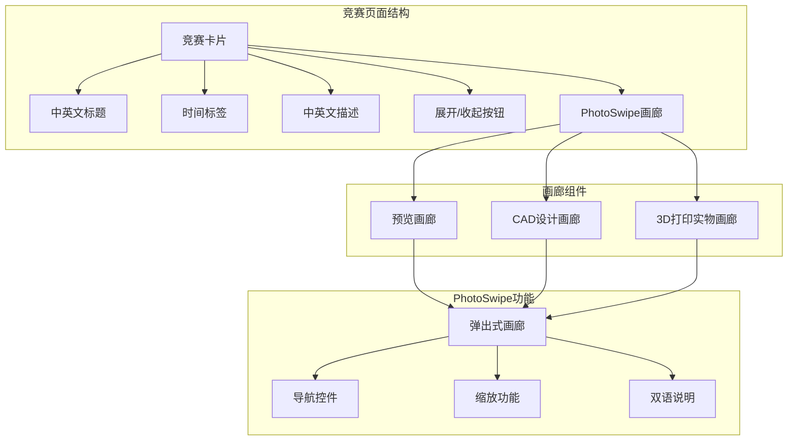
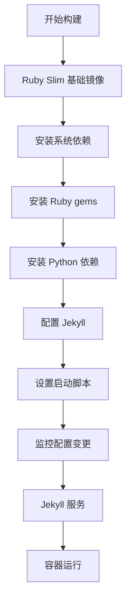
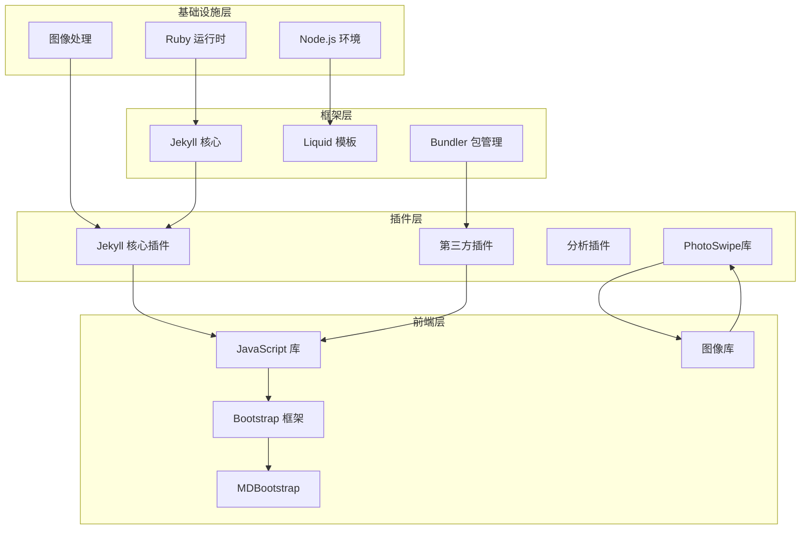

# 项目展示系统

<cite>
**本文档引用的文件**
- [README.md](file://README.md)
- [_config.yml](file://_config.yml)
- [package.json](file://package.json)
- [Gemfile](file://Gemfile)
- [Dockerfile](file://Dockerfile)
- [_layouts/default.liquid](file://_layouts/default.liquid)
- [_pages/about.md](file://_pages/about.md)
- [_pages/cv.md](file://_pages/cv.md)
- [_pages/competitions.md](file://_pages/competitions.md)
- [_projects/1_project.md](file://_projects/1_project.md)
- [_includes/scripts.liquid](file://_includes/scripts.liquid)
- [_includes/head.liquid](file://_includes/head.liquid)
- [_sass/_variables.scss](file://_sass/_variables.scss)
- [_data/navigation.yml](file://_data/navigation.yml)
- [_scripts/photoswipe-setup.js](file://_scripts/photoswipe-setup.js)
- [requirements.txt](file://requirements.txt)
- [bin/entry_point.sh](file://bin/entry_point.sh)
</cite>

## 更新摘要
**变更内容**
- 新增PhotoSwipe图像画廊系统，支持竞赛页面的高分辨率照片展示
- 更新脚本加载系统以支持动态图像浏览功能
- 增强竞赛页面的多媒体展示能力，包含中英文双语描述
- 添加独立的PhotoSwipe初始化脚本文件

## 目录
1. [简介](#简介)
2. [项目结构](#项目结构)
3. [核心组件](#核心组件)
4. [架构概览](#架构概览)
5. [详细组件分析](#详细组件分析)
6. [依赖关系分析](#依赖关系分析)
7. [性能考虑](#性能考虑)
8. [故障排除指南](#故障排除指南)
9. [结论](#结论)

## 简介

这是一个基于 Jekyll 的学术项目展示系统，使用 al-folio 主题构建。该系统专为展示个人学术成果、研究项目、出版物和简历而设计，支持多语言界面（中英文），具备现代化的响应式设计和丰富的交互功能。

系统主要特点包括：
- 学术友好的 Jekyll 主题
- 支持中英文双语界面
- 响应式网页设计
- 内置搜索功能
- 数学公式渲染支持
- 图表和可视化组件
- **增强的图像画廊系统（PhotoSwipe）**
- GDPR 合规的 Cookie 同意对话框
- 自动化部署支持

**更新** 新增了专业的图像画廊系统，为竞赛页面提供高质量的照片展示体验。

## 项目结构

该项目采用标准的 Jekyll 项目结构，结合 al-folio 主题的特色组织方式：

**图表来源**
- [_config.yml:1-656](file://_config.yml#L1-L656)
- [_layouts/default.liquid:1-57](file://_layouts/default.liquid#L1-L57)
- [_includes/head.liquid:1-209](file://_includes/head.liquid#L1-L209)
- [_pages/competitions.md:1-476](file://_pages/competitions.md#L1-L476)

**章节来源**
- [_config.yml:1-656](file://_config.yml#L1-L656)
- [_layouts/default.liquid:1-57](file://_layouts/default.liquid#L1-L57)

## 核心组件

### 配置管理系统

系统的核心配置集中在 `_config.yml` 文件中，涵盖了站点设置、主题定制、功能开关等多个方面：

- **站点基本信息**：标题、作者信息、描述、关键词等
- **主题配置**：颜色主题、布局选项、响应式设置
- **功能开关**：搜索、数学渲染、暗色模式、Cookie 同意等
- **第三方服务**：分析工具、社交媒体、仓库统计等集成
- **图像库配置**：PhotoSwipe、Lightbox2、Medium Zoom 等图像浏览库

### 页面布局系统

采用 Liquid 模板引擎的布局系统，提供灵活的内容组织方式：

- **默认布局**：`default.liquid` 提供基础框架结构
- **专用布局**：针对不同页面类型的专门布局
- **模板片段**：可重用的 HTML 片段（includes）

### 内容管理系统

支持多种内容类型，通过 YAML 头信息定义页面属性：

- **个人主页**：包含个人信息、研究兴趣、成就展示
- **项目展示**：详细的项目描述、技术栈、成果展示
- **简历系统**：支持 RenderCV 和 JSONResume 两种格式
- **新闻公告**：动态更新的研究进展和活动通知
- **竞赛页面**：**新增的高分辨率照片画廊系统**

### 图像画廊系统

**新增功能** 系统集成了专业的图像画廊解决方案：

- **PhotoSwipe 集成**：提供现代化的触摸友好的图像浏览体验
- **响应式设计**：支持桌面端和移动端的无缝切换
- **高分辨率支持**：原图质量显示，支持超高清图片
- **双语描述**：中英文对照的图片说明
- **智能加载**：按需加载，优化页面性能

**章节来源**
- [_config.yml:1-656](file://_config.yml#L1-L656)
- [_pages/about.md:1-39](file://_pages/about.md#L1-L39)
- [_pages/cv.md:1-15](file://_pages/cv.md#L1-L15)
- [_pages/competitions.md:1-476](file://_pages/competitions.md#L1-L476)
- [_projects/1_project.md:1-31](file://_projects/1_project.md#L1-L31)

## 架构概览

系统采用分层架构设计，确保各组件间的松耦合和高内聚：

**图表来源**
- [_includes/scripts.liquid:1-379](file://_includes/scripts.liquid#L1-L379)
- [_includes/head.liquid:1-209](file://_includes/head.liquid#L1-L209)
- [_config.yml:196-218](file://_config.yml#L196-L218)
- [_scripts/photoswipe-setup.js:1-12](file://_scripts/photoswipe-setup.js#L1-L12)

## 详细组件分析

### 配置管理组件

配置系统采用 YAML 格式，提供了全面的站点定制能力：

**图表来源**
- [_config.yml:5-28](file://_config.yml#L5-L28)
- [_config.yml:30-44](file://_config.yml#L30-L44)
- [_config.yml:381-396](file://_config.yml#L381-L396)
- [_config.yml:196-218](file://_config.yml#L196-L218)
- [_config.yml:540-552](file://_config.yml#L540-L552)

### 脚本加载系统

动态脚本加载机制根据页面需求智能加载必要的 JavaScript 库：

**图表来源**
- [_includes/scripts.liquid:1-379](file://_includes/scripts.liquid#L1-L379)
- [_includes/head.liquid:150-160](file://_includes/head.liquid#L150-L160)

### 竞赛页面画廊系统

**新增功能** 竞赛页面集成了完整的图像画廊系统：

**图表来源**
- [_pages/competitions.md:25-176](file://_pages/competitions.md#L25-L176)
- [_pages/competitions.md:180-208](file://_pages/competitions.md#L180-L208)
- [_pages/competitions.md:212-240](file://_pages/competitions.md#L212-L240)

### 样式变量系统

SCSS 变量系统提供了统一的主题定制接口：

| 变量类别 | 变量名称 | 用途 |
|---------|----------|------|
| 颜色变量 | `$red-color`, `$blue-color` | 主色调定义 |
| 灰度变量 | `$grey-color`, `$grey-900` | 文本和背景色 |
| 功能变量 | `$back-to-top-*`, `$max-content-width` | 组件尺寸控制 |
| 字体变量 | `$fa-font-path` | 图标字体路径 |

**章节来源**
- [_sass/_variables.scss:1-53](file://_sass/_variables.scss#L1-L53)
- [_includes/head.liquid:1-209](file://_includes/head.liquid#L1-L209)

### 容器化部署系统

Docker 配置提供了完整的开发和生产环境：

**图表来源**
- [Dockerfile:1-77](file://Dockerfile#L1-L77)
- [bin/entry_point.sh:1-38](file://bin/entry_point.sh#L1-L38)

**章节来源**
- [Dockerfile:1-77](file://Dockerfile#L1-L77)
- [bin/entry_point.sh:1-38](file://bin/entry_point.sh#L1-L38)

## 依赖关系分析

系统依赖关系呈现多层次结构，从底层基础设施到上层应用功能：

**图表来源**
- [Gemfile:1-42](file://Gemfile#L1-L42)
- [package.json:1-7](file://package.json#L1-L7)
- [_config.yml:196-218](file://_config.yml#L196-L218)
- [_config.yml:540-552](file://_config.yml#L540-L552)

**章节来源**
- [Gemfile:1-42](file://Gemfile#L1-L42)
- [package.json:1-7](file://package.json#L1-L7)
- [requirements.txt:1-5](file://requirements.txt#L1-L5)

## 性能考虑

系统在多个层面进行了性能优化：

### 静态资源优化
- **图片响应式处理**：自动转换为 WebP 格式，支持多种分辨率
- **CSS/JS 压缩**：启用 Jekyll Minifier 和 Terser 压缩
- **缓存策略**：智能文件缓存和 CDN 加速
- **按需加载**：PhotoSwipe 库仅在需要时加载

### 加载性能
- **动态脚本加载**：仅加载当前页面需要的 JavaScript 库
- **懒加载**：图片和媒体内容的延迟加载
- **预连接**：关键域名的预连接优化
- **模块化加载**：PhotoSwipe 使用 ES6 模块

### SEO 优化
- **结构化数据**：Schema.org 元数据支持
- **Open Graph**：社交分享优化
- **站点地图**：完整的 sitemap 生成

### 用户体验优化
- **触摸友好**：PhotoSwipe 提供流畅的触摸操作
- **响应式设计**：适配各种屏幕尺寸
- **渐进增强**：基础功能优先，高级功能按需加载

## 故障排除指南

### 常见问题及解决方案

| 问题类型 | 症状 | 解决方案 |
|---------|------|---------|
| 构建失败 | Bundle 安装错误 | 检查 Gemfile.lock 和网络连接 |
| 图片不显示 | 404 错误 | 验证图片路径和权限设置 |
| 样式异常 | CSS 加载失败 | 清理缓存并重新编译 SCSS |
| 功能失效 | JavaScript 报错 | 检查浏览器兼容性和库版本 |
| **PhotoSwipe 无响应** | 点击图片无反应 | 检查页面是否正确设置 `images.photoswipe: true` |

### 调试工具

系统内置多种调试和监控工具：
- **Live Reload**：实时内容更新
- **Verbose Logging**：详细构建日志
- **Error Tracking**：JavaScript 错误监控
- **性能监控**：PhotoSwipe 加载性能分析

**章节来源**
- [bin/entry_point.sh:22-37](file://bin/entry_point.sh#L22-L37)

## 结论

该项目展示系统是一个功能完整、架构清晰的学术项目展示平台。其设计特点包括：

**技术优势**：
- 基于 Jekyll 的静态生成，确保高性能和安全性
- 灵活的配置系统，支持深度定制
- 完善的响应式设计，适配各种设备
- **专业的图像画廊系统，提供卓越的用户体验**
- 丰富的第三方集成能力

**使用价值**：
- 专为学术界设计，满足研究展示需求
- 支持多语言界面，扩大受众范围
- 内置 GDPR 合规功能，保护用户隐私
- 提供完整的开发和部署工具链
- **增强的多媒体展示能力，特别适合竞赛和项目成果展示**

**新增功能价值**：
- **PhotoSwipe 画廊系统**：为竞赛页面提供专业级的图像浏览体验
- **双语描述支持**：满足国际化展示需求
- **响应式设计**：适配移动设备的触摸操作
- **高分辨率支持**：原图质量展示，提升视觉效果

该系统为研究人员、学生和专业人士提供了一个专业、美观且功能强大的个人展示平台，能够有效提升个人品牌影响力和学术交流效果。新增的图像画廊系统特别适合展示竞赛成果、项目照片和技术演示，为用户提供了更加丰富和沉浸式的浏览体验。