# 项目布局和展示

<cite>
**本文档引用的文件**
- [_config.yml](file://_config.yml)
- [README.md](file://README.md)
- [default.liquid](file://_layouts/default.liquid)
- [page.liquid](file://_layouts/page.liquid)
- [post.liquid](file://_layouts/post.liquid)
- [about.liquid](file://_layouts/about.liquid)
- [cv.liquid](file://_layouts/cv.liquid)
- [archive.liquid](file://_layouts/archive.liquid)
- [head.liquid](file://_includes/head.liquid)
- [header.liquid](file://_includes/header.liquid)
- [navigation.yml](file://_data/navigation.yml)
- [_layout.scss](file://_sass/_layout.scss)
- [about.md](file://_pages/about.md)
- [cv.md](file://_pages/cv.md)
- [publications.md](file://_pages/publications.md)
</cite>

## 目录
1. [简介](#简介)
2. [项目结构](#项目结构)
3. [核心组件](#核心组件)
4. [架构概览](#架构概览)
5. [详细组件分析](#详细组件分析)
6. [依赖关系分析](#依赖关系分析)
7. [性能考虑](#性能考虑)
8. [故障排除指南](#故障排除指南)
9. [结论](#结论)

## 简介

这是一个基于 Jekyll 的学术个人网站项目，使用 al-folio 主题构建。该项目采用 Liquid 模板引擎和 Bootstrap 前端框架，提供了完整的学术展示功能，包括个人简介、研究论文、项目展示、简历管理等模块。

项目的核心特点：
- 响应式设计，支持移动端和桌面端
- 支持中英文双语界面
- 集成学术功能（论文检索、引用管理）
- 支持暗色模式切换
- 提供多种页面布局和展示方式

## 项目结构

该项目采用标准的 Jekyll 项目结构，主要目录和文件组织如下：

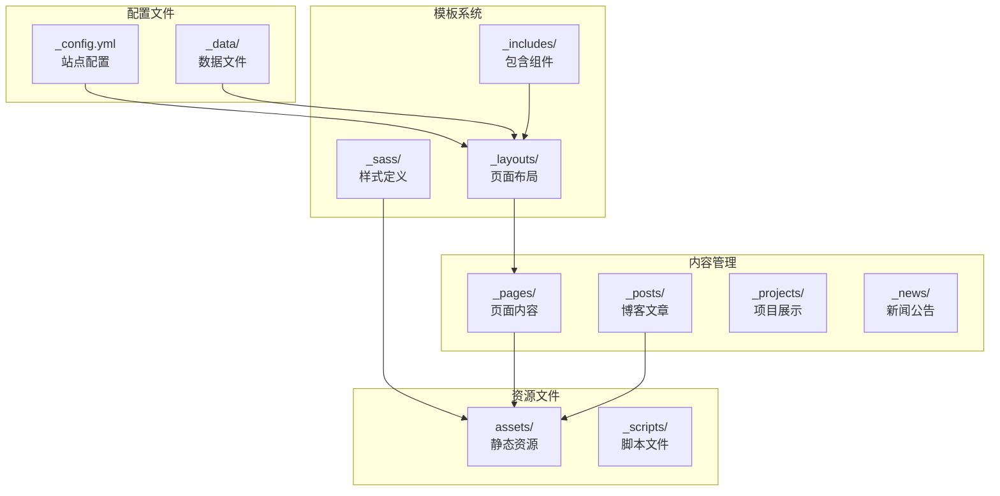

**图表来源**
- [_config.yml:1-656](file://_config.yml#L1-L656)
- [navigation.yml:1-24](file://_data/navigation.yml#L1-L24)

**章节来源**
- [_config.yml:1-656](file://_config.yml#L1-L656)
- [README.md:1-561](file://README.md#L1-L561)

## 核心组件

### 布局系统

项目采用多层布局架构，通过 Liquid 模板实现灵活的内容展示：

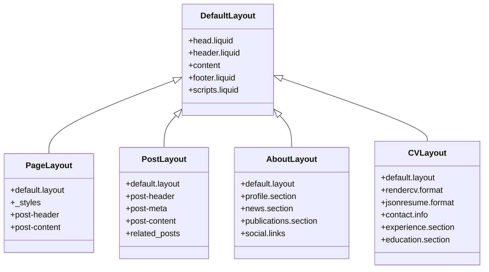

**图表来源**
- [default.liquid:1-57](file://_layouts/default.liquid#L1-L57)
- [page.liquid:1-32](file://_layouts/page.liquid#L1-L32)
- [post.liquid:1-98](file://_layouts/post.liquid#L1-L98)
- [about.liquid:1-88](file://_layouts/about.liquid#L1-L88)
- [cv.liquid:1-393](file://_layouts/cv.liquid#L1-L393)

### 导航系统

导航系统支持多语言切换和响应式设计：

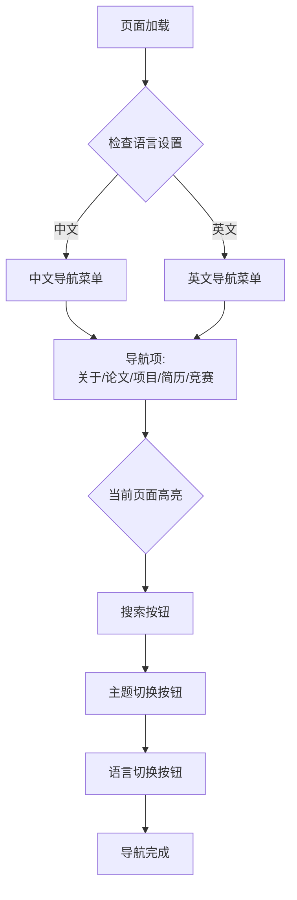

**图表来源**
- [navigation.yml:1-24](file://_data/navigation.yml#L1-L24)
- [header.liquid:1-101](file://_includes/header.liquid#L1-L101)

**章节来源**
- [navigation.yml:1-24](file://_data/navigation.yml#L1-L24)
- [header.liquid:1-101](file://_includes/header.liquid#L1-L101)

## 架构概览

项目采用分层架构设计，各组件职责明确：

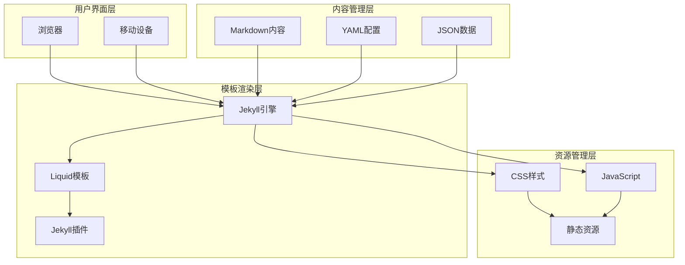

**图表来源**
- [_config.yml:196-218](file://_config.yml#L196-L218)
- [head.liquid:1-209](file://_includes/head.liquid#L1-L209)

## 详细组件分析

### 页面布局组件

#### 默认布局 (default.liquid)
默认布局是所有页面的基础模板，提供统一的页面结构：

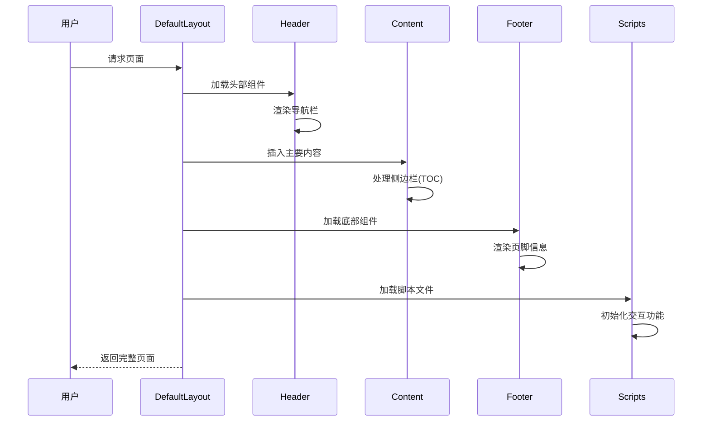

**图表来源**
- [default.liquid:1-57](file://_layouts/default.liquid#L1-L57)

#### 关于页面布局 (about.liquid)
专门用于个人简介展示的布局：

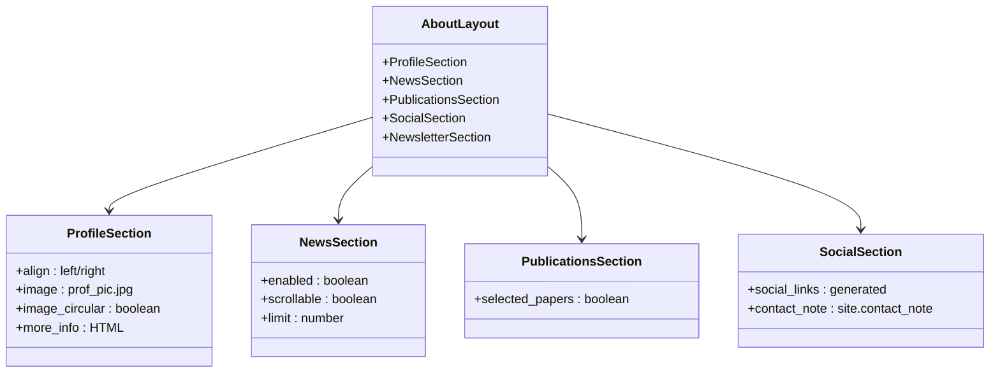

**图表来源**
- [about.liquid:1-88](file://_layouts/about.liquid#L1-L88)

**章节来源**
- [about.liquid:1-88](file://_layouts/about.liquid#L1-L88)
- [default.liquid:1-57](file://_layouts/default.liquid#L1-L57)

### 内容管理系统

#### 博客文章布局 (post.liquid)
博客文章采用时间线展示方式：

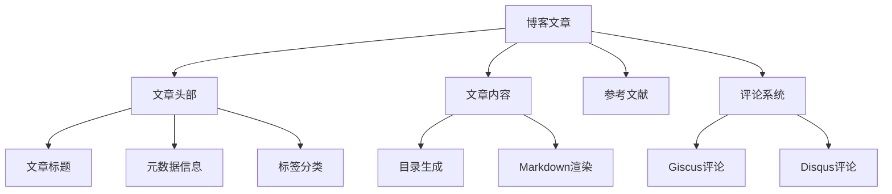

**图表来源**
- [post.liquid:1-98](file://_layouts/post.liquid#L1-L98)

#### 简历布局 (cv.liquid)
支持两种简历格式的统一渲染：

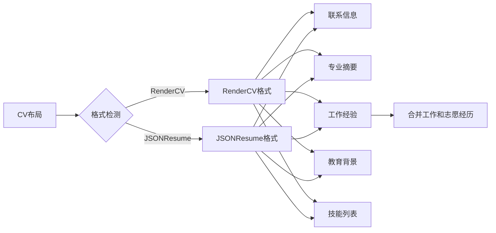

**图表来源**
- [cv.liquid:1-393](file://_layouts/cv.liquid#L1-L393)

**章节来源**
- [post.liquid:1-98](file://_layouts/post.liquid#L1-L98)
- [cv.liquid:1-393](file://_layouts/cv.liquid#L1-L393)

### 资源加载系统

#### 样式资源管理 (head.liquid)
采用条件加载策略优化页面性能：

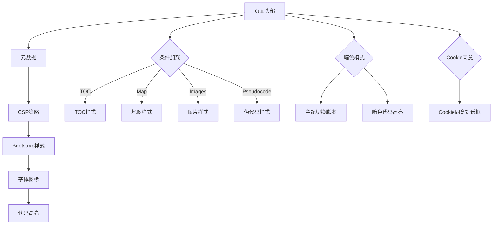

**图表来源**
- [head.liquid:1-209](file://_includes/head.liquid#L1-L209)

**章节来源**
- [head.liquid:1-209](file://_includes/head.liquid#L1-L209)

## 依赖关系分析

### 外部库依赖

项目集成了多个第三方库来增强功能：

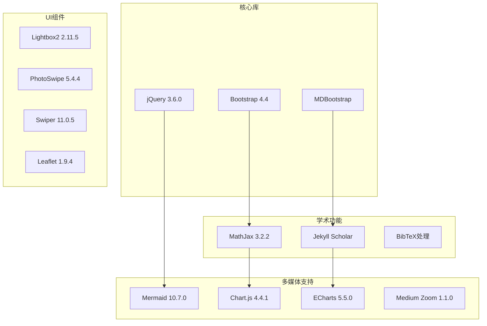

**图表来源**
- [_config.yml:405-634](file://_config.yml#L405-L634)

### 插件生态系统

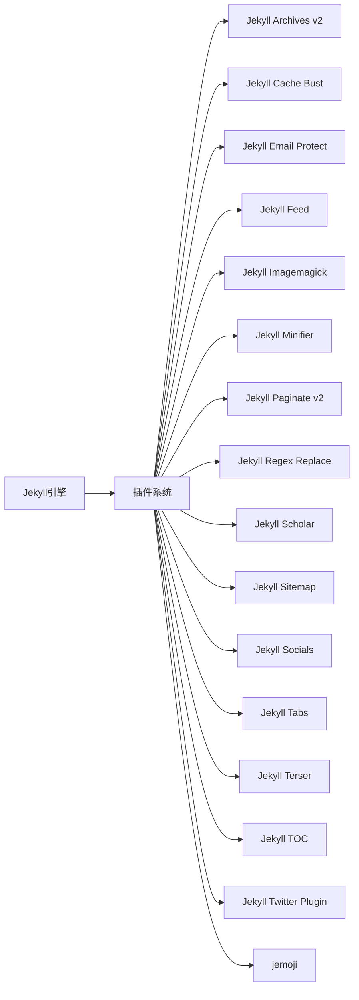

**图表来源**
- [_config.yml:196-218](file://_config.yml#L196-L218)

**章节来源**
- [_config.yml:196-218](file://_config.yml#L196-L218)
- [_config.yml:405-634](file://_config.yml#L405-L634)

## 性能考虑

### 缓存策略

项目实现了多层次的缓存机制：

1. **文件缓存**: 使用 `bust_file_cache` 和 `bust_css_cache` 防止浏览器缓存过期
2. **图片响应式**: 自动生成多种尺寸的 WebP 图片
3. **懒加载**: 图片默认启用懒加载以提升首屏性能
4. **条件加载**: 根据页面需求动态加载所需资源

### 优化特性

- **压缩输出**: 启用 CSS 和 JavaScript 压缩
- **CDN集成**: 第三方库通过 CDN 加载
- **延迟加载**: 非关键资源采用延迟加载策略
- **响应式图片**: 自动适配不同屏幕密度

## 故障排除指南

### 常见问题解决

#### 页面显示异常
1. 检查 `_config.yml` 中的配置项
2. 验证 Liquid 模板语法正确性
3. 确认资源路径和权限设置

#### 样式加载失败
1. 检查 CDN 连接状态
2. 验证第三方库完整性哈希
3. 确认 CSP 策略配置

#### 功能不工作
1. 检查 Jekyll 插件安装状态
2. 验证数据文件格式
3. 确认 JavaScript 依赖版本兼容性

**章节来源**
- [_config.yml:1-656](file://_config.yml#L1-L656)

## 结论

该项目展现了现代静态网站构建的最佳实践，通过合理的架构设计和丰富的功能集成，为学术个人网站提供了一个完整的解决方案。其特点包括：

1. **模块化设计**: 清晰的组件分离和职责划分
2. **响应式布局**: 优秀的跨设备兼容性
3. **性能优化**: 多层次的性能优化策略
4. **扩展性强**: 易于添加新功能和自定义样式
5. **维护友好**: 标准化的项目结构和配置管理

该架构为类似项目提供了良好的参考模板，特别是在学术和个人展示网站领域具有很高的实用价值。