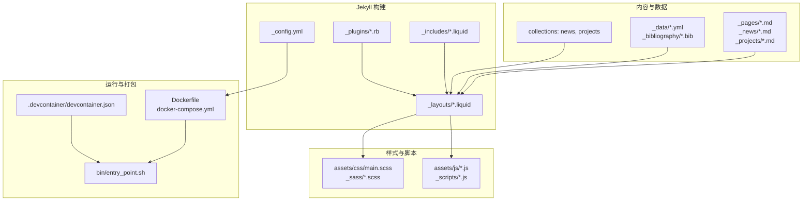
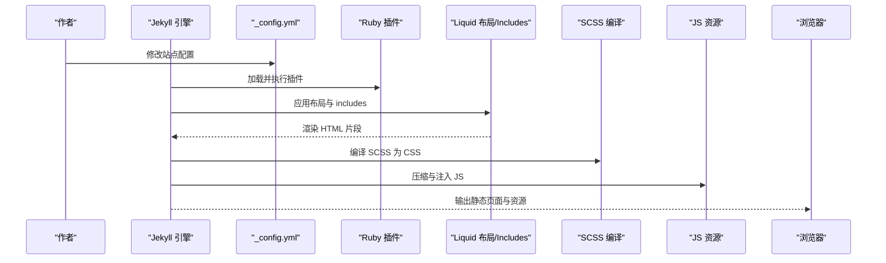
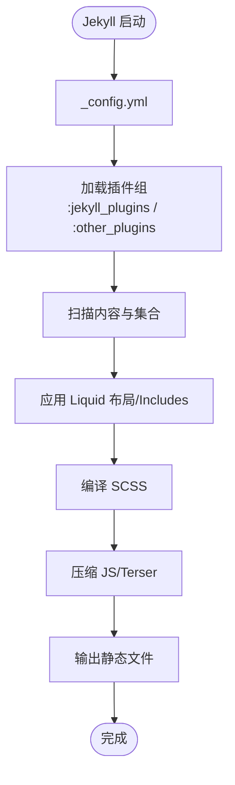
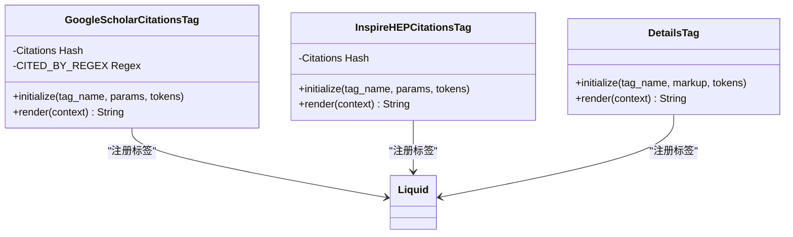
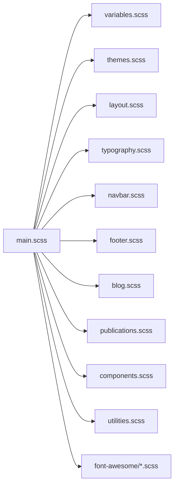
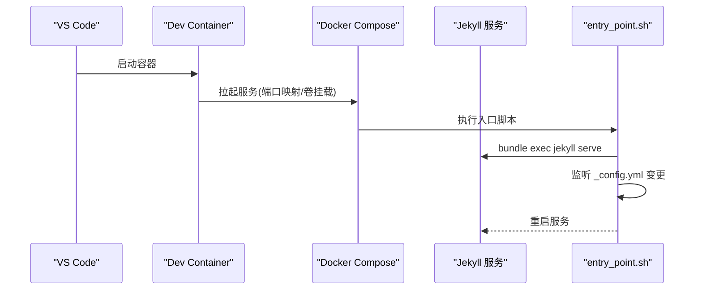
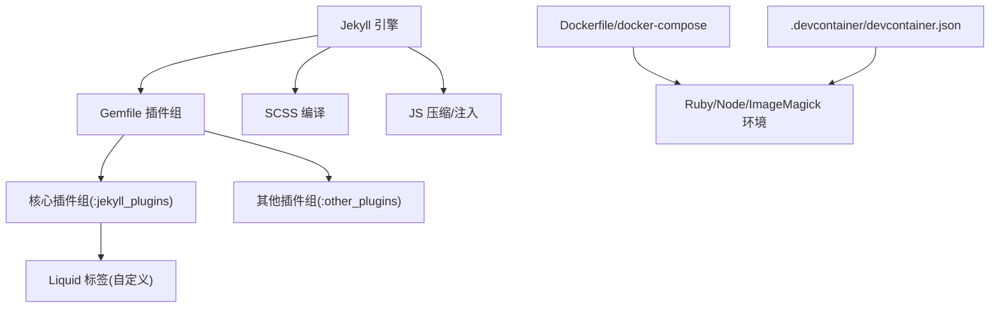

# 技术栈概览

<cite>
**本文档引用的文件**
- [_config.yml](file://_config.yml)
- [Gemfile](file://Gemfile)
- [package.json](file://package.json)
- [Dockerfile](file://Dockerfile)
- [docker-compose.yml](file://docker-compose.yml)
- [.devcontainer/devcontainer.json](file://.devcontainer/devcontainer.json)
- [bin/entry_point.sh](file://bin/entry_point.sh)
- [requirements.txt](file://requirements.txt)
- [assets/css/main.scss](file://assets/css/main.scss)
- [_plugins/google-scholar-citations.rb](file://_plugins/google-scholar-citations.rb)
- [_plugins/inspirehep-citations.rb](file://_plugins/inspirehep-citations.rb)
- [_plugins/details.rb](file://_plugins/details.rb)
- [README.md](file://README.md)
</cite>

## 目录
1. [简介](#简介)
2. [项目结构](#项目结构)
3. [核心组件](#核心组件)
4. [架构总览](#架构总览)
5. [详细组件分析](#详细组件分析)
6. [依赖关系分析](#依赖关系分析)
7. [性能考虑](#性能考虑)
8. [故障排除指南](#故障排除指南)
9. [结论](#结论)

## 简介
本技术栈概览面向李明宇个人学术主页项目，系统梳理并解释项目采用的核心技术与协作方式：Jekyll 静态站点生成器、Liquid 模板语言、SCSS 预处理器、JavaScript 功能脚本，以及 Ruby 与 Node.js 生态的依赖管理；同时覆盖 GitHub Pages 部署支持、Docker 容器化开发环境与本地 Dev Container 支持，并提供版本兼容性要点与性能优化建议。文档兼顾不同技术背景读者的理解需求，既给出高层架构视图，也提供代码级的可视化与来源标注。

## 项目结构
该项目基于 Jekyll 主题 al-folio 构建，采用“内容 + 数据 + 布局 + 样式 + 脚本”的分层组织方式：
- 内容层：Markdown 页面与集合（如新闻、项目、教学资料）
- 数据层：YAML/JSON 数据文件（简历、导航、社交、仓库等）
- 布局层：Liquid 模板布局与 includes 组件
- 样式层：SCSS 分模块组织，通过主入口导入
- 插件层：自定义 Ruby 插件扩展 Jekyll 功能（如引用统计、细节折叠）
- 脚本层：前端交互与第三方库集成的 JS 资源
- 配置层：Jekyll 全局配置、构建与优化策略

图表来源
- [_config.yml](file://_config.yml)
- [Dockerfile](file://Dockerfile)
- [docker-compose.yml](file://docker-compose.yml)
- [.devcontainer/devcontainer.json](file://.devcontainer/devcontainer.json)
- [bin/entry_point.sh](file://bin/entry_point.sh)
- [assets/css/main.scss](file://assets/css/main.scss)

章节来源
- [_config.yml](file://_config.yml)
- [Dockerfile](file://Dockerfile)
- [docker-compose.yml](file://docker-compose.yml)
- [.devcontainer/devcontainer.json](file://.devcontainer/devcontainer.json)
- [bin/entry_point.sh](file://bin/entry_point.sh)
- [assets/css/main.scss](file://assets/css/main.scss)

## 核心组件
- Jekyll 静态站点生成器：负责从内容与数据中渲染 HTML 页面，支持集合、插件与自定义布局。
- Liquid 模板语言：用于在布局与 includes 中进行数据绑定与条件控制。
- SCSS 预处理器：模块化组织样式，统一设计令牌与主题变量。
- JavaScript 功能脚本：提供搜索、数学公式、图表、图片对比、暗色模式等交互能力。
- Ruby 生态：通过 Gemfile 管理 Jekyll 核心与插件依赖。
- Node.js 生态：通过 package.json 管理格式化工具与 Prettier 插件；Dockerfile 中安装 Node.js 以支持 ExecJS 运行时。
- 自定义 Ruby 插件：扩展引用统计、细节折叠等能力。
- Docker 与 Dev Container：提供一致的开发环境与本地热重载服务。

章节来源
- [_config.yml](file://_config.yml)
- [Gemfile](file://Gemfile)
- [package.json](file://package.json)
- [Dockerfile](file://Dockerfile)
- [assets/css/main.scss](file://assets/css/main.scss)
- [_plugins/google-scholar-citations.rb](file://_plugins/google-scholar-citations.rb)
- [_plugins/inspirehep-citations.rb](file://_plugins/inspirehep-citations.rb)
- [_plugins/details.rb](file://_plugins/details.rb)

## 架构总览
下图展示从内容到最终页面的关键流程：Jekyll 读取配置与数据，应用布局与 includes，渲染 HTML；同时编译 SCSS 与压缩 JS；Docker/Dev Container 提供本地开发与热更新。

图表来源
- [_config.yml](file://_config.yml)
- [_plugins/google-scholar-citations.rb](file://_plugins/google-scholar-citations.rb)
- [_plugins/inspirehep-citations.rb](file://_plugins/inspirehep-citations.rb)
- [_plugins/details.rb](file://_plugins/details.rb)
- [assets/css/main.scss](file://assets/css/main.scss)

## 详细组件分析

### Jekyll 配置与插件生态
- 站点基础配置：标题、描述、语言、URL、页脚信息、社交媒体链接等。
- Markdown 与语法高亮：kramdown 作为解析器，rouge 作为高亮器。
- 排除与包含：明确包含 _pages 与 _scripts，排除构建产物与示例文件。
- 插件清单：涵盖归档、缓存、邮件保护、订阅、JSON 获取、图片处理、Jupyter Notebook、链接属性、最小化、正则替换、学者引用、站点地图、社交、标签页、Terser、目录、Twitter、Emoji 等。
- Scholar 配置：指定作者名、样式、BibTeX 来源、模板、分组与排序。
- 第三方库版本：集中声明常用前端库版本与完整性校验，便于 CDN 引入与安全校验。
- 图像优化：启用响应式 WebP 与懒加载，提升性能与带宽效率。

图表来源
- [_config.yml](file://_config.yml)
- [Gemfile](file://Gemfile)

章节来源
- [_config.yml](file://_config.yml)
- [Gemfile](file://Gemfile)

### Ruby 插件：引用统计与细节折叠
- Google Scholar 引用统计：通过 Liquid 标签动态抓取并缓存引用次数，避免重复请求。
- InspireHEP 引用统计：调用外部 API 获取高能物理文献引用数，人性化数字格式化。
- 细节折叠：实现 HTML details/summary 的 Liquid 标签，便于展开/折叠长内容。

图表来源
- [_plugins/google-scholar-citations.rb](file://_plugins/google-scholar-citations.rb)
- [_plugins/inspirehep-citations.rb](file://_plugins/inspirehep-citations.rb)
- [_plugins/details.rb](file://_plugins/details.rb)

章节来源
- [_plugins/google-scholar-citations.rb](file://_plugins/google-scholar-citations.rb)
- [_plugins/inspirehep-citations.rb](file://_plugins/inspirehep-citations.rb)
- [_plugins/details.rb](file://_plugins/details.rb)

### SCSS 模块化与主题系统
- 主入口：集中导入变量、主题、布局、排版、组件与字体图标等模块。
- 设计令牌：通过变量模块统一最大宽度、间距、色彩等设计参数。
- 模块化组织：按功能拆分样式文件，便于维护与复用。

图表来源
- [assets/css/main.scss](file://assets/css/main.scss)

章节来源
- [assets/css/main.scss](file://assets/css/main.scss)

### JavaScript 功能脚本与第三方库
- 功能脚本：包括搜索、Cookie 同意、分析、日历、图表、数学公式、Mermaid、Plotly、Vega、照片墙、缩放、进度条、快捷键等。
- 第三方库：通过配置集中声明版本与完整性校验，支持 CDN 引入与本地下载策略。
- Node.js 生态：Prettier 与 Liquid 格式化插件，确保代码风格一致性。

章节来源
- [_config.yml](file://_config.yml)
- [package.json](file://package.json)

### Docker 与 Dev Container 开发环境
- Dockerfile：基于 Ruby Slim，安装系统依赖（构建工具、Git、ImageMagick、Node.js、Python 包），设置环境变量与工作目录，安装 Bundler 并运行入口脚本。
- docker-compose：映射端口、挂载源码卷、设置开发环境变量，可直接启动本地服务。
- Dev Container：VS Code Dev Containers 集成，自动安装 apt 包与 Prettier 扩展，设置默认格式化与保存格式化。
- 入口脚本：自动处理 Gemfile.lock，启动 Jekyll 服务并监听配置变更自动重启，结合 inotify 实现热重载。

图表来源
- [Dockerfile](file://Dockerfile)
- [docker-compose.yml](file://docker-compose.yml)
- [.devcontainer/devcontainer.json](file://.devcontainer/devcontainer.json)
- [bin/entry_point.sh](file://bin/entry_point.sh)

章节来源
- [Dockerfile](file://Dockerfile)
- [docker-compose.yml](file://docker-compose.yml)
- [.devcontainer/devcontainer.json](file://.devcontainer/devcontainer.json)
- [bin/entry_point.sh](file://bin/entry_point.sh)

### 依赖管理与版本兼容性
- Ruby 生态：Gemfile 明确声明 jekyll 与插件组，使用特定分支的 jekyll-terser，确保与 Jekyll 版本兼容。
- Node.js 生态：package.json 引入 Prettier 与 Shopify Liquid 格式化插件，保证 Liquid 模板风格一致。
- Python 生态：requirements.txt 指定 nbconvert、PyYAML、rendercv[full]、scholarly 等，支撑 Jupyter Notebook 转换与 CV 生成。
- 第三方库版本：_config.yml 的 third_party_libraries 字段集中声明版本号与完整性哈希，便于安全与缓存优化。

章节来源
- [Gemfile](file://Gemfile)
- [package.json](file://package.json)
- [requirements.txt](file://requirements.txt)
- [_config.yml](file://_config.yml)

## 依赖关系分析
- Jekyll 与插件：Jekyll 为核心引擎，插件组分为“影响构建”的核心插件与“开发/外部数据”的其他插件，二者在 Gemfile 中分组管理。
- Ruby 插件与 Liquid：自定义插件通过 Liquid 注册标签，向模板提供动态数据能力。
- 样式与脚本：SCSS 模块化组织，JS 脚本按需引入；两者均受 Jekyll 构建流程统一处理。
- 容器与本地：Dockerfile 与 docker-compose 提供一致的 Ruby/Node/ImageMagick 环境；Dev Container 在 VS Code 中复用相同镜像与特性。

图表来源
- [Gemfile](file://Gemfile)
- [_plugins/google-scholar-citations.rb](file://_plugins/google-scholar-citations.rb)
- [Dockerfile](file://Dockerfile)
- [docker-compose.yml](file://docker-compose.yml)
- [.devcontainer/devcontainer.json](file://.devcontainer/devcontainer.json)

章节来源
- [Gemfile](file://Gemfile)
- [_plugins/google-scholar-citations.rb](file://_plugins/google-scholar-citations.rb)
- [Dockerfile](file://Dockerfile)
- [docker-compose.yml](file://docker-compose.yml)
- [.devcontainer/devcontainer.json](file://.devcontainer/devcontainer.json)

## 性能考虑
- 图像优化：启用响应式 WebP 与懒加载，减少首屏体积与带宽占用。
- 资源压缩：Jekyll Minifier 与 Terser 配合，压缩 JS/CSS，降低传输体积。
- 缓存与 CDN：集中声明第三方库版本与完整性校验，利于浏览器缓存与安全校验。
- 构建时间：合理分组插件，避免不必要的构建步骤；在 Docker/Dev Container 中复用缓存层。
- 本地开发：入口脚本监听配置变更自动重启，结合热重载提升迭代效率。

章节来源
- [_config.yml](file://_config.yml)

## 故障排除指南
- 构建权限问题：Dockerfile 中注释了非 root 用户与权限修复方案，若出现缓存目录权限错误，可参考注释调整。
- Gemfile.lock 管理：入口脚本会根据 Git 跟踪状态决定保留或移除 Gemfile.lock，避免锁定冲突。
- 端口占用：docker-compose 默认映射 8080:8080 与 35729:35729，若被占用请调整映射或释放端口。
- 本地格式化：Dev Container 已设置默认格式化器与保存格式化，若格式化无效，请检查 VS Code 设置与扩展安装。

章节来源
- [Dockerfile](file://Dockerfile)
- [bin/entry_point.sh](file://bin/entry_point.sh)
- [docker-compose.yml](file://docker-compose.yml)
- [.devcontainer/devcontainer.json](file://.devcontainer/devcontainer.json)

## 结论
本项目以 Jekyll 为核心，结合 Liquid 模板、SCSS 模块化与丰富的 JavaScript 功能脚本，构建出现代化且高度可定制的学术主页。Ruby 与 Node.js 生态通过 Gemfile 与 package.json 实现清晰的依赖管理，Docker 与 Dev Container 提供一致的开发体验。配合图像优化、资源压缩与第三方库版本管控，整体具备良好的性能与可维护性。对于不同技术背景的开发者，均可在此基础上快速上手与持续演进。