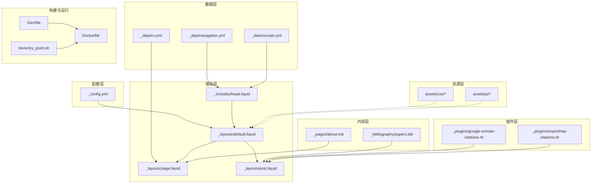
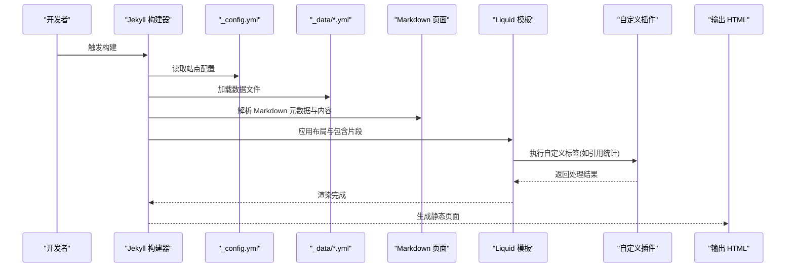
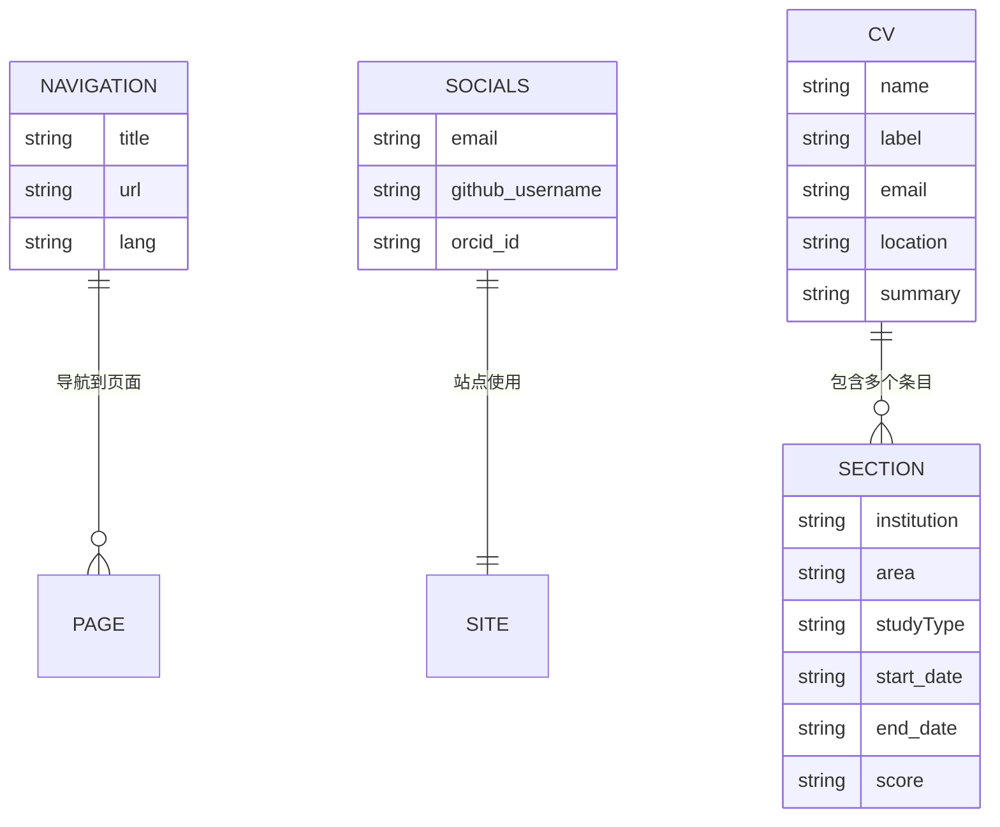
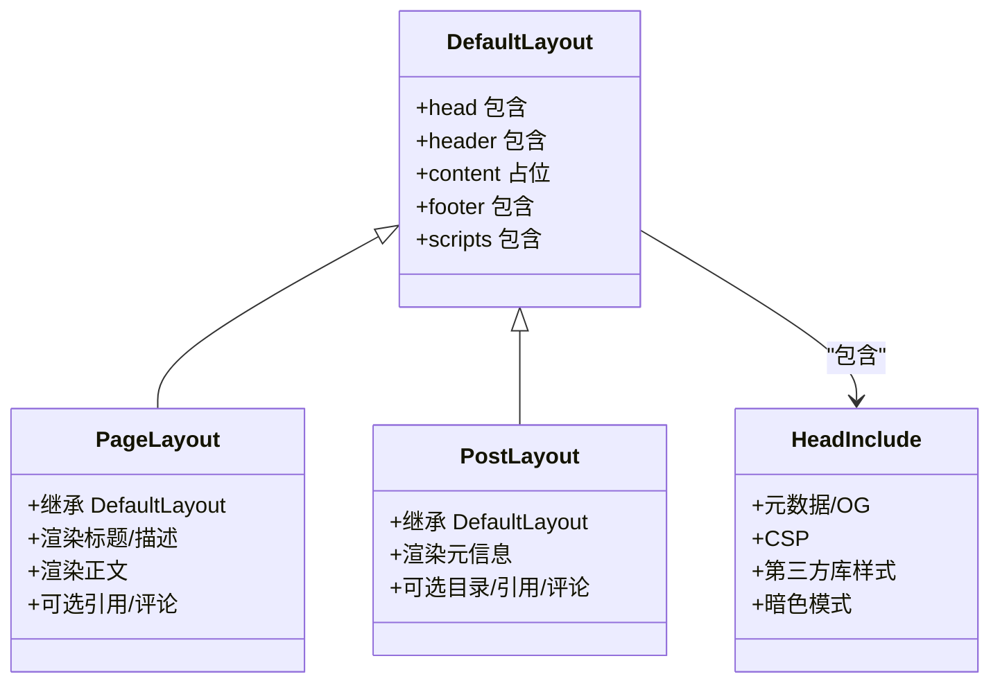
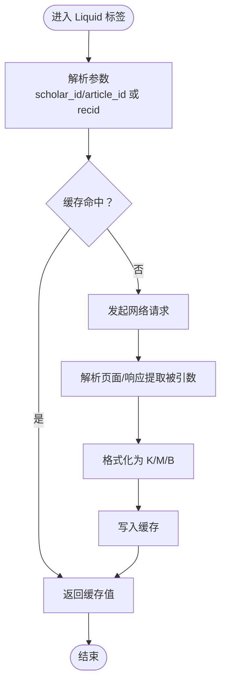
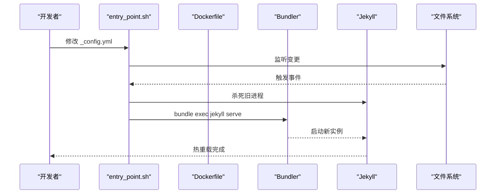
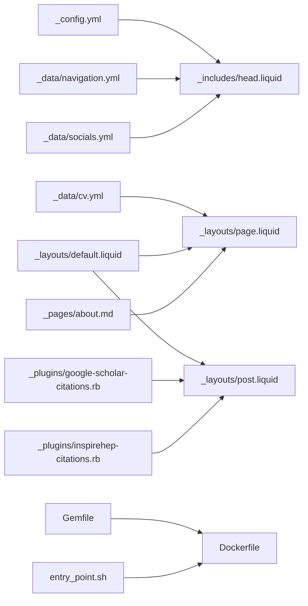

# 架构设计

<cite>
**本文引用的文件**
- [_config.yml](file://_config.yml)
- [Gemfile](file://Gemfile)
- [package.json](file://package.json)
- [Dockerfile](file://Dockerfile)
- [README.md](file://README.md)
- [bin/entry_point.sh](file://bin/entry_point.sh)
- [_data/cv.yml](file://_data/cv.yml)
- [_data/navigation.yml](file://_data/navigation.yml)
- [_data/socials.yml](file://_data/socials.yml)
- [_layouts/default.liquid](file://_layouts/default.liquid)
- [_layouts/page.liquid](file://_layouts/page.liquid)
- [_layouts/post.liquid](file://_layouts/post.liquid)
- [_includes/head.liquid](file://_includes/head.liquid)
- [_pages/about.md](file://_pages/about.md)
- [_plugins/google-scholar-citations.rb](file://_plugins/google-scholar-citations.rb)
- [_plugins/inspirehep-citations.rb](file://_plugins/inspirehep-citations.rb)
- [_bibliography/papers.bib](file://_bibliography/papers.bib)
</cite>

## 目录
1. [简介](#简介)
2. [项目结构](#项目结构)
3. [核心组件](#核心组件)
4. [架构总览](#架构总览)
5. [详细组件分析](#详细组件分析)
6. [依赖分析](#依赖分析)
7. [性能考虑](#性能考虑)
8. [故障排查指南](#故障排查指南)
9. [结论](#结论)
10. [附录](#附录)

## 简介
本项目是基于 Jekyll 的静态站点生成系统，采用“数据驱动”的设计模式，通过 YAML 配置与数据文件驱动页面渲染，结合 Liquid 模板引擎与自定义插件实现动态内容注入（如引用统计）。构建流程由 Ruby 生态的 Bundler 管理插件，支持本地开发与容器化部署，并通过入口脚本实现配置热重载。

## 项目结构
项目采用典型的 Jekyll 层次化组织方式：
- 配置层：_config.yml 定义站点元信息、功能开关、第三方库版本与完整性校验、集合与插件等
- 数据层：_data/ 下的 YAML 文件（如 cv.yml、navigation.yml、socials.yml）承载可复用业务数据
- 模板层：_layouts/ 定义页面骨架与通用结构；_includes/ 提供可复用片段（头部、脚注、组件等）
- 内容层：_pages/、_posts/、_news/ 等目录下的 Markdown 页面与文章
- 资源层：assets/ 下的样式、脚本、字体、媒体与构建产物
- 插件层：_plugins/ 自定义 Liquid 标签与外部数据抓取逻辑
- 构建与运行：Gemfile 声明 Jekyll 与插件依赖；Dockerfile 与 entry_point.sh 支持容器化开发与热重载

**图示来源**
- [_config.yml](file://_config.yml)
- [_data/cv.yml](file://_data/cv.yml)
- [_data/navigation.yml](file://_data/navigation.yml)
- [_data/socials.yml](file://_data/socials.yml)
- [_layouts/default.liquid](file://_layouts/default.liquid)
- [_layouts/page.liquid](file://_layouts/page.liquid)
- [_layouts/post.liquid](file://_layouts/post.liquid)
- [_includes/head.liquid](file://_includes/head.liquid)
- [_pages/about.md](file://_pages/about.md)
- [_plugins/google-scholar-citations.rb](file://_plugins/google-scholar-citations.rb)
- [_plugins/inspirehep-citations.rb](file://_plugins/inspirehep-citations.rb)
- [Gemfile](file://Gemfile)
- [Dockerfile](file://Dockerfile)
- [bin/entry_point.sh](file://bin/entry_point.sh)

**章节来源**
- [_config.yml](file://_config.yml)
- [Gemfile](file://Gemfile)
- [Dockerfile](file://Dockerfile)
- [README.md](file://README.md)

## 核心组件
- 配置中心：_config.yml 提供站点标题、语言、主题色系、第三方库版本与完整性校验、集合与插件列表、Jekyll 渲染选项、Jekyll Scholar 引文配置等
- 数据中心：_data/ 下的 YAML 文件提供导航、社交链接、CV 结构化数据等，被模板与页面直接消费
- 模板引擎：Liquid 在 Jekyll 中负责模板解析与渲染，支持变量、过滤器、标签与包含
- 插件扩展：_plugins/ 中的 Ruby 扩展为 Liquid 注册自定义标签，用于抓取外部引用计数
- 构建与运行：Gemfile 管理依赖，Dockerfile 提供容器镜像，entry_point.sh 实现配置变更监听与自动重启

**章节来源**
- [_config.yml](file://_config.yml)
- [_data/navigation.yml](file://_data/navigation.yml)
- [_data/socials.yml](file://_data/socials.yml)
- [_data/cv.yml](file://_data/cv.yml)
- [_plugins/google-scholar-citations.rb](file://_plugins/google-scholar-citations.rb)
- [_plugins/inspirehep-citations.rb](file://_plugins/inspirehep-citations.rb)
- [Gemfile](file://Gemfile)
- [Dockerfile](file://Dockerfile)
- [bin/entry_point.sh](file://bin/entry_point.sh)

## 架构总览
Jekyll 在构建阶段读取配置、扫描内容与数据、加载插件，随后以 Liquid 模板为载体，将数据与内容合并生成静态 HTML。插件在渲染过程中通过网络请求获取外部数据并缓存，确保构建稳定性与性能。

**图示来源**
- [_config.yml](file://_config.yml)
- [_data/cv.yml](file://_data/cv.yml)
- [_pages/about.md](file://_pages/about.md)
- [_layouts/default.liquid](file://_layouts/default.liquid)
- [_includes/head.liquid](file://_includes/head.liquid)
- [_plugins/google-scholar-citations.rb](file://_plugins/google-scholar-citations.rb)
- [_plugins/inspirehep-citations.rb](file://_plugins/inspirehep-citations.rb)

## 详细组件分析

### 组件 A：配置层（_config.yml）
- 站点元信息与主题设置：标题、作者名、语言、图标、页脚文本、关键词等
- 功能开关：搜索、导航栏固定、页脚固定、数学公式、暗色模式、懒加载图片等
- 第三方库管理：通过 third_party_libraries 字段统一声明版本、URL 与完整性校验，便于缓存与安全
- 集合与插件：collections 定义 news、projects 等集合；plugins 列表启用 Jekyll 生态插件
- Jekyll Scholar：配置作者名、样式、BibTeX 来源、分组与排序、徽章开关等
- Jekyll Archives：按年/标签/分类生成归档页
- Jekyll Minifier/Terser：压缩 HTML/CSS/JS，提升加载性能
- 外部服务：Google Analytics、Cookie 同意、OpenGraph/Social 预览等

**章节来源**
- [_config.yml](file://_config.yml)

### 组件 B：数据层（_data/）
- 导航数据：navigation.yml 提供多语言导航项，供模板渲染主导航
- 社交数据：socials.yml 提供邮箱、GitHub 用户名、ORCID 等，用于展示社交链接
- CV 数据：cv.yml 定义姓名、头衔、联系方式、地址、教育经历、工作经历、发表论文、奖项、技能、语言、兴趣等，结构化程度高，便于模板复用

**图示来源**
- [_data/navigation.yml](file://_data/navigation.yml)
- [_data/socials.yml](file://_data/socials.yml)
- [_data/cv.yml](file://_data/cv.yml)

**章节来源**
- [_data/navigation.yml](file://_data/navigation.yml)
- [_data/socials.yml](file://_data/socials.yml)
- [_data/cv.yml](file://_data/cv.yml)

### 组件 C：模板层（_layouts/ 与 _includes/）
- default.liquid：定义基础 HTML 结构、语言、头部包含、主体内容区、页脚与脚本包含
- page.liquid：继承默认布局，渲染页面标题、描述、正文与评论区（如启用）
- post.liquid：继承默认布局，渲染文章元信息（日期、作者、标签、分类）、目录（如启用）、正文、引用与评论区
- head.liquid：集中管理元数据、CSP、第三方库样式、图标、暗色模式脚本、图片库样式等，依据页面特性按需加载

**图示来源**
- [_layouts/default.liquid](file://_layouts/default.liquid)
- [_layouts/page.liquid](file://_layouts/page.liquid)
- [_layouts/post.liquid](file://_layouts/post.liquid)
- [_includes/head.liquid](file://_includes/head.liquid)

**章节来源**
- [_layouts/default.liquid](file://_layouts/default.liquid)
- [_layouts/page.liquid](file://_layouts/page.liquid)
- [_layouts/post.liquid](file://_layouts/post.liquid)
- [_includes/head.liquid](file://_includes/head.liquid)

### 组件 D：内容层（_pages/about.md）
- 使用 YAML Front Matter 声明布局、永久链接、副标题、语言等
- 正文为 Markdown 内容，配合模板与数据文件渲染为完整页面
- 可通过页面元数据控制是否显示精选论文、社交卡片、公告滚动等

**章节来源**
- [_pages/about.md](file://_pages/about.md)

### 组件 E：插件层（_plugins/）
- google-scholar-citations.rb：注册 Liquid 标签，抓取 Google Scholar 页面元信息中的“被引次数”，带缓存与随机延时避免封禁
- inspirehep-citations.rb：注册 Liquid 标签，调用 INSPIRE HEP API 获取文献被引计数，格式化为易读数字

**图示来源**
- [_plugins/google-scholar-citations.rb](file://_plugins/google-scholar-citations.rb)
- [_plugins/inspirehep-citations.rb](file://_plugins/inspirehep-citations.rb)

**章节来源**
- [_plugins/google-scholar-citations.rb](file://_plugins/google-scholar-citations.rb)
- [_plugins/inspirehep-citations.rb](file://_plugins/inspirehep-citations.rb)

### 组件 F：资源层（assets/）
- 样式：CSS 主题与第三方库样式，按需在 head.liquid 中引入
- 脚本：主题切换、数学公式、图表、交互组件等 JS
- 字体与媒体：图标字体、图片、视频等
- 构建工具：package.json 中的 Prettier 与 Liquid 插件，保证模板格式一致性

**章节来源**
- [_includes/head.liquid](file://_includes/head.liquid)
- [package.json](file://package.json)

### 组件 G：构建与运行（Gemfile、Dockerfile、entry_point.sh）
- Gemfile：声明 Jekyll 与一组核心插件，确保构建环境一致
- Dockerfile：安装 Ruby、Node、ImageMagick、nbconvert 等依赖，预装 Jekyll 与 Bundler 并暴露端口
- entry_point.sh：监听 _config.yml 变更，自动重启 Jekyll 开发服务器，支持热重载

**图示来源**
- [Dockerfile](file://Dockerfile)
- [bin/entry_point.sh](file://bin/entry_point.sh)
- [Gemfile](file://Gemfile)

**章节来源**
- [Gemfile](file://Gemfile)
- [Dockerfile](file://Dockerfile)
- [bin/entry_point.sh](file://bin/entry_point.sh)

## 依赖分析
- 配置对模板与数据的依赖：_config.yml 控制第三方库版本与功能开关，影响 head.liquid 的按需加载；数据文件驱动页面渲染
- 模板对数据与包含的依赖：default.liquid 依赖 head.liquid、footer.liquid、scripts.liquid 等；page.liquid/post.liquid 依赖 cv.yml 等数据
- 内容对模板的依赖：_pages/about.md 通过 Front Matter 指定布局，最终由 page.liquid 渲染
- 插件对网络与缓存的依赖：google-scholar-citations.rb 与 inspirehep-citations.rb 依赖网络访问与内存缓存
- 构建对依赖管理的依赖：Gemfile 管理插件版本，Dockerfile 提供一致的构建环境

**图示来源**
- [_config.yml](file://_config.yml)
- [_data/cv.yml](file://_data/cv.yml)
- [_data/navigation.yml](file://_data/navigation.yml)
- [_data/socials.yml](file://_data/socials.yml)
- [_layouts/default.liquid](file://_layouts/default.liquid)
- [_layouts/page.liquid](file://_layouts/page.liquid)
- [_layouts/post.liquid](file://_layouts/post.liquid)
- [_pages/about.md](file://_pages/about.md)
- [_plugins/google-scholar-citations.rb](file://_plugins/google-scholar-citations.rb)
- [_plugins/inspirehep-citations.rb](file://_plugins/inspirehep-citations.rb)
- [Gemfile](file://Gemfile)
- [Dockerfile](file://Dockerfile)
- [bin/entry_point.sh](file://bin/entry_point.sh)

**章节来源**
- [_config.yml](file://_config.yml)
- [_layouts/default.liquid](file://_layouts/default.liquid)
- [_includes/head.liquid](file://_includes/head.liquid)
- [_pages/about.md](file://_pages/about.md)
- [_plugins/google-scholar-citations.rb](file://_plugins/google-scholar-citations.rb)
- [_plugins/inspirehep-citations.rb](file://_plugins/inspirehep-citations.rb)
- [Gemfile](file://Gemfile)
- [Dockerfile](file://Dockerfile)
- [bin/entry_point.sh](file://bin/entry_point.sh)

## 性能考虑
- 资源优化：third_party_libraries 统一版本与完整性校验，利于浏览器缓存；lazy_loading_images 与响应式图片（imagemagick）减少首屏体积
- 构建优化：jekyll-minifier 与 terser 压缩静态资源；sass 压缩输出；第三方库通过 CDN 引入
- 运行时优化：入口脚本监听配置变更自动重启，提升迭代效率；模板按需加载样式与脚本，避免不必要的资源下载

**章节来源**
- [_config.yml](file://_config.yml)
- [_includes/head.liquid](file://_includes/head.liquid)
- [Dockerfile](file://Dockerfile)
- [bin/entry_point.sh](file://bin/entry_point.sh)

## 故障排查指南
- 构建失败或权限问题：Dockerfile 中注释了非 root 用户与权限修复步骤，若出现缓存目录权限错误，可参考注释说明调整
- 插件加载异常：确认 Gemfile 中插件版本与 Bundler 一致，必要时清理 Gemfile.lock 并重新 bundle install
- 引用统计不可用：检查网络连通性与目标站点反爬策略；插件内部已做缓存与异常捕获，若持续失败可查看日志定位具体异常
- 热重载不生效：确认 entry_point.sh 已赋予执行权限且监听路径正确；容器内文件变更应触发重启

**章节来源**
- [Dockerfile](file://Dockerfile)
- [Gemfile](file://Gemfile)
- [_plugins/google-scholar-citations.rb](file://_plugins/google-scholar-citations.rb)
- [_plugins/inspirehep-citations.rb](file://_plugins/inspirehep-citations.rb)
- [bin/entry_point.sh](file://bin/entry_point.sh)

## 结论
该系统以 Jekyll 为核心，通过配置驱动、数据驱动与模板驱动实现高度模块化的静态站点生成。_config.yml 作为单一事实来源，贯穿样式、功能、插件与构建配置；_data/ 提供结构化业务数据；_layouts/ 与 _includes/ 通过 Liquid 组合形成可复用的页面骨架；_plugins/ 扩展外部数据能力；Gemfile、Dockerfile 与 entry_point.sh 保障构建与开发体验。整体架构清晰、耦合度低、易于维护与扩展。

## 附录
- 快速开始与安装部署：参见项目根目录文档
- 自定义指南：参见 CUSTOMIZE.md 与 README.md 中的“Customizing”部分
- 常见问题：参见 FAQ.md 与 TROUBLESHOOTING.md

**章节来源**
- [README.md](file://README.md)