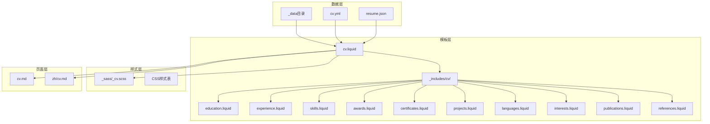
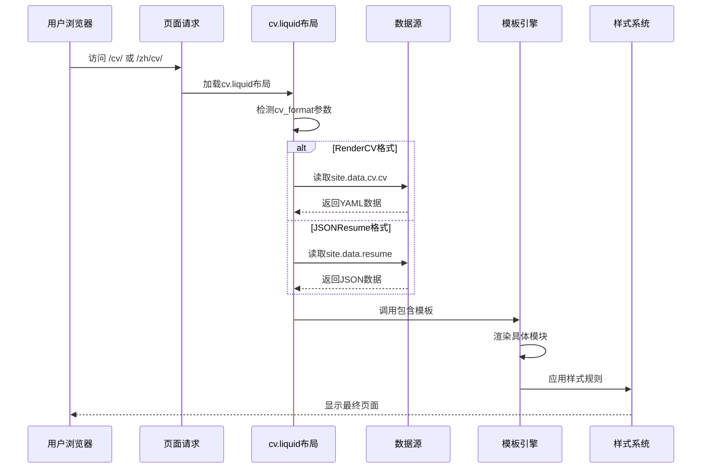
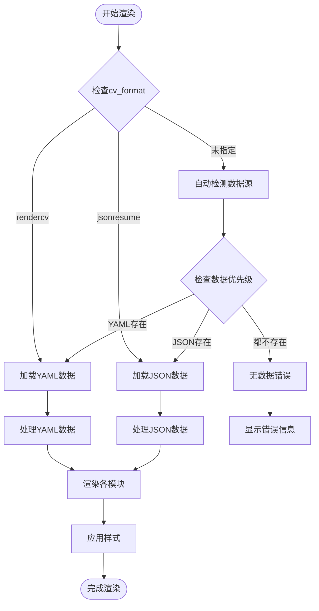
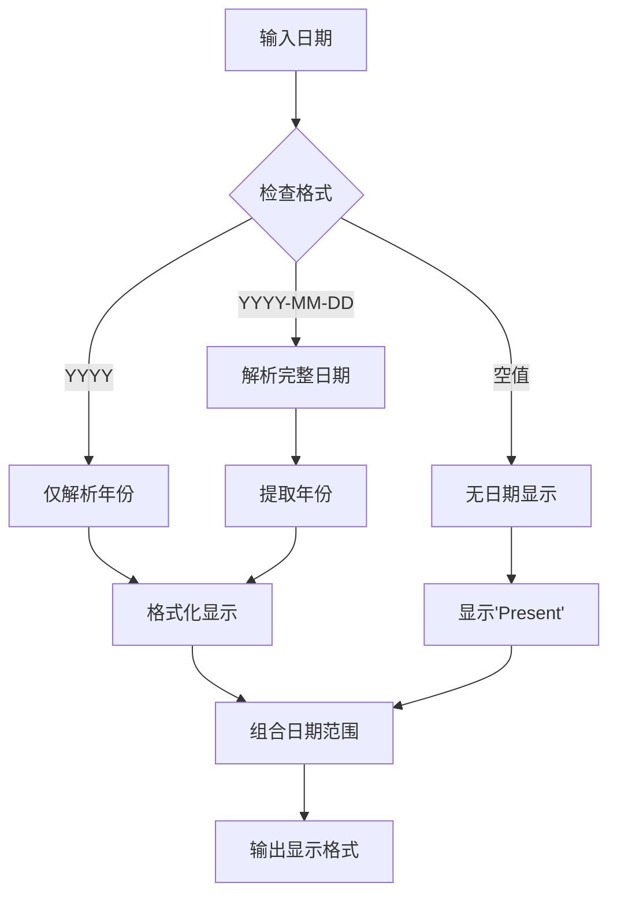
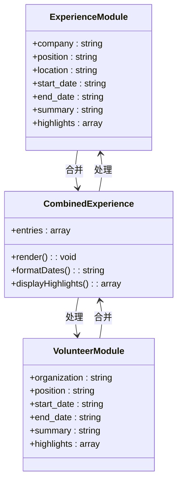
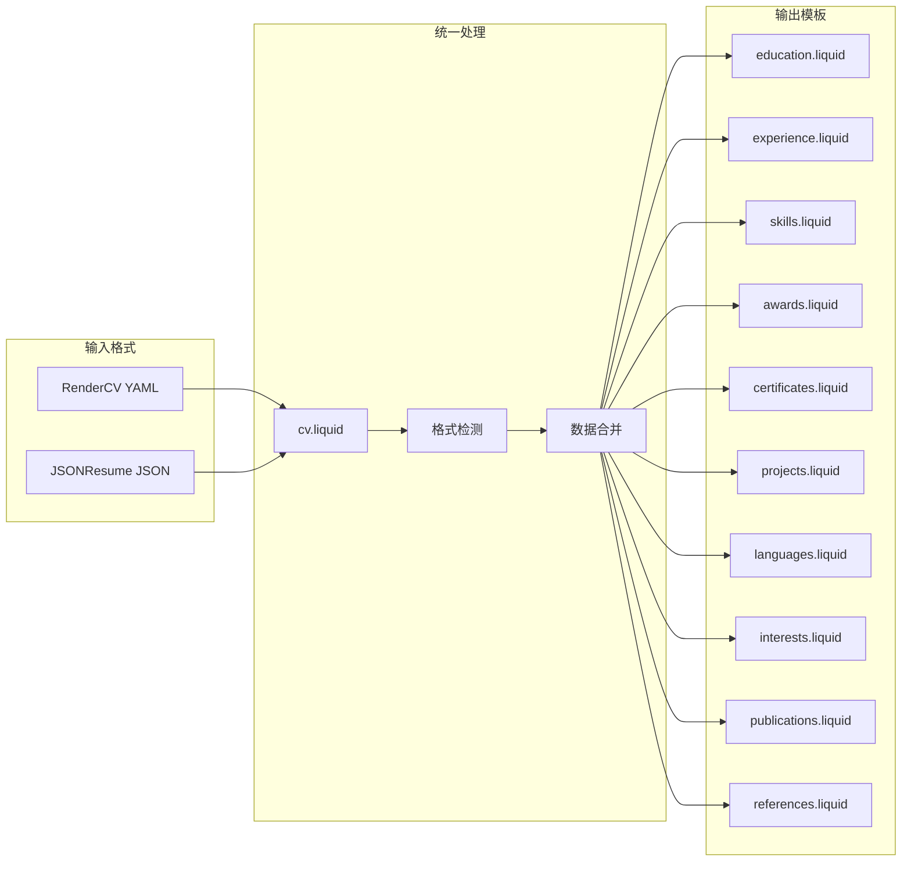
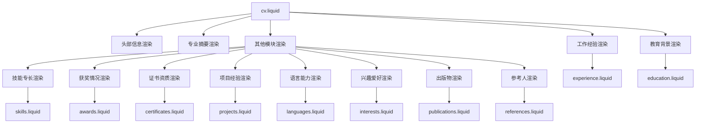

# CV数据结构设计

<cite>
**本文档引用的文件**
- [cv.yml](file://_data/cv.yml)
- [cv.liquid](file://_layouts/cv.liquid)
- [education.liquid](file://_includes/cv/education.liquid)
- [experience.liquid](file://_includes/cv/experience.liquid)
- [skills.liquid](file://_includes/cv/skills.liquid)
- [awards.liquid](file://_includes/cv/awards.liquid)
- [certificates.liquid](file://_includes/cv/certificates.liquid)
- [projects.liquid](file://_includes/cv/projects.liquid)
- [languages.liquid](file://_includes/cv/languages.liquid)
- [interests.liquid](file://_includes/cv/interests.liquid)
- [publications.liquid](file://_includes/cv/publications.liquid)
- [references.liquid](file://_includes/cv/references.liquid)
- [_config.yml](file://_config.yml)
- [resume.json](file://assets/json/resume.json)
- [cv.md](file://_pages/cv.md)
- [cv_zh.md](file://_pages/zh/cv.md)
- [_cv.scss](file://_sass/_cv.scss)
</cite>

## 目录
1. [简介](#简介)
2. [项目结构](#项目结构)
3. [核心组件](#核心组件)
4. [架构概览](#架构概览)
5. [详细组件分析](#详细组件分析)
6. [依赖分析](#依赖分析)
7. [性能考虑](#性能考虑)
8. [故障排除指南](#故障排除指南)
9. [结论](#结论)
10. [附录](#附录)

## 简介

本文件为该Jekyll网站的CV数据结构设计提供全面的技术文档。重点解析cv.yml配置文件的数据模型与字段定义，涵盖教育背景、工作经验、技能专长、获奖情况、证书资质等多个模块的完整数据结构。文档详细说明每个字段的数据类型、验证规则和必填项设置，并提供完整的数据模型图和字段映射关系。同时包含实际的YAML配置示例和数据验证规则，解释数据结构如何影响页面渲染和样式显示，并涵盖数据字段的国际化支持和多语言配置方法。

## 项目结构

该CV系统采用Jekyll静态站点生成器，结合RenderCV和JSONResume两种格式支持。整体架构分为数据层、模板层和样式层三个层次：

**图表来源**
- [cv.yml:1-95](file://_data/cv.yml#L1-L95)
- [cv.liquid:1-393](file://_layouts/cv.liquid#L1-L393)
- [_config.yml:639-656](file://_config.yml#L639-L656)

**章节来源**
- [cv.yml:1-95](file://_data/cv.yml#L1-L95)
- [cv.liquid:1-393](file://_layouts/cv.liquid#L1-L393)
- [_config.yml:639-656](file://_config.yml#L639-L656)

## 核心组件

### 数据模型概述

该系统支持两种主要的CV数据格式：RenderCV（YAML格式）和JSONResume（JSON格式）。两者都通过统一的Liquid模板进行渲染，确保输出格式的一致性。

### RenderCV数据模型

RenderCV格式使用YAML语法，具有以下特点：
- 层次化的数据结构
- 支持嵌套对象和数组
- 字段名称标准化
- 自动日期处理

### JSONResume数据模型

JSONResume格式使用标准JSON语法：
- 规范化的字段命名约定
- 明确的数据类型定义
- 标准化的日期格式
- 兼容性更好的跨平台支持

**章节来源**
- [cv.yml:1-95](file://_data/cv.yml#L1-L95)
- [resume.json:1-163](file://assets/json/resume.json#L1-L163)
- [cv.liquid:1-393](file://_layouts/cv.liquid#L1-L393)

## 架构概览

系统采用"数据驱动模板"的架构模式，通过统一的布局模板处理不同格式的数据源：

**图表来源**
- [cv.liquid:42-57](file://_layouts/cv.liquid#L42-L57)
- [cv.md](file://_pages/cv.md#L7)
- [cv_zh.md](file://_pages/zh/cv.md#L7)

### 统一渲染机制

系统实现了高度统一的渲染机制，能够自动适配两种数据格式：

**图表来源**
- [cv.liquid:42-57](file://_layouts/cv.liquid#L42-L57)
- [cv.liquid:141-197](file://_layouts/cv.liquid#L141-L197)

**章节来源**
- [cv.liquid:1-393](file://_layouts/cv.liquid#L1-L393)

## 详细组件分析

### 基本信息模块

基本信息模块包含个人的核心标识信息，是CV展示的基础数据。

#### 字段定义

| 字段名 | 数据类型 | 必填 | 默认值 | 描述 |
|--------|----------|------|--------|------|
| name | 字符串 | 是 | 空字符串 | 姓名 |
| label | 字符串 | 否 | 空字符串 | 职业头衔或专业描述 |
| email | 字符串 | 否 | 空字符串 | 电子邮箱地址 |
| phone | 字符串 | 否 | 空字符串 | 电话号码 |
| location | 字符串 | 否 | 空字符串 | 地理位置信息 |
| address | 对象 | 否 | 空对象 | 详细地址信息 |
| website | 字符串 | 否 | 空字符串 | 个人网站链接 |
| summary | 字串 | 否 | 空字符串 | 专业摘要或个人简介 |

#### 地址信息结构

| 子字段 | 数据类型 | 必填 | 描述 |
|--------|----------|------|------|
| street | 字符串 | 否 | 街道地址 |
| city | 字符串 | 否 | 城市名称 |
| region | 字串 | 否 | 省/州/地区 |
| postalCode | 字符串 | 否 | 邮政编码 |
| countryCode | 字符串 | 否 | 国家代码（ISO 3166-1 alpha-2） |

**章节来源**
- [cv.yml:2-7](file://_data/cv.yml#L2-L7)
- [cv.yml:13-16](file://_data/cv.yml#L13-L16)
- [cv.liquid:64-112](file://_layouts/cv.liquid#L64-L112)

### 社交网络模块

社交网络模块用于展示个人在各种平台上的账号信息。

#### 字段定义

| 字段名 | 数据类型 | 必填 | 描述 |
|--------|----------|------|------|
| network | 字符串 | 是 | 平台名称（如GitHub、LinkedIn等） |
| username | 字符串 | 是 | 用户名 |
| url | 字符串 | 否 | 完整的个人主页链接 |

**章节来源**
- [cv.yml:9-12](file://_data/cv.yml#L9-L12)
- [resume.json:14-21](file://assets/json/resume.json#L14-L21)

### 教育背景模块

教育背景模块记录个人的学习经历和学术成就。

#### 字段定义

| 字段名 | 数据类型 | 必填 | 描述 |
|--------|----------|------|------|
| institution | 字符串 | 是 | 学校名称 |
| location | 字符串 | 否 | 学校地理位置 |
| url | 字符串 | 否 | 学校官网链接 |
| area | 字符串 | 否 | 专业领域 |
| studyType | 字符串 | 否 | 学位类型（如B.Eng.、M.S.等） |
| degree | 字符串 | 否 | 学位名称（兼容JSONResume） |
| start_date | 字符串 | 否 | 开始日期（YYYY格式或YYYY-MM-DD） |
| end_date | 字符串 | 否 | 结束日期（YYYY格式或YYYY-MM-DD） |
| score | 字符串 | 否 | 成绩信息 |
| courses | 数组 | 否 | 主修课程列表 |
| highlights | 数组 | 否 | 学术亮点或成就 |

#### 日期处理逻辑

系统支持灵活的日期格式输入和统一的显示格式：

**图表来源**
- [education.liquid:13-27](file://_includes/cv/education.liquid#L13-L27)
- [experience.liquid:13-27](file://_includes/cv/experience.liquid#L13-L27)

**章节来源**
- [cv.yml:18-32](file://_data/cv.yml#L18-L32)
- [resume.json:37-54](file://assets/json/resume.json#L37-L54)
- [education.liquid:1-94](file://_includes/cv/education.liquid#L1-L94)

### 工作经验模块

工作经验模块记录个人的职业工作经历。

#### 字段定义

| 字段名 | 数据类型 | 必填 | 描述 |
|--------|----------|------|------|
| company | 字符串 | 是 | 公司名称 |
| position | 字符串 | 是 | 职位头衔 |
| name | 字符串 | 否 | 公司名称（兼容JSONResume） |
| organization | 字符串 | 否 | 组织名称（兼容JSONResume） |
| location | 字符串 | 否 | 工作地点 |
| url | 字符串 | 否 | 公司官网链接 |
| start_date | 字符串 | 否 | 开始日期 |
| end_date | 字符串 | 否 | 结束日期 |
| summary | 字符串 | 否 | 工作摘要 |
| highlights | 数组 | 否 | 主要成就和职责 |

#### 经验合并机制

系统自动将Experience和Volunteer两个模块合并显示：

**图表来源**
- [cv.liquid:124-138](file://_layouts/cv.liquid#L124-L138)
- [experience.liquid:1-92](file://_includes/cv/experience.liquid#L1-L92)

**章节来源**
- [cv.yml:33-44](file://_data/cv.yml#L33-L44)
- [resume.json:22-36](file://assets/json/resume.json#L22-L36)
- [cv.liquid:123-139](file://_layouts/cv.liquid#L123-L139)

### 技能专长模块

技能专长模块展示个人的专业技能和技术能力。

#### 字段定义

| 字段名 | 数据类型 | 必填 | 描述 |
|--------|----------|------|------|
| name | 字符串 | 是 | 技能名称 |
| level | 字符串 | 否 | 技能等级（如Advanced、Intermediate等） |
| icon | 字符串 | 否 | Font Awesome图标类名 |
| keywords | 字符串或数组 | 否 | 技能关键词列表 |

#### 关键词处理

系统支持两种关键词格式：
- 字符串格式：逗号分隔的关键字
- 数组格式：独立的关键词项

**章节来源**
- [cv.yml:68-83](file://_data/cv.yml#L68-L83)
- [resume.json:77-112](file://assets/json/resume.json#L77-L112)
- [skills.liquid:1-33](file://_includes/cv/skills.liquid#L1-L33)

### 获奖情况模块

获奖情况模块记录个人获得的各种奖项和荣誉。

#### 字段定义

| 字段名 | 数据类型 | 必填 | 描述 |
|--------|----------|------|------|
| title | 字符串 | 是 | 奖项名称 |
| name | 字符串 | 否 | 奖项名称（兼容JSONResume） |
| date | 字符串 | 否 | 获奖日期 |
| awarder | 字符串 | 否 | 授奖机构 |
| summary | 字符串 | 否 | 奖项详情 |
| url | 字符串 | 否 | 奖项相关链接 |

**章节来源**
- [cv.yml:53-67](file://_data/cv.yml#L53-L67)
- [resume.json:55-68](file://assets/json/resume.json#L55-L68)
- [awards.liquid:1-67](file://_includes/cv/awards.liquid#L1-L67)

### 证书资质模块

证书资质模块展示个人获得的专业证书和资格认证。

#### 字段定义

| 字段名 | 数据类型 | 必填 | 描述 |
|--------|----------|------|------|
| name | 字符串 | 是 | 证书名称 |
| issuer | 字符串 | 否 | 发证机构 |
| date | 字符串 | 否 | 获得日期 |
| url | 字符串 | 否 | 证书验证链接 |
| icon | 字符串 | 否 | Font Awesome图标类名 |

**章节来源**
- [cv.yml:17-17](file://_data/cv.yml#L17-L17)
- [resume.json:137-137](file://assets/json/resume.json#L137-L137)
- [certificates.liquid:1-29](file://_includes/cv/certificates.liquid#L1-L29)

### 项目经验模块

项目经验模块记录个人参与或主导的项目活动。

#### 字段定义

| 字段名 | 数据类型 | 必填 | 描述 |
|--------|----------|------|------|
| name | 字符串 | 是 | 项目名称 |
| summary | 字符串 | 否 | 项目概述 |
| highlights | 数组 | 否 | 项目亮点和成果 |
| startDate | 字符串 | 否 | 项目开始日期 |
| endDate | 字符串 | 否 | 项目结束日期 |
| url | 字符串 | 否 | 项目演示链接 |

**章节来源**
- [resume.json:138-161](file://assets/json/resume.json#L138-L161)
- [projects.liquid:1-32](file://_includes/cv/projects.liquid#L1-L32)

### 语言能力模块

语言能力模块展示个人的语言水平和熟练程度。

#### 字段定义

| 字段名 | 数据类型 | 必填 | 描述 |
|--------|----------|------|------|
| name | 字符串 | 是 | 语言名称 |
| language | 字符串 | 否 | 语言名称（兼容JSONResume） |
| summary | 字符串 | 否 | 熟练程度描述 |
| fluency | 字符串 | 否 | 流利程度（兼容JSONResume） |
| icon | 字符串 | 否 | Font Awesome图标类名 |

**章节来源**
- [cv.yml:84-90](file://_data/cv.yml#L84-L90)
- [resume.json:113-124](file://assets/json/resume.json#L113-L124)
- [languages.liquid:1-29](file://_includes/cv/languages.liquid#L1-L29)

### 兴趣爱好模块

兴趣爱好模块展示个人的兴趣爱好和业余特长。

#### 字段定义

| 字段名 | 数据类型 | 必填 | 描述 |
|--------|----------|------|------|
| name | 字符串 | 是 | 兴趣名称 |
| icon | 字符串 | 否 | Font Awesome图标类名 |
| keywords | 字符串或数组 | 否 | 兴趣关键词列表 |

**章节来源**
- [cv.yml:91-95](file://_data/cv.yml#L91-L95)
- [resume.json:125-136](file://assets/json/resume.json#L125-L136)
- [interests.liquid:1-30](file://_includes/cv/interests.liquid#L1-L30)

### 出版物模块

出版物模块记录个人发表的学术论文和著作。

#### 字段定义

| 字段名 | 数据类型 | 必填 | 描述 |
|--------|----------|------|------|
| title | 字符串 | 是 | 文章标题 |
| name | 字符串 | 否 | 文章名称（兼容JSONResume） |
| authors | 数组 | 否 | 作者列表 |
| publisher | 字符串 | 否 | 出版社或会议名称 |
| releaseDate | 字符串 | 否 | 发布日期 |
| date | 字符串 | 否 | 发布日期（兼容JSONResume） |
| summary | 字符串 | 否 | 文章摘要 |
| url | 字符串 | 否 | 文章链接 |

**章节来源**
- [cv.yml:45-52](file://_data/cv.yml#L45-L52)
- [resume.json:69-76](file://assets/json/resume.json#L69-L76)
- [publications.liquid:1-71](file://_includes/cv/publications.liquid#L1-L71)

### 参考人模块

参考人模块记录可以提供推荐证明的联系人信息。

#### 字段定义

| 字段名 | 数据类型 | 必填 | 描述 |
|--------|----------|------|------|
| name | 字符串 | 是 | 姓名 |
| reference | 字符串 | 是 | 推荐内容或评价 |
| icon | 字符串 | 否 | Font Awesome图标类名 |

**章节来源**
- [references.liquid:1-16](file://_includes/cv/references.liquid#L1-L16)

## 依赖分析

### 数据格式依赖关系

系统通过统一的布局模板处理不同的数据格式，实现了良好的解耦：

**图表来源**
- [cv.liquid:42-57](file://_layouts/cv.liquid#L42-L57)
- [cv.liquid:141-197](file://_layouts/cv.liquid#L141-L197)

### 模块间依赖关系

各渲染模板之间存在明确的依赖关系和调用链：

**图表来源**
- [cv.liquid:141-197](file://_layouts/cv.liquid#L141-L197)

**章节来源**
- [cv.liquid:1-393](file://_layouts/cv.liquid#L1-L393)

## 性能考虑

### 渲染性能优化

系统在渲染过程中采用了多项性能优化策略：

1. **条件渲染**：只渲染存在的数据模块，避免不必要的DOM操作
2. **数据合并**：将Experience和Volunteer模块合并处理，减少重复代码
3. **模板缓存**：利用Jekyll的模板缓存机制提高渲染效率
4. **样式复用**：统一的SCSS变量和混入减少CSS重复定义

### 内存使用优化

- **延迟加载**：非关键模块采用延迟加载策略
- **数据压缩**：YAML和JSON数据在构建时进行压缩
- **资源管理**：合理控制图片和多媒体资源的加载时机

## 故障排除指南

### 常见问题及解决方案

#### 数据格式不匹配

**问题**：页面无法正确显示CV数据
**原因**：数据格式与cv_format设置不匹配
**解决方案**：
1. 检查_page/cv.md中的cv_format设置
2. 确认对应的数据文件是否存在
3. 验证数据格式的正确性

#### 字段缺失问题

**问题**：某些字段在页面上显示为空白
**原因**：字段名称不正确或数据格式错误
**解决方案**：
1. 对照官方字段定义检查拼写
2. 验证数据类型是否符合要求
3. 使用在线YAML/JSON验证工具检查格式

#### 样式显示异常

**问题**：页面布局错乱或样式不正确
**原因**：CSS变量或样式规则冲突
**解决方案**：
1. 检查_custom.scss中的自定义样式
2. 验证_font-awesome图标类名的正确性
3. 确认响应式断点设置的合理性

**章节来源**
- [cv.liquid:387-389](file://_layouts/cv.liquid#L387-L389)
- [_cv.scss:1-221](file://_sass/_cv.scss#L1-L221)

## 结论

该CV数据结构设计展现了现代静态站点生成器的最佳实践，通过统一的数据模型和模板系统，实现了跨格式的数据兼容性和一致的用户体验。系统的主要优势包括：

1. **灵活性**：支持多种数据格式，满足不同用户需求
2. **可扩展性**：模块化的模板设计便于功能扩展
3. **一致性**：统一的渲染机制确保视觉效果的一致性
4. **国际化**：完善的多语言支持机制
5. **性能优化**：合理的架构设计保证了良好的加载性能

通过本文档提供的详细规范和最佳实践，开发者可以轻松地维护和扩展CV系统，为用户提供高质量的个人资料展示服务。

## 附录

### 字段验证规则

#### 必填字段清单

- RenderCV格式必填字段：name、sections
- JSONResume格式必填字段：basics、work、education

#### 数据类型验证

- 字符串字段：必须为有效的文本格式
- 数组字段：必须包含至少一个有效元素
- 对象字段：必须为有效的JSON对象格式
- 日期字段：必须符合YYYY或YYYY-MM-DD格式

### 国际化配置

#### 多语言支持

系统通过Jekyll的多语言功能实现国际化支持：

1. **语言切换**：通过_page/cv.md中的lang参数控制语言
2. **内容本地化**：不同语言版本使用对应的配置文件
3. **URL路由**：支持多语言URL路径配置

#### 样式国际化

- 支持从右到左（RTL）语言的布局调整
- 动态字体加载以支持多语言字符集
- 响应式设计适配不同语言的文本长度

**章节来源**
- [cv.md:7-8](file://_pages/cv.md#L7-L8)
- [cv_zh.md:4-5](file://_pages/zh/cv.md#L4-L5)
- [_config.yml](file://_config.yml#L17)