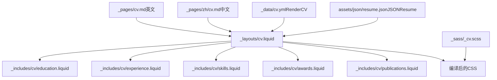
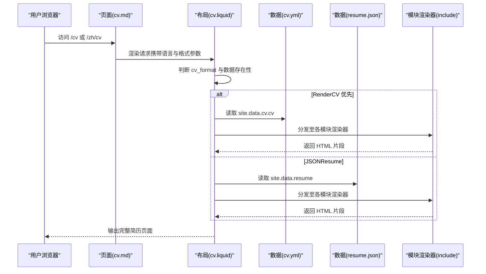
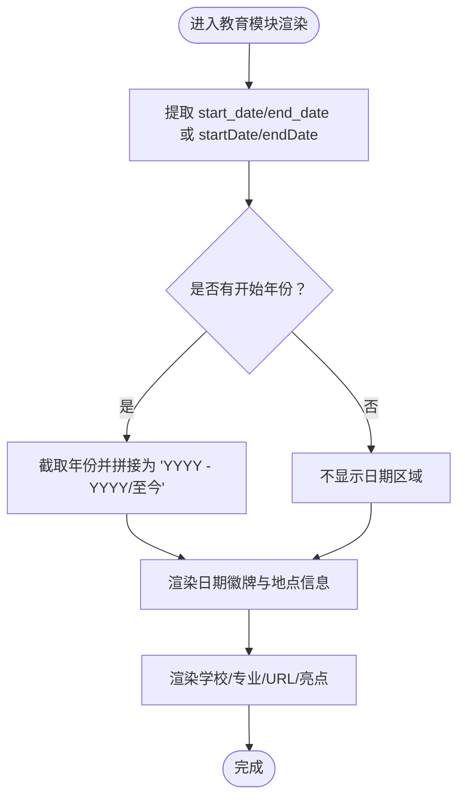
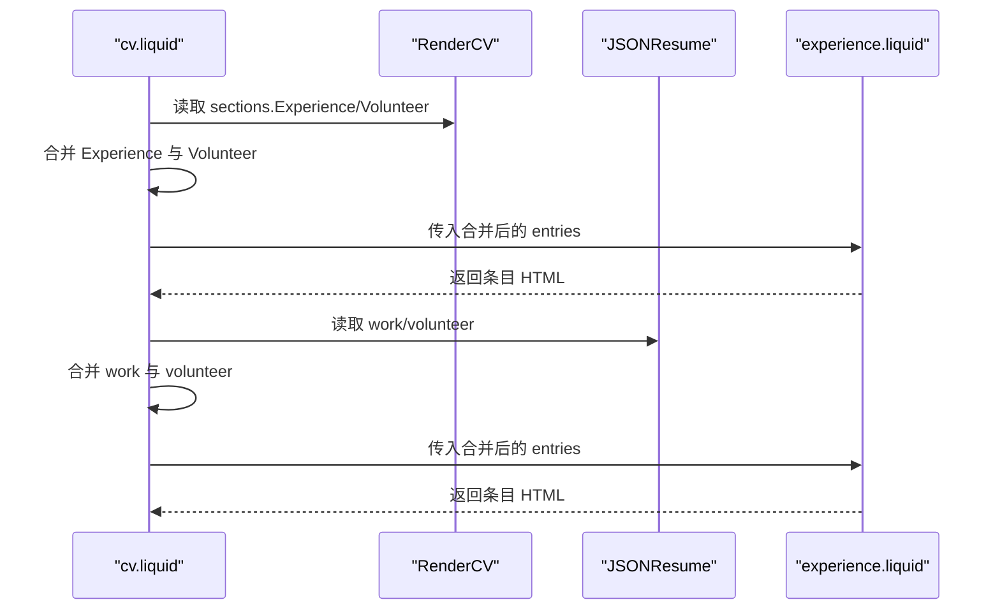
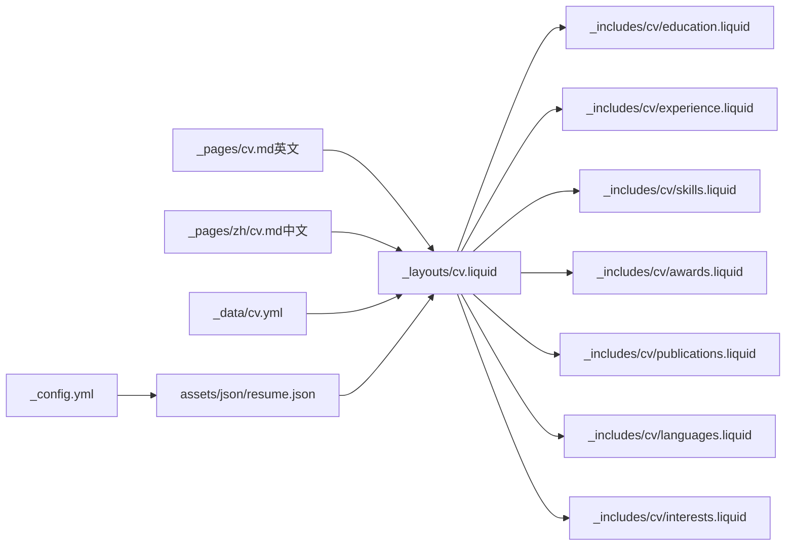

# 个人简历展示

<cite>
**本文引用的文件**
- [cv.yml](file://_data/cv.yml)
- [cv.liquid](file://_layouts/cv.liquid)
- [education.liquid](file://_includes/cv/education.liquid)
- [experience.liquid](file://_includes/cv/experience.liquid)
- [skills.liquid](file://_includes/cv/skills.liquid)
- [awards.liquid](file://_includes/cv/awards.liquid)
- [publications.liquid](file://_includes/cv/publications.liquid)
- [languages.liquid](file://_includes/cv/languages.liquid)
- [interests.liquid](file://_includes/cv/interests.liquid)
- [_cv.scss](file://_sass/_cv.scss)
- [cv.md（英文）](file://_pages/cv.md)
- [navigation.yml](file://_data/navigation.yml)
- [header.liquid](file://_includes/header.liquid)
</cite>

## 更新摘要
**所做更改**
- 更新了多语言支持机制章节，反映内联双语格式的实现
- 新增了双语内容渲染的技术细节说明
- 完善了CV条目示例，包含中英文对照格式
- 更新了样式定制方案，涵盖双语显示的特殊要求

## 目录
1. [简介](#简介)
2. [项目结构](#项目结构)
3. [核心组件](#核心组件)
4. [架构总览](#架构总览)
5. [详细组件分析](#详细组件分析)
6. [依赖关系分析](#依赖关系分析)
7. [性能考量](#性能考量)
8. [故障排查指南](#故障排查指南)
9. [结论](#结论)
10. [附录](#附录)

## 简介
本文件系统性阐述该个人简历展示功能的实现与使用方法，覆盖以下要点：
- CV 数据结构设计与组织：教育背景、工作经验、技能专长、获奖情况、出版物、语言能力、兴趣爱好等模块的字段定义、验证规则与显示格式。
- 多语言支持机制：中英文内容的配置与切换、页面级语言设置与导航行为，现已支持内联双语格式显示。
- 数据来源与集成：YAML 配置文件（RenderCV）、JSON 数据文件与外部 API 的统一渲染流程。
- 动态生成与响应式设计：Jekyll Liquid 模板驱动的页面渲染、CSS 样式体系与响应式布局策略。

## 项目结构
简历页面由 Jekyll 布局与 Liquid 模板组合生成，数据通过 YAML/JSON 注入，样式由 SCSS 编译输出。关键路径如下：
- 页面入口：_pages 下的 cv.md（英文）与 zh/cv.md（中文）
- 布局层：_layouts/cv.liquid 统一渲染逻辑
- 数据层：_data/cv.yml（RenderCV）与 assets/json/resume.json（JSONResume）
- 模块化渲染：_includes/cv/*.liquid 对各模块进行独立渲染
- 样式层：_sass/_cv.scss 提供简历专用样式

**图表来源**
- [_pages/cv.md（英文）:1-15](file://_pages/cv.md#L1-L15)
- [_layouts/cv.liquid:1-393](file://_layouts/cv.liquid#L1-L393)
- [_data/cv.yml:1-95](file://_data/cv.yml#L1-L95)
- [_includes/cv/education.liquid:1-94](file://_includes/cv/education.liquid#L1-L94)
- [_includes/cv/experience.liquid:1-92](file://_includes/cv/experience.liquid#L1-L92)
- [_includes/cv/skills.liquid:1-33](file://_includes/cv/skills.liquid#L1-L33)
- [_includes/cv/awards.liquid:1-67](file://_includes/cv/awards.liquid#L1-L67)
- [_includes/cv/publications.liquid:1-71](file://_includes/cv/publications.liquid#L1-L71)
- [_sass/_cv.scss:1-221](file://_sass/_cv.scss#L1-L221)

**章节来源**
- [_pages/cv.md（英文）:1-15](file://_pages/cv.md#L1-L15)
- [_layouts/cv.liquid:1-393](file://_layouts/cv.liquid#L1-L393)

## 核心组件
- 布局与选择器：cv.liquid 负责根据页面参数决定渲染 RenderCV 或 JSONResume；若未指定则优先 RenderCV。
- 模块渲染器：education.experience.skills.awards.publications.languages.interests 等 include 文件分别处理对应模块的统一渲染。
- 数据源：cv.yml（RenderCV）与 resume.json（JSONResume），两者字段在模板中有兼容映射。
- 样式系统：_cv.scss 提供时间轴、列表组、锚点跳转等简历专用样式。

**章节来源**
- [_layouts/cv.liquid:42-57](file://_layouts/cv.liquid#L42-L57)
- [_includes/cv/education.liquid:1-94](file://_includes/cv/education.liquid#L1-L94)
- [_includes/cv/experience.liquid:1-92](file://_includes/cv/experience.liquid#L1-L92)
- [_includes/cv/skills.liquid:1-33](file://_includes/cv/skills.liquid#L1-L33)
- [_includes/cv/awards.liquid:1-67](file://_includes/cv/awards.liquid#L1-L67)
- [_includes/cv/publications.liquid:1-71](file://_includes/cv/publications.liquid#L1-L71)
- [_includes/cv/languages.liquid:1-29](file://_includes/cv/languages.liquid#L1-L29)
- [_includes/cv/interests.liquid:1-30](file://_includes/cv/interests.liquid#L1-L30)
- [_sass/_cv.scss:1-221](file://_sass/_cv.scss#L1-L221)

## 架构总览
下图展示了从页面请求到简历渲染的关键交互：

**图表来源**
- [_pages/cv.md（英文）:1-15](file://_pages/cv.md#L1-L15)
- [_layouts/cv.liquid:42-57](file://_layouts/cv.liquid#L42-L57)
- [_data/cv.yml:1-95](file://_data/cv.yml#L1-L95)

## 详细组件分析

### 数据模型与字段规范
- RenderCV（YAML）数据模型：以 sections 为核心容器，键名即模块标题（如 Education、Experience、Skills 等）。字段采用 start_date/end_date、location、url、highlights 等通用键，部分字段在模板中做兼容处理（例如 degree 与 studyType）。
- JSONResume（JSON）数据模型：以 basics、work、education、publications、skills、languages、interests、projects 等数组或对象形式组织，日期字段统一为 startDate/endDate。

字段映射与兼容要点（模板侧）：
- 日期：RenderCV 使用 start_date/end_date，JSONResume 使用 startDate/endDate；模板均提取年份并显示"YYYY - YYYY"或"YYYY - 至今"。
- 公司/机构名称：RenderCV 使用 company/name/organization，JSONResume 使用 name；模板统一归一为公司名显示。
- 学位/专业：RenderCV 使用 studyType/degree，JSONResume 使用 studyType；模板统一显示为"学习类型"。

**章节来源**
- [_data/cv.yml:1-95](file://_data/cv.yml#L1-L95)
- [_layouts/cv.liquid:123-197](file://_layouts/cv.liquid#L123-L197)
- [_includes/cv/education.liquid:13-27](file://_includes/cv/education.liquid#L13-L27)
- [_includes/cv/experience.liquid:13-27](file://_includes/cv/experience.liquid#L13-L27)

### 教育背景模块（Education）
- 输入：RenderCV 的 sections.Education 或 JSONResume 的 education 数组。
- 显示：左侧日期徽牌（起止年份），右侧显示学习类型、学校、专业、地点与亮点。
- 日期处理：仅提取年份，缺失结束年份时显示"至今"。

**图表来源**
- [_includes/cv/education.liquid:13-27](file://_includes/cv/education.liquid#L13-L27)
- [_includes/cv/education.liquid:55-73](file://_includes/cv/education.liquid#L55-L73)

**章节来源**
- [_includes/cv/education.liquid:1-94](file://_includes/cv/education.liquid#L1-L94)

### 工作经验模块（Experience/Volunteer 合并）
- 输入：RenderCV 的 Experience/Volunteer 或 JSONResume 的 work/volunteer。
- 显示：左侧日期徽牌与地点，右侧显示职位、公司/组织、摘要与高亮条目。
- 合并与优先级：模板先合并 Experience 与 Volunteer，再统一渲染；JSONResume 合并 work 与 volunteer。

**图表来源**
- [_layouts/cv.liquid:123-138](file://_layouts/cv.liquid#L123-L138)
- [_includes/cv/experience.liquid:1-92](file://_includes/cv/experience.liquid#L1-L92)

**章节来源**
- [_layouts/cv.liquid:123-138](file://_layouts/cv.liquid#L123-L138)
- [_includes/cv/experience.liquid:1-92](file://_includes/cv/experience.liquid#L1-L92)

### 技能专长模块（Skills）
- 输入：RenderCV 的 sections.Skills 或 JSONResume 的 skills。
- 显示：名称、等级（可选）、图标（可选）与关键词列表（逗号分隔）。

**章节来源**
- [_includes/cv/skills.liquid:1-33](file://_includes/cv/skills.liquid#L1-L33)

### 获奖情况模块（Awards/Honors and Awards）
- 输入：RenderCV 的 sections.Awards 或 JSONResume 的 awards。
- 显示：带年份徽牌（若存在）或整行显示，标题、授予权威与摘要。

**章节来源**
- [_includes/cv/awards.liquid:1-67](file://_includes/cv/awards.liquid#L1-L67)

### 出版物模块（Publications）
- 输入：RenderCV 的 sections.Publications 或 JSONResume 的 publications。
- 显示：带发布年份徽牌（若存在）或整行显示，标题、出版者与摘要。

**章节来源**
- [_includes/cv/publications.liquid:1-71](file://_includes/cv/publications.liquid#L1-L71)

### 语言能力模块（Languages）
- 输入：RenderCV 的 sections.Languages（name/summary）或 JSONResume 的 languages（language/fluency）。
- 显示：语言名称与熟练度描述。

**章节来源**
- [_includes/cv/languages.liquid:1-29](file://_includes/cv/languages.liquid#L1-L29)

### 兴趣爱好模块（Interests/Academic Interests）
- 输入：RenderCV 的 sections.Interests 或 JSONResume 的 interests。
- 显示：名称与关键词列表。

**章节来源**
- [_includes/cv/interests.liquid:1-30](file://_includes/cv/interests.liquid#L1-L30)

### 多语言支持与切换机制
- 页面级语言：cv.md 与 zh/cv.md 分别设置 lang: en 与 lang: zh。
- 导航与菜单：英文页设置 nav: true，中文页设置 nav: false，便于控制导航栏显示。
- 内容切换：通过不同语言目录下的页面文件实现内容切换；模板本身不强制要求中英文同步更新，建议在各自目录维护对应文案。
- **新增** 内联双语格式：标题和描述都包含中文翻译，提供更直观的双语对比体验。

**章节来源**
- [_pages/cv.md（英文）:1-15](file://_pages/cv.md#L1-L15)
- [_data/navigation.yml:1-23](file://_data/navigation.yml#L1-L23)
- [_includes/header.liquid:1-100](file://_includes/header.liquid#L1-L100)

### 数据来源与集成
- RenderCV（YAML）：通过 _data/cv.yml 提供 cv 顶层对象，布局直接读取 site.data.cv.cv。
- JSONResume（JSON）：通过 _config.yml 中 jekyll_get_json 插件加载 assets/json/resume.json，并在布局中读取 site.data.resume。
- 格式选择：页面可通过 cv_format 参数强制指定 rendercv 或 jsonresume；未指定时优先 RenderCV。

**章节来源**
- [_data/cv.yml:1-95](file://_data/cv.yml#L1-L95)
- [_layouts/cv.liquid:42-57](file://_layouts/cv.liquid#L42-L57)

### 动态生成与响应式设计
- 动态生成：Jekyll 在构建阶段读取数据源与 Liquid 模板，生成静态 HTML。
- 响应式：_cv.scss 提供针对简历展示的响应式样式（如时间轴、徽牌、列表组等），配合 Bootstrap 等库实现跨设备适配。
- 锚点导航：为各模块设置锚点，结合侧边目录实现平滑跳转。

**章节来源**
- [_sass/_cv.scss:1-221](file://_sass/_cv.scss#L1-L221)
- [_layouts/cv.liquid:150-151](file://_layouts/cv.liquid#L150-L151)

## 依赖关系分析
- 页面到布局：cv.md 与 zh/cv.md 指定布局为 cv，触发统一渲染。
- 布局到数据：cv.liquid 根据 cv_format 与数据存在性选择 RenderCV 或 JSONResume。
- 布局到模块：cv.liquid 将各模块 entries 分派给对应的 include 文件。
- 配置到数据：_config.yml 中的 jekyll_get_json 与 jsonresume 字段控制 JSONResume 数据的注入与字段映射。

**图表来源**
- [_pages/cv.md（英文）:1-15](file://_pages/cv.md#L1-L15)
- [_layouts/cv.liquid:42-57](file://_layouts/cv.liquid#L42-L57)
- [_data/cv.yml:1-95](file://_data/cv.yml#L1-L95)
- [_includes/cv/languages.liquid:1-29](file://_includes/cv/languages.liquid#L1-L29)
- [_includes/cv/interests.liquid:1-30](file://_includes/cv/interests.liquid#L1-L30)

**章节来源**
- [_layouts/cv.liquid:42-57](file://_layouts/cv.liquid#L42-L57)

## 性能考量
- 构建期渲染：Jekyll 在本地构建时一次性生成 HTML，运行时无需额外计算，加载速度快。
- 资源压缩：通过插件与配置对 JS/CSS 进行压缩与缓存，减少首屏加载时间。
- 图片优化：启用懒加载与响应式图片，降低带宽占用。
- 样式复用：_cv.scss 提供统一样式，避免重复定义导致的体积膨胀。

## 故障排查指南
- 无数据渲染：当未配置 RenderCV 或 JSONResume 数据时，布局会提示"未找到 CV 数据"。请检查数据文件路径与字段命名。
- 字段不匹配：若 JSONResume 字段与模板期望不符，需在模板中增加兼容映射或调整数据源。
- 日期显示异常：确保日期字段格式为"YYYY-MM-DD"或纯年份字符串，模板仅提取年份。
- 多语言页面未生效：确认页面 front matter 中 lang 设置正确，且对应目录下存在 cv 页面文件。

**章节来源**
- [_layouts/cv.liquid:387-389](file://_layouts/cv.liquid#L387-L389)

## 结论
该简历展示系统通过统一布局与模块化渲染器，实现了 RenderCV 与 JSONResume 两种数据源的无缝兼容；配合页面级语言设置与样式体系，既满足静态站点的高性能需求，又提供了清晰、一致的简历呈现体验。**新增的内联双语格式进一步增强了用户体验，使中英文内容能够并排显示，便于读者快速对比理解。** 建议在维护数据时遵循字段规范与日期格式，确保渲染稳定与显示一致。

## 附录

### 实际 CV 条目示例（字段参考）
- 教育背景（YAML）：institution、area、studyType、start_date、end_date、location、url、highlights
- 工作经验（YAML）：company、position、start_date、end_date、location、url、summary、highlights
- 技能专长（YAML）：name、level、icon、keywords
- 获奖情况（YAML）：title、date、awarder、summary、url
- 出版物（YAML）：title、publisher、releaseDate、summary、url
- 语言能力（YAML）：name、summary
- 兴趣爱好（YAML）：name、keywords、icon

**章节来源**
- [_data/cv.yml:18-95](file://_data/cv.yml#L18-L95)

### 样式定制方案
- 时间徽牌与日期列：通过 _cv.scss 中的徽牌与列样式控制日期显示与对齐。
- 列表组与高亮：利用列表组样式与徽牌样式，统一条目层级与视觉节奏。
- 锚点与目录：通过锚点与时间线样式，增强模块间跳转体验。
- **新增** 双语显示样式：为内联双语格式提供专门的样式支持，确保中英文内容的对齐与间距协调。

**章节来源**
- [_sass/_cv.scss:1-221](file://_sass/_cv.scss#L1-L221)

### 内联双语格式实现细节
- **标题双语显示**：所有模块标题同时显示英文原文和中文翻译，便于国际与国内读者理解。
- **描述双语处理**：条目中的描述文本采用内联格式，中英文内容并排显示，突出对比效果。
- **样式适配**：通过专门的 CSS 类和媒体查询，确保在不同屏幕尺寸下都能良好显示双语内容。
- **内容维护**：建议在维护简历时同时提供中英文版本，保持内容的一致性和准确性。

**章节来源**
- [_includes/cv/education.liquid:59-73](file://_includes/cv/education.liquid#L59-L73)
- [_includes/cv/experience.liquid:57-76](file://_includes/cv/experience.liquid#L57-L76)
- [_includes/cv/awards.liquid:28-42](file://_includes/cv/awards.liquid#L28-L42)
- [_includes/cv/publications.liquid:28-44](file://_includes/cv/publications.liquid#L28-L44)