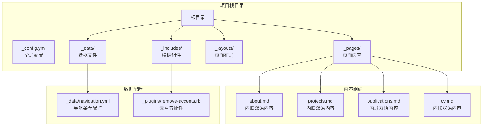
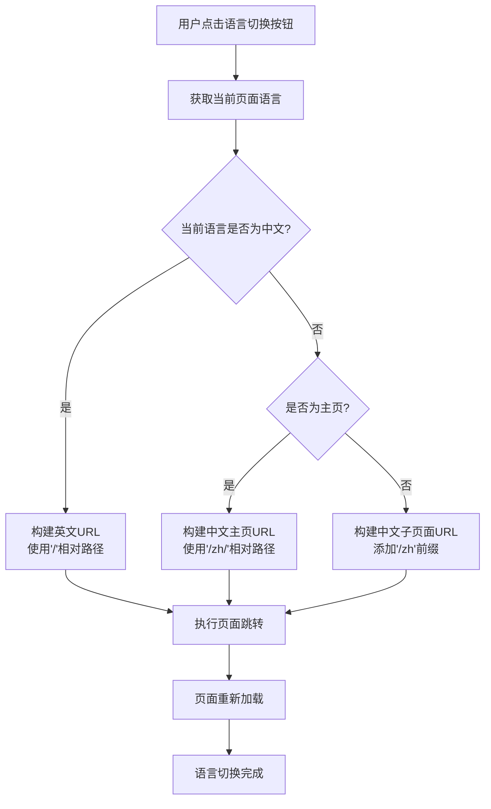
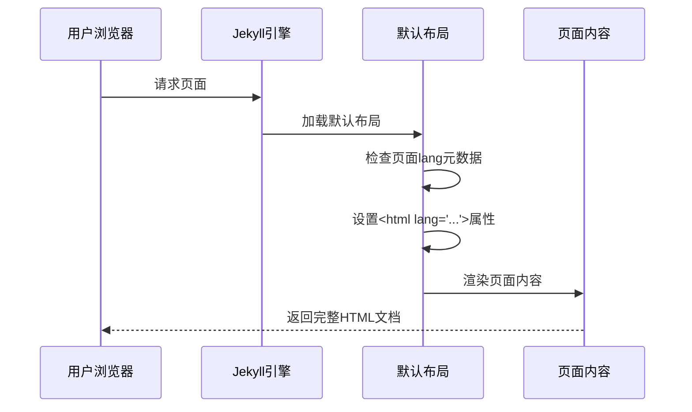
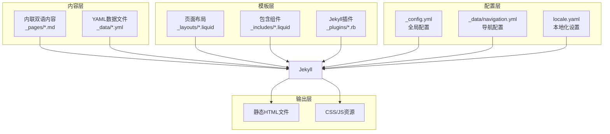
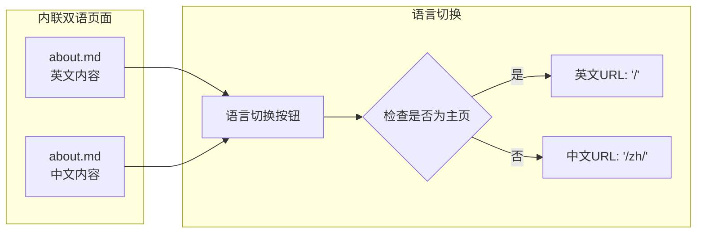
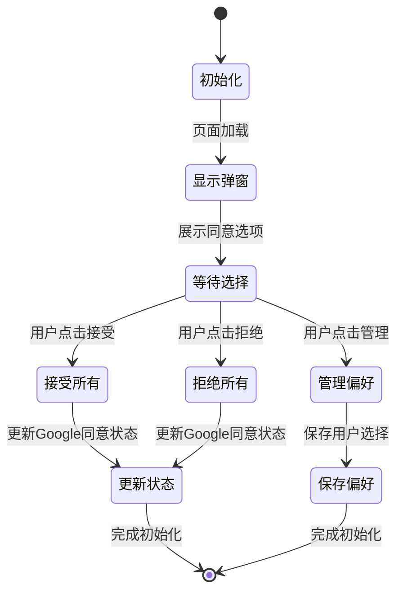
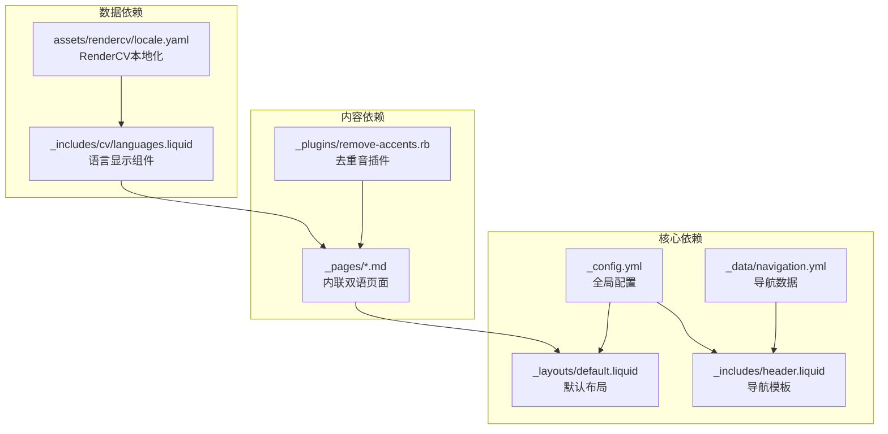
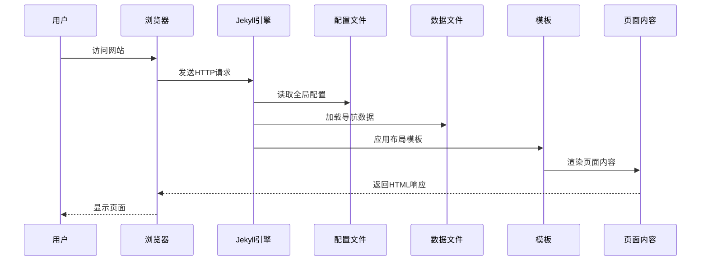

# 多语言支持机制

<cite>
**本文档引用的文件**
- [_config.yml](file://_config.yml)
- [_includes/header.liquid](file://_includes/header.liquid)
- [_layouts/default.liquid](file://_layouts/default.liquid)
- [_layouts/page.liquid](file://_layouts/page.liquid)
- [_data/navigation.yml](file://_data/navigation.yml)
- [_pages/about.md](file://_pages/about.md)
- [_pages/projects.md](file://_pages/projects.md)
- [_pages/publications.md](file://_pages/publications.md)
- [_pages/zh/about.md](file://_pages/zh/about.md)
- [_plugins/remove-accents.rb](file://_plugins/remove-accents.rb)
- [_includes/cv/languages.liquid](file://_includes/cv/languages.liquid)
- [_scripts/cookie-consent-setup.js](file://_scripts/cookie-consent-setup.js)
- [assets/rendercv/locale.yaml](file://assets/rendercv/locale.yaml)
</cite>

## 更新摘要
**所做更改**
- 更新了语言切换机制的实现方式，从复杂的目录分离迁移到简化的内联双语格式
- 移除了_zh/目录结构和复杂的URL重写逻辑
- 采用更简洁的条件语言切换实现
- 更新了导航菜单配置和页面元数据结构
- 简化了语言检测和自动切换的实现逻辑

## 目录
1. [简介](#简介)
2. [项目结构](#项目结构)
3. [核心组件](#核心组件)
4. [架构概览](#架构概览)
5. [详细组件分析](#详细组件分析)
6. [依赖关系分析](#依赖关系分析)
7. [性能考虑](#性能考虑)
8. [故障排除指南](#故障排除指南)
9. [结论](#结论)
10. [附录](#附录)

## 简介

本项目采用静态站点生成器Jekyll构建，实现了简化的内联双语支持机制。通过条件语言切换和数据驱动配置，系统能够在同一域名下提供中英文两种语言版本的内容。该机制的核心特点是：

- **内联双语格式**：中文内容直接嵌入页面元数据，无需复杂的目录分离
- **条件语言切换**：通过导航栏的条件逻辑实现页面间的无缝跳转
- **数据驱动配置**：使用YAML文件管理导航菜单等多语言数据
- **语义化HTML**：通过`lang`属性确保搜索引擎和辅助技术正确识别语言

## 项目结构

项目采用简化的内联双语组织方式，实现了清晰的内容分离：



**图表来源**
- [_pages/about.md:1-39](file://_pages/about.md#L1-L39)
- [_pages/zh/about.md:1-40](file://_pages/zh/about.md#L1-L40)
- [_data/navigation.yml:1-24](file://_data/navigation.yml#L1-L24)

**章节来源**
- [_config.yml:1-656](file://_config.yml#L1-L656)
- [_pages/about.md:1-39](file://_pages/about.md#L1-L39)
- [_pages/zh/about.md:1-40](file://_pages/zh/about.md#L1-L40)

## 核心组件

### 简化语言切换机制

系统通过导航栏中的语言切换按钮实现中英文之间的快速切换。切换逻辑基于条件判断和相对URL构建：



**图表来源**
- [_includes/header.liquid:78-94](file://_includes/header.liquid#L78-L94)

### 导航菜单系统

导航菜单采用数据驱动的方式，通过YAML文件配置不同语言的菜单项：

| 配置键 | 英文版本 | 中文版本 |
|--------|----------|----------|
| `title` | about, publications, projects, cv, competitions | 关于, 论文, 项目, 简历, 竞赛 |
| `url` | /, /publications/, /projects/, /cv/, /competitions/ | /, /publications/, /projects/, /cv/, /competitions/ |

**章节来源**
- [_data/navigation.yml:1-24](file://_data/navigation.yml#L1-L24)
- [_includes/header.liquid:47-59](file://_includes/header.liquid#L47-L59)

### 页面布局系统

默认布局通过动态设置`lang`属性确保HTML文档的语言正确性：



**图表来源**
- [_layouts/default.liquid:1-57](file://_layouts/default.liquid#L1-L57)

**章节来源**
- [_layouts/default.liquid:1-57](file://_layouts/default.liquid#L1-L57)

## 架构概览

系统整体架构采用Jekyll静态站点生成器的标准模式，结合简化的内联双语支持组件：



**图表来源**
- [_config.yml:1-656](file://_config.yml#L1-L656)
- [_data/navigation.yml:1-24](file://_data/navigation.yml#L1-L24)

## 详细组件分析

### 简化语言切换按钮实现

语言切换按钮位于导航栏右侧，根据当前页面语言动态显示相应的切换文本和目标URL：

#### 切换逻辑实现

```mermaid
flowchart TD
LangSwitch[语言切换按钮] --> DetectCurrent[检测当前语言]
DetectCurrent --> CurrentLang{current_lang}
CurrentLang --> |zh| ShowEnButton[显示EN按钮<br/>title='Switch to English'>
CurrentLang --> |en| ShowZhButton[显示中按钮<br/>title='切换到中文'>
ShowEnButton --> ClickEn[点击EN按钮]
ShowZhButton --> ClickZh[点击中按钮]
ClickEn --> BuildEnURL[构建英文URL<br/>使用'/'相对路径]
ClickZh --> BuildZhURL[构建中文URL<br/>使用'/zh/'相对路径]
BuildEnURL --> Redirect[页面重定向]
BuildZhURL --> Redirect
```

**图表来源**
- [_includes/header.liquid:78-94](file://_includes/header.liquid#L78-L94)

#### 状态管理机制

语言切换采用无状态设计，通过URL重定向实现：

1. **无状态切换**：每次点击都重新计算目标URL
2. **条件路径处理**：自动处理主页和子页面的不同情况
3. **即时生效**：页面完全重新加载以确保语言一致性

**章节来源**
- [_includes/header.liquid:78-94](file://_includes/header.liquid#L78-L94)

### 内联双语数据存储

#### 导航菜单配置

导航菜单采用YAML格式存储，支持多语言配置：

```yaml
en:  # 英文导航
  - title: about
    url: /
  - title: publications  
    url: /publications/
  - title: projects
    url: /projects/

zh:  # 中文导航  
  - title: "关于"
    url: /zh/
  - title: "论文"
    url: /publications/
  - title: "项目"
    url: /projects/
```

#### 页面元数据配置

每个页面通过YAML头部元数据指定语言：

| 元数据键 | 英文页面示例 | 中文页面示例 |
|----------|--------------|--------------|
| `lang` | `lang: en` | `lang: zh` |
| `title` | `title: about` | `title: "关于"` |
| `permalink` | `permalink: /` | `permalink: /zh/` |
| `description` | `description: Personal website` | `description: 个人网站` |

**章节来源**
- [_data/navigation.yml:1-24](file://_data/navigation.yml#L1-L24)
- [_pages/about.md:1-39](file://_pages/about.md#L1-L39)
- [_pages/zh/about.md:1-40](file://_pages/zh/about.md#L1-L40)

### 内容同步机制

#### 内联双语同步

系统通过简化的内联双语格式确保中英文内容的对应关系：



**图表来源**
- [_pages/about.md:1-39](file://_pages/about.md#L1-L39)
- [_pages/zh/about.md:1-40](file://_pages/zh/about.md#L1-L40)

#### 内容字段映射

| 字段类型 | 英文字段 | 中文字段 | 同步规则 |
|----------|----------|----------|----------|
| 页面标题 | `title: about` | `title: "关于"` | 必须一一对应 |
| 页面描述 | `description: ...` | `description: "..."` | 建议保持语义一致 |
| 导航顺序 | `nav_order: 1` | 无需对应 | 可独立设置 |
| 内容主体 | `# Main content` | `# 主要内容` | 建议保持结构一致 |

**章节来源**
- [_pages/projects.md:1-77](file://_pages/projects.md#L1-L77)
- [_pages/publications.md:1-30](file://_pages/publications.md#L1-L30)

### 语言检测和自动切换

#### 自动检测机制

系统通过以下方式实现语言检测：

1. **页面级检测**：从页面元数据读取`page.lang`
2. **站点级回退**：若页面未指定，则使用`site.lang`
3. **默认值设置**：配置文件中设置默认语言为`en`

#### 语言检测流程

```mermaid
flowchart TD
Request[页面请求] --> LoadPage[加载页面元数据]
LoadPage --> CheckLang{检查page.lang}
CheckLang --> |存在| UsePageLang[使用页面语言]
CheckLang --> |不存在| CheckSite{检查site.lang}
CheckSite --> |存在| UseSiteLang[使用站点语言]
CheckSite --> |不存在| UseDefault[使用默认语言(en)]
UsePageLang --> Render[渲染页面]
UseSiteLang --> Render
UseDefault --> Render
Render --> End[语言确定完成]
```

**图表来源**
- [_layouts/default.liquid:1-57](file://_layouts/default.liquid#L1-L57)

**章节来源**
- [_layouts/default.liquid:1-57](file://_layouts/default.liquid#L1-L57)
- [_config.yml:17-17](file://_config.yml#L17-L17)

### 用户偏好设置持久化

系统采用浏览器本地存储机制保存用户偏好设置：

#### Cookie同意机制



**图表来源**
- [_scripts/cookie-consent-setup.js:47-119](file://_scripts/cookie-consent-setup.js#L47-L119)

#### 主题偏好存储

虽然不是语言偏好，但系统展示了类似的偏好存储模式：

- 使用`localStorage`保存主题设置
- 支持"dark"、"light"、"system"三种模式
- 自动同步到HTML元素类名

**章节来源**
- [_scripts/cookie-consent-setup.js:1-161](file://_scripts/cookie-consent-setup.js#L1-L161)

## 依赖关系分析

### 组件依赖图



**图表来源**
- [_config.yml:1-656](file://_config.yml#L1-L656)
- [_includes/header.liquid:1-101](file://_includes/header.liquid#L1-L101)
- [_layouts/default.liquid:1-57](file://_layouts/default.liquid#L1-L57)
- [_data/navigation.yml:1-24](file://_data/navigation.yml#L1-L24)

### 数据流依赖



**图表来源**
- [_config.yml:1-656](file://_config.yml#L1-L656)
- [_data/navigation.yml:1-24](file://_data/navigation.yml#L1-L24)

**章节来源**
- [_config.yml:1-656](file://_config.yml#L1-L656)
- [_data/navigation.yml:1-24](file://_data/navigation.yml#L1-L24)

## 性能考虑

### 静态生成优势

1. **无服务器端负载**：所有内容在构建时生成，运行时无需数据库查询
2. **CDN友好**：纯静态文件可完美缓存
3. **快速加载**：避免了动态内容生成的开销

### 优化建议

1. **图片优化**：使用WebP格式和适当的尺寸
2. **CSS压缩**：启用Jekyll Minifier进行CSS压缩
3. **懒加载**：对非首屏内容使用懒加载
4. **缓存策略**：合理设置HTTP缓存头

## 故障排除指南

### 常见问题及解决方案

#### 语言切换失效

**症状**：点击语言切换按钮后页面不变化或跳转到错误地址

**排查步骤**：
1. 检查页面是否正确设置`lang`元数据
2. 验证目标URL是否正确构建
3. 确认导航数据配置正确

**解决方案**：
- 确保页面元数据中包含正确的`lang`字段
- 检查URL构建逻辑中的条件判断
- 验证导航菜单的URL路径格式

#### 导航菜单不显示

**症状**：导航菜单缺失或显示异常

**排查步骤**：
1. 检查`_data/navigation.yml`文件语法
2. 验证语言键值是否正确（`en`/`zh`）
3. 确认URL路径格式正确

**解决方案**：
- 修复YAML语法错误
- 确保URL路径以斜杠开头
- 验证语言切换按钮的条件逻辑

#### 页面语言识别错误

**症状**：页面显示的语言与预期不符

**排查步骤**：
1. 检查页面元数据中的`lang`字段
2. 验证站点配置中的默认语言设置
3. 确认页面URL路径是否正确

**解决方案**：
- 在页面元数据中明确指定语言
- 检查URL路径是否包含正确的语言前缀

**章节来源**
- [_includes/header.liquid:78-94](file://_includes/header.liquid#L78-L94)
- [_data/navigation.yml:1-24](file://_data/navigation.yml#L1-L24)
- [_layouts/default.liquid:1-57](file://_layouts/default.liquid#L1-L57)

## 结论

本项目的多语言支持机制通过简化的内联双语格式实现了中英文内容的完整覆盖。主要优势包括：

1. **架构简化**：移除了复杂的目录分离，采用更直观的内联双语格式
2. **配置灵活**：YAML数据文件支持动态内容管理
3. **用户体验好**：简化的条件语言切换确保操作的直观性
4. **性能优秀**：静态生成避免了运行时开销

该机制为类似项目提供了优秀的参考模板，特别是在需要支持多语言的个人网站和作品集中具有很高的实用价值。

## 附录

### 最佳实践建议

#### 内联双语最佳实践

1. **统一内容结构**：确保中英文页面的结构和字段保持一致
2. **使用占位符**：在开发阶段使用占位符确保结构完整
3. **定期审查**：定期检查中英文内容的一致性
4. **版本控制**：使用Git跟踪内容变更历史

#### 开发工作流程


#### 扩展建议

1. **添加更多语言**：按照现有模式添加新的语言支持
2. **动态翻译服务**：集成在线翻译API实现内容自动翻译
3. **语言检测增强**：基于浏览器语言偏好自动跳转
4. **SEO优化**：为不同语言版本添加hreflang标签