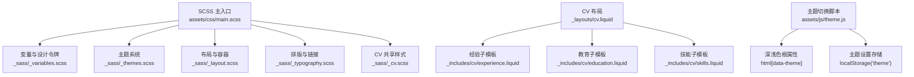
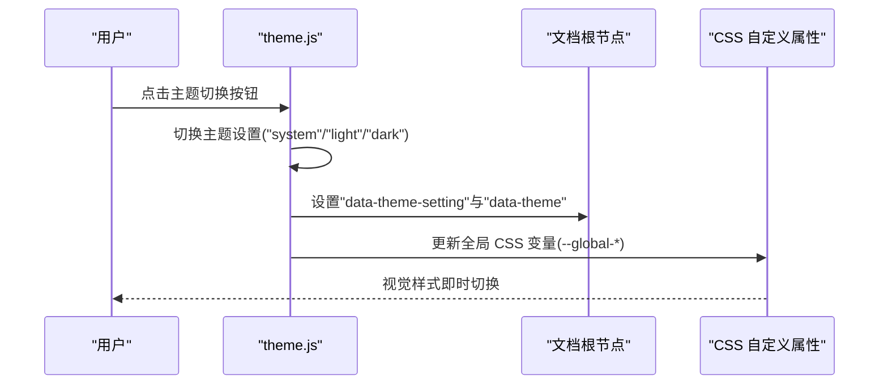
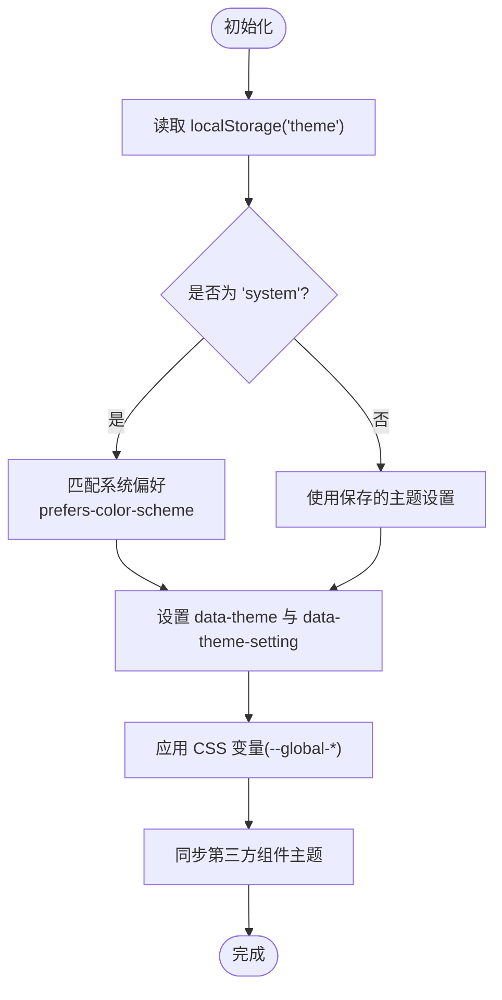
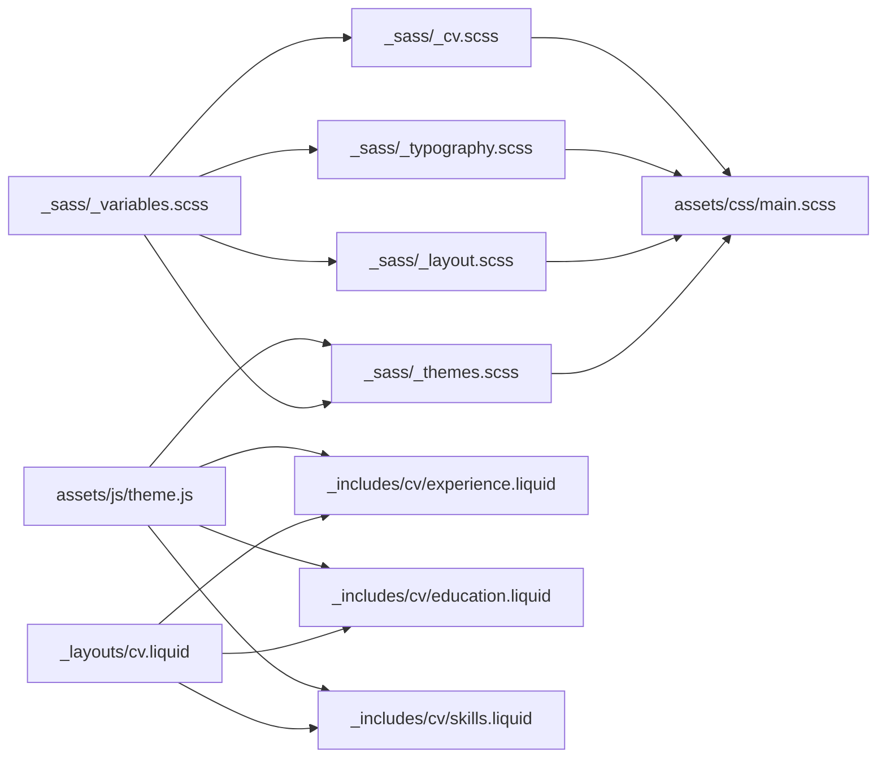

# 样式定制和主题

<cite>
**本文档引用的文件**
- [_sass/_themes.scss](file://_sass/_themes.scss)
- [_sass/_variables.scss](file://_sass/_variables.scss)
- [_sass/_cv.scss](file://_sass/_cv.scss)
- [assets/css/main.scss](file://assets/css/main.scss)
- [_layouts/cv.liquid](file://_layouts/cv.liquid)
- [assets/js/theme.js](file://assets/js/theme.js)
- [_config.yml](file://_config.yml)
- [_sass/_layout.scss](file://_sass/_layout.scss)
- [_sass/_typography.scss](file://_sass/_typography.scss)
- [_includes/cv/experience.liquid](file://_includes/cv/experience.liquid)
- [_includes/cv/education.liquid](file://_includes/cv/education.liquid)
- [_includes/cv/skills.liquid](file://_includes/cv/skills.liquid)
</cite>

## 目录
1. [简介](#简介)
2. [项目结构](#项目结构)
3. [核心组件](#核心组件)
4. [架构总览](#架构总览)
5. [详细组件分析](#详细组件分析)
6. [依赖关系分析](#依赖关系分析)
7. [性能考量](#性能考量)
8. [故障排除指南](#故障排除指南)
9. [结论](#结论)
10. [附录](#附录)

## 简介
本文件系统性阐述简历（CV）页面的样式架构与主题系统，覆盖颜色方案、字体与排版、布局配置、SCSS 变量体系、样式覆盖与 CSS 类名参考、深色/浅色模式切换机制、响应式断点与移动端适配、以及自定义 CSS 注入与第三方样式集成策略。目标是帮助使用者在不修改核心源码的前提下，完成主题定制与样式扩展。

## 项目结构
样式系统由 SCSS 分层模块与 Liquid 布局渲染共同构成：
- SCSS 主入口负责加载变量、主题、通用布局与各功能模块样式
- 主题系统通过 CSS 自定义属性与数据属性驱动深浅色切换
- CV 页面由统一的 Liquid 布局与若干子模板渲染不同区块
- JavaScript 负责主题状态持久化、动态切换与第三方组件主题同步

**图表来源**
- [assets/css/main.scss:1-40](file://assets/css/main.scss#L1-L40)
- [_sass/_themes.scss:1-209](file://_sass/_themes.scss#L1-L209)
- [_sass/_layout.scss:1-59](file://_sass/_layout.scss#L1-L59)
- [_sass/_typography.scss:1-137](file://_sass/_typography.scss#L1-L137)
- [_sass/_cv.scss:1-221](file://_sass/_cv.scss#L1-L221)
- [_layouts/cv.liquid:1-393](file://_layouts/cv.liquid#L1-L393)
- [assets/js/theme.js:1-343](file://assets/js/theme.js#L1-L343)

**章节来源**
- [assets/css/main.scss:1-40](file://assets/css/main.scss#L1-L40)
- [_sass/_themes.scss:1-209](file://_sass/_themes.scss#L1-L209)
- [_sass/_layout.scss:1-59](file://_sass/_layout.scss#L1-L59)
- [_sass/_typography.scss:1-137](file://_sass/_typography.scss#L1-L137)
- [_sass/_cv.scss:1-221](file://_sass/_cv.scss#L1-L221)
- [_layouts/cv.liquid:1-393](file://_layouts/cv.liquid#L1-L393)
- [assets/js/theme.js:1-343](file://assets/js/theme.js#L1-L343)

## 核心组件
- SCSS 变量与设计令牌：集中管理颜色、尺寸、间距等基础设计元素
- 主题系统：基于 CSS 自定义属性与数据属性实现深浅色与系统偏好联动
- 布局与排版：统一内容区宽度、滚动锚点、表格与链接样式
- CV 专用样式：简历时间线、列表组、按钮与图标等
- 主题切换逻辑：本地存储、DOM 属性更新、第三方组件主题同步

**章节来源**
- [_sass/_variables.scss:1-53](file://_sass/_variables.scss#L1-L53)
- [_sass/_themes.scss:1-209](file://_sass/_themes.scss#L1-L209)
- [_sass/_layout.scss:1-59](file://_sass/_layout.scss#L1-L59)
- [_sass/_typography.scss:1-137](file://_sass/_typography.scss#L1-L137)
- [_sass/_cv.scss:1-221](file://_sass/_cv.scss#L1-L221)
- [assets/js/theme.js:1-343](file://assets/js/theme.js#L1-L343)

## 架构总览
主题系统采用“变量 → 主题 → 渲染”的分层架构：
- 变量层：定义颜色、尺寸、间距等基础令牌
- 主题层：将变量映射为 CSS 自定义属性，并根据用户设置与系统偏好生成最终样式
- 渲染层：Liquid 布局与子模板输出结构化 HTML，配合 SCSS 类名与变量实现一致风格

**图表来源**
- [assets/js/theme.js:1-343](file://assets/js/theme.js#L1-L343)
- [_sass/_themes.scss:1-209](file://_sass/_themes.scss#L1-L209)

## 详细组件分析

### SCSS 变量系统与自定义变量
- 颜色令牌：定义主色、辅助色、灰阶、背景与文本色等
- 代码块背景：区分浅色与深色主题下的代码背景
- 字体图标路径：FontAwesome 字体资源定位
- 回到顶部按钮：尺寸、位置与层级等可配置项
- 内容最大宽度：通过 SCSS 主入口传参覆盖默认值

使用建议：
- 在 SCSS 主入口中通过 @use "variables" with (...) 覆盖 $max-content-width
- 新增颜色或尺寸时，优先在变量文件中声明，再在主题或组件中引用

**章节来源**
- [_sass/_variables.scss:1-53](file://_sass/_variables.scss#L1-L53)
- [assets/css/main.scss:10-14](file://assets/css/main.scss#L10-L14)

### 主题系统与深浅色切换
- 根属性与 CSS 变量：:root 定义浅色变量；html[data-theme="dark"] 定义深色变量
- 主题设置与系统偏好：html[data-theme-setting] 表示用户选择；computed theme 由系统偏好决定
- 切换逻辑：theme.js 负责读取/写入 localStorage("theme")、设置 data-theme 与 data-theme-setting、应用过渡效果、同步第三方组件主题
- 图标与可见性：切换按钮在不同设置下显示不同图标；仅暗色/仅亮色元素按需显示

**图表来源**
- [assets/js/theme.js:261-292](file://assets/js/theme.js#L261-L292)
- [_sass/_themes.scss:7-156](file://_sass/_themes.scss#L7-L156)

**章节来源**
- [_sass/_themes.scss:1-209](file://_sass/_themes.scss#L1-L209)
- [assets/js/theme.js:1-343](file://assets/js/theme.js#L1-L343)

### 布局与排版
- 内容容器：限制最大宽度，居中展示
- 滚动锚点：标题滚动偏移，避免被固定导航遮挡
- 链接与表格：统一颜色与悬停行为；深色模式下表格自动添加深色类
- 分割线与引用块：支持提示/警告/危险三类语义化块级样式

**章节来源**
- [_sass/_layout.scss:1-59](file://_sass/_layout.scss#L1-L59)
- [_sass/_typography.scss:1-137](file://_sass/_typography.scss#L1-L137)

### CV 页面样式与类名参考
- 统一样式：简历表格、按钮、时间线、列表组、地图容器等
- 组件类名：如 .table-cv、.btncv、.list-group、.timeline、.anchor 等
- 子模板结构：经验、教育、技能等区块通过 Liquid 包含，内部使用卡片与列表组样式

常用类名（部分）：
- 容器与布局：.container、.card、.list-group、.table-cv
- 按钮与徽章：.btncv、.badge、.badge-toc
- 时间线与锚点：.timeline、.anchor
- 列表组与分组：.list-groups、.list-group、.list-group-item

**章节来源**
- [_sass/_cv.scss:1-221](file://_sass/_cv.scss#L1-L221)
- [_layouts/cv.liquid:1-393](file://_layouts/cv.liquid#L1-L393)
- [_includes/cv/experience.liquid:1-92](file://_includes/cv/experience.liquid#L1-L92)
- [_includes/cv/education.liquid:1-94](file://_includes/cv/education.liquid#L1-L94)
- [_includes/cv/skills.liquid:1-33](file://_includes/cv/skills.liquid#L1-L33)

### 响应式断点与移动端适配
- 使用 Bootstrap 栅格系统：.col-xs-*、.col-sm-*、.col-md-* 实现多端布局
- 移动端优化：小屏下日期列与内容列堆叠，字号与内边距按需缩放
- 导航与页脚：固定导航与粘性页脚在不同设备上的表现

**章节来源**
- [_includes/cv/experience.liquid:10-91](file://_includes/cv/experience.liquid#L10-L91)
- [_includes/cv/education.liquid:10-93](file://_includes/cv/education.liquid#L10-L93)
- [_sass/_layout.scss:32-41](file://_sass/_layout.scss#L32-L41)

### 自定义 CSS 注入与第三方样式集成
- 自定义 CSS：在主题 SCSS 之外新增样式文件，于 SCSS 主入口 @use 引入
- 第三方样式：通过 _config.yml 的 third_party_libraries 管理版本与 SRI，按需启用
- 主题同步：theme.js 对高亮、Mermaid、Plotly、ECharts、Vega-Lite、Giscus、Cookie 同步主题

最佳实践：
- 将自定义样式以模块化 SCSS 文件组织，避免直接修改核心变量
- 通过 _config.yml 统一管理外部库版本，确保安全与一致性

**章节来源**
- [assets/css/main.scss:21-40](file://assets/css/main.scss#L21-L40)
- [_config.yml:405-634](file://_config.yml#L405-L634)
- [assets/js/theme.js:93-259](file://assets/js/theme.js#L93-L259)

## 依赖关系分析
- SCSS 主入口依赖变量、主题与各功能模块
- 主题系统依赖变量与 CSS 自定义属性
- CV 布局依赖各子模板与共享样式
- 主题切换脚本依赖 DOM 属性与第三方组件接口

**图表来源**
- [assets/css/main.scss:1-40](file://assets/css/main.scss#L1-L40)
- [_sass/_themes.scss:1-209](file://_sass/_themes.scss#L1-L209)
- [_sass/_layout.scss:1-59](file://_sass/_layout.scss#L1-L59)
- [_sass/_typography.scss:1-137](file://_sass/_typography.scss#L1-L137)
- [_sass/_cv.scss:1-221](file://_sass/_cv.scss#L1-L221)
- [_layouts/cv.liquid:1-393](file://_layouts/cv.liquid#L1-L393)
- [assets/js/theme.js:1-343](file://assets/js/theme.js#L1-L343)

**章节来源**
- [assets/css/main.scss:1-40](file://assets/css/main.scss#L1-L40)
- [_sass/_themes.scss:1-209](file://_sass/_themes.scss#L1-L209)
- [_sass/_layout.scss:1-59](file://_sass/_layout.scss#L1-L59)
- [_sass/_typography.scss:1-137](file://_sass/_typography.scss#L1-L137)
- [_sass/_cv.scss:1-221](file://_sass/_cv.scss#L1-L221)
- [_layouts/cv.liquid:1-393](file://_layouts/cv.liquid#L1-L393)
- [assets/js/theme.js:1-343](file://assets/js/theme.js#L1-L343)

## 性能考量
- 样式压缩：SCSS 编译时压缩输出
- 代码分割：第三方库通过 CDN 加载，减少本地体积
- 过渡动画：主题切换带过渡类，避免闪烁
- 图片懒加载：可选的懒加载提升首屏性能

**章节来源**
- [_config.yml:226-228](file://_config.yml#L226-L228)
- [_config.yml:375-375](file://_config.yml#L375-L375)
- [assets/js/theme.js:261-266](file://assets/js/theme.js#L261-L266)

## 故障排除指南
- 主题未生效：检查 data-theme 与 data-theme-setting 是否正确设置；确认 CSS 变量已更新
- 切换按钮无反应：确认事件监听是否绑定到 #light-toggle；检查 localStorage 是否可写
- 第三方组件未同步：核对各 setXxxTheme 函数调用与组件可用性
- 样式冲突：检查自定义样式是否覆盖了主题变量；优先使用 CSS 变量而非硬编码颜色

**章节来源**
- [assets/js/theme.js:294-312](file://assets/js/theme.js#L294-L312)
- [assets/js/theme.js:33-59](file://assets/js/theme.js#L33-L59)

## 结论
该主题系统通过 SCSS 变量与 CSS 自定义属性实现了灵活的主题定制，结合 JavaScript 的主题切换与第三方组件同步，提供了良好的用户体验。CV 页面采用模块化 Liquid 模板与统一的 SCSS 样式，便于扩展与维护。遵循本文档的定制流程与最佳实践，可在不破坏核心结构的前提下实现个性化的样式与主题。

## 附录

### SCSS 变量覆盖指南
- 在 SCSS 主入口中使用 @use "variables" with (...) 覆盖 $max-content-width
- 新增颜色或尺寸时，在变量文件中声明，再在主题或组件中引用

**章节来源**
- [assets/css/main.scss:10-14](file://assets/css/main.scss#L10-L14)
- [_sass/_variables.scss:1-53](file://_sass/_variables.scss#L1-53)

### CSS 类名速查
- 容器与卡片：.container、.card、.list-group
- 表格与按钮：.table-cv、.btncv
- 时间线与锚点：.timeline、.anchor、.badge-toc
- 列表组：.list-groups、.list-group-item

**章节来源**
- [_sass/_cv.scss:1-221](file://_sass/_cv.scss#L1-L221)

### 响应式断点速查
- 超小屏：.col-xs-*
- 小屏：.col-sm-*
- 中屏：.col-md-*

**章节来源**
- [_includes/cv/experience.liquid:10-91](file://_includes/cv/experience.liquid#L10-L91)
- [_includes/cv/education.liquid:10-93](file://_includes/cv/education.liquid#L10-L93)

### 第三方样式集成要点
- 在 _config.yml 的 third_party_libraries 中配置版本与 SRI
- 在 SCSS 主入口中按需 @use 对应模块
- 在 theme.js 中同步主题到第三方组件

**章节来源**
- [_config.yml:405-634](file://_config.yml#L405-L634)
- [assets/css/main.scss:36-40](file://assets/css/main.scss#L36-L40)
- [assets/js/theme.js:93-259](file://assets/js/theme.js#L93-L259)