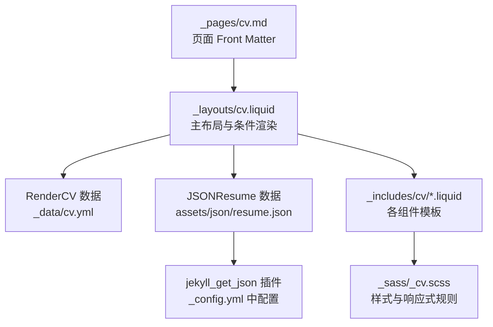
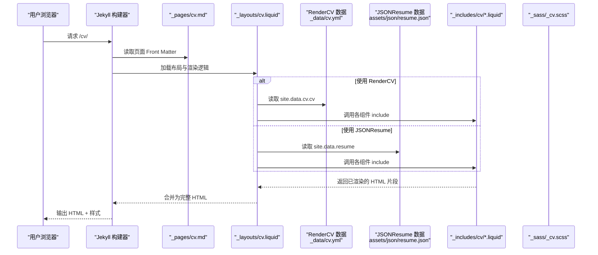
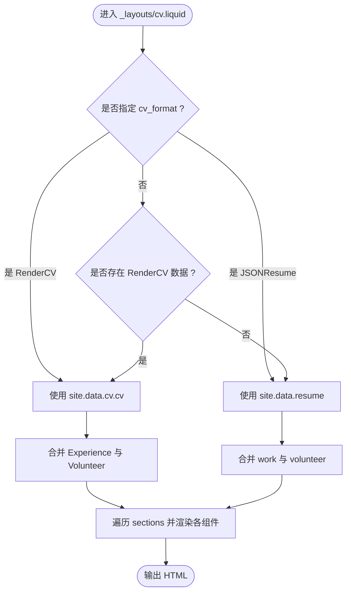
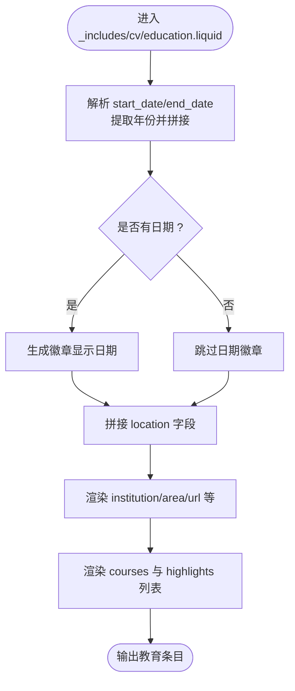
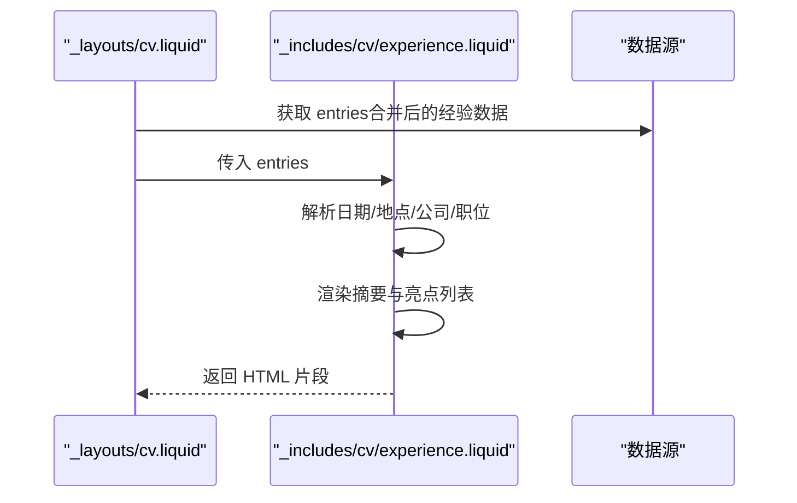
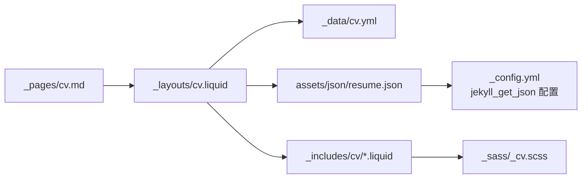

# 简历渲染和展示

<cite>
**本文引用的文件**
- [_layouts/cv.liquid](file://_layouts/cv.liquid)
- [_pages/cv.md](file://_pages/cv.md)
- [_data/cv.yml](file://_data/cv.yml)
- [_includes/cv/education.liquid](file://_includes/cv/education.liquid)
- [_includes/cv/experience.liquid](file://_includes/cv/experience.liquid)
- [_includes/cv/skills.liquid](file://_includes/cv/skills.liquid)
- [_includes/cv/awards.liquid](file://_includes/cv/awards.liquid)
- [_includes/cv/publications.liquid](file://_includes/cv/publications.liquid)
- [_includes/cv/projects.liquid](file://_includes/cv/projects.liquid)
- [_includes/cv/interests.liquid](file://_includes/cv/interests.liquid)
- [_includes/cv/languages.liquid](file://_includes/cv/languages.liquid)
- [_includes/cv/certificates.liquid](file://_includes/cv/certificates.liquid)
- [_includes/cv/references.liquid](file://_includes/cv/references.liquid)
- [_sass/_cv.scss](file://_sass/_cv.scss)
- [_config.yml](file://_config.yml)
- [assets/json/resume.json](file://assets/json/resume.json)
- [assets/rendercv/settings.yaml](file://assets/rendercv/settings.yaml)
- [assets/rendercv/design.yaml](file://assets/rendercv/design.yaml)
</cite>

## 目录
1. [简介](#简介)
2. [项目结构](#项目结构)
3. [核心组件](#核心组件)
4. [架构总览](#架构总览)
5. [详细组件分析](#详细组件分析)
6. [依赖关系分析](#依赖关系分析)
7. [性能考虑](#性能考虑)
8. [故障排查指南](#故障排查指南)
9. [结论](#结论)
10. [附录](#附录)

## 简介
本文件面向“简历渲染与展示”功能，系统性阐述基于 Jekyll 的 Liquid 模板渲染机制与数据绑定流程，覆盖 RenderCV（YAML）与 JSONResume（JSON）两种数据源格式，统一渲染为一致的简历页面。内容包括：
- 动态生成流程：从页面 Front Matter 到 Liquid 模板与 includes 的组合渲染
- 组件渲染逻辑：教育背景卡片、工作/研究经历列表、技能标签、奖项、论文、项目、语言、证书、参考文献等
- 响应式设计与移动端适配策略
- 模板变量与自定义渲染选项
- JSON 数据源集成与数据转换过程
- 实际 HTML 输出示例与 CSS 样式定制方法

## 项目结构
简历相关的核心目录与文件如下：
- 页面与布局
  - 页面：[_pages/cv.md](file://_pages/cv.md)
  - 布局：[_layouts/cv.liquid](file://_layouts/cv.liquid)
- 数据源
  - RenderCV：[_data/cv.yml](file://_data/cv.yml)
  - JSONResume：[assets/json/resume.json](file://assets/json/resume.json)
- 组件模板（includes）
  - 教育背景：[_includes/cv/education.liquid](file://_includes/cv/education.liquid)
  - 工作/研究经历：[_includes/cv/experience.liquid](file://_includes/cv/experience.liquid)
  - 技能：[_includes/cv/skills.liquid](file://_includes/cv/skills.liquid)
  - 奖项：[_includes/cv/awards.liquid](file://_includes/cv/awards.liquid)
  - 论文：[_includes/cv/publications.liquid](file://_includes/cv/publications.liquid)
  - 项目：[_includes/cv/projects.liquid](file://_includes/cv/projects.liquid)
  - 兴趣：[_includes/cv/interests.liquid](file://_includes/cv/interests.liquid)
  - 语言：[_includes/cv/languages.liquid](file://_includes/cv/languages.liquid)
  - 证书：[_includes/cv/certificates.liquid](file://_includes/cv/certificates.liquid)
  - 参考：[_includes/cv/references.liquid](file://_includes/cv/references.liquid)
- 样式
  - CV 共享样式：[_sass/_cv.scss](file://_sass/_cv.scss)
- 配置
  - Jekyll 配置与 JSON 数据抓取：[_config.yml](file://_config.yml)
  - RenderCV 渲染设置：[assets/rendercv/settings.yaml](file://assets/rendercv/settings.yaml)
  - RenderCV 设计主题：[assets/rendercv/design.yaml](file://assets/rendercv/design.yaml)

图表来源
- [_layouts/cv.liquid](file://_layouts/cv.liquid)
- [_pages/cv.md](file://_pages/cv.md)
- [_data/cv.yml](file://_data/cv.yml)
- [assets/json/resume.json](file://assets/json/resume.json)
- [_includes/cv/education.liquid](file://_includes/cv/education.liquid)
- [_sass/_cv.scss](file://_sass/_cv.scss)
- [_config.yml](file://_config.yml)

章节来源
- [_layouts/cv.liquid](file://_layouts/cv.liquid)
- [_pages/cv.md](file://_pages/cv.md)
- [_data/cv.yml](file://_data/cv.yml)
- [assets/json/resume.json](file://assets/json/resume.json)
- [_sass/_cv.scss](file://_sass/_cv.scss)
- [_config.yml](file://_config.yml)

## 核心组件
- 主布局与统一渲染入口
  - [_layouts/cv.liquid](file://_layouts/cv.liquid) 负责根据页面参数选择 RenderCV 或 JSONResume 数据源，合并并渲染各节内容，统一使用 includes 子模板完成具体组件渲染。
- 页面 Front Matter
  - [_pages/cv.md](file://_pages/cv.md) 设置布局、永久链接、标题、导航、语言、描述、侧边目录等；其中 cv_format 决定数据源优先级。
- 数据源
  - RenderCV：[_data/cv.yml](file://_data/cv.yml) 提供 cv.name、cv.label、cv.summary、cv.sections 等字段。
  - JSONResume：[assets/json/resume.json](file://assets/json/resume.json) 提供 basics、work、education、publications、projects、volunteer、awards、certificates、skills、languages、interests、references 等字段。
- 组件模板
  - 教育背景：[_includes/cv/education.liquid](file://_includes/cv/education.liquid)
  - 工作/研究经历：[_includes/cv/experience.liquid](file://_includes/cv/experience.liquid)
  - 技能：[_includes/cv/skills.liquid](file://_includes/cv/skills.liquid)
  - 奖项：[_includes/cv/awards.liquid](file://_includes/cv/awards.liquid)
  - 论文：[_includes/cv/publications.liquid](file://_includes/cv/publications.liquid)
  - 项目：[_includes/cv/projects.liquid](file://_includes/cv/projects.liquid)
  - 兴趣：[_includes/cv/interests.liquid](file://_includes/cv/interests.liquid)
  - 语言：[_includes/cv/languages.liquid](file://_includes/cv/languages.liquid)
  - 证书：[_includes/cv/certificates.liquid](file://_includes/cv/certificates.liquid)
  - 参考：[_includes/cv/references.liquid](file://_includes/cv/references.liquid)
- 样式与响应式
  - [_sass/_cv.scss](file://_sass/_cv.scss) 定义时间轴、列表组、徽章、图标位置、容器布局等样式，并通过媒体查询实现响应式。

章节来源
- [_layouts/cv.liquid](file://_layouts/cv.liquid)
- [_pages/cv.md](file://_pages/cv.md)
- [_data/cv.yml](file://_data/cv.yml)
- [assets/json/resume.json](file://assets/json/resume.json)
- [_includes/cv/education.liquid](file://_includes/cv/education.liquid)
- [_includes/cv/experience.liquid](file://_includes/cv/experience.liquid)
- [_includes/cv/skills.liquid](file://_includes/cv/skills.liquid)
- [_includes/cv/awards.liquid](file://_includes/cv/awards.liquid)
- [_includes/cv/publications.liquid](file://_includes/cv/publications.liquid)
- [_includes/cv/projects.liquid](file://_includes/cv/projects.liquid)
- [_includes/cv/interests.liquid](file://_includes/cv/interests.liquid)
- [_includes/cv/languages.liquid](file://_includes/cv/languages.liquid)
- [_includes/cv/certificates.liquid](file://_includes/cv/certificates.liquid)
- [_includes/cv/references.liquid](file://_includes/cv/references.liquid)
- [_sass/_cv.scss](file://_sass/_cv.scss)

## 架构总览
下图展示了从页面到最终 HTML 的渲染路径，以及数据源与组件模板之间的关系。

图表来源
- [_pages/cv.md](file://_pages/cv.md)
- [_layouts/cv.liquid](file://_layouts/cv.liquid)
- [_data/cv.yml](file://_data/cv.yml)
- [assets/json/resume.json](file://assets/json/resume.json)
- [_includes/cv/education.liquid](file://_includes/cv/education.liquid)
- [_includes/cv/experience.liquid](file://_includes/cv/experience.liquid)
- [_sass/_cv.scss](file://_sass/_cv.scss)

## 详细组件分析

### RenderCV 与 JSONResume 统一渲染流程
- 数据源选择
  - 若页面设置了 cv_format，则仅渲染对应格式；否则按存在性优先使用 RenderCV，其次 JSONResume。
- 经验与志愿合并
  - RenderCV：Experience 与 Volunteer 合并后统一走经验模板。
  - JSONResume：work 与 volunteer 合并后统一走经验模板。
- 其他节渲染
  - RenderCV：遍历 cv.sections，跳过已处理的 Experience/Volunteer，其余节名作为标题渲染。
  - JSONResume：直接按预设节名渲染（work/education/awards/publications/skills/languages/interests/certificates/projects/references）。
- Markdown 渲染
  - 摘要与条目中的文本通过 markdownify 处理，再移除首尾段落标签以适配卡片排版。

图表来源
- [_layouts/cv.liquid](file://_layouts/cv.liquid)

章节来源
- [_layouts/cv.liquid](file://_layouts/cv.liquid)

### 教育背景卡片（education）
- 支持字段
  - RenderCV：institution、area、studyType（或 degree）、start_date/end_date、location、url、courses、highlights
  - JSONResume：institution、area、studyType、startDate/endDate、location、url、courses、highlights
- 渲染要点
  - 日期提取年份并显示“开始 - 结束”，若结束为空则显示“至今”
  - 地点以小图标展示
  - 课程与亮点以列表形式呈现，支持 markdownify 处理
- 响应式
  - 使用列栅格布局，日期列固定宽度，内容列随屏幕变化

图表来源
- [_includes/cv/education.liquid](file://_includes/cv/education.liquid)

章节来源
- [_includes/cv/education.liquid](file://_includes/cv/education.liquid)

### 工作/研究经历（experience）
- 支持字段
  - RenderCV：company/organization、position、start_date/end_date、location、url、summary、highlights
  - JSONResume：name/organization、position、startDate/endDate、location、url、summary、highlights
- 渲染要点
  - 日期处理与教育背景一致
  - 公司/组织名称优先级：position → name/organization → company
  - 摘要与亮点以列表形式呈现

图表来源
- [_layouts/cv.liquid](file://_layouts/cv.liquid)
- [_includes/cv/experience.liquid](file://_includes/cv/experience.liquid)

章节来源
- [_layouts/cv.liquid](file://_layouts/cv.liquid)
- [_includes/cv/experience.liquid](file://_includes/cv/experience.liquid)

### 技能标签（skills）
- 支持字段
  - RenderCV：name、level、icon、keywords
  - JSONResume：name、level、keywords（无 icon）
- 渲染要点
  - 名称后可带等级括号
  - 关键词以逗号分隔展示
  - 内联样式控制间距

章节来源
- [_includes/cv/skills.liquid](file://_includes/cv/skills.liquid)

### 奖项（awards）
- 支持字段
  - RenderCV：title、date、awarder、summary、url
  - JSONResume：title/name、date、awarder、summary、url
- 渲染要点
  - 有日期时左侧显示年份徽章，无日期时整行展示
  - 标题支持链接

章节来源
- [_includes/cv/awards.liquid](file://_includes/cv/awards.liquid)

### 论文（publications）
- 支持字段
  - RenderCV：title、releaseDate/date、publisher、summary、url
  - JSONResume：title/name、releaseDate/date、publisher、summary、url
- 渲染要点
  - 发布日期仅显示年份
  - 标题与出版者分行展示，摘要支持 markdownify

章节来源
- [_includes/cv/publications.liquid](file://_includes/cv/publications.liquid)

### 项目（projects）
- 支持字段
  - RenderCV：name、summary、highlights、url
  - JSONResume：name、summary、highlights、date（startDate/endDate）
- 渲染要点
  - 标题支持链接
  - 高亮以列表形式展示

章节来源
- [_includes/cv/projects.liquid](file://_includes/cv/projects.liquid)

### 兴趣（interests）
- 支持字段
  - RenderCV：name、icon、keywords
  - JSONResume：name、keywords（无 icon）
- 渲染要点
  - 名称后列出关键词，逗号分隔

章节来源
- [_includes/cv/interests.liquid](file://_includes/cv/interests.liquid)

### 语言（languages）
- 支持字段差异
  - RenderCV：name、summary
  - JSONResume：language、fluency
- 渲染要点
  - 统一映射为语言名称与熟练度

章节来源
- [_includes/cv/languages.liquid](file://_includes/cv/languages.liquid)

### 证书（certificates）
- 支持字段
  - RenderCV：name、issuer、date、url、icon
  - JSONResume：name、issuer、date、url
- 渲染要点
  - 日期仅显示年份

章节来源
- [_includes/cv/certificates.liquid](file://_includes/cv/certificates.liquid)

### 参考（references）
- 支持字段
  - RenderCV：name、reference、icon
  - JSONResume：name、reference（无 icon）
- 渲染要点
  - 引用内容支持 markdownify

章节来源
- [_includes/cv/references.liquid](file://_includes/cv/references.liquid)

## 依赖关系分析
- 页面到布局
  - [_pages/cv.md](file://_pages/cv.md) 指定布局为 cv，触发 [_layouts/cv.liquid](file://_layouts/cv.liquid) 执行。
- 布局到数据
  - [_layouts/cv.liquid](file://_layouts/cv.liquid) 依据 cv_format 与数据存在性选择 RenderCV 或 JSONResume。
- 布局到组件
  - 通过 include 调用各组件模板，实现模块化渲染。
- 配置到数据抓取
  - [_config.yml](file://_config.yml) 中启用 jekyll_get_json 插件并配置数据键名与 JSON 文件路径，使 site.data.resume 可用。
- 样式依赖
  - [_sass/_cv.scss](file://_sass/_cv.scss) 提供 CV 专用样式，与组件模板配合实现响应式与视觉一致性。

图表来源
- [_pages/cv.md](file://_pages/cv.md)
- [_layouts/cv.liquid](file://_layouts/cv.liquid)
- [_data/cv.yml](file://_data/cv.yml)
- [assets/json/resume.json](file://assets/json/resume.json)
- [_includes/cv/education.liquid](file://_includes/cv/education.liquid)
- [_sass/_cv.scss](file://_sass/_cv.scss)
- [_config.yml](file://_config.yml)

章节来源
- [_pages/cv.md](file://_pages/cv.md)
- [_layouts/cv.liquid](file://_layouts/cv.liquid)
- [_data/cv.yml](file://_data/cv.yml)
- [assets/json/resume.json](file://assets/json/resume.json)
- [_includes/cv/education.liquid](file://_includes/cv/education.liquid)
- [_sass/_cv.scss](file://_sass/_cv.scss)
- [_config.yml](file://_config.yml)

## 性能考虑
- 模板复用与模块化
  - 通过 include 将各组件模板独立管理，减少重复逻辑，提升维护效率。
- 数据访问优化
  - 在布局中提前合并经验与志愿，避免在子模板内重复判断。
- 样式压缩
  - Jekyll 配置中启用 sass 压缩，减少 CSS 体积。
- 图片懒加载
  - 全局启用图片懒加载，改善首屏性能与滚动体验。
- 插件与构建
  - 合理配置插件与缓存策略，避免不必要的重复计算。

## 故障排查指南
- 未显示任何 CV 数据
  - 检查页面 cv_format 是否正确设置，或确认 RenderCV 数据文件是否存在且结构正确。
  - 确认 JSONResume 数据文件路径与键名与配置一致。
- 经验/志愿未合并显示
  - 确认 RenderCV 的 Experience 与 Volunteer 是否同时存在；确认 JSONResume 的 work 与 volunteer 是否被正确合并。
- 日期显示异常
  - 确认日期字段格式为“YYYY-MM-DD”或纯年份；模板会提取年份并显示“开始 - 结束”。
- 样式未生效
  - 检查 SCSS 编译与压缩配置；确认 CSS 资源加载顺序与版本兼容性。
- PDF/HTML 导出问题（RenderCV）
  - 检查 [assets/rendercv/settings.yaml](file://assets/rendercv/settings.yaml) 与 [assets/rendercv/design.yaml](file://assets/rendercv/design.yaml) 的路径与生成开关。

章节来源
- [_layouts/cv.liquid](file://_layouts/cv.liquid)
- [_config.yml](file://_config.yml)
- [assets/rendercv/settings.yaml](file://assets/rendercv/settings.yaml)
- [assets/rendercv/design.yaml](file://assets/rendercv/design.yaml)

## 结论
该简历渲染系统通过统一布局与组件模板，实现了对 RenderCV 与 JSONResume 两种数据源的无缝兼容。借助 Liquid 的数据绑定与过滤器，结合 SCSS 的响应式样式，能够在不同设备上稳定输出一致的简历页面。通过模块化的 include 结构与清晰的配置，开发者可以便捷地扩展与定制简历内容与外观。

## 附录

### 模板变量与自定义选项
- 页面 Front Matter（示例：[_pages/cv.md](file://_pages/cv.md)）
  - layout: cv
  - permalink: /cv/
  - title: CV
  - nav: true
  - nav_order: 3
  - cv_format: rendercv 或 jsonresume
  - lang: en
  - description: 简历描述
  - toc: 侧边目录配置
- 布局内部变量（示例：[_layouts/cv.liquid](file://_layouts/cv.liquid)）
  - render_rendercv / render_jsonresume：用于控制数据源选择
  - cv / site.data.resume：当前使用的数据对象
  - entries：传递给各组件模板的数据数组
- 组件模板输入
  - 所有组件模板均接收 entries 数组，逐条渲染为 HTML 片段

章节来源
- [_pages/cv.md](file://_pages/cv.md)
- [_layouts/cv.liquid](file://_layouts/cv.liquid)

### JSON 数据源集成与转换
- 集成方式
  - 通过 jekyll_get_json 插件读取 [assets/json/resume.json](file://assets/json/resume.json)，并将数据注入 site.data.resume。
- 字段映射
  - basics → 联系信息与摘要
  - work/education/publications/projects/volunteer/awards/certificates/skills/languages/interests/references → 对应组件模板
- 转换规则
  - 日期字段统一为“YYYY-MM-DD”或“YYYY”；模板提取年份用于时间轴徽章
  - 摘要与高亮内容经 markdownify 处理后去除段落标签，适配卡片排版

章节来源
- [_config.yml](file://_config.yml)
- [assets/json/resume.json](file://assets/json/resume.json)
- [_layouts/cv.liquid](file://_layouts/cv.liquid)

### 响应式设计与移动端适配
- 栅格系统
  - 使用列类（如 xs/sm/md）在不同断点下调整日期列与内容列的宽度
- 时间轴与徽章
  - 徽章最小宽度确保在窄屏下仍具可读性
- 图标与间距
  - 通过 SCSS 控制图标大小与间距，保证在小屏上的可读性
- 媒体查询
  - SCSS 中包含针对不同断点的样式规则，确保在移动设备上的良好显示

章节来源
- [_includes/cv/education.liquid](file://_includes/cv/education.liquid)
- [_includes/cv/experience.liquid](file://_includes/cv/experience.liquid)
- [_sass/_cv.scss](file://_sass/_cv.scss)

### HTML 输出示例与 CSS 定制方法
- HTML 输出示例
  - 教育背景卡片：见 [_includes/cv/education.liquid](file://_includes/cv/education.liquid)
  - 工作/研究经历列表：见 [_includes/cv/experience.liquid](file://_includes/cv/experience.liquid)
  - 技能标签：见 [_includes/cv/skills.liquid](file://_includes/cv/skills.liquid)
  - 奖项：见 [_includes/cv/awards.liquid](file://_includes/cv/awards.liquid)
  - 论文：见 [_includes/cv/publications.liquid](file://_includes/cv/publications.liquid)
  - 项目：见 [_includes/cv/projects.liquid](file://_includes/cv/projects.liquid)
  - 兴趣：见 [_includes/cv/interests.liquid](file://_includes/cv/interests.liquid)
  - 语言：见 [_includes/cv/languages.liquid](file://_includes/cv/languages.liquid)
  - 证书：见 [_includes/cv/certificates.liquid](file://_includes/cv/certificates.liquid)
  - 参考：见 [_includes/cv/references.liquid](file://_includes/cv/references.liquid)
- CSS 定制方法
  - 修改 [_sass/_cv.scss](file://_sass/_cv.scss) 中的时间轴、徽章、列表组、图标与容器布局样式
  - 通过 SCSS 变量与颜色主题调整整体风格
  - 注意保持与组件模板的类名与结构一致，避免破坏响应式布局

章节来源
- [_includes/cv/education.liquid](file://_includes/cv/education.liquid)
- [_includes/cv/experience.liquid](file://_includes/cv/experience.liquid)
- [_includes/cv/skills.liquid](file://_includes/cv/skills.liquid)
- [_includes/cv/awards.liquid](file://_includes/cv/awards.liquid)
- [_includes/cv/publications.liquid](file://_includes/cv/publications.liquid)
- [_includes/cv/projects.liquid](file://_includes/cv/projects.liquid)
- [_includes/cv/interests.liquid](file://_includes/cv/interests.liquid)
- [_includes/cv/languages.liquid](file://_includes/cv/languages.liquid)
- [_includes/cv/certificates.liquid](file://_includes/cv/certificates.liquid)
- [_includes/cv/references.liquid](file://_includes/cv/references.liquid)
- [_sass/_cv.scss](file://_sass/_cv.scss)