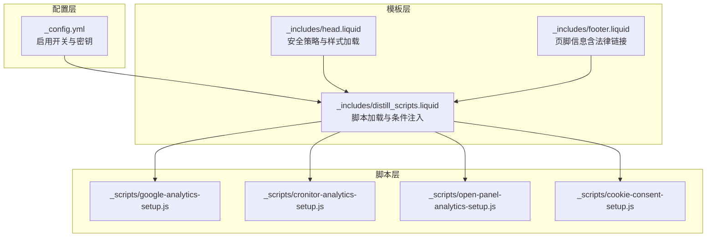
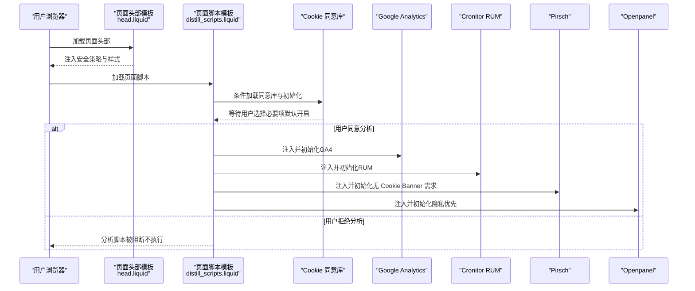
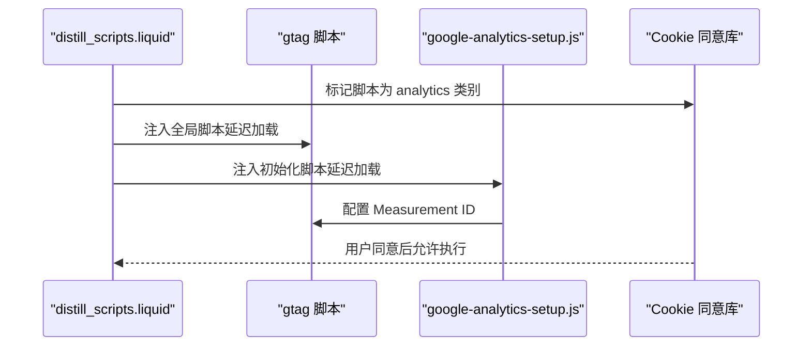
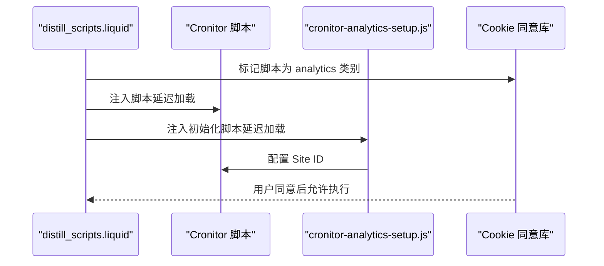
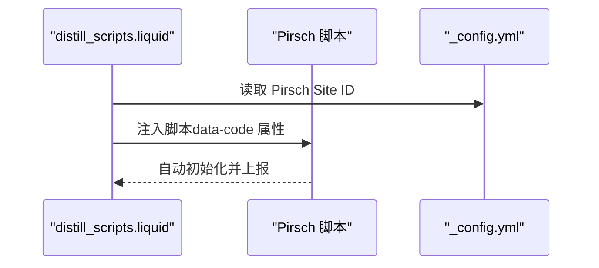
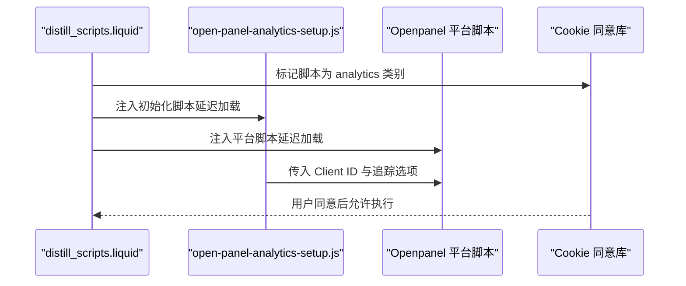
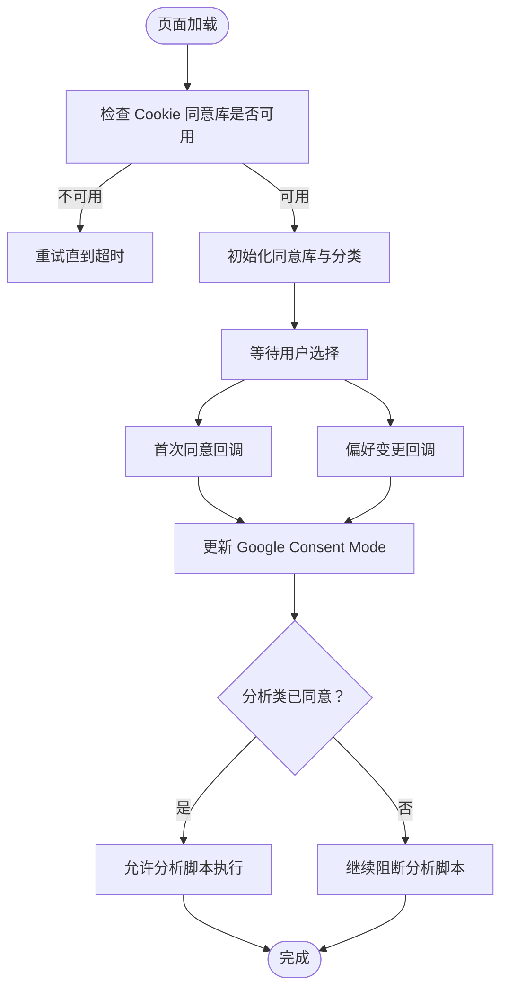
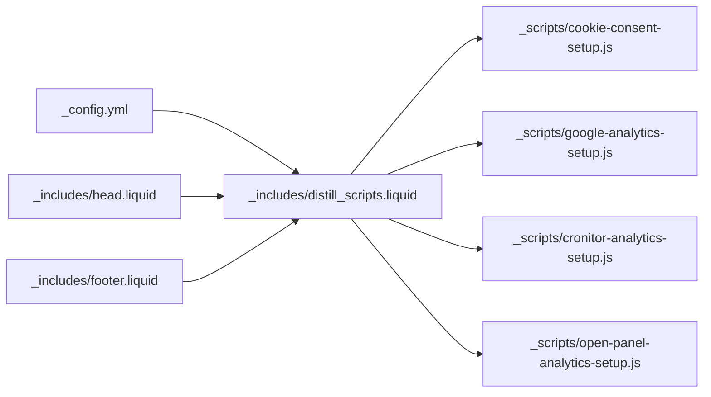

# 分析和隐私保护

<cite>
**本文引用的文件**
- [ANALYTICS.md](file://ANALYTICS.md)
- [_config.yml](file://_config.yml)
- [_scripts/google-analytics-setup.js](file://_scripts/google-analytics-setup.js)
- [_scripts/cronitor-analytics-setup.js](file://_scripts/cronitor-analytics-setup.js)
- [_scripts/open-panel-analytics-setup.js](file://_scripts/open-panel-analytics-setup.js)
- [_scripts/cookie-consent-setup.js](file://_scripts/cookie-consent-setup.js)
- [_includes/head.liquid](file://_includes/head.liquid)
- [_includes/distill_scripts.liquid](file://_includes/distill_scripts.liquid)
- [README.md](file://README.md)
- [CUSTOMIZE.md](file://CUSTOMIZE.md)
- [_includes/footer.liquid](file://_includes/footer.liquid)
</cite>

## 目录
1. [简介](#简介)
2. [项目结构](#项目结构)
3. [核心组件](#核心组件)
4. [架构总览](#架构总览)
5. [详细组件分析](#详细组件分析)
6. [依赖关系分析](#依赖关系分析)
7. [性能考量](#性能考量)
8. [故障排查指南](#故障排查指南)
9. [结论](#结论)
10. [附录](#附录)

## 简介
本文件聚焦于该 Jekyll 站点的“分析与隐私保护”能力，涵盖以下内容：
- 多种分析工具的集成配置：Google Analytics、Cronitor RUM、Pirsch、Openpanel
- 隐私保护功能：GDPR 合规的 Cookie 同意管理、数据收集透明度与用户控制
- 分析数据的收集范围与处理方式：访问统计、用户行为分析、性能监控
- 隐私设置配置指南：数据删除、匿名化处理、第三方服务集成
- 实际分析配置示例与隐私政策声明编写方法
- 分析功能对网站性能的影响与优化策略

## 项目结构
该站点通过配置文件与模板片段实现分析与隐私保护功能的统一接入：
- 配置层：在站点配置中启用/禁用各分析服务，并注入密钥或标识符
- 模板层：在页面头部与脚部模板中按需加载第三方脚本与初始化逻辑
- 脚本层：独立的初始化脚本负责与各分析平台对接
- 隐私层：基于 Cookie 同意库的阻断机制，确保仅在用户授权后执行追踪

图表来源
- [_config.yml](file://_config.yml)
- [_includes/head.liquid](file://_includes/head.liquid)
- [_includes/distill_scripts.liquid](file://_includes/distill_scripts.liquid)
- [_scripts/google-analytics-setup.js](file://_scripts/google-analytics-setup.js)
- [_scripts/cronitor-analytics-setup.js](file://_scripts/cronitor-analytics-setup.js)
- [_scripts/open-panel-analytics-setup.js](file://_scripts/open-panel-analytics-setup.js)
- [_scripts/cookie-consent-setup.js](file://_scripts/cookie-consent-setup.js)
- [_includes/footer.liquid](file://_includes/footer.liquid)

章节来源
- [_config.yml](file://_config.yml)
- [_includes/head.liquid](file://_includes/head.liquid)
- [_includes/distill_scripts.liquid](file://_includes/distill_scripts.liquid)
- [_scripts/cookie-consent-setup.js](file://_scripts/cookie-consent-setup.js)

## 核心组件
- 分析服务配置与开关
  - 在站点配置中定义启用开关与密钥字段，用于控制是否加载与初始化各分析服务
  - 支持的服务包括：Google Analytics、Cronitor RUM、Pirsch、Openpanel
- 脚本注入与初始化
  - 通过模板条件判断动态注入脚本标签，并在需要时附加 Cookie 同意类别属性
  - 各服务提供独立初始化脚本，完成平台特定的配置与调用
- Cookie 同意与隐私控制
  - 基于 Cookie 同意库，将分析脚本标记为“analytics”类别
  - 默认阻断所有分析脚本，仅在用户明确同意后运行
  - 使用 Google Consent Mode 在未获得同意前以隐私优先模式运行 GA4

章节来源
- [_config.yml](file://_config.yml)
- [_includes/distill_scripts.liquid](file://_includes/distill_scripts.liquid)
- [_scripts/cookie-consent-setup.js](file://_scripts/cookie-consent-setup.js)

## 架构总览
下图展示了从用户访问到数据分析与隐私控制的整体流程：

图表来源
- [_includes/head.liquid](file://_includes/head.liquid)
- [_includes/distill_scripts.liquid](file://_includes/distill_scripts.liquid)
- [_scripts/cookie-consent-setup.js](file://_scripts/cookie-consent-setup.js)
- [_scripts/google-analytics-setup.js](file://_scripts/google-analytics-setup.js)
- [_scripts/cronitor-analytics-setup.js](file://_scripts/cronitor-analytics-setup.js)
- [_scripts/open-panel-analytics-setup.js](file://_scripts/open-panel-analytics-setup.js)

## 详细组件分析

### 组件一：Google Analytics（GA4）集成
- 配置要点
  - 在站点配置中启用开关与 Measurement ID
  - 模板条件注入全局脚本与初始化脚本
  - 通过 Cookie 同意库标记为“analytics”类别，未获同意时阻断
- 初始化流程
  - 全局脚本先于初始化脚本加载，记录时间戳并应用配置
  - 使用 Google Consent Mode 在未获同意前以隐私优先模式运行
- 数据范围与处理
  - 访问统计、页面浏览、事件追踪等
  - 遵循用户同意状态与平台隐私设置

图表来源
- [_includes/distill_scripts.liquid](file://_includes/distill_scripts.liquid)
- [_scripts/google-analytics-setup.js](file://_scripts/google-analytics-setup.js)
- [_scripts/cookie-consent-setup.js](file://_scripts/cookie-consent-setup.js)

章节来源
- [_config.yml](file://_config.yml)
- [_includes/distill_scripts.liquid](file://_includes/distill_scripts.liquid)
- [_scripts/google-analytics-setup.js](file://_scripts/google-analytics-setup.js)
- [_scripts/cookie-consent-setup.js](file://_scripts/cookie-consent-setup.js)

### 组件二：Cronitor RUM 集成
- 配置要点
  - 在站点配置中启用开关与 Site ID
  - 模板条件注入脚本与初始化脚本
- 功能特性
  - 实时用户监控（RUM），提供站点可用性与性能指标
  - 需要 Cookie 同意（根据隐私考虑）
- 数据范围与处理
  - 性能指标、错误监控、用户路径等
  - 严格遵循用户同意状态

图表来源
- [_includes/distill_scripts.liquid](file://_includes/distill_scripts.liquid)
- [_scripts/cronitor-analytics-setup.js](file://_scripts/cronitor-analytics-setup.js)
- [_scripts/cookie-consent-setup.js](file://_scripts/cookie-consent-setup.js)

章节来源
- [_config.yml](file://_config.yml)
- [_includes/distill_scripts.liquid](file://_includes/distill_scripts.liquid)
- [_scripts/cronitor-analytics-setup.js](file://_scripts/cronitor-analytics-setup.js)
- [_scripts/cookie-consent-setup.js](file://_scripts/cookie-consent-setup.js)

### 组件三：Pirsch 集成
- 配置要点
  - 在站点配置中启用开关与 Site ID
  - 模板条件注入脚本（无需 Cookie Banner）
- 特性
  - GDPR 合规、欧洲服务器、免费额度
- 数据范围与处理
  - 访问统计、来源分析、页面热度等
  - 严格遵循用户同意状态（如启用 Cookie 同意）

图表来源
- [_includes/distill_scripts.liquid](file://_includes/distill_scripts.liquid)
- [_config.yml](file://_config.yml)

章节来源
- [_config.yml](file://_config.yml)
- [_includes/distill_scripts.liquid](file://_includes/distill_scripts.liquid)

### 组件四：Openpanel 集成
- 配置要点
  - 在站点配置中启用开关与 Client ID（UUID）
  - 模板条件注入初始化脚本与平台脚本
- 特性
  - 开源、可自托管、隐私优先
- 数据范围与处理
  - 屏幕视图、外链点击、属性追踪等
  - 严格遵循用户同意状态

图表来源
- [_includes/distill_scripts.liquid](file://_includes/distill_scripts.liquid)
- [_scripts/open-panel-analytics-setup.js](file://_scripts/open-panel-analytics-setup.js)
- [_scripts/cookie-consent-setup.js](file://_scripts/cookie-consent-setup.js)

章节来源
- [_config.yml](file://_config.yml)
- [_includes/distill_scripts.liquid](file://_includes/distill_scripts.liquid)
- [_scripts/open-panel-analytics-setup.js](file://_scripts/open-panel-analytics-setup.js)
- [_scripts/cookie-consent-setup.js](file://_scripts/cookie-consent-setup.js)

### 组件五：Cookie 同意与隐私控制
- 设计原则
  - 必要类脚本默认放行；分析类脚本默认阻断
  - 通过 Google Consent Mode 在未获同意前以隐私优先模式运行 GA4
  - 用户可在弹窗中调整偏好，系统即时更新 Consent Mode
- 技术实现
  - 所有分析脚本统一标记为“analytics”类别
  - 同意库在初始化时注册回调，监听用户选择变化
  - 更新 Google Consent Mode 的存储许可状态，决定后续脚本执行

图表来源
- [_scripts/cookie-consent-setup.js](file://_scripts/cookie-consent-setup.js)
- [_includes/distill_scripts.liquid](file://_includes/distill_scripts.liquid)

章节来源
- [_scripts/cookie-consent-setup.js](file://_scripts/cookie-consent-setup.js)
- [_includes/distill_scripts.liquid](file://_includes/distill_scripts.liquid)
- [CUSTOMIZE.md](file://CUSTOMIZE.md)

## 依赖关系分析
- 配置驱动
  - 各分析服务的启用开关与密钥均来自站点配置
- 模板耦合
  - 页面脚本模板集中处理脚本注入、条件判断与 Cookie 同意标记
- 运行时依赖
  - Cookie 同意库为分析脚本的唯一运行时依赖，负责阻断与放行
- 第三方资源
  - 各平台脚本与初始化脚本通过 CDN 或本地路径加载

图表来源
- [_config.yml](file://_config.yml)
- [_includes/distill_scripts.liquid](file://_includes/distill_scripts.liquid)
- [_scripts/cookie-consent-setup.js](file://_scripts/cookie-consent-setup.js)
- [_scripts/google-analytics-setup.js](file://_scripts/google-analytics-setup.js)
- [_scripts/cronitor-analytics-setup.js](file://_scripts/cronitor-analytics-setup.js)
- [_scripts/open-panel-analytics-setup.js](file://_scripts/open-panel-analytics-setup.js)
- [_includes/head.liquid](file://_includes/head.liquid)
- [_includes/footer.liquid](file://_includes/footer.liquid)

章节来源
- [_config.yml](file://_config.yml)
- [_includes/distill_scripts.liquid](file://_includes/distill_scripts.liquid)
- [_includes/head.liquid](file://_includes/head.liquid)
- [_includes/footer.liquid](file://_includes/footer.liquid)

## 性能考量
- 脚本加载策略
  - 大多数分析脚本采用延迟加载，减少对首屏渲染的影响
  - 仅在用户同意后才执行，避免不必要的网络请求
- 安全与缓存
  - 内容安全策略允许必要的外部资源，兼顾安全性与兼容性
  - 模板中使用缓存破坏参数，确保更新后的脚本及时生效
- 优化建议
  - 仅启用必要的分析服务，降低请求数量
  - 对第三方脚本进行 CDN 缓存与 HTTPS 引用，提升加载速度
  - 在移动设备上谨慎启用高开销的分析功能（如 RUM）

章节来源
- [_includes/head.liquid](file://_includes/head.liquid)
- [_includes/distill_scripts.liquid](file://_includes/distill_scripts.liquid)

## 故障排查指南
- 分析未生效
  - 检查站点配置中的启用开关与密钥是否正确
  - 确认模板中已注入对应脚本与初始化脚本
  - 若启用 Cookie 同意，请确认用户已完成同意操作
- Cookie 同意库问题
  - 确认同意库脚本已成功加载且未被拦截
  - 查看控制台是否有初始化失败的错误提示
- 数据隐私合规
  - 若服务需要 Cookie 同意，请确保已启用同意对话框
  - 对于 GDPR 地区用户，建议优先选择无需 Cookie Banner 的服务（如 Pirsch、Openpanel）

章节来源
- [_config.yml](file://_config.yml)
- [_includes/distill_scripts.liquid](file://_includes/distill_scripts.liquid)
- [_scripts/cookie-consent-setup.js](file://_scripts/cookie-consent-setup.js)
- [ANALYTICS.md](file://ANALYTICS.md)

## 结论
该站点通过统一的配置与模板机制，实现了多分析平台的灵活集成与严格的隐私保护。借助 Cookie 同意库与 Google Consent Mode，分析脚本仅在用户授权后执行，满足 GDPR 等隐私法规要求。同时，延迟加载与安全策略的运用有效降低了对性能的影响。建议根据目标受众与合规需求选择合适的分析服务组合，并持续关注数据最小化与透明度披露。

## 附录

### 隐私政策声明编写要点
- 明确列出使用的分析服务及其提供商
- 说明数据收集的目的、范围与保留期限
- 提供用户访问、更正、删除数据的权利说明
- 指明 Cookie 的类型、用途与管理方式
- 提供联系信息以便用户咨询

参考依据
- [ANALYTICS.md](file://ANALYTICS.md)
- [CUSTOMIZE.md](file://CUSTOMIZE.md)

### 实际配置示例（步骤说明）
- Google Analytics
  - 在站点配置中启用开关并填入 Measurement ID
  - 模板自动注入脚本与初始化逻辑
- Cronitor RUM
  - 在站点配置中启用开关并填入 Site ID
  - 模板自动注入脚本与初始化逻辑
- Pirsch
  - 在站点配置中启用开关并填入 Site ID
  - 模板自动注入脚本（无需同意 Banner）
- Openpanel
  - 在站点配置中启用开关并填入 Client ID
  - 模板自动注入初始化脚本与平台脚本

参考依据
- [ANALYTICS.md](file://ANALYTICS.md)
- [_config.yml](file://_config.yml)
- [_includes/distill_scripts.liquid](file://_includes/distill_scripts.liquid)

### 隐私设置配置指南
- Cookie 同意对话框
  - 在站点配置中启用同意开关
  - 可在初始化脚本中自定义语言与文案
- 数据删除与匿名化
  - 通过平台提供的工具或 API 删除用户数据
  - 在模板中避免收集敏感信息，或在收集前进行匿名化处理
- 第三方服务集成
  - 仅在用户同意后加载第三方脚本
  - 对于需要 Cookie 同意的服务，务必启用同意对话框

参考依据
- [CUSTOMIZE.md](file://CUSTOMIZE.md)
- [_scripts/cookie-consent-setup.js](file://_scripts/cookie-consent-setup.js)
- [_includes/distill_scripts.liquid](file://_includes/distill_scripts.liquid)