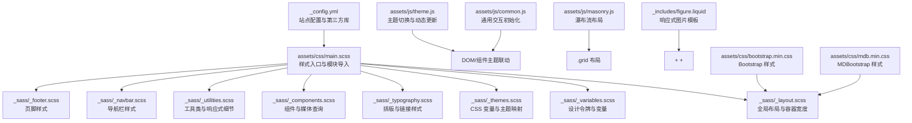
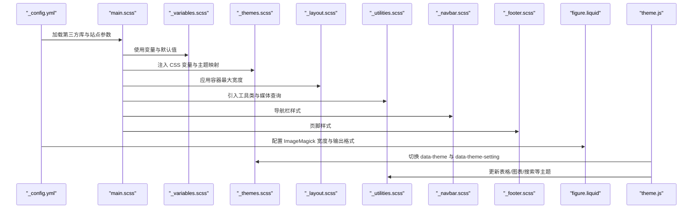
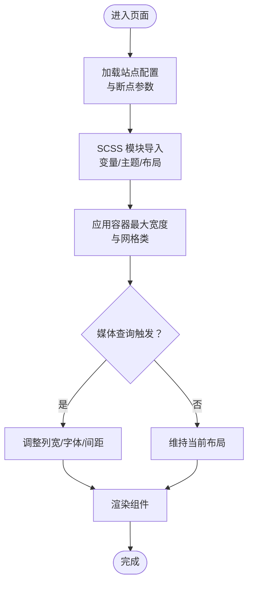
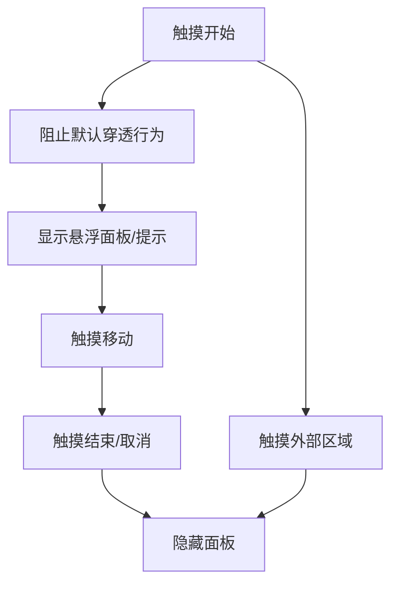
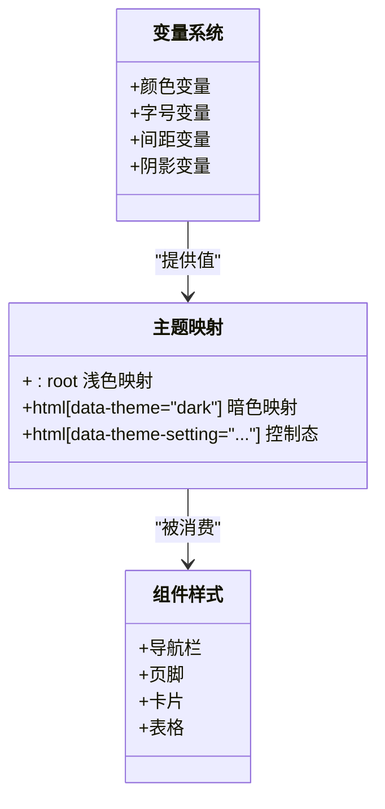
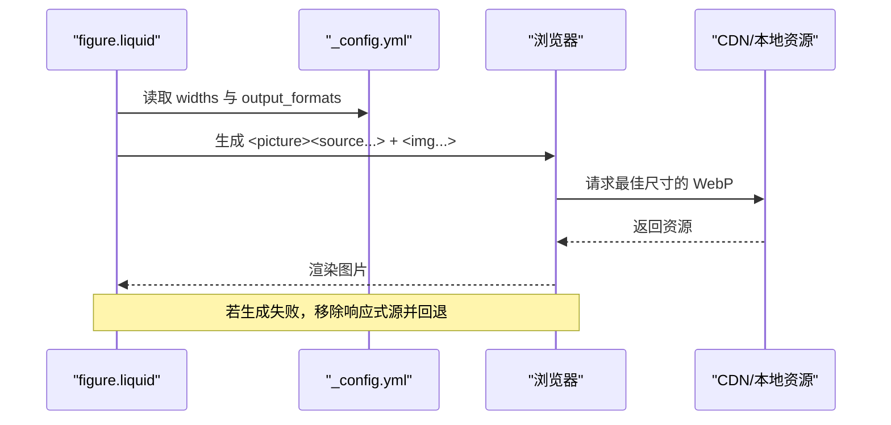
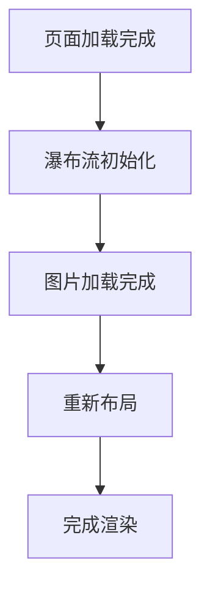
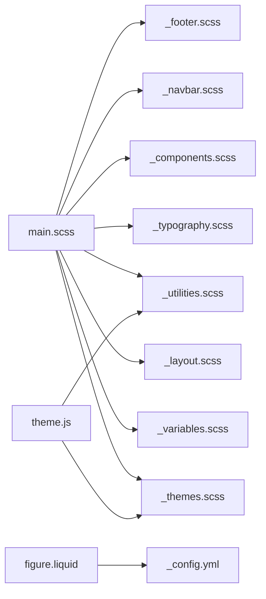

# 响应式设计系统

<cite>
**本文档引用的文件**
- [_config.yml](file://_config.yml)
- [main.scss](file://assets/css/main.scss)
- [_variables.scss](file://_sass/_variables.scss)
- [_layout.scss](file://_sass/_layout.scss)
- [_themes.scss](file://_sass/_themes.scss)
- [_components.scss](file://_sass/_components.scss)
- [_typography.scss](file://_sass/_typography.scss)
- [_utilities.scss](file://_sass/_utilities.scss)
- [_navbar.scss](file://_sass/_navbar.scss)
- [_footer.scss](file://_sass/_footer.scss)
- [theme.js](file://assets/js/theme.js)
- [common.js](file://assets/js/common.js)
- [masonry.js](file://assets/js/masonry.js)
- [figure.liquid](file://_includes/figure.liquid)
</cite>

## 目录
1. [简介](#简介)
2. [项目结构](#项目结构)
3. [核心组件](#核心组件)
4. [架构总览](#架构总览)
5. [详细组件分析](#详细组件分析)
6. [依赖关系分析](#依赖关系分析)
7. [性能考量](#性能考量)
8. [故障排查指南](#故障排查指南)
9. [结论](#结论)
10. [附录](#附录)

## 简介
本文件面向响应式设计系统，围绕基于 Bootstrap 的响应式布局实现进行深入解析，涵盖断点与网格系统、组件适配、移动端优化（触摸交互、字体与图片）、CSS 变量体系（颜色主题、间距与排版）、响应式图片（WebP 与懒加载）、实际示例与调试技巧，以及跨设备兼容性测试与性能优化策略。

## 项目结构
该站点采用 Jekyll + SCSS 构建，样式组织以模块化 Sass 分区为主，配合 JavaScript 实现主题切换与交互增强。整体结构如下：

**图表来源**
- [main.scss:1-40](file://assets/css/main.scss#L1-L40)
- [_variables.scss:1-53](file://_sass/_variables.scss#L1-L53)
- [_themes.scss:1-209](file://_sass/_themes.scss#L1-L209)
- [_layout.scss:1-59](file://_sass/_layout.scss#L1-L59)
- [_typography.scss:1-137](file://_sass/_typography.scss#L1-L137)
- [_components.scss:1-262](file://_sass/_components.scss#L1-L262)
- [_utilities.scss:1-606](file://_sass/_utilities.scss#L1-L606)
- [_navbar.scss:1-209](file://_sass/_navbar.scss#L1-L209)
- [_footer.scss:1-36](file://_sass/_footer.scss#L1-L36)
- [theme.js:1-343](file://assets/js/theme.js#L1-L343)
- [common.js:1-61](file://assets/js/common.js#L1-L61)
- [masonry.js:1-12](file://assets/js/masonry.js#L1-L12)
- [figure.liquid:1-86](file://_includes/figure.liquid#L1-L86)

**章节来源**
- [main.scss:1-40](file://assets/css/main.scss#L1-L40)
- [_config.yml:347-376](file://_config.yml#L347-L376)

## 核心组件
- 设计令牌与变量：集中定义颜色、间距、字号等基础设计元素，供全局与主题变量使用。
- 主题系统：通过 CSS 自定义属性在浅色/深色模式间切换，并驱动组件与第三方库的主题一致性。
- 布局与网格：基于容器最大宽度与 Bootstrap 网格类实现内容流式布局。
- 组件与媒体查询：卡片、列表、社交图标、项目展示等组件在不同断点下的自适应行为。
- 响应式图片：Liquid 模板生成 picture/source/img 结构，结合 ImageMagick 输出多尺寸 WebP 并启用懒加载。
- 交互与可访问性：主题切换、TOC、弹出框、滚动进度条、触摸事件处理等。

**章节来源**
- [_variables.scss:1-53](file://_sass/_variables.scss#L1-L53)
- [_themes.scss:1-209](file://_sass/_themes.scss#L1-L209)
- [_layout.scss:32-34](file://_sass/_layout.scss#L32-L34)
- [_components.scss:37-54](file://_sass/_components.scss#L37-L54)
- [figure.liquid:10-81](file://_includes/figure.liquid#L10-L81)
- [theme.js:16-91](file://assets/js/theme.js#L16-L91)

## 架构总览
下图展示了响应式设计系统的关键交互路径：配置驱动变量 → SCSS 导入模块 → CSS 变量主题 → JS 动态更新 → 组件渲染。

**图表来源**
- [_config.yml:347-376](file://_config.yml#L347-L376)
- [main.scss:12-39](file://assets/css/main.scss#L12-L39)
- [_themes.scss:7-75](file://_sass/_themes.scss#L7-L75)
- [_layout.scss:32-34](file://_sass/_layout.scss#L32-L34)
- [_utilities.scss:115-124](file://_sass/_utilities.scss#L115-L124)
- [_navbar.scss:7-12](file://_sass/_navbar.scss#L7-L12)
- [_footer.scss:5-24](file://_sass/_footer.scss#L5-L24)
- [figure.liquid:16-33](file://_includes/figure.liquid#L16-L33)
- [theme.js:16-91](file://assets/js/theme.js#L16-L91)

## 详细组件分析

### 断点与网格系统
- 容器最大宽度：通过变量控制页面内容最大宽度，确保在大屏与小屏均保持良好可读性。
- Bootstrap 网格：组件中广泛使用列类与栅格结构，配合媒体查询在不同断点下调整布局密度与元素尺寸。
- 响应式图片：在模板中根据断点生成多尺寸 WebP 源，结合 sizes 属性提升加载效率与视觉质量。

**图表来源**
- [_layout.scss:32-34](file://_sass/_layout.scss#L32-L34)
- [_components.scss:81-91](file://_sass/_components.scss#L81-L91)
- [_utilities.scss:209-274](file://_sass/_utilities.scss#L209-L274)
- [figure.liquid:26-31](file://_includes/figure.liquid#L26-L31)

**章节来源**
- [_layout.scss:32-34](file://_sass/_layout.scss#L32-L34)
- [_components.scss:81-91](file://_sass/_components.scss#L81-L91)
- [_utilities.scss:209-274](file://_sass/_utilities.scss#L209-L274)
- [figure.liquid:26-31](file://_includes/figure.liquid#L26-L31)

### 移动端优化
- 触摸友好交互：主题切换按钮与导航菜单在小屏下具备合适的点击区域；弹出层与悬浮框对触摸事件采用被动监听，避免阻塞主线程。
- 字体与排版：针对极小屏与小屏分别调整代码块、内联代码与目录的字号，保证可读性。
- 图片优化：自动注入 loading="lazy"，并在图片加载失败时回退到非响应式源，提升稳定性。

**图表来源**
- [theme.js:158-175](file://assets/js/theme.js#L158-L175)
- [common.js:56-60](file://assets/js/common.js#L56-L60)
- [_utilities.scss:209-258](file://_sass/_utilities.scss#L209-L258)
- [figure.liquid:74-79](file://_includes/figure.liquid#L74-L79)

**章节来源**
- [theme.js:158-175](file://assets/js/theme.js#L158-L175)
- [common.js:56-60](file://assets/js/common.js#L56-L60)
- [_utilities.scss:209-258](file://_sass/_utilities.scss#L209-L258)
- [figure.liquid:74-79](file://_includes/figure.liquid#L74-L79)

### CSS 变量系统
- 设计令牌：颜色、字号、间距、阴影等以变量形式集中管理，便于统一风格与快速迭代。
- 主题映射：根节点与暗色主题伪类下通过 CSS 自定义属性映射文本、背景、分割线、高亮等颜色，组件直接消费这些变量。
- 组件一致性：导航栏、页脚、卡片、表格等组件均使用变量，确保在不同主题下保持一致的视觉语言。

**图表来源**
- [_variables.scss:8-52](file://_sass/_variables.scss#L8-L52)
- [_themes.scss:7-122](file://_sass/_themes.scss#L7-L122)
- [_navbar.scss:7-116](file://_sass/_navbar.scss#L7-L116)
- [_footer.scss:5-35](file://_sass/_footer.scss#L5-L35)
- [_components.scss:37-54](file://_sass/_components.scss#L37-L54)

**章节来源**
- [_variables.scss:8-52](file://_sass/_variables.scss#L8-L52)
- [_themes.scss:7-122](file://_sass/_themes.scss#L7-L122)
- [_navbar.scss:7-116](file://_sass/_navbar.scss#L7-L116)
- [_footer.scss:5-35](file://_sass/_footer.scss#L5-L35)
- [_components.scss:37-54](file://_sass/_components.scss#L37-L54)

### 响应式图片配置
- 多尺寸输出：通过配置指定输入目录与宽度数组，构建多分辨率资源。
- WebP 优先：在支持的格式下输出 WebP，并在 <source> 中声明类型，提升传输效率。
- 懒加载：默认为所有图片添加 loading="lazy"，降低首屏渲染压力。
- 回退机制：当响应式资源生成失败时，自动移除响应式源并回退到原始图片。

**图表来源**
- [figure.liquid:16-33](file://_includes/figure.liquid#L16-L33)
- [figure.liquid:74-79](file://_includes/figure.liquid#L74-L79)
- [_config.yml:352-375](file://_config.yml#L352-L375)

**章节来源**
- [figure.liquid:16-33](file://_includes/figure.liquid#L16-L33)
- [figure.liquid:74-79](file://_includes/figure.liquid#L74-L79)
- [_config.yml:352-375](file://_config.yml#L352-L375)

### 组件适配与交互
- 卡片与项目：卡片背景与边框使用主题变量；项目网格在小屏下减少列宽，提升可读性。
- 导航栏与页脚：在不同断点下调整图标尺寸与间距，确保移动端触控友好。
- 工具类：进度条、弹出框、目录树等在小屏下隐藏或调整尺寸，避免遮挡内容。

**图表来源**
- [masonry.js:1-12](file://assets/js/masonry.js#L1-L12)
- [_components.scss:127-162](file://_sass/_components.scss#L127-L162)
- [_navbar.scss:175-179](file://_sass/_navbar.scss#L175-L179)
- [_utilities.scss:178-207](file://_sass/_utilities.scss#L178-L207)

**章节来源**
- [masonry.js:1-12](file://assets/js/masonry.js#L1-L12)
- [_components.scss:127-162](file://_sass/_components.scss#L127-L162)
- [_navbar.scss:175-179](file://_sass/_navbar.scss#L175-L179)
- [_utilities.scss:178-207](file://_sass/_utilities.scss#L178-L207)

## 依赖关系分析
- 样式依赖：main.scss 作为入口，按模块顺序导入变量、主题、布局、排版、组件、工具、导航与页脚。
- 运行时依赖：theme.js 在 DOM 就绪后初始化主题设置，监听系统偏好变化并同步第三方组件主题。
- 图片依赖：figure.liquid 依赖 _config.yml 中的 ImageMagick 配置，生成响应式资源链路。

**图表来源**
- [main.scss:12-39](file://assets/css/main.scss#L12-L39)
- [_themes.scss:7-75](file://_sass/_themes.scss#L7-L75)
- [_utilities.scss:115-124](file://_sass/_utilities.scss#L115-L124)
- [theme.js:16-91](file://assets/js/theme.js#L16-L91)
- [figure.liquid:16-33](file://_includes/figure.liquid#L16-L33)
- [_config.yml:352-375](file://_config.yml#L352-L375)

**章节来源**
- [main.scss:12-39](file://assets/css/main.scss#L12-L39)
- [theme.js:16-91](file://assets/js/theme.js#L16-L91)
- [figure.liquid:16-33](file://_includes/figure.liquid#L16-L33)

## 性能考量
- 资源压缩：Jekyll 压缩样式，第三方库通过 CDN 引入并附带完整性校验，减少体积与加载时间。
- 图片优化：多尺寸 WebP 输出、懒加载与回退策略，显著降低首屏数据量。
- 主题切换过渡：为根元素添加过渡类，避免主题切换时的闪烁与重绘抖动。
- 交互优化：触摸事件使用被动监听，减少主线程阻塞；瀑布流布局仅在图片加载完成后触发，避免重复布局。

**章节来源**
- [_config.yml:405-634](file://_config.yml#L405-L634)
- [_utilities.scss:115-124](file://_sass/_utilities.scss#L115-L124)
- [figure.liquid:74-79](file://_includes/figure.liquid#L74-L79)
- [masonry.js:8-12](file://assets/js/masonry.js#L8-L12)

## 故障排查指南
- 主题切换无效
  - 检查 data-theme 与 data-theme-setting 是否正确写入根元素。
  - 确认主题切换函数已绑定到切换按钮事件。
  - 查看第三方组件主题是否同步更新（如评论、图表）。
- 响应式图片不生效
  - 确认 ImageMagick 已启用且宽度配置正确。
  - 检查图片扩展名是否在支持列表中，否则不会生成 WebP 源。
  - 若加载失败，确认回退逻辑是否执行（移除响应式源并回退到原图）。
- 移动端触摸无响应
  - 检查触摸事件是否使用被动监听，避免阻止默认行为导致的延迟。
  - 确认点击区域足够大，符合移动端可触达性要求。
- 瀑布流布局错乱
  - 确保在图片加载完成后才触发布局计算。
  - 检查容器与项选择器是否匹配，间距与横向排序参数是否合理。

**章节来源**
- [theme.js:16-91](file://assets/js/theme.js#L16-L91)
- [figure.liquid:16-33](file://_includes/figure.liquid#L16-L33)
- [figure.liquid:74-79](file://_includes/figure.liquid#L74-L79)
- [common.js:56-60](file://assets/js/common.js#L56-L60)
- [masonry.js:1-12](file://assets/js/masonry.js#L1-L12)

## 结论
该响应式设计系统以模块化 SCSS 与 CSS 变量为核心，结合 Bootstrap 网格与媒体查询，在桌面与移动端提供一致的体验。通过 ImageMagick 自动生成多尺寸 WebP、懒加载与回退策略，有效优化加载性能。主题系统与 JavaScript 协同，确保组件级主题一致性与流畅过渡。建议在后续迭代中持续关注第三方库的可访问性与性能指标，完善自动化测试与性能监控。

## 附录
- 实际示例路径
  - 响应式图片模板：[_includes/figure.liquid](file://_includes/figure.liquid)
  - 主题切换逻辑：[assets/js/theme.js](file://assets/js/theme.js)
  - 瀑布流布局：[assets/js/masonry.js](file://assets/js/masonry.js)
- 调试技巧
  - 使用浏览器开发者工具检查 CSS 变量覆盖与媒体查询断点。
  - 在网络面板观察图片请求与回退行为，验证懒加载与 WebP 生效情况。
  - 对触摸交互使用“触发被动事件”选项，定位潜在阻塞问题。