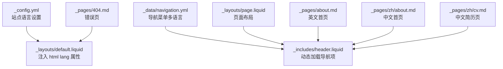
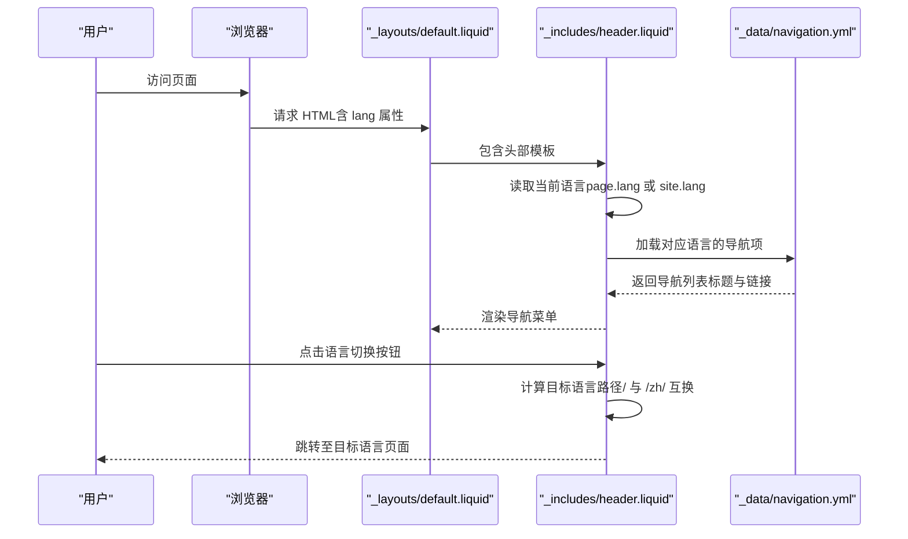
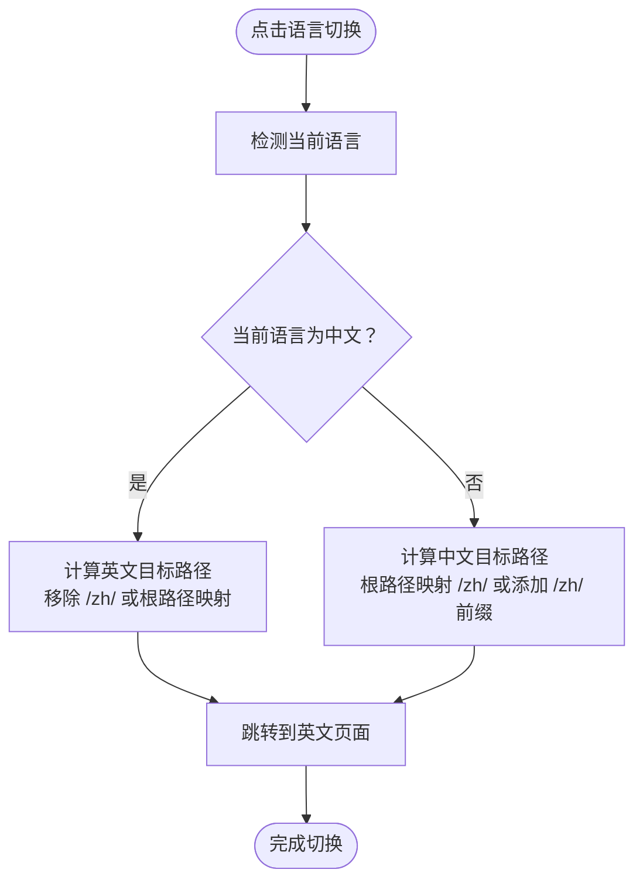
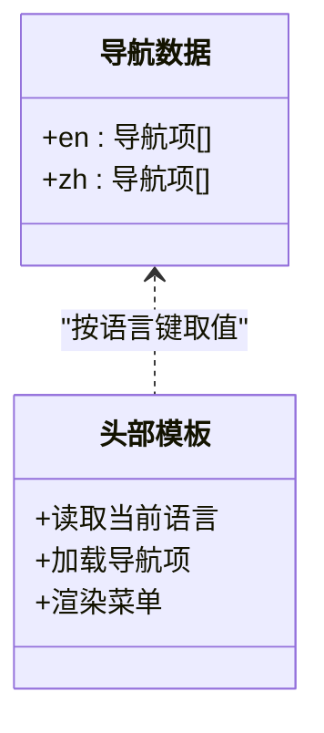
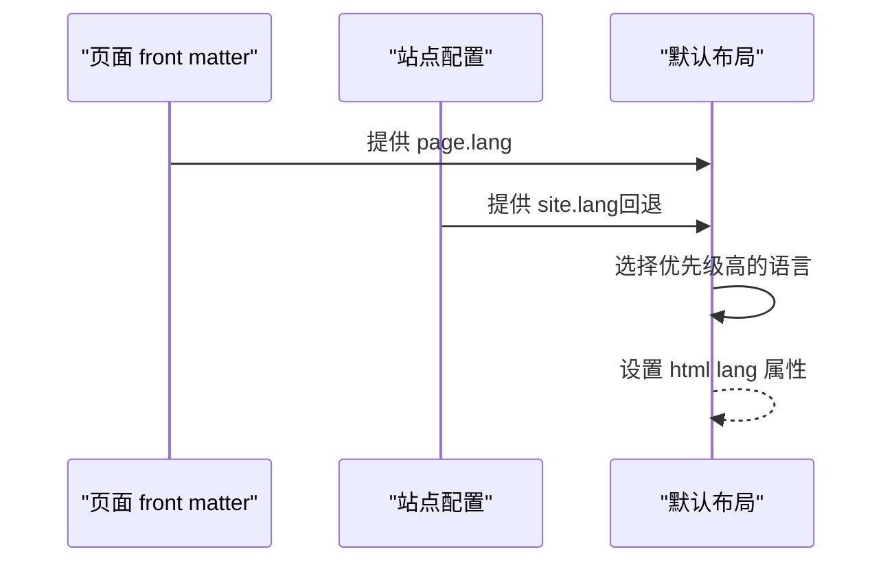
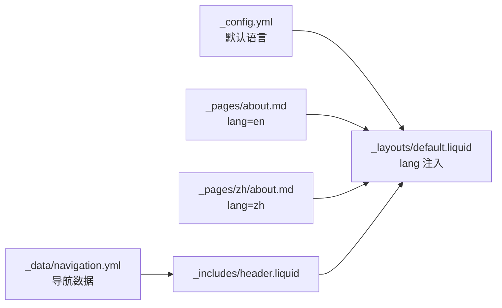

# 多语言支持系统

<cite>
**本文档引用的文件**
- [_config.yml](file://_config.yml)
- [_data/navigation.yml](file://_data/navigation.yml)
- [_layouts/default.liquid](file://_layouts/default.liquid)
- [_layouts/page.liquid](file://_layouts/page.liquid)
- [_includes/header.liquid](file://_includes/header.liquid)
- [_includes/footer.liquid](file://_includes/footer.liquid)
- [_pages/about.md](file://_pages/about.md)
- [_pages/zh/about.md](file://_pages/zh/about.md)
- [_pages/zh/cv.md](file://_pages/zh/cv.md)
- [_pages/404.md](file://_pages/404.md)
- [SEO.md](file://SEO.md)
</cite>

## 目录
1. [简介](#简介)
2. [项目结构](#项目结构)
3. [核心组件](#核心组件)
4. [架构总览](#架构总览)
5. [详细组件分析](#详细组件分析)
6. [依赖关系分析](#依赖关系分析)
7. [性能考量](#性能考量)
8. [故障排查指南](#故障排查指南)
9. [结论](#结论)
10. [附录](#附录)

## 简介
本项目基于 Jekyll 模板 al-folio 构建，实现了中英文双语网站的本地化支持。系统通过页面级语言标记、数据驱动的导航配置以及模板中的语言切换逻辑，完成从内容到导航的多语言适配。同时，系统遵循 HTML lang 属性规范，确保搜索引擎与辅助技术正确识别页面语言。

## 项目结构
围绕多语言功能的关键目录与文件如下：
- 配置层：站点全局语言设置与页面语言覆盖
- 数据层：导航菜单的多语言配置
- 布局层：页面语言属性注入与默认布局
- 模板层：头部导航中的语言切换按钮
- 页面层：各语言版本页面的独立 front matter

**图表来源**
- [_config.yml:17](file://_config.yml#L17)
- [_layouts/default.liquid:2](file://_layouts/default.liquid#L2)
- [_data/navigation.yml:1-24](file://_data/navigation.yml#L1-L24)
- [_includes/header.liquid:5-94](file://_includes/header.liquid#L5-L94)
- [_pages/about.md:7](file://_pages/about.md#L7)
- [_pages/zh/about.md:7](file://_pages/zh/about.md#L7)
- [_pages/zh/cv.md:5](file://_pages/zh/cv.md#L5)
- [_pages/404.md:4](file://_pages/404.md#L4)

**章节来源**
- [_config.yml:17](file://_config.yml#L17)
- [_data/navigation.yml:1-24](file://_data/navigation.yml#L1-L24)
- [_layouts/default.liquid:2](file://_layouts/default.liquid#L2)
- [_includes/header.liquid:5-94](file://_includes/header.liquid#L5-L94)
- [_pages/about.md:7](file://_pages/about.md#L7)
- [_pages/zh/about.md:7](file://_pages/zh/about.md#L7)
- [_pages/zh/cv.md:5](file://_pages/zh/cv.md#L5)
- [_pages/404.md:4](file://_pages/404.md#L4)

## 核心组件
- 站点语言配置：通过站点配置文件设置默认语言，作为页面未指定语言时的回退值。
- 页面语言覆盖：在页面 front matter 中使用 lang 字段覆盖默认语言，决定该页面的 HTML lang 属性与导航语言。
- 导航数据源：通过 _data/navigation.yml 提供不同语言的导航项列表，键名为语言代码（如 en、zh）。
- 动态导航渲染：头部模板根据当前语言选择对应导航项，实现标题与链接的本地化。
- 语言切换逻辑：头部模板内置语言切换按钮，依据当前路径生成目标语言的等效路径并跳转。

**章节来源**
- [_config.yml:17](file://_config.yml#L17)
- [_pages/about.md:7](file://_pages/about.md#L7)
- [_pages/zh/about.md:7](file://_pages/zh/about.md#L7)
- [_data/navigation.yml:1-24](file://_data/navigation.yml#L1-L24)
- [_includes/header.liquid:5-94](file://_includes/header.liquid#L5-L94)

## 架构总览
下图展示了从请求到页面渲染的多语言流程，包括语言检测、导航加载与语言切换：

**图表来源**
- [_layouts/default.liquid:2](file://_layouts/default.liquid#L2)
- [_includes/header.liquid:5-94](file://_includes/header.liquid#L5-L94)
- [_data/navigation.yml:1-24](file://_data/navigation.yml#L1-L24)

## 详细组件分析

### 组件A：语言切换逻辑
- 切换触发：导航栏右上角的语言切换按钮。
- 切换规则：
  - 当前语言为中文时，切换到英文：将 /zh/ 前缀移除或根路径映射到英文根路径。
  - 当前语言为英文时，切换到中文：将根路径映射到 /zh/ 或在现有路径前添加 /zh/ 前缀。
- 路径计算：通过字符串替换与路径拼接实现，保证切换后仍定位到对应语言的等效页面。

**图表来源**
- [_includes/header.liquid:80-94](file://_includes/header.liquid#L80-L94)

**章节来源**
- [_includes/header.liquid:80-94](file://_includes/header.liquid#L80-L94)

### 组件B：导航菜单适配
- 数据结构：导航配置以语言为键，值为标题与链接的数组。
- 渲染策略：头部模板按当前语言读取导航项，动态生成菜单项与活动状态。
- 本地化范围：标题文本与链接地址均随语言切换而变化。

**图表来源**
- [_data/navigation.yml:1-24](file://_data/navigation.yml#L1-L24)
- [_includes/header.liquid:47-60](file://_includes/header.liquid#L47-L60)

**章节来源**
- [_data/navigation.yml:1-24](file://_data/navigation.yml#L1-L24)
- [_includes/header.liquid:47-60](file://_includes/header.liquid#L47-L60)

### 组件C：页面语言与默认布局
- 默认语言：站点配置提供默认语言，用于未在页面中显式声明 lang 的页面。
- 语言优先级：页面 front matter 中的 lang 优先于站点默认语言。
- HTML lang 注入：默认布局根据优先级设置 html lang 属性，便于搜索引擎与可访问性工具识别。

**图表来源**
- [_pages/about.md:7](file://_pages/about.md#L7)
- [_pages/zh/about.md:7](file://_pages/zh/about.md#L7)
- [_config.yml:17](file://_config.yml#L17)
- [_layouts/default.liquid:2](file://_layouts/default.liquid#L2)

**章节来源**
- [_pages/about.md:7](file://_pages/about.md#L7)
- [_pages/zh/about.md:7](file://_pages/zh/about.md#L7)
- [_config.yml:17](file://_config.yml#L17)
- [_layouts/default.liquid:2](file://_layouts/default.liquid#L2)

### 组件D：页面翻译与内容同步
- 内容分离：英文与中文页面分别放置于不同路径（如根目录与 /zh/），避免混排。
- 等效映射：通过语言切换逻辑保持页面间的等效关系，确保用户在不同语言间平滑切换。
- 共享资源：样式、脚本与静态资源不区分语言，由同一套模板与布局统一加载。

**章节来源**
- [_pages/about.md:4](file://_pages/about.md#L4)
- [_pages/zh/about.md:4](file://_pages/zh/about.md#L4)
- [_pages/zh/cv.md:3](file://_pages/zh/cv.md#L3)

### 组件E：SEO 与多语言环境
- HTML lang 属性：默认布局注入正确的语言标识，提升搜索引擎理解。
- 结构化数据与 Open Graph：SEO 文档建议启用相关元标签与结构化数据，改善社交分享与搜索结果呈现。
- 多语言 SEO 最佳实践：建议为不同语言版本提供清晰的等价关系与语言切换提示，避免重复内容问题。

**章节来源**
- [_layouts/default.liquid:2](file://_layouts/default.liquid#L2)
- [SEO.md:72-88](file://SEO.md#L72-L88)
- [SEO.md:110-133](file://SEO.md#L110-L133)
- [SEO.md:164-177](file://SEO.md#L164-L177)

## 依赖关系分析
- 布局依赖：默认布局依赖站点配置的默认语言，用于回退。
- 模板依赖：头部模板依赖导航数据与页面语言，实现动态渲染。
- 页面依赖：各语言页面依赖自身 front matter 的语言设置与等效路径。

**图表来源**
- [_config.yml:17](file://_config.yml#L17)
- [_layouts/default.liquid:2](file://_layouts/default.liquid#L2)
- [_pages/about.md:7](file://_pages/about.md#L7)
- [_pages/zh/about.md:7](file://_pages/zh/about.md#L7)
- [_data/navigation.yml:1-24](file://_data/navigation.yml#L1-L24)
- [_includes/header.liquid:5-94](file://_includes/header.liquid#L5-L94)

**章节来源**
- [_config.yml:17](file://_config.yml#L17)
- [_layouts/default.liquid:2](file://_layouts/default.liquid#L2)
- [_pages/about.md:7](file://_pages/about.md#L7)
- [_pages/zh/about.md:7](file://_pages/zh/about.md#L7)
- [_data/navigation.yml:1-24](file://_data/navigation.yml#L1-L24)
- [_includes/header.liquid:5-94](file://_includes/header.liquid#L5-L94)

## 性能考量
- 语言切换为前端无刷新跳转，仅涉及路径计算与页面重定向，开销极低。
- 导航数据采用静态数据文件，渲染时按需读取，避免复杂计算。
- 建议保持导航项数量适中，减少 DOM 渲染压力。
- 对于大型站点，可考虑将导航数据拆分为更细粒度的片段以降低单文件体积。

## 故障排查指南
- 页面语言未生效
  - 检查页面 front matter 是否设置了 lang 字段。
  - 确认默认布局是否正确读取 page.lang 或回退到 site.lang。
  - 参考：[_layouts/default.liquid:2](file://_layouts/default.liquid#L2)
- 导航未本地化
  - 确认 _data/navigation.yml 中是否存在目标语言键。
  - 检查头部模板是否正确读取当前语言并加载导航项。
  - 参考：[_data/navigation.yml:1-24](file://_data/navigation.yml#L1-L24)，[_includes/header.liquid:5-94](file://_includes/header.liquid#L5-L94)
- 语言切换无效
  - 检查切换按钮的路径计算逻辑，确认 / 与 /zh/ 的映射规则是否符合预期。
  - 参考：[_includes/header.liquid:80-94](file://_includes/header.liquid#L80-L94)
- 错误页语言异常
  - 检查错误页 front matter 中的标题与描述是否按语言编写。
  - 参考：[_pages/404.md:4](file://_pages/404.md#L4)

**章节来源**
- [_layouts/default.liquid:2](file://_layouts/default.liquid#L2)
- [_data/navigation.yml:1-24](file://_data/navigation.yml#L1-L24)
- [_includes/header.liquid:5-94](file://_includes/header.liquid#L5-L94)
- [_pages/404.md:4](file://_pages/404.md#L4)

## 结论
本多语言系统通过“页面语言覆盖 + 数据驱动导航 + 模板动态渲染”的组合，实现了中英文双语网站的高效本地化。语言切换逻辑简洁可靠，导航菜单与页面内容按语言自动适配。配合 SEO 文档中的最佳实践，可在搜索引擎与社交平台中获得更好的展示效果。

## 附录

### 多语言配置文件结构与管理
- 站点默认语言：在站点配置中设置默认语言，作为页面未指定语言时的回退。
  - 参考：[_config.yml:17](file://_config.yml#L17)
- 页面语言覆盖：在页面 front matter 中设置 lang，决定该页面的 HTML lang 属性与导航语言。
  - 参考：[_pages/about.md:7](file://_pages/about.md#L7)，[_pages/zh/about.md:7](file://_pages/zh/about.md#L7)
- 导航本地化：在 _data/navigation.yml 中为每种语言定义导航项（标题与链接）。
  - 参考：[_data/navigation.yml:1-24](file://_data/navigation.yml#L1-L24)

### 多语言内容编写规范与最佳实践
- 文件命名与路径
  - 英文内容置于根目录，中文内容置于 /zh/ 子目录，保持清晰的等价映射。
  - 参考：[_pages/about.md:4](file://_pages/about.md#L4)，[_pages/zh/about.md:4](file://_pages/zh/about.md#L4)，[_pages/zh/cv.md:3](file://_pages/zh/cv.md#L3)
- 链接管理
  - 使用相对链接，结合语言切换逻辑确保跨语言跳转正确。
  - 参考：[_includes/header.liquid:80-94](file://_includes/header.liquid#L80-L94)
- 内容一致性
  - 同一主题的中英文版本应保持信息一致，仅在语言层面差异。
  - 参考：[_pages/about.md:32-39](file://_pages/about.md#L32-L39)，[_pages/zh/about.md:33-40](file://_pages/zh/about.md#L33-L40)

### 实际语言切换示例
- 英文首页切换到中文：将根路径 / 映射到 /zh/。
  - 参考：[_includes/header.liquid:86-94](file://_includes/header.liquid#L86-L94)
- 中文首页切换到英文：移除 /zh/ 前缀或映射到英文根路径。
  - 参考：[_includes/header.liquid:80-85](file://_includes/header.liquid#L80-L85)

### 界面定制方案
- 自定义导航项：在 _data/navigation.yml 中新增或修改语言键对应的导航项。
  - 参考：[_data/navigation.yml:1-24](file://_data/navigation.yml#L1-L24)
- 修改切换按钮文案与提示：在头部模板中调整语言切换按钮的文案与 title 属性。
  - 参考：[_includes/header.liquid:80-94](file://_includes/header.liquid#L80-L94)
- 扩展语言支持：在 _data/navigation.yml 中增加新语言键，并在页面 front matter 中设置对应 lang。
  - 参考：[_data/navigation.yml:1-24](file://_data/navigation.yml#L1-L24)，[_pages/about.md:7](file://_pages/about.md#L7)

### SEO 优化在多语言环境下的特殊考虑
- HTML lang 属性：确保每个页面的 lang 正确反映其语言。
  - 参考：[_layouts/default.liquid:2](file://_layouts/default.liquid#L2)
- Open Graph 与结构化数据：启用相关元标签与结构化数据，提升社交分享与搜索结果质量。
  - 参考：[SEO.md:110-133](file://SEO.md#L110-L133)，[SEO.md:164-177](file://SEO.md#L164-L177)
- 多语言等价关系：建议明确声明语言版本之间的等价关系，避免重复内容问题。
  - 参考：[SEO.md:72-88](file://SEO.md#L72-L88)