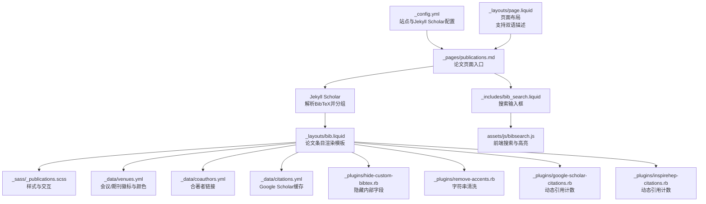
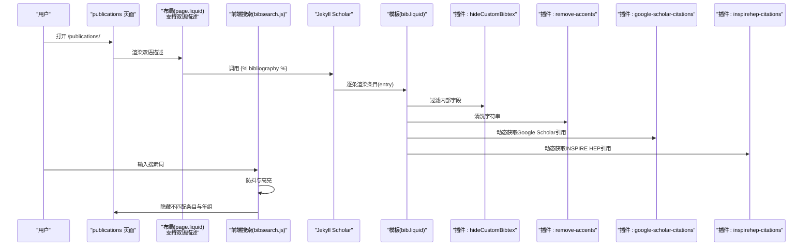
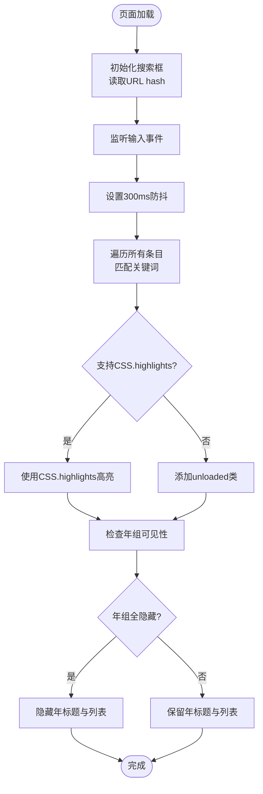
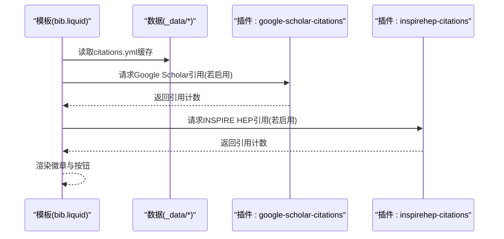
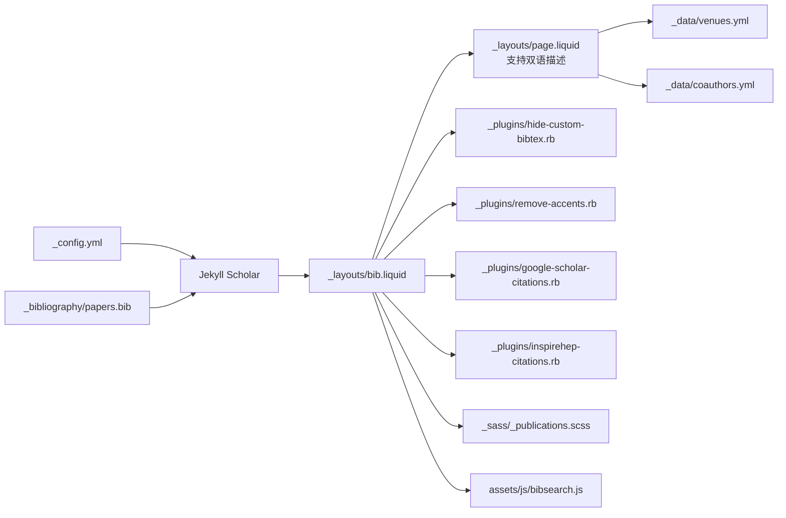

# 学术论文展示

<cite>
**本文引用的文件**
- [_config.yml](file://_config.yml)
- [_pages/publications.md](file://_pages/publications.md)
- [_layouts/bib.liquid](file://_layouts/bib.liquid)
- [_layouts/page.liquid](file://_layouts/page.liquid)
- [_includes/bib_search.liquid](file://_includes/bib_search.liquid)
- [_plugins/hide-custom-bibtex.rb](file://_plugins/hide-custom-bibtex.rb)
- [_plugins/remove-accents.rb](file://_plugins/remove-accents.rb)
- [_plugins/google-scholar-citations.rb](file://_plugins/google-scholar-citations.rb)
- [_plugins/inspirehep-citations.rb](file://_plugins/inspirehep-citations.rb)
- [_bibliography/papers.bib](file://_bibliography/papers.bib)
- [assets/js/bibsearch.js](file://assets/js/bibsearch.js)
- [_data/venues.yml](file://_data/venues.yml)
- [_data/coauthors.yml](file://_data/coauthors.yml)
- [_data/citations.yml](file://_data/citations.yml)
- [_sass/_publications.scss](file://_sass/_publications.scss)
</cite>

## 更新摘要
**变更内容**
- 更新了论文页面描述字段的双语格式，采用内联双语显示方式
- 新增了页面布局对双语描述的支持说明
- 完善了论文排序说明的国际化展示

## 目录
1. [简介](#简介)
2. [项目结构](#项目结构)
3. [核心组件](#核心组件)
4. [架构总览](#架构总览)
5. [详细组件分析](#详细组件分析)
6. [依赖关系分析](#依赖关系分析)
7. [性能考虑](#性能考虑)
8. [故障排查指南](#故障排查指南)
9. [结论](#结论)
10. [附录](#附录)

## 简介
本文件面向使用基于 Jekyll 的学术论文展示系统，聚焦"论文管理系统"的实现与使用，涵盖以下主题：
- 基于 Jekyll Scholar 的论文数据结构与分组显示
- 论文搜索功能的实现原理（关键词匹配、结果排序与过滤）
- 论文徽章系统（Altmetric、Dimensions、Google Scholar、INSPIRE-HEP）配置与使用
- 论文数据模型（BibTeX 字段）与页面生成规则
- 缩略图与作者限制等展示细节

该系统通过 Jekyll Scholar 解析 BibTeX 数据，按年份分组渲染，并提供前端搜索与高亮、徽章统计、作者链接与缩略图等增强展示能力。

**更新** 系统现已支持内联双语格式的页面描述，为用户提供更友好的国际化体验。

## 项目结构
围绕论文展示的核心目录与文件如下：
- 配置与集合
  - 站点配置：[_config.yml](file://_config.yml)
  - 论文页面：[_pages/publications.md](file://_pages/publications.md)
  - 页面布局：[_layouts/page.liquid](file://_layouts/page.liquid)
- 数据与样式
  - 论文数据源：[_bibliography/papers.bib](file://_bibliography/papers.bib)
  - 会议/期刊映射：[_data/venues.yml](file://_data/venues.yml)
  - 合著者链接：[_data/coauthors.yml](file://_data/coauthors.yml)
  - 引用缓存：[_data/citations.yml](file://_data/citations.yml)
  - 样式：[_sass/_publications.scss](file://_sass/_publications.scss)
- 模板与布局
  - 论文条目模板：[_layouts/bib.liquid](file://_layouts/bib.liquid)
  - 搜索输入片段：[_includes/bib_search.liquid](file://_includes/bib_search.liquid)
- 插件与脚本
  - 过滤自定义字段：[_plugins/hide-custom-bibtex.rb](file://_plugins/hide-custom-bibtex.rb)
  - 移除重音字符：[_plugins/remove-accents.rb](file://_plugins/remove-accents.rb)
  - Google Scholar 引用计数：[_plugins/google-scholar-citations.rb](file://_plugins/google-scholar-citations.rb)
  - INSPIRE HEP 引用计数：[_plugins/inspirehep-citations.rb](file://_plugins/inspirehep-citations.rb)
  - 前端搜索逻辑：[assets/js/bibsearch.js](file://assets/js/bibsearch.js)

**图表来源**
- [_config.yml](file://_config.yml)
- [_pages/publications.md](file://_pages/publications.md)
- [_layouts/bib.liquid](file://_layouts/bib.liquid)
- [_layouts/page.liquid](file://_layouts/page.liquid)
- [_includes/bib_search.liquid](file://_includes/bib_search.liquid)
- [assets/js/bibsearch.js](file://assets/js/bibsearch.js)
- [_data/venues.yml](file://_data/venues.yml)
- [_data/coauthors.yml](file://_data/coauthors.yml)
- [_data/citations.yml](file://_data/citations.yml)
- [_plugins/hide-custom-bibtex.rb](file://_plugins/hide-custom-bibtex.rb)
- [_plugins/remove-accents.rb](file://_plugins/remove-accents.rb)
- [_plugins/google-scholar-citations.rb](file://_plugins/google-scholar-citations.rb)
- [_plugins/inspirehep-citations.rb](file://_plugins/inspirehep-citations.rb)

**章节来源**
- [_config.yml](file://_config.yml)
- [_pages/publications.md](file://_pages/publications.md)
- [_layouts/page.liquid](file://_layouts/page.liquid)

## 核心组件
- Jekyll Scholar 配置与分组
  - 作者限制：通过 last_name、first_name 控制"自我作者"高亮与链接
  - 分组策略：group_by=year，group_order=descending
  - 数据源：source=/_bibliography/，bibliography=papers.bib
  - 渲染模板：bibliography_template=bib
  - 过滤关键字：filtered_bibtex_keywords 列表用于隐藏内部字段
- 论文条目模板（bib.liquid）
  - 缩略图与会议徽标：根据 abbr 与 venues.yml 显示徽章与颜色
  - 作者列表：支持"更多作者"展开动画与 coauthors.yml 链接
  - 徽章系统：Altmetric、Dimensions、Google Scholar、INSPIRE-HEP
  - 内部字段隐藏：通过 hideCustomBibtex 过滤器移除内部关键字
- 搜索与高亮
  - 搜索输入：在页面中插入搜索框
  - 前端逻辑：300ms 防抖；支持 CSS.highlights 或回退方案；按年组隐藏
- 页面描述与国际化
  - 内联双语格式：支持中文与英文的混合描述显示
  - 页面布局适配：_layouts/page.liquid 支持双语描述的渲染

**更新** 页面描述现采用内联双语格式，提供更好的国际化用户体验。

**章节来源**
- [_config.yml](file://_config.yml)
- [_layouts/bib.liquid](file://_layouts/bib.liquid)
- [_layouts/page.liquid](file://_layouts/page.liquid)
- [_includes/bib_search.liquid](file://_includes/bib_search.liquid)
- [assets/js/bibsearch.js](file://assets/js/bibsearch.js)
- [_data/venues.yml](file://_data/venues.yml)
- [_data/coauthors.yml](file://_data/coauthors.yml)
- [_data/citations.yml](file://_data/citations.yml)
- [_plugins/hide-custom-bibtex.rb](file://_plugins/hide-custom-bibtex.rb)

## 架构总览
下图展示了从数据到页面渲染的关键流程：Jekyll Scholar 读取 BibTeX，按年分组，调用 bib.liquid 渲染；前端搜索脚本负责实时过滤与高亮；徽章系统通过插件或外部 API 获取引用计数。

**图表来源**
- [_pages/publications.md](file://_pages/publications.md)
- [_layouts/page.liquid](file://_layouts/page.liquid)
- [assets/js/bibsearch.js](file://assets/js/bibsearch.js)
- [_layouts/bib.liquid](file://_layouts/bib.liquid)
- [_plugins/hide-custom-bibtex.rb](file://_plugins/hide-custom-bibtex.rb)
- [_plugins/remove-accents.rb](file://_plugins/remove-accents.rb)
- [_plugins/google-scholar-citations.rb](file://_plugins/google-scholar-citations.rb)
- [_plugins/inspirehep-citations.rb](file://_plugins/inspirehep-citations.rb)

## 详细组件分析

### 组件A：论文搜索与过滤（前端）
- 关键特性
  - 防抖：300ms 延迟，避免频繁 DOM 操作
  - 高亮：优先使用 CSS.highlights；否则回退为添加 unloaded 类
  - 年组联动：若某年组内无可见条目，则隐藏该年标题与列表
  - URL 同步：支持从 URL hash 初始化搜索词
- 处理流程

**图表来源**
- [assets/js/bibsearch.js](file://assets/js/bibsearch.js)

**章节来源**
- [assets/js/bibsearch.js](file://assets/js/bibsearch.js)
- [_includes/bib_search.liquid](file://_includes/bib_search.liquid)

### 组件B：论文条目渲染与徽章系统（模板层）
- 渲染要点
  - 作者限制：根据 last_name/first_name 判定"自我作者"，加粗并去除下划线
  - 合著者链接：通过 coauthors.yml 将作者名映射到外部链接
  - 会议徽标：abbr 对应 venues.yml，支持颜色与链接
  - 内部字段隐藏：通过 hideCustomBibtex 过滤 filtered_bibtex_keywords
  - 徽章系统：按配置启用 Altmetric、Dimensions、Google Scholar、INSPIRE-HEP
- 徽章工作流

**图表来源**
- [_layouts/bib.liquid](file://_layouts/bib.liquid)
- [_plugins/google-scholar-citations.rb](file://_plugins/google-scholar-citations.rb)
- [_plugins/inspirehep-citations.rb](file://_plugins/inspirehep-citations.rb)
- [_data/citations.yml](file://_data/citations.yml)

**章节来源**
- [_layouts/bib.liquid](file://_layouts/bib.liquid)
- [_data/venues.yml](file://_data/venues.yml)
- [_data/coauthors.yml](file://_data/coauthors.yml)
- [_plugins/hide-custom-bibtex.rb](file://_plugins/hide-custom-bibtex.rb)
- [_plugins/google-scholar-citations.rb](file://_plugins/google-scholar-citations.rb)
- [_plugins/inspirehep-citations.rb](file://_plugins/inspirehep-citations.rb)

### 组件C：BibTeX 数据模型与页面生成
- 数据模型（字段说明）
  - 必需字段
    - type：条目类型（如 article、inproceedings、incollection、phdthesis 等）
    - author：作者列表（支持多作者）
    - title：论文标题
    - year：发表年份
  - 常用字段
    - journal/booktitle/school：发表载体名称
    - month/location：发表月份与地点
    - note/abstract/additional_info：备注、摘要、附加信息
    - doi/arxiv/hal/html/pdf/supp/video/blog/code/poster/slides/website：各类链接
    - abbr：会议/期刊缩写，用于徽章与颜色
    - preview：缩略图路径或URL
    - selected：是否精选展示
    - bibtex_show：是否显示 BibTeX 按钮
    - google_scholar_id/inspirehep_id：用于徽章与跳转
    - altmetric/dimensions：徽章标识或ID
    - award/award_name：奖项与名称
    - annotation：工具提示注解
  - 内部字段（自动过滤）
    - abbr、abstract、additional_info、altmetric、annotation、arxiv、award、award_name、bibtex_show、blog、code、dimensions、eprint、hal、html、inspirehep_id、pdf、pmid、poster、preview、selected、slides、supp、video、website 等
- 页面生成与 URL 结构
  - 论文页面：/publications/（由 _pages/publications.md 指定）
  - 详情页：Jekyll Scholar 自动生成，details_dir=“bibliography”，details_link=“Details”
  - URL 示例：/bibliography/li2025icarm/

**章节来源**
- [_config.yml](file://_config.yml)
- [_pages/publications.md](file://_pages/publications.md)
- [_layouts/bib.liquid](file://_layouts/bib.liquid)
- [_plugins/hide-custom-bibtex.rb](file://_plugins/hide-custom-bibtex.rb)
- [_bibliography/papers.bib](file://_bibliography/papers.bib)

### 组件D：作者限制与合著者链接
- 作者限制
  - 通过 scholar.last_name 与 scholar.first_name 匹配"自我作者"，并在作者列表中高亮
- 合著者链接
  - 通过 coauthors.yml 将作者名映射到外部链接，提升协作展示体验

**章节来源**
- [_layouts/bib.liquid](file://_layouts/bib.liquid)
- [_data/coauthors.yml](file://_data/coauthors.yml)

### 组件E：缩略图与会议徽标
- 缩略图
  - 通过 preview 字段控制；启用后显示图片；支持绝对URL或相对路径
- 会议徽标
  - 通过 abbr 字段与 venues.yml 配置颜色与链接；未配置时显示默认徽章

**章节来源**
- [_layouts/bib.liquid](file://_layouts/bib.liquid)
- [_data/venues.yml](file://_data/venues.yml)

### 组件F：搜索输入与高亮样式
- 搜索输入
  - 在页面中插入搜索框，支持占位符与缓存
- 高亮样式
  - 使用 CSS.highlights 时，仅高亮匹配文本；否则通过 unloaded 类隐藏条目
  - 年组标题与列表联动隐藏，保持视觉整洁

**章节来源**
- [_includes/bib_search.liquid](file://_includes/bib_search.liquid)
- [assets/js/bibsearch.js](file://assets/js/bibsearch.js)
- [_sass/_publications.scss](file://_sass/_publications.scss)

### 组件G：页面描述与国际化支持
- 内联双语格式
  - 页面描述采用"中文/英文"的内联双语格式，提供清晰的国际化展示
  - 支持搜索引擎优化（SEO）和多语言用户访问
- 布局适配
  - _layouts/page.liquid 支持双语描述的渲染与显示
  - 保持页面布局的一致性和美观性

**更新** 新增内联双语格式支持，提升国际化用户体验。

**章节来源**
- [_pages/publications.md](file://_pages/publications.md)
- [_layouts/page.liquid](file://_layouts/page.liquid)

## 依赖关系分析
- 配置依赖
  - _config.yml 中的 scholar.*、filtered_bibtex_keywords、enable_publication_badges、enable_publication_thumbnails 等决定渲染行为
- 数据依赖
  - _bibliography/papers.bib 提供论文数据；_data/venues.yml 与 _data/coauthors.yml 提供展示增强数据
- 插件依赖
  - hideCustomBibtex 与 remove-accents 作为过滤器被模板调用
  - google-scholar-citations 与 inspirehep-citations 作为 Liquid 标签在模板中使用
- 前端依赖
  - assets/js/bibsearch.js 依赖页面结构中的 .bibliography 与 .unloaded 类
- 布局依赖
  - _layouts/page.liquid 支持双语描述的渲染与显示

**图表来源**
- [_config.yml](file://_config.yml)
- [_bibliography/papers.bib](file://_bibliography/papers.bib)
- [_layouts/bib.liquid](file://_layouts/bib.liquid)
- [_layouts/page.liquid](file://_layouts/page.liquid)
- [_data/venues.yml](file://_data/venues.yml)
- [_data/coauthors.yml](file://_data/coauthors.yml)
- [_plugins/hide-custom-bibtex.rb](file://_plugins/hide-custom-bibtex.rb)
- [_plugins/remove-accents.rb](file://_plugins/remove-accents.rb)
- [_plugins/google-scholar-citations.rb](file://_plugins/google-scholar-citations.rb)
- [_plugins/inspirehep-citations.rb](file://_plugins/inspirehep-citations.rb)
- [_sass/_publications.scss](file://_sass/_publications.scss)
- [assets/js/bibsearch.js](file://assets/js/bibsearch.js)

**章节来源**
- [_config.yml](file://_config.yml)
- [_layouts/bib.liquid](file://_layouts/bib.liquid)
- [_layouts/page.liquid](file://_layouts/page.liquid)

## 性能考虑
- 前端搜索
  - 防抖与批量 DOM 操作减少重排
  - CSS.highlights 更高效，建议现代浏览器开启
- 渲染优化
  - 作者展开动画延迟可通过 more_authors_animation_delay 调整
  - 缩略图懒加载与响应式图片可结合站点配置启用
- 引用计数
  - citations.yml 缓存减少重复抓取
  - Google Scholar 抓取带随机延时，避免触发限流
- 国际化性能
  - 内联双语格式采用静态字符串，无需额外的国际化处理开销
  - 页面描述渲染性能不受影响

## 故障排查指南
- 搜索框无效
  - 确认 _pages/publications.md 已包含搜索片段
  - 检查浏览器是否支持 CSS.highlights；否则回退逻辑会按 unloaded 类隐藏条目
- 徽章不显示
  - 检查 enable_publication_badges.* 是否启用
  - 确认条目字段（altmetric、dimensions、google_scholar_id、inspirehep_id）已正确填写
- 引用计数异常
  - Google Scholar：确认 scholar_userid 与 google_scholar_id 正确；网络问题或反爬限制可能导致失败
  - INSPIRE HEP：确认 inspirehep_id 正确；API 返回格式变化可能影响解析
- 内部字段仍可见
  - 确认 filtered_bibtex_keywords 中对应关键字已在 BibTeX 条目中出现
- 作者未高亮
  - 检查 scholar.last_name 与 scholar.first_name 是否与 BibTeX 中作者名一致（含大小写与缩写）
- 双语描述显示异常
  - 确认 _pages/publications.md 中的 description 字段采用正确的内联双语格式
  - 检查 _layouts/page.liquid 是否正确渲染双语描述

**更新** 新增双语描述相关故障排查项。

**章节来源**
- [_includes/bib_search.liquid](file://_includes/bib_search.liquid)
- [assets/js/bibsearch.js](file://assets/js/bibsearch.js)
- [_layouts/bib.liquid](file://_layouts/bib.liquid)
- [_layouts/page.liquid](file://_layouts/page.liquid)
- [_plugins/google-scholar-citations.rb](file://_plugins/google-scholar-citations.rb)
- [_plugins/inspirehep-citations.rb](file://_plugins/inspirehep-citations.rb)
- [_plugins/hide-custom-bibtex.rb](file://_plugins/hide-custom-bibtex.rb)
- [_config.yml](file://_config.yml)
- [_pages/publications.md](file://_pages/publications.md)

## 结论
本系统以 Jekyll Scholar 为核心，结合自定义模板与插件，实现了从 BibTeX 数据到论文页面的自动化渲染。前端搜索提供即时过滤与高亮，徽章系统整合外部引用数据，作者限制与合著者链接增强了个人与协作展示效果。通过合理的配置与数据模型，可快速构建专业、美观且功能完备的学术论文展示页面。

**更新** 新增的内联双语格式支持进一步提升了系统的国际化能力和用户体验，为多语言用户提供了更加友好的界面展示。

## 附录

### A. 论文搜索功能实现要点
- 关键词匹配：全文匹配条目文本（标题、作者、摘要等）
- 结果排序：按 Jekyll Scholar 默认顺序（通常为年份倒序）
- 过滤机制：隐藏不匹配条目与空年组，保持视觉连贯

**章节来源**
- [assets/js/bibsearch.js](file://assets/js/bibsearch.js)
- [_includes/bib_search.liquid](file://_includes/bib_search.liquid)

### B. 论文徽章系统配置选项
- Altmetric
  - 启用：enable_publication_badges.altmetric=true
  - 数据来源：entry.altmetric 或 arxiv/eprint/doi/pmid/isbn
- Dimensions
  - 启用：enable_publication_badges.dimensions=true
  - 数据来源：entry.dimensions 或 doi/pmid
- Google Scholar
  - 启用：enable_publication_badges.google_scholar=true
  - 数据来源：entry.google_scholar_id；模板中通过 citations.yml 缓存
- INSPIRE-HEP
  - 启用：enable_publication_badges.inspirehep=true
  - 数据来源：entry.inspirehep_id；通过插件动态获取

**章节来源**
- [_config.yml](file://_config.yml)
- [_layouts/bib.liquid](file://_layouts/bib.liquid)
- [_plugins/google-scholar-citations.rb](file://_plugins/google-scholar-citations.rb)
- [_plugins/inspirehep-citations.rb](file://_plugins/inspirehep-citations.rb)
- [_data/citations.yml](file://_data/citations.yml)

### C. 实际 BibTeX 条目示例与配置案例
- 示例条目字段
  - abbr：会议缩写（如 ICARM），用于徽章与颜色
  - bibtex_show：是否显示 BibTeX 按钮
  - selected：是否精选
  - abstract：摘要
  - google_scholar_id/inspirehep_id：用于徽章与跳转
  - preview：缩略图路径或URL
  - 其他：pdf、html、video、code、slides、website 等链接字段
- 配置案例
  - 作者限制：在 _config.yml 中设置 scholar.last_name 与 scholar.first_name
  - 缩略图开关：enable_publication_thumbnails=true
  - 内部字段过滤：filtered_bibtex_keywords 中包含不需要显示的关键字
  - 双语描述：在 _pages/publications.md 中使用内联双语格式

**更新** 新增双语描述配置示例。

**章节来源**
- [_bibliography/papers.bib](file://_bibliography/papers.bib)
- [_config.yml](file://_config.yml)
- [_pages/publications.md](file://_pages/publications.md)

### D. 论文页面自动生成与 URL 结构
- 页面入口：/publications/
- 详情页：/bibliography/{key}/（由 details_dir 与 details_link 控制）
- 年份分组：按 group_by=year 与 group_order=descending 排列
- 双语描述：支持内联双语格式的页面描述显示

**更新** 新增双语描述支持说明。

**章节来源**
- [_pages/publications.md](file://_pages/publications.md)
- [_config.yml](file://_config.yml)