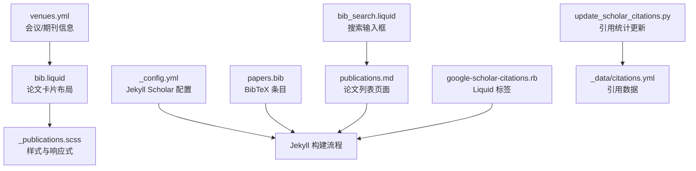
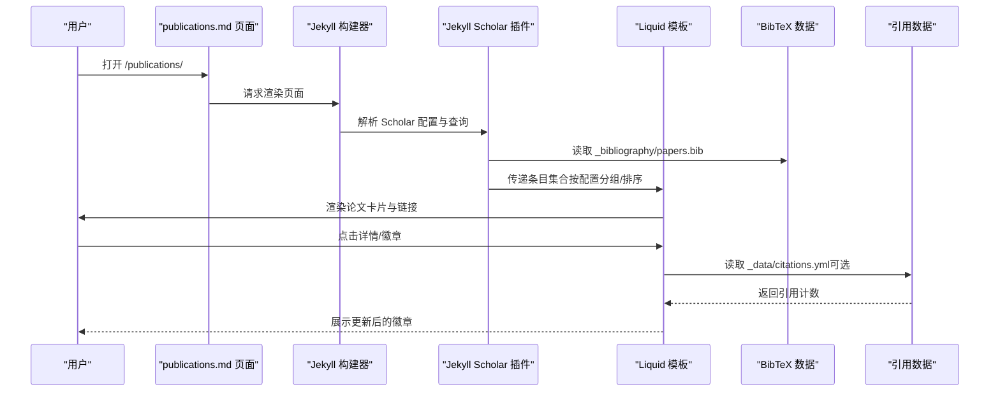
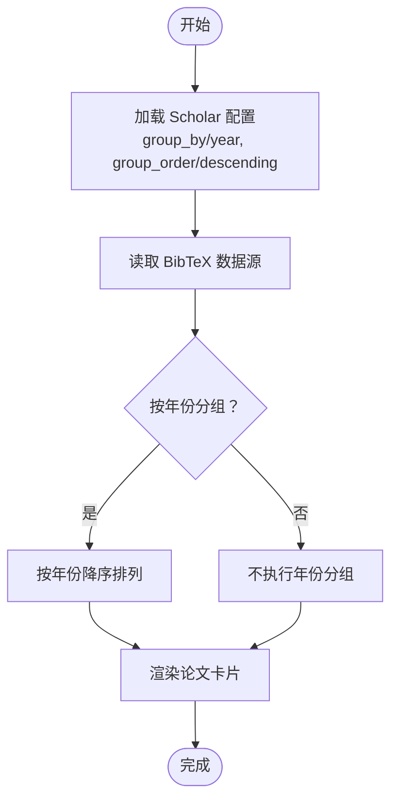
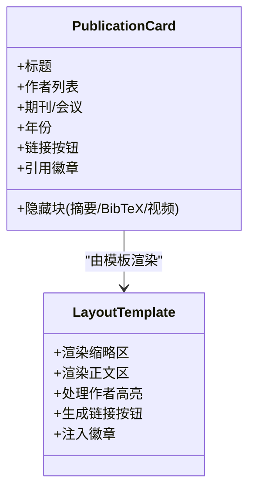
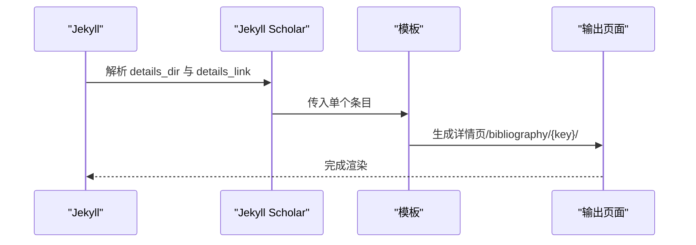
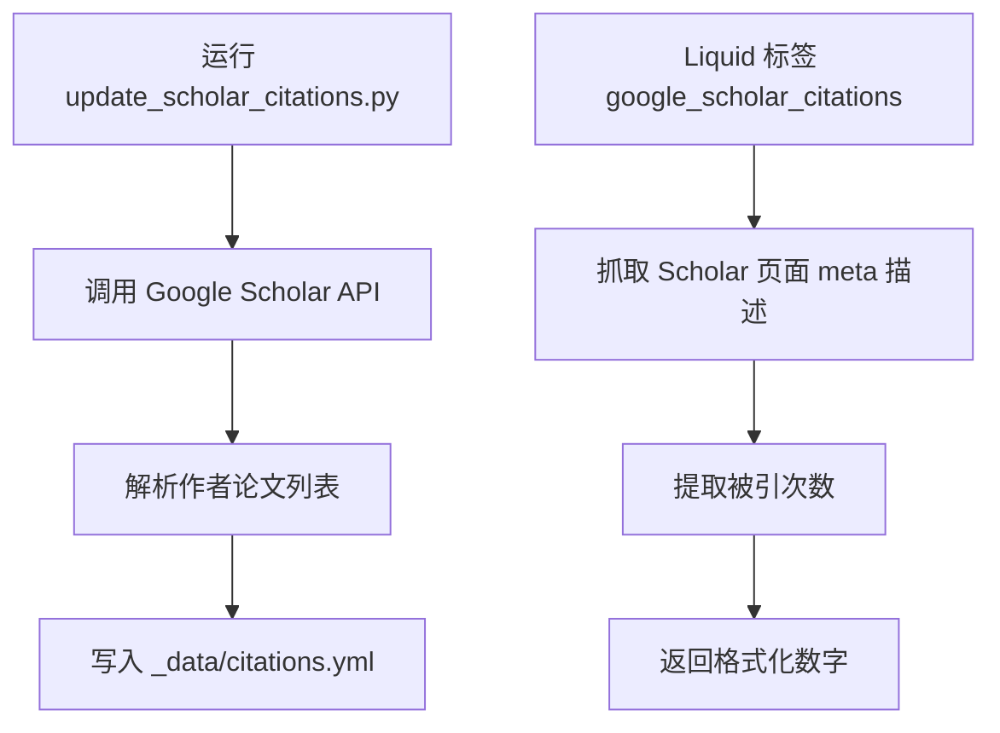
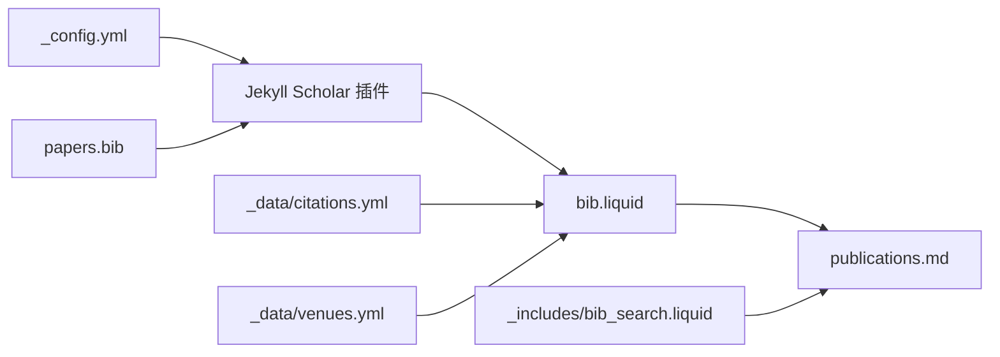

# 论文展示系统

<cite>
**本文档引用的文件**
- [_config.yml](file://_config.yml)
- [papers.bib](file://_bibliography/papers.bib)
- [bib.liquid](file://_layouts/bib.liquid)
- [publications.md](file://_pages/publications.md)
- [_publications.scss](file://_sass/_publications.scss)
- [google-scholar-citations.rb](file://_plugins/google-scholar-citations.rb)
- [update_scholar_citations.py](file://bin/update_scholar_citations.py)
- [socials.yml](file://_data/socials.yml)
- [venues.yml](file://_data/venues.yml)
- [citation.liquid](file://_includes/citation.liquid)
- [bib_search.liquid](file://_includes/bib_search.liquid)
- [_variables.scss](file://_sass/_variables.scss)
- [_layout.scss](file://_sass/_layout.scss)
</cite>

## 目录
1. [简介](#简介)
2. [项目结构](#项目结构)
3. [核心组件](#核心组件)
4. [架构总览](#架构总览)
5. [详细组件分析](#详细组件分析)
6. [依赖关系分析](#依赖关系分析)
7. [性能考虑](#性能考虑)
8. [故障排除指南](#故障排除指南)
9. [结论](#结论)

## 简介
本系统基于 Jekyll Scholar 实现论文的自动化展示与管理，涵盖论文列表生成、分组显示、详情页面、样式定制与响应式设计。通过 BibTeX 数据源与 Jekyll 的渲染能力，系统能够自动生成论文卡片、详情页链接以及搜索过滤功能，并支持多种外部引用统计徽章。

## 项目结构
系统围绕 Jekyll 的标准目录组织论文展示相关文件：
- 配置与插件：站点配置、Jekyll Scholar 设置、自定义 Liquid 标签与 Python 脚本
- 内容与数据：BibTeX 论文条目、作者与会议信息数据
- 布局与样式：论文卡片布局模板、样式表与响应式变量
- 页面与搜索：论文列表页面、搜索输入框与过滤脚本

**图表来源**
- [_config.yml:264-330](file://_config.yml#L264-L330)
- [papers.bib:1-14](file://_bibliography/papers.bib#L1-L14)
- [bib.liquid:1-396](file://_layouts/bib.liquid#L1-L396)
- [_publications.scss:1-189](file://_sass/_publications.scss#L1-L189)
- [publications.md:1-22](file://_pages/publications.md#L1-L22)
- [google-scholar-citations.rb:1-87](file://_plugins/google-scholar-citations.rb#L1-L87)
- [update_scholar_citations.py:1-133](file://bin/update_scholar_citations.py#L1-L133)
- [venues.yml:1-10](file://_data/venues.yml#L1-L10)
- [bib_search.liquid:1-5](file://_includes/bib_search.liquid#L1-L5)

**章节来源**
- [_config.yml:264-330](file://_config.yml#L264-L330)
- [publications.md:1-22](file://_pages/publications.md#L1-L22)

## 核心组件
- Jekyll Scholar 配置与渲染
  - 通过配置项指定作者名、样式、BibTeX 源、分组策略与详情页生成规则
  - 支持按年份分组、降序排列，以及按类型分组（需在归档配置中启用）
- 论文卡片布局
  - 使用 Liquid 模板渲染标题、作者、期刊/会议、年份、链接按钮与徽章
  - 支持作者高亮、作者注释、缩略图与预览图
- 引用统计与外部徽章
  - Liquid 标签抓取 Google Scholar 引用量
  - Python 脚本批量拉取并缓存引用数据，供布局模板使用
- 搜索与过滤
  - 页面内嵌搜索输入框，结合 JavaScript 实现实时过滤
- 样式与响应式
  - SCSS 变量控制主题色与最大宽度
  - 发布页样式定义卡片布局、按钮与徽章外观
  - 布局层设置容器最大宽度与滚动偏移

**章节来源**
- [_config.yml:264-330](file://_config.yml#L264-L330)
- [bib.liquid:1-396](file://_layouts/bib.liquid#L1-L396)
- [google-scholar-citations.rb:1-87](file://_plugins/google-scholar-citations.rb#L1-L87)
- [update_scholar_citations.py:1-133](file://bin/update_scholar_citations.py#L1-L133)
- [bib_search.liquid:1-5](file://_includes/bib_search.liquid#L1-L5)
- [_publications.scss:1-189](file://_sass/_publications.scss#L1-L189)
- [_layout.scss:32-34](file://_sass/_layout.scss#L32-L34)

## 架构总览
系统采用“配置驱动 + 模板渲染 + 外部数据”的架构：
- 配置驱动：Jekyll Scholar 在构建时读取配置，决定分组、排序与详情页生成
- 模板渲染：Liquid 模板将 BibTeX 条目转换为论文卡片与详情链接
- 外部数据：引用统计通过 Ruby 或 Python 流程注入到数据文件，再由模板消费

**图表来源**
- [_config.yml:264-330](file://_config.yml#L264-L330)
- [publications.md:1-22](file://_pages/publications.md#L1-L22)
- [papers.bib:1-14](file://_bibliography/papers.bib#L1-L14)
- [bib.liquid:1-396](file://_layouts/bib.liquid#L1-L396)
- [update_scholar_citations.py:1-133](file://bin/update_scholar_citations.py#L1-L133)

## 详细组件分析

### 论文页面 URL 结构与路由规则
- 列表页面
  - 路径：/publications/
  - 作用：展示所有论文，按配置进行分组与排序
- 详情页面
  - 由 Jekyll Scholar 的 details_dir 与 details_link 控制，默认生成至 /bibliography/{key}/
  - 详情页标题与元信息来自 BibTeX 条目，页面布局由模板决定
- 归档与分类
  - 通过 jekyll-archives 配置可启用按年/标签/分类归档，生成 /blog/:year/... 等路径
  - 论文归档需在相应集合或 Scholar 查询中启用

**章节来源**
- [_config.yml:282-283](file://_config.yml#L282-L283)
- [publications.md:1-22](file://_pages/publications.md#L1-L22)

### 论文分组显示机制
- 分组键
  - group_by: year（按年份分组）
  - group_order: descending（降序）
- 类型分组
  - 可通过查询参数与归档配置实现按类型分组（例如会议/期刊）
- 查询与过滤
  - query: "@*"（默认查询全部条目）
  - 可在页面中使用 --group_by none 或自定义查询实现不同视图

**图表来源**
- [_config.yml:286-287](file://_config.yml#L286-L287)
- [publications.md:19-19](file://_pages/publications.md#L19-L19)

**章节来源**
- [_config.yml:286-287](file://_config.yml#L286-L287)
- [publications.md:19-19](file://_pages/publications.md#L19-L19)

### 论文卡片设计与布局
- 布局结构
  - 左侧缩略区：会议缩写徽章、预览图（可选）
  - 右侧正文区：标题、作者列表（支持自我高亮与协作者链接）、期刊/会议信息、年份、附加信息、链接按钮、徽章、隐藏块（摘要/BibTeX/视频）
- 元素排列
  - 标题：加粗显示
  - 作者：多于限制数量时显示“更多作者”动画展开
  - 期刊/会议：根据条目类型动态生成
  - 链接按钮：按字段存在性显示（DOI/arXiv/HAL/HTML/PDF/Supp/Video/Blog/Code/Poster/Slides/Website）
  - 徽章：Altmetric/Dimensions/Google Scholar/InspireHEP（可配置开关）
- 交互行为
  - 抽屉式展开/收起（摘要/BibTeX/视频）
  - 更多作者点击动画效果

**图表来源**
- [bib.liquid:1-396](file://_layouts/bib.liquid#L1-L396)

**章节来源**
- [bib.liquid:1-396](file://_layouts/bib.liquid#L1-L396)

### 论文详情页面生成逻辑
- 生成位置
  - details_dir: bibliography（默认）
  - 详情页 URL：/bibliography/{entry.key}/
- 内容组织
  - 标题、作者、期刊/会议、年份、摘要、BibTeX、链接按钮、徽章等
  - 可选：视频嵌入（当启用）与打印友好隐藏块
- 自定义钩子
  - 可在 _includes/hook/bib.liquid 中插入额外内容

**图表来源**
- [_config.yml:282-283](file://_config.yml#L282-L283)
- [bib.liquid:177-180](file://_layouts/bib.liquid#L177-L180)

**章节来源**
- [_config.yml:282-283](file://_config.yml#L282-L283)
- [bib.liquid:177-180](file://_layouts/bib.liquid#L177-L180)

### 引用统计与外部徽章
- Liquid 标签
  - google_scholar_citations：解析 Google Scholar 页面 meta 描述中的“被引次数”，带缓存与异常处理
- Python 脚本
  - 从 Google Scholar API 拉取作者论文列表，写入 _data/citations.yml，每日去重更新
- 模板消费
  - 通过 site.data.citations.papers 读取引用计数，生成徽章或链接

**图表来源**
- [update_scholar_citations.py:1-133](file://bin/update_scholar_citations.py#L1-L133)
- [google-scholar-citations.rb:1-87](file://_plugins/google-scholar-citations.rb#L1-L87)

**章节来源**
- [google-scholar-citations.rb:1-87](file://_plugins/google-scholar-citations.rb#L1-L87)
- [update_scholar_citations.py:1-133](file://bin/update_scholar_citations.py#L1-L133)

### 搜索与过滤
- 页面集成
  - 在论文页面中包含搜索输入框，加载搜索脚本
- 过滤机制
  - 输入文本实时匹配论文标题、作者、期刊等字段，动态显示/隐藏卡片
- 适用范围
  - 支持论文搜索与结果高亮（由搜索脚本负责）

**章节来源**
- [bib_search.liquid:1-5](file://_includes/bib_search.liquid#L1-L5)
- [publications.md:13-15](file://_pages/publications.md#L13-L15)

### 样式定制与 CSS 覆盖
- 主题变量
  - SCSS 变量控制主题色、背景色、字体颜色与最大内容宽度
- 发布页样式
  - 卡片标题、作者链接、按钮悬停效果、徽章布局、隐藏块展开动画
- 覆盖建议
  - 修改 _sass/_variables.scss 调整全局主题
  - 在 _sass/_publications.scss 中调整卡片间距、按钮尺寸与徽章样式
  - 通过自定义 CSS 文件覆盖特定选择器，避免直接修改主题源码

**章节来源**
- [_variables.scss:1-53](file://_sass/_variables.scss#L1-L53)
- [_publications.scss:1-189](file://_sass/_publications.scss#L1-L189)
- [_layout.scss:32-34](file://_sass/_layout.scss#L32-L34)

### 响应式设计与移动端适配
- 容器与网格
  - 容器最大宽度由变量控制；卡片布局基于 Bootstrap 网格系统
- 视觉反馈
  - 按钮悬停、作者链接下划线变化、徽章悬停下划线
- 移动端优化
  - 使用相对单位与弹性布局，确保在小屏设备上可滚动阅读
  - 图片懒加载与缩略图适配（由配置与模板共同保证）

**章节来源**
- [_layout.scss:32-34](file://_sass/_layout.scss#L32-L34)
- [_publications.scss:101-119](file://_sass/_publications.scss#L101-L119)

## 依赖关系分析
- 配置依赖
  - Jekyll Scholar 依赖 _config.yml 中的 scholar 段落与插件列表
- 数据依赖
  - BibTeX 条目依赖 _bibliography/papers.bib
  - 引用数据依赖 _data/citations.yml（由 Python 脚本生成）
  - 会议/期刊信息依赖 _data/venues.yml
- 模板依赖
  - 论文卡片依赖 _layouts/bib.liquid
  - 页面入口依赖 _pages/publications.md
  - 搜索依赖 _includes/bib_search.liquid

**图表来源**
- [_config.yml:196-218](file://_config.yml#L196-L218)
- [papers.bib:1-14](file://_bibliography/papers.bib#L1-L14)
- [bib.liquid:1-396](file://_layouts/bib.liquid#L1-L396)
- [publications.md:1-22](file://_pages/publications.md#L1-L22)
- [update_scholar_citations.py:1-133](file://bin/update_scholar_citations.py#L1-L133)
- [venues.yml:1-10](file://_data/venues.yml#L1-L10)
- [bib_search.liquid:1-5](file://_includes/bib_search.liquid#L1-L5)

**章节来源**
- [_config.yml:196-218](file://_config.yml#L196-L218)
- [papers.bib:1-14](file://_bibliography/papers.bib#L1-L14)
- [bib.liquid:1-396](file://_layouts/bib.liquid#L1-L396)
- [publications.md:1-22](file://_pages/publications.md#L1-L22)

## 性能考虑
- 引用抓取
  - Ruby 标签已内置随机延时与缓存，避免频繁请求被限流
  - Python 脚本每日仅在数据变更时更新文件，减少 I/O
- 渲染优化
  - 使用压缩样式与最小化资源，减少页面体积
  - 启用图片懒加载与响应式 WebP（如已配置），提升首屏性能
- 搜索性能
  - 前端搜索基于 DOM 过滤，适合中小规模论文集；大规模数据建议服务端筛选

## 故障排除指南
- 引用统计未显示
  - 确认 _data/socials.yml 中包含有效的 Google Scholar 用户 ID
  - 运行 Python 脚本更新 _data/citations.yml 并检查网络连接
- Scholar 引用抓取失败
  - 检查 Ruby 标签日志输出，确认文章 ID 与用户 ID 正确
  - 若出现异常，查看错误信息并重试
- 论文未按预期分组
  - 检查 _config.yml 中 group_by 与 group_order 设置
  - 确认 BibTeX 条目包含 year 字段
- 详情页链接无效
  - 确认 details_dir 与 details_link 设置正确
  - 检查条目 key 是否规范

**章节来源**
- [update_scholar_citations.py:1-133](file://bin/update_scholar_citations.py#L1-L133)
- [google-scholar-citations.rb:1-87](file://_plugins/google-scholar-citations.rb#L1-L87)
- [_config.yml:282-283](file://_config.yml#L282-L283)

## 结论
该论文展示系统以 Jekyll Scholar 为核心，结合 Liquid 模板与外部数据，实现了论文的自动化生成、分组展示与详情页链接。通过合理的配置与样式定制，可在保持良好可读性的基础上实现丰富的交互与美观的视觉呈现。建议在团队协作中统一维护 BibTeX 条目与引用数据，定期更新引用统计，以确保展示内容的时效性与准确性。