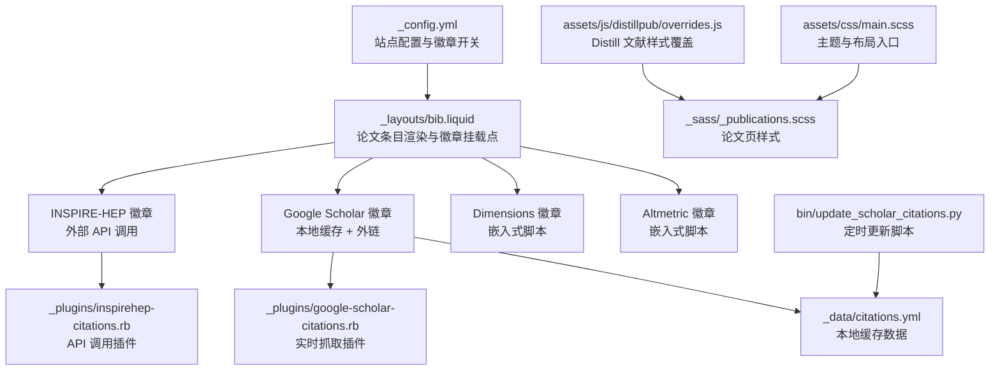
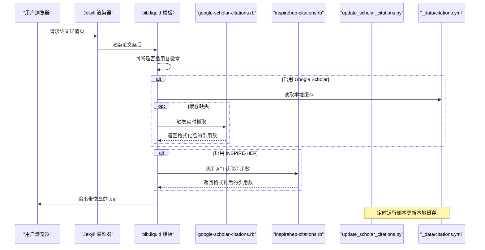
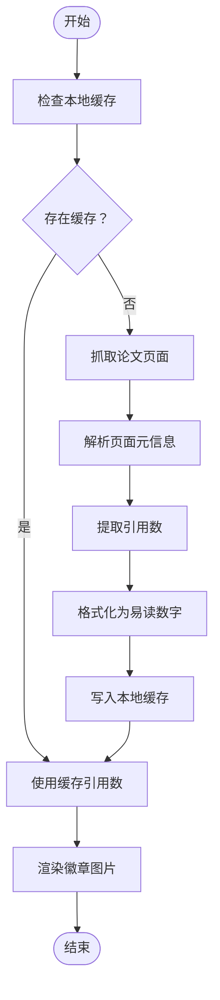
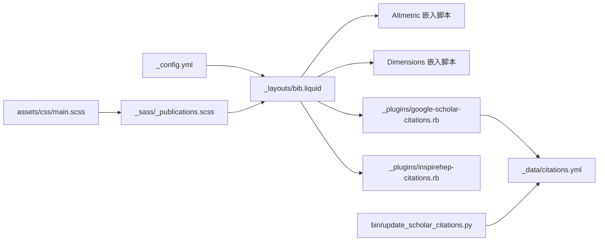

# 论文徽章系统

<cite>
**本文档引用的文件**
- [_config.yml](file://_config.yml)
- [_layouts/bib.liquid](file://_layouts/bib.liquid)
- [_sass/_publications.scss](file://_sass/_publications.scss)
- [_data/citations.yml](file://_data/citations.yml)
- [_data/socials.yml](file://_data/socials.yml)
- [_plugins/google-scholar-citations.rb](file://_plugins/google-scholar-citations.rb)
- [_plugins/inspirehep-citations.rb](file://_plugins/inspirehep-citations.rb)
- [bin/update_scholar_citations.py](file://bin/update_scholar_citations.py)
- [assets/css/main.scss](file://assets/css/main.scss)
- [assets/js/distillpub/overrides.js](file://assets/js/distillpub/overrides.js)
</cite>

## 目录
1. [简介](#简介)
2. [项目结构](#项目结构)
3. [核心组件](#核心组件)
4. [架构总览](#架构总览)
5. [详细组件分析](#详细组件分析)
6. [依赖关系分析](#依赖关系分析)
7. [性能考量](#性能考量)
8. [故障排除指南](#故障排除指南)
9. [结论](#结论)
10. [附录](#附录)

## 简介
本文件面向“论文徽章系统”，系统性梳理并说明以下四种论文统计徽章的功能与配置：
- Altmetric 徽章：用于展示研究影响力指标（如社交媒体提及、新闻报道等）
- Dimensions 徽章：用于展示学术指标追踪（如论文被引、Altmetric 分数等）
- Google Scholar 徽章：用于展示引用统计（本地缓存 + 实时抓取）
- INSPIRE-HEP 徽章：用于展示高能物理领域的引用统计（通过 API 获取）

文档涵盖：
- 各徽章的启用配置与自定义选项
- 徽章在页面中的显示位置
- 数据获取机制与更新频率
- 样式定制方法与 CSS 覆盖技巧
- 链接跳转逻辑与目标页面配置
- 不同徽章之间的数据关联与交叉引用思路

## 项目结构
该系统围绕 Jekyll 模板与 Liquid 渲染引擎构建，结合 Ruby 插件与 Python 脚本实现动态数据抓取与缓存。

**图表来源**
- [_config.yml](file://_config.yml)
- [_layouts/bib.liquid](file://_layouts/bib.liquid)
- [_data/citations.yml](file://_data/citations.yml)
- [_plugins/google-scholar-citations.rb](file://_plugins/google-scholar-citations.rb)
- [_plugins/inspirehep-citations.rb](file://_plugins/inspirehep-citations.rb)
- [bin/update_scholar_citations.py](file://bin/update_scholar_citations.py)
- [assets/css/main.scss](file://assets/css/main.scss)
- [assets/js/distillpub/overrides.js](file://assets/js/distillpub/overrides.js)

**章节来源**
- [_config.yml](file://_config.yml)
- [_layouts/bib.liquid](file://_layouts/bib.liquid)
- [assets/css/main.scss](file://assets/css/main.scss)

## 核心组件
- 站点配置与开关
  - 在站点配置中开启/关闭各类徽章，并设置 Dimensions 的最大宽度等主题参数。
- 论文条目模板
  - 在论文条目渲染模板中按条件插入徽章，支持多种标识符（如 altmetric ID、arXiv、DOI、PMID、ISBN 等）作为数据源。
- 数据缓存与抓取
  - Google Scholar 引用通过本地缓存与 Ruby 插件抓取；INSPIRE-HEP 引用通过 Ruby 插件调用 API 获取。
- 样式与主题
  - 通过 SCSS 主入口加载论文页样式，支持主题变量与徽章区域的统一风格控制。

**章节来源**
- [_config.yml](file://_config.yml)
- [_layouts/bib.liquid](file://_layouts/bib.liquid)
- [_sass/_publications.scss](file://_sass/_publications.scss)

## 架构总览
系统采用“配置驱动 + 模板渲染 + 插件抓取 + 缓存存储”的分层架构。页面渲染时根据配置决定是否显示徽章；徽章的数据来源分为两类：
- 本地缓存：Google Scholar 引用计数写入 YAML 文件，模板直接读取。
- 外部服务：Altmetric/Dimensions 通过嵌入脚本或外链展示；INSPIRE-HEP 通过 Ruby 插件调用 API 并格式化显示。

**图表来源**
- [_layouts/bib.liquid](file://_layouts/bib.liquid)
- [_plugins/google-scholar-citations.rb](file://_plugins/google-scholar-citations.rb)
- [_plugins/inspirehep-citations.rb](file://_plugins/inspirehep-citations.rb)
- [bin/update_scholar_citations.py](file://bin/update_scholar_citations.py)
- [_data/citations.yml](file://_data/citations.yml)

## 详细组件分析

### Altmetric 徽章
- 功能概述
  - 展示论文在社交媒体、新闻媒体等渠道的综合影响力指标。
- 启用与自定义
  - 在站点配置中启用后，模板会根据条目提供的 altmetric 标识符自动选择数据源（优先使用显式 altmetric ID，其次 arXiv/eprint/DOI/PMID/ISBN）。
- 显示位置
  - 插入在论文条目下方的徽章容器内，紧邻其他徽章。
- 数据来源与更新
  - 通过嵌入脚本加载，无需本地缓存；数据由外部服务提供。
- 样式与交互
  - 支持弹出提示与气泡展示，可调整方向与尺寸。

**章节来源**
- [_config.yml](file://_config.yml)
- [_layouts/bib.liquid](file://_layouts/bib.liquid)

### Dimensions 徽章
- 功能概述
  - 展示论文的学术指标，如被引次数、Altmetric 分数等。
- 启用与自定义
  - 在站点配置中启用后，模板会根据条目提供的 dimensions 标识符选择数据源（优先显式 ID，其次 DOI，否则 PMID）。
- 显示位置
  - 插入在论文条目下方的徽章容器内。
- 数据来源与更新
  - 通过嵌入脚本加载，无需本地缓存；数据由外部服务提供。
- 样式与交互
  - 可配置样式与图例显示方式。

**章节来源**
- [_config.yml](file://_config.yml)
- [_layouts/bib.liquid](file://_layouts/bib.liquid)

### Google Scholar 徽章
- 功能概述
  - 展示论文在 Google Scholar 中的引用次数，通过本地缓存与实时抓取相结合的方式提供。
- 启用与自定义
  - 在站点配置中启用后，模板会尝试从本地缓存读取引用数；若未命中，则通过 Ruby 插件进行抓取并格式化。
- 显示位置
  - 插入在论文条目下方的徽章容器内，点击后跳转至对应学者的论文条目页面。
- 数据来源与更新
  - 本地缓存：由 Python 脚本定期拉取并写入 YAML 文件。
  - 实时抓取：Ruby 插件解析 Google Scholar 页面元信息提取引用数。
- 样式与交互
  - 使用徽章图片形式展示，支持悬停提示与链接跳转。

**图表来源**
- [_plugins/google-scholar-citations.rb](file://_plugins/google-scholar-citations.rb)
- [_data/citations.yml](file://_data/citations.yml)

**章节来源**
- [_config.yml](file://_config.yml)
- [_layouts/bib.liquid](file://_layouts/bib.liquid)
- [_plugins/google-scholar-citations.rb](file://_plugins/google-scholar-citations.rb)
- [bin/update_scholar_citations.py](file://bin/update_scholar_citations.py)
- [_data/citations.yml](file://_data/citations.yml)

### INSPIRE-HEP 徽章
- 功能概述
  - 展示高能物理领域论文的引用统计，来源于 INSPIRE-HEP 的 API。
- 启用与自定义
  - 在站点配置中启用后，模板通过 Liquid 标签调用 Ruby 插件获取引用数并格式化显示。
- 显示位置
  - 插入在论文条目下方的徽章容器内，点击后跳转至 INSPIRE-HEP 对应条目页面。
- 数据来源与更新
  - 通过 Ruby 插件调用 API 获取最新引用数，返回前进行格式化处理。
- 样式与交互
  - 使用徽章图片形式展示，支持悬停提示与链接跳转。

**章节来源**
- [_config.yml](file://_config.yml)
- [_layouts/bib.liquid](file://_layouts/bib.liquid)
- [_plugins/inspirehep-citations.rb](file://_plugins/inspirehep-citations.rb)

## 依赖关系分析
- 配置依赖
  - 站点配置决定是否启用各徽章及默认显示行为。
- 模板依赖
  - 论文条目模板负责条件判断与徽章挂载，依赖数据缓存与插件输出。
- 数据依赖
  - Google Scholar 引用依赖本地缓存与 Ruby 插件；INSPIRE-HEP 引用依赖 Ruby 插件与 API。
- 样式依赖
  - 论文页样式统一管理徽章区域的排版与交互效果。

**图表来源**
- [_config.yml](file://_config.yml)
- [_layouts/bib.liquid](file://_layouts/bib.liquid)
- [_plugins/google-scholar-citations.rb](file://_plugins/google-scholar-citations.rb)
- [_plugins/inspirehep-citations.rb](file://_plugins/inspirehep-citations.rb)
- [_data/citations.yml](file://_data/citations.yml)
- [bin/update_scholar_citations.py](file://bin/update_scholar_citations.py)
- [assets/css/main.scss](file://assets/css/main.scss)
- [_sass/_publications.scss](file://_sass/_publications.scss)

**章节来源**
- [_config.yml](file://_config.yml)
- [_layouts/bib.liquid](file://_layouts/bib.liquid)
- [_sass/_publications.scss](file://_sass/_publications.scss)

## 性能考量
- 缓存策略
  - Google Scholar 引用通过本地缓存减少重复抓取，提升页面加载速度。
- 抓取节流
  - Ruby 插件在抓取前引入随机延时，避免触发反爬限制。
- 外链与嵌入脚本
  - Altmetric/Dimensions 通过嵌入脚本加载，减轻服务器压力；INSPIRE-HEP 通过 API 获取，避免频繁抓取。
- 样式优化
  - 统一的 SCSS 主入口与局部模块化，便于维护与压缩。

[本节为通用指导，不涉及具体文件分析]

## 故障排除指南
- Google Scholar 引用数显示为 N/A
  - 检查本地缓存是否存在对应条目；确认 Ruby 插件是否成功解析页面元信息；查看控制台错误日志。
- INSPIRE-HEP 引用数显示异常
  - 检查插件返回的 JSON 结构是否符合预期；确认 API 地址与字段映射正确。
- 徽章未显示
  - 确认站点配置已启用相应徽章；检查条目是否提供了有效的标识符（如 altmetric ID、arXiv、DOI、PMID、ISBN、google_scholar_id、inspirehep_id）。
- 页面样式异常
  - 检查论文页样式模块是否正确加载；确认主题变量与徽章区域的样式规则未被覆盖。

**章节来源**
- [_plugins/google-scholar-citations.rb](file://_plugins/google-scholar-citations.rb)
- [_plugins/inspirehep-citations.rb](file://_plugins/inspirehep-citations.rb)
- [_layouts/bib.liquid](file://_layouts/bib.liquid)
- [_sass/_publications.scss](file://_sass/_publications.scss)

## 结论
该论文徽章系统通过配置驱动与模板渲染实现了对四种主流学术指标的可视化展示。系统在保证数据准确性的同时，兼顾了性能与可维护性：本地缓存与插件抓取相结合，嵌入脚本与 API 调用相辅相成。通过合理的样式与交互设计，用户可以直观地了解论文的影响力与引用情况。

[本节为总结性内容，不涉及具体文件分析]

## 附录

### 启用与配置清单
- 启用徽章
  - 在站点配置中设置各徽章开关与默认行为。
- 自定义数据源
  - 在论文条目中提供 altmetric、dimensions、google_scholar_id、inspirehep_id 等标识符以指定数据源。
- 样式定制
  - 通过论文页样式模块统一管理徽章区域的排版与交互效果。

**章节来源**
- [_config.yml](file://_config.yml)
- [_layouts/bib.liquid](file://_layouts/bib.liquid)
- [_sass/_publications.scss](file://_sass/_publications.scss)

### 数据获取与更新流程
- Google Scholar
  - 定时脚本拉取并写入缓存；模板优先读取缓存，失败时触发实时抓取。
- INSPIRE-HEP
  - 模板通过 Liquid 标签调用 Ruby 插件，插件调用 API 获取并格式化引用数。
- Altmetric/Dimensions
  - 通过嵌入脚本加载外部服务数据。

**章节来源**
- [bin/update_scholar_citations.py](file://bin/update_scholar_citations.py)
- [_plugins/google-scholar-citations.rb](file://_plugins/google-scholar-citations.rb)
- [_plugins/inspirehep-citations.rb](file://_plugins/inspirehep-citations.rb)
- [_layouts/bib.liquid](file://_layouts/bib.liquid)