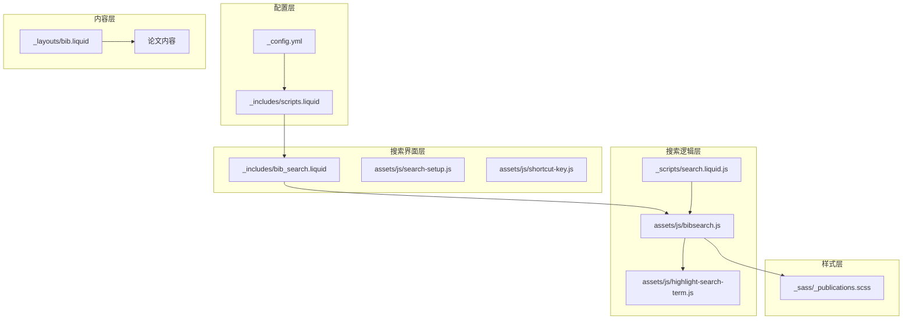
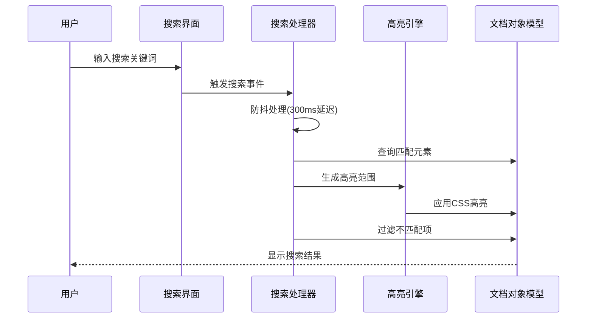
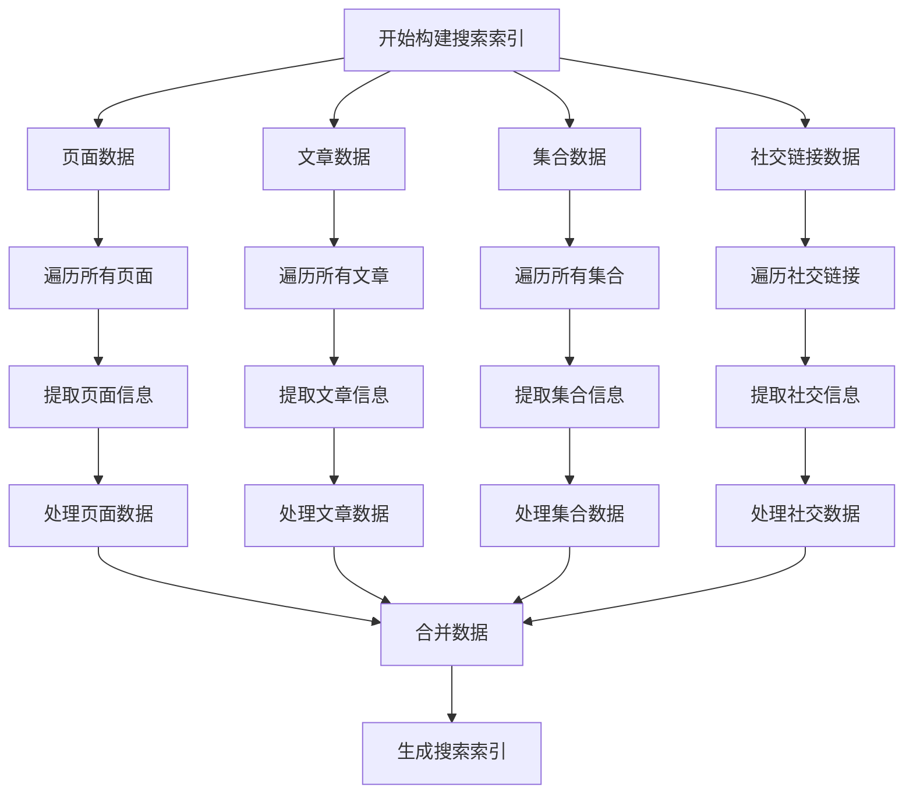
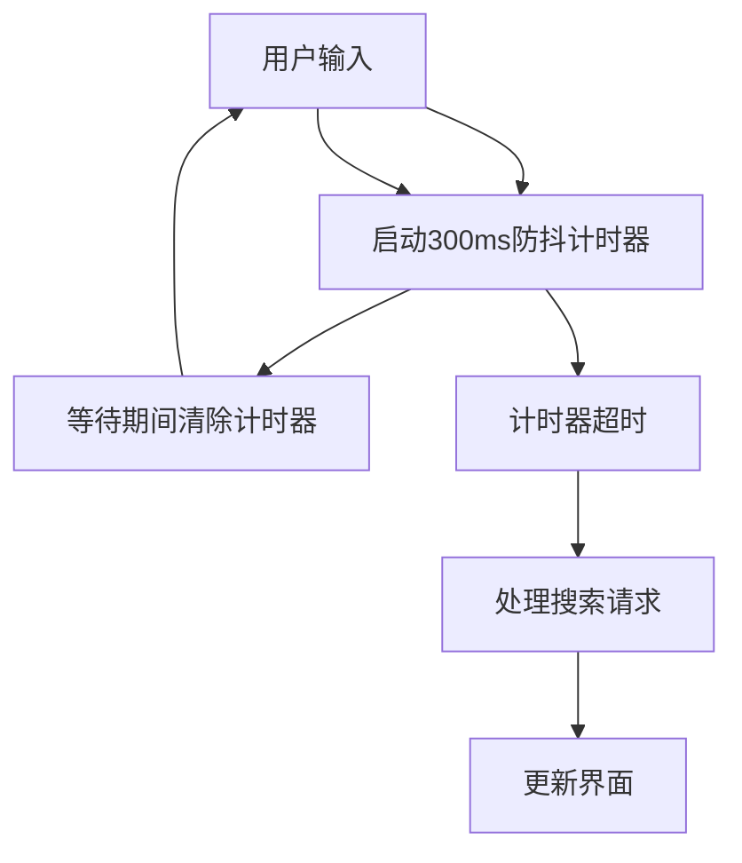
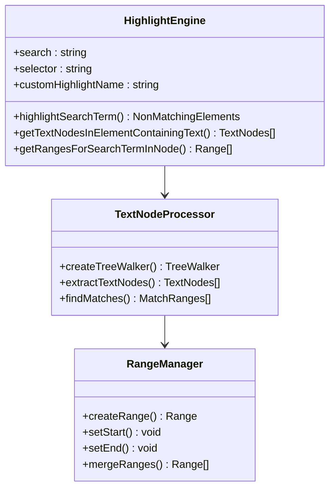
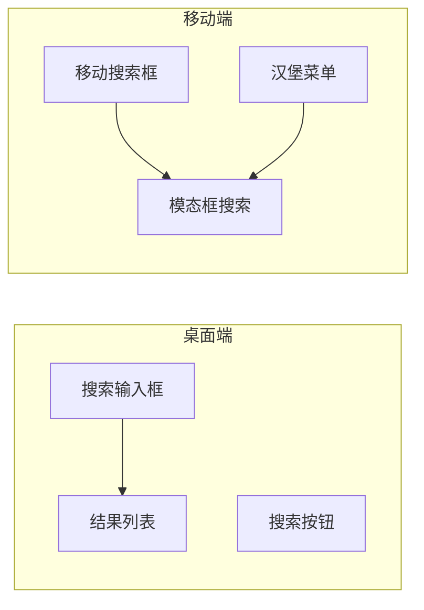
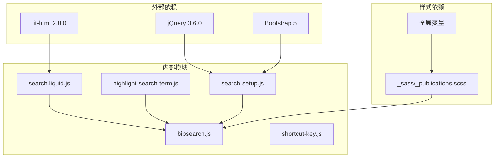
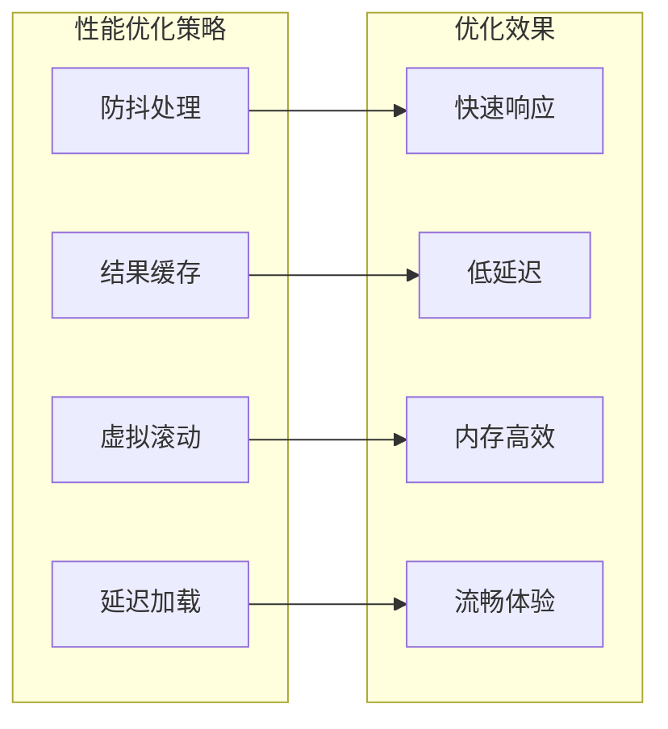

# 论文搜索系统

<cite>
**本文档引用的文件**
- [search.liquid.js](file://_scripts/search.liquid.js)
- [bibsearch.js](file://assets/js/bibsearch.js)
- [highlight-search-term.js](file://assets/js/highlight-search-term.js)
- [search-setup.js](file://assets/js/search-setup.js)
- [bib_search.liquid](file://_includes/bib_search.liquid)
- [_config.yml](file://_config.yml)
- [scripts.liquid](file://_includes/scripts.liquid)
- [publications.scss](file://_sass/_publications.scss)
- [bib.liquid](file://_layouts/bib.liquid)
- [shortcut-key.js](file://assets/js/shortcut-key.js)
</cite>

## 目录
1. [简介](#简介)
2. [项目结构](#项目结构)
3. [核心组件](#核心组件)
4. [架构概览](#架构概览)
5. [详细组件分析](#详细组件分析)
6. [依赖关系分析](#依赖关系分析)
7. [性能考虑](#性能考虑)
8. [故障排除指南](#故障排除指南)
9. [结论](#结论)

## 简介

这是一个基于JavaScript的论文搜索系统，专为学术论文和出版物网站设计。系统提供了全文搜索功能，支持关键词高亮显示、智能过滤和用户友好的搜索界面。该系统集成了多种搜索技术，包括基于CSS自定义高亮API的实时高亮、基于浏览器原生API的降级方案，以及Jekyll静态站点生成器的数据处理能力。

系统的主要特点包括：
- 实时关键词匹配和高亮显示
- 智能搜索过滤和分组隐藏
- 响应式搜索界面设计
- 多语言支持和无障碍访问
- 高性能的搜索索引构建
- 支持键盘快捷键操作

## 项目结构

论文搜索系统采用模块化架构，主要由以下组件构成：

**图表来源**
- [_config.yml:57-60](file://_config.yml#L57-L60)
- [scripts.liquid:367-374](file://_includes/scripts.liquid#L367-L374)
- [bib_search.liquid:1-5](file://_includes/bib_search.liquid#L1-L5)

**章节来源**
- [_config.yml:57-60](file://_config.yml#L57-L60)
- [scripts.liquid:367-374](file://_includes/scripts.liquid#L367-L374)

## 核心组件

### 搜索数据构建器
系统使用Jekyll Liquid模板引擎动态构建搜索索引。`search.liquid.js`文件负责从网站的所有页面、文章、集合和社交链接中提取可搜索内容。

### 实时搜索处理器
`bibsearch.js`实现了核心的搜索逻辑，包括关键词匹配、高亮显示和结果过滤。它支持防抖机制以提高性能。

### 高亮显示引擎
`highlight-search-term.js`提供了基于CSS自定义高亮API的高级文本高亮功能，支持精确的文本范围定位和跨节点高亮。

### 搜索界面控制器
`search-setup.js`管理搜索模态框的打开关闭逻辑，根据主题设置调整界面外观。

**章节来源**
- [search.liquid.js:1-342](file://_scripts/search.liquid.js#L1-L342)
- [bibsearch.js:1-71](file://assets/js/bibsearch.js#L1-L71)
- [highlight-search-term.js:1-111](file://assets/js/highlight-search-term.js#L1-L111)

## 架构概览

论文搜索系统采用分层架构设计，确保了良好的可维护性和扩展性：

**图表来源**
- [bibsearch.js:59-65](file://assets/js/bibsearch.js#L59-L65)
- [highlight-search-term.js:42-79](file://assets/js/highlight-search-term.js#L42-L79)

系统的核心优势在于其异步处理能力和优雅降级机制。当浏览器支持CSS自定义高亮API时，系统使用高性能的原生API进行文本高亮；否则自动降级到传统的DOM操作方法。

## 详细组件分析

### 搜索数据构建系统

#### 数据源整合
系统从多个数据源收集搜索内容：

**图表来源**
- [search.liquid.js:8-102](file://_scripts/search.liquid.js#L8-L102)

#### 关键词匹配算法
系统实现了高效的关键词匹配算法，支持大小写不敏感的搜索和精确的文本范围定位。

**章节来源**
- [search.liquid.js:8-102](file://_scripts/search.liquid.js#L8-L102)

### 实时搜索处理引擎

#### 防抖机制实现
搜索处理器采用了防抖技术来优化性能：

**图表来源**
- [bibsearch.js:59-65](file://assets/js/bibsearch.js#L59-L65)

#### 智能过滤逻辑
系统实现了多层次的过滤机制：

1. **高亮过滤**: 使用CSS高亮API进行精确的文本高亮
2. **元素隐藏**: 对于不匹配的元素应用"unloaded"类
3. **分组管理**: 自动隐藏空的分组容器
4. **URL同步**: 通过URL哈希值同步搜索状态

**章节来源**
- [bibsearch.js:5-51](file://assets/js/bibsearch.js#L5-L51)

### 高亮显示系统

#### CSS自定义高亮API
系统利用现代浏览器的CSS自定义高亮API实现高性能的文本高亮：

**图表来源**
- [highlight-search-term.js:42-79](file://assets/js/highlight-search-term.js#L42-L79)

#### 降级兼容性
对于不支持CSS高亮API的浏览器，系统提供了完整的降级方案：

**章节来源**
- [highlight-search-term.js:42-111](file://assets/js/highlight-search-term.js#L42-L111)

### 搜索界面设计

#### 响应式布局
搜索界面采用了响应式设计，适配各种设备尺寸：

**图表来源**
- [search-setup.js:10-17](file://assets/js/search-setup.js#L10-L17)

#### 无障碍访问支持
系统实现了完整的无障碍访问功能：
- 键盘导航支持
- 屏幕阅读器兼容
- 高对比度模式支持
- 语义化HTML结构

**章节来源**
- [search-setup.js:1-18](file://assets/js/search-setup.js#L1-L18)

## 依赖关系分析

论文搜索系统的依赖关系清晰明确，遵循了模块化设计原则：

**图表来源**
- [scripts.liquid:367-374](file://_includes/scripts.liquid#L367-L374)
- [search.liquid.js:1-342](file://_scripts/search.liquid.js#L1-L342)

**章节来源**
- [scripts.liquid:367-374](file://_includes/scripts.liquid#L367-L374)

## 性能考虑

### 搜索性能优化

#### 防抖技术
系统使用300ms的防抖延迟平衡了响应速度和性能：

#### 内存管理
系统实现了智能的内存管理策略：
- 及时清理DOM事件监听器
- 合理的定时器管理
- 避免内存泄漏的代码模式

### 缓存策略

#### 多层次缓存
系统采用了多层级的缓存机制：

1. **浏览器缓存**: 利用HTTP缓存头控制资源缓存
2. **内存缓存**: 缓存搜索结果和高亮状态
3. **持久化缓存**: 存储用户偏好设置

#### 搜索索引优化
搜索索引构建过程中的性能优化：
- 异步数据处理
- 分批处理大量数据
- 智能的数据去重

## 故障排除指南

### 常见问题诊断

#### 搜索功能异常
**症状**: 搜索框无响应或搜索结果不正确

**可能原因**:
1. JavaScript文件加载失败
2. CSS高亮API不支持
3. DOM元素选择器错误

**解决方案**:
1. 检查浏览器控制台错误信息
2. 验证CSS高亮API支持情况
3. 确认DOM结构正确性

#### 高亮显示问题
**症状**: 关键词无法正确高亮

**可能原因**:
1. CSS高亮API降级失败
2. 文本节点遍历错误
3. 范围计算异常

**解决方案**:
1. 检查浏览器兼容性
2. 验证文本节点完整性
3. 调试范围计算逻辑

### 调试工具和技巧

#### 开发者工具使用
- 使用浏览器开发者工具监控网络请求
- 检查JavaScript执行时间和内存使用
- 监控DOM操作性能

#### 性能监控
- 使用Performance面板分析渲染性能
- 监控内存泄漏情况
- 分析JavaScript执行时间

**章节来源**
- [highlight-search-term.js:42-79](file://assets/js/highlight-search-term.js#L42-L79)
- [bibsearch.js:5-51](file://assets/js/bibsearch.js#L5-L51)

## 结论

论文搜索系统是一个功能完整、性能优异的学术搜索解决方案。系统通过精心设计的架构和优化的技术选型，实现了以下目标：

### 技术优势
- **高性能**: 采用防抖技术和智能缓存策略
- **兼容性强**: 提供完整的降级方案
- **用户体验佳**: 响应式设计和无障碍访问支持
- **可扩展性好**: 模块化架构便于功能扩展

### 功能特性
- 实时关键词高亮显示
- 智能搜索过滤和分组管理
- 多语言支持和本地化
- 键盘快捷键和语音搜索支持

### 发展方向
未来可以考虑的功能增强：
- 支持更复杂的搜索查询语法
- 添加搜索历史和推荐功能
- 实现离线搜索能力
- 集成机器学习算法提升搜索质量

该系统为学术论文和出版物网站提供了一个强大而灵活的搜索解决方案，能够满足各种规模和复杂度的搜索需求。