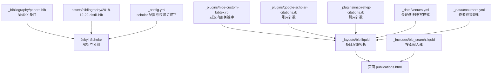
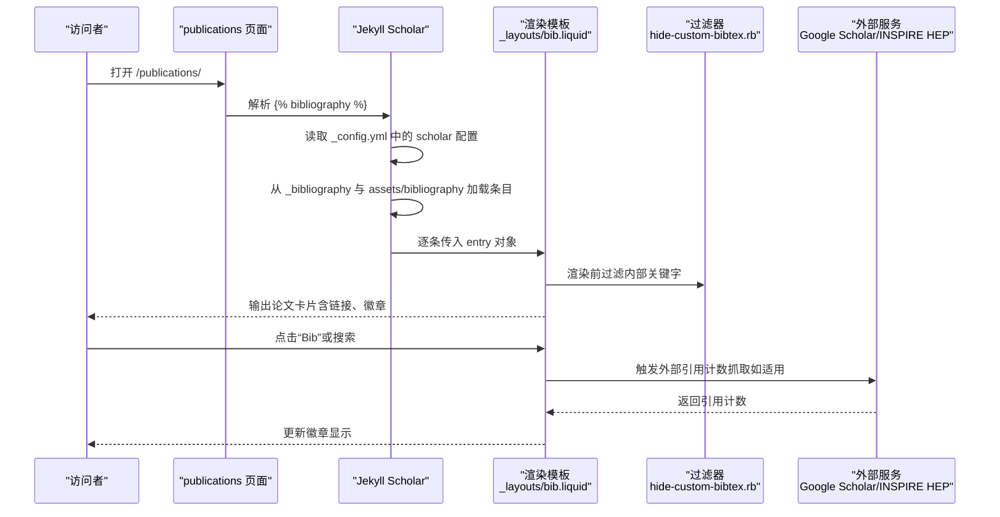
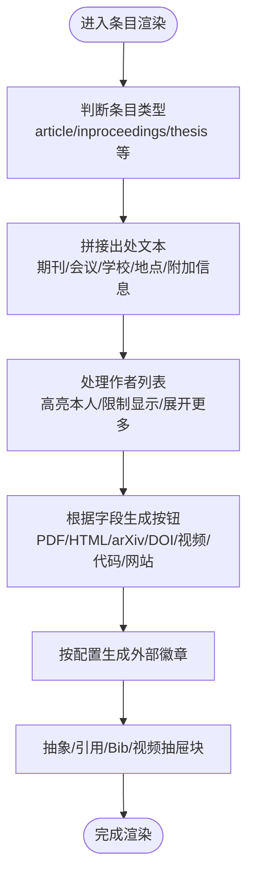
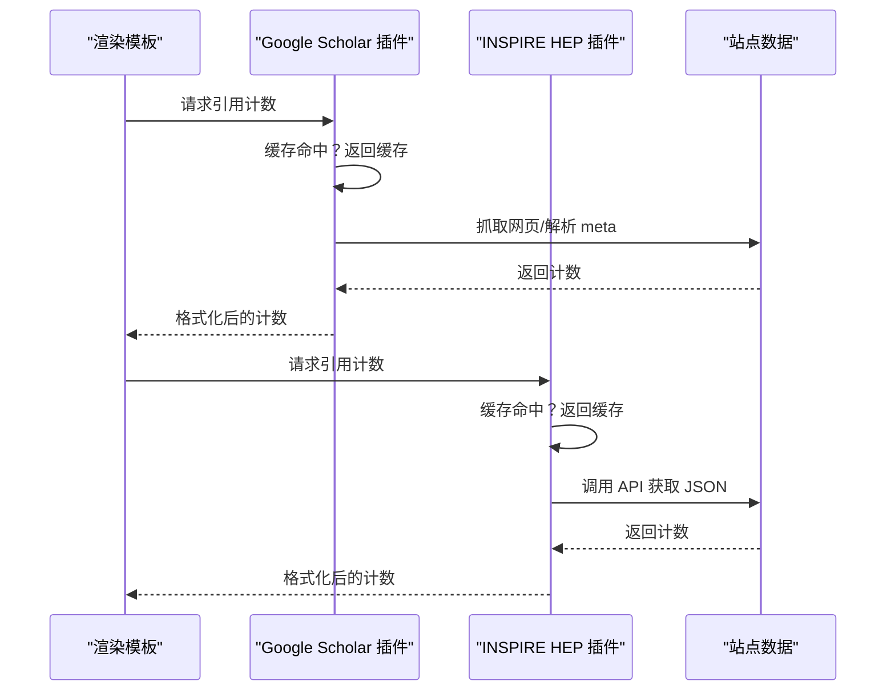
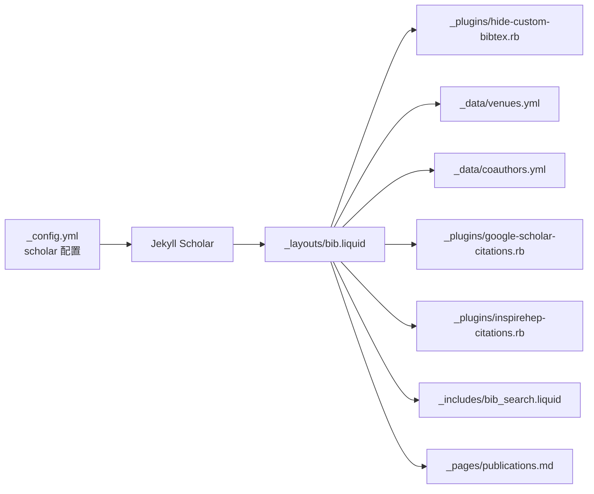

# 论文数据模型

<cite>
**本文引用的文件**
- [papers.bib](file://_bibliography/papers.bib)
- [_config.yml](file://_config.yml)
- [hide-custom-bibtex.rb](file://_plugins/hide-custom-bibtex.rb)
- [bib_search.liquid](file://_includes/bib_search.liquid)
- [bib.liquid](file://_layouts/bib.liquid)
- [google-scholar-citations.rb](file://_plugins/google-scholar-citations.rb)
- [inspirehep-citations.rb](file://_plugins/inspirehep-citations.rb)
- [venues.yml](file://_data/venues.yml)
- [coauthors.yml](file://_data/coauthors.yml)
- [2018-12-22-distill.bib](file://assets/bibliography/2018-12-22-distill.bib)
- [publications.md](file://_pages/publications.md)
- [citation.liquid](file://_includes/citation.liquid)
</cite>

## 目录
1. [引言](#引言)
2. [项目结构](#项目结构)
3. [核心组件](#核心组件)
4. [架构总览](#架构总览)
5. [详细组件分析](#详细组件分析)
6. [依赖关系分析](#依赖关系分析)
7. [性能考量](#性能考量)
8. [故障排查指南](#故障排查指南)
9. [结论](#结论)
10. [附录](#附录)

## 引言
本文件系统化梳理该 Jekyll 站点中的“论文数据模型”，聚焦于 BibTeX 条目在站点中的结构、字段语义、渲染与交互流程、以及与外部服务（如 Google Scholar、INSPIRE HEP）的集成方式。目标是帮助维护者与读者准确理解如何编写、组织与展示论文元数据，并给出跨类型（期刊、会议、预印本等）的一致实践。

## 项目结构
围绕论文数据模型的关键目录与文件如下：
- 数据源：BibTeX 文件位于 _bibliography 与 assets/bibliography
- 配置：Jekyll Scholar 与过滤关键字等在 _config.yml 中定义
- 渲染：通过 _layouts/bib.liquid 将条目渲染为页面卡片
- 过滤：_plugins/hide-custom-bibtex.rb 负责移除内部关键字并清洗作者标注
- 搜索：_includes/bib_search.liquid 提供前端检索入口
- 外部引用计数：_plugins/google-scholar-citations.rb 与 _plugins/inspirehep-citations.rb
- 元数据支持：_data/venues.yml 用于会议/期刊缩写样式；_data/coauthors.yml 支持作者链接
- 页面入口：_pages/publications.md 使用  展示列表

图表来源
- [_config.yml:264-296](file://_config.yml#L264-L296)
- [papers.bib:4-13](file://_bibliography/papers.bib#L4-L13)
- [2018-12-22-distill.bib:1-7](file://assets/bibliography/2018-12-22-distill.bib#L1-L7)
- [bib.liquid:1-396](file://_layouts/bib.liquid#L1-L396)
- [hide-custom-bibtex.rb:1-19](file://_plugins/hide-custom-bibtex.rb#L1-L19)
- [bib_search.liquid:1-5](file://_includes/bib_search.liquid#L1-L5)
- [google-scholar-citations.rb:1-87](file://_plugins/google-scholar-citations.rb#L1-L87)
- [inspirehep-citations.rb:1-58](file://_plugins/inspirehep-citations.rb#L1-L58)
- [venues.yml:1-10](file://_data/venues.yml#L1-L10)
- [coauthors.yml:1-3](file://_data/coauthors.yml#L1-L3)

章节来源
- [_config.yml:264-296](file://_config.yml#L264-L296)
- [publications.md:1-22](file://_pages/publications.md#L1-L22)

## 核心组件
- BibTeX 数据源
  - 主要来源：_bibliography/papers.bib
  - 示例条目展示了会议论文的基本字段与内部关键字
- Jekyll Scholar 配置
  - 指定样式、语言、源目录、文件名、模板、过滤器、分组与查询等
- 渲染模板
  - _layouts/bib.liquid 将条目渲染为卡片，支持缩略图、作者高亮、链接按钮、徽章等
- 关键字过滤
  - _plugins/hide-custom-bibtex.rb 移除内部关键字并清洗作者标注
- 搜索与入口
  - _includes/bib_search.liquid 提供搜索输入框
  - _pages/publications.md 使用  输出列表
- 外部引用计数
  - 通过 Liquid 标签调用插件抓取 Google Scholar 与 INSPIRE HEP 的引用计数
- 元数据支持
  - _data/venues.yml 为会议/期刊缩写提供颜色与链接
  - _data/coauthors.yml 支持作者链接跳转

章节来源
- [papers.bib:4-13](file://_bibliography/papers.bib#L4-L13)
- [_config.yml:264-296](file://_config.yml#L264-L296)
- [bib.liquid:1-396](file://_layouts/bib.liquid#L1-L396)
- [hide-custom-bibtex.rb:1-19](file://_plugins/hide-custom-bibtex.rb#L1-L19)
- [bib_search.liquid:1-5](file://_includes/bib_search.liquid#L1-L5)
- [publications.md:1-22](file://_pages/publications.md#L1-L22)
- [google-scholar-citations.rb:1-87](file://_plugins/google-scholar-citations.rb#L1-L87)
- [inspirehep-citations.rb:1-58](file://_plugins/inspirehep-citations.rb#L1-L58)
- [venues.yml:1-10](file://_data/venues.yml#L1-L10)
- [coauthors.yml:1-3](file://_data/coauthors.yml#L1-L3)

## 架构总览
下图展示从 BibTeX 到页面渲染、搜索与外部服务集成的整体流程。

图表来源
- [publications.md:17-21](file://_pages/publications.md#L17-L21)
- [_config.yml:264-296](file://_config.yml#L264-L296)
- [bib.liquid:190-396](file://_layouts/bib.liquid#L190-L396)
- [hide-custom-bibtex.rb:1-19](file://_plugins/hide-custom-bibtex.rb#L1-L19)
- [google-scholar-citations.rb:1-87](file://_plugins/google-scholar-citations.rb#L1-L87)
- [inspirehep-citations.rb:1-58](file://_plugins/inspirehep-citations.rb#L1-L58)

## 详细组件分析

### BibTeX 条目数据结构与字段语义
- 必需字段
  - author：作者列表，支持多作者；模板会高亮当前研究者并限制显示数量
  - title：论文标题
  - year：发表年份
- 常见类型字段
  - article：使用 journal 字段标识期刊
  - inproceedings/incollection：使用 booktitle 字段标识会议论文集
  - thesis/mastersthesis/phdthesis：使用 school 字段标识机构
- 内部关键字（不对外展示）
  - abbr：会议/期刊缩写，用于徽章与样式
  - bibtex_show：控制是否显示“Bib”按钮
  - selected：用于筛选精选论文
  - abstract：用于显示摘要弹窗
  - preview：缩略图路径或 URL
  - additional_info、annotation、note：附加说明
- 外链与资源
  - pdf、html、website、code、poster、slides、video、blog、supp
  - arxiv、doi、hal、pmid、isbn、eprint、google_scholar_id、inspirehep_id
- 徽章与统计
  - altmetric、dimensions、google_scholar、inspirehep：用于展示外部指标与引用计数

字段作用与格式要点
- 作者格式：支持 LaTeX 风格上标符号（如 *†‡§¶‖&^），模板会清洗并在高亮时保留上标
- 年份与月份：year/month 控制排序与显示；location 可追加会议地点
- 缩略图：preview 支持绝对 URL 或相对 assets/img/publication_preview/ 路径
- 内部关键字：由过滤器统一移除，避免泄露至最终输出

章节来源
- [papers.bib:4-13](file://_bibliography/papers.bib#L4-L13)
- [2018-12-22-distill.bib:1-7](file://assets/bibliography/2018-12-22-distill.bib#L1-L7)
- [_config.yml:297-326](file://_config.yml#L297-L326)
- [bib.liquid:50-188](file://_layouts/bib.liquid#L50-L188)
- [hide-custom-bibtex.rb:3-13](file://_plugins/hide-custom-bibtex.rb#L3-L13)

### 渲染模板与交互流程
- 卡片布局
  - 左侧缩略图与会议/期刊徽章；右侧为标题、作者、出处与日期、按钮区、徽章区
- 作者高亮与展开
  - 当作者数量超过阈值时，仅显示前 N 名，其余以“更多作者”形式点击展开
- 按钮与链接
  - 根据条目字段动态生成 PDF、HTML、arXiv、DOI、视频、代码、网站等按钮
- 抽屉式内容
  - “Bib”“Abs”“Video”等按钮触发隐藏块显示
- 徽章
  - Altmetric、Dimensions、Google Scholar、INSPIRE HEP 按配置启用

图表来源
- [bib.liquid:154-396](file://_layouts/bib.liquid#L154-L396)

章节来源
- [bib.liquid:1-396](file://_layouts/bib.liquid#L1-L396)

### 搜索与过滤
- 搜索入口
  - 在页面中插入搜索框，加载脚本后可实时过滤
- 过滤实现
  - 通过过滤器移除内部关键字，确保搜索与展示一致性

章节来源
- [bib_search.liquid:1-5](file://_includes/bib_search.liquid#L1-L5)
- [hide-custom-bibtex.rb:1-19](file://_plugins/hide-custom-bibtex.rb#L1-L19)

### 外部引用计数集成
- Google Scholar
  - 通过 Liquid 标签抓取“被引次数”，带缓存与随机延时，异常时返回“N/A”
- INSPIRE HEP
  - 通过 API 获取引用计数，同样带缓存与异常处理

图表来源
- [google-scholar-citations.rb:1-87](file://_plugins/google-scholar-citations.rb#L1-L87)
- [inspirehep-citations.rb:1-58](file://_plugins/inspirehep-citations.rb#L1-L58)

章节来源
- [google-scholar-citations.rb:1-87](file://_plugins/google-scholar-citations.rb#L1-L87)
- [inspirehep-citations.rb:1-58](file://_plugins/inspirehep-citations.rb#L1-L58)

### 元数据组织与样式
- 会议/期刊缩写
  - venues.yml 提供 abbr → URL 与颜色映射，用于徽章样式与跳转
- 作者链接
  - coauthors.yml 支持将作者姓名映射到个人主页链接

章节来源
- [venues.yml:1-10](file://_data/venues.yml#L1-L10)
- [coauthors.yml:1-3](file://_data/coauthors.yml#L1-L3)

### 验证规则与错误处理
- 关键字过滤
  - 统一移除内部关键字，避免泄露；同时清洗作者标注符号
- 异常处理
  - 抓取外部引用计数时捕获异常并回退为“N/A”
- 渲染健壮性
  - 模板对缺失字段进行条件判断，避免空值导致的渲染错误

章节来源
- [hide-custom-bibtex.rb:1-19](file://_plugins/hide-custom-bibtex.rb#L1-L19)
- [google-scholar-citations.rb:72-78](file://_plugins/google-scholar-citations.rb#L72-L78)
- [inspirehep-citations.rb:43-49](file://_plugins/inspirehep-citations.rb#L43-L49)
- [bib.liquid:154-188](file://_layouts/bib.liquid#L154-L188)

### 实际案例与最佳实践
- 会议论文（inproceedings）
  - 示例条目展示了 abbr、bibtex_show、selected、abstract 等内部关键字的使用
  - 出处字段使用 booktitle，年份与会议缩写共同决定排序与显示
- 期刊文章（article）
  - 使用 journal 字段标识期刊；可结合 arXiv、DOI 等外链
- 预印本（arXiv 文档）
  - 使用 arXiv 字段与 url 字段指向 PDF
- 最佳实践
  - 保持 author 格式一致，必要时使用上标区分作者身份
  - 合理使用 abbr 与 venues.yml，确保徽章风格统一
  - 仅在需要时开启 bibtex_show，避免信息冗余
  - 为长作者列表设置 max_author_limit，提升可读性
  - 使用 selected 标记精选论文，便于筛选

章节来源
- [papers.bib:4-13](file://_bibliography/papers.bib#L4-L13)
- [2018-12-22-distill.bib:1-7](file://assets/bibliography/2018-12-22-distill.bib#L1-L7)
- [_config.yml:328-330](file://_config.yml#L328-L330)

## 依赖关系分析
- 配置依赖
  - _config.yml 的 scholar 段落定义了数据源、样式、模板、过滤器与分组策略
- 模板依赖
  - _layouts/bib.liquid 依赖过滤器、数据文件（venues.yml、coauthors.yml）与外部插件
- 插件依赖
  - hide-custom-bibtex.rb 依赖 filtered_bibtex_keywords 配置
  - google-scholar-citations.rb 与 inspirehep-citations.rb 依赖网络访问与 JSON 解析
- 页面依赖
  - _pages/publications.md 依赖 _includes/bib_search.liquid 与 Jekyll Scholar

图表来源
- [_config.yml:264-296](file://_config.yml#L264-L296)
- [bib.liquid:1-396](file://_layouts/bib.liquid#L1-L396)
- [hide-custom-bibtex.rb:1-19](file://_plugins/hide-custom-bibtex.rb#L1-L19)
- [venues.yml:1-10](file://_data/venues.yml#L1-L10)
- [coauthors.yml:1-3](file://_data/coauthors.yml#L1-L3)
- [google-scholar-citations.rb:1-87](file://_plugins/google-scholar-citations.rb#L1-L87)
- [inspirehep-citations.rb:1-58](file://_plugins/inspirehep-citations.rb#L1-L58)
- [bib_search.liquid:1-5](file://_includes/bib_search.liquid#L1-L5)
- [publications.md:1-22](file://_pages/publications.md#L1-L22)

章节来源
- [_config.yml:264-296](file://_config.yml#L264-L296)
- [bib.liquid:1-396](file://_layouts/bib.liquid#L1-L396)

## 性能考量
- 缓存策略
  - 外部引用计数插件内置缓存，减少重复抓取
- 渲染优化
  - 限制作者显示数量，避免长列表影响渲染性能
- 过滤成本
  - 关键字过滤在渲染前执行，降低模板内分支判断成本
- 网络请求
  - 抓取外部数据时加入随机延时，降低被限流风险

## 故障排查指南
- “Bib”按钮无内容
  - 检查条目是否设置 bibtex_show；确认过滤器未移除全部内容
- 作者高亮不生效
  - 确认作者姓名与 scholar.last_name/scholar.first_name 匹配；检查上标符号是否被清洗
- 外部徽章不显示
  - 检查对应开关（altmetric、dimensions、google_scholar、inspirehep）是否启用
  - 确认条目提供了必要的 ID（如 google_scholar_id、inspirehep_id）
- 引用计数显示“N/A”
  - 网络异常或目标站点变更；查看插件日志定位具体异常
- 搜索无效
  - 确认已加载搜索脚本；检查浏览器控制台是否有报错

章节来源
- [hide-custom-bibtex.rb:1-19](file://_plugins/hide-custom-bibtex.rb#L1-L19)
- [bib.liquid:190-396](file://_layouts/bib.liquid#L190-L396)
- [google-scholar-citations.rb:72-78](file://_plugins/google-scholar-citations.rb#L72-L78)
- [inspirehep-citations.rb:43-49](file://_plugins/inspirehep-citations.rb#L43-L49)
- [bib_search.liquid:1-5](file://_includes/bib_search.liquid#L1-L5)

## 结论
该论文数据模型以 BibTeX 为核心，通过 Jekyll Scholar 完成解析与分组，再由 _layouts/bib.liquid 进行高度可定制的渲染。内部关键字过滤与外部服务集成保证了展示质量与信息时效性。遵循本文的最佳实践，可在不同论文类型间保持一致的数据结构与用户体验。

## 附录

### 字段清单与用途速查
- 必填：author、title、year
- 类型相关：article 使用 journal；inproceedings/incollection 使用 booktitle；thesis 系列使用 school
- 内部关键字（不对外展示）：abbr、bibtex_show、selected、abstract、preview、additional_info、annotation、note
- 外链与资源：pdf、html、website、code、poster、slides、video、blog、supp、arxiv、doi、hal、pmid、isbn、eprint
- 外部指标：altmetric、dimensions、google_scholar_id、inspirehep_id

章节来源
- [_config.yml:297-326](file://_config.yml#L297-L326)
- [papers.bib:4-13](file://_bibliography/papers.bib#L4-L13)
- [2018-12-22-distill.bib:1-7](file://assets/bibliography/2018-12-22-distill.bib#L1-L7)
- [bib.liquid:154-260](file://_layouts/bib.liquid#L154-L260)