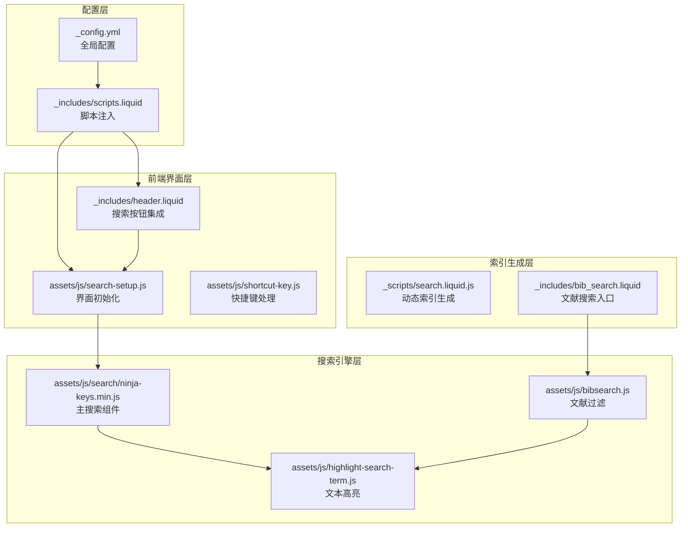
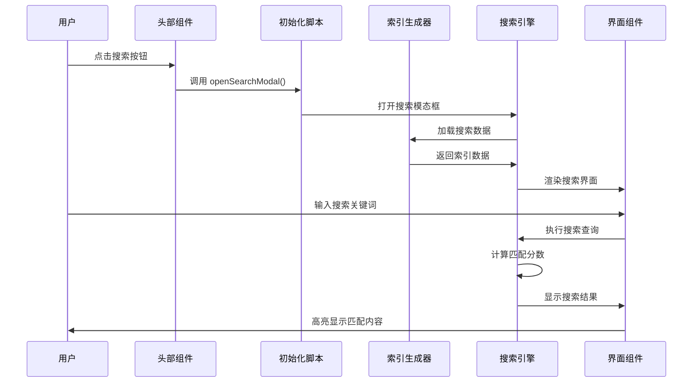
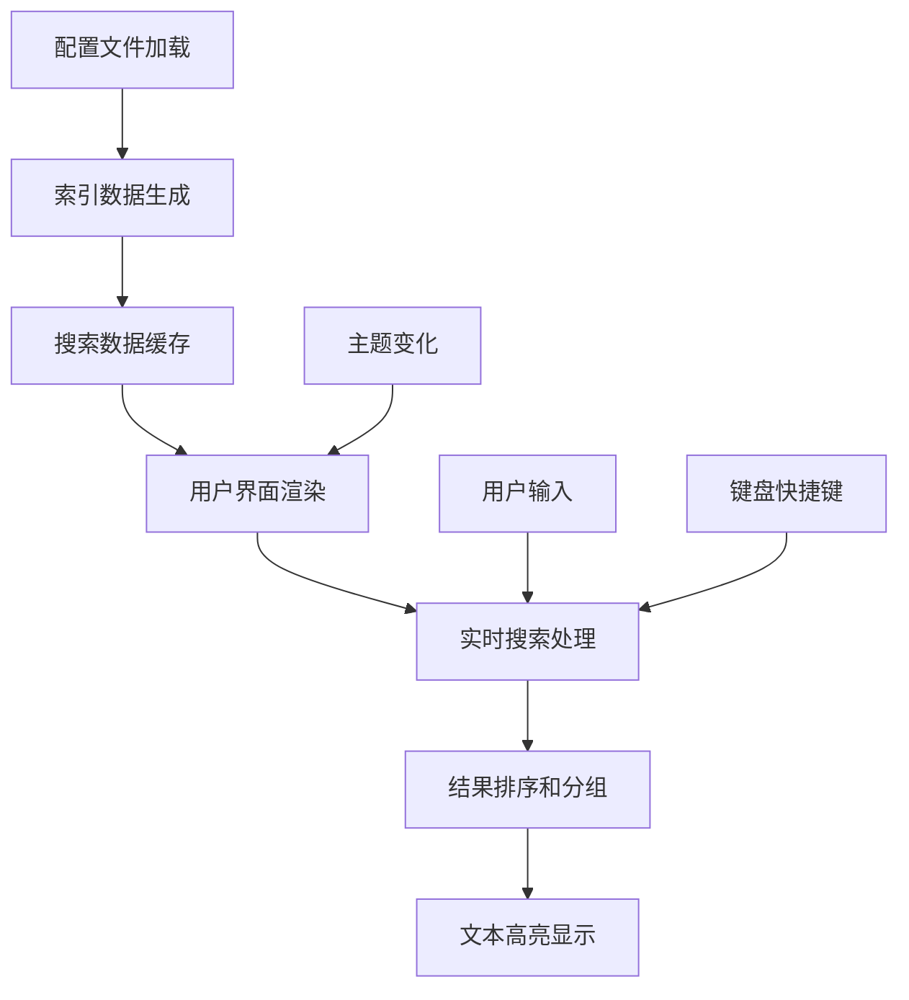
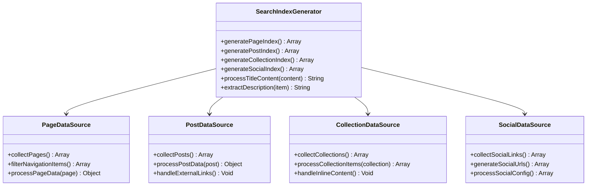
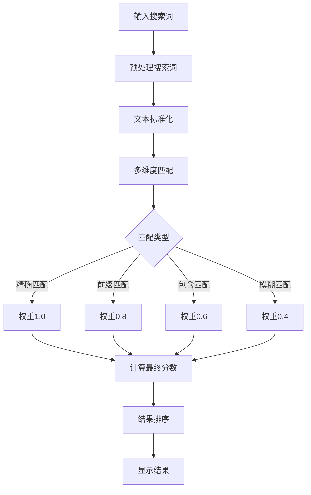
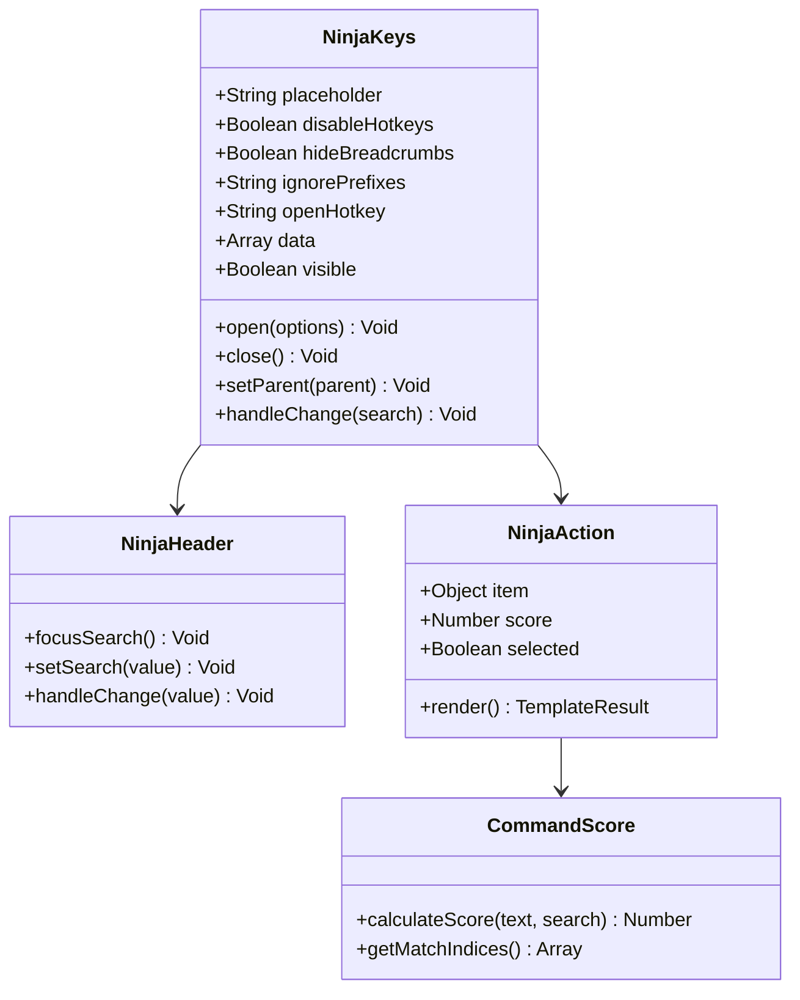
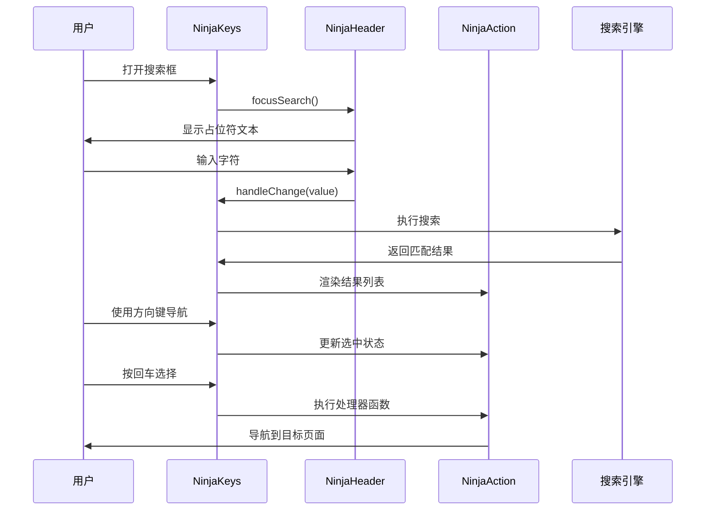
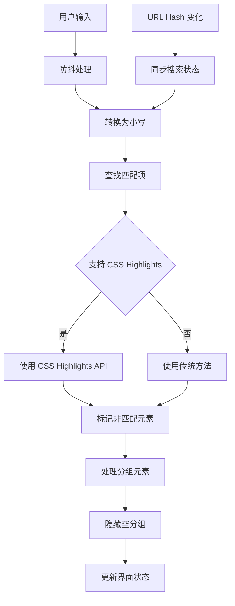
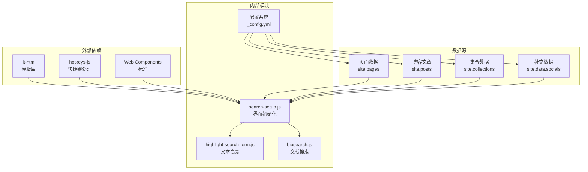
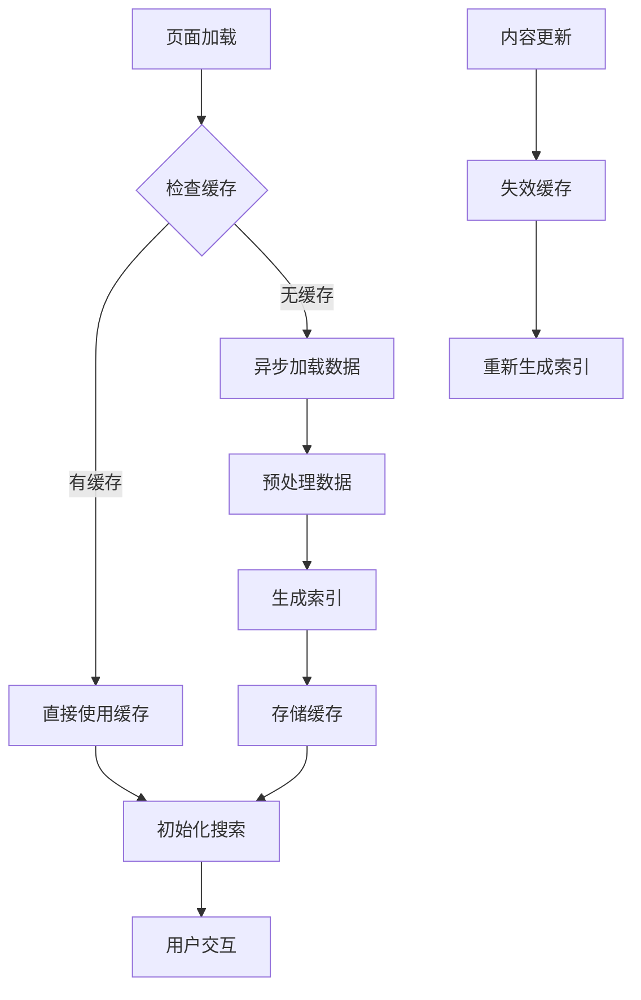

# 搜索功能系统

<cite>
**本文档引用的文件**
- [_scripts/search.liquid.js](file://_scripts/search.liquid.js)
- [assets/js/search-setup.js](file://assets/js/search-setup.js)
- [assets/js/bibsearch.js](file://assets/js/bibsearch.js)
- [assets/js/highlight-search-term.js](file://assets/js/highlight-search-term.js)
- [_includes/scripts.liquid](file://_includes/scripts.liquid)
- [_includes/header.liquid](file://_includes/header.liquid)
- [_includes/bib_search.liquid](file://_includes/bib_search.liquid)
- [_config.yml](file://_config.yml)
- [assets/js/shortcut-key.js](file://assets/js/shortcut-key.js)
</cite>

## 目录
1. [简介](#简介)
2. [项目结构](#项目结构)
3. [核心组件](#核心组件)
4. [架构概览](#架构概览)
5. [详细组件分析](#详细组件分析)
6. [依赖关系分析](#依赖关系分析)
7. [性能考虑](#性能考虑)
8. [故障排除指南](#故障排除指南)
9. [结论](#结论)
10. [附录](#附录)

## 简介

本项目实现了基于 JavaScript 的客户端搜索功能，采用现代 Web 技术构建了一个高效、可定制的全文搜索引擎。该系统支持多种内容类型的搜索，包括页面导航、博客文章、项目集合、学术文献和社交链接。

搜索功能的核心特性包括：
- 基于 Web Components 的现代化搜索界面
- 实时全文索引生成和关键词匹配算法
- 高级搜索结果排序和分组显示
- 自动完成和键盘快捷键支持
- 深度主题集成和响应式设计
- 性能优化的索引缓存机制

## 项目结构

搜索功能系统由多个相互协作的组件组成，分布在项目的不同目录中：

**图表来源**
- [_config.yml:57-60](file://_config.yml#L57-L60)
- [_includes/scripts.liquid:367-374](file://_includes/scripts.liquid#L367-L374)
- [_scripts/search.liquid.js:1-342](file://_scripts/search.liquid.js#L1-L342)

**章节来源**
- [_config.yml:57-60](file://_config.yml#L57-L60)
- [_includes/scripts.liquid:367-374](file://_includes/scripts.liquid#L367-L374)

## 核心组件

### 1. 动态索引生成器

搜索系统的核心是 `_scripts/search.liquid.js` 文件，它负责在构建时动态生成搜索索引数据。该组件能够从多个数据源收集信息并生成统一的搜索索引。

主要功能特性：
- **多数据源聚合**：整合页面、博客文章、项目集合和社交链接
- **条件性索引**：根据配置选项决定是否包含特定类型的内容
- **动态标题处理**：支持嵌入式内容的标题提取和清理
- **描述信息生成**：自动提取和清理描述文本

### 2. 搜索界面组件

使用现代 Web Components 构建的搜索界面，提供了流畅的用户体验和丰富的交互功能。

核心组件包括：
- **ninja-keys 主容器**：提供模态搜索界面和结果展示
- **ninja-header 搜索栏**：支持实时搜索和键盘导航
- **ninja-action 结果项**：格式化显示搜索结果和操作选项

### 3. 文本高亮引擎

`highlight-search-term.js` 提供了高效的文本高亮功能，支持现代浏览器的 CSS Custom Highlight API。

关键特性：
- **智能文本节点遍历**：精确识别包含搜索词的文本节点
- **范围计算优化**：高效计算和管理文本高亮范围
- **降级兼容性**：为不支持新 API 的浏览器提供替代方案

**章节来源**
- [_scripts/search.liquid.js:8-102](file://_scripts/search.liquid.js#L8-L102)
- [assets/js/search-setup.js:1-18](file://assets/js/search-setup.js#L1-L18)
- [assets/js/highlight-search-term.js:42-79](file://assets/js/highlight-search-term.js#L42-L79)

## 架构概览

搜索系统的整体架构采用了分层设计，确保了良好的可维护性和扩展性：

**图表来源**
- [_includes/header.liquid:60-67](file://_includes/header.liquid#L60-L67)
- [assets/js/search-setup.js:10-17](file://assets/js/search-setup.js#L10-L17)
- [_scripts/search.liquid.js:1-342](file://_scripts/search.liquid.js#L1-L342)

### 数据流架构

**图表来源**
- [_config.yml:57-60](file://_config.yml#L57-L60)
- [_scripts/search.liquid.js:1-342](file://_scripts/search.liquid.js#L1-L342)
- [assets/js/bibsearch.js:5-51](file://assets/js/bibsearch.js#L5-L51)

## 详细组件分析

### 搜索索引生成器

#### 数据源聚合策略

索引生成器通过 Liquid 模板语言动态收集来自不同数据源的信息：

**图表来源**
- [_scripts/search.liquid.js:8-102](file://_scripts/search.liquid.js#L8-L102)
- [_scripts/search.liquid.js:103-311](file://_scripts/search.liquid.js#L103-L311)

#### 关键词匹配算法

搜索系统实现了基于分数的智能匹配算法，支持多种匹配模式：

**图表来源**
- [assets/js/search/ninja-keys.min.js:6-38](file://assets/js/search/ninja-keys.min.js#L6-L38)

**章节来源**
- [_scripts/search.liquid.js:8-311](file://_scripts/search.liquid.js#L8-L311)

### 搜索界面组件

#### Web Components 架构

搜索界面基于现代 Web Components 标准构建，提供了高度模块化的组件架构：

**图表来源**
- [assets/js/search/ninja-keys.min.js:38-62](file://assets/js/search/ninja-keys.min.js#L38-L62)

#### 交互逻辑设计

搜索界面提供了丰富的交互体验，包括键盘导航、自动完成和结果高亮：

**图表来源**
- [assets/js/search/ninja-keys.min.js:27-32](file://assets/js/search/ninja-keys.min.js#L27-L32)

**章节来源**
- [assets/js/search-setup.js:1-18](file://assets/js/search-setup.js#L1-L18)
- [assets/js/shortcut-key.js:1-12](file://assets/js/shortcut-key.js#L1-L12)

### 文献搜索模块

#### 高级过滤算法

`bibsearch.js` 实现了复杂的文献搜索和过滤功能，支持层次化的内容组织：

**图表来源**
- [assets/js/bibsearch.js:5-70](file://assets/js/bibsearch.js#L5-L70)

**章节来源**
- [assets/js/bibsearch.js:1-71](file://assets/js/bibsearch.js#L1-L71)
- [assets/js/highlight-search-term.js:42-111](file://assets/js/highlight-search-term.js#L42-L111)

## 依赖关系分析

搜索功能系统涉及多个层面的依赖关系，形成了一个完整的生态系统：

**图表来源**
- [_includes/scripts.liquid:367-374](file://_includes/scripts.liquid#L367-L374)
- [assets/js/search/ninja-keys.min.js:6-38](file://assets/js/search/ninja-keys.min.js#L6-L38)

### 模块间耦合度分析

系统采用了松耦合的设计原则，各模块之间的依赖关系清晰明确：

- **低耦合高内聚**：每个模块专注于特定功能，减少相互依赖
- **接口标准化**：通过统一的数据格式和事件接口进行通信
- **配置驱动**：通过配置文件控制功能开关和行为参数

**章节来源**
- [_config.yml:57-60](file://_config.yml#L57-L60)
- [_includes/scripts.liquid:367-374](file://_includes/scripts.liquid#L367-L374)

## 性能考虑

### 索引缓存策略

搜索系统实现了多层次的缓存机制以优化性能：

1. **构建时缓存**：在 Jekyll 构建阶段生成静态索引文件
2. **运行时缓存**：浏览器端缓存搜索数据和结果
3. **智能刷新**：根据内容变化自动更新缓存

### 异步加载优化

**图表来源**
- [_scripts/search.liquid.js:1-342](file://_scripts/search.liquid.js#L1-L342)

### 内存管理优化

系统采用了多项内存管理技术：
- **惰性加载**：只在需要时加载和处理数据
- **垃圾回收**：及时释放不再使用的对象和事件监听器
- **虚拟滚动**：对大量结果集使用虚拟化技术

## 故障排除指南

### 常见问题诊断

#### 搜索功能无法正常工作

**症状**：搜索框无法打开或搜索无结果

**可能原因**：
1. JavaScript 文件加载失败
2. 配置文件中的搜索开关被禁用
3. 索引数据生成错误

**解决方案**：
1. 检查浏览器控制台是否有 JavaScript 错误
2. 验证 `_config.yml` 中的搜索配置
3. 确认索引文件正确生成

#### 搜索结果不准确

**症状**：搜索结果与预期不符

**可能原因**：
1. 索引数据格式问题
2. 匹配算法配置不当
3. 文本预处理错误

**解决方案**：
1. 检查索引生成过程的日志输出
2. 验证搜索词的预处理规则
3. 测试不同类型的搜索查询

#### 性能问题

**症状**：搜索响应缓慢或内存占用过高

**可能原因**：
1. 索引数据过大
2. 缓存机制失效
3. 重复的 DOM 操作

**解决方案**：
1. 优化索引数据结构
2. 实施更有效的缓存策略
3. 减少不必要的 DOM 操作

**章节来源**
- [_config.yml:57-60](file://_config.yml#L57-L60)
- [assets/js/search-setup.js:1-18](file://assets/js/search-setup.js#L1-L18)

## 结论

本搜索功能系统通过精心设计的架构和先进的技术实现了高性能、易扩展的全文搜索体验。系统的主要优势包括：

1. **现代化技术栈**：基于 Web Components 和现代 JavaScript 标准
2. **高度可定制**：通过配置文件灵活控制搜索行为
3. **优秀的性能表现**：多层缓存和优化的算法设计
4. **良好的用户体验**：直观的界面和流畅的交互

未来可以考虑的功能增强包括：
- 支持更复杂的搜索语法和过滤器
- 实现搜索历史记录和个性化推荐
- 添加搜索统计和分析功能
- 扩展到移动端的优化体验

## 附录

### 配置选项参考

| 配置项 | 类型 | 默认值 | 描述 |
|--------|------|--------|------|
| `search_enabled` | Boolean | true | 启用/禁用全局搜索功能 |
| `posts_in_search` | Boolean | true | 在搜索中包含博客文章 |
| `socials_in_search` | Boolean | true | 在搜索中包含社交链接 |
| `bib_search` | Boolean | true | 启用文献搜索功能 |

### 自定义搜索样式的实现方法

要自定义搜索界面样式，可以通过以下方式：

1. **CSS 变量覆盖**：修改主题变量定义
2. **自定义样式表**：添加额外的 CSS 规则
3. **组件属性调整**：通过 HTML 属性配置外观

### 搜索功能与页面导航的集成

搜索功能与页面导航的集成主要体现在：

1. **统一的快捷键**：使用相同的 `Ctrl+K` 快捷键
2. **一致的主题风格**：继承站点的整体设计语言
3. **无缝的导航体验**：搜索结果可以直接导航到目标页面