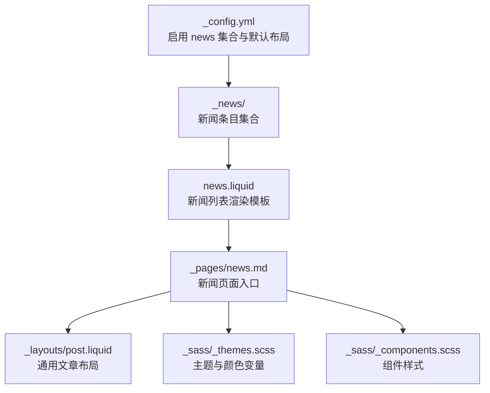
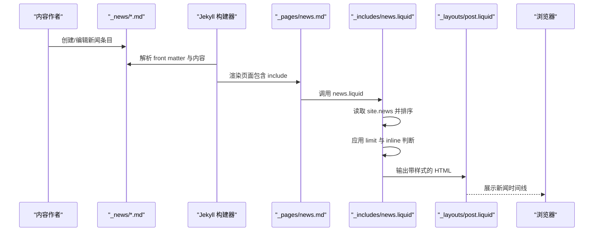
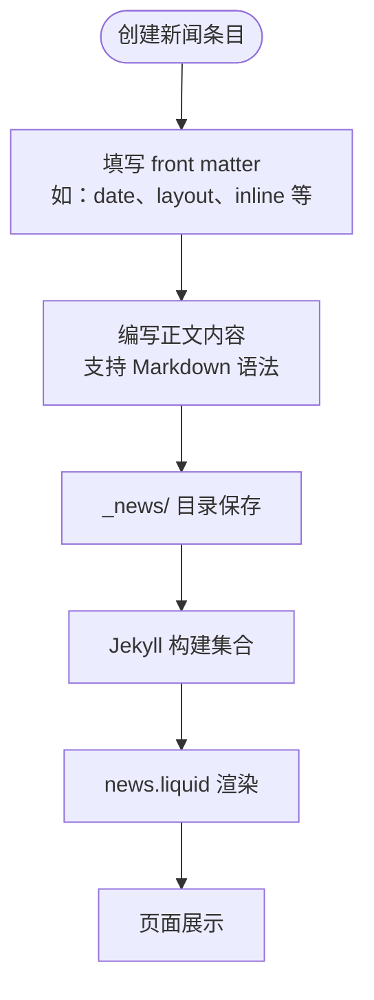
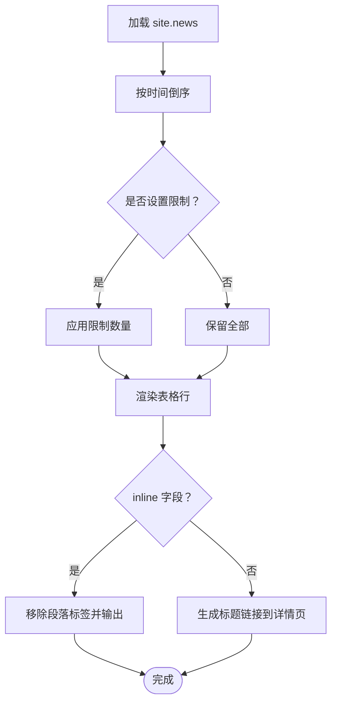
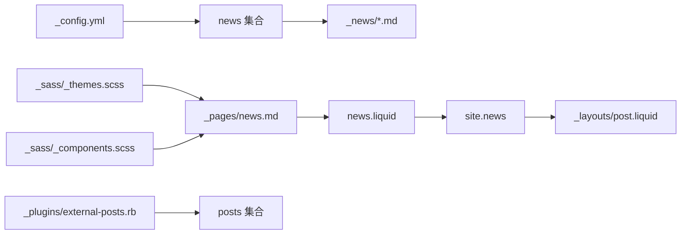

# 新闻公告系统

<cite>
**本文档引用的文件**
- [_config.yml](file://_config.yml)
- [_news/announcement_1.md](file://_news/announcement_1.md)
- [_news/announcement_2.md](file://_news/announcement_2.md)
- [_news/announcement_3.md](file://_news/announcement_3.md)
- [_pages/news.md](file://_pages/news.md)
- [_includes/news.liquid](file://_includes/news.liquid)
- [_layouts/post.liquid](file://_layouts/post.liquid)
- [_plugins/external-posts.rb](file://_plugins/external-posts.rb)
- [CUSTOMIZE.md](file://CUSTOMIZE.md)
- [_sass/_themes.scss](file://_sass/_themes.scss)
- [_sass/_components.scss](file://_sass/_components.scss)
</cite>

## 目录
1. [简介](#简介)
2. [项目结构](#项目结构)
3. [核心组件](#核心组件)
4. [架构总览](#架构总览)
5. [详细组件分析](#详细组件分析)
6. [依赖关系分析](#依赖关系分析)
7. [性能考虑](#性能考虑)
8. [故障排除指南](#故障排除指南)
9. [结论](#结论)
10. [附录](#附录)

## 简介
本文件面向新闻公告系统的使用者与维护者，系统性阐述基于 Jekyll 集合（Collections）的新闻内容管理机制。内容涵盖新闻条目的创建、发布与组织方式；新闻页面的布局设计与显示逻辑（时间线展示、摘要生成与全文链接）；新闻内容的元数据配置（标题、日期、作者、分类等）；新闻条目编写规范与最佳实践（Markdown 语法与图片嵌入）；实际新闻示例与样式定制选项；以及新闻 RSS 订阅功能的配置与使用方法。

## 项目结构
新闻公告系统围绕 Jekyll 的集合机制构建，核心目录与文件如下：
- 配置与集合定义：在站点配置中启用 news 集合并设置默认布局与输出规则
- 新闻内容源：以 Markdown 文件形式存放在集合目录中
- 页面与包含模板：通过页面文件引入包含模板，渲染新闻列表
- 样式与主题：通过 SCSS 变量与组件样式控制新闻区域外观

图表来源
- [_config.yml:145-149](file://_config.yml#L145-L149)
- [_news/announcement_1.md:1-9](file://_news/announcement_1.md#L1-L9)
- [_includes/news.liquid:1-35](file://_includes/news.liquid#L1-L35)
- [_pages/news.md:1-8](file://_pages/news.md#L1-L8)
- [_layouts/post.liquid:1-98](file://_layouts/post.liquid#L1-L98)
- [_sass/_themes.scss:1-209](file://_sass/_themes.scss#L1-L209)
- [_sass/_components.scss:1-200](file://_sass/_components.scss#L1-L200)

章节来源
- [_config.yml:145-149](file://_config.yml#L145-L149)
- [_pages/news.md:1-8](file://_pages/news.md#L1-L8)
- [_includes/news.liquid:1-35](file://_includes/news.liquid#L1-L35)

## 核心组件
- 集合配置与默认行为
  - 在站点配置中启用 news 集合，并设置默认布局为 post，开启集合输出，使每个新闻条目可作为独立页面访问
- 新闻条目
  - 存放于 _news/ 目录，采用标准 Jekyll 前言块（front matter）定义元数据，正文为 Markdown 内容
- 新闻页面与包含模板
  - 页面文件通过 include 指令引入 news.liquid，该模板负责从集合中读取条目、排序、限制数量并渲染表格化的时间线
- 文章布局
  - 使用 post 布局统一渲染标题、元信息（日期、作者、标签、分类）、目录与正文内容
- 外部 RSS 支持插件
  - 提供从外部 RSS 源抓取并注入到 posts 集合的能力，便于扩展新闻来源

章节来源
- [_config.yml:145-149](file://_config.yml#L145-L149)
- [_news/announcement_1.md:1-9](file://_news/announcement_1.md#L1-L9)
- [_pages/news.md:1-8](file://_pages/news.md#L1-L8)
- [_includes/news.liquid:1-35](file://_includes/news.liquid#L1-L35)
- [_layouts/post.liquid:1-98](file://_layouts/post.liquid#L1-L98)
- [_plugins/external-posts.rb:1-125](file://_plugins/external-posts.rb#L1-L125)

## 架构总览
下图展示了新闻从内容创建到页面渲染的整体流程，包括集合读取、模板渲染与样式应用：

图表来源
- [_news/announcement_1.md:1-9](file://_news/announcement_1.md#L1-L9)
- [_pages/news.md:1-8](file://_pages/news.md#L1-L8)
- [_includes/news.liquid:1-35](file://_includes/news.liquid#L1-L35)
- [_layouts/post.liquid:1-98](file://_layouts/post.liquid#L1-L98)

## 详细组件分析

### 新闻集合与条目管理
- 集合启用与默认行为
  - 在配置中启用 news 集合，设置默认布局为 post，开启输出，使每个条目生成独立页面
- 条目格式与元数据
  - 使用标准 front matter 定义日期、布局等；正文为 Markdown，支持图片与富文本
- 示例条目
  - 提供三个示例条目，展示 inline 模式与时间戳配置

图表来源
- [_config.yml:145-149](file://_config.yml#L145-L149)
- [_news/announcement_1.md:1-9](file://_news/announcement_1.md#L1-L9)
- [_news/announcement_2.md:1-9](file://_news/announcement_2.md#L1-L9)
- [_news/announcement_3.md:1-9](file://_news/announcement_3.md#L1-L9)

章节来源
- [_config.yml:145-149](file://_config.yml#L145-L149)
- [_news/announcement_1.md:1-9](file://_news/announcement_1.md#L1-L9)
- [_news/announcement_2.md:1-9](file://_news/announcement_2.md#L1-L9)
- [_news/announcement_3.md:1-9](file://_news/announcement_3.md#L1-L9)

### 新闻页面布局与显示逻辑
- 页面入口
  - 新闻页面通过 front matter 指定布局与永久链接，并在内容中调用 news.liquid 包含模板
- 列表渲染
  - 模板从 site.news 中读取条目，按时间倒序排列；支持根据页面或配置限制显示数量；根据 inline 字段决定直接内联显示还是跳转到详情页
- 时间线展示
  - 使用表格结构展示日期与内容，日期格式化为“月 日, 年”，内容去除段落标签后直接输出，或生成标题链接

图表来源
- [_pages/news.md:1-8](file://_pages/news.md#L1-L8)
- [_includes/news.liquid:1-35](file://_includes/news.liquid#L1-L35)

章节来源
- [_pages/news.md:1-8](file://_pages/news.md#L1-L8)
- [_includes/news.liquid:1-35](file://_includes/news.liquid#L1-L35)

### 元数据配置与字段说明
- 必填字段
  - date：用于排序与时间线展示
  - layout：建议使用 post 以复用文章布局能力
- 常用字段
  - inline：控制是否内联显示
  - related_posts：控制是否显示关联内容（在文章布局中生效）
- 自定义字段
  - 可在集合中自由添加自定义字段并在模板中使用（例如 importance、category 等）

章节来源
- [_news/announcement_1.md:1-9](file://_news/announcement_1.md#L1-L9)
- [_news/announcement_2.md:1-9](file://_news/announcement_2.md#L1-L9)
- [_news/announcement_3.md:1-9](file://_news/announcement_3.md#L1-L9)
- [CUSTOMIZE.md:505-527](file://CUSTOMIZE.md#L505-L527)

### 编写规范与最佳实践
- Markdown 语法
  - 使用标准 Markdown 语法编写正文；支持图片、链接、列表、强调等
- 图片嵌入
  - 将图片放置在资源目录中并通过相对路径引用；注意图片尺寸与懒加载配置
- 标题与日期
  - 保持日期格式一致，便于排序与展示
- 分类与标签
  - 若需要分类/标签归档，可参考博客集合的配置与归档机制

章节来源
- [_includes/news.liquid:1-35](file://_includes/news.liquid#L1-L35)
- [CUSTOMIZE.md:414-421](file://CUSTOMIZE.md#L414-L421)

### 实际新闻示例
以下为仓库中已有的三个新闻条目示例，展示不同时间点与内容类型的新闻条目写法：

- 示例一：2025-01-15
  - 链接：[_news/announcement_1.md:1-9](file://_news/announcement_1.md#L1-L9)
- 示例二：2024-06-01
  - 链接：[_news/announcement_2.md:1-9](file://_news/announcement_2.md#L1-L9)
- 示例三：2024-09-01
  - 链接：[_news/announcement_3.md:1-9](file://_news/announcement_3.md#L1-L9)

章节来源
- [_news/announcement_1.md:1-9](file://_news/announcement_1.md#L1-L9)
- [_news/announcement_2.md:1-9](file://_news/announcement_2.md#L1-L9)
- [_news/announcement_3.md:1-9](file://_news/announcement_3.md#L1-L9)

### 样式定制选项
- 主题与颜色
  - 通过主题 SCSS 变量控制新闻区域的颜色与块级样式，支持明暗主题切换
- 组件样式
  - 新闻列表采用表格组件样式，可结合组件样式进行进一步美化
- 自定义样式
  - 可在主题与组件样式文件中调整新闻区域的字体、间距、边框等

章节来源
- [_sass/_themes.scss:1-209](file://_sass/_themes.scss#L1-L209)
- [_sass/_components.scss:1-200](file://_sass/_components.scss#L1-L200)

### RSS 订阅功能配置与使用
- 内置 RSS 插件
  - 配置中启用了 jekyll-feed 插件，可生成站点的 RSS 源
- 外部 RSS 抓取
  - 提供外部 RSS 抓取插件，可将外部源（RSS 或 URL）的内容注入到 posts 集合中，便于统一管理与展示
- 使用建议
  - 如需将外部新闻纳入统一展示，可在配置中添加 external_sources 并指定 RSS 地址或目标 URL 列表

章节来源
- [_config.yml:46-49](file://_config.yml#L46-L49)
- [_config.yml](file://_config.yml#L202)
- [_plugins/external-posts.rb:1-125](file://_plugins/external-posts.rb#L1-L125)
- [_config.yml:126-130](file://_config.yml#L126-L130)

## 依赖关系分析
- 集合与页面
  - news 集合由配置启用；页面通过 include 引入 news.liquid；news.liquid 读取 site.news
- 布局与渲染
  - 新闻条目使用 post 布局渲染标题、元信息与正文；news.liquid 控制列表展示
- 样式与主题
  - 主题与组件样式文件为新闻区域提供视觉风格
- 外部集成
  - 外部 RSS 抓取插件为 posts 集合提供外部内容注入能力

图表来源
- [_config.yml:145-149](file://_config.yml#L145-L149)
- [_pages/news.md:1-8](file://_pages/news.md#L1-L8)
- [_includes/news.liquid:1-35](file://_includes/news.liquid#L1-L35)
- [_layouts/post.liquid:1-98](file://_layouts/post.liquid#L1-L98)
- [_sass/_themes.scss:1-209](file://_sass/_themes.scss#L1-L209)
- [_sass/_components.scss:1-200](file://_sass/_components.scss#L1-L200)
- [_plugins/external-posts.rb:1-125](file://_plugins/external-posts.rb#L1-L125)

章节来源
- [_config.yml:145-149](file://_config.yml#L145-L149)
- [_pages/news.md:1-8](file://_pages/news.md#L1-L8)
- [_includes/news.liquid:1-35](file://_includes/news.liquid#L1-L35)
- [_layouts/post.liquid:1-98](file://_layouts/post.liquid#L1-L98)
- [_sass/_themes.scss:1-209](file://_sass/_themes.scss#L1-L209)
- [_sass/_components.scss:1-200](file://_sass/_components.scss#L1-L200)
- [_plugins/external-posts.rb:1-125](file://_plugins/external-posts.rb#L1-L125)

## 性能考虑
- 集合输出与页面数量
  - news 集合开启输出会为每个条目生成独立页面，建议控制条目数量或使用分页策略
- 模板渲染复杂度
  - news.liquid 使用简单循环与条件判断，性能开销较低；若条目较多，可通过限制显示数量优化首屏渲染
- 样式与脚本
  - 主题与组件样式为静态资源，构建时压缩；图片懒加载与响应式图片可提升加载性能

## 故障排除指南
- 新闻未显示
  - 检查 news 集合是否在配置中启用且输出开启
  - 确认页面是否正确引入 news.liquid
- 排序异常
  - 确保每条目都包含有效的日期字段，以便正确排序
- 外部 RSS 未抓取
  - 检查 RSS 地址是否可访问，网络请求与解析日志是否有错误
- 样式不生效
  - 确认主题与组件样式文件未被覆盖，检查构建后的 CSS 是否包含相应类名

章节来源
- [_config.yml:145-149](file://_config.yml#L145-L149)
- [_pages/news.md:1-8](file://_pages/news.md#L1-L8)
- [_includes/news.liquid:1-35](file://_includes/news.liquid#L1-L35)
- [_plugins/external-posts.rb:25-35](file://_plugins/external-posts.rb#L25-L35)

## 结论
本新闻公告系统基于 Jekyll 集合实现，具备清晰的内容创建与渲染流程。通过配置集合、编写条目、引入包含模板与应用样式，即可快速搭建一个结构化、可扩展的新闻展示页面。结合内置 RSS 插件与外部 RSS 抓取插件，系统能够灵活整合多源内容，满足多样化的新闻管理需求。

## 附录
- 新增集合步骤
  - 在配置中添加集合项，创建集合目录，编写集合落地页，添加导航链接
- 自定义元数据
  - 在集合条目中添加自定义字段，并在模板中处理与展示
- 样式定制
  - 通过主题与组件样式文件调整新闻区域的视觉风格

章节来源
- [CUSTOMIZE.md:430-503](file://CUSTOMIZE.md#L430-L503)
- [CUSTOMIZE.md:505-527](file://CUSTOMIZE.md#L505-L527)
- [CUSTOMIZE.md:1214-1227](file://CUSTOMIZE.md#L1214-L1227)