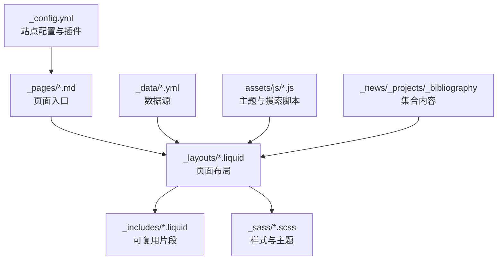
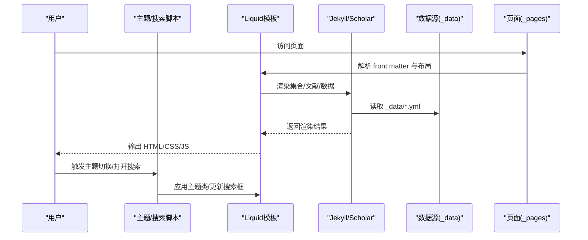
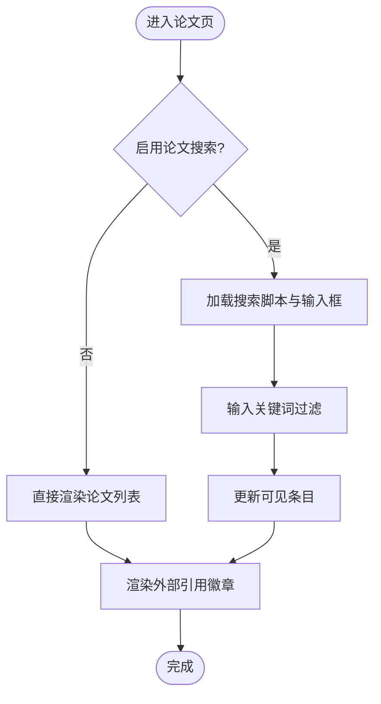
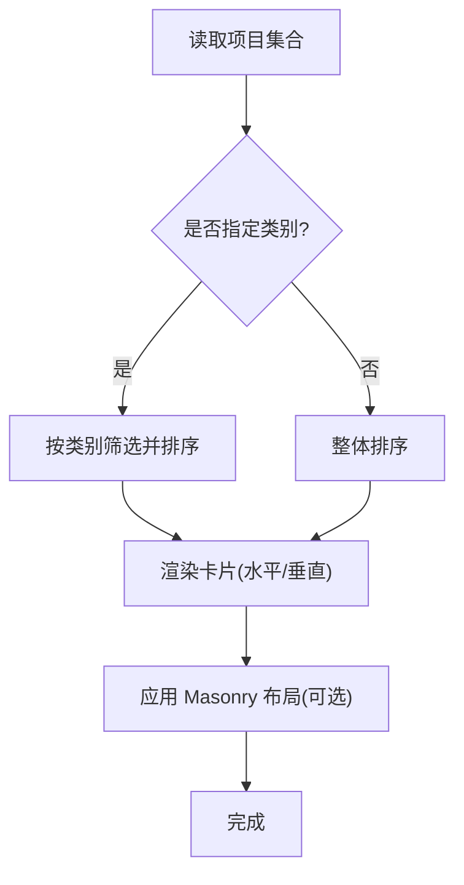
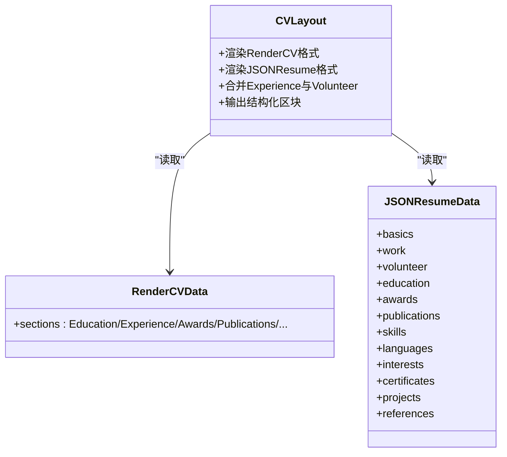
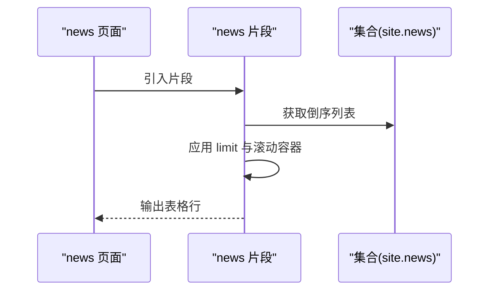
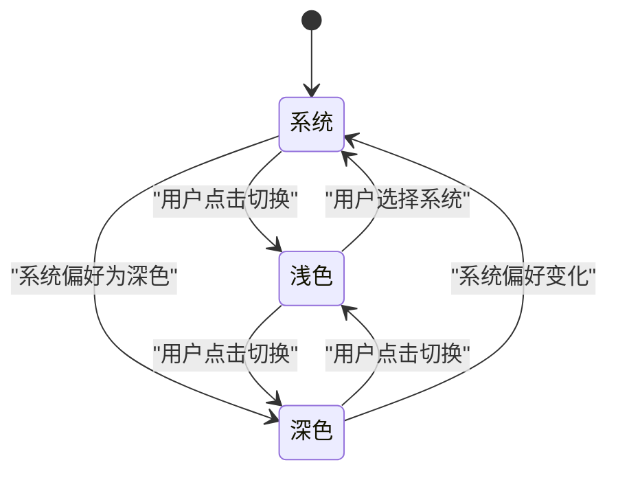
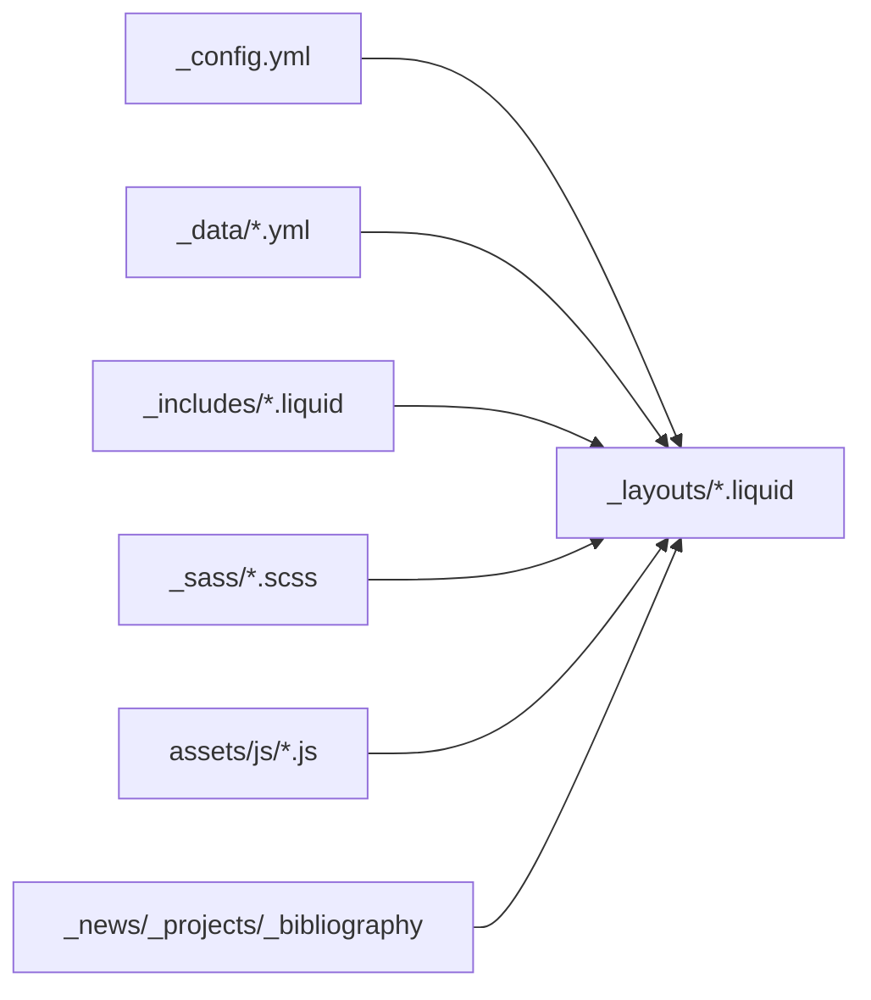

# 核心功能特性

<cite>
**本文档引用的文件**
- [_config.yml](file://_config.yml)
- [README.md](file://README.md)
- [_pages/cv.md](file://_pages/cv.md)
- [_pages/publications.md](file://_pages/publications.md)
- [_pages/projects.md](file://_pages/projects.md)
- [_pages/news.md](file://_pages/news.md)
- [_layouts/cv.liquid](file://_layouts/cv.liquid)
- [_layouts/bib.liquid](file://_layouts/bib.liquid)
- [_includes/bib_search.liquid](file://_includes/bib_search.liquid)
- [_includes/news.liquid](file://_includes/news.liquid)
- [_sass/_themes.scss](file://_sass/_themes.scss)
- [_sass/_publications.scss](file://_sass/_publications.scss)
- [_sass/_cv.scss](file://_sass/_cv.scss)
- [_data/cv.yml](file://_data/cv.yml)
- [_data/socials.yml](file://_data/socials.yml)
- [assets/js/theme.js](file://assets/js/theme.js)
- [assets/js/search-setup.js](file://assets/js/search-setup.js)
</cite>

## 目录
1. [简介](#简介)
2. [项目结构](#项目结构)
3. [核心组件](#核心组件)
4. [架构总览](#架构总览)
5. [详细组件分析](#详细组件分析)
6. [依赖关系分析](#依赖关系分析)
7. [性能考虑](#性能考虑)
8. [故障排除指南](#故障排除指南)
9. [结论](#结论)
10. [附录](#附录)

## 简介
本文件面向李明宇个人学术主页项目，系统梳理并深入解析其核心功能特性与实现方式，包括学术论文展示、项目作品集、个人简历（CV）、新闻公告、多语言支持、响应式设计、搜索功能、主题切换、社交媒体集成等。文档以渐进方式呈现，既适合技术背景用户，也便于非技术读者理解各功能的使用方法与协作关系。

## 项目结构
该站点基于 Jekyll 框架构建，采用 al-folio 主题，通过 Liquid 模板引擎渲染页面内容，并结合 SCSS 样式与 JavaScript 实现交互与主题切换。关键目录与文件职责如下：
- 配置与元数据：_config.yml 定义站点标题、语言、布局、搜索、分析、集合等；_data 存放可复用数据（如 cv.yml、socials.yml）。
- 页面与布局：_pages 下的 Markdown 页面定义导航与内容；_layouts 提供统一布局（如 cv、bib）。
- 内容组织：_news、_projects、_bibliography 等集合用于分类管理内容。
- 样式与主题：_sass 中的主题变量与样式文件控制外观与响应式行为。
- 脚本与交互：assets/js 下的主题切换与搜索初始化脚本。

图表来源
- [_config.yml](file://_config.yml)
- [_pages/publications.md](file://_pages/publications.md)
- [_layouts/bib.liquid](file://_layouts/bib.liquid)
- [_sass/_themes.scss](file://_sass/_themes.scss)

章节来源
- [_config.yml](file://_config.yml)
- [README.md](file://README.md)

## 核心组件
本节概述五大核心功能模块及其在站点中的角色与协作方式：
- 学术论文展示：基于 Jekyll Scholar 自动从 BibTeX 生成论文列表，支持缩略图、作者高亮、链接按钮、外部引用徽章等。
- 项目作品集：按类别组织项目卡片，支持水平/垂直布局、重要性排序与 Masonry 布局。
- 个人简历（CV）：统一渲染 RenderCV 与 JSONResume 两种格式，输出结构化信息与分栏布局。
- 新闻公告：以表格形式展示时间线与标题，支持限制显示数量与滚动容器。
- 多语言支持：通过配置项与页面 front matter 控制语言与导航顺序，配合搜索与评论系统。

章节来源
- [_pages/publications.md](file://_pages/publications.md)
- [_layouts/bib.liquid](file://_layouts/bib.liquid)
- [_pages/projects.md](file://_pages/projects.md)
- [_pages/cv.md](file://_pages/cv.md)
- [_layouts/cv.liquid](file://_layouts/cv.liquid)
- [_pages/news.md](file://_pages/news.md)
- [_includes/news.liquid](file://_includes/news.liquid)
- [_config.yml](file://_config.yml)

## 架构总览
下图展示了从用户访问到页面渲染的关键流程，涵盖主题切换、搜索初始化、论文渲染与数据加载等环节：

图表来源
- [_layouts/bib.liquid](file://_layouts/bib.liquid)
- [_layouts/cv.liquid](file://_layouts/cv.liquid)
- [assets/js/theme.js](file://assets/js/theme.js)
- [assets/js/search-setup.js](file://assets/js/search-setup.js)

## 详细组件分析

### 学术论文展示（Publications）
- 数据来源与渲染
  - 使用 Jekyll Scholar 插件从 _bibliography 目录读取 BibTeX 文件，按配置生成论文条目。
  - 每个条目渲染为卡片，包含标题、作者、期刊/会议信息、摘要/DOI/arXiv/代码/视频等链接。
  - 支持作者高亮（识别自身）、作者数量限制与“查看更多作者”动画效果。
  - 可选缩略图与外部引用徽章（Altmetric、Dimensions、Google Scholar、INSPIRE-HEP）。
- 搜索与过滤
  - 在论文页启用搜索输入框，动态过滤论文标题与作者。
- 样式与交互
  - 响应式布局，支持摘要/视频等隐藏块展开。
  - 主题切换时自动适配链接按钮、徽章与表格样式。

图表来源
- [_pages/publications.md](file://_pages/publications.md)
- [_includes/bib_search.liquid](file://_includes/bib_search.liquid)
- [_layouts/bib.liquid](file://_layouts/bib.liquid)
- [_sass/_publications.scss](file://_sass/_publications.scss)

章节来源
- [_pages/publications.md](file://_pages/publications.md)
- [_layouts/bib.liquid](file://_layouts/bib.liquid)
- [_includes/bib_search.liquid](file://_includes/bib_search.liquid)
- [_sass/_publications.scss](file://_sass/_publications.scss)

### 项目作品集（Projects）
- 组织与展示
  - 支持按类别（如 research、engineering）分组展示，每组标题与卡片列表清晰分离。
  - 通过 importance 字段排序，支持水平/垂直两种布局，结合 Masonry 自动排列。
- 集成与配置
  - 通过页面 front matter 的 display_categories 控制展示类别。
  - 可选 horizontal 参数切换布局模式。

图表来源
- [_pages/projects.md](file://_pages/projects.md)

章节来源
- [_pages/projects.md](file://_pages/projects.md)

### 个人简历（CV）
- 格式支持
  - 同时支持 RenderCV（YAML）与 JSONResume（JSON）两种格式，优先级与选择逻辑由页面 front matter 与全局配置决定。
  - RenderCV：从 _data/cv.yml 读取 sections 并统一渲染，合并 Experience 与 Volunteer。
  - JSONResume：从 _data/resume 读取 basics、work、volunteer、education 等字段并映射到对应区块。
- 结构化展示
  - 联系信息、专业摘要、教育背景、工作/志愿经历、奖项荣誉、出版物、技能、语言、兴趣、证书、项目、推荐人等。
  - 统一的表格与列表样式，支持锚点跳转与目录样式。

图表来源
- [_layouts/cv.liquid](file://_layouts/cv.liquid)
- [_data/cv.yml](file://_data/cv.yml)

章节来源
- [_pages/cv.md](file://_pages/cv.md)
- [_layouts/cv.liquid](file://_layouts/cv.liquid)
- [_data/cv.yml](file://_data/cv.yml)
- [_sass/_cv.scss](file://_sass/_cv.scss)

### 新闻公告（News）
- 展示方式
  - 以表格形式列出最近公告，支持限制数量与滚动容器，日期格式化为“月 日, 年”。
  - 支持内联内容或标题链接至详情页。
- 集成位置
  - 在 _pages/news.md 中通过 _includes/news.liquid 片段渲染。

图表来源
- [_pages/news.md](file://_pages/news.md)
- [_includes/news.liquid](file://_includes/news.liquid)

章节来源
- [_pages/news.md](file://_pages/news.md)
- [_includes/news.liquid](file://_includes/news.liquid)

### 多语言支持
- 全局语言设置
  - 通过 _config.yml 的 lang 字段设置默认语言（如 en），影响站点元数据与部分插件行为。
- 页面级语言控制
  - 通过页面 front matter 的 lang 字段覆盖默认语言，用于特定页面的本地化。
- 导航与排序
  - 通过 nav_order 控制导航顺序，结合导航数据源实现多语言导航。

章节来源
- [_config.yml](file://_config.yml)
- [_pages/publications.md](file://_pages/publications.md)
- [_pages/projects.md](file://_pages/projects.md)
- [_pages/cv.md](file://_pages/cv.md)

### 响应式设计
- 布局与网格
  - 使用 Bootstrap 网格系统实现项目卡片的行列自适应，支持小屏单列、中屏双列、大屏三列。
- 样式变量
  - 主题变量集中于 _sass/_themes.scss，通过 CSS 变量与媒体查询实现跨设备一致体验。
- 图片与缩略图
  - 发表物缩略图与项目预览图采用懒加载与响应式尺寸，提升移动端加载性能。

章节来源
- [_sass/_themes.scss](file://_sass/_themes.scss)
- [_sass/_publications.scss](file://_sass/_publications.scss)
- [_sass/_cv.scss](file://_sass/_cv.scss)

### 搜索功能
- 功能特性
  - 论文页启用搜索输入框，实时过滤结果；搜索主题随站点主题切换。
  - 搜索初始化脚本根据当前主题添加/移除 ninja-keys 的 dark 类，确保视觉一致性。
- 技术实现
  - 通过 _includes/bib_search.liquid 注入搜索组件与脚本，结合前端过滤逻辑实现无刷新搜索。

章节来源
- [_includes/bib_search.liquid](file://_includes/bib_search.liquid)
- [assets/js/search-setup.js](file://assets/js/search-setup.js)

### 主题切换
- 切换机制
  - 支持系统、浅色、深色三种模式，状态保存在 localStorage 并持久化。
  - 切换时自动更新 CSS 变量、表格主题、Mermaid/Plotly/ECharts/Vega 主题，以及评论区与搜索组件主题。
- 用户体验
  - 切换过程带过渡动画，适配 Google Calendar 嵌入背景色，确保跨组件一致性。

图表来源
- [assets/js/theme.js](file://assets/js/theme.js)
- [_sass/_themes.scss](file://_sass/_themes.scss)

章节来源
- [assets/js/theme.js](file://assets/js/theme.js)
- [_sass/_themes.scss](file://_sass/_themes.scss)

### 社交媒体集成
- 数据来源
  - 社交账号与邮箱等信息存储于 _data/socials.yml，供页面与布局引用。
- 展示位置
  - 可在简历、关于页或页眉/页脚中展示社交链接，便于访客联系与关注。

章节来源
- [_data/socials.yml](file://_data/socials.yml)
- [_layouts/cv.liquid](file://_layouts/cv.liquid)

## 依赖关系分析
- 配置驱动：_config.yml 决定站点语言、布局、搜索开关、集合类型、Scholar 行为与第三方库版本。
- 数据驱动：_data/*.yml 为 CV 与社交信息提供结构化数据；集合目录（_news、_projects、_bibliography）承载内容。
- 模板驱动：_layouts/*.liquid 将数据与片段组合为最终页面；_includes/*.liquid 提供可复用 UI 片段。
- 样式驱动：_sass/*.scss 通过变量与混入统一风格，支持主题切换与响应式断点。
- 脚本驱动：assets/js/*.js 负责主题切换、搜索初始化与第三方组件主题同步。

图表来源
- [_config.yml](file://_config.yml)
- [_layouts/cv.liquid](file://_layouts/cv.liquid)
- [_sass/_themes.scss](file://_sass/_themes.scss)

章节来源
- [_config.yml](file://_config.yml)

## 性能考虑
- 资源优化
  - 启用压缩与缓存策略，减少传输体积；图片懒加载与响应式 WebP 生成提升加载速度。
- 渲染优化
  - Masonry 自动排列减少手动定位开销；集合分页与限制显示数量避免一次性渲染过多节点。
- 主题切换
  - 仅更新 CSS 变量与必要组件主题，避免全站重绘。

## 故障排除指南
- 论文未显示或搜索无效
  - 检查 _config.yml 中 scholar 配置与 _bibliography 路径；确认页面启用了论文搜索片段。
- CV 未渲染或字段缺失
  - 确认 _data/cv.yml 或 _data/resume 对应格式已正确配置；检查页面 cv_format 设置。
- 主题切换异常
  - 清理浏览器缓存与 localStorage，确认主题脚本加载顺序与 CSS 变量定义完整。
- 搜索框不出现
  - 确认 _config.yml 中 search_enabled 与 bib_search 已启用，且页面引入了搜索片段。

章节来源
- [_config.yml](file://_config.yml)
- [_pages/publications.md](file://_pages/publications.md)
- [_pages/cv.md](file://_pages/cv.md)
- [assets/js/theme.js](file://assets/js/theme.js)
- [assets/js/search-setup.js](file://assets/js/search-setup.js)

## 结论
本学术主页通过模块化设计与数据驱动渲染，实现了论文、项目、简历、新闻与主题切换等核心能力的有机整合。借助 al-folio 主题与 Jekyll 生态，项目在保持简洁的同时具备良好的扩展性与可维护性，能够满足不同用户群体对学术主页的功能需求与体验期望。

## 附录
- 功能演示截图与使用示例
  - 论文页：展示论文列表、作者高亮、链接按钮与徽章；支持搜索过滤。
  - 项目页：按类别展示项目卡片，支持水平/垂直布局与 Masonry 排列。
  - CV 页：统一渲染 RenderCV/JSONResume，结构化展示教育、工作、技能、语言等信息。
  - 新闻页：表格化公告列表，支持限制数量与滚动容器。
  - 主题切换：系统/浅色/深色三态切换，跨组件主题同步。
- 使用建议
  - 根据目标受众选择合适的语言与导航顺序；合理组织论文与项目分类。
  - 定期更新数据源与集合内容，确保信息时效性与准确性。
  - 结合分析与 SEO 配置，提升站点可见性与用户体验。